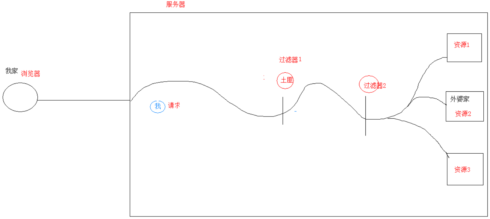

# Filter 过滤器

## 基本介绍

- 当访问服务器的资源时，过滤器可以将请求拦截下来，完成一些特殊的功能
- **一般用于完成通用的操作**
  - 如：**登录验证**、**统一编码处理**、**敏感字符过滤**...



## 使用步骤

1. 定义一个类，实现接口`Filter`（`javax.servlet`包的接口`Filter`）
2. 复写方法
3. 配置拦截路径
   - `web.xml`配置
   - 注解配置

```java
@WebFilter("/*") // 注解配置拦截路径, 假设访问所有资源之前, 都会执行该过滤器
public class FilterDemo implements Filter {
    @Override
    public void init(FilterConfig filterConfig) throws ServletException {
        
    }
    
    @Override
    public void doFilter(ServletRequest servletRequest, ServletResponse servletResponse, FilterChain filterChain) throws IOException, ServeltException {
        ...
        // 过滤器放行
        filterChain.doFilter(servletRequest, servletResponse);
    }
    
    @Override
    public void destroy() {
        
    }
}
```

## Filter 细节

### web.xml 配置

```xml
<filter>
    <!-- 自定义过滤器Filter的名字 -->
    <filter-name>demo</filter-name>
    <!-- 实现了接口Filter的类的全类名 -->
    <filter-class>FilterDemo</filter-class>
</filter>
<filter-mapping>
    <!-- 自定义过滤器Filter的名字 -->
    <filter-name>demo</filter-name>
    <!-- 拦截路径 -->
    <!-- 这里假设拦截所有资源路径 -->
    <url-pattern>/*</url-pattern>
</filter-mapping>
```

### Filter 执行流程

1. 执行过滤器
2. 执行放行后的资源
3. 回来执行过滤器放行代码下边的代码

### Filter 生命周期方法

- `init`：服务器启动后，会创建`Filter`对象，然后调用`init`方法；**只执行一次，用于加载资源**
- `doFilter`：每一次请求被拦截资源时，会调用`doFilter`方法；**可执行多次**
- `destroy`：服务器关闭后，`Filter`对象被销毁，如果服务器被正常关闭，则会调用`destroy`方法；**只执行一次，用于释放资源**

### Filter 拦截路径配置

- 具体资源路径：`/index.jsp`，只有访问`index.jsp`资源时，过滤器才会被执行
- 拦截目录：`/user/*`，访问`/user`下的所有资源时，过滤器都会被执行
- 后缀名拦截：`*.jsp`，访问所有后缀名为`jsp`资源时，过滤器都会被执行
- 拦截所有资源：`/*`，访问所有资源时，过滤器都会被执行

### Filter 拦截方式配置

*资源被访问的方式*

- 注解配置：设置`dispatcherTypes`属性

  ```java
  @WebFilter(value = "/*", dispatcherTypes = DispatcherType.REQUEST) // 设置一种访问方式
  @WebFilter(value = "/*", dispatcherTypes = {Dispatcher.REQUEST, DispatcherType.FORWARD}) // 设置多种访问方式
  ```

  - `REQUEST`，默认值，浏览器直接请求资源时，过滤器会被执行
  - `FORWARD`：转发访问资源时，过滤器会被执行
  - `INCLUDE`：包含访问资源时，过滤器会被执行
  - `ERROR`：错误跳转资源时，过滤器会被执行
  - `ASYNC`：异步访问资源时，过滤器会被执行

- `web.xml`配置

  - 在`<filter-mapping>`内设置`<dispatcher></dispatcher>`

### 过滤器链（配置多个过滤器）

- 执行顺序：假设有两个过滤器，过滤器1和过滤器2
  1. 过滤器1被执行
  2. 过滤器2被执行
  3. 资源执行
  4. 返回过滤器2
  5. 返回过滤器1
- 过滤器先后顺序问题
  1. 注解配置：按照类名的字符串比较规则，值小的先执行
     - 如：`AFilter`和`BFilter`，`AFilter`先被执行
  2. `web.xml`配置：`<filter-mapping>`内谁先定义，谁先被执行

# Listener 监听器

## 事件监听机制

- 事件：一件事情
- 事件源 ：事件发生的地方
- 监听器 ：一个对象
- 注册监听：将事件、事件源、监听器绑定在一起；当事件源上发生某个事件后，执行监听器代码

## ServeletContextListener 接口

- 监听`ServletContext`对象的创建和销毁

### 方法

- `void contextDestroyed(ServletContextEvent sce)`：`ServletContext`对象被销毁之前会调用该方法
- `void contextInitialized(ServletContextEvent sce)`：`ServletContext`对象创建后会调用该方法

### 步骤

1. 定义一个类，实现`ServletContextListener`接口

2. 重载方法

3. 配置

   - 注解配置：`@WebListener`

   - `web.xml`配置

     ```xml
     <listener>
         <listener-class>全类名</listener-class>
     </listener>
     ```

     ```xml
     <!-- 指定初始化参数 -->
     <context-param>
         <param-name>自定义名</param-name>
         <param-value>xml文件路径</param-value>
     </context-param>
     ```