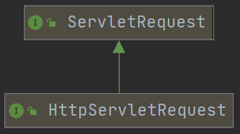

# 基本介绍

- Hyper Text Transfer Protocol 超文本传输协议
- 特点
  1. 基于 TCP/IP 的高级协议
  2. **默认端口号：`80`**
  3. **基于请求/响应模型：一次请求对应一次响应**
  4. 无状态的：每次请求之间相互独立，不能交互数据
- 历史版本
  - 1.0版本：每一次请求响应都会建立新的连接
  - 1.1版本：复用连接

# 请求消息

**客户端发送给服务器端的数据**

```html
<!-- 字符串格式 -->
POST /login.html	HTTP/1.1
Host: localhost
User-Agent: Mozilla/5.0 (Windows NT 6.1; Win64; x64; rv:60.0) Gecko/20100101 Firefox/60.0
Accept: text/html,application/xhtml+xml,application/xml;q=0.9,*/*;q=0.8
Accept-Language: zh-CN,zh;q=0.8,zh-TW;q=0.7,zh-HK;q=0.5,en-US;q=0.3,en;q=0.2
Accept-Encoding: gzip, deflate
Referer: http://localhost/login.html
Connection: keep-alive
Upgrade-Insecure-Requests: 1
		
username=zhangsan
```

## 请求行

- 格式：请求方式 请求URL 请求协议/版本

  ```html
  GET /login.html HTTP/1.1
  ```

- 请求方式：HTTP 协议中有7种请求方式，常用的有2种

  1. `GET`
     - 请求参数在请求行中，在URL后（**没有请求体**）
     - 请求的 URL 长度有限制
     - 不太安全
  2. `POST`
     - 请求参数在请求体中
     - 请求的 URL 长度无限制
     - 相对安全

## 请求头

客户端浏览器告知服务器的一些消息

- 格式：请求头名称：请求头值
- 常见的请求头名称
  1. `User-Agent`：浏览器告知服务器，**当前请求使用的浏览器版本信息**；可以在服务器端获取该头的信息，**解决浏览器的兼容性问题**
  2. `Referer`：告知服务器，当前请求的来源；作用是防盗链、统计数量

## 请求空行

- 用于分隔`POST`请求的请求头、请求体

## 请求体（正文）

- 封装`POST`请求消息的请求参数
- 键值对格式：键=值

# Request

## Request 对象和 Response 对象的原理

- `Request`和`Response`对象是由服务器创建的，程序员来使用它们
- `Request`对象是用于获取请求消息，`Response`对象是用于设置响应消息

## Request 对象继承体系结构



## Request 功能

1. 获取请求消息数据
   - 获取请求行消息
   - 获取请求头消息
   - 获取请求体消息
2. **其他功能**
   - 获取请求参数通用方式
   - 请求转发
   - 共享数据
   - 获取`ServletContext`

## 获取请求行消息

`GET /httpdemo/demo1?name=zhangsan HTTP/1.1`

1. 获取请求方式 ：`String getMethod()` --> `GET`
2. **获取虚拟目录**：`String getContextPath()` --> `/httpdemo`
3. 获取Servlet路径：`String getServletPath()` --> `/demo1`
4. 获取`GET`方式的请求参数：`String getQueryString()` --> `name=zhangsan`
5. **获取请求 URI**：`String getRequestURI()` --> `/httpdemo/demo1`
   - URI：统一资源标识符
   - URL：统一资源定位符
   - 囊括范围：URI > URL
6. 获取请求 URL：`StringBuffer getRequestURL()` --> `http://localhost/httpdemo/demo1`
7. 获取协议及版本：`String getProtocol()` --> `HTTP/1.1`
8. 获取客户端的 IP 地址：`String getRemoteAddr()`

## 获取请求头数据

1. **`String getHeader(String name)`：通过请求头的名称获取请求头的值**
2. `Enumeration<String> getHeaderNames()`：获取所有的请求头名称

## 获取请求体数据

- 只有`POST`请求方式才有请求体，在请求体中封装了`POST`请求的请求参数
- 步骤

  1. 获取流对象
     - `BufferedReader getReader()`：获取字符输入流，只能操作字符数据
     - `ServletInputStream getInputStream()`：获取字节输入流，可以操作所有类型数据
  2. 再从流对象中拿数据

## 获取请求参数通用方式

- **不论`GET`还是`POST`请求方式都可以使用下列方法来获取请求参数**

1. **`String getParameter(String name)`：根据参数名称获取参数值**
2. `String[] getParameterValues(String name)`：根据参数名称获取参数值的数组
3. `Enumeration<String> getParameterNames()`：获取所有请求的参数名称
4. **`Map<String,String[]> getParameterMap()`：获取所有参数的`Map`集合**
   - 可使用`BeanUtils`工具类封装`Map`集合到对应的`JavaBean`对象

- **中文乱码问题**
  
  - `GET`方式：tomcat8 已解决`GET`方式乱码问题
  
  - `POST`方式：**在获取参数前**，设置`Request`的编码
  
    ```java
    request.setCharacterEncoding("utf-8");
    ```
  
## 请求转发 forward

- 一种在**服务器内部**的资源跳转方式

- 步骤

  1. 通过`Request`对象获取请求转发器对象：`RequestDispatcher getRequestDispatcher(String path)`
  2. 使用`RequestDispatcher`对象来进行转发：`forward(ServletRequest request, ServletResponse response)`

  ```java
  request.getRequestDispatcher("跳转的资源路径").forward(request, response); 
  ```

- 特点

  1. 浏览器地址栏路径在资源跳转时不发生变化
  2. 只能转发到当前服务器内部资源中
  3. 转发是一次请求，可以使用`Request`对象来共享数据

## 共享数据

- 域对象：有作用范围的对象，其可以在范围内共享数据
- `Request`域：代表一次请求的范围，一般用于**在请求转发的多个资源中共享数据**
- 方法
  1. `void setAttribute(String name,Object obj)`：存储数据
  2. `Object getAttitude(String name)`：通过键获取值
  3. `void removeAttribute(String name)`：通过键移除键值对

# 响应消息

**服务器端发送给客户端的数据**

```html
<!-- 字符串格式 -->
HTTP/1.1 200 OK
Content-Type: text/html;charset=UTF-8
Content-Length: 101
Date: Wed, 06 Jun 2018 07:08:42 GMT

<html>
	<head>
		<title>$Title$</title>
	</head>
	<body>
		hello , response
	</body>
</html>
```

## 响应行

- 格式：协议/版本 响应状态码 状态码描述

  ```html
  HTTP/1.1 200 OK
  ```

- 响应状态码：服务器告诉客户端浏览器本次请求和响应的状态

  - 状态码都是3位数字
  - 分类
    - 1XX：服务器接收客户端消息，但没有接受完成，等待一段时间后，发送1XX状态码
    - 2XX：成功。如：200
    - 3XX：重定向。如：302（重定向）、304（访问缓存）
    - 4XX：客户端错误。如：404（请求路径没有对应的资源）、405（请求方式没有对应的`doXxx`方法）
    - 5XX：服务器端错误。代表：500（服务器内部出现异常）

## 响应头

服务器告知客户端的一些消息

- 格式：响应头名称：响应头值
- 常见的响应头名称
  1. `Content-Type`：服务器告诉客户端本次响应体的数据格式以及编码格式
  2. `Content-disposition`：服务器告诉客户端以什么格式打开响应体数据
     - `in-line`：默认值，在当前页面内打开响应体
     - `attachment;filename=xxx`：以附件形式形式打开响应体，文件下载

## 响应空行

- 用于分隔响应头、响应体

## 响应体

- 实际传输的数据

# Response 对象

## Response 功能

- 设置响应行
- 设置响应头
- 设置响应体

## 设置响应行

```html
HTTP/1.1 200 ok
```

- 设置状态码：`setStatus(int sc)`

## 设置响应头

- `setHeader(String name, String value)`

## 设置响应体

1. 获取输出流
   - 字符输出流：`PrinterWriter getWriter()`
   - 字节输出流：`ServletOutputStream getOutputStream()`
   
2. 使用输出流，将数据输出到客户端浏览器

   - `write()`

- 中文乱码：**在获取输出流之前**，设置`Response`的编码

   ```java
   response.setContextType("text/html;charset=utf-8");
   ```

## 重定向 redirect

- 重定向：一种资源跳转的方式

- 代码实现

  ```java
  response.sendRedirect("虚拟目录/资源路径");
  ```

- 特点

  1. 浏览器地址栏路径在重定向时发生变化
  2. 重定向可以访问其他站点（服务器）的资源
  3. 重定向是两次请求，不能使用`Request`对象来共享数据

## 路径写法

  1. 相对路径
     - 当前目录：`./路径`
     - 上一级目录：`../路径`
     
  2. 绝对路径

     判断定义的路径是给客户端或服务器使用？判断请求从客户端或服务器发出？

     - 给客户端浏览器使用：需要加虚拟目录（项目的访问路径）
       - 虚拟目录动态获取：`request.getContextPath()`
       - 如：`<a>`、`<form>`、重定向
     - 给服务器使用：不需要加虚拟目录
       - 如：转发

# ServletContext 对象

## 基本介绍

- 代表整个 web 应用，可以与程序的容器（服务器）来通信

## 获取

- 通过`Request`对象获取

  ```java
  request.getServletContext();
  ```

- 通过`HttpServlet`获取

  ```java
  this.getServletContext();
  ```

## 功能

### 获取 MIME 类型

- [MIME类型](https://baike.baidu.com/item/MIME/2900607)：互联网通信过程中定义的一种文件数据类型
- 格式：`大类型/小类型`，如：`text/html`、`image/jpeg`
- 获取：`String getMimeType(String file)`

### 共享数据：域对象

1. `setAttribute(String name,Object value)`
2. `getAttribute(String name)`
3. `removeAttribute(String name)`

- **`ServletContext`对象范围：所有用户所有请求的数据**（因此需要谨慎使用）

### 获取文件的真实（服务器）路径

- `String getRealPath(String path)`

1. web 目录下资源访问

   ```java
   String a = context.getRealPath("/a.txt");
   ```

2. WEB-INF 目录下的资源访问

   ```java
   String b = context.getRealPath("/WEB-INF/b.txt");
   ```

3. src 目录下的资源访问

   ```java
   String c = context.getRealPath("/WEB-INF/classes/c.txt");
   ```
