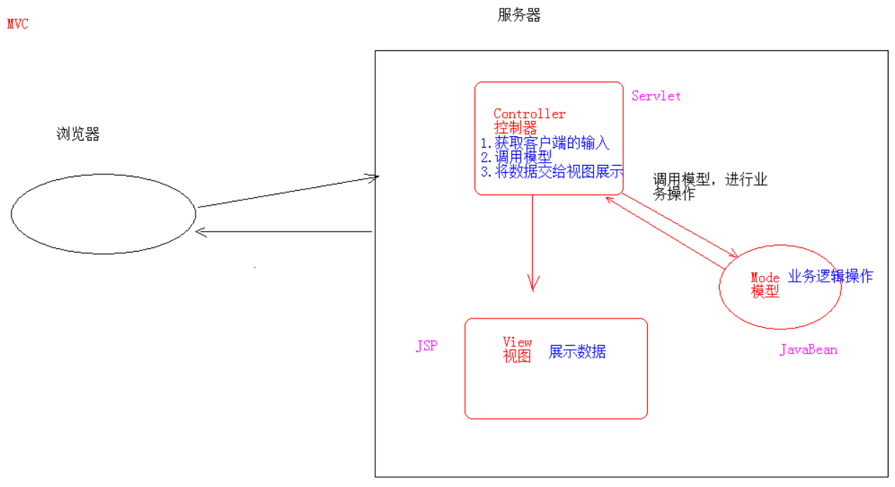
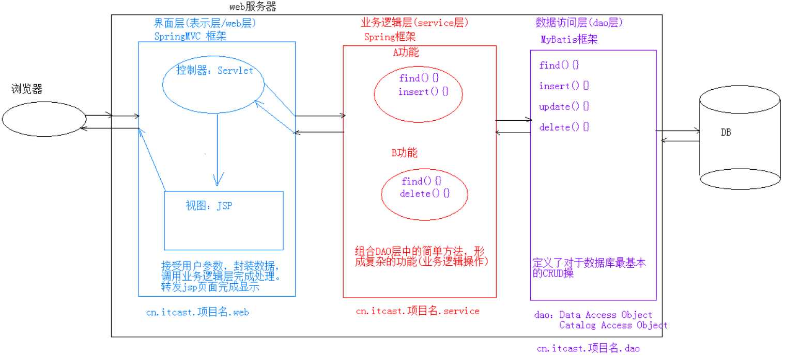

# 基本介绍

- Java Server Pages ：java 服务器端页面，可理解为一个特殊页面，其中既可以定义 html 标签，又可以定义 java 代码
- 用于简化书写
- JSP 本质上就是一个 Servlet

# JSP 脚本

- `<% 代码 %>`：定义用于`service()`方法中的 java 代码
- `<%! 代码 %>`：定义的 java 代码，在 JSP 转换后的 java 类的成员位置
- `<%= 代码 %>`：定义的 java 代码会输出到页面上

# 指令

- 用于配置 JSP 页面，导入资源文件

- 格式

  ```jsp
  <%@ 指令名称 属性名1=属性值1 属性名2=属性值2 ... %>
  ```

- 分类：`page`、`include`、`taglib`

## page

- 用于配置 JSP 页面
- `contentType`：等同于`response.setContentType()`
- `import`：导包
- `errorPage`：当前页面发生异常后，会自动跳转到指定的错误页面
- `isErrorPage`：标识当前是否为错误页面
  * `true`：是，可以使用内置对象`exception`
  * false：否，默认值，不可以使用内置对象`exception`

## include

- 页面包含的、导入页面的资源文件

  ```jsp
  <%@include file="top.jsp"%>
  ```

## taglib

- 导入资源

  ```jsp
  <%@ taglib prefix="c" uri="http://java.sun.com/jsp/jstl/core" %>
  ```

  - `prefix`：前缀，自定义的

# 注释

1. HTML 注释：`<!-- 注释 -->`，只能注释 HTML 代码片段
2. JSP 注释：`<%-- --%>`，可以注释所有，推荐使用

# JSP 的内置对象

- 在 JSP 页面中不需要获取和创建，可直接使用的对象
-  JSP 共有9个内置对象

1. `HttpServletRequest request`：一次请求访问的多个资源（转发）

2. `HttpServletResponse response`：响应对象

3. `JspWriter out`：字符输出流对象，可以将数据输出到页面上；与`response.getWriter()`类似

   - 区别：在 tomcat 服务器真正给客户端做出响应之前，会先找`response`缓冲区数据，再找`out`缓冲区数据，**因此`response.getWriter()`数据输出永远在`out.write()`之前**

4. `PageContext pageContext`：当前页面共享数据，还可以获取其他八个内置对象

5. `HttpSession session`：一次会话的多个请求间

6. `ServletContext application`：所有用户间共享数据

7. `Object page`：当前页面（Servlet）的对象`this`

8. `ServletConfig config`：Servlet 的配置对象

9. `Throwable exception`：异常对象

    

# MVC 开发模式



1.  M：Model，模型；JavaBean
   - 完成具体的业务操作，如：查询数据库，封装对象
2. V：View，视图；JSP
   - 展示数据
3. C：Controller，控制器；Servlet
   - 获取用户的输入 / 请求
   - 调用模型 Model
   - 将数据交给视图 View 进行展示

# 三层架构 - 软件设计架构



1. 界面层（表示层 / web层）：用户看到的界面，用户可以通过界面上的组件和服务器进行交互
2. 业务逻辑层（service 层）：处理业务逻辑
3. 数据访问层（dao 层，Data Access Object）：操作数据存储文件

# EL 表达式

## 基本介绍

- Expression Language 表达式语言
- 作用：替换和简化 JSP 页面中 java 代码的编写
- 语法：`${表达式}`
- JSP 默认支持 EL 表达式的；如果要忽略 EL 表达式：
  - 设置 JSP 中`page`指令中的`isELIgnored="true"`，忽略当前 JSP 页面中所有的 EL 表达式
  - `\${表达式}`：忽略当前 EL 表达式，转义字符

## 运算操作

1. 算数运算符：`+`，`-`，`*`，`/(div)`，`%(mod)`
2. 比较运算符： `>`，`<`，`>=`，`<=`，`==`，`!=`
3. 逻辑运算符：`&&(and)`，`||(or)`，`!(not)`
4. 空运算符：`empty`
   - `${empty list}`：判断字符串、集合、数组对象是否为`null`或者长度为`0`
   - `${not empty str}`：表示判断字符串、集合、数组对象是否不为`null`并且 长度 > `0`

## 获取值操作

- EL 表达式只能从**域对象中获取值**

### 语法

1. `${域名称.键名称}`：从指定域中获取指定键的值
   - `pageScope` --> `pageContext`
   - `requestScope` --> `request`
   - `sessionScope` --> `session`
   - `applicationScope` --> `application`
2. `${键名称}`：依次从最小的域中查找是否有该键对应的值
3. `${域名称.键名称.属性名}`：获取对象、List 集合、Map 集合的值
   - 本质上会去调用对象的`getter`方法
   - List 集合：`${域名称.键名称[索引]}`
   - Map 集合：`${域名称.键名称.key名称}`、`${域名称.键名称["key名称"]}`

## 隐式对象

- EL 表达式中有11个隐式对象
- `pageContext`：获取 JSP 其他8个内置对象 
  - `${pageContext.request.contextPath}`：动态获取虚拟目录

# JSTL

## 基本介绍

- JavaServer Pages Tag Library，JSP 标准标签库
- 由 Apache 组织提供的开源免费的 JSP 标签
- 作用：用于简化和替换 JSP 页面上的 java 代码

## 使用步骤

1. 导入 JSPL 相关 jar 包
2. 引入标签库：`taglib`指令，`<%@ taglib prefix="c" uri="http://java.sun.com/jsp/jstl/core" %>`
3. 使用标签

## 常用的 JSTL 标签

- `<c:if>`:相当于 java 代码的`if`语句
	
  1. 属性
      - 必须包含`test`属性，接收`boolean`表达式
        - 表达式为`true`，则显示`<if>`标签体内容；如果为`false`，则不显示标签体内容
	      - `test`属性值通常会结合 EL 表达式一起使用
    
	2. 注意：
  
    - `<c:if>`标签没有`else`情况，想要`else`情况，需要再定义一个`<c:if>`标签
  
- `<c:choose>`：相当于 java 代码的`switch`语句

    1. 使用`<c:choose>`标签声明 --> 相当于`switch`声明

    2. 使用`<c:when>`标签做判断 --> 相当于`case`
    3. 使用`<c:otherwise>`标签做其他情况的声明 --> 相当于`default`

- `<c:forEach>`：相当于 java 代码的`for`语句

    1. `for`循环，属性如下：
       - `begin`：开始值
       - `end`：结束值
       - `var`：临时变量
       - `varStatus`：循环状态对象
         - `index`：容器中元素的索引，从`0`开始
         - `count`：循环次数，从`1`开始
    2. 增强`for`循环，属性如下：
       - `items`：想要遍历的容器对象
       - `var`：容器中元素的临时变量
       - `varStatus`：循环状态对象
         - `index`：容器中元素的索引，从`0`开始
         - `count`：循环次数，从`1`开始
