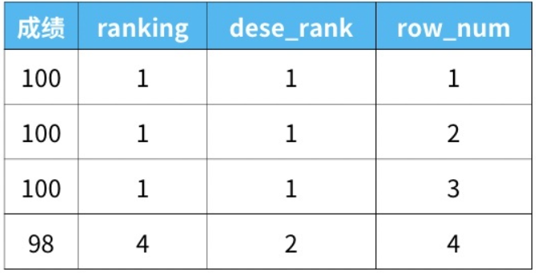
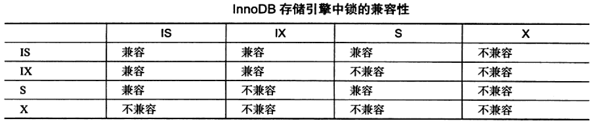

# 窗口函数

## 简介

- MySQL 8.0以上版本提供窗口函数（MySQL 8.0以下版本参考[在MySQL中实现Rank高级排名函数](https://www.jianshu.com/p/bb1b72a1623e)）
- 窗口函数通过制定字段将数据分为多份，即多个窗口，对每个窗口的每一行执行函数，每个窗口返回等行数的结果
- 窗口函数是对`where`或者`group by`子句处理后的结果进行操作，因此窗口函数原则上只能写在`select`子句中
- 窗口函数分为两类
  1. 专用窗口函数，如`rank`，`dense_rank`，`row_number`等
  2. 聚合函数，如`sum`，`avg`，`count`，`max`，`min`等

## 语法

```sql
函数名([参数]) over(patition by [分组字段] order by [排序字段] asc/desc rows/range between 起始位置 and 结束位置)
```

- 第一部分是**函数名称**，开窗函数的数量较少，只有11个窗口函数+聚合函数（所有聚合函数都可以用作开窗函数），根据函数性质，有的要写参数，有的不需要写参数
- 第二部分是**over语句**，**over()是必须要写的**，里面有三个参数，都是非必须参数，根据需求选写：
  1. 第一个参数是`partition by + 分组字段`，将数据根据此字段分成多份，如果不加`partition by`参数，那会把整个数据当做一个窗口
  2. 第二个参数是`order by + 排序字段`，每个窗口的数据要不要进行排序
  3. 第三个参数`rows/range between 起始位置 and 结束位置`，这个参数仅针对滑动窗口函数有用，是在当前窗口下分出更小的子窗口

## 作用与功能

1. 同时具有分组和排序的功能
2. 不减少原表的行数
   - `partition by`分组汇总行数不变
   - `group by`分组汇总改变行数

## 不同排序函数的区别



### rank函数

- 如果有并列名次的行，会占用下一名次的位置，**名次之间有“间隔”**
- 比如正常排名是1，2，3，4，但是现在前3名是并列的名次，结果是：**1，1，1**，4

### dense_rank函数

- 如果有并列名次的行，不占用下一名次的位置，**名次之间没有“间隔”**
- 比如正常排名是1，2，3，4，但是现在前3名是并列的名次，结果是：**1，1，1**，2

### row_number函数

- 不考虑并列名次的情况
- 比如前3名是并列的名次，排名是正常的**1，2，3**，4

## 示例-排序函数

### 排名问题

> 编写一个 SQL 查询来实现分数排名。如果两个分数相同，则两个分数排名（Rank）相同。请注意，平分后的下一个名次应该是下一个连续的整数值

```sql
select
	Grade, dense_rank() over(order by Grade desc) as `rank`
from
	Class;
```

### topN问题

> 查询每组最大的N条记录
>
> 这类问题涉及到“既要分组，又要排序”的情况，需要用窗口函数来实现

```sql
select * from
	(select *,
    		row_number() over(partition by 要分组的列 order by 要排序的列 desc) as ranking
     from 表名) as a
where ranking <= N;
```

### 连续性问题

>每行的人数大于或等于 `N` 且 `id` 连续的三行或更多行记录
>
>某某属性的值需要连续的连续性问题

- `id - row_number()`

```sql
select
	id, people
from (
	select
    	id, people, count(*) over (partition by rank1) as rank2
    from (
    	select *, id - row_number() over (order by id) as rank1
        from Stadium
        where people >= N
    ) as x
) as y
where rank2 >= 3
order by id;
```

- `lag()`，`lead()`

```sql
select
	id, people
from (
	select id, people,
    	lead(people, 1) over(order by id) as lead1,
    	lead(people, 2) over(order by id) as lead2,
    	lag(people, 1) over(order by id) as lag1,
    	lag(people, 2) over(order by id) as lag2
   	from
    	Stadium
) as t
where
	(people >= N and lead1 >= N and lag1 >= N) or
	(people >= N and lead1 >= N and lag2 >= N) or
	(people >= N and lag1 >= N and lag2 >= N)
```

## 其他常用窗口函数

- `lag(<expression>[, offset[, default_value]])`：从当前行**向前**访问`offset`行；如果没有前`offset`行，返回`default_value`
- `lead(<expression>[, offset[, default_value]])`：从当前行**向后**访问`offset`；如果没有后`offset`行，返回`default_value`

## 聚合函数作为窗口函数

- 聚合函数和上面提到的专用窗口函数用法完全相同，只需要把聚合函数写在窗口函数的位置即可，但是函数后面括号里面不能为空，需要指定聚合的列名
- 聚合函数作为窗口函数，可以在每一行的数据里直观的看到，截止到本行数据，统计数据是多少（最大值、最小值等）；同时可以看出每一行数据，对整体统计数据的影响

## 窗口函数的移动

- 用`rows`和`preceding`这两个关键字是之前多少行的意思

> 自身结果的之前两行的平均，一共三行做聚合函数

```sql
select
	*, avg(grade) over(order by id rows 2 preceding) as current_avg
from
	class;
```

> 自身加上前两行求和，一共三行做聚合函数

```sql
select
	*， sum(grade) over(order by id rows 2 preceding) as current_sum
from
	class;
```

# 视图

## 基本概念

- **视图是虚拟的表，包含的是检索数据的查询，而不是数据本身**
- 视图提供了一种 MySQL 的 `SELECT` 语句层次的封装

## 优点

- 复用 SQL 语句
- 简化复杂的 SQL 操作
- 使用表的组成部分而不是整个表

## 规则与限制

- 视图必须唯一命名
- 视图数目没有限制
- 视图可以嵌套
- 每次使用视图时，都必须处理查询执行时所需的任一个检索；创建复杂的视图或嵌套多个视图，可能会导致性能下降得很厉害
- `ORDER BY`可以用在视图中
- 视图不能索引，也不能有关联的触发器或默认值
- 视图可以和表一起使用

## 使用视图

- 视图创建

```sql
create view 视图名称 as
...(具体的查询语句)
```

```sql
create view productcustomers as
select cust_name, cust_contact, prod_id
from customers, orders, orderitems
where customers.cust_id = orders.cust_id
	and orderitems.order_num = orders.order_num
```

- 查看创建视图的语句

```sql
show create view 视图名称
```

- 删除视图

```sql
drop view 视图名称
```

## 更新视图

- 视图是可更新的，更新一个视图将更新其基表
- **并非所有视图都是可更新的**。基本上可以说，如果 MySQL 不能正确地确定被更新的基数据，则不允许更新（包括插入和删除）
- **如果视图定义中有以下操作，则不能进行视图的更新：**
  - 分组（`GROUP BY`和`HAVING`）
  - 联结
  - 子查询
  - 并
  - 聚合函数（`MIN()`，`SUM()`，`COUNT()`等）
  - `DISTINCT`
  - 导出计算列
- 一般只含**直接查询**的视图可以被更新

## 注意事项

- 两条`WHERE`子句：如果从视图检索数据时使用了一条`WHERE`子句，则两组子句（一组在视图中，另一组是传递给视图的）将自动组合
- 一般，**视图主要用于数据检索**（`SELECT`），而不用于更新（`INSERT`，`UPDATE`，`DELETE`）

# 存储过程

## 基本概念

- 存储过程：一条或多条 MySQL 语句的集合，相当于 SQL 语句的批处理

## 优点

- 简单：把处理封装在容易使用的单元中，简化复杂的操作
- 安全：防止错误，通过存储过程对基础数据的访问减少了数据讹误
- 高性能：提高性能，使用存储过程比使用单独的 SQL 语句更快

## 使用存储过程

- 执行存储过程

```sql
call 存储过程名称(@变量名)
```

```sql
call productpricing(@pricelow, @pricehigh, @priceaverage)
```

- 创建存储过程

```sql
create procedure 存储过程名称()
begin
	...(具体的SQL语句)
end
```

```sql
create procedure 存储过程名称(
	in 参数名1 参数类型,  -- in：传递给存储过程
    out 参数名2 参数类型,  -- out：从存储过程传出
    inout 参数名3 参数类型  -- inout：对存储过程传入和传出
)
begin
	-- 一系列SELECT语句，用来检索值，然后保存到相应的变量
	...(具体的SQL语句)
	into 参数名2  -- into：保存到相应的变量
end
```

- 删除存储过程

```sql
drop procedure 存储过程名称
```

- 显示创建存储过程的语句

```sql
show create procedure 存储过程名称
```

- 获得存储过程列表的详细信息

```sql
show procedure status
```

```sql
show procedure status like '存储过程名称'  -- 限制其输出
```

# 游标

## 基本概念

- 游标（cursor）：被`SELECT`语句检索出来的结果集，而不是`SELECT`语句
- 使用游标，可以在检索出来的行中前进或后退，像游标一样定位到某一行
- **MySQL 游标只能用于存储过程（和函数）**

## 使用游标

- 步骤
  1. 使用游标前，必须声明它，即定义要使用的`SELECT`语句
  2. 声明后，必须打开游标以供使用，即使用定义的`SELECT`语句检索数据
  3. 按需取出结果集中的各行
  4. 结束游标使用时，必须关闭游标
- 创建游标

```sql
create procedure processorders()
begin
	declare ordernumbers cursor  -- 声明游标
	for
	select order_num from orders;  -- 对应的select语句
end;
```

- 打开和关闭游标

```sql
open ordernumbers;
```

```sql
close ordernumbers;
```

# 触发器

## 基本概念

- 触发器：MySQL 在某个表发生更改时（分别是`INSERT`，`UPDATE`，`DELETE`语句），自动执行的 MySQL 语句
- 其他 MySQL 语句不支持触发器
- 只有表才支持触发器，视图不支持（临时表也不支持）
- 触发器的一种非常有意义的使用是**创建审计跟踪**。使用触发器，
  把更改（或者之前、之后的状态）记录到另一个表非常容易

## 创建和删除触发器

- 创建触发器

```sql
create trigger 触发器名称 after / before insert on 表名
for each row ...[具体的sql语句]
-- for each row 表示代码对每个插入行执行
```

- 删除触发器

```sql
drop trigger 触发器名称
```

## INSERT 触发器

- INSERT 触发器在`INSERT`语句执行之前或之后执行
- 在 INSERT 触发器代码内，**可引用一个名为`NEW`的虚拟表，访问被插入的行**
- 在 BEFORE INSERT 触发器中，`NEW`中的值也可以被更新（允许更改被插入的值）
- 对于`AUTO_INCREMENT`列，`NEW`在`INSERT`执行之前包含`0`，在`INSERT`执行之后包含新的自动生成值

## DELETE 触发器
- DELETE 触发器在`DELETE`语句执行之前或之后执行
- 在 DELETE 触发器代码内，**可引用一个名为`OLD`的虚拟表，访问被删除的行**
- `OLD`中的值全都是只读的，不能更新

##UPDATE 触发器

- UPDATE 触发器在`UPDATE`语句执行之前或之后执行
- 在 UPDATE 触发器代码内，**可引用一个名为`OLD`的虚拟表访问以前的（UPDATE 语句前）的值，引用一个名为`NEW`的虚拟表访问新更新的值**
- 在 BEFORE INSERT 触发器中，`NEW`中的值也可以被更新（允许更改被插入的值）
- `OLD`中的值全都是只读的，不能更新

## 注意事项

- `BEFORE`用于数据验证（目的是保证插入/更新/删除表中的数据确实是需要的数据）

# 索引


# 锁

## lock 与 latch

- lock 的对象是事务，包括**行锁**、**表锁**、**意向锁**，用于锁定数据库的表、页、行
- latch 的对象是线程，包括**互斥量（mutex）**、**读写锁（rwlock）**，用于保证并发线程操作资源的正确性

## InnoDB 中的锁

### 行锁

- **InnoDB 存储引擎支持的是行锁**
- 共享锁（S Lock）
- 排它锁（X Lock）
- S Lock 仅与 S Lock 兼容，X Lock 与任何锁都不兼容

### 意向锁

#### 作用

- 意向锁（Intension Lock）可以更容易地支持多粒度封锁
  - 希望在更细粒度上加锁，需要先对粗粒度对象加意向锁
  - **InnoDB 存储引擎的意向锁为表锁**

#### 意向锁更容易支持多粒度封锁的原因

- 在存在行锁和表锁的情况下，事务想对表加 X 锁，就需要先检测是否有其他事务对表或表中的行加了锁，那么就需要对表的每一行都检测一次，这是十分耗时的
- 通过引入意向锁，事务想对表加 X 锁，只需要先检测是否有其他事务对表加了 X/IX/S/IS 锁，如果加了就表示有其他事务正在使用该表或者该表中某一行的锁，因此事务加 X 锁失败

#### 定义

- 意向共享锁（IS Lock）：事务想要获取一张表中某几行的共享锁
- 意向排它锁（IX Lock）：事务想要获取一张表中某几行的排他锁

#### 兼容关系



### 一致性的非锁定读

- 实际上是 MVCC 的快照读，即读取数据不需要对数据加锁

### 一致性的锁定读

- `select ... lock in share mode`（共享锁，S LOCK）
- `select ... for update`（排它锁，X LOCK）

### 自增长与锁

- 对于 InnoDB 存储引擎，对每个含有自增长值的表都有一个自增长计数器
- 插入操作会依据自增长计数器的值加1来给自增长列赋值

### 外键与锁

- 对于外键列，如果没有显式地加索引，InnoDB 存储引擎会自动对其加索引，这样可以避免表锁

## 封锁协议

> [数据库知识整理 - 并发控制（封锁、两段锁协议、意向锁）](https://blog.csdn.net/Ha1f_Awake/article/details/84994697?spm=1001.2101.3001.6661.1&utm_medium=distribute.pc_relevant_t0.none-task-blog-2~default~CTRLIST~Rate-1.pc_relevant_paycolumn_v3&depth_1-utm_source=distribute.pc_relevant_t0.none-task-blog-2~default~CTRLIST~Rate-1.pc_relevant_paycolumn_v3&utm_relevant_index=1)

### 三级封锁协议

- 作用：解决丢失更新、不可重复读、脏读问题
- 解决问题的角度：给数据库何时加锁、加什么锁

#### 一级封锁协议

- 定义：事务在修改数据之前必须加 X 锁，直到事务结束才释放
- 作用：解决丢失更新问题，即在下一个事务操作前，先结束上一个事务的修改操作

#### 二级封锁协议

- 定义：在一级封锁协议的基础上，事务在读取数据之前必须加 S 锁，读取之后就释放
- 作用：在解决丢失更新问题的基础上，解决脏读问题，即在下一个事务读取前，先结束上一个事务的修改、删除操作

#### 三级封锁协议

- 定义：在一级封锁协议的基础上，事务在读取数据之前必须加 S 锁，直至事务结束才释放
- 作用：在解决丢失更新、脏读问题的基础上，解决不可重复读问题，即在下一个事务修改前，先结束上一个事务的重复读操作

### 两段锁协议

- 作用：保证并发调度的正确性和调度的可串行化，两段锁协议是可串行调度的充分不必要条件

  > 可串行化调度：当多个事务的并发执行结果，与某一次序的串行执行结果相同，说明这种并发调度是可串行调度

- 解决问题的角度：从事务调度的方面

- 定义：加锁和解锁分为两个阶段进行

## 隐式与显式锁定

- 隐式锁定：InnoDB 存储引擎采用两段锁协议，会根据隔离级别在需要时自动加锁，而且所有锁都是在同一时刻释放，这被称为隐式锁定
- 显式锁定：InnoDB 存储引擎可以使用特定的语句进行显式锁定（如`select ... lock in share mode`，`select ... for update`）

## 与锁相关的命令和表

### 命令

- `show full processlist`
- `show engine innodb status`

### 表

- 在`information_schema`库下存在3张表
  - `INNODB_TRX`：显示当前运行的 InnoDB 事务
  - `INNODB_LOCKS`：显示当前锁的信息
  - `INNODB_LOCK_WAITS`：显示当前事务的等待

## 锁的算法

### 行锁的3种算法

- Record Lock：锁定一个记录上的索引
- Gap Lock：间隙锁，锁定索引之间的间隙，但不包括索引本身
- Next-Key Lock：临键锁，Record Lock + Gap Lock，不仅锁定索引本身，而且还锁定索引之间的间隙（前开后闭区间）

### Next-Key Lock 解决幻读问题

- 对于读取的范围，采用 Next-Key Lock 对该范围加上 X Lock，因此对该范围的插入都是不允许的，从而解决幻读问题
  - 可重复读（RR）级别下，采用 Next-Key Lock 加锁
  - 读已提交（RC）级别下，仅采用 Record Lock 加锁

## 锁问题

- 脏读问题的解决：事务设置为读已提交（RC）级别
- 不可重复读问题的解决：事务设置为可重复读（RR）级别
- 幻读问题的解决：MVCC + Next-Key Lock
- 丢失更新问题的解决：让事务变成串行化，对读取的记录加上排它锁（X Lock）（如`select ... for update`）

## 阻塞

- 在默认情况下，InnoDB 存储引擎不会回滚超时引发的错误异常（**死锁除外**）

## 死锁

### 概念

- 两个或以上的事务在执行时，因为争夺锁资源而导致的相互等待

### 解决死锁问题

1. 等待超时机制
2. 在每个事务请求锁并发生等待时，通过**等待图（wait-for graph）**判断是否存在回路，进行死锁检测
   - 等待图的死锁检测采用 DFS 的递归/非递归实现
   - 若存在回路，则说明有死锁，通常情况下 InnoDB 存储引擎**回滚 undo 量最小的事务（权重最小的事务）**

### 事务发生死锁的概率与什么因素有关？

- 事务的数量越多，发生死锁的概率越大
- 每个事务操作的记录越多，发生死锁的概率越大
- 可供操作的记录集合越小，发生死锁的概率越大

## 锁升级

### 概念

- 将当前锁的粒度降低
- 如：把多个行锁升级为一个页锁，或者将页锁升级为表锁

### 作用与带来的问题

- 作用：锁升级是为了保护系统资源，防止使用太多的内存来维护锁
- 带来的问题：锁粒度的降低会导致并发性能的降低

### InnoDB 的锁升级

- InnoDB 存储引擎不存在锁升级带来的问题，因为 InnoDB 是**根据页进行加锁**（而不是根据每条记录产生行锁），并**采用位图方式**
- 因此不管一个事务锁住的页包含一个记录还是多条记录，其开销通常都是一致的

## 乐观锁与悲观锁

- 乐观锁和悲观锁两种思想，用于解决并发场景下的数据竞争问题

### 乐观锁

#### 概念

- 乐观锁在操作数据时非常乐观，认为别人不会修改数据
- 乐观锁不会加锁，只会在操作数据时判断别人是否在修改数据，如果有别人在修改数据就放弃操作，否则就执行操作

#### 实现方式

##### CAS 机制

- CAS（Compare And Swap）
- CAS 操作包括3个操作数
  1. 需要读写的内存位置（V）
  2. 用于比较的预期值（A）
  3. 拟写入的新值（B）
- CAS 操作逻辑：如果内存位置 V 的值等于预期值 A，则这个位置上的值更新为新值 B，否则不进行任何操作
- 许多 CAS 操作是自旋的，即如果操作不成功，会一直重试，直到操作成功
- **CAS 如何保证原子性？**
  - CAS 是由 CPU 支持的原子操作，其原子性是在硬件层面保证的

##### 版本号机制

- 版本号机制：在数据中增加一个字段 version，表示数据的版本号，每当数据被修改，就将版本号 version 加一；当某个线程想要修改数据时，需要判断当前版本号是否与之前查询出来的版本号一致，如果一致才可以执行操作
- 实际上，可以选择其他能够标记数据版本的字段，如时间戳等

### 悲观锁

#### 概念

- 悲观锁在操作数据时比较悲观，认为别人会修改数据
- 悲观锁在操作数据时会对数据加锁，直到完成操作后才会释放锁

#### 实现方式

- 悲观锁的实现方式是**加锁**
  - 对代码块加锁（如`synchronized`关键字）
  - 对数据加锁（如 MySQL 的排它锁）

### 优缺点和适用场景

#### 功能受限

- 虽然乐观锁的开销要低于悲观锁，但是乐观锁的适用场景受到更多限制
- CAS 只能保证单个变量操作的原子性，当涉及多个变量时，CAS 无法确保原子性；`synchronized`则可以对代码块加锁

#### 适用场景

- 乐观锁适用于竞争不激烈（出现并发冲突概率小）的情况，因为乐观锁不需要加锁，悲观锁需要对代码块或数据加锁，影响并发性能，而且加锁和释放锁也会消耗资源
- 悲观锁适用于竞争激烈（出现并发冲突概率大）的情况，因为这种情况下，乐观锁在执行更新或修改的时候会频繁失败，需要不断重试，会浪费 CPU 资源

### 乐观锁加锁吗？

- 乐观锁本身不加锁，只会在更新或修改数据的时候判断数据是否被其他线程修改，如`AtomicInteger`
- 但是乐观锁可以和加锁操作合作

### CAS 有哪些缺点？

#### ABA问题

- ABA 问题：一个变量的值在第一次读取的时候是 A 值，但被别的线程改成 B 值，然后又被改回为 A 值，此时 CAS 操作会认为数据没有被修改，所以 CAS 操作成功
- 解决方法：引入版本号机制，在进行 CAS 操作时，不仅需要比较内存的值，还需要比较版本号，只有这两个字都没有变化时，CAS 才能操作成功
- Java 里的`AtomicStampedReference`类就是利用版本号解决 ABA 问题

#### 高竞争下的自旋开销问题

- 在高竞争的情况下，如果 CAS 操作一直失败，会一直重试，CPU 开销比较大
- 解决方法：引入退出机制，当重试次数超出阈值之后就退出重试；更根本的方法就是避免在高竞争情况下使用乐观锁

#### 只能保证单个变量操作的原子性

- CAS 操作只能保证单个变量操作的原子性，当涉及多个变量时 CAS 无效
- 解决方法：加锁；使用`AtomicReference`类来把多个变量封装成一个变量来操作

# MVCC 多版本并发控制

> [数据库基础（四）Innodb MVCC实现原理](https://zhuanlan.zhihu.com/p/52977862)
>
> [全网最全的一篇数据库MVCC详解，不全我负责](https://www.php.cn/mysql-tutorials-460111.html)

## 基本概念

- MVCC（多版本控制）解决了数据库加锁后的性能问题，解决读-写冲突的无锁并发控制
- 数据库隔离级别**读已提交（RC）、可重复读（RR）**都是基于 MVCC 实现的

## InnoDB MVCC 实现的关键点

### 事务版本号

- 每次事务开始前，会从数据库获得一个自增长的事务 ID，通过事务 ID 判断事务的执行先后顺序

### 隐藏列

| 列名           | 是否必须 | 描述                                                         |
| -------------- | -------- | ------------------------------------------------------------ |
| `trx_id`       | 是       | 记录操作该数据事务的事务 ID                                  |
| `roll_pointer` | 是       | 相当于一个指针，指向回滚段的`undo`日志                       |
| `row_id`       | 否       | 隐藏 ID ，当创建表没有合适的索引作为聚集索引时，会用该隐藏 ID 创建聚集索引 |

### undo log

- undo log（回滚日志）：主要记录数据被修改之前的日志，表中数据被修改前会先拷贝到 undo log，当事务进行回滚时可以通过 undo log 将数据还原
- **undo log 的用途**
  1. 保证事务回滚时的**原子性**和**一致性**，当事务进行回滚时可以通过 undo log 将数据恢复
  2. 用于 **MVCC 快照读**的数据，在 MVCC 中通过读取 undo log 的历史版本数据，来实现不同的事务版本号拥有独立的快照数据

### 版本链

- 多个事务并行操作某一行数据时，不同事务对该行数据的修改会产生多个版本，然后通过回滚指针`roll_pointer`连成一个链表，这个链表就叫做**版本链**

### Read View

#### 概念

- InnoDB 每个事务开启后都会得到一个 Read View，副本主要保存了当前数据库没有提交的事务的 ID，也就是说这个副本保存的是系统中不应该被当前事务看到的其他事务 ID 列表

#### 作用

- 判断当前事务可见哪个版本的数据

#### 重要属性

- `trx_ids`：当前数据库未提交的事务版本号的集合
- `low_limit_id`：创建当前 read view 时，当前数据库最大的事务版本号 + 1
- `up_limit_id`：创建当前 read view 时，当前数据库最小的未提交事务版本号
- `creator_trx_id`：创建当前 read view 的事务版本号

#### 匹配条件

- 数据事务 ID `trx_id` < `up_limit_id`则显示，因为该数据是在当前事务之前就已经存在的
- 数据事务 ID `trx_id` >= `low_limit_id`则不显示，因为该数据是在当前 read view 创建之后才产生的
- `up_limit_id` <= 数据事务 ID `trx_id` < `low_limit_id`，则与未提交事务集合`trx_ids`里匹配，因为该数据有可能是在当前事务开始的时候还未提交的
  1. 如果数据事务 ID `trx_id` 不存在于`trx_ids`集合则显示，因为 read view 产生时，数据事务已经提交
  2. 如果数据事务 ID `trx_id` 存在与`trx_ids`集合，且数据事务 ID `trx_id` = `creator_trx_id`则显示，因为虽然 read view 产生的时候数据事务还未提交，但该数据是当前事务自己生成的，自己生成的数据自己能看见
  3. 如果数据事务 ID `trx_id` 存在与`trx_ids`集合，且数据事务 ID `trx_id` ≠ `creator_trx_id`则不显示，因为 read view 生成的时候数据事务还未提交，而且该数据不是当前事务生成的
- 当不满足 read view 条件时，从 undo log 获取数据的历史版本，然后数据的历史事务版本号再和 read view 条件匹配，直到找到满足条件的历史数据，否则返回空结果

## InnoDB 实现 MVCC 的原理

> InnoDB 实现 MVCC，是通过 Read View 和 undo log，Read View 帮助判断当前版本的数据是否对事务可见，undo log 保存数据的历史快照

1. 获得当前事务版本号
2. 获得一个 read view
3. 查询到数据，与 read view 事务版本号进行匹配
4. 如果不符合 read view 条件，从 undo log 里获取数据的历史版本
5. 返回符合条件的数据，否则返回空数据

## 补充

### 各种事务隔离级别下的 Read View 工作方式

- **读已提交（RC）**级别下，同一个事务里的每一次查询都会获得一个新的 read view 副本，可能会导致同一事务里前后读取数据不一致的问题（**不可重复读**）
- **可重复读（RR）**级别下，一个事务只会获取一次 read view 副本，从而保证每次查询的数据都是一样的，做到**可重复读**
- 读未提交（RU）级别下，事务不会获取 read view 副本

### 快照读、当前读

#### 快照读

- 快照读：不是读取最新的数据，而是读取 undo log 历史版本（历史快照）
- **快照读可以使普通的`SELECT`读取数据时不需要对表数据进行加锁**，从而解决了因为对表数据加锁而导致的两个问题
  1. **解决了因为加锁导致写数据时的读冲突**
  2. **解决了因为加锁导致读数据时的写冲突**

#### 当前读

- 当前读：读取数据库最新的数据
- 当前读是需要对数据进行加锁的，因为当前读是读取最新的数据，而且要保证事务的隔离性
- 以下操作都是当前读
  - `select ... lock in share mode`（共享锁）
  - `select ... for update`（排它锁）
  - `update`（排它锁）
  - `insert`（排它锁）
  - `delete`（排它锁）

## MVCC 与幻读问题

### 结论

- 快照读的情况下通过 MVCC 可以避免幻读问题
- 当前读的情况下需要使用间隙锁来解决幻读问题

### MVCC 不存在幻读问题（RR级别的情况）

- MVCC 属于快照读，快照读是不会对数据进行加锁，是通过事务版本号和 undo log 的历史版本读取数据
- 插入的数据事务 ID 总是 大于等于 read view 的 `low_limit_id`，因此插入的数据不会显示

### 当前读的幻读问题的解决方案

- 当前读是读取最新的数据，如果在两次读取之前插入数据会造成幻读问题
- MySQL 通过加间隙锁来避免不可重复读和幻读问题

# ACID 的实现

# MySQL 的存储引擎


