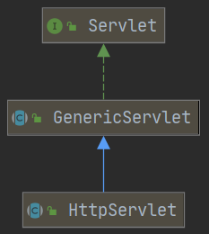

# 基本介绍

- 概念：Server Applet，运行在服务器端的小程序
- Servlet 是一种接口 Interface，定义了 Java 类被浏览器访问（ tomcat 识别）的规则
- 使用时需要自定义一个类，实现 Servlet 接口，重写方法

# 步骤

1. [IDEA 2020.2 创建 JavaWeb 项目的方法](https://blog.csdn.net/qq_43441078/article/details/107912291)

2. 定义一个类，实现`Servlet`接口 / 继承`GenericServlet`抽象类 / **继承`HttpServlet`抽象类（推荐使用） **

   ```java
   public class ServletDemo implements Servlet {...}
   public class ServletDemo extends GenericServlet {...}
   public class ServletDemo extends HttpServlet {...} // 推荐使用
   ```

3. 重写抽象方法

4. 在`web.xml`中配置 Servlet（**Servlet 3.0及之后的版本支持注解配置，不需要在`web.xml`中配置**）

   ```xml
   <!-- web.xml中配置Servlet -->
   <servlet>
   	<servlet-name>自定义的资源名</servlet-name>
       <servlet-class>自定义类的全类名</servlet-class>
   </servlet>
   
   <servlet-mapping>
   	<servlet-name>自定义的资源名</servlet-name>
       <url-pattern>/自定义的资源名</url-pattern>
   </servlet-mapping>
   ```

   ```java
   // 在类上进行注解配置
   @WebServlet("资源路径")
   ```

# 执行原理

1. 当服务器接受到客户端浏览器的请求后，会解析请求 URL 路径，获取访问的 Servlet 的资源路径

2. 查找`web.xml`文件，是否有对应的`<url-pattern>`标签体内容

3. 如果有，则再找到对应的`<servlet-class>`全类名

4. tomcat 会将全类名对应的字节码文件加载进内存**（反射机制）**

    ```java
   Class cls = Class.forName();
   ```

5. 并且创建其对象

   ```java
   Object obj = cls.newInstance();
   ```

6. 调用其方法

# Servlet 中的生命周期方法

## 被创建

执行`init()`方法，只执行一次

- 默认情况下，第一次被访问时，Servlet 被创建

- 可以配置 Servlet 的创建时机，在`<servlet>`标签下配置

  1. 第一次被访问时创建

     ```xml
     <!-- 默认为-1 -->
     <load-on-startup>负整数</load-on-startup>
     ```

  2. 在服务器启动时创建

     ```xml
     <!-- 一般为 0~10 -->
     <load-on-startup>0或正整数</load-on-startup>
     ```

- Servlet 的 `init()`方法只执行一次，**说明一个 Servlet 在内存中只存在一个对象，即 Servlet 是单例的**
     * 多个用户同时访问 Servelt，可能存在**线程安全问题**
     * **解决方法：尽量不要在 Servlet 中定义成员变量；即使定义了成员变量，也不要修改值**

## 提供服务

执行`service()`方法，可执行多次

- 每次访问 Servlet 时，`service()`方法都会被调用一次

## 被销毁

执行`destroy()`方法，只执行一次

- 只有**服务器正常关闭**时，Servlet 被销毁，执行`destroy()`方法
- `destroy()`方法在 Servlet 被销毁之前执行，一般用于释放资源

# 注解配置

1. [IDEA 2020.2 创建 JavaWeb 项目的方法](https://blog.csdn.net/qq_43441078/article/details/107912291)，选择 Servlet 的版本3.0以上，可以不创建`web.xml`

2. 定义一个类，实现 Servlet 接口

   ```java
   public class ServletDemo implements Servlet {...}
   ```

3. 重写抽象方法

4. 在类上使用`@WebServlet`注解，进行配置

   ```java
   @WebServlet("资源路径")
   ```

## Servlet 的相关配置

- `urlpattern`：Servlet 访问路径

  1. 一个 Servlet 可以定义多个访问路径

     ```java
     @WebServlet({"/demo","/demo1","/demo2"})
     ```

  2. 路径定义规则

     - 单层路径：`/xxx`
     - 多层路径（目录结构）：`/xxx/xxx`
     - 扩展名匹配：`*.自定义后缀名`，如`*.do`，`*.action`

# Servlet 体系结构



- `Servlet`接口 —— `GenericServlet`接口 —— `HttpServlet`接口

## GenericServlet 抽象类

- `GenericServlet`：将`Servlet`接口中其他的方法做了默认空实现，只将`service()`方法作为抽象
- 将来定义`Servlet`类时，可以继承`GenericServlet`，实现`service()`方法

## HttpServlet 抽象类

- `HttpServlet`：对 HTTP 协议的一种封装，简化操作
  1. 定义类继承`HttpServlet`
  2. 重写`doGet() / doPost()`方法


