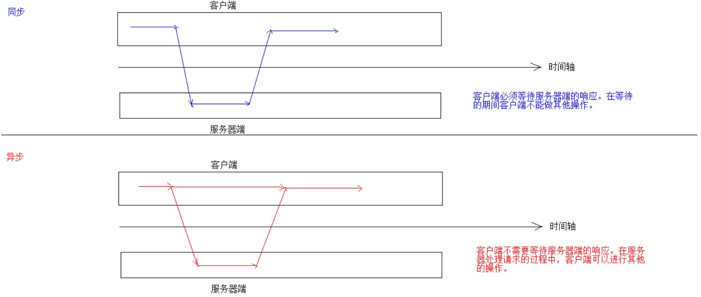
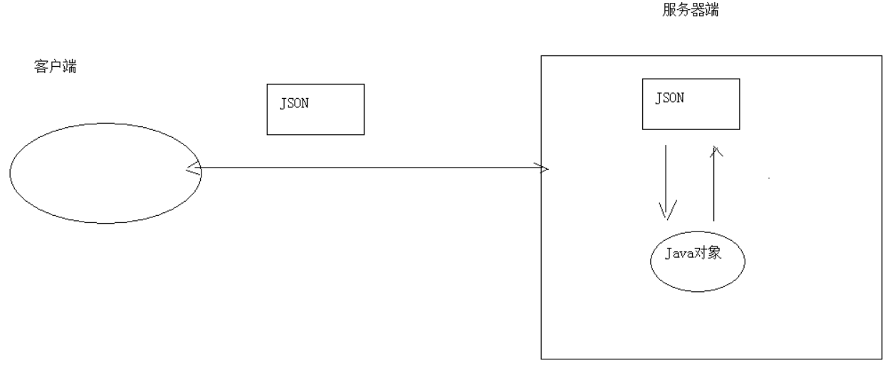

# JQuery

## 基本介绍

- JQuery 是一个快速、简洁的 JavaScript 框架
  - JavaScript 框架：本质上就是一些 js文件，封装了 js 的原生代码
- 它封装 JavaScript 常用的功能代码，提供一种简便的JavaScript 设计模式

## JQuery 版本

目前jQuery有三个大版本：
- 1.x：兼容ie678，使用最为广泛的，官方只做BUG维护，功能不再新增；因此一般项目来说，使用 1.x 版本就可以了
- 2.x：不兼容ie678，很少有人使用，官方只做BUG维护，功能不再新增；如果不考虑兼容低版本的浏览器可以使用2.x
- 3.x：不兼容ie678，只支持最新的浏览器。除非特殊要求，一般不会使用3.x版本的，很多老的jQuery插件不支持这个版本。目前该版本是官方主要更新维护的版本
- jquery-xxx.js 与 jquery-xxx.min.js 区别：
  1. jquery-xxx.js：开发版本。给程序员看的，有良好的缩进和注释，体积大一些
  2. jquery-xxx.min.js：生产版本。程序中使用（导入min.js文件），没有缩进，体积小一些，程序加载更快

## JQuery 对象和 JS 对象区别与转换

- JQuery 对象和 js 对象方法不通用
- 两者相互转换
  -  jq -- > js : `jq对象[索引]`或者`jq对象.get(索引)`
  - js -- > jq : `$(js对象)`

## 选择器

### 基本操作学习

- 事件绑定

  ```js
  // 获取b1按钮
  $("#b1").click(function(){
      alert("abc");
  });
  ```

- 入口函数

  ```js
  $(function () {
  	...
  });
  ```

  - `window.onload`只能定义一次，如果定义多次，后边的会将前边的覆盖掉
  - `$(function)`可定义多次

- 样式控制：css 方法

  ```js
  $("#div1").css("backgroundColor","pink");
  ```

### 分类

1. 基本选择器
2. 层级选择器
3. 属性选择器
4. 过滤选择器
5. 表单过滤选择器

## DOM 操作

# AJAX

## 基本介绍

- ASynchronous JavaScript And XML，异步的JavaScript 和 XML

- 异步和同步：基于客户端和服务器端的相互通信

  - 同步：客户端必须等待服务器端的响应。在等待的期间客户端不能做其他操作
  - 异步：客户端不需要等待服务器端的响应。在服务器处理请求的过程中，客户端可以进行其他的操作

  

- Ajax 是一种在无需重新加载整个网页的情况下，能够更新部分网页的技术（异步更新）；这意味着可以在不重新加载整个网页的情况下，对网页的某部分进行更新

## 实现方式

### 原生的 JS 实现方式

### JQeury实现方式

1. `$.ajax({键值对})`：用于发送异步请求

   ```js
   $.ajax({
       url:"ajaxServlet1111" , // 请求路径
       type:"POST" , //请求方式
       data:{"username":"jack","age":23}, //请求参数
       success:function (data) {
           alert(data);
       },//响应成功后的回调函数
       error:function () {
           alert("出错啦...");
       },//表示如果请求响应出现错误，会执行的回调函数
   	dataType:"text"//设置接受到的响应数据的格式
   });
   ```

2. `$.get(url, [data], [callback], [type])`：发送`get`请求
   - `url`：请求路径
   - `data`：请求参数
   - `callback`：回调函数
   - `type`：响应结果的类型
3. `$.post(url, [data], [callback], [type])`：发送`post`请求
   - `url`：请求路径
   - `data`：请求参数
   - `callback`：回调函数
   - `type`：响应结果的类型

# [JSON](https://www.runoob.com/json/json-tutorial.html)

## 基本介绍

- JavaScript Object Notation，JavaScript 对象表示法
- JSON 现在多用于存储和交换文本信息的语法
- JSON 比 XML 更小、更快，更易解析

## 基本语法

JSON 语法是 JavaScript 对象表示语法的子集。

- 数据在名称/值对中
- 数据由逗号分隔
- 大括号 **{}** 保存对象
- 中括号 **[]** 保存数组，数组可以包含多个对象

## [JSON 数据和 Java 对象的相互转换](https://zhuanlan.zhihu.com/p/65224789)



- JSON 解析器：Jsonlib，Gson，fastjson，jackson

### JSON 转为 Java 对象

1. 导入`jackson`的相关 jar 包
2. 创建`jackson`核心对象`ObjectMapper`
3. 调用`ObjectMapper`的相关方法进行转换
      - `readValue(json字符串数据,Class)`

### Java 对象转换 JSON

- 使用步骤
  1. 导入`jackson`的相关 jar 包
  2. 创建`jackson`核心对象`ObjectMapper`
  3. 调用`ObjectMapper`的相关方法进行转换
     - `writeValue(JSON字符串输出参数，obj)`
     - `writeValueAsString(obj)`：将对象转为 json 字符串
- 注解
  - `@JsonIgnore`：排除属性
  - `@JsonFormat`：属性值的格式化
- 复杂 Java 对象转换
  - `List`：数组
  - `Map`：对象格式一致