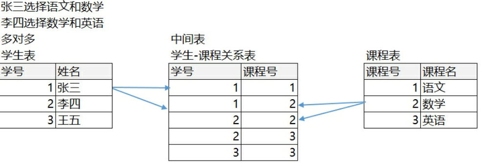

# MySQL

## MySQL 服务启动

- 管理员运行`cmd`
  -  启动`mysql`服务：`net start mysql`
  -  关闭`mysql`服务：`net stop mysql`

## MySQL 登录

1. `mysql -uroot -p密码`
2. `mysql -hip -p连接目标的密码`
3. `mysql --host=ip --user=root --password=连接目标的密码`

## MySQL 退出

1. `exit`
2. `mysql -hip -p连接目标的密码`
3. `mysql --host=ip --user=root --password=连接目标的密码`

## 文件结构

- 数据库管理系统 -> 数据库 -> 表 -> 数据
- 一个表可以看作为一个类
- 表的一行称之为一条记录，可以看作类的实例
- 表中一列代表具体类实例的数据

# SQL

## 基本介绍

- Structure Query Language：结构化查询语言。定义了操作所有关系型数据库的规则
- 每一种数据库操作的方式存在不一样的地方

## 通用语法

- SQL 语句可以单据或多行书写，以分号结尾
- MySQL 数据库的 SQL 语句**不区分大小写**，**关键字建议使用大写**
- 3种注释方法
  1. 单行注释：`--(空格)注释内容`
  2. 单行注释（MySQL 特有）：`# 注释内容`
  3. 多行注释：`/* 注释 */`

## SQL 分类

- DDL（Data Definition Language）数据定义语言：用来定义数据库对象：数据库，表，列等。关键字：`create`，` drop`，` alter` 等
- DML（Data Manipulation Language）数据操作语言：用来对数据库中表的数据进行增删改。关键字：`insert`，`delete`，`update`等
- DQL（Data Query Language）数据查询语言：用来查询数据库中表的记录(数据)。关键字：`select`，`where`等
- DCL（Data Control Language）数据控制语言（了解）：用来定义数据库的访问权限和安全级别，及创建用户。关键字：`GRANT`， `REVOKE`等

# DDL：操作数据库、表

## 操作数据库（CRUD）

1. C（Create）：创建

   - 创建数据库

     ```sql
     CREATE DATABASE 数据库名;
     ```

   - 创建数据库，判断不存在，再创建

     ```sql
     CREATE DATABASE if not exists 数据库名;
     ```

   - 创建数据库，并指定字符集

     ```sql
     CREATE DATABASE 数据库名 CHARACTER SET 字符集名;
     ```

   - 创建数据库，判断是否存在，并指定字符集

     ```sql
     CREATE DATABASE if not exists 数据库名 CHARACTER SET 字符集名; 
     ```

2. R（Retrieve）：查询

   - 查询所有数据库的名称

     ```sql
     SHOW DATABASES;
     ```

   - 查询某个数据库的字符集 / 查询某个数据库的创建语句（定义信息）

     ```sql
     SHOW CREATE DATABASE 数据集名;
     ```

3. U（Update）：修改

   - 修改数据库默认的字符集

     ```sql
     ALTER DATABASE 数据库名 DEFAULT CHARACTER SET 字符集名;
     ```

4. D（Delete）：删除

   - 删除数据库

     ```sql
     DROP DATABASE 数据库名;
     ```

   - 判断数据库存在，存在再删除

     ```sql
     DROP DATABASE if exists 数据库名称;
     ```

5. 使用数据库

   - 查询当前正在使用的数据库名称

     ```sql
     SELECT DATABASE(); -- 使用的一个mysql中的全局函数
     ```

   - 使用/切换数据库

     ```sql
     USE 数据库名;
     ```

## 操作表（CRUD）

*前提先使用某个数据库*

1. C（Create）：创建

   ```sql
   CREATE TABLE 表名 (
   	字段1 数据类型1,
   	字段2 数据类型2,
   	...
   	字段n 数据类型n
   );
   ```

   复制表

   ```sql
   CREATE TABLE 表名 LIKE 被复制的表名;
   ```

   - 常用数据类型
     - `INT`
     - `DOUBLE(m, n)`：`m`为小数总位数，`n`为小数点后位数
     - `DATE`：日期，只包含年月日，`yyyy-MM-dd`
     - `DATETIME`：日期，只包含年月日时分秒，`yyyy-MM-dd HH:mm:ss`
     - `TIMESTAMP`：时间戳类型，包含年月日时分秒，`yyyy-MM-dd HH:mm:ss`；如不给该字段赋值，或赋值为`null`，则默认使用当前的系统时间
     - `VARCHAR(max)`：可变字符串，`max`为最大字符串

2. R（Retrieve）：查询

   - 查询某个数据库中所有的表名称

     ```sql
     SHOW TABLES;
     ```

   - 查询表结构

     ```sql
     DESC 表名;
     ```

   - 查询创建表的 SQL 语句

     ```sql
     SHOW CREATE TABLE 表名;
     ```

3. U（Update）：修改

   - 修改表名

     ```sql
     ALTER TABLE 表名 RENAME TO 新表名;
     ```

   - 修改表的字符集

     ```sql
     ALTER TABLE 表名 CHARACTER SET 字符集名;
     ```

   - 添加一列

     ```sql
     ALTER TABLE 表名 ADD 列名 数据类型;
     ```

   - 修改列名称 类型

     ```sql
     ALTER TABLE 表名 CHANGE 列名 新列名 新数据类型;
     ```

     ```sql
     ALTER TABLE 表名 MODIFY 列名 新数据类型;
     ```

   - 删除列

     ```sql
     ALTER TABLE 表名 DROP 列名;
     ```

4. D（Delete）：删除

   D（Delete）：删除

   - 删除表

     ```sql
     DROP TABLE 表名;
     ```

     ```sql
     DROP TABLE if exists 表名;
     ```

# DML：增删改表中数据

## 添加数据

```sql
INSERT INTO 表名(字段1, 字段2,...字段n) VALUES(值1, 值2,...值n);
```

- 字段名和值要一一对应

- 如果表名后不定义字段，则默认给所有列添加值

  ```sql
  INSERT INTO 表名 VALUES(值1, 值2,...值n);
  ```

- 除了数字类型，其他类型需要用引号（单双引号皆可）引起来

## 删除数据

```sql
DELETE FROM 表名 [WHERE 条件表达式];
```

- 如果不加条件，则删除表中所有记录

- 如果要删除所有记录

  ```sql
  DELETE FROM 表名; -- 不推荐使用, 效率低, 有多少条记录就会执行多少次删除操作
  ```

  ```sql
  TRUNCATE TABLE 表名; -- 推荐使用, 效率更高, 相当于想删除表, 然后再创建一张格式一样的表
  ```

## 修改数据

```sql
UPDATE 表名 SET 列名1 = 值1, 列名2 = 值2,... [WHERE 条件表达式];
```

- 如果不加任何条件，则会将表中所有记录全部修改

# DQL：查询表中的记录

```sql
SELECT
	字段列表
FROM
	表名列表
WHERE
	条件列表
GROUP BY
	分组字段
HAVING
	分组之后的条件
ORDER BY
	排序
LIMIT
	分页限定
```

## 基础查询

- 多个字段的查询

  ```sql
  SELECT 字段名1, 字段名2,... FROM 表名;
  ```

  - 如果查询所有字段，则可以使用*来替代字段列表

- 查询指定列且结果集不出现重复数据

  ```sql
  SELECT DISTINCT 字段名 FROM 表名;
  ```

- 查询结果参与运算

  ```sql
  SELECT 列名1 + 固定值 FROM 表名;
  ```

  ```sql
  SELECT 列名1 + 列名2... FROM 表名;
  ```

  - 一般只会进行数值型计算
  - `IFNULL(表达式1, 表达式2)`：`null`参与的运算，计算结果都为`null`，表达式1为哪个字段需要判断是否`null`，表达式2为如果该字段为`null`后的替换值

- 对列/表指定别名

  ```sql
  SELECT 字段1 AS 别名, 字段2 AS 别名,... FROM 表名 AS 表别名;
  ```

  - `AS`可以省略

## 条件查询

流程：取出表中的每条记录，满足条件的记录就返回，不满足条件的记录不返回

- `WHERE`子句后接条件

  ```sql
  SELECT 字段名 FROM 表名 WHERE 条件表达式;
  ```

- 运算符

  - `>, <, <=, >=, =, <>`：`<>`在 SQL 中表示不等于，在 MySQL 中也可以使用`!=`，没有`==`
  - `BETWEEN m AND n`：在`[m, n]`之间的范围中
  - `IN(数据1, 数据2,...)`：
  - `LIKE '通配符字符串'`：模糊查询
    - 通配符/占位符：`_` - 单个任意字符；`%` - 多个任意字符
  - `IS NULL`或`IS NOT NULL`：查询某一列为`null`的值，不能写成`=NULL`
  - `AND`或`&&`：与，SQL 中建议使用前者，后者并不通用
  - `OR`或`||`
  - `NOT`或`!`

## 排序查询

通过`ORDER BY`子句，可以将查询结果进行排序（排序只是显示方式，不会影响数据库中数据的顺序）

```sql
ORDER BY 排序字段1 排序方式1, 排序字段2 排序方式2...
-- 举例
SELECT * FROM tableName ORDER BY field1 ASC, field2 DESC;
```

- 排序方式：`ASC`升序，默认的；`DESC`降序
- 如果有多个排序条件，则当前一个的条件值一样时，才会判断第二条件

## 聚合函数

将一列数据作为一个整体，进行纵向的计算

```sql
SELECT Function(field) FROM tableName;
```

- `COUNT(列名)`：计算个数

  - 一般选择非空的列：主键
  - `count(*)`：不推荐使用

- `MAX(列名)`

- `MIN(列名)`

- `SUM(列名)`

- `AVG(列名)`：计算平均值

- 注意：聚合函数的计算，排除`null`值

  解决方案

  - 选择不包含`null`的列进行计算
  - `IFNULL(列名, 默认值)`函数

## 分组查询

```sql
SELECT 字段1, 字段2... FROM 表名 GROUP BY 分组字段 [HAVING 条件表达式];
```

- `GROUP BY`将分组字段结果中相同内容作为一组，并且返回每组的第一条数据，所以**单独分组没什么用处**
- 分组的目的就是为了统计，一般分组会跟聚合函数一起使用
- 注意：
  - **当我们使用某个字段分组，在查询的时候也需要将这个字段查询出来**，否则看不到数据属于哪组的
  - 分组之后查询的字段：分组字段、聚合函数
-  `WHERE`和`HAVING`的区别
  - `WHERE`在分组之前进行限定，`HAVING`在分组之后进行限定
  - `WHERE`后不可以跟聚合函数，`HAVING`后可以进行聚合函数的判定
- `GROUP BY`后面不能出现`WHERE`，使用`HAVING`

## 分页查询

`LIMIT`的作用是限制查询记录的条数

```sql
LIMIT offset, length; 
-- offset: 起始行数, 从0开始计数, 如果省略, 默认就是0
-- length: 返回的行数, 即返回的行数 <= length
```

- `LIMIT`是 MySQL 特有的

# 约束

对表中的数据进行限定，保证数据的正确性、有效性和完整性；约束在创建表的时候添加比较合适

## 非空约束 NOT NULL

某一列的值不能为`null`

- 基本语法

  ```sql
  CREATE TABLE 表名(
      字段名 字段类型 NOT NULL -- 创建表时添加非空约束
  );
  ```
```
  
​```sql
  ALTER TABLE 表名 MODIFY 字段名 字段类型 NOT NULL; --   创建表完后, 添加非空约束
  ALTER TABLE 表名 MODIFY 字段名 字段类型; -- 删除非空约束
```

- 默认值

  ```sql
  CREATE TABLE 表名(
      字段名 字段类型 DEFAULT 默认值  -- 创建表时设置默认值
  );
  ```

## 唯一约束 UNIQUE

某一列的值不能重复

- 基本语法

  ```sql
  CREATE TABLE 表名(
      字段名 字段类型 UNIQUE -- 创建表时添加唯一约束
  );
  ```

  - 注意：唯一约束可以有`null`值，但是只能有一条记录为`null`

  ```sql
  ALTER TABLE 表名 MODIFY 字段名 字段类型 UNIQUE; -- 创建表完后, 添加唯一约束
  ALTER TABLE 表名 MODIFY 字段名 字段类型; -- 删除唯一约束
  ```

## 主键约束 PRIMARY KEY

**通常不用业务字段作为主键，单独给每张表设计一个`id`的字段，把`id`作为主键**。主键是给数据库和程序使用的，不是给最终的客户使用的。所以主键有没有含义没有关系，只要不重复，非空就行

- 基本语法

  ```sql
  CREATE TABLE 表名(
      字段名 字段类型 PRIMARY KEY -- 创建表时添加主键约束
  );
  ```

  - 注意：
    - 主键约束是非空且唯一
    - 一张表只能有一个字段为主键
    - 主键是表中记录的唯一标识

  ```sql
  ALTER TABLE 表名 MODIFY 字段名 字段类型 PRIMARY KEY; -- 创建表完后, 添加主键约束
  ALTER TABLE 表名 DROP PRIMARY KEY; -- 删除唯一约束
  ```

- 主键自增

  `AUTO_INCREMENT`：在每次插入新记录时，数据库自动生成主键字段的值（字段类型必须是整数类型）

  ```sql
  CREATE TABLE 表名(
      id INT PRIMARY KEY AUTO_INCREMENT
  ) AUTO_INCREMENT = 起始值; -- 创建表时指定起始值
  ```

  - `AUTO_INCREMENT`的默认值为`1`

  ```sql
  ALTER TABLE 表名 MODIFY 字段名 字段类型 AUTO_INCREMENT; -- 创建表完后, 添加自动增长
  ALTER TABLE 表名 MODIFY 字段名 字段类型; -- 删除自动增长
  ALTER TABLE 表名 AUTO_INCREMENT = 起始值; -- 创建表之后修改起始值
  ```

- `DELETE`和`TRUNCATE`对自增长的影响

  - `DELETE`：删除所有的记录之后，自增长没有影响（继续增长）
  - `TRUNCATE`：删除以后，自增长又重新开始（从初始值开始）

## 外键约束 FOREIGN KEY

外键：在副表/从表中与主表主键对应的那一列，即副表/从表的外键关联了主表的主键，副表/从表的外键被主表的主键约束

- 基本语法

  ```sql
  [CONSTRAINT] [外键约束名称] FOREIGN KEY(外键字段名) REFERENCES 主表名(主键字段名)
  -- 在创建表时添加外键
  CREATE TABLE 表名(
  				....
  				外键列,
  				CONSTRAINT 外键名称 FOREIGN KEY (外键列名称) REFERENCES 主表名称(主表列名称)
  			);
  ```

  ```sql
  ALTER TABLE 表名 DROP FOREIGN KEY 外键名称; -- 删除外键
  ALTER TABLE 表名 ADD CONSTRAINT 外键名称 FOREIGN KEY (外键列名称) REFERENCES 主表名称(主表列名称); -- 创建表之后, 添加外键
  ```

- 外键的级联操作

  ```sql
  -- 在创建外键时, 添加级联操作
  ALTER TABLE 表名 ADD CONSTRAINT 外键名称 FOREIGN KEY (外键字段名称) REFERENCES 主表名称(主表列名称) ON UPDATE CASCADE ON DELETE CASCADE;
  ```

  - `ON UPDATE CASCADE`：级联更新
  - `ON DELETE CASCADE`：级联删除
  - **在开发中谨慎使用级联操作**

- **在开发中不推荐使用外键，因为外键会大大降低检索效率，增加查询时间，这是交叉查询不允许的**

# 多表关系

## 一对多

- 班级-学生、部门-员工、分类-商品...
- 一对多关系的建表原则：在从表（多方）创建一个字段，字段作为外键指向主表（一方）的主键

## 多对多

- 老师-学生、学生-课程、用户-角色

- 多对多关系的建表原则：**需要创建第三张表 -- 中间表**，中间表中至少两个字段，这两个字段分别作为外键指向各自一方的主键

  

- 创建复合主键

  ```sql
  PRIMARY KEY(字段1, 字段2...), -- 创建表时, 创建复合主键
  ```


## 一对一

- 一对一关系在开发中应用不多，因为一对一关系可以创建成一张表
- 一对一关系的建表原则
  - 外键唯一：主表的主键和从表的外键（唯一），形成主外键关系，外键唯一`UNIQUE`
  - 外键是主键：主表的主键和从表的主键，形成主外键关系

# 数据库设计的范式

## 基本概念

- 设计关系数据库时，需要遵循的一些规范。要遵循后边的范式要求，必须先遵循前边的所有范式要求
- 不同的规范要求被称为不同的范式，**各种范式呈递次规范，越高的范式数据库冗余越小**
- 目前关系数据库有**六种范式**（NF，Normal Form）
  1. 第一范式（1NF）
  2. 第二范式（2NF）
  3. 第三范式（3NF）
  4. 巴斯-科德范式（BCNF）
  5. 第四范式(4NF）
  6. 第五范式（5NF，又称完美范式）
- **一般说来，数据库只需满足第三范式(3NF）即可**

## 1NF

- **第一范式每一列不可再拆分，称为原子性**
- 数据库表的每一列都是不可分割的原子数据项，不能是集合、数组等非原子数据项
- 表中的某个列有多个值时，必须拆分为不同的列

## 2NF

- **2NF是在1NF的基础上所有列完全依赖于主键列，不产生局部依赖**
- 当存在一个复合主键包含多个主键列的时候，才会发生不符合第二范式的情况
- 2NF的特点：
  1. 一张表只描述一件事情
  2. 表中的每一列都完全依赖于主键

## 3NF

- **3NF在2NF的基础上，表中的每一列都直接依赖于主键，而不是通过其它的列来间接依赖于主键，不产生传递依赖**
- 满足3NF的数据库表不存在如下依赖关系：主键列 -> 非主键列 x -> 非主键列 y

# 数据库备份和还原

## 命令行

- 备份

  ```sql
  $ mysqldump -u用户名 -p密码 需要备份的数据库名称 > 保存路径
  ```

- 还原

  1. 登录数据库

     ```sql
     $ mysql -u用户名 -p密码
     ```

  2. 创建新数据库

     ```sql
     $ CREATE DATABASE 数据库名
     ```

  3. 使用新数据库

     ```sql
     $ USE DATABASE 数据库名
     ```

  4. 执行文件还原

     ```sql
     $ SOURCE 文件路径
     ```

# 多表查询

## 多表查询的分类

- 内连接
  - 隐式内连接
  - 显式内连接
- 外连接
  - 左外连接
  - 右外连接

## 笛卡尔积现象

- 笛卡尔积

  集合A和集合B的所有可能组合

- 多表查询的笛卡尔积现象

  ```sql
  SELECT * FROM 表名1, 表名2...;
  ```

  查询结果为多张表的记录的所有可能组合，但不是所有的数据组合都是有用的，需要通过条件过滤掉无用的数据

## 内连接

- **用左边表的记录去匹配右边表的记录，显示符合条件的记录，如：从表.外键 = 主表.主键**
- 查询步骤
  1. 确定查询哪些表
  2. 确定查询的条件
  3. 确定查询的字段

### 隐式内连接

- 不使用`JOIN`关键字，条件使用`WHERE`指定

  ```sql
  SELECT 字段名 FROM 左表, 右表 WHERE 条件表达式;
  ```

### 显式内连接

- 使用`[INNER] JOIN ... ON ...`语句，可以省略`INNER`

  ```sql
  SELECT 字段名 FROM 左表 [INNER] JOIN 右表 ON 条件表达式;
  ```

## 外连接

用一边表的记录去匹配另一边表的记录，**显示符合条件的记录，否则显示`null`**，即在内连接的基础上保证一边表的数据全部显示

### 左外连接

- 使用`LEFT [OUTER] JOIN ... ON ...`语句，可以省略`OUTER`

  ```sql
  SELECT 字段名 FROM 左表 LEFT [OUTER] JOIN 右表 ON 条件表达式;
  ```

- 在内连接的基础上**保证左表的数据全部显示**

- 查询的是左表所有数据以及其交集部分

### 右外连接

- 使用`RIGHT [OUTER] JOIN ... ON ...`语句，可以省略`OUTER`

  ```sql
  SELECT 字段名 FROM 左表 RIGHT [OUTER] JOIN 右表 ON 条件表达式;
  ```

- 在内连接的基础上**保证右表的数据全部显示**

- 查询的是右表所有数据以及其交集部分

#  子查询

## 基本介绍

- 查询中嵌套查询，内部的查询称为子查询
- 子查询要使用括号

## 子查询结果的分类

- 单行单列
- 多行单列
- 多行多列

## 子查询结果 - 单行单列

- 子查询可以**在`WHERE`之后作为条件**，使用比较运算符去判断

  ```sql
  SELECT * FROM 表名 WHERE 表名.列名 比较运算符 (子查询);
  ```

## 子查询结果 - 多行单列

- 子查询可以**在`WHERE`之后作为条件**，使用运算符`in`去判断

  ```sql
  SELECT * FROM 表名 WHERE 表名.列名 IN (子查询);
  ```

## 子查询结果 - 多行多列

- 子查询可以**在`FROM`后面作为一张虚拟表**参与查询

  ```sql
  SELECT * FROM 表名, (子查询) 别名 WHERE 条件表达式;
  ```

- 子查询作为表需要取别名，否则这张表没有名称则无法访问表中的字段

- 多行多列的情况也可以用内连接查询

# 事务

## 基本介绍

- 如果一个包含多个步骤的业务操作，被事务管理，那么这些操作要么同时成功，要么同时失败
- 事务执行是一个整体，所有的`SQL`语句都必须执行成功。如果其中有1条`SQL`语句出现异常，则所有的`SQL`语句都要回滚，整个业务执行失败

## 事务原理

1. 客户端连接数据库服务器，创建连接时创建此用户临时日志文件
2. 开启事务以后，所有的操作都会先写入到临时日志文件中
3. 所有的查询操作从表中查询，但会经过日志文件加工后才返回
4. 如果事务提交则将日志文件中的数据写到表中，否则清空日志文件

## 手动提交事务

- 开启事务

  ```sql
  START TRANSACTION;
  ```

- 提交

  ```sql
  COMMIT;
  ```

- 回滚

  ```sql
  ROLLBACK;
  ```

## 自动提交事务

- **MySQL 数据库是默认自动提交事务**

  - 一条 DML（增删改）语句会自动提交一次事务

- **Oracle 数据库默认是手动提交事务**

  - 需要先开启事务，再提交

- 查看事务的默认提交方式

  ```sql
  SELECT @@autocommit; -- 1 代表自动提交, 0 代表手动提交
  ```

- 事务的默认提交方式

  ```sql
  SET @@autocommit = 0; -- 设置为手动提交
  SET @@autocommit = 1; -- 设置为自动提交
  ```

## 回滚点

- 设置回滚点

  ```sql
  SAVEPOINT 名字;
  ```

- 回到回滚点

  ```sql
  ROLLBACK TO 名字;
  ```

## 事务的四大特征 ACID

1. 原子性（Atomicity）

   事务是不可分割的最小操作单位，要么同时成功，要么同时失败

2. 持久性（Durability）

   当事务提交或回滚后，数据库会持久化的保存数据

3. 隔离性（Isolation）

   多个事务之间相互独立

4. 一致性（Consistency）

   事务操作前后，数据总量不变，如：转账前总金额和转账后总金额相同

## 事务的隔离级别

- 多个用户同时访问同一个数据（并发操作），可能引发并发访问的问题，设置不同的隔离级别就可以解决这些问题

### 并发访问的问题

1. 脏读

   一个事务读取到了另一个事务**尚未提交的数据**

2. 不可重复读

   一个事务中两次读取的**数据内容不一致**，这是事务`UPDATE`时引发的问题

3. 幻读

   一个事务中两次读取的**数据数量不一致**，这是事务`INSERT`或`DELETE`时引发的问题

## 四种隔离级别

| 级别 | 名字     | 隔离级别           | 脏读               | 不可重复读         | 幻读               | 数据库默认隔离级别   |
| ---- | -------- | ------------------ | ------------------ | ------------------ | ------------------ | -------------------- |
| 1    | 读未提交 | `read uncommitted` | :heavy_check_mark: | :heavy_check_mark: | :heavy_check_mark: |                      |
| 2    | 读已提交 | `read committed`   | :x:                | :heavy_check_mark: | :heavy_check_mark: | Oracle 和 SQL Server |
| 3    | 可重复读 | `repeatable read`  | :x:                | :x:                | :heavy_check_mark: | MySQL                |
| 4    | 串行化   | `serializable`     | :x:                | :x:                | :x:                |                      |

- **隔离级别越高，性能越差，安全性越高**

- 查询全局事务隔离级别

  ```sql
  SELECT @@tx_isolation;
  ```

- 设置事务隔离级别

  ```sql
  SET GLOBAL TRANSCATION ISOLATION LEVEL 级别字符串;
  -- 需要退出 MySQL 再重新登录才能看到隔离级别的变化
  ```

# DCL：管理用户, 授权

## 管理用户

- 添加用户

  ```sql
  CREATE USER '用户名'@'主机名' IDENTIFIED BY '密码';
  ```

- 删除用户

  ```sql
  DROP USER '用户名'@'主机名';
  ```

- 修改用户密码

  ```sql
  UPDATE USER SET PASSWORD = PASSWORD('新密码') WHERE USER = '用户名';
  ```

  ```sql
  SET PASSWORD FOR '用户名'@'主机名' = PASSWORD('新密码');
  ```

- 查询用户

  ```sql
  USE mysql;
  SELECT * FROM USER;
  ```

## 权限管理

- 查询权限

  ```sql
  SHOW GRANTS FOR '用户名'@'主机名';
  ```

- 授予权限

  ```sql
  GRANT 权限列表 ON 数据库名.表名 TO '用户名'@'主机名';
  ```

- 撤销权限

  ```sql
  REVOKE 权限列表 ON ON 数据库名.表名 FROM '用户名'@'主机名';
  ```

# JDBC

## 基本介绍

- Java Database Connectivity：Java数据库连接，使用Java语言操作数据库
- 本质上是官方定义的一套操作所有关系型数据库的规则，即接口；各个数据库厂商去实现这套接口，提供数据库驱动 jar 包
- 程序员使用这套接口（JDBC）编程，真正执行的代码是驱动 jar 包中的实现类

## JDBC 优点

- 开发代码不依赖任何数据库
- 只要少量的修改就可以访问其他的数据库

## 基本步骤

1. 导入驱动 jar 包
   - 复制 jar 包到 Java 项目的 libs 目录下
   - libs 目录右键`Add AS Library`
2. 加载和注册驱动
3. 获取数据库连接对象`Connection`
4. 定义 SQL 
5. 获取执行 SQL 语句的对象`Statement`
6. 调用方法执行 SQL，接收返回结果
7. 处理结果
8. 释放资源（创建的对象）

```java
// 2.注册驱动
Class.forName("com.mysql.jdbc.Driver");
// 3.获取数据库连接对象
Connection conn = DriverManager.getConnection("jbdc:mysql://localhost:3306/数据库名", "root", "root");
// 4.定义sql语句
String sql = "sql语句";
// 5.获取执行sql的对象 Statement
Statement stmt = conn.createStatement();
// 6.执行sql
int count = stmt.executeUpdate(sql);
// 7.处理结果
System.out.println(count);
// 8.释放资源
stmt.close();
conn.close();
```

## DriverManager 驱动管理对象

### 注册驱动

- 功能：告诉程序该使用哪一个数据库驱动 jar

- `DriverManager`类有`static void registerDriver(Driver driver)`方法，用于注册驱动

- 实际业务代码为`Class.forName("com.mysql.jdbc.Driver")`，底层在加载类的时候自动执行了`com.mysql.jdbc.Driver`类中的静态代码块

  ```java
  static {
      try{
          java.sql.DriverManager.registerDriver(new Driver()); // 注册驱动
      } catch (SQLException E) {
          throw new RuntimrException("Can't register driver!");
      }
  }
  ```

- MySQL5 之后的驱动 jar 包可以省略注册驱动的步骤

### 获取数据库连接

- 功能：告诉程序该使用哪一个数据库

- `static Connection getConnection(String url, String user, String password)`

- `static Connection getConnection(String url, Properties info)`

- `url`：指定连接的路径

  - 语法：`jdbc:mysql://ip地址(域名):端口号/数据库名[?参数名 = 参数值]`

    举例：`jdbc:mysql://localhost:3306/数据库名`

  - 连接本机 MySQL 服务器，并且 MySQL 服务默认端口为3306，则`url`可简写为：`jdbc:mysql:///数据库名`

- `info`：可以把`user`和`password`放在配置文件中

## Connection：数据库连接对象

### 获取执行 SQL 的对象

- `Statement createStatement()`：创建一个`Statement`对象，用于将 SQL 语句发送到数据库
- `PreparedStatement prepareStatement(String sql)`：创建一个`PreparedStatement`对象，用于将参数化的 SQL 语句发送到数据库

### 管理事务

- 开启事务：`setAutoCommit(boolean autoCommit)`，设置参数为`false`，即开启事务
- 提交事务：`commit()`
- 回滚事务：`rollback()`

## Statement：执行静态 SQL 的对象

- `int executeUpdate(String sql)`：执行 DML（`INSERT`、`UPDATE`、`DELETE`）语句、DDL（`CREATE`，`ALTER`、`DROP`）语句
  - 返回值：影响的行数，通过影响的行数判断 DML 语句是否执行成功，返回值 > 0 则为执行成功，反之则失败
- `ResultSet executeQuery(String sql)`：执行 DQL（`SELECT`）语句
  - 返回值：查询的结果集

## PreparedStatement：执行动态 SQL 的对象

### SQL 注入问题

- 对 SQL 语句进行字符串拼接时， 有一些 SQL 特殊关键字参与了拼接，会造成安全性问题
- 解决 SQL 注入问题：使用`PreparedStatement`对象来解决

### 基本介绍

- `PreparedStatement`是`Statement`接口的子接口，继承于父接口中所有的方法
- 预编译的 SQL 语句，参数使用`?`作为占位符
- 实际开发中经常使用`PreparedStatement`进行CRUD操作

### 使用方法

1. SQL 参数使用`?`作为占位符

  ```java
  String sql = "SELECT * FROM user WHERE username = ? AND password = ?"; // 举例
  ```

2. 获取执行 SQL 语句的对象

  - `prepareStatement()`会先将SQL语句发送给数据库预编译，`PreparedStatement`会引用预编译后的结果
  
  ```java
  PreparedStatement pstmt = Connection.prepareStatement(String sql);
  ```
  
3. 给`?`赋值

   - `setXxx(参数1, 参数2)`

     - `Xxx`：代表数据类型

     - 参数1：`?`的位置编号，从`1`开始
     - 参数2：`?`的值

4. 执行 SQL，接收返回结果，不需要传递 SQL 语句

   ```java
   pstmt.executeUpdate();
   pstmt.executeQuery();
   ```

### 优点

- 具有预编译的功能，减少了 SQL 语句的编译次数，提高了执行效率
- 有效防止 SQL 注入问题，安全性更高

## ResultSet：结果集对象，封装查询结果

- `boolean next()`：判断当前行是否最后一行数据，如果是，返回`false`；如果不是，返回`true`
- `getXxx(参数)`：获取结果
  - `Xxx`：代表数据类型，如`int getInt()`，`String getString()`
  - `参数`
    - `int`：代表列的编号，从1开始计算
    - `String`：代表列名称
- 使用步骤与迭代器类似
  - `while (res.next()) {Object obj = re.getXxx();}`
  - `while (iterator.hasNext()) {Object obj = iterator.next();}`

## 释放资源

```java
if(释放对象 != null) { // 防止空指针异常
    释放对象.close();
}
```

- 需要释放的对象：`ResultSet`结果集，`Statement`语句，`Connection`连接
- 释放原则：先开的后关，后开的先关（`ResultSet`>`Statement`>`Connection`）
- **释放资源的代码一般放在`finally`块中**

## JDBCUtil：抽取 JDBC 工具类

- 目的：简化重复代码

- 分析

  - 抽取注册驱动

  - 抽取一个方法来获取连接对象

    - 需求：不传递参数，保证工具类的通用性

    - 解决方案：配置文件

      ```java
      jdbc.properties
          url=
          user=
          password=
          driver=
      ```

  - 抽取一个方法来释放资源（两种情况）

    - 增删改：释放`Statement`、`Connection`
    - 查询：释放`ResultSet`、`Statement`、`Connection`

### 代码实现

```java
public class JDBCUtil {
    private static String url;
    private static String user;
    private static String password;
    private static String driver;
    
    static{ // 读取配置文件, 获取对应的值
        try {
            // 1. 创建Properties集合类
            Properties properties = new Properties();
            // 获取src路径下的文件
            ClassLoader classLoader = JDBCUlti.class.getClassLoader();
            URL resource = classLoader.getResource("jdbc.properties");
            String path = resource.getPath();
            
            // 2. 加载文件
            properties.load(new FileReader(path));
            
            /*
            简写为
            InputStream is = JDBCUlti.class.getClassLoader().getResourceAsStream("jdbc.properties");
            properties.load(is);
            */
            
            // 3. 获取数据并赋值
            url = properties.getProperty("url");
            user = properties.getProperty("user");
            password = properties.getProperty("password");
            driver = properties.getProperty("driver");
            
            // 4. 注册驱动
            Class.forName(driver);
        } catch (IOException e) {
            e.printStackTrace();
        } catch (ClassNotFoundException e) {
            e.printStackTrace();
        }
    }
    
    /**
     * 获取连接
     * @return 连接对象
     */
    public static Connection getConnection() throws SQLException {
        return DriverManager.getConnection(url, user, password);
    }
    
    /**
     * 释放资源
     * @param stmt
     * @param conn
     */
    public static void close(Statement stmt, Connection conn) {
        if( stmt != null){
            try {
                stmt.close();
            } catch (SQLException e) {
                e.printStackTrace();
            }
        }

        if( conn != null){
            try {
                conn.close();
            } catch (SQLException e) {
                e.printStackTrace();
            }
        }
    }
    
    /**
     * 释放资源
     * @param res
     * @param stmt
     * @param conn
     */
    public static void close(ResultSet res,Statement stmt, Connection conn) {
        if( res != null){
            try {
                res.close();
            } catch (SQLException e) {
                e.printStackTrace();
            }
        }

        if( stmt != null){
            try {
                stmt.close();
            } catch (SQLException e) {
                e.printStackTrace();
            }
        }

        if( conn != null){
            try {
                conn.close();
            } catch (SQLException e) {
                e.printStackTrace();
            }
        }
    }
}
```

- 注册驱动部分也可以提前赋固定值

```java
   private static final String USER = "root";
   private static final String PW = "root";
   private static final String URL = "jdbc:mysql:///db1";
   private static final String DRIVER = "com.mysql.jdbc.Driver";

   static {
       try {
           Class.forName(DRIVER);
       } catch (ClassNotFoundException e) {
           e.printStackTrace();
       }
   }
```

- 释放资源的两种情况可以简写为

```java
    /**
     * 释放资源
     * @param stmt
     * @param conn
     */
    public static void close(Statement stmt, Connection conn) {
        close(null, stmt, conn); // 减少代码量
    }
    
    /**
     * 释放资源
     * @param res
     * @param stmt
     * @param conn
     */
    public static void close(ResultSet res,Statement stmt, Connection conn) {
        if( res != null){
            try {
                res.close();
            } catch (SQLException e) {
                e.printStackTrace();
            }
        }

        if( stmt != null){
            try {
                stmt.close();
            } catch (SQLException e) {
                e.printStackTrace();
            }
        }

        if( conn != null){
            try {
                conn.close();
            } catch (SQLException e) {
                e.printStackTrace();
            }
        }
    }
```

## JDBC 管理事务

### 使用 Connection 对象来管理事务

- 开启事务：`Connection.setAutoCommit(boolean autoCommit)`，调用该方法设置参数为`false`，即开启事务
  - 在执行 SQL 之前开启事务
- 提交事务：``Connection.commit()`
  - 当所有 SQL 执行完后提交事务
- 回滚事务：``Connection.rollback()`
  - 在`catch`中回滚事务

### 代码实现

```java
public class JDBCDemo {
    public static void main(String[] args) {
        Connection conn = null;
        PreparedStatement pstmt1 = null;
        PreparedStatement pstmt2 = null;
        
        try{
            conn = JDBCUtil.getConnection();
            conn.setAutoCommit(false);
            
            String sql = "...";
            String sq2 = "...";
            pstmt1 = conn.prepareStatement(sql);
            pstmt2 = conn.prepareStatement(sql);
            pstmt1.setXxx(index, value);
            pstmt2.setXxx(index, value);
            
            pstmt1.executeUpdate();
            pstmt2.executeUpdate();
            conn.commit();
        } catch(Exception e) {
            try {
                if(conn != null) {
                    conn.rollback();
                }
            } catch(SQLException e1) {
                e1.printStackTrace();
            }
            e.printStackTrace();
        } finally {
            JDBCUtil.close(pstmt1,conn);
            JDBCUtil.close(pstmt2,null);
        }
    }
}
```

# 数据库连接池

## 程序直接获取数据库连接的缺点

- 用户每次请求都需要向数据库获得链接，而数据库创建连接通常需要消耗相对较大的资源，创建时间也较长
- 数据库连接是一种关键的有限的昂贵的资源

## 基本介绍

- 存放数据库连接的容器（集合）
- 当系统初始化后，容器被创建，容器中会申请一些连接对象，当用户来访问数据库时，从容器中获取连接对象，用户访问完之后，会将连接对象归还给容器
- 优点：节约资源、用户访问高效

## 实现方法

1. java标准接口：`DataSource`，`javax.sql`包

   - 获取连接：`ConngetConnection()`
   - 归还连接：`Connection.close()`，如果连接对象`Connection`是从连接池中获取，调用`Connection.close()`方法，则不会关闭连接，而是归还连接

2. 数据库厂商的数据库连接池技术

   - C3P0：开源的JDBC连接池，已很久没有更新
   - DBCP（Database Connection Pool）：一个依赖`Jakarta commons-pool`对象池机制的数据库连接池，Tomcat的数据源使用DBCP
   - Druid / 德鲁伊：阿里巴巴提供，可以监控数据库访问性能
   - HiKariCP：由日本程序员开源的一个数据库连接池组件，代码非常轻量，速度非常快，SpringBoot2.0默认的连接池
   - 性能对比：HikariCP > Druid > DBCP > C3P0

## C3P0 使用

1. 导入 jar 包： `c3p0-0.9.5.2.jar`，`mchange-commons-java-0.2.12.jar`，数据库驱动`jar`包

2. 定义配置文件

   - 名称：`c3p0.properties`或者`c3p0-config.xml`
   - 路径：项目的`classpath`目录 /  `src`目录下
   - 自动读取

3. 创建数据库连接池对象

   ```java
   DataSource ds = new ComboPooledDataSource();
   ```

4. 获取连接

   ```java
   Connection conn = ds.getConnection();
   ```

## Druid 使用

### 步骤

1. 导入 jar 包：`druid-1.0.9.jar`，数据库驱动`jar`包
2. 定义配置文件
   - `properties`格式
   - 可定义为任意名称，可放在任意目录下
3. 加载配置文件
4. 获取数据库连接池对象
   - 通过工厂来获取：`DruidDataSourceFactory`
5. 获取连接：`getConnection()`

### 代码实现

```java
public class DruidDemo {
    public static void main(String[] agrs) {
        // 加载配置文件
        Properties properties = new Properties();
        InputStream is = DruidDemo.class.getClassLoader().getResourceAsStream("druid.properties");
        properties.load(is);
        // 获取数据库连接池对象
        DataSource ds = DruidDataSourceFactory.createDataSource(properties);
        // 获取连接
        Connection conn = ds.getConnection();
    }
}
```

### 定义工具类

- 定义 JDBCUtil 类
- 提供静态代码块加载配置文件，初始化连接池对象
- 提供方法
  - 获取连接
  - 释放资源
  - 获取连接池

```java
public class JDBCUtil {
    // 定义成员变量
    private static DataSource ds;
    
    static {
        try {
            Properties properties = new Properties();
            properties.load(JDBCUtil.class.getClassLoader().getResourceAsStream("druid.properties"));
            ds = DruidDataSourceFactory.createDataSource(properties);
        } catch (IOException e) {
			e.printStackTrace();
	    } catch (Exception e) {
			e.printStackTrace();
		}
    }
    
    // 获取连接
    public static Connection getConnection() throws SQLException {
        return ds.getConnection();
    }
    
    // 释放资源
    public static void close(Statement stmt, Connection conn) {
        close(null, stmt, conn);
    }
    
    public static void close(ResultSet res, Statement stmt, Connection conn) {
        if( res != null){
            try {
                res.close();
            } catch (SQLException e) {
                e.printStackTrace();
            }
        }

        if( stmt != null){
            try {
                stmt.close();
            } catch (SQLException e) {
                e.printStackTrace();
            }
        }

        if( conn != null){
            try {
                conn.close();
            } catch (SQLException e) {
                e.printStackTrace();
            }
        }
    }
    
    // 获取连接池
    public static DataSource getDataSource() {
        return ds;
    }
}
```

# Spring JDBC

## 基本介绍

- `Spring`框架对 JDBC 的简单封装，**提供`JdbcTemplate`对象简化 JDBC 的开发**

## 步骤

1. 导入 jar 包

2. 创建`JdbcTemplate`对象，依赖于数据源`DataSource`

   ```java
   JdbcTemplate template = new JdbcTemplate(JDBCUtil.getDataSource());
   ```

3. 调用`JdbcTemplate`的方法来完成 CRUD 的操作

   - `update()`：执行 DML 语句（增、删、改语句）
   - `queryForMap()`：将结果集封装为`Map`集合
     - 列名为`key`，值为`value`，将一条记录封装为一个`Map`集合
     - **查询长度为单行记录**
   - `queryForList()`：将结果集封装为`List`集合
     - 将每一条记录封装为一个`Map`集合，再将`Map`集合装载到`List`集合
   - `query()`：将结果集封装为`JavaBean`对象，再装载到`List`集合
     - `query()`的参数：`RowMapper`类，一般使用`BeanPropertyRowMapper`实现类，完成数据到`JavaBean`的自动封装
     - `new BeanPropertyRowMapper<类型>(类型.class)`
   - `queryForObject()`：将结果集封装为对象，一般用于聚合函数的查询

## 代码实现

- 修改数据

  ```java
  public class JdbcTemplateDemo {
      private JdbcTemplate template = new JdbcTemplate(JDBCUtil.getDataSource());
      
      public void test1() {
          String sql = "UPDATE 表名 SET 列名 = ... WHERE ...";
          int count = template.update(sql);
      }
  }
  ```

- 添加记录

  ```java
  public class JdbcTemplateDemo {
      private JdbcTemplate template = new JdbcTemplate(JDBCUtil.getDataSource());
      
      public void test2() {
          String sql = "INSERT INTO 表名(列名1, 列名2...) VALUES(?, ?...)";
          int count = template.update(sql, 值1, 值2...);
      }
  }
  ```

- 删除记录

  ```java
  public class JdbcTemplateDemo {
      private JdbcTemplate template = new JdbcTemplate(JDBCUtil.getDataSource());
      
      public void test3() {
          String sql = "DELETE FROM 表名 WHERE id = ?";
          int count = template.update(sql, 值1);
      }
  }
  ```

- 查询记录，将其封装为`Map`集合

  ```java
  public class JdbcTemplateDemo {
      private JdbcTemplate template = new JdbcTemplate(JDBCUtil.getDataSource());
      
      public void test4() {
          String sql = "SELECT * FROM 表名 WHRER id = ?";
          Map<类型1, 类型2...> map = template.queryForMap(sql, 值1);
      }
  }
  ```

- 查询所有记录，将其封装为`List`

  ```java
  public class JdbcTemplateDemo {
      private JdbcTemplate template = new JdbcTemplate(JDBCUtil.getDataSource());
      
      public void test5() {
          String sql = "SELECT * FROM 表名";
          List<Map<类型1, 类型2...>> list = template.queryForList(sql);
      }
  }
  ```

- 查询所有记录，将其封装为类对象的`List`集合

  ```java
  public class JdbcTemplateDemo {
      private JdbcTemplate template = new JdbcTemplate(JDBCUtil.getDataSource());
      
      public void test6() {
          String sql = "SELECT * FROM 表名";
          List<类型> list = template.query(sql, new BeanPropertyRowMapper<类型>(类型.class));
      }
  }
  ```

- 查询总记录数

  ```java
  public class JdbcTemplateDemo {
      private JdbcTemplate template = new JdbcTemplate(JDBCUtil.getDataSource());
      
      public void test7() {
          String sql = "SELECT COUNT(id) FROM 表名";
          Long total = template.queryForObject(sql, Long.class);
      }
  }
  ```

# BeanUtils 工具类

- 作用：简化数据封装，用于封装`JavaBean`
- 应用场景：一次性把包含请求信息（键值对信息）的`Map`集合封装到`JavaBean`对象中，而不用分别给对象设置属性值

## 方法

- **`populate(Object obj, Map map)`：将`map`集合的键值对信息，封装到对应的`JavaBean`对象中**
- `setProperty()`
- `getProperty()`

## JavaBean

- 标准的 Java 类
- 要求
  1. 类必须被`public`修饰
  2. 必须提供无参构造器
  3. 成员变量必须使用`private`修饰
  4. 提供公共`setter`和`getter`方法
- 作用：封装数据

