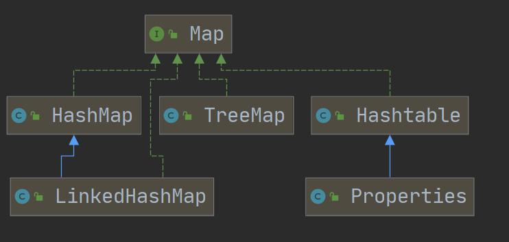

# 数据类型

## 整数/浮点数类型

- 整数类型默认是`int`，定义`long`型变量后面要加上`l`或`L`

- 浮点型默认是`double`，定义`float`型变量后面要加上`f`或`F`

- 浮点数使用陷阱：对运算结果是小数的进行相等判断时，须小心，小数运算为精度存储；应该是以两个数的差值的绝对值，在某个精度范围内判断

  ```java
  double num1 = 2.7
  double num2 = 8.1 / 3
  //不应该写成
  if(num1 == num2){...}
  //应该写成
  eps = ...//精度值
  if(Math.abs(num1 - num2) < eps)
  ```

## 字符型

- 字符型存储到计算机中，需要将字符对应的码值（整数）找出来，字符和码值的对应关系是通过字符编码表决定的

- 字符编码表

  - ASCII：1个字符使用1个字节，一共128个字符（实际上可表示256个字符）
  - Unicode：固定大小的编码，字符使用2个字节（一共65536个字符），字母和汉字统一都是占用2个字节（某些情况下浪费空间）
  - UTF-8：大小可变的编码表（可用1-6个字节表示字符），字母使用1个字节，汉字使用3个字节
  - GBK：可表示汉字，且范围广，字母使用1个字节，汉字使用2个字节
  - GB2312：可表示汉字，范围 gb2312 < gbk
  - BIG5：繁体中文，台湾，香港

- 比较两个字符串是否相同

  ```java
  String s1;
  String s2;
  s1.equals(s2) -> 相同，返回true；不同，返回false
  ```

  

## 布尔类型

- 不可以用0或非0的整数替代`false`和`true`，与C语言不同

## 自动类型转换

- java程序进行赋值或运算时，精度小的类型自动转换为精度大的数据类型

  - `char -> int -> long -> float -> double`

  - `byte -> short -> int -> long -> float -> double`
  - `char`和`byte/short`之间不会相互转换
  - `boolean`不参与转换

- 多种类型数据混合运算时，系统首先自动将所有数据转换成容量最大的数据类型，然后再进行计算

  - `char, byte, short`三者可以参与计算，在计算时首先转换为`int`类型

    ```java
    byte b1 = 1;
    byte b2 = 2;
    byte b3 = b1 + b2; //Error, b1 + b2 -> int
    ```

## 基本数据类型与String类型的转换

- 基本数据类型转String类型

  - 语法：基本类型的值 + ""

    ```java
    int n1 = 100;
    boolean b1 = true;
    String s1 = n1 + "";
    String s2 = b1 + "";
    ```

- String类型转基本数据类型

  - 语法：通过基本类型的包装类调用`parseXX`方法即可（例外：在字符串中提取字符）

    ```java
    String s1 = "123";
    int num1 = Integer.parseInt(s1);
    double num2 = Double.parseDouble(s1);
    float num3 = Float.parseFloat(s1);
    long num4 = Long.parseLong(s1);
    byte num5 = Byte.parseByte(s1);
    boolean b6 = Boolean.parseBoolean("true");
    short num6 = Short.parseShort(s1);
    //在字符串中提取字符
    char c1 = s1.charAt(0);
    ```

# 算术运算符

- `++`

  - 独立语句使用，`i++`和`++i`都等价于`i = i + 1`

  - 自增（前）：先运算后取值

    ```java
    a = 2;
    b = ++ a; //a = 3, b = 3
    ```

  - 自增（后）：先取值后运算

    ```java
    a = 2;
    b = a ++; //a = 3, b = 2
    ```

  

- `--`

  - 独立语句使用，`i--`和`--i`都等价于`i = i - 1`

  - 自增（前）：先运算后取值

    ```java
    a = 2;
    b = -- a; //a = 1; b = 1 
    ```

  - 自增（后）：先取值后运算

    ```java
    a = 2;
    b = a --; //a = 1; b = 2 
    ```

- `%`取模取余的本质：`a % b = a - a / b * b`

  ```java
  10 % 3 = 1;
  -10 % 3 = -1;
  10 % -3 = 1;
  -10 % -3 = -1;
  ```

# 逻辑运算符

- `^`异或
  - 两个条件不同，结果为`true`，否则为`false`
  - 不进位的二进制加法
- `&&`和`&`的使用区别
  - `&&`短路与：如果第一个条件为`false`，则第二个条件不会判断，最终结果为`false`，效率高
  - `&`逻辑与：不管第一个条件是否为`false`，第二个条件都要判断，效率低
  - 开发中，我们使用的基本是`&&`短路与，效率高
- `||`和`|`的使用区别
  - `||`短路或：如果第一个条件为`true`，则第二个条件不会判断，最终结果为`true`，效率高
  - `&`逻辑与：不管第一个条件是否为`true`，第二个条件都要判断，效率低
  - 开发中，我们使用的基本是`||`短路或，效率高

# 标识符的命名规则和规范

## 标识符的命名规则

- 由26个英文字母大小写，0-9，_或$组成
- 数字不可以开头
- 不可以使用关键字和保留字
- 严格区分大小写
- 标识符不能包含空格

## 标识符的命名规范

- 包名：多单词组成时所有字母都小写：`aaa.bbb.ccc`
- 类名、接口名：多单词组成时，所有单词的首字母大写：`XxxYyyZzz`
- 变量名、方法名：多单词组成时，第一个单词首字母小写，第二个单词开始每个单词首字母大写：`xxxYyyZzz`（驼峰法）
- 常量名：所有字母都大写，多单词组成时每个单词用下划线连接：XXX_YYY_ZZZ

# 二进制运算

## 原码、反码、补码

- 二进制最高位是符号位，0表示正数，1表示负数
- 正数和0的原码、反码、补码都一样（三码合一）
- 负数的反码 = 它的原码符号位不变，其它位取反
- 负数的补码 = 它的反码 + 1，负数的反码 = 负数的补码 - 1
- java没有无符号数，java中的数都是有符号的
- 计算机是以补码的方式来运算的
- 运算结果要看它的原码

## 位运算符

- 算术右移`>>`：低位溢出，符号位不变，并用符号位补溢出的高位
- 算术左移`<<`：符号位不变，低位补0
- 逻辑右移`>>>`：无符号右移，低位溢出，高位补0（没有`<<<`符号）

# 增强 for 循环

- 适用于**不需要得到数组索引的遍历**
- 增强`for`循环不能获取数组索引，也不能修改数组元素
- IDEA快捷键：`iter`

```java
// 举例
int[] nums = {1, 2, 3};
// 普通for循环
for(int i=0; i < nums.length; i++) {
    System.out.println(nums[i]);
}
// 增强for循环, 依次从nums数组中取出数据，赋给i
for(int i : nums) {
    System.out.println("i=" + i);
}
```

# switch注意事项

- `switch(表达式)`中的表达式数据类型，应和`case`后的常量类型一致，或者是可以自动转成可以相互比较的类型
- `switch(表达式)`中的表达式的返回值必须是：`byte,short,int,char,enum[枚举],String`
- `case`子句中的值必须为常量，不能是变量
- `default`子句是可选的，当没有可匹配的`case`时，执行`default`
- `break`语句用来在执行完一个`case`分支后使程序跳出`switch`语句块；如果没有`break`，程序会顺序执行到`switch`结尾，除非遇到`break`

# break注意事项

- `break`语句出现在多层嵌套语句块中，可通过标签指明要终止的是哪一层语句块

  （`continue`也有类似的用法）

  

- 实际开发中，尽量不要使用标签

# 数组

## 数组声明

```java
// 第一种(静态初始化)：数据类型[] 数组名 = {};(更符合java习惯) 
// 或 数据类型 数组名[] = {};
type[] arrayname = {a1,a2,a3,...};
type arrayname[] = {a1,a2,a3,...};

// 第二种(动态初始化)：数据类型[] 数组名 = new 数据类型[大小];
// 或 数据类型 数组名[] = new 数据类型[大小];
type[] arrayname = new type[arraysize];
type arrayname[] = new type[arraysize];

// 第三种(动态初始化:先声明后创建)：数据类型[] 数组名; 数组名 = new 数据类型[大小]； 
// 或 数据类型 数组名[]; 数组名 = new 数据类型[大小]；
type[] arrayname;
arrayname = new type[arraysize];

type arrayname[];
arrayname = new type[arraysize];
```

## 数组注意事项

- 数组属于引用类型，数组型数组是对象（`object`）

- 数组创建后，如果没有赋值，有默认值（如`boolean false`）

- 数组在默认情况下是引用传递，赋的值是地址

  

# 二维数组

## 二维数组声明

```java
// 第一种(静态初始化)：数据类型[][] 数组名 = {};(更符合java习惯) 
// 或 数据类型 数组名[][] = {};
type[][] arrayname = {{a1,a2},{a3,...},...;
type arrayname[][] = {{a1,a2},{a3,...},...;

// 第二种(动态初始化)：数据类型[][] 数组名 = new 数据类型[大小][大小];
// 或 数据类型 数组名[][] = new 数据类型[大小][大小];
type[][] arrayname = new type[arraysize][arraysize];
type arrayname[][] = new type[arraysize][arraysize];

// 第三种(动态初始化:先声明后创建)：数据类型[][] 数组名; 数组名 = new 数据类型[大小][大小]； 
// 或 数据类型 数组名[][]; 数组名 = new 数据类型[大小][大小]；
type[][] arrayname;
arrayname = new type[arraysize][arraysize];

type arrayname[][];
arrayname = new type[arraysize][arraysize];
  
// 第四种(动态初始化:列数不确定)：数据类型[][] 数组名 = new 数据类型[大小][]； 
// 或 数据类型 数组名[][] = new 数据类型[大小][]；
type[][] arrayname = new type[arraysize][];
type arrayname[][] = new type[arraysize][];                
```

## 二维数组注意事项

- 一维数组的声明方式有：`int[] x`或者`int x[]`

- 一维数组的声明方式有：`int[][] y`或者`int[] y[]`或者`int y[][]`

- 二维数组内存形式

  

# 冒泡排序

```java
public class BubbleSort {

	public static void main(String[] args) {

		int[] nums = {24, 69, 80, 57, 13};
        int temp = 0; //辅助交换的变量

        //多轮排序用外层循环
		for(int i = 0; i < nums.length-1; i++) {
			//单轮排序次数逐次减小
			for(int j = 0; j < nums.length-1-i; j++) {
				//若前面的数大于后面的数，交换数值
				if(nums[j] > nums[j+1]) {

					temp = nums[j];
					nums[j] = nums[j+1];
					nums[j+1] = temp;
				}
			}
		}
		//输出
		for(int i = 0; i < nums.length; i++) {

			System.out.print(nums[i]+" ");
		}
	}
}
```

# 类与对象

- 类：自定义的数据类型

  - 类包括**属性/成员变量**，**行为/成员方法**，**代码块**，**构造器**，**内部类**

  ```java
  package 包名;
  class 类名 {
      成员变量/属性;
      {}; // 代码块
      构造器;
      成员方法;
      class 内部类名 {
      }
  }
  ```

  

- 对象：类的具体实例

  - 从**类**到**对象**，有几种说法：创建一个对象；实例化一个对象；把类实例化...

## 对象的内存形式

**注意：**

- Java6和6之前，常量池是存放在方法区（永久代）中的

- Java7，将常量池是存放到了堆中

- **Java8之后**，取消了整个永久代区域，取而代之的是元空间；

  **运行时常量池和静态常量池存放在元空间中，而字符串常量池依然存放在堆中**


## 属性/成员变量/字段field

- 属性一般是基本数据类型，也可以是引用类型（对象，数组）
- 属性的定义语法同变量，利用**修饰符**控制属性的访问范围（`public`，`protected`，默认，`private`）
- 属性如果不赋值，有默认值，规则同数组

## 对象的创建

```java
// 第一种(直接创建)：类名 对象名 = new 类名(); 
ClassName objectName = new ClassName();

// 第二种(先声明再创建)：类名 对象名; 对象名 = new 类名(); 
ClassName objectName;
objectName = new ClassName();
```

## 类和对象的内存分配机制

- java内存的结构分析
  - 栈：一般存放基本数据类型（局部变量）
  - 堆：存放对象（类的对象，数据等）和字符串常量
  - 方法区/元空间：常量池，类加载信息

## 成员方法/方法

- 方法：对象可以执行的动作
- 好处
  - 提高代码的复用性
  - 可以将实现的细节封装起来，然后供其他用户来调用即可

## 成员方法的调用机制原理


- 当程序运行到方法时，就会开辟一个独立的空间（栈空间）

## 成员方法的定义

```java
/*访问修饰符 返回数据类型 方法名(形参列表) {
	语句；
 	return 返回值；
 }
 */
```

- 形参列表：表示成员方法输入
- 返回数据类型：表示成员方法输出, `void`表示没有返回值
- 方法主体：表示为了实现某一功能代码块
- `return`语句不是必须的
- 访问修饰符：作用是控制方法使用的范围（`public`，`protected`，默认，`private`）

## 成员方法的注意事项

- 方法里**不能嵌套**另一个方法的**定义**，可以**调用**别的方法

  - 方法调用细节

    - 同一个类中的方法调用：直接调用即可，`method.()`

    - 跨类中的方法调用：需要先创建对象，再通过对象名调用，（还与访问修饰符有关）

      `ClassName objectName = new ClassName(); objectName.method()`

- 一个方法最多有一个返回值；若需返回**多个结果**，返回**数组**

- 返回类型可以为任意类型，包含基本类型或引用类型(数组，对象)

- 方法名遵循驼峰命名法

## 成员方法传参机制

- 基本数据类型的传参：传递的是值（值拷贝），形参的任何改变不影响实参（独立内存空间）
- 引用数据类型（数组，对象）的传参：传递的是地址，可以通过形参影响实参（地址指向相同内存空间）
- 成员方法返回类型是引用类型时，注意其对应的内存空间

## 方法递归调用


- 要点：找准递归结束条件
- 实例：斐波那契数列，吃桃子问题，迷宫问题（递归回溯），汉诺塔问题，八皇后问题（递归回溯）

## 方法重载（OverLoad）

- java中允许同一个类中，多个同名方法的存在，但要求形参列表不一致
- 方法名：必须相同
- 形参列表：必须不同（形参类型或个数或顺序，至少一样不同，参数名无要求）
- 返回类型：无要求

## 可变参数

- java允许将同一个类中多个同名同功能但参数个数不同的方法，封装成一个方法，就可以通过可变参数实现

- 基本语法

  ```java
  //访问修饰符 返回类型 方法名(数据类型... 形参名) {
  //}
  //求和n个数，n个数存放在nums数组
  public int sum(int... nums) {
      int res = 0;
      for(int i = 0; i < nums.length; i++) {
          res += nums[i];
      }
      return res;
  }
  ```

- 可变参数的本质就是数组
- 可变参数的实参可以为0个或任意多个
- 可变参数可与不同类型的参数一起放在形参列表，但可变参数必须在最后
- 一个形参列表中只能出现一个可变参数

# 作用域

## 基本使用

- java中，主要的变量是属性/成员变量/全局变量和局部变量
- 局部变量一般是指在成员方法中定义的变量
- java中作用域的分类
  - 全局变量/属性：作用域为整个类体，或被其他类使用（通过对象调用）
  - 局部变量：就是除了属性外的其他变量，作用域为定义它的代码块中
- 全局变量/属性可以不赋值，直接使用，因为有默认值；局部变量必须赋值后才能使用，因为没有默认值

## 作用域的注意事项

- 属性和局部变量可以重名（因为不在同一个作用域），访问时遵循就近原则

- 在同一个作用域中，比如在同一个成员方法中，两个局部变量，不能重名

- 属性的生命周期较长，伴随着对象的创建/销毁而创建/销毁；

  局部变量的生命周期较短，伴随着代码块的执行/结束而创建/销毁，即再一次方法调用中

- 全局变量/属性可以加修饰符；

  局部变量不可以加修饰符

# 构造方法/构造器constructor

- 作用：创建对象时，就直接赋值对象的属性（完成对象的初始化）

## 基本语法

与成员方法类似

```java
/*访问修饰符 方法名(形参列表) {
	方法体;
 }
 */
```

- 构造器的修饰符：`默认,public,protected,privated`
- **构造器没有返回值**
- **构造器的方法名与类名一致**
- 参数列表和成员方法一样的规则
- 构造器的调用由系统执行

## 构造器的注意事项

- 一个类可以定义多个不同的构造器，即构造器重载

- **构造器没有返回值**

- **构造器的方法名与类名一致**

- 构造器是完成对象的初始化，并不是创建对象

- 如果没有定义构造器，系统会自动给类生成一个默认无参构造器（也叫默认构造器），可以使用`javap`反编译指令进行查看

  ```java
  class ClassName {
      /*
      默认构造器
      ClassName() {
      }
      */
  }
  ```

- **一旦自定义了构造器，默认构造器就被覆盖了（无法再使用默认构造器），除非显式的定义它，即`ClassName() {}`**(相当于构造器重载)

# 对象创建的流程分析

## 流程分析


1. 在方法区/元空间里加载类信息，只会加载一次
2. 在堆中分配空间（地址）
3. 完成对象初始化：默认初始化 -> 显式初始化 -> 构造器的初始化
4. 在对象在堆中的地址，返回给创建的对象


# this 关键字

## 基本介绍

- jvm会给每个对象分配`this`，`this`代表当前对象，`this.objectName`代表当前对象的属性；哪个对象被调用，`this`就代表哪个对象

- 用处：`this`用于区分当前类的属性和局部变量

  举例：构造器的形参能够直接写成属性名（并将形参赋值给`this.objectName`），解决了作用域的问题

## hashCode() 方法

- 使用`hashCode()`，以hashCode的十进制为格式返回对象的地址

## this 关键字的注意事项

- `this`关键字可以用来访问本类的**属性**、**方法**、**构造器**
- **访问成员方法**的语法：`this.methodName(parametersList);`
- **访问构造器**的语法：`this(parametersList);`（**只能在构造器中使用，即只能在构造器中访问其他构造器，并且对`this`的调用必须是构造器中的第一个语句**）
- `this`不能在类定义的外部使用，只能在类定义的方法中使用

# 包

## 作用

- 区分相同名字的类
- 当类很多时，可以很多的管理类
- 控制访问范围

## 基本语法

```java
package com.companyname;
// package 关键字,表示打包
//com.companyname 表示包名(com是company的缩写)
```

## 包的本质

- 包的本质：实际上就是创建不同的文件夹/目录保存类文件

## 包的命名

- 命名规则

  - 只能包含数字、字幕、下划线、小圆点

  - 不能用数字开头，不能是关键字或保留字

- 命名规范

  - 一般是小写字母+小圆点

  - 一般是`com.公司名.项目名.业务模块名`

    ```java
    // 举例
    com.sina.crm.user //用户模块
    com.sina.crm.utils //订单模块
    ```

## 包的引入

```java
// 举例
import java.util.Scanner; // 只是引入一个类Scanner
import java.util.*; // 表示将java.util包的所有类都引入
```

- 需要使用哪个类，就导入哪个类即可，不建议使用`*`导入

## 包的注意事项

- `package`的作用是声明当前类所在的包，需要放在类的最上面，一个类中最多一句`package`
- `import`指令需放在`package`的下面，在类定义前面，`import`指令可以有多句且没有顺序要求

# 访问修饰符

| 访问级别 | 访问控制修饰符 | 同类               | 同包               | 子类               | 不同包             |
| -------- | -------------- | ------------------ | ------------------ | ------------------ | ------------------ |
| 公开     | `public`       | :heavy_check_mark: | :heavy_check_mark: | :heavy_check_mark: | :heavy_check_mark: |
| 受保护   | `protected`    | :heavy_check_mark: | :heavy_check_mark: | :heavy_check_mark: | :x:                |
| 默认     | 没有修饰符     | :heavy_check_mark: | :heavy_check_mark: | :x:                | :x:                |
| 私有     | `private`      | :heavy_check_mark: | :x:                | :x:                | :x:                |

## 访问修饰符的注意事项

- 修饰符可以用来修饰类中的**属性**，**成员方法**以及**类**
- **只有默认的和`public`才能修饰类**

# 封装encapsulation

## 作用

- 隐藏实现细节：方法（连接数据库）<-- 调用（传入参数）
- 可以对数据进行验证，保证安全合理

## 封装的实现步骤（三步）

1. 将属性私有化`private`（不能直接修改属性）

2. 提供一个公共的`(public)set`方法，用于对属性判断并赋值

   ```java
   public void setXxx(类型 参数名) { // Xxx表示某个属性
       // 加入数据验证的业务逻辑
       属性 = 参数名；
   }
   ```

3. 提供一个公共的`(public)get`方法，用于获取属性的值

   ```java
   public 数据类型 getXxx() { // Xxx表示某个属性
       // 加入权限判断的业务逻辑
       return xx；
   }
   ```

## 构造器与 setXxx 结合

- 举例

  ```java
  //有三个属性的构造器
  public Person(String name, int age, double salary) {
  	// this.name = name;
  	// this.age = age;
  	// this.salary = salary;
  	//我们可以将 set 方法写在构造器中，这样仍然可以验证
  	setName(name);
  	setAge(age);
  	setSalary(salary);
  }
  ```

# 继承

## 作用

- 继承可以解决代码复用
- 当多个类存在相同的属性（变量）和方法时，可以从这些类中抽象出父类，在父类中定义这些相同的属性和方法，所有的子类不需要重新定义这些属性和方法，只需要通过 `extends`来声明继承父类即可


## 继承的基本语法

```java
class 子类 extends 父类{
    
}
```

- 子类`subclass`自动拥有父类`superclass`定义的属性和方法
- 父类`superclass`又叫超类、基类
- 子类`subclass`又叫派生类

## 继承的注意事项

1. 子类继承了父类的所有属性和方法，非私有的属性和方法可以在子类直接访问，但是私有属性和方法不能在子类直接访问，要通过父类提供公共的方法去访问（`getXXX()`）

2. 子类必须调用父类的构造器，完成父类的初始化

   （可以理解为，只有先创建了父类的对象，子类的对象才能被创建，所以会调用父类的构造器）

3. 当创建子类对象时，不管使用子类的哪个构造器，默认情况下总会去调用父类的无参构造器，因为子类的构造器中默认包含`super()`语句；

   如果父类没有提供无参构造器，则必须在子类的构造器中用` super` 去指定使用父类的哪个构造器完成对父类的初始化工作，否则，编译不会通过

4. 如果希望指定去调用父类的某个构造器，则显式的调用一下 : `super(参数列表)`
5. `super`在使用时，必须放在构造器第一行(`super`只能在构造器中使用)
6. `super() `和 `this() `都只能放在构造器第一行，因此这两个方法不能共存在一个构造器
7. java 所有类都是 `Object `类的子类，`Object `是所有类的基类
8. 父类构造器的调用不限于直接父类！将一直往上追溯直到 `Object`类（顶级父类）
9. **子类最多只能继承一个父类（指直接继承），即 java 中是单继承机制**
   思考：如何让 A 类继承 B 类和 C 类？ 【A 继承 B， B 继承 C】
10. 不能滥用继承，子类和父类之间必须满足`is-a`的逻辑关系（从属关系）

## 继承的本质

当子类继承父类，创建子类对象时，内存中的变化：

1. 首先看子类是否有该属性
2. 如果子类有该属性，而且可以访问，则返回信息
3. 如果子类没有该属性，则看父类是否有该属性（如果父类有该属性，而且可以访问，则返回信息）
4. 如果父类没有该属性，则按3.的规则，继续找上级父类，直到`Object`


# super 关键字

## 基本介绍

- `super`代表父类的引用，用于访问父类的属性、方法、构造器

## 基本语法

- 访问父类的属性，但不能访问父类的`pravite`属性

  ```java
  super.objectName;
  ```

- 访问父类的方法，但不能访问父类的`pravite`方法

  ```java
  super.methodName(parameterList);
  ```

- 访问父类的构造器

  ```java
  super(parameterList); // 只能放在构造器的第一句，且只能出现一句
  ```

## super 的注意事项

- 当子类中有和父类中的成员（属性和方法）重名时，为了访问父类的成，员（属性和方法）必须通过`super`；如果没有重名，使用`super`、`this`、直接访问是一样的效果
- `super`的访问不限于直接父类，如果爷爷类和本类中有同名的成员，也可以使用`super`去访问爷爷类的成员
- 如果多个基类（上级类）中都有同名的成员，使用`super`访问遵循就近原则

## super 和 this 的比较

|      | 区别点     | `this`                                                 | `super`                                  |
| ---- | ---------- | ------------------------------------------------------ | ---------------------------------------- |
| 1    | 访问属性   | 访问本类中的属性，如果本类没有该属性则从父类中继续查找 | 从父类开始查找属性                       |
| 2    | 调用方法   | 访问本类中的方法，如果本类没有该方法则从父类中继续查找 | 从父类开始查找方法                       |
| 3    | 调用构造器 | 调用本类构造器，必须放在构造器的首行                   | 调用父类构造器，必须放在子类构造器的首行 |
| 4    | 特殊       | 表示当前对象                                           | 子类中访问父类的对象                     |

# 方法重写/覆盖（Override）

## 基本介绍

- 子类有一个方法，与**父类**的某个方法的**名称**、**形参列表**、**返回类型**一样，那么我们就说子类的这个方法覆盖父类的方法

## Override 的注意事项

- 子类的方法的形参列表、方法名称，要和父类的形参列表、方法名称完全一样
- 子类的方法的返回类型和父类的返回类型一样，或者是父类返回方式的子类
  - 比如，父类方法的返回类型是`Object`，子类方法的返回类型是`String`
- 子类方法不能缩小父类方法的访问权限（`public` > `protected` > 默认 > `private`）

## Override vs Overload

| 名称                 | 发生范围 | 方法名   | 形参列表                         | 返回类型                                                     | 修饰符                             |
| -------------------- | -------- | -------- | -------------------------------- | ------------------------------------------------------------ | ---------------------------------- |
| 方法重载（Overload） | 本类     | 必须一样 | 类型，个数或者顺序至少有一个不同 | 无要求                                                       | 无要求                             |
| 方法重写（Override） | 父子类   | 必须一样 | 相同                             | 子类重写的方法，返回类型和父类方法的返回类型一致，或者是其子类 | 子类方法不能缩小父类方法的访问范围 |

# 多态

## 基本介绍

- 多态（多种形态）：方法或对象具有多种形态，面向对象的第三大特征，多态是建立在封装和继承的基础之上的

## 方法的多态

- 方法重写（Override）
- 方法重载（Overload）

## 对象的多态

- 对象的编译类型和运行类型可以不一致
- **编译类型**在定义对象时，就确定了，**不能改变**
- **运行类型**是**可以改变的**
- **编译类型看定义时`=`号的左边，运行类型看定义时`=`号的右边**

## 多态的注意事项

- 多态的前提：两个对象（类）存在继承关系

- 多态的**向上转型**

  1. 本质：父类的引用指向了子类的对象
  2. 语法：`父类类型 引用名 =  new 子类类型();`
  3. 特点：可以调用父类中的所有成员；不能调用子类中的特有成员

- 多态的**向下转型**

  1. 语法：`子类类型 引用名 = (子类类型) 父类引用名;`
  2. 只能强转父类的引用，不能强转父类的对象
  3. 要求父类的引用必须指向的是当前目标类型的对象
  4. 当向下转型后，可以调用子类中所有的成员

- 属性没有重写之说，属性的值看编译类型；方法看运行类型，因为方法有重写

## instanceOf 比较操作符

- 用于判断对象的运行类型是否为XX类型或XX类型的子类型

## java的动态绑定机制

- 当调用对象方法时，**该方法会和该对象的内存地址/运行类型绑定**
- 当调用对象属性时，**没有动态绑定机制**，哪里声明，哪里使用

## 多态的应用

- 多态数组：数组的定义类型为父类类型，里面保存的实际元素类型为子类类型
- 多态参数：方法定义的形参类型为父类类型，实参允许为子类类型

# Object 类详解

## equals 方法

1. `==`和`equals`的对比

   - `==`是一个比较运算符
     - `==`既可以判断基本类型，也可以判断引用类型
     - `==`判断基本类型，判断的是值是否相等
     - `==`判断引用类型，判断的是地址是否相等
   - `equals`是`Object`类中的方法
     - `equals`只能判断引用类型
     - 默认判断的是地址是否相等，子类中往往重写`equals`方法，用于判断内容是否相等（比如`Integer`和`String`的`equals`源代码）

2. 重写`equals`方法

## hashCode 方法

- 使用`hashCode()`，以hashCode的十进制为格式返回对象的地址

- 提高具有哈希结构的容器的效率

- 两个引用，如果指向的是同一个对象，则哈希值肯定是一样的；

  两个引用，如果指向的是不同对象，则哈希值是不一样的

- 哈希值主要根据地址号来的，但不能完全将哈希值等价于地址

- 在集合中，会根据需要重写`hashCode()`

## toString 方法

- 默认返回：全类名 + @ + 哈希值的十六进制 （全类名 = 包名 + 类名）
- 子类往往会重写`toString`方法，打印对象或拼接对象时，都会自动调用该对象的`toString`形式
- 当直接输出一个对象时，`toString`方法会被默认的调用，比如 `System.out.println(monster);` 就会默认调用
  `monster.toString()`
- `toString`方法重写后，一般是把对象的属性值输出

## finalize方法

*面试重点，实际开发中几乎不会运用 finalize方法*

- 当**对象被回收**时，**系统自动调用该对象的`finalize`方法**，子类可以重写该方法，做一些释放资源的操作
- 对象何时会被回收：当某个**对象没有任何引用**时，则 jvm 就认为这个对象是一个垃圾对象，就会使用**垃圾回收机制来销毁该对象**，在**销毁该对象前**，会**先调用`finalize`方法**
- 垃圾回收机制的调用，是由系统来决定（即有自己的 GC 算法）, 也可以通过`System.gc()` 主动触发垃圾回收机制

## 断点调试 Debug

- 断点可以在`Debug`过程中，动态的下断点
- 断点调试的快键键
  - F7：step in，跳入方法内
  - F8：step over，逐行执行代码
  - shift+F8：step out，跳出方法
  - F9：resume，执行到下一个断点

# 类变量

## 基本介绍

- 类变量/静态变量/静态属性：**该类的所有对象共享的变量**，该类的任何一个对象去访问它时，**取到的都是相同的值**；

  同样地，该类的任何一个对象去修改它时，**修改的也是同一个值**

## 类变量的定义与访问

- 定义语法

  ```java
  访问修饰符 static 数据类型 变量名; //推荐用法
  static 访问修饰符 数据类型 变量名;
  ```

- 访问

  ```java
  类名.类变量名 //推荐用法
  对象名.类变量名
  ```

  类变量/静态变量的访问修饰符的访问权限和范围和普通属性是一样的

## 类变量的内存布局

- JDK7 以上版本，静态域存储于定义类的`Class`对象中，`Class`对象如同堆中其他对象一样，存在与GC堆中
- `static`变量保存在`Class`实例的尾部，`Class`对象确实在堆中

## 类变量的注意事项

- 何时需要用类变量
  - 当需要让某个类的所有对象都共享一个变量时，可考虑使用类变量
- 类变量与实例变量/普通属性的区别
  - 类变量是该类的所有对象共享的，实例变量是每个对象独享的
- 加上`static`称为类变量或静态变量，否则称为实例变量/普通变量/非静态变量
- 实例变量不能通过`类名.类变量名`方式访问
- 类变量是在类加载时就初始化了，即使没有创建对象，只要类加载了，就可以使用类变量
- 类变量的生命周期是随类的加载开始的，随着类消亡而销毁

# 类方法

## 基本介绍

- 类方法也叫静态方法

## 类方法的定义与调用

- 定义

  ```java
  访问修饰符 static 数据返回类型 方法名() {} //推荐用法
  static 访问修饰符 数据返回类型 方法名() {}
  ```

- 调用

  ```java
  类名.类方法名 //推荐用法
  对象名.类方法名
  ```

## 类方法的应用场景

- 当方法中不涉及任何和对象相关的成员，则可以将方法设计成静态方法，提高开发效率
- 实际开发中，往往会将一些通用的方法，设计成静态方法，这样就不需要创建对象也可以调用方法，比如打印一维数组，冒泡排序，完成某个计算任务等...

## 类方法的注意事项

- 类方法和普通方法都是随着类的加载而加载，将结构信息存储在方法区
- **类方法中不允许使用和对象有关的关键字**，如`this`和`super`，普通方法可以
- 类方法中无`this`的参数，普通方法中隐含着`this`的参数
- **类方法/静态方法中，只能访问静态变量或静态方法**
- **普通成员方法/非静态方法，既可以访问非静态成员，也可以访问静态成员**

# 理解 main 方法

## 理解 main 方法的形式

`public static void main(String[] args) {}`

- `main()`方法由java虚拟机调用

- java虚拟机需要调用类的`main()`方法，所以该方法的访问权限必须是`public`

- java虚拟机在执行`main()`方法时不必创建对象，所以该方法必须是`static`

- 该方法接收`String`类型的数组参数，该数组中保存执行java命令时传递给所运行的类的参数

  ```java
  java 运行的类名 第一个参数 第二个参数 第三个参数
  ```

  

## main 方法的注意事项

- `main()`方法中，可以直接调用`main()`方法所在类的静态方法或静态属性
- 不能直接访问该类中的非静态成员，必须创建该类的一个实例对象后，才能通过这个对象去访问类中的非静态成员

# 代码块

## 基本介绍

- 代码块，又称为**初始化块**，属于类的成员（即是类的一部分），类似于方法，将逻辑语句封装在方法体中，通过`{}`包围起来
- 与方法不同的是，没有方法名，没有返回，没有参数，只有方法体，且不通过对象或类显式调用；而是加载类时，或创建对象时隐式调用

## 基本语法

```java
[访问修饰符] {
    代码
};
```

- 修饰符可选，要写的话，也只能写`static`
- 代码块分为两类
  - 使用`static`修饰：静态代码块
  - 没有`static`修饰：普通代码块/非静态代码块
- 逻辑语句可以为任何逻辑语句
- `;`号可写可不写

## 代码块的应用场景

- 相当于另一种形式的构造器（对构造器的补充机制），可以做初始化操作
- 应用场景：如果**多个构造器中都有重复的语句**，可以**抽取到代码块/初始化块**，提高代码块的复用性

## 代码块的注意事项

- `static`代码块/静态代码块，作用是对类进行初始化，它**随着类的加载而执行**，且**只会执行一次**；普通代码块，**每创建一个对象，就执行一次**

- **类什么时候加载：**
  
  1. 创建对象实例时（`new`）
  2. 创建子类对象实例，父类也会被加载
  3. 使用类的静态成员时（静态方法、静态属性）
  
- 普通代码块，在创建对象实例时，会被隐式的调用，被创建一次，就会被调用一次；如果是使用类的静态成员时，普通代码块并不会执行

- **创建一个对象时，在一个类的调用顺序：**
  
  1. 调用**静态代码块**和**静态属性**初始化
  
     （两者初始化调用的**优先级相同**，若有多个，则按定义的**顺序调用**）
  
  2. 调用**普通代码块**和**普通属性**初始化
  
     （两者初始化调用的**优先级相同**，若有多个，则按定义的**顺序调用**）
  
  3. 调用构造方法
  
- 构造器的最前面隐含了`super()`和调用普通代码块

- **创建一个子类对象时，调用顺序：**

  1. 父类的静态代码块和静态属性（优先级相同，按定义顺序执行）
  2. 子类的静态代码块和静态属性（优先级相同，按定义顺序执行）
  3. 父类的普通代码块和普通属性（优先级相同，按定义顺序执行）
  4. 父类的构造器
  5. 子类的普通代码块和普通属性（优先级相同，按定义顺序执行）
  6. 子类的构造器

- 静态代码块只能直接调用静态成员（静态方法和静态属性）；普通代码块可以调用任意成员

# 单例设计模式

## 基本介绍

- 采取一定的方法保证在整个的软件系统中，对某个类只能存在一个对象实例，并且该类只提供一个取得其对象实例的方法
- 单例模式有两种：
  - 饿汉式：在类加载的时候就创建了对象
  - 懒汉式：在需要使用时才创建对象

## 饿汉式单例模式

- 实现步骤

  1. 构造器私有化`pravite`（防止被直接创建`new`）

  2. **类的内部直接创建对象**，**定义并创建**一个**`static`属性对象**

     ```java
     private static ClassName objectName = new ClassName();
     ```

  3. 提供一个公共的`static`方法`getInstance()`，用于返回对象

## 懒汉式单例模式

- 实现步骤

  1. 构造器私有化`pravite`（防止被直接创建`new`）

  2. **定义一个`static`属性对象**

     ```java
     private static ClassName objectName; //默认为null
     ```

  3. 提供一个公共的`static`方法`getInstance()`，用于返回对象

     ```java
     public static ClassName getInstance() {
         if(objectName == null) { // 如果还没有创建对象
             objectName = new ClassName();
         }
         return objectName;
     }
     ```

     

  4. 只有当用户调用`getInstance()`方法时，才创建并返回对象，之后再次调用时，会返回上次创建的对象

## 饿汉式 vs 懒汉式

- 两者最主要的区别在于创建对象的时机不同
  - 饿汉式是在类加载时就创建了对象实例
  - 懒汉式是在使用时才创建
- 饿汉式不存在线程安全问题，懒汉式存在线程安全问题
- 饿汉式存在浪费资源的可能，如果没有使用创建的对象；懒汉式是使用时才创建，就不存在资源浪费的问题

# final 关键字

## 基本介绍

- `final`可以修饰类、属性、方法和局部变量
- `final`的应用场景
  1. 当不希望类被继承时，可以用`final`修饰
  2. 当不希望父类的某个方法被子类重写（Override）时，可以用`final`修饰
  3. 当不希望类的某个属性的值被修改时，可以用`final`修饰
  4. 当不希望某个局部变量被修改时，可以用`final`修饰

## final 的注意事项

- `final`修饰的属性又叫**常量**，用`XX_XX_XX`来命名（如`TAX_RATE`）
- `final`修饰的属性必须赋初值，且以后不能再修改；赋值可在以下位置之一：
  1. 定义时：如`public final double TAX_RATE = 0.08;`
  2. 在代码块中
  3. 在构造器中
- `final`修饰的属性是**静态**的，则赋初值的位置只能是：
  1. 定义时：如`public final double TAX_RATE = 0.08;`
  2. 在静态代码块中，**不能在构造器中赋值**
- `final`类不能继承，但可以实例化对象
- 如果类不是`final`类，但含有`final`方法，则该方法虽然不能被重写，但可以被继承
- 一般来说，如果一个类已经是`final`类，就没必要再将该类的方法修饰成`final`方法
- `final`不能修饰构造器
- `final`和`static`往往搭配使用，效率更高
  - **若`static final`修饰的是基本数据类型和`String`变量，则在使用该变量时不会导致类加载，底层编译器做了优化**
- 包装类（`Integer`，`Double`，`Float`，`Boolean`等都是`final`），`String`也是`final`类

# 抽象类

## 基本介绍

- 当父类的一些方法不能确定时，考虑将该方法设计为抽象（`abstract`）方法

- `abstract`关键字修饰一个类时，这个类叫做抽象类

  ```java
  访问修饰符 abstract 类名 {}
  ```

- `abstract`关键字修饰一个方法时，这个类叫做抽象方法

  ```java
  访问修饰符 abstract 返回类型 方法名(参数列表); // 没有方法体
  ```

- 抽象类的应用场景更多在于设计，是设计者设计后，**让子类继承并实现抽象类**

- 抽象类，面试考点，**在框架和设计模式使用较多**

## 抽象类的注意事项

- 抽象类不能被实例化
- 抽象类不一定要包含`abstract`方法
- 一旦类包含了`abstract`方法，则该类必须声明为`abstract`类
- `abstract`只能修饰类和方法，不能修饰属性和其他的
- 抽象类可以有任意成员（抽象类的本质还是类），如：非抽象方法、构造器、静态属性等
- 抽象方法不能有主体，即不能实现
- **如果一个类继承了抽象类，则它必须实现抽象类的所有抽象方法，除非它自己也声明为`abstract`类**
- **抽象方法不能使用`private`、`final`和`static`来修饰**，因为这些关键字都是和重写（`private`不能被重写，`static`与重写无关）、继承（`final`不能被继承）相违背的

## 抽象类应用于模板设计模式


# 接口

## 基本介绍

- 接口：给出一些没有实现的方法，封装到一起，到某个类要使用的时候，再根据具体情况把这些方法写出来
- **接口**是更加抽象的抽象的**类**（抽象类里的方法可以有方法体）
  - JDK 7 及之前：接口类里的所有方法都没有方法体
  - JDK 8 及之后：接口类可以有静态方法、默认方法，即接口中可以有方法的具体实现
- 接口体现了程序设计的多态和高内聚低耦合的设计思想

## 基本语法

```java
interface 接口名 {
	//属性
    //抽象方法
}
class 类名 implements 接口名 {
    自定义属性;
    自定义方法;
    必须实现的接口的抽象方法;
}
```

## 接口的注意事项

- 接口不能被实例化

- **接口中所有的方法都是`public`方法，接口中的抽象方法可以不用`abstract`修饰**

- 一个普通类实现接口，必须将该接口的所有方法都实现

- 抽象类实现接口，可以不用实现接口的方法

- 一个类可同时实现多个接口（然而抽象类只能被单继承）

  ```java
  class 类名 implements 接口名1,接口名2 {}
  ```

- 接口中的属性

  - 只能是`final`的，而且是`public static final`修饰符

  - 访问形式：`接口名.属性名`

- 接口不能继承其他类，但可以继承多个别的接口

  ```java
  interface 接口名1 extends 接口名2,接口名3 {}
  ```

- 接口的修饰符只能`public`和默认（和类的修饰符是一样的）

## 实现接口 vs 继承类

- 实现接口是对 **java 单继承机制的一种补充**
  - 子类**继承了父类**，自动拥有父类的功能
  - 如果子类需要扩展功能，可以**通过实现接口的方式扩展**
- 接口和继承解决的问题不同
  - 继承：解决代码的复用性和可维护性
  - 接口：设计好各种规范（方法），让其他类去实现这些方法，更加灵活
- 接口比继承更加灵活
  - 继承满足`is-a`关系
  - 接口只需满足`like-a`关系
- 接口在一定程度上实现代码解耦（接口规范性+动态绑定机制）

## 接口的多态特性

- 多态参数

  - 接口引用（接口类型的变量）可以指向实现了接口的类的对象实例
  - **可类比继承中的父类（继承的多态体现：向上转型）**

- 多态数组

  - 接口类型数组，存放了实现这个接口的类的对象实例
  - **可类比动态绑定机制（继承的多态体现：向下转型、动态绑定机制）**

- 多态传递

  - **接口可以继承另一个接口**

    比如，接口B继承了接口A，C类实现了接口B，也相当于C类实现了接口A

# 内部类

## 基本介绍

- 一个类的内部又完整地嵌套了另一个类结构
  - 内部类（Inner class）：被嵌套的类
  - 外部类（Outer class）：嵌套其他类的类

## 基本语法

```java
class Outer { // 外部类
    class Inner { // 内部类
    }
}

class Other { // 外部其他类
}
```

## 内部类的分类

- 定义在外部类的局部位置上（比如在方法内）：
  - 局部内部类（有类名）
  - **匿名内部类（没有类名）**
- 定义在外部类的成员位置上：
  - 成员内部类（没用`static`修饰）
  - 静态内部类（使用`static`修饰）

## 局部内部类的使用

- 局部内部类定义在外部类的局部位置，比如**在方法中/代码块**，并且有类名
- **本质仍然是一个类**
- **作用域：仅仅在定义它的方法或代码块中**
- **不能添加访问修饰符**（因为它的地位是一个局部变量，局部变量不能使用修饰符），**但可以使用`final`修饰**（因为局部变量可以使用`final`）
- 局部内部类访问外部类的成员：直接访问
- 外部类访问局部内部类的成员：先创建对象，再访问
- 外部其它类不能访问局部内部类（因为局部内部类的地位是一个局部变量）
- 如果**外部类和局部内部类的成员重名**时，默认遵循**就近原则**；如果想访问外部类的成员，**可以使用`外部类名.this.成员名`去访问**

## 匿名内部类的使用

- 局部内部类定义在外部类的局部位置，比如**在方法中/代码块**，并且**没有类名**

  （实际上JDK底层在创建匿名内部类`OuterClassName$number`，`number`是创建匿名内部类的顺序）

- **本质仍然是一个类**

- 将创建类、重写父类方法/实现接口、实例化对象同时完成，且之后销毁这个类，仅保留对象

- 实际上就是对于那些低调用率的子类或实现接口的类，可以不用额外再创建个类去继承父类或实现接口，从而简化开发

- 基本语法

  ```java
    new 类名或接口名(参数列表) {
    	类体
    };
  // 两种用法
  // 第一种:举例,创建基于类的匿名内部类
  ClassName objectName = new ClassName() {
      public void method() {
          ...
      }
  };
  objectName.method();
  
  // 第二种:举例,直接调用,匿名内部类本身也是返回对象
  new ClassName() {
      public void method() {
          ...
      }
  }.method();
  ```

- **作用域：仅仅在定义它的方法或代码块中**
- **不能添加访问修饰符**（因为它的地位是一个局部变量，局部变量不能使用修饰符），**但可以使用`final`修饰**（因为局部变量可以使用`final`）
- 匿名内部类访问外部类的成员：直接访问
- 可以调用匿名内部类方法（匿名内部类既是一个类的定义，本身也是一个对象）
- 外部其它类不能访问匿名内部类（因为局部内部类的地位是一个局部变量）
- 如果**外部类和匿名内部类的成员重名**时，默认遵循**就近原则**；如果想访问外部类的成员，**可以使用`外部类名.this.成员名`去访问**
- 匿名内部类的常见应用：当做实参直接传递，简洁高效

## 成员内部类的使用

- 成员内部类是定义在外部类的成员位置，并且没有`static`修饰
- **作用域：整个内体，和外部类的其他成员一样**
- **可以添加任意访问修饰符**（因为它的地位是一个成员）
- 成员内部类访问外部类的成员：直接访问
- 外部类访问成员内部类的成员：先创建对象，再访问
- **外部其它类访问成员内部类**：两种方式
  1. 先创建外部类对象，再创建成员内部类
  2. 在外部类中，编写一个方法，用于返回成员内部类对象
- 如果**外部类和成员内部类的成员重名**时，默认遵循**就近原则**；如果想访问外部类的成员，**可以使用`外部类名.this.成员名`去访问**

## 静态内部类的使用

- 静态内部类是定义在外部类的成员位置，并且有`static`修饰
- **作用域：整个内体，和外部类的其他成员一样**
- **可以添加任意访问修饰符**（因为它的地位是一个成员）
- 静态内部类访问外部类的静态成员：直接访问所有静态成员
- 外部类访问静态内部类的成员：先创建对象，再访问
- **外部其它类访问成员内部类**：两种方式
  1. 通过类名直接访问（因为是静态）
  2. 在外部类中，编写一个方法，用于返回静态内部类对象
- 如果**外部类和静态内部类的成员重名**时，默认遵循**就近原则**；如果想访问外部类的成员，**可以使用`外部类名.this.成员名`去访问**

# 枚举

## 基本介绍

- 枚举类（enumeration， 简写`enum`）：把具体的对象一个一个列举出来的类
- 枚举是一组常量的集合（只读，不修改）
- 枚举里面只包含有限的特定的对象

## 自定义类实现枚举

- 枚举对象名通常全部使用大写（常量的命名规范）
- **构造器私有化`private`，防止直接`new`**
- 本类内部直接创建一组固定对象
- 对外暴露对象（通过为对象添加`public final static`修饰符）
- 提供`get`方法，但不提供`set`方法，防止属性被修改

## 使用 enum 关键字实现枚举

- 当使用`enum`关键字开发一个枚举类时，**默认继承`Enum`类（可以使用`Enum`类的相关方法），而且是一个`final`类**
- **创建对象的语法简化为`常量名(参数列表)`**
- 若使用无参构造器创建枚举对象，则实参列表和小括号都可以省略
- 若有多个常量对象，**使用`,`号间隔即可**，最后`;`号结尾
- **枚举对象必须放在枚举类的行首**

## enum 常用方法应用实例

- `name`：返回当前对象名（常量名），子类中不能重写
- `ordinal`：返回当前对象的位置号（类似于数组的索引），默认从0开始
- `values`：返回当前枚举类中所有的常量，以数组的形式返回
- `valueOf`：将字符串转换成枚举对象，要求字符串必须为已有的常量名，否则报异常
- `compareTo`：比较两个枚举常量，比较的是位置号

## enum 实现接口

- 使用`enum`关键字后，就不能再继承其他类了（`enum`隐式继承`Enum`，java为单继承机制）
- 枚举类与普通类一样，可以实现接口

# 注解

## 基本介绍

- 注解（Annotation），也被称为元数据（Metadata），用于修饰解释**包、类、方法、属性、构造器、局部变量等数据信息**

- 和注释一样，**注解不影响程序逻辑**，但**注解可以被编译或运行**，相当于嵌入在代码中的补充信息

- Javas中，注解的使用目的较简单，例如标记过时的功能、忽略警告等；

  JavaEE中，注解占据了更重要的角色，例如用来配置应用程序的人和切面，代替JavaEE旧版中所遗留的繁冗代码和XML配置等

- 使用 Annotation 时要在其前面增加`@`符号，并把该 Annotation 当成一个修饰符使用

## 基本 Annotation 介绍

- `@Override`：只能用于方法，表示重写父类方法
  - JDK源码中的`@interface`表示为注解类，JDK 5.0后加入的
- `@Deprecated`：用于表示某个程序元素（类、方法等）已过时，即不再推荐使用，但仍可以使用，可用于做版本升级过渡
- `@SuppressWarnings`：抑制编译器警告
  - `@SuppressWarnings`作用范围是放置的位置相关
    比如`@SuppressWarnings`放置在 `main `方法，那么抑制警告的范围就是 `main`
  - 通常可以放置具体的语句，方法，类
  - 该注解类有数组`String[] values() `设置一个数组比如 `{"rawtypes", "unchecked", "unused"}`

## JDK 的元注解

JDK 的元 Annotation 用于修饰其他 Annotation，即修饰注解的注解

- `@Retention`：指定注解的作用范围
  - 三种作用范围：`SOURCE, CLASS, RUNTIME`
- `@Target`：指定注解可以在哪些地方使用
- `@Documented`：指定注解是否会在javadoc体现
- `@Inherited`：子类会继承父类注解
  - 被它修饰的Annotation将具有继承性，如果某个类使用了被`@Inerited`修饰的Annotation，则其子类将自动具有该注释
  - 实际应用中使用较少

# 异常 Exception

## 基本介绍

- 异常：程序执行中发生的不正常情况（开发过程中的语法错误不是异常）
- 异常事件可分为两大类
  1. `Error`：JVM无法解决的严重问题，如JVM系统内部错误、资源耗尽等，会导致程序崩溃
     - 栈溢出`StackOverflowError`
     - OOM`out of memory`
  2. `Exception`：其它因编程错误或偶然的外在因素导致的一般性问题，可以使用针对性的代码进行处理
     - 运行时异常：程序运行时发生的异常，一般是指编程时的逻辑错误
     - 编译时异常：编程时，编译器检查出的异常

## 异常体系图


- `java.lang.RuntimeException`类及其子类都是运行时异常
- **对于运行时异常，可以不作处理**，因为此类异常很普遍，若全部处理可能会对程序的可读性和运行效率产生影响
- **对于编译时异常，是编译器要求必须处理的异常**

## 常见的运行时异常

- `NullPointerException` 空指针异常
- `ArithmeticException` 数学运算异常
- `ArrayIndexOutOfBoundsException` 数组下标越界异常
- `ClassCastException` 类型转换异常
- `NumberFormatException` 数字格式不正确异常

## 常见的编译时异常

- `SQLException`：操作数据库时，查询表可能发生异常
- `IOException`：操作文件时，发生异常
- `FileNotFoundException`：当操作一个不存在的文件时，发生异常
- `ClassNotFoundException`：加载类，而该类不存在时，发生异常
- `EOFException`：操作文件，到文件末尾，发生异常
- `IllegalArgumentException`：参数异常

## 异常处理

- `try-catch-finally`：程序员在代码中捕获发生的异常，自行处理

  ```java
  try {
      可能会发生异常的代码
  } catch (Exception e) {
     /*
     *捕获到异常
     *1.当异常发生时,系统将异常封装成Exception对象e,传递给catch
     *2.得到异常对象后,程序员自己处理
     *3.如果不发生异常,catch代码块不执行
     */
  } finally {
      /*
     *1.不管try代码块是否发生异常,必须要执行finally
     *2.因此通常将释放资源的代码放在finally
     */
  }
  ```

- `throws`：将发生的异常跑出，交给调用者（方法）处理，最高级的处理者就是JVM

  - 对于编译异常（必须要处理），`try-catch-finally`和`throws`二选一，默认为`throws`

# try - catch 异常处理

## 基本语法

- 快键键：选中可疑代码，`ctrl + alt + t`

```java
try {
    /*
    *可疑代码
    *将异常生成对应的异常对象,传递给catch块
    */
} catch (Exception e) {
   /*
   *对异常的处理
   */
} 
//如果没有finally,也是符合语法的
```

## try - catch 的注意事项

- 可以有多个`catch`语句，捕获不同的异常（进行不同的业务处理）
  - 要求父类异常在后，子类异常在前（比如`Exception`在后，`NullPointerException`在前）
  - 如果发生异常，只会匹配一个`catch`
- 可以进行`try-finally`配合使用，相当于没有捕获异常，因此程序会直接崩溃/退出
  - 应用场景：执行一段代码，无论是否发生异常，都必须执行某个业务逻辑

# throws 异常处理

## 基本介绍

- 如果一个方法（中的语句执行时）可能发生某种异常，但不能确定如何处理这种异常，则此方法应该显式地声明抛出异常，**表明该方法将不处理这些异常，而由该方法的调用者负责处理**
- 在方法声明中用`throws`语句可以声明抛出异常的列表，`throws`后面的异常类型可以是方法中产生的异常类型，也可以是它的父类

## 基本语法

```java
修饰符 返回类型 方法名(参数列表) throws 异常类型1,异常类型2,... {
	方法体
}
```

## throws 的注意事项

- **对于编译异常，程序中必须处理，比如`try-catch`或者`throws`**

- 对于运行时异常，程序中如果没有处理，默认`throws`方式处理

- 在`throws`过程中，如果有方法`try-catch`，就相当于处理异常，就可不必`throws`

- **子类重写父类方法时，对抛出异常的规定：**

  - 子类重写的方法，所抛出的异常类型要么**和父类抛出的异常一致**，要么**为父类抛出的异常类型的子类型**

  

## throw 和 throws 的区别

|          | 意义                     | 使用位置   | 后接内容 |
| -------- | ------------------------ | ---------- | -------- |
| `throws` | 异常处理的一种方式       | 方法声明处 | 异常类型 |
| `throw`  | 手动生成异常对象的关键字 | 方法体中   | 异常对象 |


# 自定义异常

## 基本介绍

- 当程序出现了某些“错误”，但该错误信息并没有在`Throwable`子类中描述处理，此时可以自己设计异常类，用于描述该错误信息

## 基本语法

```java
// 定义类
class 自定义异常类名 extends Exception 或 RuntimeException {}
// 通过构造器设置信息
throw new 自定义异常类名("设置信息");
```

- 如果继承`Exception`，属于编译异常
- 如果继承`RuntimeException`，属于运行异常（**一般来说，继承`RuntimeException`，好处是可以使用默认的处理机制，比较方便**）

# 包装类

## 包装类的分类

- 针对八种基本数据类型相应的引用类型 —— 包装类
- 有了类的特点，就可以调用类中的方法

| 基本数据类型 | 包装类     |
| ------------ | ---------- |
| `boolean`    | `Boolean`  |
| `char`       | `Charater` |
| `byte`       | `Byte`     |
| `short`      | `Short`    |
| `int`        | `Integer`  |
| `long`       | `Long`     |
| `float`      | `Float`    |
| `double`     | `Double`   |


## 包装类和基本数据的转换

- JDK 5 之前的手动装箱和拆箱方式，装箱：基本类型 -> 包装类型，拆箱：包装类型 -> 基本类型

  ```java
  // int <--> Integer 的手动装箱和拆箱
  
  // 手动装箱 int -> Integer
  int num = 100;
  Integer integer  = new Integer(num);
  Integer integer = Integer.valueOf(num);
  
  // 手动拆箱 Integer -> int
  int i = integer.intValue();
  ```

- JDK 5 及之后的自动装箱和拆箱方式，自动装箱底层调用的是`valueOf()`方法，自动拆箱底层调用的是`xxxValue()`方法

  ```java
  // int <--> Integer 的自动装箱和拆箱
  
  // 自动装箱 int -> Integer
  int num = 100;
  Integer integer  = num; // 底层调用的是 Integer.valueOf(num)
  
  // 自动拆箱 Integer -> int
  int i = integer; // 底层调用的是 integer.intValue()
  ```

- 细节

  下列代码的输出结果？ 输出：`1.0`，因为三元运算符是一个整体，看最高精度类型

  ```java
  Object obj1 = true? new Integer(1) : new Double(2.0);
  System.out.println(obj1);
  ```

## 包装类型和 String 类型的相互转换

以`Integer`和`String`转换为例

- 包装类（`Integer`) -> `String`

  ```java
  Integer i = 100; // 自动装箱
  // 方法1
  String str1 = i + "";
  // 方法2
  String str2 = i.toString();
  // 方法3
  String str3 = String.valueOf(i);
  ```

- `String` -> 包装类（`Integer`)

  ```java
  String str = "1234";
  // 方法1
  Integer i1 = Integer.parseInt(str); // 自动装箱
  // 方法2
  Integer i2 = new Integer(str); // 构造器
  ```

## Integer 类和 Character 类的常用方法

- `Integer.MIN_VALUE`：返回值为$-2^{31}$的常量，它表示 `int` 类型能够表示的最小值
- `Integer.MAX_VALUE`：返回值为$2^{31}$的常量，它表示 `int` 类型能够表示的最大值
- `Character.isDigit('a')`：判断是不是数字
- `Character.isLetter('a')`：判断是不是字母
- `Character.isUpperCase('a')`：判断是不是大写
- `Character.isLowerCase('a')`：判断是不是小写
- `Character.isWhitespace('a')`：判断是不是空格
- `Character.toUpperCase('a')`：转成大写
- `Character.toLowerCase('A')`：转成小写

## 包装类的注意事项

- `Integer.valueOf()`方法：如果**返回的值在`-128~127`之间，则直接返回，不创建对象**；如果**返回值不在`-128~127`之间，则创建对象并返回值，即`new Integer()`**
- **只要有基本数据类型**，基本数据类型和包装类之间判断的是**值是否相同**

# String 类

 ## 基本介绍


- **`String`类代表字符串，字符串是常量，它们的值在创建之后不能更改**

- `String`对象是不可变的，所以可以共享

- 字符串的字符使用Unicode字符编码，一个字符（不区分字母还是汉字）占两个字节

- `String`类常用的构造器

  ```java
  String s1 = new String();
  String s2 = new String(String original);
  String s3 = new String(char[] a);
  String s4 = new String(char[] a,int startIndex,int count);
  String s5 = new String(byte[] b);
  ```

- `String`类实现了接口`Serializable`：`String`可以串行化，可以在网络传输
  `String`类实现了接口`Comparable`：`String`对象可以比较大小
  
- `String` 是 `final`类，不能被其他的类继承

## 创建 String 对象的两种方法

- 方式一：直接赋值`String s = "xxx";`
  - 先从常量池查看是否有`"xxx"`数据空间，如果有，直接指向；如果没有，则重新创建再指向。
  - **`String s`最终指向的是常量池的空间地址**
- 方式二：调用构造器`String s = new String("xxx");`
  - 先在堆中创建空间，里面包含`value`属性，指向常量池的`xxx`空间。如果常量池没有，则重新创建并指向；如果有，直接通过`value`指向。
  - **`String s`最终指向的是堆中的空间地址**


## String 类的常用方法

- `equals`：区分大小写，判断内容是否相等
- `equalsIgnoreCase`：忽略大小写，判断内容是否相等
- `length`：获取字符的个数，字符串的长度
- `indexOf`：获取字符在字符串中第1次出现的索引，索引从0开始，若找不到返回`-1`
- `lastIndexOf`：获取字符在字符串中最后1次出现的索引，索引从0开始，若找不到返回`-1`
- `substring`：截取指定范围的子串
- `trim`：去掉前后空格
- `charAt`：获取某索引处的字符，注意不能使用`Str[index]`这种方式
- `toUpperCase`：转换成大写
- `toLowerCase`：转换成小写
- `concat`：拼接字符串
- `replace`：替换字符串中的字符
- `split`：分割字符串
- `toCharArray`：转换成字符数组
- `compareTo`：比较两个字符串的大小，如果前者大，则返回正数；如果后者大，则返回负数；如果相等，返回0
  - 较短的字符串和较长的字符串从第一个字符开始比较，如果一一对应的话就返回两个字符串`length`之差
  - 不对应的话就返回第一个不对应的字符的ASCII码之差

# StringBuffer 类

## 基本介绍

- `StringBuffer`代表可变的字符序列，可以对字符串内容进行增删
- 很多方法与`String`相同，但`StringBuffer`是可变长度的
- `StringBuffer`是一个`final`类，不能被继承
- `StringBuffer`实现了`Serializable`，即`StringBuffer`的对象可以串行化
- `StringBuffer`的直接父类是`AbstractStringBuilder`
  - 在父类`AbstractStringBuilder`有属性`char[] value`，不是`final`，该`value`数组存放字符串内容，该数组存放在堆中
- `StringBuffer`字符内容是存放在`char[] value`，不用每次变化（增加/删除）都更换地址（即不是每次创建新对象）， 所以效率高于`String`

## String 和 StringBuffer 相互转换

- `String --> StringBuffer`

  - 方法一：使用构造器

    ```java
    StringBuffer stringBuffer = new StringBufer(str);
    ```

  - 方法二：使用`append()`方法

    ```java
    StringBuffer stringBuffer = new StringBufer();
    stringBuffer = stringBuffer.append(str);
    ```

- `StringBuffer --> String`

  - 方法一：使用`StringBuffer`提供的`toString()`方法

    ```java
    String str = stringBuffer.toString("xxx");
    ```

  - 方法二：使用构造器

    ```java
    String str = new String(stringBuffer);
    ```

## StringBuffer 类的常用方法

- `append`：增加
- `delete(startIndex, endIndex)`：删除索引为`[startIndex, endIndex)`处的字符
- `replace(startIndex, endIndex,"xxx")`：替换索引为`[startIndex, endIndex)`处的字符
- `indexOf("xxx")`：查找指定子串在字符串第1次出现的索引，如果找不到返回`-1`
- `insert(startIndex, "xxx")`：在索引为`startIndex`的位置插入`"xxx"`，该索引的原来内容自动后移

# StringBuilder 类

## 基本介绍

- 一个可变的字符序列，`StringBuilder`类提供一个与`StringBuffer`兼容的API，但不保证同步（`StringBuilder`不是线程安全）
- `StringBuilder`类被设计用作`StringBuffer`类的一个简易替换，用在字符串缓冲区被单个线程使用的时候
- 如果可能，建议优先采用`StringBuilder`类，因为在大多数实现中，`StringBuilder`类比`StringBuffer`类要快
- `StringBuilder`类的主要操作是`append`和`insert`方法，可重载这些方法以接收任意类型的数据

## String、StringBuffer、StringBuilder 的比较

- `String`：不可变字符，效率低，但复用率高
- `StringBuffer`：可变字符序列，效率较高，线程安全
- `StringBuilder`：可变字符序列，效率最高，线程不安全

# Arrays 类

## Arrays 类的常用方法

- `toString`：返回数组的字符串形式`Arrays.toString(arr)`

- `sort`：排序（自然排序和定制排序），`sort`可重载，也可以通过传入一个`Comparator`接口实现定制排序

  - 调用定制排序时，传入两个参数：排序的数组；实现了`Comparator`接口的匿名内部类，要求实现`compare`方法
  - 底层调用`binarySort`二分法进行排序

- `binarySearch`：使用二叉查找 ，要求该数组是有序的。如果数组存在该元素，则返回索引；如果数组不存在该元素，则返回`-(arr.length+1)`

  ```java
  int index = Arrays.binarySearch(arr,number);
  ```

- `copyOf`：数组元素的复制

  - 从`arr`数组中，拷贝`newLength`个元素到`newArr`数组中
  - 如果拷贝的长度 > `arr.length`，就在新数组的后面增加`null`
  - 如果拷贝长度 < `0`，就抛出异常`NegativeArraySizeException`
  - 该方法的底层使用的是`System.arraycopy()`

- `fill`：数组元素的填充，可以理解为替换原来的元素

- `equals`：比较两个数组元素内容是否完全一致，若一致，返回`true`；若不一致，返回`false`

- `asList`：将一组值转换成`List`集合

# System 类

## System 类的常用方法

- `exit`：退出当前程序
- `arraycopy`：复制数组元素，比较适合底层调用，一般使用`Arrays.copyOf`完成复制数组
- `currentTimeMillens`：返回当前时间距离1970-1-1的毫秒数
- `gc`：运行垃圾回收机制

# BigInteger 和 BigDecimal 类

## 基本介绍

- `BigInteger`：适合保存比较大的整型
- `BigDecimal`：适合保存精度更高的浮点型

## BigInteger 和 BigDecimal 类的常见方法

- `add` 加
- `subtract` 减
- `multiply` 乘
- `divide` 除

# 日期类

## 第一代日期类

- `Date`：精确到毫秒，代表特定的瞬间

- `SimpleDateFormat`：格式和解析日期的类，允许进行格式化（日期 -> 文本）、解析（文本 -> 日期）和规范化

  

## 第二代日期类

- 主要是`Calender`类（日历）
- `Calender`类是一个抽象类，`Calendar` 类是一个抽象类，它为特定瞬间与一组诸如  `YEAR`、`MONTH`、`DAY_OF_MONTH`、`HOUR`  等日历字段之间的转换提供了一些方法，并为操作日历字段（例如获得下星期的日期）提供了一些方法。

## 第三代日期类

- `LocalDate`：只包含日期，可以获取日期字段
- `LocalTime`：只包含时间，可以获取时间字段
- `LocalDateTime`：包含日期+时间，可以获取日期和时间字段
- `DateTimeFormatter`：格式日期类，类似于`SimpleDateFormat`
- `Instant`：时间戳，类似于`Date`

# 集合

## 集合的优点

- 可以**动态保存任意多个对象**，使用方便
- 提供一系列方便的操作对象的方法：`add`，`remove`，`set`，`get`等

## 集合的框架体系




- java的集合类主要分为两大类：`Collection`（单列集合）和`Map`（双列集合）
- `Collection`接口有两个重要的子接口（`List`、`Set`），它们的实现子类都是单列集合
- `Map`接口的实现子类是双列集合，存放的是`Key - Value`

## Collection 接口

- `Collection`实现子类可以存放多个元素，每个元素可以是`Object`

## Collection 接口的常用方法

- `add`：添加单个元素

- `remove`：删除指定元素，`list.remove(index)`或`list.remove(element)`

- `contains`：查找元素是否存在

- `size`：获取元素个数

- `isEmpty`：判断元素是否为空

- `clear`：清空所有元素

- `addAll`：一次添加多个元素

  ```java
  // 以ArrayList为例
  ArrayList list1 = new ArrayList();
  ArrayList list2 = new ArrayList();
  list2.add("xxx");
  list2.add("yyy");
  list.addAll(list2);
  ```

- `containsAll`：查找多个元素是否都存在

- `removeAll`：删除多个元素，`list.removeAll(list2)`

# Collection 接口遍历元素方式

## 迭代器 Iterator - 基本介绍

- 所有实现了`Collection`接口的集合类都有一个`iterator()`方法，用以返回一个实现了`Iterator`接口的对象，即可以返回一个迭代器
- `Iterator`仅用于遍历集合，本身并不存放对象

## 迭代器 Iterator - 基本语法

```java
// 得到一个集合的迭代器
Iterator iterator = coll.iterator();
while(iterator.hasNext()) { // 判断是否下一个元素
    System.out.println(iterator.next()); // 下移; 将下移以后集合位置上的元素返回
}
// 如果希望再次遍历，需要重置迭代器 iterator
Iterator iterator = coll.iterator();
System.out.println("====第二次遍历====");
while(iterator.hasNext()) {
    System.out.println(iterator.next());
}
```

- IDEA 快捷键生成迭代器的`while`结构：`itit`
- IDEA 显示所有快捷键的快捷键：`ctrl + j`

## 增强 for 循环 - 基本介绍

- 增强`for`循环相当于简化版的`iterator`
- 只能用于遍历集合或数组

## 增强 for 循环 - 基本语法

```java
for(元素类型 元素名 : 集合名或数组名) {
    访问元素
}
```

# List 接口和常用方法

## 基本介绍

- `List`接口是`Collection`接口的子接口，常用方法和`Collection`接口一样
- `List`集合类中元素有序，且可以重复
- `List`集合中的每个元素都支持索引
- `List`接口的实现类有：`ArrayList`，`LinkedList`，`Vector`等

## List 接口的常用方法

- `add(int index, Object ele)`：在`index`位置插入`ele`元素
- `addAll(int index, Collection eles)`：从`index`位置开始将`eles`中的所有元素添加进来
- `get(int index)`：获取指定`index`位置的元素
- `indexOf(Object obj)`：返回`obj`在集合中首次出现的位置
- ` lastIndexOf(Object obj)`：返回`obj`在集合中末次出现的位置
- `remove(int index)`：移除指定`index`位置的元素，并返回此元素
- `set(int index, Object ele)`：设置指定`index`位置的元素为`ele`, 相当于是替换
-  `subList(int fromIndex, int toIndex)`：返回`[fromIndex, toIndex)`位置的子集合

## List 的三种遍历方式

- 方式一：`iterator`迭代器

  ```java
  Iterator iterator = list.iterator();
  while (iterator.hasNext()) {
  	Object obj = iterator.next();
  	System.out.println(obj);
  }
  ```

- 方式二：增强`for`循环

  ```java
  for(Object obj : list) {
      System.out.println(obj);
  }
  ```

- 方式三：普通`for`

  ```java
  for(int i = 0; i < list.size(); i++) {
      System.out.println(list.get(i));
  }
  ```

#ArrayList 底层结构

## ArrayList 的注意事项

- `ArrayList`可以添加任意元素（元素可重复），包括`null`
- `ArrayList`是由数组来实现数据存储的
- `ArrayList`基本等同于`Vector`，但是`ArrayList`是线程不安全（执行效率高）；多线程情况下，不建议使用`ArrayList`

## ArrayList 创建和扩容的底层机制

- `ArrayList`中维护了一个`Object`类型的数组`elementData`

  ```java
  transient Object[] elementData; // transient 表示瞬态,该属性不会被序列化
  ```

- 当创建`ArrayList`对象时，如果使用的是无参构造器，则初始`elementData`容量为`0`，第1次添加元素时，则扩容`elementData`为`10`；如需再次扩容，则扩容`elementData`为原来的`1.5`倍

- 如果使用的是指定大小的构造器，则初始`elementData`容量为指定大小；如需再次扩容，则扩容`elementData`为原来的`1.5`倍

# Vector 底层结构

## 基本介绍

- `Vector`底层是一个对象数组，`protected Object[] elementData;`
- `Vector`是线程同步的，即线程安全，`Vector`类的操作方法带有`synchronized`
- 在开发中，需要线程同步安全时，考虑使用`Vector`

## Vector 和 ArrayList 的比较

|             | 底层结构 | 版本    | 线程安全（同步）& 效率 | 扩容倍数                                                     |
| ----------- | -------- | ------- | ---------------------- | ------------------------------------------------------------ |
| `ArrayList` | 可变数组 | JDK 1.2 | 不安全，效率高         | 如果是无参构造器：第一次容量为`10`，从第二次开始按照`1.5`倍扩容；如果是有参构造器，按照`1.5`倍扩容 |
| `Vector`    | 可变数组 | JDK 1.0 | 安全，效率不高         | 如果是无参构造器：第一次容量为`10`，从第二次开始按照`2`倍扩容；如果是有参构造器，按照`2`倍扩容 |

# LinkedList 底层结构

## 基本说明

- `LinkedList`底层实现了**双向链表**和**双端队列**特点
- `LinkedList`可以添加任意元素（元素可重复），包括`null`
- `LinkedList`线程不安全，没有实现同步

## LinkedList 的底层操作机制

- `LinkedList`底层维护了一个**双向链表**

- `LinkedList`中维护了两个属性
  
  - **`first`：指向首节点**
  - **`last`：指向尾节点**
  
- 每个节点（`Node`类）内又维护了三个属性，最终实现**双向链表**
  
  ```java
  class Node {
      public Object item;
      public Node next;
      public Node pre;
      public Node(Object name) {
          this.item = name;
      }
      public String toString() {
          return "Node name=" + item;
      }
  }
  ```
  
  - **`prev`：指向前一个节点**
  - **`next`：指向后一个节点**
  - **`item`：存放节点元素**
  
- `LinkedList`的元素的添加和删除，不是通过数组来完成的，相对来说效率较高

- **`LinkedList`的`remove()`方法是默认删除第一个节点**

## ArrayList 和 LinkedList 比较

|            | 底层结构 | 增/删的效率    | 更改/查询的效率            |
| ---------- | -------- | -------------- | -------------------------- |
| ArrayList  | 可变数组 | 较低，数组扩容 | 较高，直接访问             |
| LinkedList | 双向链表 | 较高，链表追加 | 较低，通过前后节点间接访问 |

- 选择`ArrayList`：更改/查询的操作多，程序的大部分情况为查询，大部分情况会选择`ArrayList`
- 选择`LinkedList`：增/删的操作多

# Set 接口和常用方法

## 基本介绍

- 无序（添加和取出的顺序不一致），没有索引
- 不允许重复元素，因此最多包含一个`null`
- `Set`接口是`Collection`接口的子接口，常用方法和`Collection`接口一样
- `Set`接口的实现类有：`HashSet`，`TreeSet`等

## Set 接口的遍历方式

- 同`Collection`的遍历方式一样
  - 迭代器
  - 增强`for`循环
- **不能使用索引的方式进行访问**

# HashSet 

## 基本介绍

- `HashSet`实现了`Set`接口

- `HashSet`底层是`HashMap`，`HashMap`底层是**数组 + 链表 + 红黑树**

  ```java
  public HashSet() {
      map = new HashMap<>();
  }
  ```

- 可以存放`null`值，但仅能有一个`null`

- 不能有重复元素/对象

- `HashSet`不保证元素是有序的，取决于`hash`后才能确定索引的结果（即不保证存放元素的顺序和取出顺序）

## HashSet 添加元素的底层机制

- 添加一个元素时，先得到`hash`值，该`hash`值会转成索引值
  - 得到`key`对应的`hash`值：`(h=key.hashCode()) ^ (h >>> 16)`
  - **`hashCode()`方法可由程序员重写，按业务需求决定**
- 找到存储数据表`table`（`HashSet`），判断该索引位置是否已经存放元素
  - 如果没有元素，直接添加
  - 如果有，调用`equals`比较，如果相同，就放弃添加；如果不相同，则挂载到最后
  - **`equals`方法由程序员重写（比较的标准由程序员决定），不可以简单地看做是比较其内容**
- 在 **java8** 中，如果一条链表的元素个数**到达`TREEIFY_THRESHOLD`（默认为8）**，**并且`table`的大小`>= MIN_TREEIFY_CAPCITY`（默认为64）**，就会进行**树化（红黑树）**，**否则仍然采用数组扩容**
- 向`HashSet`增加一个元素，`HashSet`增加了一个`size`

## HashSet 扩容和转成红黑树的底层机制

- `HashSet`底层是`HashMap`，第一次添加时，`table`数组扩容到`16`，触发再次扩容的临界值为**数组大小乘以加载因子`threshold = 16 * loadFactor  = 16 * 0.75 = 12`**

- 如果`table`数组使用到达临界值`threshold`，就会扩容到`16 * 2 = 32`，新的临界值就是`32 * 0.75 = 24`，以此类推

- 在转成红黑树时，要进行判断，判断条件

  ```java
  if (tab == null || (n = tab.length) < MIN_TREEIFY_CAPACITY(64))
      resize();
  ```

  如果上面条件成立，先 table 扩容；只有上面条件不成立时，才进行转成红黑树

# LinkedHashSet

## 基本介绍

- `LinkedHashSet`是`HashSet`的子类
- `LinkedHashSet`底层是一个`LinkedHashMap`，底层维护了一个**数组 + 双向链表**
- `LinkedHashSet`根据元素的`hash`值来决定元素的存储位置，同时**使用链表维护元素的次序**
- `LinkedHashSet`不允许添加重复元素

## LinkedHashSet 底层机制

- `LinkedHashSet`中维护了一个**`hash`表/数组和双向链表**（`LinkedHashSet`有`head`和`tail`）

- 每一个节点`Node`有`before`和`after`属性，形成双向链表

- 在添加一个元素时，先求`hash`值，再求索引，确定该元素在`table`的位置，然后将添加的元素加入到双向链表；如果已经存在，则不添加（原则与`HashSet`一样）

  ```java
  tail.next = newElement;
  newElement.pre = tail;
  tail = newElement;
  ```

- 遍历`LinkedHashSet`能确保插入顺序和遍历顺序一样

# Map 接口和常用方法

> 以下内容基于 JDK8 的 `Map`接口

## 基本介绍

- `Map`与`Collection`并列存在，用于**保存具有映射关系的数据：`Key - Value`**

- `Map`中的`key`和`value`可以是任何引用类型的数据，**封装到`HashMap$Node`对象中**；**`key`存放在`(Set) KeySet`，`value`存放在`(Collection) Values`**

- `Map`中的**`key`不允许重复**，原因和`HashSet`一样；`key`可以为`null`，只能有一个

- `Map`中的**`value`可以重复**；`value`可以为`null`，可以多个

- **常使用`String`类作为`Map`的`key`**

- **`key`和`value`之间存在单向一对一映射关系**，即通过指定的`key`对应唯一的`value`

- 一对`k-v`是放在`HashMap$Node`中的，又因为`Node`实现了`Entry`接口，也说一对`k-v`是一个`Entry`

  

- `Map`接口的常用实现类：`HashMap`，`HashTable`，`Properties`

## Map接口的常用方法

- `put(key, value)`：添加`k-v`；若添加相同的`key`，则替换对应的`value`

- `remove(key)`：根据键（`key`）删除映射关系`k-v`

- `get(key)`：根据键`key`获取值`value`

- `size()`：获取元素个数

- `isEmpty()`：判断元素个数是否为`0`

- `clear()`：清空元素

- `contaninsKey(key)`：查找键`key`是否存在

- `keySet()`：获取所有的键`key`，返回`Set`类型

  ```java
  Map map = new HashMap();
  Set keyset = map.keySet();
  ```

- `values()`：获取所有的值`value`，返回`Collection`类型

  ```java
  Map map = new HashMap();
  Collection values = map.values();
  ```

- `entrySet()`：获取所有的`k-v`关系，返回`Set`类型

  ```java
  Map map = new HashMap();
  Set entrySet = map.entrySet(); // EntrySet<Map.Entry<K,V>>
  ```

## Map接口的遍历方法

- 第一种：先取出所有`key`，再通过`key`取出对应的`value`

  ```java
  Set keyset = map.keySet();
  // (1)增强 for 循环
  for(Object key : ketset) {
      System.out.println(map.get(key));
  }
  
  // (2)iterator 迭代器
  Iterator iterator = keyset.iterator();
  while(iterator.hasNext()) {
      Object key = iterator.next();
      System.out.println(map.get(key));
  }
  ```

- 第二种：先取出所有`value`，再遍历`value`

  ```java
  Collection values = map.values();
  // (1)增强 for 循环
  for(Object value : values) {
      System.out.println(value);
  }
  
  // (2)iterator 迭代器
  Iterator iterator = values.iterator();
  while(iterator.hasNext()) {
      Object value = iterator.next();
      System.out.println(value);
  }
  ```

- 第三种：通过`entrySet()`方法来获取`k-v`

  ```java
  Set entrySet = map.entrySet(); // EntrySet<Map.Entry<K,V>>
  // (1)增强 for 循环
  for(Object entry : entrySet) {
      Map.Entry m = (Map.Entry) entry;
      // Map.Entry类含有 getKey() 和 getValue() 方法
      System.out.println(m.getKey() + "-" + m.getValue());
  }
  
  // (2)iterator 迭代器
  Iterator iterator = entrySet.iterator();
  while(iterator.hasNext()) {
      Object entry = iterator.next();
      Map.Entry m = (Map.Entry) entry;
      System.out.println(m.getKey() + "-" + m.getValue());
  }
  ```

# HashMap

## 基本介绍

- **`HashMap`是`Map`接口使用频率最高的实现类**
- `HashMap`是以`key-val`对的方式来存储数据（`HashMap$Node`类型）
- `key`不能重复，`value`可以重复，允许使用`null`键和`null`值
- 如果添加相同的`key`，则会覆盖原来的`key-val`，相当于修改（`key`不会被替换，`value`会被替换）
- 不保证映射的顺序（与`HashSet`一样），底层是以`hash`表的方式来存储（JDK 8 的`HashMap`底层为**数组 + 链表 + 红黑树**）
- `HashMap`没有实现同步，**线程不安全**，即方法没有做同步互斥的操作，没有`synchronized`

## HashMap 的底层机制

- 扩容机制和`HashSet`相同（`HashSet`底层是`HashMap`）
- JDK 7 的`HashMap`底层实现[ 数组 + 链表 ]，JDK 8 的`HashMap`底层实现[ 数组 + 链表 + 红黑树]

# HashTable

## 基本介绍

- `HashTable`是以`key-val`对的方式来存储数据
- **`HashTable`的`key`和`value`都不能为`null`，否则会抛出`NullPointerException`**
- `HashTable`使用方法基本上和`HashMap`一样
- `HashTable`是线程安全的（`synchronized`）

## HashTable 和 HashMap对比

|             | 版本 | 线程安全（同步） | 效率 | 允许`null`键/`null`值 |
| ----------- | ---- | ---------------- | ---- | --------------------- |
| `HashMap`   | 1.2  | 不安全           | 高   | :heavy_check_mark:    |
| `HashTable` | 1.0  | 安全             | 较低 | :x:                   |

# Properties

## 基本介绍

- `Properties`类继承`HashTable`类并且实现了`Map`接口，以`key-val`对的方式来存储数据
- 使用特点与`HashTable`类似
- `Properties`可以用于从`xxx.properties`文件中，加载数据到`Properties`类对象，并进行读取和修改
  - `xxx.properties`文件通常作为配置文件，[Java 读写Properties配置文件](https://www.cnblogs.com/xudong-bupt/p/3758136.html)

# 开发中如何选择集合实现类

1. 先判断存储的类型
   - **一组对象 [单列]**
   - **一组键值对 [双列]**
2. 一组对象 [单列]：`Collection`接口
   - **允许重复**：`List`
     - **增删多**：`LinkedList` [底层维护双向链表]
     - **改查多**：`ArrayList` [底层维护`Object`类型的可变数组]
   - **不允许重复**：`Set`
     - **无序**：`HashSet` [底层是`HashMap`，维护`hash`表，即 数组 + 链表 + 红黑树]
       - `HashSet`的去重机制（`hashCode()+equals()`）：底层先通过存入对象，进行运算得到一个**`hash`值**，通过`hash`值得到**对应的索引**，如果`table`索引所在位置**没有数据，则直接添加**；如果**有数据，则进行`equals`比较（遍历比较）**，比较不相同就添加，否则不添加
     - **排序**：`TreeSet`，底层是`TreeMap`，使用`TreeSet`提供的一个构造器，其可以传入一个比较器（匿名内部类）并指定排序规则；当使用无参构造器创建`TreeSet`时，仍然是无序的
       - `TreeSet`的去重机制：如果创建对象时**传入`Comparator`匿名对象，则使用实现的`compare`去重**，如果方法返回`0`，就认为是相同的元素，不添加；如果创建对象时**没有传入`Comparator`匿名对象，则以添加的对象实现的`Comapreable`接口的`compareTo`去重**
     - **插入和取出顺序一致**：`LinkedHashSet`，维护 数组 + 双向链表
3. 一组键值对 [双列]
   - **键无序**：`HashMap` [底层是`hash`表，JDK7：数组 + 链表，JDK8：数组 + 链表 + 红黑树]
   - **键排序**：`TreeMap`，使用`TreeMap`提供的一个构造器，其可以传入一个比较器（匿名内部类）并指定排序规则；当使用无参构造器创建`TreeMap`时，仍然是无序的
   - **键插入和取出顺序一致**：`LinkedHashMap`
   - **读取文件**：`Properties`

# Collections 工具类

## 基本介绍

- `Collections`是一个操作`Set`、`List`和`Map`等集合的工具类
- `Collections`中提供了一系列**静态`static`的方法**对集合元素进行**排序**、**查询**和**修改**等操作

## 排序操作

- `reverse(List)`：反转`List`集合元素的顺序
- `shuffle(List)`：对`List`集合元素进行随机排序
- `sort(List)`：根据元素的自然顺序对指定`List`集合元素按升序排序
- `sort(List, Comparator)`：根据指定的`Comparator`产生的顺序对`List`集合元素进行排序
- `swap(List, int i, int j)`：将`List`集合中的`i`处元素和`j`处元素进行交换

## 查找、替换

- `Object max(Collection)`：根据元素的自然顺序，返回给定集合中的最大元素
- `Object max(Collection, Comparator)`：根据`Comparator`指定的顺序，返回给定集合中的最大元素
- `Object min(Collection)`
- `Object min(Collection, Comparator)`
- `int frequency(Collection, Object)`：返回指定集合中指定元素的出现次数
- `void copy(List dest, List src)`：将`src`中的内容复制到`dest`中
- `boolean replaceAll(List list, Object oldVal, Object newVal)`：使用新值替换`List`对象的所有旧值

# 泛型 generic

##  基本介绍

- 泛型又称参数化类型，是 JDK5 出现的新特性，解决数据类型的安全性问题
- 在类声明或实例化时只要指定好需要的具体类型即可
- 泛型可以保证**如果程序编译时没有发出警告，运行时就不会抛出`ClassCastException`异常**，代码更简洁、健壮
- 减小了类型转换的次数，提高效率，举例：
  - 不使用泛型：遍历`ArrayList`元素时会先转成`Object`，还需要转换成对应的类型
  - 使用泛型：`ArrayList`元素放入和取出时都不需要类型转换，提高效率
- 泛型的作用：可以在类声明时通过一个标识**类中某个属性的类型**，或是**某个方法的返回类型**，或是**某个方法的参数类型**

## 基本语法

- 泛型的声明

  ```java
  // 举例
  interface<T>{} 或 class<K,V>{} 或 class<E>{}
  ```

- 泛型的实例化

  ```java
  // 要在类名后面指定类型参数的值(类型)
  // 举例
  List<String> strList = new ArrayList<String>();
  Iterator<Customer> iterator = customers.iterator();
  ```

## 泛型的注意事项

- 泛型只能是引用类型

- 在给泛型指定具体类型后，可以传入该类型或其子类类型

- 泛型使用形式

  ```java
  // 举例
  /*
  * 以下两种使用形式效果相同
  * 实际开发中,往往采用简写(采用第二种),编译器会进行类型推断
  */
  List<Integer> list = new ArrayList<Integer>();
  List<Integer> list = new ArrayList<>(); // 推荐用法
  
  /*
  * 以下使用形式,默认赋予的泛型是 <E>, E 就是 Object
  */
  List<Integer> list = new ArrayList();
  ```

## 自定义泛型类

- 类声明时带有泛型，该类就称为自定义泛型类

- 基本语法

  ```java
  class 类名<T,R,...>{//...表示可以有很多泛型 
      成员
  }
  ```

- 普通成员（属性、方法）可以使用泛型

- **使用泛型的数组不能初始化**：因为数组不能确定元素类型，无法在内存开空间

- **静态方法/属性中不能使用类的泛型**：静态是和类相关的，在类加载时，对象还没有创建

- 泛型类的类型是在创建对象时确定的（编译时）

- 如果在创建对象时没有指定类型，默认为`Object`

## 自定义泛型接口

## 自定义泛型方法

## 泛型的继承和通配符

# 多线程基础

# IO 流

# 网络编程

# 反射 reflection

# MySQL基础

# JDBC和数据库连接池

# 正则表达式


