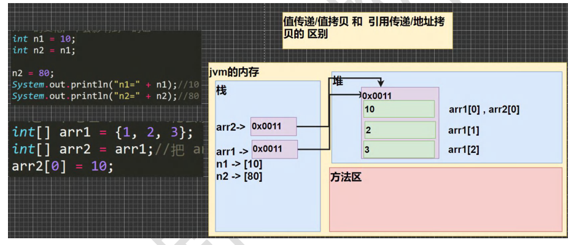
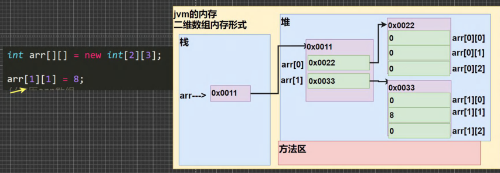

# 内存

## 基本数据类型

| 类型      | 字节 |
| --------- | ---- |
| `boolean` | 1    |
| `byte`    | 1    |
| `char`    | 2    |
| `int`     | 4    |
| `float`   | 4    |
| `long`    | 8    |
| `double`  | 8    |

## 对象

- 一个对象所使用的内存量，需要将所有实例变量使用的内存与**对象本身的开销（一般是16 字节）**相加
- 开销包括一个指向对象的类的引用、垃圾收集信息以及同步信息
- 一般内存的使用都会**被填充为8字节（64 位计算机中的机器字）的倍数**
- 对象的引用一般都是一个内存地址，因此会使用8 字节

| 对象类型  | 字节                                                         |
| --------- | ------------------------------------------------------------ |
| `Integer` | 24 = 16（对象开销） + 4（保存`int`实例） + 4（填充字节）     |
| `Date`    | 32 = 16（对象开销） + 3*4（保存3个`int`实例） + 4（填充字节） |

## 链表

- 嵌套的非静态（内部）类还需要**额外的8字节**（用于一个指向外部类的引用）

## 数组

- 一个原始数据类型的数组一般需要**24字节的头信息**（16字节的对象开销，4字节用于保存长度以及4填充字节）再加上保存值所需的内存
- 一个对象的数组就是一个对象的引用的数组，所以应该在对象所需的内存之外加上引用所需的内存

## 字符串对象

- `String`的标准实现含有4个实例变量：一个指向字符数组的引用（8 字节）和三个`int`值（各4字节）
- 每个`String`对象总共会使用40字节（16字节表示对象，三个`int`实例变量各需4字节，加上数组引用的8字节和4个填充字节）

## 字符串的值和子字符串

- 一个长度为N的`String`对象一般需要使用40字节（`String`对象本身）加上（24+2N）字节（字
  符数组），总共（64+2N）字节
- 调用`substring()`方法时，就创建了一个新的`String`对象（40 字节），但它仍然重用了相同的`value[]`数组，因此该字符串的子字符串只会使用40字节的内存
- 含有原始字符串的字符数组的别名存在于子字符串中，子字符串对象的偏移量和长度域
  标记了子字符串的位置。
- 一个子字符串所需的额外内存是一个常数，构造一个子字符串所需的时间也是常数

# 数据类型

## 整数/浮点数类型

- 整数类型默认是`int`，定义`long`型变量后面要加上`l`或`L`
- 浮点型默认是`double`，定义`float`型变量后面要加上`f`或`F`
- 浮点数使用陷阱：对运算结果是小数的进行相等判断时，须小心，小数运算为精度存储；应该是以两个数的差值的绝对值，在某个精度范围内判断


  ```java
  double num1 = 2.7
  double num2 = 8.1 / 3
  //不应该写成
  if(num1 == num2){...}
  //应该写成
  eps = ...//精度值
  if(Math.abs(num1 - num2) < eps)
  ```

## 字符型

- 字符型存储到计算机中，需要将字符对应的码值（整数）找出来，字符和码值的对应关系是通过字符编码表决定的
- 字符编码表
  - ASCII：1个字符使用1个字节，一共128个字符（实际上可表示256个字符）
  - Unicode：固定大小的编码，字符使用2个字节（一共65536个字符），字母和汉字统一都是占用2个字节（某些情况下浪费空间）
  - UTF-8：大小可变的编码表（可用1-6个字节表示字符），字母使用1个字节，汉字使用3个字节
  - GBK：可表示汉字，且范围广，字母使用1个字节，汉字使用2个字节
  - GB2312：可表示汉字，范围 gb2312 < gbk
  - BIG5：繁体中文，台湾，香港
- 比较两个字符串是否相同


  ```java
  String s1;
  String s2;
  s1.equals(s2) -> 相同，返回true；不同，返回false
  ```

## 布尔类型

- 不可以用0或非0的整数替代`false`和`true`，与C语言不同

## 自动类型转换

- java程序进行赋值或运算时，精度小的类型自动转换为精度大的数据类型
  - `char -> int -> long -> float -> double`
  - `byte -> short -> int -> long -> float -> double`
  - `char`和`byte/short`之间不会相互转换
  - `boolean`不参与转换
- 多种类型数据混合运算时，系统首先自动将所有数据转换成容量最大的数据类型，然后再进行计算
  - `char, byte, short`三者可以参与计算，在计算时首先转换为`int`类型


```java
byte b1 = 1;
byte b2 = 2;
byte b3 = b1 + b2; //Error, b1 + b2 -> int
```

## 基本数据类型与String类型的转换

- 基本数据类型转String类型
  - 语法：基本类型的值 + ""


```java
int n1 = 100;
boolean b1 = true;
String s1 = n1 + "";
String s2 = b1 + "";
```

- String类型转基本数据类型
  - 语法：通过基本类型的包装类调用`parseXX`方法即可（例外：在字符串中提取字符）


```java
String s1 = "123";
int num1 = Integer.parseInt(s1);
double num2 = Double.parseDouble(s1);
float num3 = Float.parseFloat(s1);
long num4 = Long.parseLong(s1);
byte num5 = Byte.parseByte(s1);
boolean b6 = Boolean.parseBoolean("true");
short num6 = Short.parseShort(s1);
//在字符串中提取字符
char c1 = s1.charAt(0);
```

## toString()、String.valueOf() 和 (String)强转

- `toString()`：可能会抛空指针异常
- `String.valueOf()`：推荐使用，可返回空字符串`null`
- `(String)`强转：不推荐使用

# 值传递与引用传递

> [java基本数据类型传递与引用传递区别详解](https://blog.csdn.net/javazejian/article/details/51192130)
>
> [为什么 Java 只有值传递，但 C# 既有值传递，又有引用传递，这种语言设计有哪些好处？](https://www.zhihu.com/question/20628016/answer/28970414)

- **Java 只有值传递，没有引用传递**

# 算术运算符

- `++`
  - 独立语句使用，`i++`和`++i`都等价于`i = i + 1`
  - 自增（前）：先运算后取值


```java
a = 2;
b = ++ a; //a = 3, b = 3
```

  - 自增（后）：先取值后运算


```java
a = 2;
b = a ++; //a = 3, b = 2
```

  

- `--`
  - 独立语句使用，`i--`和`--i`都等价于`i = i - 1`
  - 自增（前）：先运算后取值

```java
a = 2;
b = -- a; //a = 1; b = 1 
```

  - 自增（后）：先取值后运算

```java
a = 2;
b = a --; //a = 1; b = 2 
```

- `%`取模取余的本质：`a % b = a - a / b * b`
  - 取余，遵循尽可能让**商向0靠近**的原则（fix()函数）
  - 取模，遵循尽可能让**商向负无穷靠近**的原则（floor()函数）

```java
10 % 3 = 1;
-10 % 3 = -1;
10 % -3 = 1;
-10 % -3 = -1;
```

# 逻辑运算符

- `^`异或
  - 两个条件不同，结果为`true`，否则为`false`
  - 不进位的二进制加法
- `&&`和`&`的使用区别
  - `&&`短路与：如果第一个条件为`false`，则第二个条件不会判断，最终结果为`false`，效率高
  - `&`逻辑与：不管第一个条件是否为`false`，第二个条件都要判断，效率低
  - 开发中，我们使用的基本是`&&`短路与，效率高
- `||`和`|`的使用区别
  - `||`短路或：如果第一个条件为`true`，则第二个条件不会判断，最终结果为`true`，效率高
  - `&`逻辑与：不管第一个条件是否为`true`，第二个条件都要判断，效率低
  - 开发中，我们使用的基本是`||`短路或，效率高

# 标识符的命名规则和规范

## 标识符的命名规则

- 由26个英文字母大小写，`0-9`，`_`或`$`组成
- 数字不可以开头
- 不可以使用关键字和保留字
- 严格区分大小写
- 标识符不能包含空格

## 标识符的命名规范

- 包名：多单词组成时所有字母都小写：`aaa.bbb.ccc`
- 类名、接口名：多单词组成时，所有单词的首字母大写：`XxxYyyZzz`
- 变量名、方法名：多单词组成时，第一个单词首字母小写，第二个单词开始每个单词首字母大写：`xxxYyyZzz`（驼峰法）
- 常量名：所有字母都大写，多单词组成时每个单词用下划线连接：XXX_YYY_ZZZ

# 二进制运算

## 原码、反码、补码

- 二进制最高位是符号位，0表示正数，1表示负数
- 正数和0的原码、反码、补码都一样（三码合一）
- 负数的反码 = 它的原码符号位不变，其它位取反
- 负数的补码 = 它的反码 + 1，负数的反码 = 负数的补码 - 1
- java没有无符号数，java中的数都是有符号的
- 计算机是以补码的方式来运算的
- 运算结果要看它的原码

## 位运算符

- 算术右移`>>`：低位溢出，符号位不变，并用符号位补溢出的高位
- 算术左移`<<`：符号位不变，低位补0
- 逻辑右移`>>>`：无符号右移，低位溢出，高位补0（没有`<<<`符号）

# 增强 for 循环

- 适用于**不需要得到数组索引的遍历**
- 增强`for`循环不能获取数组索引，也不能修改数组元素
- IDEA快捷键：`iter`

```java
// 举例
int[] nums = {1, 2, 3};
// 普通for循环
for(int i=0; i < nums.length; i++) {
    System.out.println(nums[i]);
}
// 增强for循环, 依次从nums数组中取出数据，赋给i
for(int i : nums) {
    System.out.println("i=" + i);
}
```

# switch注意事项

- `switch(表达式)`中的表达式数据类型，应和`case`后的常量类型一致，或者是可以自动转成可以相互比较的类型
- `switch(表达式)`中的表达式的返回值必须是：`byte,short,int,char,enum[枚举],String`
- `case`子句中的值必须为常量，不能是变量
- `default`子句是可选的，当没有可匹配的`case`时，执行`default`
- `break`语句用来在执行完一个`case`分支后使程序跳出`switch`语句块；如果没有`break`，程序会顺序执行到`switch`结尾，除非遇到`break`

# break注意事项

- `break`语句出现在多层嵌套语句块中，可通过标签指明要终止的是哪一层语句块
  （`continue`也有类似的用法）
  
- 实际开发中，尽量不要使用标签

# 数组

## 数组声明

```java
// 第一种(静态初始化)：数据类型[] 数组名 = {};(更符合java习惯) 
// 或 数据类型 数组名[] = {};
type[] arrayname = {a1,a2,a3,...};
type arrayname[] = {a1,a2,a3,...};

// 第二种(动态初始化)：数据类型[] 数组名 = new 数据类型[大小];
// 或 数据类型 数组名[] = new 数据类型[大小];
type[] arrayname = new type[arraysize];
type arrayname[] = new type[arraysize];

// 第三种(动态初始化:先声明后创建)：数据类型[] 数组名; 数组名 = new 数据类型[大小]； 
// 或 数据类型 数组名[]; 数组名 = new 数据类型[大小]；
type[] arrayname;
arrayname = new type[arraysize];

type arrayname[];
arrayname = new type[arraysize];
```

## 数组注意事项

- 数组属于引用类型，数组型数组是对象（`object`）
- 数组创建后，如果没有赋值，有默认值（如`boolean false`）
- 数组在默认情况下是引用传递，赋的值是地址
  

# 二维数组

## 二维数组声明

```java
// 第一种(静态初始化)：数据类型[][] 数组名 = {};(更符合java习惯) 
// 或 数据类型 数组名[][] = {};
type[][] arrayname = {{a1,a2},{a3,...},...;
type arrayname[][] = {{a1,a2},{a3,...},...;

// 第二种(动态初始化)：数据类型[][] 数组名 = new 数据类型[大小][大小];
// 或 数据类型 数组名[][] = new 数据类型[大小][大小];
type[][] arrayname = new type[arraysize][arraysize];
type arrayname[][] = new type[arraysize][arraysize];

// 第三种(动态初始化:先声明后创建)：数据类型[][] 数组名; 数组名 = new 数据类型[大小][大小]； 
// 或 数据类型 数组名[][]; 数组名 = new 数据类型[大小][大小]；
type[][] arrayname;
arrayname = new type[arraysize][arraysize];

type arrayname[][];
arrayname = new type[arraysize][arraysize];
  
// 第四种(动态初始化:列数不确定)：数据类型[][] 数组名 = new 数据类型[大小][]； 
// 或 数据类型 数组名[][] = new 数据类型[大小][]；
type[][] arrayname = new type[arraysize][];
type arrayname[][] = new type[arraysize][];                
```

## 二维数组注意事项

- 一维数组的声明方式有：`int[] x`或者`int x[]`
- 一维数组的声明方式有：`int[][] y`或者`int[] y[]`或者`int y[][]`
- 二维数组内存形式
  

