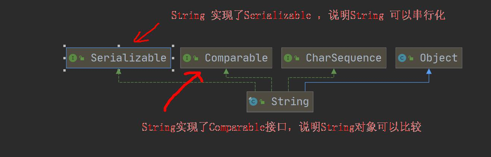
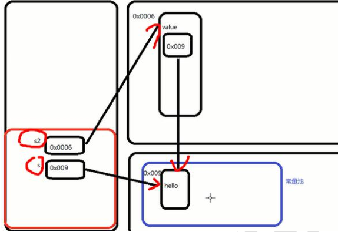
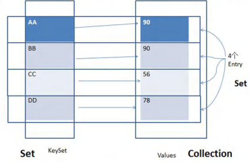

# String 类

## 基本介绍



- **`String`类代表字符串，字符串是常量，它们的值在创建之后不能更改**

- `String`对象是不可变的，所以可以共享

- 字符串的字符使用Unicode字符编码，一个字符（不区分字母还是汉字）占两个字节

- `String`类常用的构造器

  ```java
  String s1 = new String();
  String s2 = new String(String original);
  String s3 = new String(char[] a);
  String s4 = new String(char[] a,int startIndex,int count);
  String s5 = new String(byte[] b);
  ```

- `String`类实现了接口`Serializable`：`String`可以串行化，可以在网络传输
  `String`类实现了接口`Comparable`：`String`对象可以比较大小
  
- `String` 是 `final`类，不能被其他的类继承

## 创建 String 对象的两种方法

- 方式一：直接赋值`String s = "xxx";`
  - 先从常量池查看是否有`"xxx"`数据空间，如果有，直接指向；如果没有，则重新创建再指向。
  - **`String s`最终指向的是常量池的空间地址**
- 方式二：调用构造器`String s = new String("xxx");`
  - 先在堆中创建空间，里面包含`value`属性，指向常量池的`xxx`空间。如果常量池没有，则重新创建并指向；如果有，直接通过`value`指向。
  - **`String s`最终指向的是堆中的空间地址**



## String 类的常用方法

- `equals`：区分大小写，判断内容是否相等
- `equalsIgnoreCase`：忽略大小写，判断内容是否相等
- `length`：获取字符的个数，字符串的长度
- `indexOf`：获取字符在字符串中第1次出现的索引，索引从0开始，若找不到返回`-1`
- `lastIndexOf`：获取字符在字符串中最后1次出现的索引，索引从0开始，若找不到返回`-1`
- `substring`：截取指定范围的子串
- `trim`：去掉前后空格
- `charAt`：获取某索引处的字符，注意不能使用`Str[index]`这种方式
- `toUpperCase`：转换成大写
- `toLowerCase`：转换成小写
- `concat`：拼接字符串
- `replace`：替换字符串中的字符
- `split`：分割字符串
- `toCharArray`：转换成字符数组
- `compareTo`：比较两个字符串的大小，如果前者大，则返回正数；如果后者大，则返回负数；如果相等，返回0
  - 较短的字符串和较长的字符串从第一个字符开始比较，如果一一对应的话就返回两个字符串`length`之差
  - 不对应的话就返回第一个不对应的字符的ASCII码之差

## String不可变的原因

1. 字符串常量池的需要
   - 字符串常量池是 Java 堆内存中一个特殊的存储区域，当创建一个`String`对象时，假如此字符串值已经存在于常量池中，则不会创建一个新的对象，而是引用已经存在的对象（所谓的节省空间）
2. 安全性
   - `String`被许多的 Java 类（库）用来当做参数，比如网络连接地址`url`，文件路径`path`，假若`String`不是固定不变的，将会引起各种安全隐患
3. `String`对象的`hashcode`问题
   - 字符串不变性保证了`hash`码的唯一性，因此可以放心地进行缓存
   - 这也是一种性能优化手段，意味着不必每次都去计算新的`hash`码

# StringBuffer 类

## 基本介绍

- `StringBuffer`代表可变的字符序列，可以对字符串内容进行增删
- 很多方法与`String`相同，但`StringBuffer`是可变长度的
- `StringBuffer`是一个`final`类，不能被继承
- `StringBuffer`实现了`Serializable`，即`StringBuffer`的对象可以串行化
- `StringBuffer`的直接父类是`AbstractStringBuilder`
  - 在父类`AbstractStringBuilder`有属性`char[] value`，不是`final`，该`value`数组存放字符串内容，该数组存放在堆中
- `StringBuffer`字符内容是存放在`char[] value`，不用每次变化（增加/删除）都更换地址（即不是每次创建新对象）， 所以效率高于`String`

## String 和 StringBuffer 相互转换

- `String --> StringBuffer`

  - 方法一：使用构造器

    ```java
    StringBuffer stringBuffer = new StringBufer(str);
    ```

  - 方法二：使用`append()`方法

    ```java
    StringBuffer stringBuffer = new StringBufer();
    stringBuffer = stringBuffer.append(str);
    ```

- `StringBuffer --> String`

  - 方法一：使用`StringBuffer`提供的`toString()`方法

    ```java
    String str = stringBuffer.toString("xxx");
    ```

  - 方法二：使用构造器

    ```java
    String str = new String(stringBuffer);
    ```

## StringBuffer 类的常用方法

- `append`：增加
- `delete(startIndex, endIndex)`：删除索引为`[startIndex, endIndex)`处的字符
- `replace(startIndex, endIndex,"xxx")`：替换索引为`[startIndex, endIndex)`处的字符
- `indexOf("xxx")`：查找指定子串在字符串第1次出现的索引，如果找不到返回`-1`
- `insert(startIndex, "xxx")`：在索引为`startIndex`的位置插入`"xxx"`，该索引的原来内容自动后移

# StringBuilder 类

## 基本介绍

- 一个可变的字符序列，`StringBuilder`类提供一个与`StringBuffer`兼容的API，但不保证同步（`StringBuilder`不是线程安全）
- `StringBuilder`类被设计用作`StringBuffer`类的一个简易替换，用在字符串缓冲区被单个线程使用的时候
- 如果可能，建议优先采用`StringBuilder`类，因为在大多数实现中，`StringBuilder`类比`StringBuffer`类要快
- `StringBuilder`类的主要操作是`append`和`insert`方法，可重载这些方法以接收任意类型的数据

## String、StringBuffer、StringBuilder 的比较

- `String`：不可变字符，效率低，但复用率高
- `StringBuffer`：可变字符序列，效率较高，线程安全
- `StringBuilder`：可变字符序列，效率最高，线程不安全

## String 不可变 - StringBuffer/StringBuilder 可变的源码分析

- `String`底层使用的数据结构是`final`修饰的字符数组，`final`修饰的是常量，所以无法更改

  ```java
  public final class String implements java.io.Serializable, Comparable<String>, CharSequence {
      /** The value is used for character storage. */
      private final char value[];
      ...
  }
  ```

- `String Buffer`或者`String Builder`都继承了`AbstractStringBuilder`，底层数据结构仅仅是`char[] value`，只是一个`char[]`数组，所以可以进行改变

  ```java
  public final class StringBuffer extends AbstractStringBuilder implements java.io.Serializable, CharSequence {
      /**
       * A cache of the last value returned by toString. Cleared
       * whenever the StringBuffer is modified.
       */
      private transient char[] toStringCache;
      ...
  }
  
  abstract class AbstractStringBuilder implements Appendable, CharSequence {
      /**
       * The value is used for character storage.
       */
      char[] value;
      ...
  }
  ```

# Arrays 类

## Arrays 类的常用方法

- `toString`：返回数组的字符串形式`Arrays.toString(arr)`

- `sort`：排序（自然排序和定制排序），`sort`可重载，也可以通过传入一个`Comparator`接口实现定制排序

  - 调用定制排序时，传入两个参数：排序的数组；实现了`Comparator`接口的匿名内部类，要求实现`compare`方法
  - 底层调用`binarySort`二分法进行排序

- `binarySearch`：使用二叉查找 ，要求该数组是有序的。如果数组存在该元素，则返回索引；如果数组不存在该元素，则返回`-(arr.length+1)`

  ```java
  int index = Arrays.binarySearch(arr,number);
  ```

- `copyOf`：数组元素的复制

  - 从`arr`数组中，拷贝`newLength`个元素到`newArr`数组中
  - 如果拷贝的长度 > `arr.length`，就在新数组的后面增加`null`
  - 如果拷贝长度 < `0`，就抛出异常`NegativeArraySizeException`
  - 该方法的底层使用的是`System.arraycopy()`

- `fill`：数组元素的填充，可以理解为替换原来的元素

- `equals`：比较两个数组元素内容是否完全一致，若一致，返回`true`；若不一致，返回`false`

- `asList`：将一组值转换成`List`集合

# System 类

## System 类的常用方法

- `exit`：退出当前程序
- `arraycopy`：复制数组元素，比较适合底层调用，一般使用`Arrays.copyOf`完成复制数组
- `currentTimeMillens`：返回当前时间距离1970-1-1的毫秒数
- `gc`：运行垃圾回收机制

# BigInteger 和 BigDecimal 类

## 基本介绍

- `BigInteger`：适合保存比较大的整型
- `BigDecimal`：适合保存精度更高的浮点型

## BigInteger 和 BigDecimal 类的常见方法

- `add` 加
- `subtract` 减
- `multiply` 乘
- `divide` 除

# 日期类

## 第一代日期类

- `Date`：精确到毫秒，代表特定的瞬间

- `SimpleDateFormat`：格式和解析日期的类，允许进行格式化（日期 -> 文本）、解析（文本 -> 日期）和规范化

  

## 第二代日期类

- 主要是`Calender`类（日历）
- `Calender`类是一个抽象类，`Calendar` 类是一个抽象类，它为特定瞬间与一组诸如  `YEAR`、`MONTH`、`DAY_OF_MONTH`、`HOUR`  等日历字段之间的转换提供了一些方法，并为操作日历字段（例如获得下星期的日期）提供了一些方法。

## 第三代日期类

- `LocalDate`：只包含日期，可以获取日期字段
- `LocalTime`：只包含时间，可以获取时间字段
- `LocalDateTime`：包含日期+时间，可以获取日期和时间字段
- `DateTimeFormatter`：格式日期类，类似于`SimpleDateFormat`
- `Instant`：时间戳，类似于`Date`

# 集合

## 集合的优点

- 可以**动态保存任意多个对象**，使用方便
- 提供一系列方便的操作对象的方法：`add`，`remove`，`set`，`get`等

## 集合的框架体系


- java的集合类主要分为两大类：`Collection`（单列集合）和`Map`（双列集合）
- `Collection`接口有两个重要的子接口（`List`、`Set`），它们的实现子类都是单列集合
- `Map`接口的实现子类是双列集合，存放的是`Key - Value`

## Collection 接口

- `Collection`实现子类可以存放多个元素，每个元素可以是`Object`

## Collection 接口的常用方法

- `add`：添加单个元素

- `remove`：删除指定元素，`list.remove(index)`或`list.remove(element)`

- `contains`：查找元素是否存在

- `size`：获取元素个数

- `isEmpty`：判断元素是否为空

- `clear`：清空所有元素

- `addAll`：一次添加多个元素

  ```java
  // 以ArrayList为例
  ArrayList list1 = new ArrayList();
  ArrayList list2 = new ArrayList();
  list2.add("xxx");
  list2.add("yyy");
  list.addAll(list2);
  ```

- `containsAll`：查找多个元素是否都存在

- `removeAll`：删除多个元素，`list.removeAll(list2)`

# Collection 接口遍历元素方式

## 迭代器 Iterator - 基本介绍

- 所有实现了`Collection`接口的集合类都有一个`iterator()`方法，用以返回一个实现了`Iterator`接口的对象，即可以返回一个迭代器

- `Iterator`仅用于遍历集合，本身并不存放对象

- 在类的声明中继承`Iterable`，保证了类必然提供一个`iterator()`方法

  ```java
  implements Iterable
  ```

## 迭代器 Iterator - 基本语法

```java
// 得到一个集合的迭代器
Iterator iterator = coll.iterator();
while(iterator.hasNext()) { // 判断是否下一个元素
    System.out.println(iterator.next()); // 下移; 将下移以后集合位置上的元素返回
}
// 如果希望再次遍历，需要重置迭代器 iterator
Iterator iterator = coll.iterator();
System.out.println("====第二次遍历====");
while(iterator.hasNext()) {
    System.out.println(iterator.next());
}
```

- IDEA 快捷键生成迭代器的`while`结构：`itit`
- IDEA 显示所有快捷键的快捷键：`ctrl + j`

## 增强 for 循环 - 基本介绍

- 增强`for`循环相当于简化版的`iterator`
- 只能用于遍历集合或数组

## 增强 for 循环 - 基本语法

```java
for(元素类型 元素名 : 集合名或数组名) {
    访问元素
}
```

# List 接口和常用方法

## 基本介绍

- `List`接口是`Collection`接口的子接口，常用方法和`Collection`接口一样
- `List`集合类中元素有序，且可以重复
- `List`集合中的每个元素都支持索引
- `List`接口的实现类有：`ArrayList`，`LinkedList`，`Vector`等

## List 接口的常用方法

- `add(int index, Object ele)`：在`index`位置插入`ele`元素
- `addAll(int index, Collection eles)`：从`index`位置开始将`eles`中的所有元素添加进来
- `get(int index)`：获取指定`index`位置的元素
- `indexOf(Object obj)`：返回`obj`在集合中首次出现的位置
- ` lastIndexOf(Object obj)`：返回`obj`在集合中末次出现的位置
- `remove(int index)`：移除指定`index`位置的元素，并返回此元素
- `set(int index, Object ele)`：设置指定`index`位置的元素为`ele`, 相当于是替换
-  `subList(int fromIndex, int toIndex)`：返回`[fromIndex, toIndex)`位置的子集合

## List 的三种遍历方式

- 方式一：`iterator`迭代器

  ```java
  Iterator iterator = list.iterator();
  while (iterator.hasNext()) {
  	Object obj = iterator.next();
  	System.out.println(obj);
  }
  ```

- 方式二：增强`for`循环

  ```java
  for(Object obj : list) {
      System.out.println(obj);
  }
  ```

- 方式三：普通`for`

  ```java
  for(int i = 0; i < list.size(); i++) {
      System.out.println(list.get(i));
  }
  ```

#ArrayList 底层结构

## ArrayList 的注意事项

- `ArrayList`可以添加任意元素（元素可重复），包括`null`
- `ArrayList`是由数组来实现数据存储的
- `ArrayList`基本等同于`Vector`，但是`ArrayList`是线程不安全（执行效率高）；多线程情况下，不建议使用`ArrayList`

## ArrayList 创建和扩容的底层机制

- `ArrayList`中维护了一个`Object`类型的数组`elementData`

  ```java
  transient Object[] elementData; // transient 表示瞬态,该属性不会被序列化
  ```

- 当创建`ArrayList`对象时，如果使用的是无参构造器，则初始`elementData`容量为`0`，第1次添加元素时，则扩容`elementData`为`10`；如需再次扩容，则扩容`elementData`为原来的`1.5`倍

- 如果使用的是指定大小的构造器，则初始`elementData`容量为指定大小；如需再次扩容，则扩容`elementData`为原来的`1.5`倍

# Vector 底层结构

## 基本介绍

- `Vector`底层是一个对象数组，`protected Object[] elementData;`
- `Vector`是线程同步的，即线程安全，`Vector`类的操作方法带有`synchronized`
- 在开发中，需要线程同步安全时，考虑使用`Vector`

## Vector 和 ArrayList 的比较

|             | 底层结构 | 版本    | 线程安全（同步）& 效率 | 扩容倍数                                                     |
| ----------- | -------- | ------- | ---------------------- | ------------------------------------------------------------ |
| `ArrayList` | 可变数组 | JDK 1.2 | 不安全，效率高         | 如果是无参构造器：第一次容量为`10`，从第二次开始按照`1.5`倍扩容；如果是有参构造器，按照`1.5`倍扩容 |
| `Vector`    | 可变数组 | JDK 1.0 | 安全，效率不高         | 如果是无参构造器：第一次容量为`10`，从第二次开始按照`2`倍扩容；如果是有参构造器，按照`2`倍扩容 |

# LinkedList 底层结构

## 基本说明

- `LinkedList`底层实现了**双向链表**和**双端队列**特点
- `LinkedList`可以添加任意元素（元素可重复），包括`null`
- `LinkedList`线程不安全，没有实现同步

## LinkedList 的底层操作机制

- `LinkedList`底层维护了一个**双向链表**

- `LinkedList`中维护了两个属性
  
  - **`first`：指向首节点**
  - **`last`：指向尾节点**
  
- 每个节点（`Node`类）内又维护了三个属性，最终实现**双向链表**
  
  ```java
  class Node {
      public Object item;
      public Node next;
      public Node pre;
      public Node(Object name) {
          this.item = name;
      }
      public String toString() {
          return "Node name=" + item;
      }
  }
  ```
  
  - **`prev`：指向前一个节点**
  - **`next`：指向后一个节点**
  - **`item`：存放节点元素**
  
- `LinkedList`的元素的添加和删除，不是通过数组来完成的，相对来说效率较高

- **`LinkedList`的`remove()`方法是默认删除第一个节点**

## ArrayList 和 LinkedList 比较

|            | 底层结构 | 增/删的效率    | 更改/查询的效率            |
| ---------- | -------- | -------------- | -------------------------- |
| ArrayList  | 可变数组 | 较低，数组扩容 | 较高，直接访问             |
| LinkedList | 双向链表 | 较高，链表追加 | 较低，通过前后节点间接访问 |

- 选择`ArrayList`：更改/查询的操作多，程序的大部分情况为查询，大部分情况会选择`ArrayList`
- 选择`LinkedList`：增/删的操作多

# Set 接口和常用方法

## 基本介绍

- 无序（添加和取出的顺序不一致），没有索引
- 不允许重复元素，因此最多包含一个`null`
- `Set`接口是`Collection`接口的子接口，常用方法和`Collection`接口一样
- `Set`接口的实现类有：`HashSet`，`TreeSet`等

## Set 接口的遍历方式

- 同`Collection`的遍历方式一样
  - 迭代器
  - 增强`for`循环
- **不能使用索引的方式进行访问**

## Set 转成 int 数组

- 使用`toArray(new Integer[0])`方法转为`Integer`数组，然后再转为整型数组

```java
// 先将set集合转为Integer型数组
Integer[] tmp = set.toArray(new Integer[0]);
// 再将Integer型数组转为int型数组
int[] intArray = new int[tmp.length];
for(int i = 0; i < tmp.length; i++) {
    intArray[i] = tmp[i].intValue();
}
return intArray;
```

# HashSet 

## 基本介绍

- `HashSet`实现了`Set`接口

- `HashSet`底层是`HashMap`，`HashMap`底层是**数组 + 链表 + 红黑树**

  ```java
  public HashSet() {
      map = new HashMap<>();
  }
  ```

- 可以存放`null`值，但仅能有一个`null`

- 不能有重复元素/对象

- `HashSet`不保证元素是有序的，取决于`hash`后才能确定索引的结果（即不保证存放元素的顺序和取出顺序）

## HashSet 添加元素的底层机制

- 添加一个元素时，先得到`hash`值，该`hash`值会转成索引值
  - 得到`key`对应的`hash`值：`(h=key.hashCode()) ^ (h >>> 16)`
  - **`hashCode()`方法可由程序员重写，按业务需求决定**
- 找到存储数据表`table`（`HashSet`），判断该索引位置是否已经存放元素
  - 如果没有元素，直接添加
  - 如果有，调用`equals`比较，如果相同，就放弃添加；如果不相同，则挂载到最后
  - **`equals`方法由程序员重写（比较的标准由程序员决定），不可以简单地看做是比较其内容**
- 在 **java8** 中，如果一条链表的元素个数**到达`TREEIFY_THRESHOLD`（默认为8）**，**并且`table`的大小`>= MIN_TREEIFY_CAPCITY`（默认为64）**，就会进行**树化（红黑树）**，**否则仍然采用数组扩容**
- 向`HashSet`增加一个元素，`HashSet`增加了一个`size`

## HashSet 扩容和转成红黑树的底层机制

- `HashSet`底层是`HashMap`，第一次添加时，`table`数组扩容到`16`，触发再次扩容的临界值为**数组大小乘以加载因子`threshold = 16 * loadFactor  = 16 * 0.75 = 12`**

- 如果`table`数组使用到达临界值`threshold`，就会扩容到`16 * 2 = 32`，新的临界值就是`32 * 0.75 = 24`，以此类推

- 在转成红黑树时，要进行判断，判断条件

  ```java
  if (tab == null || (n = tab.length) < MIN_TREEIFY_CAPACITY(64))
      resize();
  ```

  如果上面条件成立，先 table 扩容；只有上面条件不成立时，才进行转成红黑树

# LinkedHashSet

## 基本介绍

- `LinkedHashSet`是`HashSet`的子类
- `LinkedHashSet`底层是一个`LinkedHashMap`，底层维护了一个**数组 + 双向链表**
- `LinkedHashSet`根据元素的`hash`值来决定元素的存储位置，同时**使用链表维护元素的次序**
- `LinkedHashSet`不允许添加重复元素

## LinkedHashSet 底层机制

- `LinkedHashSet`中维护了一个**`hash`表/数组和双向链表**（`LinkedHashSet`有`head`和`tail`）

- 每一个节点`Node`有`before`和`after`属性，形成双向链表

- 在添加一个元素时，先求`hash`值，再求索引，确定该元素在`table`的位置，然后将添加的元素加入到双向链表；如果已经存在，则不添加（原则与`HashSet`一样）

  ```java
  tail.next = newElement;
  newElement.pre = tail;
  tail = newElement;
  ```

- 遍历`LinkedHashSet`能确保插入顺序和遍历顺序一样

# Map 接口和常用方法

> 以下内容基于 JDK8 的 `Map`接口

## 基本介绍

- `Map`与`Collection`并列存在，用于**保存具有映射关系的数据：`Key - Value`**

- `Map`中的`key`和`value`可以是任何引用类型的数据，**封装到`HashMap$Node`对象中；`key`存放在`(Set) KeySet`，`value`存放在`(Collection) Values`**

- **`Map`中的`key`不允许重复**，原因和`HashSet`一样；`key`可以为`null`，只能有一个

- **`Map`中的`value`可以重复**；`value`可以为`null`，可以多个

- **常使用`String`类作为`Map`的`key`**

- **`key`和`value`之间存在单向一对一映射关系**，即通过指定的`key`对应唯一的`value`

- 一对`k-v`是放在`HashMap$Node`中的，又因为`Node`实现了`Entry`接口，也说一对`k-v`是一个`Entry`

  

- `Map`接口的常用实现类：`HashMap`，`HashTable`，`Properties`

## Map接口的常用方法

- `put(key, value)`：添加`k-v`；若添加相同的`key`，则替换对应的`value`

- `remove(key)`：根据键（`key`）删除映射关系`k-v`

- `get(key)`：根据键`key`获取值`value`

- `size()`：获取元素个数

- `isEmpty()`：判断元素个数是否为`0`

- `clear()`：清空元素

- `contaninsKey(key)`：查找键`key`是否存在

- `keySet()`：获取所有的键`key`，返回`Set`类型

  ```java
  Map map = new HashMap();
  Set keyset = map.keySet();
  ```

- `values()`：获取所有的值`value`，返回`Collection`类型

  ```java
  Map map = new HashMap();
  Collection values = map.values();
  ```

- `entrySet()`：获取所有的`k-v`关系，返回`Set`类型

  ```java
  Map map = new HashMap();
  Set entrySet = map.entrySet(); // EntrySet<Map.Entry<K,V>>
  ```

## Map接口的遍历方法

- 第一种：先取出所有`key`，再通过`key`取出对应的`value`

  ```java
  Set keyset = map.keySet();
  // (1)增强 for 循环
  for(Object key : ketset) {
      System.out.println(map.get(key));
  }
  
  // (2)iterator 迭代器
  Iterator iterator = keyset.iterator();
  while(iterator.hasNext()) {
      Object key = iterator.next();
      System.out.println(map.get(key));
  }
  ```

- 第二种：先取出所有`value`，再遍历`value`

  ```java
  Collection values = map.values();
  // (1)增强 for 循环
  for(Object value : values) {
      System.out.println(value);
  }
  
  // (2)iterator 迭代器
  Iterator iterator = values.iterator();
  while(iterator.hasNext()) {
      Object value = iterator.next();
      System.out.println(value);
  }
  ```

- 第三种：通过`entrySet()`方法来获取`k-v`

  ```java
  Set entrySet = map.entrySet(); // EntrySet<Map.Entry<K,V>>
  // (1)增强 for 循环
  for(Object entry : entrySet) {
      Map.Entry m = (Map.Entry) entry;
      // Map.Entry类含有 getKey() 和 getValue() 方法
      System.out.println(m.getKey() + "-" + m.getValue());
  }
  
  // (2)iterator 迭代器
  Iterator iterator = entrySet.iterator();
  while(iterator.hasNext()) {
      Object entry = iterator.next();
      Map.Entry m = (Map.Entry) entry;
      System.out.println(m.getKey() + "-" + m.getValue());
  }
  ```

# HashMap

## 基本介绍

- **`HashMap`是`Map`接口使用频率最高的实现类**
- `HashMap`是以`key-val`对的方式来存储数据（`HashMap$Node`类型）
- `key`不能重复，`value`可以重复，允许使用`null`键和`null`值
- 如果添加相同的`key`，则会覆盖原来的`key-val`，相当于修改（`key`不会被替换，`value`会被替换）
- 不保证映射的顺序（与`HashSet`一样），底层是以`hash`表的方式来存储（JDK 8 的`HashMap`底层为**数组 + 链表 + 红黑树**）
- `HashMap`没有实现同步，**线程不安全**，即方法没有做同步互斥的操作，没有`synchronized`

## HashMap 的底层机制

- 扩容机制和`HashSet`相同（`HashSet`底层是`HashMap`）
- JDK 7 的`HashMap`底层实现[ 数组 + 链表 ]，JDK 8 的`HashMap`底层实现[ 数组 + 链表 + 红黑树]

## HashMap 的 computeIfAbsent()、getOrDefault()、putIfAbsent()

### computeIfAbsent()

- `V computeIfAbsent(K, Function<? super K, ? extends V>)`
- 方法有两个参数，`Key`和一个根据`Key`来产生`Value`的`Function`；然后返回一个`Value`
- 方法会检查`Map`中的`Key`，如果发现`Key`不存在或者对应的值是`null`，则调用`Function`来产生一个值，**然后将其放入 Map**，最后返回这个值；否则的话返回`Map`已经存在的值

> 补充：在 ConcurrentHashMap 中，这个方法保证线程安全，且多线程并发执行的情况下，Function 参数只会被调用一次。所以这个方法完全可以代替 DCL（Double Check Lock）写法

### getOrDefault()

- `V getOrDefault(Object, V)`
- 方法同样检查`Map`中的`Key`，如果发现`Key`不存在或者对应的值是`null`，则返回第二个参数即默认值。注意，**该默认值不会放入`Map`**

### putIfAbsent()

- `V putIfAbsent(K, V)`
- 如果`Key`不存在或者对应的值是`null`，则将`Value`设置进去，然后返回`null`；否则只返回`Map`当中对应的值，而不做其他操作

# HashTable

## 基本介绍

- `HashTable`是以`key-val`对的方式来存储数据
- **`HashTable`的`key`和`value`都不能为`null`，否则会抛出`NullPointerException`**
- `HashTable`使用方法基本上和`HashMap`一样
- `HashTable`是线程安全的（`synchronized`）

## HashTable 和 HashMap对比

|             | 版本 | 线程安全（同步） | 效率 | 允许`null`键/`null`值 |
| ----------- | ---- | ---------------- | ---- | --------------------- |
| `HashMap`   | 1.2  | 不安全           | 高   | :heavy_check_mark:    |
| `HashTable` | 1.0  | 安全             | 较低 | :x:                   |

# LinkedHashSet

# LinkedHashMap

# TreeMap

> [TreeMap原理实现及常用方法](https://www.cnblogs.com/LiaHon/p/11221634.html#七-遍历)
>
> [TreeMap简介](https://www.cnblogs.com/zhuxiaopijingjing/p/12365993.html)

- TreeMap 存储 K-V 键值对，通过红黑树（R-B tree）实现，红黑树结构天然支持排序，默认情况下通过 Key 值的自然顺序进行排序，也可以使用集合中自定义的比较器来进行排序
- 不允许出现重复的 Key，可以插入 null 键、null 值
- TreeMap 继承了`NavigableMap`接口，`NavigableMap`接口继承了`SortedMap`接口，可支持一系列的导航定位以及导航操作的方法，需要TreeMap自己去实现
- TreeMap 实现了`Cloneable`接口，可被克隆，实现了`Serializable`接口，可序列化

# Properties

## 基本介绍

- `Properties`类继承`HashTable`类并且实现了`Map`接口，以`key-val`对的方式来存储数据
- 使用特点与`HashTable`类似
- `Properties`可以用于从`xxx.properties`文件中，加载数据到`Properties`类对象，并进行读取和修改
  - `xxx.properties`文件通常作为配置文件，[Java 读写Properties配置文件](https://www.cnblogs.com/xudong-bupt/p/3758136.html)

# **开发中如何选择集合实现类**

1. 先判断存储的类型
   - **一组对象 [单列]**
   - **一组键值对 [双列]**
2. 一组对象 [单列]：`Collection`接口
   - **允许重复**：`List`
     - **增删多**：`LinkedList` [底层维护双向链表]
     - **改查多**：`ArrayList` [底层维护`Object`类型的可变数组]
   - **不允许重复**：`Set`
     - **无序**：`HashSet` [底层是`HashMap`，维护`hash`表，即 数组 + 链表 + 红黑树]
       - `HashSet`的去重机制（`hashCode()+equals()`）：底层先通过存入对象，**进行运算得到一个`hash`值**，通过`hash`值得到**对应的索引**，如果`table`索引所在位置**没有数据，则直接添加**；如果**有数据，则进行`equals`比较（遍历比较）**，比较不相同就添加，否则不添加
     - **排序**：`TreeSet`，底层是`TreeMap`，使用`TreeSet`提供的一个构造器，其可以传入一个比较器（匿名内部类）并指定排序规则；当使用无参构造器创建`TreeSet`时，仍然是无序的
       - `TreeSet`的去重机制：如果创建对象时**传入`Comparator`匿名对象，则使用实现的`compare`去重**，如果方法返回`0`，就认为是相同的元素，不添加；如果创建对象时**没有传入`Comparator`匿名对象，则以添加的对象实现的`Comapreable`接口的`compareTo`去重**
     - **插入和取出顺序一致**：`LinkedHashSet`，维护 数组 + 双向链表
3. 一组键值对 [双列]
   - **键无序**：`HashMap` [底层是`hash`表，JDK7：数组 + 链表，JDK8：数组 + 链表 + 红黑树]
   - **键排序**：`TreeMap`，使用`TreeMap`提供的一个构造器，其可以传入一个比较器（匿名内部类）并指定排序规则；当使用无参构造器创建`TreeMap`时，仍然是无序的
   - **键插入和取出顺序一致**：`LinkedHashMap`
   - **读取文件**：`Properties`

# Collections 工具类

## 基本介绍

- `Collections`是一个操作`Set`、`List`和`Map`等集合的工具类
- `Collections`中提供了一系列**静态`static`的方法**对集合元素进行**排序**、**查询**和**修改**等操作

## 排序操作

- `reverse(List)`：反转`List`集合元素的顺序
- `shuffle(List)`：对`List`集合元素进行随机排序
- `sort(List)`：根据元素的自然顺序对指定`List`集合元素按升序排序
- `sort(List, Comparator)`：根据指定的`Comparator`产生的顺序对`List`集合元素进行排序
- `swap(List, int i, int j)`：将`List`集合中的`i`处元素和`j`处元素进行交换

## 查找、替换

- `Object max(Collection)`：根据元素的自然顺序，返回给定集合中的最大元素
- `Object max(Collection, Comparator)`：根据`Comparator`指定的顺序，返回给定集合中的最大元素
- `Object min(Collection)`
- `Object min(Collection, Comparator)`
- `int frequency(Collection, Object)`：返回指定集合中指定元素的出现次数
- `void copy(List dest, List src)`：将`src`中的内容复制到`dest`中
- `boolean replaceAll(List list, Object oldVal, Object newVal)`：使用新值替换`List`对象的所有旧值
