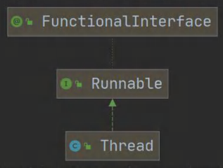
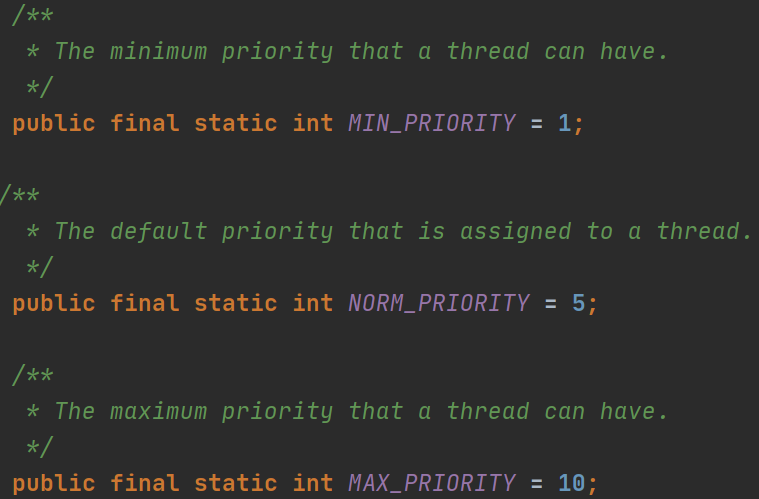
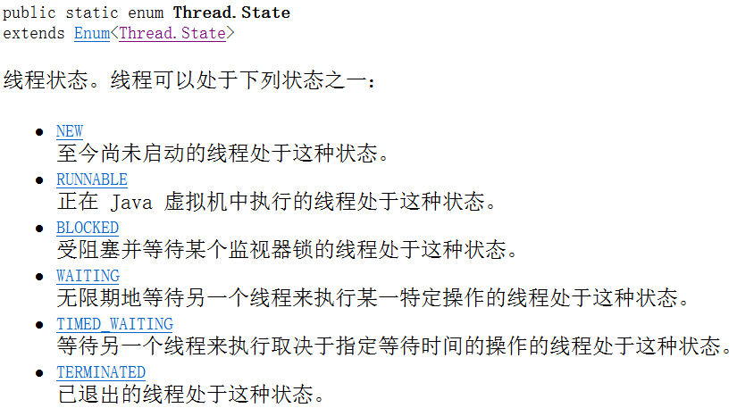
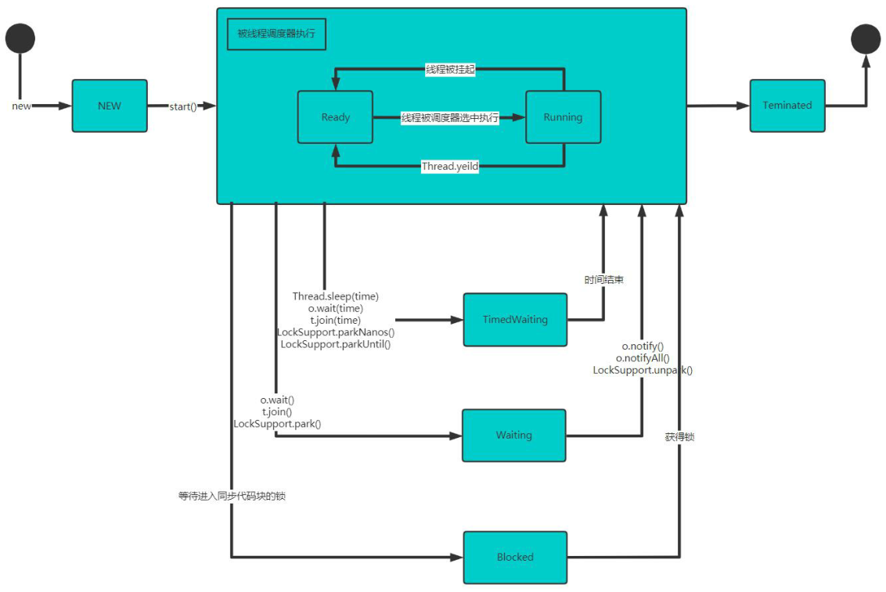
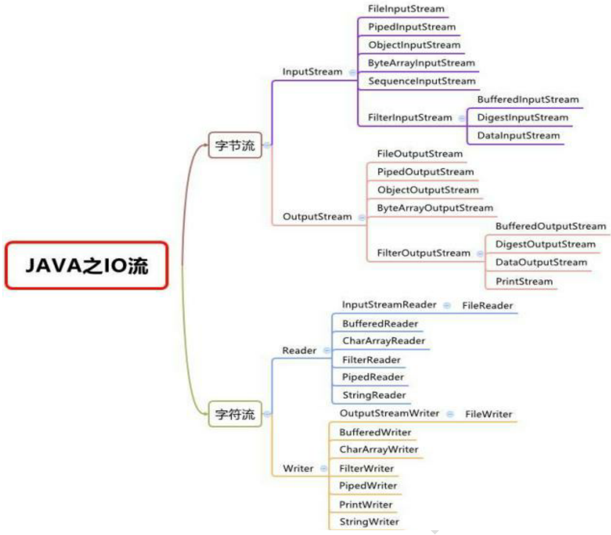
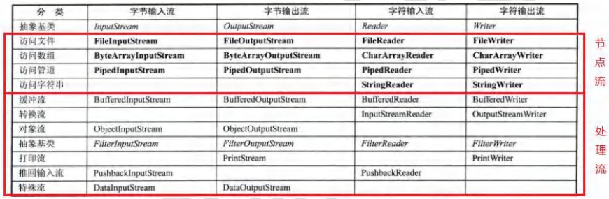
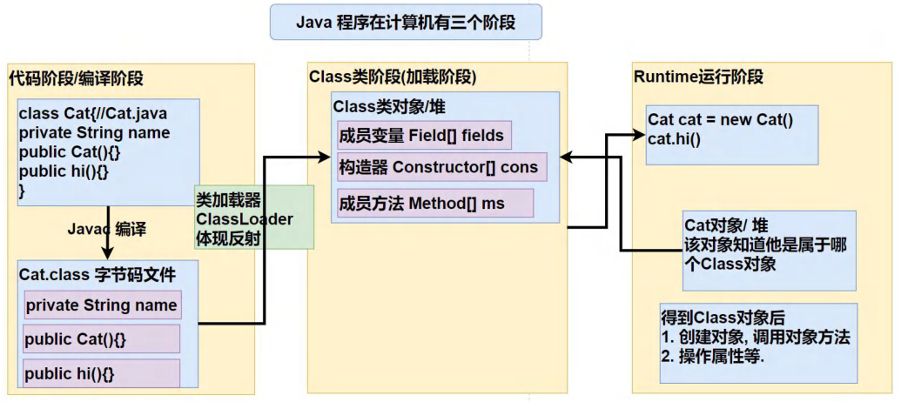
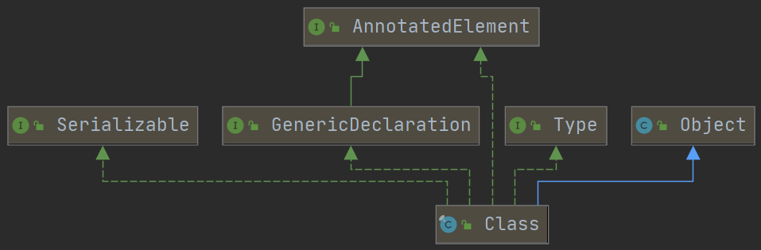
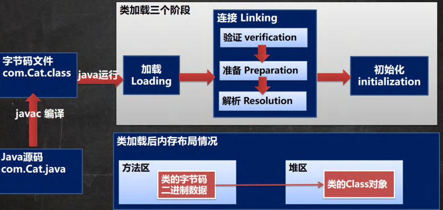
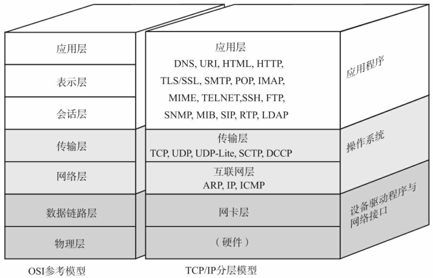

# 泛型 generic

##  基本介绍

- 泛型又称参数化类型，是 JDK5 出现的新特性，解决数据类型的安全性问题
- 在类声明或实例化时只要指定好需要的具体类型即可
- 泛型可以保证**如果程序编译时没有发出警告，运行时就不会抛出`ClassCastException`异常**，代码更简洁、健壮
- 减小了类型转换的次数，提高效率，举例：
  - 不使用泛型：遍历`ArrayList`元素时会先转成`Object`，还需要转换成对应的类型
  - 使用泛型：`ArrayList`元素放入和取出时都不需要类型转换，提高效率
- 泛型的作用：可以在类声明时通过一个标识**类中某个属性的类型**，或是**某个方法的返回类型**，或是**某个方法的参数类型**

## 基本语法

- 泛型的声明

  ```java
  // 举例
  interface<T>{} 或 class<K,V>{} 或 class<E>{}
  ```

- 泛型的实例化

  ```java
  // 要在类名后面指定类型参数的值(类型)
  // 举例
  List<String> strList = new ArrayList<String>();
  Iterator<Customer> iterator = customers.iterator();
  ```

## 泛型的注意事项

- 泛型只能是引用类型

- 在给泛型指定具体类型后，可以传入该类型或其子类类型

- 泛型使用形式

  ```java
  // 举例
  /*
  * 以下两种使用形式效果相同
  * 实际开发中,往往采用简写(采用第二种),编译器会进行类型推断
  */
  List<Integer> list = new ArrayList<Integer>();
  List<Integer> list = new ArrayList<>(); // 推荐用法
  
  /*
  * 以下使用形式,默认赋予的泛型是 <E>, E 就是 Object
  */
  List<Integer> list = new ArrayList();
  ```

## 自定义泛型类

- 类声明时带有泛型，该类就称为自定义泛型类

- 基本语法

  ```java
  class 类名<T,R,...>{//...表示可以有很多泛型 
      成员
  }
  ```

- 普通成员（属性、方法）可以使用泛型

- **使用泛型的数组不能初始化**：因为数组不能确定元素类型，无法在内存开空间

- **静态方法/属性中不能使用类的泛型**：静态是和类相关的，在类加载时，对象还没有创建

- 泛型类的类型是在**创建对象**时确定的（编译时）

- 如果在创建对象时没有指定类型，默认为`Object`

## 自定义泛型接口

- 基本语法

  ```java
  interface 接口名<T,R,...>{
  }
  ```

- **静态成员中不能使用类的泛型**

- 泛型接口的类型是在**继承接口**或**实现接口**时确定的

- 没有指定类型，默认为`Object`

## 自定义泛型方法

- 基本语法

  ```java
  修饰符<T,R,...> 返回类型 方法名(参数列表){
  }
  ```

- 泛型方法，可以定义在普通类中，也可以定义在泛型类中

- **静态成员中不能使用类的泛型**

- 泛型方法的类型是在**方法被调用**时确定的

- `public void method(E e){}`，修饰符后没有`<T, R,...>`，`method`方法不是泛型方法，而是使用了泛型

- 泛型方法，可以使用类声明的泛型，也可以使用自己声明泛型

## 泛型的继承和通配符

- 泛型不具有继承性

  ```java
  // 错误
  List<Object> list = new ArrayList<String>();
  ```

- `<?>`支持任意泛型类型

- `<? extends A>`：支持`A`类以及`A`类及其子类，**规定了泛型的上限**

- `<? super A>`：支持`A`类以及`A`类的父类，不限于直接父类，**规定了泛型的下限**

# JUnit

## 基本介绍

- `JUnit`是一个Java语言的**单元测试框架**
- 多数Java的开发环境都已经集成了`JUnit`作为单元测试的工具
- 在需要测试的方法前添加`@Test`注解，`alt + Enter` -> `Add 'JUnit5' to classpath`配置`JUnit`

## 基本注解

- `@Test`：使用该注解标注的`public void`方法会表示为一个测试方法
- `@Before`：表示在任意使用`@Test`注解标注的`public void`方法执行之前执行
- `@After`：表示在任意使用`@Test`注解标注的`public void`方法执行之后执行
- `@BeforeClass`：表示在类中的任意`public static void`方法执行之前执行
- `@AfterClass`：表示在类中的任意`public static void`方法执行之后执行

# 多线程基础

## 线程相关概念

- 进程：运行中的程序，进程是程序的一次执行过程（*使用QQ -> 启动了一个进程*）

- **线程**：线程由进程创建，是进程的一个实体，一个进程可以拥有多个线程（*QQ同时打开多个聊天窗口 -> 执行多个线程*）

- 单线程：同一个时刻，只允许执行一个线程

  多线程：同一个时刻，可以执行多个线程

- java程序至少会有两个线程：`main`主线程，垃圾回收线程

- **并发**：同一个时刻，多个任务交替执行，造成一种"貌似同时"的错觉，比如单核CPU实现的多任务就是并发

- **并行**：同一时刻，多个任务同时执行。多核CPU可以实现并行。

## 创建线程的三种方法



1. 继承`Thread`类，重写`run`方法
2. 实现`Runnable`接口，实现`run`方法
3. 实现`Callable`接口，实现`call`方法（`call`方法有返回值），用`FutureTask`类包装`Callable`对象

## 线程应用案例：继承 Thread 类

-  当一个类继承了`Thread`类， 该类就可以当做线程使用
-  重写`run`方法，写上自己的业务代码
-  `Thread`类的`run`方法实现了`Runnable`接口的`run`方法
-  **`main`方法中调用`start()`方法启动线程**（从`main`线程启动一个子线程），**而不是直接调用`run`方法**（`run`方法只是普通方法，并没有真正地启动一个线程，`main`线程会把`run`方法执行完毕才向下执行）
-  当`main`线程启动一个子线程，主线程不会阻塞，会继续执行

```java
public class MultiThread extends Thread {
    int i = 0;
    public void run() {
        for(;i < 100; i++) {
            System.out.println(getName() + " " + i);
        }
    }
    public static void main(String[] args) {
        for(int i = 0; i < 100; i++) {
            System.out.println(Thread.currentThread().getName() + " " + i);
            if(i == 20) {
                new MultiThread().start();
                new MultiThread().start();
            }
        }
    }
}
```

## 线程应用案例：实现 Runnable 接口

- 某些情况下，一个类已经继承了某个父类，不能通过继承`Thread`类来创建线程，可以通过实现`Runnable`接口来创建线程

- 重写`run`方法，写上自己的业务代码

- 该类实现了`Runnable`接口，不能调用`start()`方法来启动线程，因为`Runnable`接口只实现了`run()`方法

- **若要启动线程，先创建`Thread`对象，把该类的实例对象（实现了`Runnable`）放入`Thread`，再调用`Thread`的`start()`方法**

  ```java
  ClassName object = new ClassName();
  Thread thread  = new Thread(object);
  thread.start();
  // 或者 line 2~3 简写成
  new Thread(object).start();
  ```

  - 这里底层使用了**代理模式（静态代理）**的设计模式，作用：上述两种创建线程的方法都使用同一套代码

```java
public class MultiThread implements Runnable {
    int i = 0;
    public void run() {
        for(;i < 100; i++) {
            System.out.println(Thread.currentThread().getName() + " " + i);
        }
    }
    public static void main(String[] args) {
        for(int i = 0; i < 100; i++) {
            System.out.println(Thread.currentThread().getName() + " " + i);
            if(i == 20) {
                new Thread(new MultiThread(), "thread-0").start();
                new Thread(new MultiThread(), "thread-1").start();
            }
        }
    }
}
```

## 线程应用案例：实现 Callable 接口、Future

1. 创建`Callable`接口的实现类，实现`call()`方法，该`call()`方法将作为线程执行体，**并有返回值**
2. 创建`Callable`实现类的实例，**使用`FutureTask`类来包装`Callable`对象**，该`FutureTask`对象封装了该`Callable`对象的`call()`方法的返回值
3. 使用`FutureTask`对象作为`Thread`对象的`target`创建并启动新线程
4. **调用`FutureTask`对象的`get()`方法来会的子线程执行结束后的返回值**

```java
public class MultiThread implements Callable<Integer> {
    @Override
    public Integer call() throws Exception{
        int i = 0;
        for(;i < 100; i++) {
            System.out.println(Thread.currentThread().getName() + " " + i);
        }
        return i;
    }
    public static void main(String[] args) {
        MultiThread multiThread = new MultiThread();
        FutureTask futureMask = new FutureTask<>(multiThread);
        for(int i = 0; i < 100; i++) {
            System.out.println(Thread.currentThread().getName() + " " + i);
            if(i == 20) {
                new Thread(futureMask, "有返回值的线程").start();
            }
        }
        try {
            System.out.println("子线程的返回值：" + futureMask.get());
        } catch (InterruptedException e) {
            e.printStackTrace();
        } catch (ExecutionException e) {
            e.printStackTrace();
        }
    }
}
```

## 调用 start() 方法的底层原理

1. `main`主线程调用该类的`start()`方法启动线程

   ```java
   public synchronized void start() {
       start0();
   }
   ```

2. `start()`方法调用`start0()`方法，`start0()`是本地方法，由JVM调用，底层是`C/C++`实现；真正实现多线程效果的是`start0()`方法，而不是`run()`方法

   ```java
   private native void start0();
   ```

   **`start()`方法调用`start0()`方法后，该线程并不一定会立即执行，只是将线程变为可运行状态，具体的执行时刻由CPU统一调度**

3. 启动线程后，最终执行该类的`run()`方法

## 继承 Thread 和实现 Runnable 的区别

- 从java的设计来看，通过继承`Thread`或者实现`Runnable`接口来创建线程在**本质上没有区别**，`Thread`类本身就实现了`Runnable`接口
- **实现`Runnable`接口方式更加适合多个线程共享一个资源的情况，并且避免了单继承的限制**

## 线程终止

- 当线程完成任务后，会自动退出

- 还可以通过**使用变量**来控制`run()`方法退出的方式来停止线程，即**通知方式**

  ```java
  class AThread implements Runnable {
      private boolean loop = true; // 步骤1: 定义标记变量, 默认为true
      @Override 	// 重写run()方法
      public void run() {
          while(loop) { // 步骤2: 将loop作为循环条件
              ...
          }
      }
      // 步骤3: 提供公共的set方法, 用于更新loop
      public void setLoop(boolean loop) {
          this.loop = loop;
      }
  }
  
  public static void main(String[] args) {
      AThread st = new AThread();
      new Thread(st).start();
      // 中断线程 Stop Thread
      st.setLoop(false);
  }
  ```

## 线程常用方法

- `setName(String name) `：改变线程名称，使之与参数 `name` 相同

- `getName` ：返回该线程的名称

- `getState()`：返回该线程的状态

- `start()`：使该线程开始执行；Java虚拟机底层调用该线程的 `start0()` 方法

- `run()`：调用线程对象`run()`方法

- `setPriority(int newPriority) `：更改线程的优先级

  - 线程优先级的范围：最高为`10`，最低为`1`，默认为`5`

    

- `getPriority() `：获取线程的优先级

- `Thread.sleep(long millis)`：`static`方法，在指定的毫秒数内让当前正在执行的线程休眠（暂停执行）

- `interrupt()`：中断线程，但没有真正的结束线程，一般用于中断正在休眠的线程

- `Thread.currentThread()`，`Thread.getName()`

- `Thread.yield()`：`static`方法，线程的让步。暂停当前正在执行的线程对象，并执行其他线程。当让步的时间不确定，因此不一定让步成功

- `join()`：线程的插队。插队的线程一旦插队成功，则必定先执行完插入的线程所有任务

## 用户线程和守护线程

- 用户线程：也叫做工作线程，当线程的任务执行完或以通知方式结束

- 守护线程：一般是为用户/工作线程服务的，当所有的用户/工作线程结束，守护线程自动结束

  - 常见的守护线程：垃圾回收机制

- 将一个线程设置成守护线程

  - **调用`setDaemon()`方法**，将该线程标记为守护线程或用户线程，**该方法必须在启动线程前调用**

  ```java
  MyDaemonThread dt = new MyDaemonTHread();
  dt.setDaemon(true); // 将dt设置成守护线程, 当所有线程结束后, dt自动结束
  dt.start();
  ```

## 线程的生命周期

- JDK中用`Thread.State`枚举表示了线程的几种状态

  

  - **`Runnable`状态还可以细化为两个状态：`Ready`状态（就绪状态），`Running`状态（运行状态）**；`Ready`何时转成`Running`由线程调度器决定

- 线程状态转换

  

# 线程同步

## 线程的同步机制

- 在多线程编程，一些敏感数据不允许被多个线程同时访问，使用同步访问技术，保证数据在任何同一时刻，最多有一个线程访问，以保证数据的完整性
- 线程同步：当一个线程在对内存进行操作时，其他线程都不可以对这个内存地址进行操作，直到该线程完成操作，其他线程才能对该内存地址进行操作

## 同步 synchronized

- 同步代码块

  ```java
  synchronized (this 或者 object 或者 类.class) { // 得到对象锁, 才能操作同步代码, 对象可以是this对象, 也可以是其他object对象
      ... //需要被同步的代码
  }
  ```

- 同步方法

  ```java
  public synchronized void method() {
      ... // 需要被同步的代码
  }
  ```

## 互斥锁

- Java语言引入对象互斥锁的概念，来保证共享数据操作的完整性
- 每个对象都对应一个可称为"互斥锁"的标记，该标记保证在任意时刻，只能有一个线程访问该对象
- 关键字`synchronized`与对象的互斥锁联系
- 同步的局限性：导致程序的执行效率降低，**优先选择同步代码块以提升效率**
- **同步方法（非静态）的锁可以是`this`对象，也可以是其他对象（要求是同一对象）**
- **同步方法（静态）的锁为类本身，该类所有的对象同一把锁**；在静态方法中实现同步代码块，锁为类本身

## 死锁

- 多个线程都占用了对方的锁资源，不肯相让，导致死锁，编程中一定要避免死锁发生

## 释放锁

***以下操作会释放锁***

- 当前线程的同步代码块、同步方法执行结束
- 当前线程在同步代码块、同步方法中遇到`break`、`return`
- 当前线程在同步代码块、同步方法中出现了未处理的`Error`或`Exception`，导致异常结束
- 当前线程在同步代码块、同步方法中执行线程对象的`wait()`方法，当前线程暂停，并释放锁

***以下操作不会释放锁***

- 当前线程在同步代码块、同步方法中，程序调用`Thread.sleep()`、`THread.yield()`方法暂停当前线程的执行，不会释放锁
- 当前线程执行同步代码块时，其他线程调用了该线程的`suspend()`方法将该线程挂起，该线程不会释放锁
  - **注意：`suspend()`和`resume()`方法已过时，避免使用**

# IO 流

## 创建文件对象相关构造器和方法

- `new File(String pathname)`：根据路径构建一个`File`对象
- `new File(File parent, String child)`：根据父目录文件 + 子路径构建
- `new File(String parent, String child)`：根据父目录 + 子路径构建
- `createNewFile()`：创建新文件

## 常用的文件操作

### 获取文件的相关信息

- `getName()`：文件名字
- `getAbsolutePath`：文件绝对路径
- `getParent()`：文件父级目录
- `length()`：文件大小（字节）
- `exists()`：文件是否存在
- `isFile()`：是不是一个文件
- `isDirectory()`：是不是一个目录

### 目录操作和文件删除

- `mkdir()`：创建一级目录
- `mkdirs()`：创建多级目录
- `delete()`：删除空目录或文件

## IO流原理

- java对于数据的输入\输出操作以"流（stream）"的方式进行
- `java.io`包提供了各种"流"类和接口，用以获取不同种类的数据

## 流的分类

- 按操作数据单位不同分为：字节流（8bit）二进制文件、字符流（按字符）文本文件
- 按数据流的流向不同分为：输入流、输出流
  - java程序（程序）<----（输入流/输出流）----> 文件（磁盘）
- 按流的角色不同分为：节点流、处理流/包装流

| （抽象基类） | 字节流         | 字符流   |
| :----------: | -------------- | -------- |
|  **输入流**  | `InputStream`  | `Reader` |
|  **输出流**  | `OutputStream` | `Writer` |

- java的IO流涉及40多个类，基本从上述4个抽象基类派生
- 由上述4个抽象基类派生出来的之类名称都是**以其父类名作为子类名后缀**

## IO流体系 - 常用的类



- `FileInputStream`
- `FileOutputStream`
- `FileReader`
- `FileWriter`

## 节点流和处理流



- 节点流是底层流/低级流，直接与数据源相接

- 处理流（包装流）包装节点流，既可以消除不同节点流的实现差异，也可以提供更方便的方法来完成输入输出

- 处理流（包装流）对节点流进行包装，使用了修饰器设计模式

  - **性能的提高：主要以增加缓冲的方式来提高输入输出的效率**
  - 操作的便捷：处理流提供一系列方法来输入输出大批量的数据

- 处理流`BufferedReader`和`BufferedWriter`属于字符流，是按照字符来读取数据的；**关闭处理流，只需关闭外层流即可，底层会自动关闭节点流**

  ```java
  BufferedReader bufferedReader = new BufferedReader(new FileReader(filePath));
  bufferedReader.close();
  
  BufferedWriter bufferedWriter = new BufferedWriter(new FileWriter(filePath)); // 表示以覆盖的方式写入
  BufferedWriter bufferedWriter = new BufferedWriter(new FileWriter(filePath, true)); // 表示以添加的方式写入
  bufferedWriter.close();
  ```

- 处理流`BufferedInputStream`属于字节流，创建对象时，会创建一个内部缓冲区数组

  ```java
  BufferedInputStream bis = new BufferedInputStream(new FileInputStream(filePath));
  bis.close();
  ```

- 处理流`BufferedOutputStream`属于字节流，实现缓冲的输出流，可以将多个字节写入底层输出流中，不必每次字节写入都调用底层系统

  ```java
  BufferedOutputStream bos = new BufferedOutputStream(new FileOutputStream(filePath));
  bos.close();
  ```

## 对象流

### 序列化和反序列化

- 序列化：保存数据时，保存数据的值和基本数据类型
- 反序列化：恢复数据时，恢复保存数据的值和基本数据类型
- 需要让某个对象支持序列化机制，则必须让该类是可序列化的，该类必须实现以下两个接口之一：
  - `Serializable`：这是一个标记接口，没有方法
  - `Externalizable`：该接口有方法需要实现，因此一般实现`Serializable`接口

### 对象流

- 功能：提供了对基本类型或对象序列的序列化和反序列化的方法
- `ObjectOutputStream`：提供序列化功能
- `ObjectInputStream`：提供反序列化功能

### 注意事项

- 读写顺序要一致
- 要求序列化或反序列化对象，需要实现`Serializable`
- 序列化的类中建议添加`serialVersionUID`，为了提高版本的兼容性；如果接收者加载的该对象的类的`serialVersionUID`与对应的发送者的类的版本号不同，则反序列化将会导致 `InvalidClassException`
- 序列化对象时，默认将里面所有属性都进行序列化，**除了`static`或`transient`修饰的成员**
- 序列化对象时，要求里面属性的类型也需要实现序列化接口
- 序列化具有可继承性

## 标准输入输出流

- `System.in`：标准输入，类型为`InputStream`，设备为键盘
- `System.out`：标准输出，类型为`PrintStream`，设备为显示器

## 转换流

- `InputStreamReader`：`Reader`的子类，可将`InputStream`（字节流）包装成`Reader`（字符流）
- `OutputStreamReader`：`Writer`的子类，可将`OutputStream`（字节流）包装成`Writer`（字符流）
- **可以在使用时指定编码格式（UTF-8，GBK等），解决乱码问题**

## 打印流

- `PrintStream`：默认情况下，输出数据的位置是标准输出，即显示器
- `PrintWriter`

## Properties 类

- 专门用于读写配置文件的集合类

  > 配置文件的格式：
  >
  > 键=值
  >
  > 键=值

- 键值对不需要空格，值不需要引号，默认类型是`String`

- `Properties`的父类是`HashTable`

### Properties 的常见方法

- `load()`：加载配置文件的键值对到`Properties`对象
- `list()`：将数据显示到指定设备
- `getProperty(key)`：根据键获取值
- `setProperty(key, value)`：设置键值对到`Properties`对象
- `store()`：将`Properties`中的键值对存储到配置文件中，在IDEA中，若信息中含有中文，会存储为`unicode`码

# 反射 reflection

## 基本介绍

- 反射机制允许程序在执行期借助于`Reflection API`取得任何类的内部信息（比如成员变量，构造器，成员方法等），并能操作对象的属性及方法
- **反射机制在设计模式和框架底层都会用到**
  - 比如：通过外部配置文件，在不修改源码情况下，来控制程序，这也符合设计模式的开闭原则（OCP）

## 反射机制原理示意图



- 加载完类之后，在堆中就产生了一个`Class`类型的对象（一个类只有一个`Class`对象），这个对象包含了类的完整结构信息（比如成员变量，构造器，成员方法等）

## 反射相关的主要类

- `java.lang.Class`：代表一个类，`Class`对象表示某个类加载后在堆中的对象

  ```java
  //假设使用Properties类, 读写配置文件
  Properties properties = new Properties();
  properties.load(new FileInputStream(propertiesFilePath));
  String classfullpath = properties.get("classfullpath").toString();
  String methodName = properties.get("method").toString();
  
  // 使用反射机制
  // 加载类, 返回Class类型的对象 cls
  Class cls = Class.forName(classfullpath);
  // 通过cls得到加载的类的对象实例
  Object o = cls.new Instance();
  ```

- `java.lang.reflect.Method`：代表类的方法，`Method`对象表示某个类的方法

  ```java
  // 通过cls得到加载的类的方法对象
  // 在反射机制中, 可以把方法视为对象(万物皆对象)
  Method method = cls.getMethod(methodName);
  // 通过method调用方法: 即通过方法对象实现调用方法
  method.invoke(o); // 传统方式: 对象.方法(); 反射机制: 方法.invoke(对象)
  ```

- `java.lang.reflect.Field`：代表类的成员变量，`Field`对象表示某个类的成员变量

  ```java
  // 假设得到name字段
  Field nameField = cls.getField("name"); // getField()不能得到私有的属性
  System.out.println(nameField.get(o)); // 传统方式: 对象.成员变量; 反射机制: 成员变量对象.get(对象)
  ```

- `java.lang.reflect.Constructor`：代表类的构造方法，`Constructor`对象表示某个类的构造器

  ```java
  Constructor constructor = cls.getConstructor(); // 返回无参构造器
  Constructor constructor2 = cls.getConstrutor(String.class); // 返回有参构造器, 其形参为String类
  ```

## 反射优点和缺点

- 优点：可以动态地创建和使用对象（框架底层核心），使用灵活
- 缺点：使用反射基本是解释执行，影响执行速度

## 反射调用优化 - 关闭访问检查

- `Method`和`Field`、`Constructor`对象都有`SetAccessible(boolean)`方法
- `SetAccessible(boolean)`：启动和禁用访问安全检查的开关，**参数为`true`表示反射对象在使用时取消访问检查，一定程度上提高反射的效率**；参数为`false`表示反射的对象执行访问检查

## Class 类

### 基本介绍



- `Class`也是类，因此也是继承`Object`类
- `Class`类对象不是`new`出来的，而是系统创建的
- 对于某个类的`Class`类对象（通过`ClassLoader`加载），在内存中只有一份，因为类只加载一次
- `Class`对象是存放在堆的
- 类的字节码二进制数据（类的元数据）是放在方法区的，[详见参考](https://www.zhihu.com/question/38496907)

### Class 类的常用方法

- `static Class forName(String className)`：返回与带有给定字符串名的类或接口相关联的`Class`对象
- `Object newInstance()`：创建此`Class`对象所表示的类的一个新实例
- `ClassLoader getClassLoader()`：返回该类的类加载器
- `getName()`：以`String`的形式返回此`Class`对象所表示的实体（类、接口、数组类、基本类型或`void`）名称
- `getPackage()`：获取此类的包
- `getField(String name)`：返回一个`Field` 对象，它反映此`Class`对象所表示的类或接口的指定公共成员字段
- `getFields()`：返回一个包含某些`Field`对象的数组，这些对象反映此`Class` 对象所表示的类或接口的**所有可访问公共字段**

## 获取 Class 对象

1. 前提：已知一个类的全类名，且该类在类路径下，可通过`Class`类的静态方法`forName()`获取，可能会抛出`ClassNotFoundException`

   ```java
   Class cls = Class.forName("java.lang.ClassName")
   ```

   **应用场景**：多用于配置文件，读取类全路径，加载类

2. 前提：若已知具体的类，通过类的`class`获取，该方法最安全可靠，程序性能最高

   ```java
   Class cls = ClassName.class;
   ```

   **应用场景**：多用于参数传递，比如通过反射得到对应构造器对象

3. 前提：已知某个类的实例，调用该实例的`getClass()`方法获取`Class`对象

   ```java
   Class cls = 对象.getClass(); // 运行类型
   ```

   **应用场景**：通过创建好的对象，获取`Class`对象

4. 通过类加载器`ClassLoader`得到`Class`对象

   ```java
   ClassLoader cl = 对象.getClass().getClassLoader();
   Class cls = cl.loadClass("类的全类名");
   ```

5. 基本数据类型（`int`、`char`...）得到`Class`类对象

   ```java
   Class cls = 基本数据类型.class;
   ```

6. 基本数据类型对应的包装类（`Integer`、`Charater`...）得到`Class`类对象

   ```java
   Class cls = 包装类.TYPE;
   ```

   **基本数据类型及其对应的包装类，它们的类对象是相同的**

## 有 Class 对象的类型

- 外部类、成员内部类、静态内部类、局部内部类、匿名内部类
- 接口`interface`
- 数组
- 枚举`enum`
- 注解`annotaion`
- 基本数据类型
- `void`

## 类加载

### 基本介绍

- 静态加载：编译时加载相关的类，如果不存在相关的类则报错，依懒性太强
  1. **当创建对象时（`new`）**
  2. **当子类被加载时，父类也加载**
  3. **调用类中的静态成员时**
- 动态加载：运行时加载需要的类，如果运行时不使用该类，即使不存在该类，则不报错，降低依赖性
  1. **通过反射加载类**

### 类加载过程



- 加载阶段

  JVM将字节码从不同数据源（`class`文件、`jar`包、网络等）转化为**二进制字节流加载到内存**中，并生成一个代表该类的`java.lang.Class`对象；此过程由类加载器完成

- 连接阶段 - 验证

  目的是确保`class`文件的字节流中包含的信息符合当前虚拟机的要求

- 连接阶段 - 准备

  **JVM会在该阶段对静态变量分配内存并默认初始化（对应数据类型的默认初始值）**

- 连接阶段 - 解析

  JVM将常量池内的符号引用替换为直接引用的过程

- 初始化

  初始化阶段才真正开始执行类中定义的java程序代码，**此阶段是执行`<clinit>()`方法的过程**

  `<clinit>()`方法是由编译器按语句在源文件中出现的顺序，**依次自动收集类中的所有静态变量的赋值动作和静态代码块中的语句，并进行合并**

  JVM会保证一个类的`<clinic>()`方法在多线程环境中**被正确地加锁、同步**

## 通过反射获取类的结构信息

利用相关的API获取类的结构信息（成员属性、成员方法、构造器等）

- `java.lang.Class`类
- `java.lang.reflect.Field`类
- `java.lang.reflect.Method`类
- `java.lang.reflect.Constructor`类

## 通过反射创建对象

- 调用类中的`public`修饰的无参构造器

  ```java
  Class cls = Class.forName(classfullpath);
  Object o = cls.newInstance();
  ```

- 调用类中的指定构造器

  ```java
  // 假设得到形参为String类的构造器
  Constructor constructor = cls.getConstructor(String.class);
  Object obj = constructor.newInstance("obj");
  ```

- 调用非`public`的有参构造器

  ```java
  // 得到private的形参为String类的构造器对象
  Constructor constructor = cls.getDeclaredConstructor(String.class);
  // 创建实例, 暴力破解
  constructor.setAccessible(true);
  Object obj = constructor.newInstance("obj");
  ```

## 通过反射访问类中的成员

### 访问属性

1. 根据属性名获取`Field`对象

   ```java
   Field f = cls.getField(属性名); // 得到public属性
   Field f = cls.getDeclaredField(属性名); // 得到所有属性
   ```

2. 访问`private`属性，暴力破解

   ```java
   f.setAccessible(true);
   ```

3. 通过反射修改/获取属性

   ```java
   f.set(obj, value); // 通过反射操作属性
   f.get(obj); // 返回属性的值
   ```

4. 如果是静态属性，`set`和`get`中的参数`obj`，可以写成`null`

### 访问方法

1. 根据方法名和参数列表获取`Method`方法对象

   ```java
   Method m = cls.getMethod(方法名, XX.class);
   Method m = cls.getDeclaredMethod(方法名, XX.class);
   ```

2. 获取对象

   ```java
   Object o = cls.newInstance();
   ```

3. 调用`private`方法，暴力破解

   ```java
   m.setAccessible(true);
   ```

4. 访问

   ```java
   m.invoke(o, 实参列表); // 无返回值
   Object returnValue = m.invoke(o, 实参列表); // 有返回值, 其运行类型与方法的返回类型一致
   ```

5. 如果是静态方法，则`invoke`的参数`o`，可以写成`null`

# 网络编程

## ip 地址

1. 概念：用于唯一标识网络中的每台计算机/主机
2. 查看 ip 地址：命令行`ipconfig`
3. ip 地址的表示形式：点分十进制`xx.xx.xx.xx`，每个十进制数的范围`0 ~ 255`
4. ip 地址的组成 = 网络地址 + 主机地址
5. 本机地址：`127.0.0.1`或者`localhost`

## 域名

1. 概念：将 ip 地址映射成域名，方便记忆
2. 端口号：用于标识计算机上某个特定的网络程序
   - 表示形式：以整数形式，端口范围`0 ~ 65535`，`0 ~ 1024`已被占用
   - 常用的网络程序端口：tomcat - `8080`；MySQL - `3306`；Oracle - `1521`；SQLserver - `1433`

## 网络通信协议



- TCP/IP： Transmission Control Protocol / Internet Protocol，传输控制协议/因特网互联协议，又称网络通信协议
  - 由网络层的 IP 协议和传输层的 TCP 协议组成
- TCP 协议：传输控制协议
  1. 使用 TCP 协议前，需要先建立 TCP 连接，形成传输数据通道
  2. 传输前，采用"三次握手"方式**（可靠）**
  3. TCP 协议涉及：客户端、服务端
  4. 连接中进行大数据量的传输
  5. 传输完毕后，需要释放已建立的连接，**效率低**
- UDP 协议：用户数据协议
  1. 将数据等封装成数据包，不需要建立连接（**不可靠**）
  2. 每个数据包的大小限制在64K内，不适合传输大量数据
  3. 传输完毕后，不需要释放资源（因为不是面向连接的），**速度快**

## Socket 编程

- 通信两端都要有 Socket，是两台机器间通信的端点
- Socket（套接字）允许程序把网络连接当成一个流，数据在两个 Socket 间通过 IO 传输

## TCP 网络编程

- 基于客户端 - 服务端的网络通信
- 底层使用 TCP/IP 协议
- 基于 Socket 的 TCP 编程

## UDP 网络编程

- UDP 数据包通过数据包套接字 DatagramSocket 发送和接收，系统不保证 UDP 数据包一定能够安全送达目的地，也不确定何时可以抵达
- UDP 协议中每个数据包都给出了完整的地址信息，因此无需建立发送方式和接收方式

# 正则表达式

# [Java8 新特性](https://www.runoob.com/java/java8-new-features.html)

## Lambda 表达式

- 如果一个类只有一个方法，则可以使用 Lambda 表达式来声明匿名内部类


