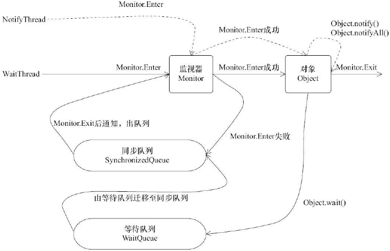

# 上下文切换

- 上下文切换：任务从保存到再加载的过程
- 并发执行速度不一定会比串行快，因为线程有创建和上下文切换的开销
- 减少上下文切换的方法
  - 无锁并发编程：如将数据的 ID 按照 Hash 算法取模分段，不同的线程处理不同段的数据
  -  [CAS 算法](https://blog.csdn.net/ls5718/article/details/52563959)：Java 的 Atomic 包使用 CAS 算法来更新数据，而无需加锁
  - 使用最少线程：避免创建不需要的线程
  - 协程：在单线程里实现多任务的调度，并在单线程里维持多个任务间的切换

# 死锁

- [死锁](/计算机基础/操作系统/进程与线程?id=死锁)

# 进程与线程

> [进程与线程](/计算机基础/操作系统/进程与线程?id=进程与线程)

## 进程与线程的关系

- 进程：操作系统在运行一个程序时，会为其创建一个进程
- 线程：现代操作系统调度的最小单元，也称为轻量级进程，在一个进程里可以创建多个线程
  - 同类的多个**线程共享**进程的**堆**和**方法区（JDK 1.8 之后的元空间）**资源
  - 每个线程有自己的**程序计数器**、**虚拟机栈**和**本地方法栈**
- 一个 Java 程序从`main()`方法开始执行，是`mian`线程和多个其他线程的同时运行


## 程序计数器为什么是私有的

- 程序计数器的两个主要作用
  1. 字节码解释器通过改变程序计数器来依次读取指令，从而实现代码的流程控制
  2. 在多线程的情况下，程序计数器用于记录当前线程执行的位置，从而当线程被切换回来的时候能够知道该线程上次运行到哪里了
- **注意**：如果执行的是 **Native 方法（Java 调用非 Java 代码的接口，该方法的实现由非 Java 语言实现）**，程序计数器记录的是 undefined 地址；只有执行的是 Java 代码时程序计数器记录的才是下一条指令的地址
- 程序计数器私有主要是为了**线程切换后能恢复到正确的执行位置**

## 虚拟机栈和本地方法栈为什么是私有的

- **虚拟机栈**：每个 Java 方法在执行的同时会创建一个**栈帧**用于存储局部变量表、操作数栈、常量池引用等信息。**从方法调用直至执行完成的过程，就对应着一个栈帧在 Java 虚拟机栈中入栈和出栈的过程**
- **本地方法栈**：与虚拟机栈的作用类似，区别为：**虚拟机栈为虚拟机执行 Java 方法（即字节码）服务，本地方法栈为虚拟机使用到的 Native 方法服务**。在 HotSpot 虚拟机中，本地方法栈和 Java 虚拟机栈合二为一
- 虚拟机栈和本地方法栈私有是为了**保证线程中的局部变量不被别的线程访问到**

# 多线程

## 使用多线程的原因

- 更多的处理器核心：使用多线程可以利用好处理器上的多个核心，减少了线程上下文切换的开销
- 更快的响应时间
- 多线程并发编程正是开发高并发系统的基础，利用好多线程机制可以大大提高系统整体的并发能力以及性能

## 使用多线程可能带来的问题

- 内存泄漏、死锁、线程不安全等等

# 线程优先级

- 在 Java 线程中，通过一个整型成员变量`priority`来控制优先级，优先级的范围从1到10，默认优先级为5，可通过`setPriority(int)`方法来修改优先级
- 优先级高的线程分配时间片的数量多于优先级低的线程
- 线程优先级不能作为程序正确性的依赖，因为操作系统可以完全不用理会 Java 线程对于优先级的设定

# 线程的状态

> [Java 线程的状态及转换](https://mp.weixin.qq.com/s?__biz=Mzk0MjE3NDE0Ng==&mid=2247494601&idx=1&sn=0b14d6cfa65c349fa0785422dd6e54bc&chksm=c2c59164f5b21872008fe57abb51137e6cab446fc8a0e1fffb2a56dcb3c9e7443184f72ebd69&scene=21#wechat_redirect)
>
> [挑错 |《Java 并发编程的艺术》中关于线程状态的三处错误](https://mp.weixin.qq.com/s/UOrXql_LhOD8dhTq_EPI0w)


- Java 线程在运行的生命周期中可能处于以下的6种不同的状态，在某一时刻，线程只能处于其中的一个状态


- Java 线程状态变迁
  - 线程创建之后，调用`start()`方法开始运行
  - 当线程执行到`wait()`方法之后，线程进入等待状态
  - 进入等待状态的线程需要依靠其他线程的通知才能回到运行状态；超时等待状态相当于在等待状态的基础上增加了超时限制
  - 当线程调用同步方法（`synchronized`关键字修饰的方法或代码块）时，在没有获取到锁的情况下，线程将会进入到阻塞状态
  - 线程在执行`Runnable`的`run()`方法之后将会进入到终止状态


# 守护线程

- 守护线程（Daemon 线程）：主要被用作程序后台调度以及支持性工作，可以通过调用`Thread.setDaemon(true)`将线程设置为 Daemon 线程
- 当 JVM 中的非 Daemon 线程全部终止时，JVM 将会退出，所有的 Daemon 线程都需要立即终止
- 在构建 Daemon 线程时，不能依靠`finally`块中的内容确保执行关闭或清理资源的逻辑

# 启动和终止线程

- 构建线程：一个新构造的线程对象是由其`parent`线程来进行空间分配，`child`线程继承了`parent`是否为 Daemon、优先级、记载资源的`contextClassLoader`和可继承的`ThreadLocal`，同时分配一个唯一的 ID 来标识这个`child`线程
- 启动线程：线程对象初始化完成后，调用`start()`方法即可启动该线程
- **不建议使用的 API**：暂停`suspend()`、恢复`resume()`、停止`stop()`，暂停和恢复操作可以用**等待/通知机制**来代替
  - `suspend()`方法在调用后，线程不会释放已占用的资源，而是占有着资源进入睡眠状态，容易引发死锁
  - `stop()`方法在终结一个线程时不会保证线程的资源正常释放，通常是没有给予线程完成资源释放工作的机会
- 终止线程：通过标识位或者中断操作的方式能够使线程在终止时有机会去清理资源

# 中断

- 中断可以理解为线程的一个标识位属性，表示一个运行中的线程是否被其他线程进行了中断操作
- 若该线程已经处于终结状态，即使该线程被中断过，在调用该线程对象的`isInterrupted()`时依旧会返回`false`

# volatile 关键字

- 关键字`volatile`可以用来**修饰字段（成员变量）**，告知程序任何对该变量的访问均需要从共享内存中获取，而对它的改变必须同步刷新回共享内存
- `volatile`能**保证所有线程对变量访问的可见性，但不能保证原子性**

# synchronized 关键字

- 关键字`synchronized`可以修饰方法或者代码块，主要确保多个线程在同一时刻，只能有一个线程处于方法或者同步块中
- 同步方法和同步块的实现，其本质上是对一个对象的监视器（monitor）进行获取，同一时刻只能有一个线程获取到由`synchronized`所保护对象的监视器
- `synchronized`保证了**线程对变量访问的可见性和原子性**


# 等待/通知机制

- 等待 /通知机制，是指一个线程 A调用了对象 O 的`wait()`方法进入等待状态，而另一个线程 B 调用了对象 O的`notify()`或者`notifyAll()`方法，线程 A 收到通知后从对象 O 的`wait()`方法返回，进而执行后续操作
- 等待/通知的相关方法是任意 Java 对象都具备的，因为这些对象被定义在所有对象的父类`java.lang.Object`上


1. **使用`wait()`、`notify()`和`notifyAll()`时需要先对调用象加锁**
2. 调用`wait()`方法后，线程状态由`RUNNING`变为`WAITING`，并将当前线程放置到对象的等待队列
3. `notify()`或`notifyAll()`方法调用后，等待线程依旧不会从 `wait()`返回，需要调用`notify()`或`notifAll()`的线程释放锁之后，等待线程有机会从`wait()`返回
4. `notify()`方法将等待队列中的一个等待线程移到同步队列中，而`notifyAll()`方法则是将等待队列中所有的线程全部移到同步队列，被移动的线程状态由`WAITING`变为`BLOCKED`
5. 从`wait()`方法返回的前提是获得了调用对象锁
6. **等待/通知机制依托于同步机制，其目的就是确保等待线程从`wait()`方法返回时能够感知到通知线程对变量做出的修改**



# Thread.join()

- 线程 A 执行了`thread.join()`语句：当前线程 A 等待`thread`线程终止之后才从`thread.join()`返回
- **线程 A 如何返回：`thread`线程结束后，会自动调用自己的`notifyAll`方法**
- 超时特性：`join(long millis)`、`join(long millis, int nanos)`
- `Thread.join()`源码：**本质仍然是执行了 `wait()`方法，而锁对象就是`Thread t`对象本身，相当于`join`是`wait`的封装**

```java
// Thread.java
// 无参的 join 有用的信息就这些，省略了额外分支
public synchronized void join() {
  while (isAlive()) {
      wait();
  }
}
```

# ThreadLocal

- `ThreadLocal`，线程变量，被附带在线程上，一个线程可以根据一个`ThreadLocal`对象查询到绑定在这个线程上的一个值，即通过`set(T)`方法来设置一个值，在当前线程下再通过`get()`方法获取到原先设置的值

# park/unpark

- 一个线程调用方法`LockSupport.park()`，该线程状态会从`RUNNABLE`变成`WAITING`
- 另一个线程调用`LockSupport.unpark(Thread 刚刚的线程)`，刚刚的线程会从 `WAITING` 回到 `RUNNABLE`
- 从实现机制上看，`park/unpark`比`wait/notify`更为简单
  1. `park`和`unpark`无需事先获取锁，或者说跟锁压根无关
  2. 没有什么等待队列一说，`unpark`会精准唤醒某一个确定的线程
  3. `park`和`unpark`没有顺序要求，可以先调用`unpark`
- `park`的原理：线程有一个计数器，初始值为0
  - **调用`park`则为**，如果这个值为0，就将线程挂起，状态改为`WAITING`；如果这个值为1，则将这个值改为0，其余的什么都不做
  - **调用`unpark`则为**，将这个值改为1

# Thread.sleep(long)

- 仅仅让线程挂起，只能通过等待超时时间到了再被唤醒

# sleep() 方法和 wait() 方法

- 两者最主要的区别在于：**`sleep()` 方法没有释放锁， `wait()` 方法释放了锁** 
- 两者都可以暂停线程的执行
- `wait()` 通常被用于线程间交互/通信，`sleep() `通常被用于暂停执行
- `wait()` 方法被调用后，线程不会自动苏醒，需要别的线程调用同一个对象上的 `notify() `或者 `notifyAll()` 方法
- `sleep() `方法执行完成后，线程会自动苏醒；或者可以使用 `wait(long timeout)` 超时后线程会自动苏醒

# start() 方法和 run() 方法

- 调用`start()`方法时会执行`run()`方法，为什么不能直接调用`run()`方法
  - **总结： 调用 `start()` 方法方可启动线程并使线程进入就绪状态，直接执行 `run()` 方法的话不会以多线程的方式执行**
  - 执行`new Thread()`，线程进入了新建状态；调用 `start()`方法，会启动一个线程并使线程进入了就绪状态，当分配到时间片后就可以开始运行了，**即`start()` 会执行线程的相应准备工作，然后自动执行 `run()` 方法的内容，这是真正的多线程工作**
  - 但是，直接执行`run()`方法，**会把`run()`方法当成一个`main`线程下的普通方法去执行，并不会在某个线程中执行它**，所以这并不是多线程工作

# 线程交替打印问题

> [面试官：请用五种方法实现多线程交替打印问题](https://zhuanlan.zhihu.com/p/370130458)

- 问题的本质：线程通信问题，思路基本上是一个线程执行完毕，阻塞该线程，唤醒其他线程，按顺序执行下一个线程
- 几种方法
  1. `synchronized` + `wait/notify/notifyAll`
  2. `join()`：在A线程中调用了B线程的`join()`方法时，表示只有当B线程执行完毕时，A线程才能继续执行
  3. `Lock`：不管哪个线程拿到锁，只有符合条件的才能打印
  4. `Lock` + `Condition`：实现对线程的精准唤醒，减少对同步锁的无意义竞争，浪费资源；和`synchronized` + `wait/notify/notifyAll`很像，`synchronized`对应`Lock`，`wait/notify`方法对应`await/signal`方法
  5. `Semaphore`信号量：避免唤醒其他无意义的线程避免资源浪费
     - `Semaphore`：用来控制同时访问某个特定资源的操作数量，或者同时执行某个制定操作的数量。`Semaphore`内部维护了一个计数器，其值为可以访问的共享资源的个数
     - 一个线程要访问共享资源，先使用`acquire()`方法获得信号量，如果信号量的计数器值大于等于1，意味着有共享资源可以访问，则使其计数器值减去1，再访问共享资源。如果计数器值为0，线程进入休眠
     - 当某个线程使用完共享资源后，使用`release()`释放信号量，并将信号量内部的计数器加1，之前进入休眠的线程将被唤醒并再次试图获得信号量
  6. `AtomicInteger`
  7. `LockSupport`
  8. `CountDownLatch`

## 三个线程交替打印ABC

### synchronized + wait / notify

```java
class WaitNotifyABC {
    private volatile int cnt = 0;
    private static final Obejct LOCK = new Object();
    
    private void printABC(int order) {
        for(int i = 0; i < 10; i++) { // 交替打印n=10次
            synchronized (LOCK) {
            while(cnt % 3 != order) {
                try {
                    LOCK.wait();
                } catch (InterruptedException e) {
                    e.printStackTrace();
                }
            }
            cnt++;
            System.out.print(Thread.currentThread().getName());
            LOCK.notifyAll();
        	}
        }
    }
    
    public static void main(String[] args) {
        WaitNotifyABC waitNotifyABC = new WaitNotifyABC();
        new Thread(() -> waitNotifyABC.printABC(0), "A").start();
        new Thread(() -> waitNotifyABC.printABC(1), "B").start();
        new Thread(() -> waitNotifyABC.printABC(2), "C").start();
    }
}
```

### join()

```java
class JoinABC {
    public static void main(String[] args) throws InterruptedException {
        for(int i = 0; i < 10; i++) { // 交替打印n=10次
            Thread t1 = new Thread(new printABC(null), "A");
            Thread t2 = new Thread(new printABC(t1), "B");
            Thread t3 = new Thread(new printABC(t2), "C");
            t1.start();
            t2.start();
            t3.start();
            Thread.sleep(10); //这里是要保证只有t1、t2、t3为一组，进行执行才能保证t1->t2->t3的执行顺序 
        }
    }
    
    static class printABC implements Runnable {
        private Thread beforeThread;
        public printABC(Thread beforeThread) {
            this.beforeThread = beforeThread;
        }
        @Override
        public void run() {
            if(beforeThread != null) {
                try {
                    beforeThread.join();
                    System.out.print(Thread.currentThread().getName());
                } catch(Exception e){
                    e.printStackTrace();
                }
            } else {
                System.out.print(Thread.currentThread().getName());
            }
        }
    }
}
```

### Lock

```java
class LockABC {
    private volatile int cnt = 0;
    private static Lock lock = new ReentrantLock();
    
    private void printABC(int order) {
        for(int i = 0; i < 10;) { // 交替打印n=10次
            lock.lock();
            if(cnt % 3 == order) {
                cnt++;
                i++;
                System.out.print(Thread.currentThread().getName());
            }
            lock.unlock();
        }
    }
    
    public static void main(String[] args) {
        LockABC lockABC = new LockABC();
        new Thread(() -> lockABC.printABC(0), "A").start();
        new Thread(() -> lockABC.printABC(1), "B").start();
        new Thread(() -> lockABC.printABC(2), "C").start();
    }
}
```

### Lock + Condition

```java
class LockConditionABC {
    private volatile int cnt = 0;
    private static Lock lock = new ReentrantLock();
    private static Condition c1 = lock.newCondition();
    private static Condition c2 = lock.newCondition();
    private static Condition c3 = lock.newCondition();
    
    private void printABC(int order, Condition currentThread, Condition nextThread) {
        for(int i = 0; i < 10;) { // 交替打印n=10次
            lock.lock();
            try {
                while(cnt % 3 != order) {
                    currentThread.await(); // 阻塞当前线程
                }
                num++;
                i++;
                System.out.print(Thread.currentThread().getName());
                nextThread.signal(); // 唤醒下一个线程，而不是唤醒所有线程
            } catch (Exception e) {
                e.printStackTrace();
            } finally {
                lock.unlock();
            }
        }
    }
    
    public static void main(String[] args) {
        LockConditionABC lockConditionABC = new LockConditionABC();
        new Thread(() -> lockConditionABC.printABC(0, c1, c2), "A").start();
        new Thread(() -> lockConditionABC.printABC(1, c2, c3), "B").start();
        new Thread(() -> lockConditionABC.printABC(2, c3, c1), "C").start();
    }
}
```

### Semaphore

```java
class SemaphoreABC{

    private static Semaphore s1 = new Semaphore(1); //因为先执行线程A，所以这里设s1的计数器为1
    private static Semaphore s2 = new Semaphore(0);
    private static Semaphore s3 = new Semaphore(0);

    private void printABC(Semaphore currentThread, Semaphore nextThread) {
        for(int i = 0; i < 10; i++) { // 交替打印10次
            try {
                currentThread.acquire(); // 阻塞当前线程，即信号量的计数器减1为0
                System.out.print(Thread.currentThread().getName());
                nextThread.release(); // 唤醒下一个线程，即信号量的计数器加1
            } catch (InterruptedException e) {
                e.printStackTrace();
            }
        }
    }

    public static void main(String[] args) throws InterruptedException {
        SemaphoreABC semaphoreABC = new SemaphoreABC();
        new Thread(() -> semaphoreABC.printABC(s1, s2), "A").start();
        Thread.sleep(10);
        new Thread(() -> semaphoreABC.printABC(s2, s3), "B").start();
        Thread.sleep(10);
        new Thread(() -> semaphoreABC.printABC(s3, s1), "C").start();
    }
}
```

## 两个线程交替打印1-100的奇偶数

### synchronized + wait / notify

```java
class WaitNotifyOddEven {
    private volatile int cnt = 0;
    private static final Obejct LOCK = new Object();
    
    private void printOddEven() {
        synchronized (LOCK) {
            while(cnt < 100) { // 打印1-100
                try{
                    System.out.print( Thread.currentThread().getName() + "：");
                    System.out.println(++count);
                    LOCK.wait();
                    LOCK.notifyAll();
                } catch (InterruptedException e) {
                    e.printStackTrace();
                }
            }
            // 防止count=100后，while()循环不再执行，有子线程被阻塞未被唤醒，导致主线程不能退出
            LOCK.notifyAll();
        }
    }
    
    public static void main(String[] args) {
        WaitNotifyOddEven waitNotifyOddEven = new WaitNotifyOddEven();
        new Thread(() -> waitNotifyOddEven.printOddEven(), "Odd").start();
        Thread.sleep(10); //为了保证线程Odd先拿到锁
        new Thread(() -> waitNotifyOddEven.printOddEven(), "Even").start();
    }
}
```

## N个线程循环打印1-100

### synchronized + wait / notify

```java
class WaitNotify100 {
    private volatile int cnt = 0;
    private int maxNum = 100; // 打印1-100
    private static final Obejct LOCK = new Object();
    
    private void print100(int order) {
        while(true) {
            synchronized (LOCK) {
                while(cnt % 3 != order) {
                    if(cnt >= maxNum) break;
                    try {
                        LOCK.wait();
                    } catch (InterruptedException e) {
                        e.printStackTrace();
                    }
                }
                if(cnt >= maxNum) break;
                cnt++;
                System.out.println(Thread.currentThread().getName() + ": " + cnt);
                LOCK.notifyAll();
            }
        }
    }
    
    public static void main(String[] args) {
        WaitNotify100 waitNotify100 = new WaitNotify100();
        new Thread(() -> waitNotify100.print100(0), "thread1").start();
        new Thread(() -> waitNotify100.print100(1), "thread2").start();
        new Thread(() -> waitNotify100.print100(2), "thread3").start();
    }
}
```
