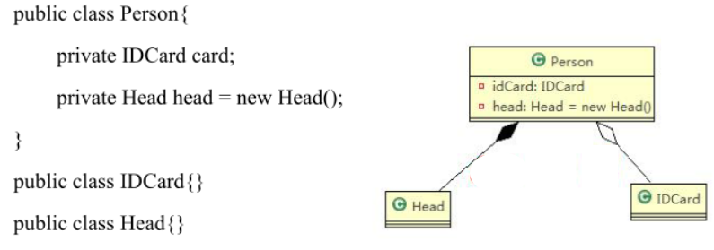

# UML 基本介绍

- UML，Unified Modeling Language，统一建模语言，是一种用于软件系统分析和设计的语言工具
- UML 图分类
  - 用例图（use case）
  - 静态结构图：**类图**、对象图、包图、组件图、部署图
  - 动态结构图：交互图（时序图与协作图）、状态图、活动图

# UML 类图

- 用于描述系统中的**类（对象）本身的组成和类（对象）之间的各种静态关系**
- 类之间的关系：**依赖、泛化（继承）、实现、关联、聚合与组合**

# 类图 - 依赖关系 Dependence

- 只要是在**类中用到了对方，那么它们之间就存在依赖关系**
- 包括以下情况：
  - 类的成员属性
  - 方法的返回类型
  - 方法接收的参数类型
  - 方法中使用到的

# 类图 - 泛化关系 Generalization

- **泛化关系实际上就是继承关系**
  - 如果 A 类继承了 B 类，那么 A 和 B 之间存在泛化关系
- **泛化关系是依赖关系的特例**

# 类图 - 实现关系 Implementation

- 实现关系实际上就是**A 类实现 B 接口**
- 实现关系是**依赖关系的特例**

# 类图 - 关联关系 Association

- 关联关系实际上是**类与类之间的联系**
- 关联具有导向性，即**双向关系**或**单向关系**
- 关联具有多重性，即**一对一、一对多、多对多**
- 关联关系是**依赖关系的特例**

# 类图 - 聚合关系 Aggregation

- 聚合关系表示的是**整体和部分的关系，整体与部分可以分开**
- **聚合关系是关联关系的特例**，具有关联的**导向性**和**多重性**
- 聚合关系用**带空心菱形的实线**来表示

# 类图 - 组合关系 Composition

- 组合关系表示的是**整体与部分的关系，但是整体与部分不可以分开**
- 组合关系用**带实心菱形的实线**来表示

