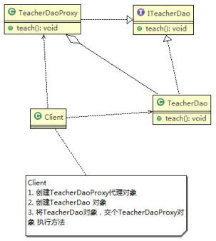
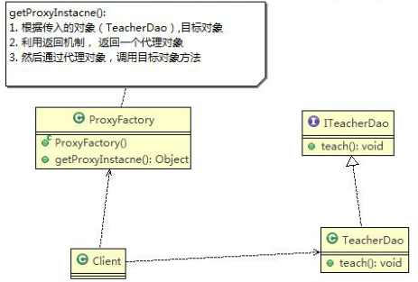
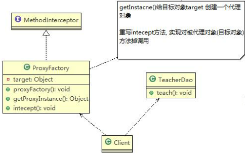

# 基本介绍

- **代理模式（Proxy Pattern）**：为一个对象提供一个替身，以控制对这个对象的访问，即通过代理对象访问目标对象
- **优点**：可以在目标对象实现的基础上，增强额外的功能操作，拓展目标对象的功能
- **被代理的对象**：远程对象、创建开销大的对象或需要安全控制的对象
- 代理模式的三种形式
  - **静态代理**
  - **动态代理（JDK 代理、接口代理）**
  - **Cglib 代理**：可以在**内存中动态地创建对象，而不需要实现接口**，属于动态代理的范畴、

# 静态代理



## 基本介绍

- **静态代理：需要定义接口或者父类，被代理对象（目标对象）与代理对象一起实现相同的接口或者是继承相同父类**
- 调用时通过调用代理对象的方法来调用目标对象

## 具体实现

1. 创建目标对象`target`
2. 创建代理对象`proxy`，同时将目标对象`target`传递给`proxy`
   - **代理类中通过接口来聚合目标类，即把接口定义为成员变量**
3. 将`target`对象交给`proxy`对象执行方法

## 优缺点

- 优点：在不修改目标对象的功能前提下，能通过代理对象对目标功能扩展
- 缺点：因为代理对象需要与目标对象实现一样的接口，所以会有很多代理类，**一旦接口增加方法，目标对象和代理对象都要维护**

# 动态代理



## 基本介绍

- **动态代理：代理对象不需要实现接口，但目标对象要实现接口**
- **代理对象的生成是利用 JDK 的 API，动态地在内存中构建代理对象**
- 动态代理也称为 JDK 代理、接口代理

## 所需 JDK 的 API

- 代理类所在包：`java.lang.reflect.Proxy`
- JDK 实现代理只需要使用`newProxyInstance`方法，该方法接收三个参数：`static Object newProxyInstance(ClassLoader loader, Class<?>[] interfaces, InvocationHandler h)`
  1. `ClassLoader loader`：**指定当前目标对象使用的类加载器**
  2. `Class<?>[] interfaces`：**目标对象实现的接口类型**，使用泛型方法确认类型
  3. `InvocationHandler h`：事件处理，执行目标对象的方法时，会触发事件处理器方法，**会把当前执行的目标对象方法作为参数传入**

## 具体实现

1. 创建代理工厂类`ProxyFactory`，通过该类返回一个代理对象
2. 代理工厂类`ProxyFactory`中含有`getProxyInstance()`方法，根据`ProxyFactory`构造方法中传入的对象（目标对象），返回代理对象
3. 通过代理对象，调用目标对象方法

```java
public class ProxyFactory {
    // 维护目标对象，target
    private Object target;
    
    // 构造器，对target初始化
    public ProxyFactory(Object target) {
        this.target = target;
    }
    
    //根据目标对象生成代理对象
    public Object getProxyInstance() {
        return Proxy.newProxyInstance(
            target.getClass().getClassLoader,
        	target.getClass().getInterfaces(),
        	new InvocationHandler() {
                
                @Override
                public Object invoke(Object proxy, Method method, Object[] args) throws Throwable {
                    // TODO Auto-generated method stub
                    ...
                    // 反射机制调用目标对象的方法，并获取方法的返回值
                    Object returnVal = method.invoke(target, args); // args 为 目标对象方法所需的参数
                    return returnVal;            
                }
            });
    }
}
```

# Cglib 代理



## 基本介绍

- Cglib 代理：当目标对象只是一个单独的对象，**并没有实现任何接口，此时可使用目标对象子类来实现代理**（静态代理和 JDK 代理都要求目标对象实现接口）
- Cglib 代理也称作**子类代理**，**在内存中构建一个子类对象**从而实现对目标对象功能扩展（也归属到动态代理）
- Cglib 是一个强大的高性能的代码生成包，可以在运行期扩展 java 类与实现 java 接口，**被许多 AOP 框架广泛使用，如 Spring AOP，实现方法拦截**
- **在 AOP 编程中选择代理模式**
  1. 目标对象需要实现接口：JDK 代理
  2. 目标对象不需要实现接口：Cglib 代理
- Cglib 包的底层是通过**使用字节码处理框架 ASM** 来转换字节码并生成新的类

## 注意事项

- 需要引入 Cglib 的 jar 文件，如：`asm.jar`，`asm-commons.jar`，`asm-tree.jar`，`cglib-2.2.jar`
- 在内存中动态创建子类，****注意代理的类不能为`final`，否则会报错**`java.lang.IllegalArgumentException`
- **如果目标对象的方法为`final/static`，就不会被拦截，即不会执行目标对象额外的业务方法**

## 具体实现

```java
public class ProxyFactory implements MethodInterceptor {
    // 维护一个目标对象
    private Object target;
    
    // 构造器，传入一个被代理的对象
    public ProxyFactory(Object target) {
        this.target = target;
    }
    
    // 返回target对象的代理对象
    public Object getProxyInstance() {
        // 1. 创建一个工具类，增强器
        Enhancer enhancer = new Enhancer();
        // 2. 设置父类
        enhancer.setSuperclass(target.getClass());
        // 3. 设置回调函数
        enhancer.setCallback(this);
        // 4. 创建子类对象，即代理对象
        return enhancer.create();
    }
    
    // 重写intercept方法，该方法会调用目标对象的方法
    @Override
    public Object intercept(Object arg0, Method method, Object[] args, MehthodProxy arg3) throws Throwable {
        // TODO Auto-generated method stub
        ...
        Object returnVal = method.invoke(target, args);
        return returnVal;
    }
}
```

# 代理模式的几种变体

1. 防火墙代理
   - 内网通过代理穿透防火墙，实现对公网的访问
2. 缓存代理
   - 当请求图片文件等资源时，先到缓存代理取，如果取到资源则请求完成；如果取不到资源，再到公网或者数据库取，然后缓存
3. 远程代理
   - 远程代理的本地代表，通过它可以把远程对象当做本地对象来调用；远程代理通过网络和真正的远程对象沟通信息
4. 同步代理
   - 主要使用在多线程编程中，完成多线程间同步工作

