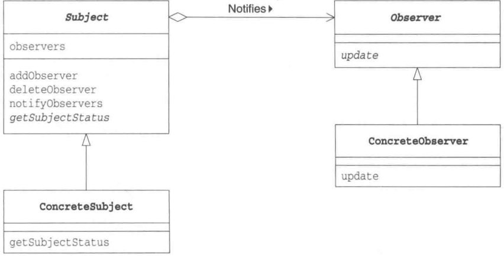
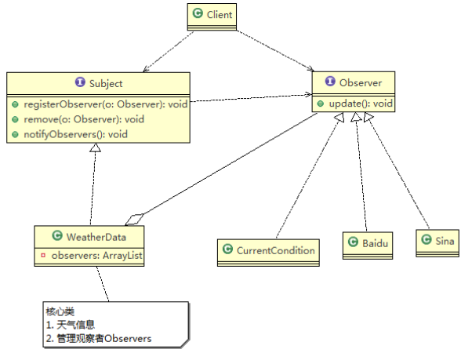
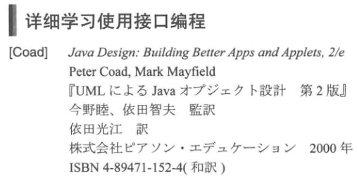

# 基本概念

- 观察者模式（Observer 模式）：**对象之间多对一依赖**的一种设计方案，被依赖的对象为`Subject`，依赖的对象为`Observer`，`Subject`通知`Observer`变化
- Observer 模式适用于根据对象状态进行相应处理的场景
- **Observer 模式以集合的方式管理`Observer`，包括注册 register、移除 remove、通知 notify**

# 原理

## 角色

- `Subject`：观察对象，定义了注册 register、删除 remove、通知 notify 观察者的方法
- `ConcreteSubject`：具体的观察对象，当自身状态发生变化后，它会通知所有已经注册的`Observer`
- `Observer`：观察者，接收来自`Subject`的状态变化的通知，为此声明了`update`方法
- `ConcreteObserver`：具体的观察者，当它的`update`方法被调用后，会去获取观察对象的最新状态



## 举例 - 天气预报

- `Subject`：气象局
- `Observer`：第三方网站、用户
- 气象局注册各个第三方网站、用户，气象局通知所有注册的用户，根据不同需求，可以是更新数据，让用户来取；也可以是实施推送



## 可替换性的设计思想

- 利用抽象类和接口（`Subject`、`Observer`）从具体类中抽出抽象方法
- 在将实例作为参数传递至类中，或者在类的字段中保存实例时，不使用具体类型，而是使用抽象类型和接口

# Observer 模式在 JDK 应用的源码分析

## 代码分析

- `java.util.Observer`接口和`java.util.Observable`类就是一种 Observer 模式
- `java.util.Observer`接口：

```java
public interface Observer {
    /**
     * This method is called whenever the observed object is changed. An
     * application calls an <tt>Observable</tt> object's
     * <code>notifyObservers</code> method to have all the object's
     * observers notified of the change.
     *
     * @param   o     the observable object.
     * @param   arg   an argument passed to the <code>notifyObservers</code>
     *                 method.
     */
    void update(Observable o, Object arg);
}
```

- `java.util.Observable`类

```java
public class Observable {
    private boolean changed = false;
    private Vector<Observer> obs;
    
    /** Construct an Observable with zero Observers. */

    public Observable() {
        obs = new Vector<>();
    }
    ...
}
```

## 角色分析

- `Observable`的作用相当于上文的`Subject`，`Observable`是类而不是接口，类中实现了核心的方法，即管理`Observer`的方法：`add`、`delete`、`notify`
- `Observer`的作用相当于上文的`Observer`，具有`update`方法
- `Observable`和`Observer`的使用方法与上文一致
  - `Observable` 是类，通过继承来实现观察者模式
  - `Subject`是接口，通过实现接口来实现观察者模式

## 可能出现的问题

- 传递给`Observer`接口的`Subject`角色必须是`Observable`类或其子类，但 Java 只能单一继承，即如果`Subject`角色已经是某类的子类，则它将无法继承`Observable`类
- 解决方法（参考 Coad 书）：`Subject`角色和`Observer`接口都被定义为 Java 的接口



