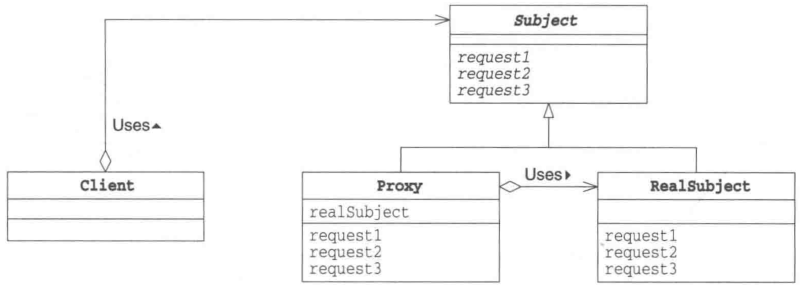
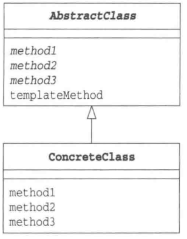
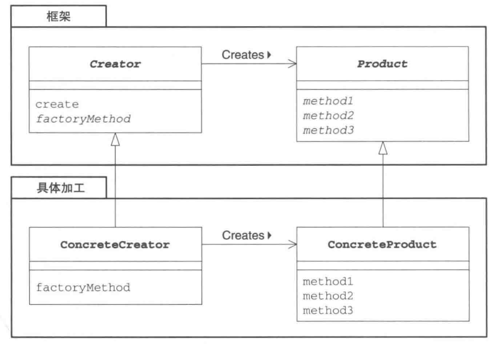

> [Java设计模式：23种设计模式全面解析（超级详细）](http://c.biancheng.net/design_pattern/)

# 设计模式

- 设计模式（Design pattern）代表了最佳的实践，通常被有经验的面向对象的软件开发人员所采用
- 设计模式是软件开发人员在软件开发过程中面临的一般问题的解决方案

# 代理模式 Proxy Pattern

> [代理模式 | 菜鸟教程](https://www.runoob.com/design-pattern/proxy-pattern.html)

## 基本介绍

- 在面向对象编程中，“本人”和“代理人”都是对象；如果“本人”对象太忙了，有些工作无法亲自完成，就将其交给“代理人”对象负责；仅在必要时才生成“本人”实例

- `Subject`主体：`Proxy`和`RealSubject`的接口
- `Proxy`代理类：`Proxy`会尽量处理来自`Client`的请求，只有当自己不能处理时才会将工作交给`RealSubject`，即`Proxy`只在必要时才会生成`RealSubject`
- `RealSubject`实际类：`RealSubject`在`Proxy`无胜任工作时被创建实例

## 优点

- 使用代理人来提升处理速度
- 透明性：`Proxy`类和`RealSubject`类都实现了`Subject`接口，因此主程序不必在意调用的是哪个类

## Proxy 模式的变化形式

- **Virtual Proxy 虚拟代理**：只有在真正需要实例时，才生成和初始化实例
- **Remote Proxy 远程代理**：Remote Proxy 可以让我们完全不必在意`RealSubject`是否在远程网络上，可以透明地调用它的方法，例如 Java 的 RMI（RemoteMethodInvocation）
- **Access Proxy 访问代理**：用于在调用`RealSubject`的功能时设置访问限制，例如只允许指定的用户调用方法

# 模板模式

> [模板模式 | 菜鸟教程](https://www.runoob.com/design-pattern/template-pattern.html)

## 基本介绍

- **在父类中定义处理流程的框架，在子类中实现具体处理**的模式
- **组成模板的抽象方法被定义在父类中**
- **子类实现父类定义的抽象方法**，不同的子类中实现不同的具体处理

- `AbstractClass`抽象类：不仅负责实现模板方法，还负责声明模板方法中所使用到的抽象方法
- `ConcreteClass`具体类：负责具体实现`AbstractClass`中定义的抽象方法

## 优点

- 可以使逻辑处理通用化
- 父类与子类之间的协作、一致性

# 工厂模式 Factory Pattern

> [工厂模式 | 菜鸟教程](https://www.runoob.com/design-pattern/factory-pattern.html)

## 基本介绍

- 工厂模式中，父类决定实例的生成方式，但不决定所要生成的具体的类，具体处理全部交给子类负责，将生成实例的框架和实际负责生成实例的类解耦

- **父类（框架）的`Creator`和`Product`的关系与子类（具体加工）的`ConcreteCreator`和`ConcreteProduct`的关系是平行的**
- `Product`产品抽象类：定义了工厂模式中**生成的那些实例所持有的接口（API）**，但具体的处理则由子类`ConcreteProduct`实现
- `Creator`创建者抽象类：负责生成`Product`的抽象类，，但具体的处理则由子类`ConcreteCreator`实现
  - `Creator`中**定义的`factoryMethod`方法为生成实例的方法，不用`new`关键字来生成实例，而是调用生成实例的专用方法来生成实例，这样可以方法防止父类与其他具体类耦合**
  - `Creator`中定义的`factoryMethod`方法**相当于模板模式里的模板方法**
- `ConcreteProduct`产品具体类：决定了具体的产品
- `ConcreteCreator`创建者具体类：负责生成具体的产品

## 生成实例的方法的三种实现方式

1. 指定其为抽象方法
   - 如果子类不实现该方法，编译器将会报告编译错误
2. 为其实现默认处理
   - 但此时为使用`new`关键字创建出实例，故不能将`Product`类定义为抽象类（因为抽象类不能被实例化）
3. 在其中抛出异常
   - 如果子类不实现该方法，程序会在运行时报错，告知开发者没有实现该方法

