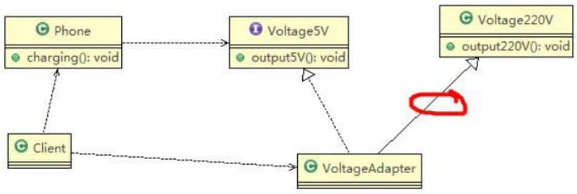
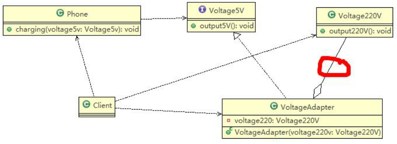
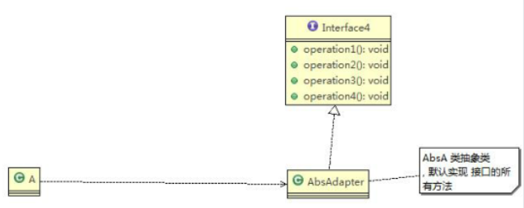
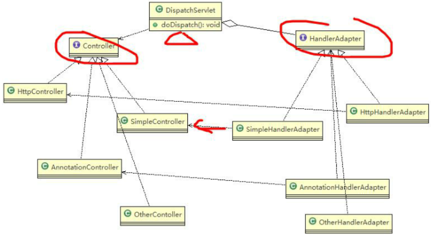
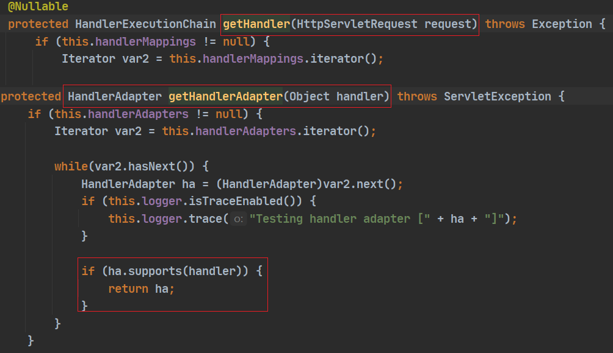
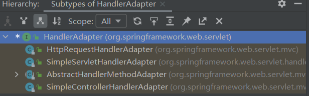
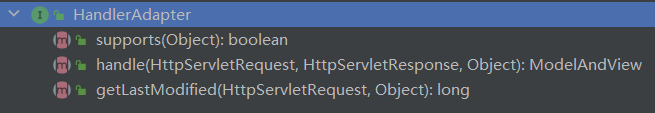
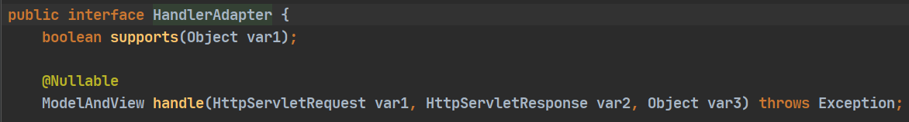

# 基本概念

- **适配器模式（Adapter Pattern）**：将某个类的接口转换成所期望的另一个接口表示，**主要目的是兼容性，让原来接口不兼容的类可以兼容**
- 也被称为包装器（Wrapper）
- 适配器模式属于**结构型模式**，不修改“被适配者”的功能
  - **被适配者：需要被适配的类、接口、对象，简称`src`（`source`）**
- 主要分为三类（实际开发中，实现方法不拘泥于这三种经典形式）
  1. **类适配器模式**：以类的形式，在 Adapter 里将`src`作为一个类，继承
  2. **对象适配器模式**：以对象的形式，在 Adapter 里将`src`作为一个对象，持有
  3. **接口适配器模式**：以接口的形式，在 Adapter 里将`src`作为一个接口，实现

> 三种命名方式是根据 src 在 Adapter 里的形式来命名的

- 工作原理
  - 从调用者的角度看不到被适配者，是解耦的
  - 用户调用适配器转化出来的目标接口方法，适配器再调用被适配者的相关接口方法

# 类适配器模式

## 原理

- 原理：适配器类`Adapter`通过**继承`src`类**，实现`dst`类接口，完成`src -> dst`的适配
- 案例：手机充电，充电器相当于`Adapter`，220V 交流电相当于`src`（被适配者），目标`dst`是 5V 直流电



## 注意事项

- 类适配器需要**继承`src`类**，则**要求`dst`必须是接口**（Java 是单继承机制），有一定局限性
- `src`类的方法会在`Adapter`中都会暴露出来，也增加了使用的成本
- 由于其继承了`src`类，可以根据需求重写`src`类的方法，使得`Adapter`的灵活性增强

# 对象适配器模式

## 原理

- 基本思路与类适配器模式相同，只是`Adapter`**持有`src`类的实例（`src`作为成员变量 / 字段）**，以解决兼容性的问题，即：**持有`src`类**，实现`dst`类接口，完成`src -> dst`的适配
- 根据“合成复用原则”，在系统中尽量**使用关联关系（聚合）来替代继承关系**
- 对象适配器模式是适配器模式常用的一种
- 案例：手机充电，充电器相当于`Adapter`，220V 交流电相当于`src`（被适配者），目标`dst`是 5V 直流电



## 注意事项

- 对象适配器模式和类适配器模式实际上算是同一种思想，但实现方式不同
  - 根据合成复用原则，**使用组合替代继承**，解决了类适配器模式必须继承`src`的局限性问题，也不要求`dst`必须是接口
- 使用成本更低，更灵活

# 接口适配器模式

## 原理

- 也称为：适配器模式（Default Adapter Pattern）或缺省适配器模式
- 核心思路：当**不需要全部实现接口提供的方法**时，可先设计一个**抽象类或接口**，并为该接口中每个方法提供一个**默认实现（空方法）**，则该抽象类的子类可以**选择性地覆盖父类的某些方法来实现需求**
- **适用于不想使用一个接口的所有方法的情况**
- 案例：某接口具有多个方法，创建某个类去使用其中的一个方法



```java
public interface Interface4 {
    public void m1();
    public void m2();
    public void m3();
    public void m4();
}
```

```java
// 抽象类作为适配器，将 Interface4 的方法进行默认实现
public abstract class AbsAdapter implements Interface4 {
    // 默认实现
    public void m1() {}
    public void m2() {}
    public void m3() {}
    public void m4() {}
}
```

```java
public class Client {
    public static void main(String[] args) {
        AbsAdapter absAdapter = new AbsAdapter() {
            // 只覆盖需要使用的接口方法
            @Override
            public void m1() {
                //... 业务代码
            }
        }
        absAdapter.m1();
    }
}
```

# 适配器模式在 SpringMVC 框架的应用

- **SpringMVC 中的 [HandlerAdapter](/SSM框架/SpringMVC?id=springmvc-组件解析-1) 使用了适配器模式**
- SpringMVC 使用 [HandlerAdapter](/SSM框架/SpringMVC?id=springmvc-组件解析-1) 的原因
  - 处理器的类型不同，有多重实现方式，则调用方式是不确定的
  - 如果直接调用`Controller`方法，则调用时需要不断`if-else`来判断是哪一种子类然后执行
  - 如果后续需要扩展`Controller`，就需要修改原有代码，违背了 OCP 原则

## 源码分析



1. `DispatcherServlet`通过`HandlerMapping`来映射`Controller`，先通过`getHandlerAdapter`方法获取适当的`HandleAdapter`适配器，再通过适配器调用`Controller`的方法并返回`ModelAndView`



2. Spring 创建了一个适配器接口`HandAdapter`，`HandAdapter`的实现子类使得每一种`Controller`都有一种对应的适配器实现类（因为每种`Controller`有不同的实现方式）







## 说明

- **Spring 定义了一个适配器接口，使得每一种`Controller`有一种对应的适配器实现类**
- **适配器代替`Controller`执行相应的方法**
- **扩展`Controller`时，只需要增加一个适配器类就完成了 SpringMVC 的扩展**
