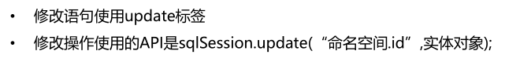

# MyBatis 简介

- MyBatis 是一个优秀的基于 java 的持久层框架，内部封装了 JDBC，使开发者只需要关注 sql 语句本身，而不需要花费精力去处理加载驱动、创建连接、创建 statement 等繁杂的过程
- MyBatis 通过 **xml 或注解的方式**将要执行的各种 statement 配置起来
- MyBatis 通过 **java 对象**和 statement 中 **sql 的动态参数**进行**映射**生成
- MyBatis **解决了实体和数据库映射的问题**，对 JDBC 进行了封装，屏蔽了 JDBC api 底层访问细节

# 开发步骤

- 导入 Mybatis 坐标和其他相关坐标

```xml
<!--mybatis坐标-->
<dependency>
    <groupId>org.mybatis</groupId>
    <artifactId>mybatis</artifactId>
    <version>3.4.5</version>
</dependency>

<!--mysql驱动坐标-->
<dependency>
    <groupId>mysql</groupId>
    <artifactId>mysql-connector-java</artifactId>
    <version>5.1.6</version>
    <scope>runtime</scope>
</dependency>

<!--单元测试坐标-->
<dependency>
    <groupId>junit</groupId>
    <artifactId>junit</artifactId>
    <version>4.12</version>
    <scope>test</scope>
</dependency>

<!--日志坐标-->
<dependency>
    <groupId>log4j</groupId>
    <artifactId>log4j</artifactId>
    <version>1.2.12</version>
</dependency>
```

- 创建`user`数据表
- 编写`User`实体
- **编写`UserMapper.xml`映射文件**：`namespace`、`id`、`resultType`

```xml
<?xml version="1.0" encoding="UTF-8" ?>
<!DOCTYPE mapper PUBLIC "-//mybatis.org//DTD Mapper 3.0//EN" "http://mybatis.org/dtd/mybatis-3-mapper.dtd">
<mapper namespace="userMapper">
    <!--查询操作-->
    <select id="findAll" resultType="com.njk.domain.User">
        select * from user
    </select>
</mapper>
```

- **编写 MyBatis `sqlMapConfig.xml`核心文件**

```xml
<?xml version="1.0" encoding="UTF-8" ?>
<!DOCTYPE configuration PUBLIC "-//mybatis.org//DTD Config 3.0//EN" "http://mybatis.org/dtd/mybatis-3-config.dtd">
<configuration>
    <!--加载properties文件-->
    <properties resource="jdbc.properties"></properties>

    <!--数据源环境-->
    <environments default="development">
        <environment id="development">
            <transactionManager type="JDBC"></transactionManager>
            <dataSource type="POOLED">
                <property name="driver" value="${jdbc.driver}"/>
                <property name="url" value="${jdbc.url}"/>
                <property name="username" value="${jdbc.username}"/>
                <property name="password" value="${jdbc.password}"/>
            </dataSource>
        </environment>
    </environments>

    <!--加载映射文件-->
    <mappers>
        <mapper resource="com/njk/mapper/UserMapper.xml"></mapper>
    </mappers>
</configuration>
```

- 编写测试代码

```java
//加载核心配置文件
InputStream resourceAsStream = Resources.getResourceAsStream("SqlMapConfig.xml");
//获得sqlSession工厂对象
SqlSessionFactory sqlSessionFactory = new SqlSessionFactoryBuilder().build(resourceAsStream);
//获得sqlSession对象
SqlSession sqlSession = sqlSessionFactory.openSession();
//执行sql语句
List<User> userList = sqlSession.selectList("userMapper.findAll");
//打印结果
System.out.println(userList);
//释放资源
sqlSession.close()
```

# MyBatis 映射文件


# MyBatis 的增删查改操作


## 插入操作


- **编写`UserMapper.xml`映射文件**

```xml
<mapper namespace="userMapper">
	<insert id="add" parameterType="com.njk.domain.User">
    	insert into user values(#{id}, #{username}, #{password})
    </insert>
</mapper>
```

-  编写插入实体`User`的代码

```java
InputStream resourceAsStream= Resources.getResourceAsStream("SqlMapConfig.xml");
SqlSessionFactory sqlSessionFactory = new SqlSessionFactoryBuilder().build(resourceAsStream);
SqlSession sqlSession = sqlSessionFactory.openSession();
int insert = sqlSession.insert("userMapper.add", user); // 前面需要先创建想要插入的user对象
// 提交事务
sqlSession.commit();
sqlSession.close();
```

## 修改操作



- **编写`UserMapper.xml`映射文件**

```xml
<mapper namespace="userMapper">
	<update id="update" parameterType="com.njk.domain.User">
    	update user set username=#{username}, password=#{password} where id=#{id}
    </update>
</mapper>
```

-  编写修改实体`User`的代码

```java
InputStream resourceAsStream= Resources.getResourceAsStream("SqlMapConfig.xml");
SqlSessionFactory sqlSessionFactory = new SqlSessionFactoryBuilder().build(resourceAsStream);
SqlSession sqlSession = sqlSessionFactory.openSession();
int update = sqlSession.update("userMapper.update", user); // 前面需要先创建想要修改的user对象
System.out.println(update);
sqlSession.commit();
sqlSession.close();
```

## 删除操作


- **编写`UserMapper.xml`映射文件**

```xml
<mapper namespace="userMapper">
	<delete id="delete" parameterType="java.lang.Integer">
    	delete from user where id=#{id}
    </delete>
</mapper>
```

- 编写删除实体`User`的代码

```java
InputStream resourceAsStream= Resources.getResourceAsStream("SqlMapConfig.xml");
SqlSessionFactory sqlSessionFactory = new SqlSessionFactoryBuilder().build(resourceAsStream);
SqlSession sqlSession = sqlSessionFactory.openSession();
int delete = sqlSession.delete("userMapper.delete",3); // 根据id删除数据
System.out.println(delete);
sqlSession.commit();
sqlSession.close();
```

# Mybatis 核心配置文件


## environment 标签


- 事务管理器`transactionManager`类型有两种
  - `JDBC`：直接使用了 JDBC 的提交和回滚设置，**常用类型**
  - `MANAGED`：该配置几乎没做什么，它从来不提交或回滚一个连接
- 数据源`dataSource`类型有三种
  - `POOLED`：利用“池”的概念将 JDBC 连接对象组织起来，**常用类型**
  - `UNPOOLED`：只是每次被请求时打开和关闭连接，开销大
  - ` JNDI`

## mapper 标签

- **使用相对于类路径的资源引用**

```xml
<mapper resource="org/mybatis/builder/AuthorMapper.xml"/>
```

- 使用完全限定资源定位符（URL）

```xml
<mapper url="file:///var/mappers/AuthorMapper.xml"/>
```

- **使用映射器接口实现类的完全限定类名**

```xml
<mapper class="org.mybatis.builder.AuthorMapper"/>
```

- 将包内的映射器接口实现全部注册为映射器

```xml
<package name="org.mybatis.builder"/>
```

## properties 标签

- 将数据源的配置信息单独抽取成一个`properties`文件，该标签可以加载额外配置的`properties`文件

```xml
<properties resource="jdbc.properties"></properties>
```


## typeAliases 标签

- 定义类型别名，为Java 类型设置一个短的名字

```xml
<typeAliases>
	<typeAlias type="com.njk.domain.User" alias="user"></typeAlias>
</typeAliases>
```


- MyBatis 框架设置好的一些常用的类型别名

| 别名    | 数据类型 |
| ------- | -------- |
| string  | String   |
| long    | Long     |
| int     | Integer  |
| double  | Double   |
| boolean | Boolean  |
| ...     | ...      |

# Mybatis 相应 API

- `SqlSession`工厂构建器`SqlSessionFactoryBuilder`
  - 常用 API：`SqlSessionFactory build(InputStream inputStream)`
  - 通过加载 Mybatis 的核心文件的输入流的形式构建一个`SqlSessionFactory`对象
- `SqlSession`工厂对象`SqlSessionFactory`
  - `openSession()`：默认开启一个事务，但**事务不会自动提交，需要手动提交该事务**，更新操作数据才会持久化到数据库中
  - `openSession(boolean autoCommit)`：参数为是否自动提交，若设置为`true`，则不需要手动提交事务
- `SqlSession`会话对象
  - 所有执行语句、提交或回滚事务和获取映射器实例的方法
  - 执行语句的方法：
    ```java
    <T> T selectOne(String statement, Object parameter) 
    <E> List<E> selectList(String statement, Object parameter) 
    int insert(String statement, Object parameter) 
    int update(String statement, Object parameter) 
    int delete(String statement, Object parameter)
    ```
  - 操作事务的方法：
    ```java
    void commit()
    void rollback()
    ```


