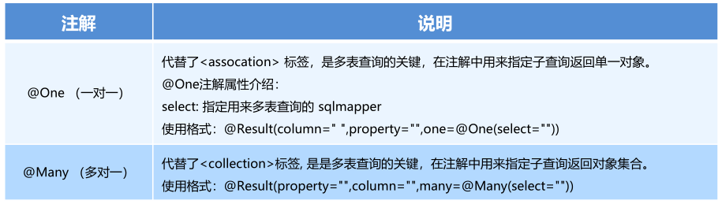

# MyBatis 简介

- MyBatis 是一个优秀的基于 java 的持久层框架，内部封装了 JDBC，使开发者只需要关注 sql 语句本身，而不需要花费精力去处理加载驱动、创建连接、创建 statement 等繁杂的过程
- MyBatis 通过 **xml 或注解的方式**将要执行的各种 statement 配置起来
- MyBatis 通过 **java 对象**和 statement 中 **sql 的动态参数**进行**映射**生成
- MyBatis **解决了实体和数据库映射的问题**，对 JDBC 进行了封装，屏蔽了 JDBC api 底层访问细节

# 开发步骤

- 导入 Mybatis 坐标和其他相关坐标

```xml
<!--mybatis坐标-->
<dependency>
    <groupId>org.mybatis</groupId>
    <artifactId>mybatis</artifactId>
    <version>3.4.5</version>
</dependency>

<!--mysql驱动坐标-->
<dependency>
    <groupId>mysql</groupId>
    <artifactId>mysql-connector-java</artifactId>
    <version>5.1.6</version>
    <scope>runtime</scope>
</dependency>

<!--单元测试坐标-->
<dependency>
    <groupId>junit</groupId>
    <artifactId>junit</artifactId>
    <version>4.12</version>
    <scope>test</scope>
</dependency>

<!--日志坐标-->
<dependency>
    <groupId>log4j</groupId>
    <artifactId>log4j</artifactId>
    <version>1.2.12</version>
</dependency>
```

- 创建`user`数据表
- 编写`User`实体
- **编写`UserMapper.xml`映射文件**：`namespace`、`id`、`resultType`

```xml
<?xml version="1.0" encoding="UTF-8" ?>
<!DOCTYPE mapper PUBLIC "-//mybatis.org//DTD Mapper 3.0//EN" "http://mybatis.org/dtd/mybatis-3-mapper.dtd">
<mapper namespace="userMapper">
    <!--查询操作-->
    <select id="findAll" resultType="com.njk.domain.User">
        select * from user
    </select>
</mapper>
```

- **编写 MyBatis `sqlMapConfig.xml`核心文件**

```xml
<?xml version="1.0" encoding="UTF-8" ?>
<!DOCTYPE configuration PUBLIC "-//mybatis.org//DTD Config 3.0//EN" "http://mybatis.org/dtd/mybatis-3-config.dtd">
<configuration>
    <!--加载properties文件-->
    <properties resource="jdbc.properties"></properties>

    <!--数据源环境-->
    <environments default="development">
        <environment id="development">
            <transactionManager type="JDBC"></transactionManager>
            <dataSource type="POOLED">
                <property name="driver" value="${jdbc.driver}"/>
                <property name="url" value="${jdbc.url}"/>
                <property name="username" value="${jdbc.username}"/>
                <property name="password" value="${jdbc.password}"/>
            </dataSource>
        </environment>
    </environments>

    <!--加载映射文件-->
    <mappers>
        <mapper resource="com/njk/mapper/UserMapper.xml"></mapper>
    </mappers>
</configuration>
```

- 编写测试代码

```java
//加载核心配置文件
InputStream resourceAsStream = Resources.getResourceAsStream("SqlMapConfig.xml");
//获得sqlSession工厂对象
SqlSessionFactory sqlSessionFactory = new SqlSessionFactoryBuilder().build(resourceAsStream);
//获得sqlSession对象
SqlSession sqlSession = sqlSessionFactory.openSession();
//执行sql语句
List<User> userList = sqlSession.selectList("userMapper.findAll");
//打印结果
System.out.println(userList);
//释放资源
sqlSession.close()
```

# MyBatis 映射文件


- 静态 sql 语句：只有普通的 CRUD 操作
- 动态 sql 语句：包含更多功能，如条件判断、遍历等

## if 标签

- 场景举例：多条件组合查询，比如在`id`如果不为空时可以根据`id`查询，如果`username`不为空时还要加入`username`作为条件

```xml
<select id="findByCondition" parameterType="user" resultType="user">
    select * from user
    <where>
        <if test="id!=0">
            and id=#{id}
        </if>
        <if test="username!=null">
            and username=#{username}
        </if>
        <if test="password!=null">
            and password=#{password}
        </if>
    </where>
</select>
```

## foreach 标签

- 场景举例：循环执行 sql 的拼接操作，如`select * from user where id in (1,2,5)`

```xml
<select id="findByIds" parameterType="list" resultType="user">
    select * from user
    <where>
        <foreach collection="list" open="id in(" close=")" item="id" separator=",">
            #{id}
        </foreach>
    </where>
</select>
```

- `<foreach>`标签用于遍历集合，其属性：
  - `collection`：代表要遍历的集合元素（如`list`，`array`等）
  - `open`：代表语句的**开始**部分
  - `close`：代表语句的**结束**部分
  - `item`：代表遍历集合的每个元素，**生成的变量名**
  - `sperator`：代表**分隔符**

## sql 片段抽取标签

- 可将重复的 sql 语句提取出来，使用时用`<include>`引用即可，达到 sql 重用的目的

```xml
<!--抽取sql片段，简化编写-->
<sql id="selectUser">select * from user</sql>

<select id="findById" parameterType="int" resultType="user">
    <include refid="selectUser"></include> where id=#{id}
</select>
```

# MyBatis 的增删查改操作


## 插入操作


- **编写`UserMapper.xml`映射文件**

```xml
<mapper namespace="userMapper">
	<insert id="add" parameterType="com.njk.domain.User">
    	insert into user values(#{id}, #{username}, #{password})
    </insert>
</mapper>
```

-  编写插入实体`User`的代码

```java
InputStream resourceAsStream= Resources.getResourceAsStream("SqlMapConfig.xml");
SqlSessionFactory sqlSessionFactory = new SqlSessionFactoryBuilder().build(resourceAsStream);
SqlSession sqlSession = sqlSessionFactory.openSession();
int insert = sqlSession.insert("userMapper.add", user); // 前面需要先创建想要插入的user对象
// 提交事务
sqlSession.commit();
sqlSession.close();
```

## 修改操作


- **编写`UserMapper.xml`映射文件**

```xml
<mapper namespace="userMapper">
	<update id="update" parameterType="com.njk.domain.User">
    	update user set username=#{username}, password=#{password} where id=#{id}
    </update>
</mapper>
```

-  编写修改实体`User`的代码

```java
InputStream resourceAsStream= Resources.getResourceAsStream("SqlMapConfig.xml");
SqlSessionFactory sqlSessionFactory = new SqlSessionFactoryBuilder().build(resourceAsStream);
SqlSession sqlSession = sqlSessionFactory.openSession();
int update = sqlSession.update("userMapper.update", user); // 前面需要先创建想要修改的user对象
System.out.println(update);
sqlSession.commit();
sqlSession.close();
```

## 删除操作


- **编写`UserMapper.xml`映射文件**

```xml
<mapper namespace="userMapper">
	<delete id="delete" parameterType="java.lang.Integer">
    	delete from user where id=#{id}
    </delete>
</mapper>
```

- 编写删除实体`User`的代码

```java
InputStream resourceAsStream= Resources.getResourceAsStream("SqlMapConfig.xml");
SqlSessionFactory sqlSessionFactory = new SqlSessionFactoryBuilder().build(resourceAsStream);
SqlSession sqlSession = sqlSessionFactory.openSession();
int delete = sqlSession.delete("userMapper.delete",3); // 根据id删除数据
System.out.println(delete);
sqlSession.commit();
sqlSession.close();
```

# Mybatis 核心配置文件


## environment 标签


- 事务管理器`transactionManager`类型有两种
  - `JDBC`：直接使用了 JDBC 的提交和回滚设置，**常用类型**
  - `MANAGED`：该配置几乎没做什么，它从来不提交或回滚一个连接
- 数据源`dataSource`类型有三种
  - `POOLED`：利用“池”的概念将 JDBC 连接对象组织起来，**常用类型**
  - `UNPOOLED`：只是每次被请求时打开和关闭连接，开销大
  - ` JNDI`

## mapper 标签

- **使用相对于类路径的资源引用**

```xml
<mapper resource="org/mybatis/builder/AuthorMapper.xml"/>
```

- 使用完全限定资源定位符（URL）

```xml
<mapper url="file:///var/mappers/AuthorMapper.xml"/>
```

- **使用映射器接口实现类的完全限定类名**

```xml
<mapper class="org.mybatis.builder.AuthorMapper"/>
```

- 将包内的映射器接口实现全部注册为映射器

```xml
<package name="org.mybatis.builder"/>
```

## properties 标签

- 将数据源的配置信息单独抽取成一个`properties`文件，该标签可以加载额外配置的`properties`文件

```xml
<properties resource="jdbc.properties"></properties>
```


## typeAliases 标签

- 定义类型别名，为Java 类型设置一个短的名字

```xml
<typeAliases>
	<typeAlias type="com.njk.domain.User" alias="user"></typeAlias>
</typeAliases>
```


- MyBatis 框架设置好的一些常用的类型别名

| 别名    | 数据类型 |
| ------- | -------- |
| string  | String   |
| long    | Long     |
| int     | Integer  |
| double  | Double   |
| boolean | Boolean  |
| ...     | ...      |

## typeHandlers 标签

- MyBatis 在预处理语句（PreparedStatement）中设置参数或者是从结果集中取值时，类型处理器`TypeHandler`将获取的值以合适的方式转换成 Java 类型
- MyBatis 自带默认的类型处理器（关于基本类型）
- 可以自定义类型处理器，具体做法为：实现`org.apache.ibatis.type.TypeHandler`接口， 或继承一个很便利的类`org.apache.ibatis.type.BaseTypeHandler`，然后可以选择性地将数据映射到一个 JDBC 类型

### 步骤

1. 定义转换类，让其继承`BaseTypeHandler<T>`，这里的泛型是需要转换的 java 类型（举例：java 中的`Date`类型与数据库的`BIGINT`类型之间的转换）
2. 覆盖`4`个未实现的方法，其中`setNonNullParameter`为 java 程序设置数据到数据库的回调方法，`getNullableResult`为查询时 mysql 的字符串类型转换成 java 类型的方法

```java
public class MyDateTypeHandler extends BaseTypeHandler<Date> {
    // 将java类型 转换为 数据库所需类型
    public void setNonNullParameter(PreparedStatement preparedStatement, int i, Date date, JdbcType jdbcType) throws SQLException {
        preparedStatement.setLong(i, date.getTime());
    }
    
    // 将数据库类型 转换为 java类型
    // String参数  要转换的字段名称
    // ResultSet 查询出的结果集
    public Date getNullableResult(ResultSet resultSet, String s) throws SQLException {
        //获得结果集中需要的数据(long) 转换成Date类型 返回
        long aLong = resultSet.getLong(s);
        Date date = new Date(aLong);
        return date;
        // return new Date(resultSet.getLong(s));
    }
    
    // 将数据库类型 转换为 java类型
    public Date getNullableResult(ResultSet resultSet, int i) throws SQLException {
        long aLong = resultSet.getLong(i);
        Date date = new Date(aLong);
        return date;
        // return new Date(resultSet.getLong(i));
    }
    
    // 将数据库类型 转换为 java类型
    public Date getNullableResult(CallableStatement callableStatement, int i) throws SQLException {
        long aLong = callableStatement.getLong(i);
        Date date = new Date(aLong);
        return date;
        // return new Date(callableStatement.getLong(i));
        // return callableStatement.getDate(i);
    }
}
```

3. 在 MyBatis 核心配置文件中进行注册

```xml
<!--注册自定义类型处理器-->
<typeHandlers>
    <typeHandler handler="com.njk.handler.MyDateTypeHandler"></typeHandler>
</typeHandlers>
```

4. 测试

## plugins 标签

- MyBatis 可以使用**第三方的插件**进行功能扩展
- **分页助手**`PageHelper`是将分页的复杂操作进行封装，使用简单的方式即可获得分页的相关数据

### 步骤

1. 导入通用`PageHelper`的坐标

```xml
<!-- 分页助手 -->
<dependency>
    <groupId>com.github.pagehelper</groupId>
    <artifactId>pagehelper</artifactId>
    <version>3.7.5</version>
</dependency>
<dependency>
    <groupId>com.github.jsqlparser</groupId>
    <artifactId>jsqlparser</artifactId>
    <version>0.9.7</version>
</dependency>
```

2. 在 Mybatis 核心配置文件中配置`PageHelper`插件

```xml
<!-- 注意：分页助手的插件 配置在mapper之前 -->
<plugin interceptor="com.github.pagehelper.PageHelper">
    <!-- 指定方言 -->
    <property name="dialect" value="mysql"/>
</plugin>
```

3. 测试分页数据获取

```java
@Test
public void testPageHelper(){
    //设置分页参数
    PageHelper.startPage(1,2);
    List<User> select = userMapper2.select(null);
    for(User user : select){
        System.out.println(user);
    }
}
```

```java
// 获得分页相关的其他参数
PageInfo<User> pageInfo = new PageInfo<User>(select);
System.out.println("总条数：" + pageInfo.getTotal());
System.out.println("总页数：" + pageInfo.getPages());
System.out.println("当前页：" + pageInfo.getPageNum());
System.out.println("每页显示长度：" + pageInfo.getPageSize());
System.out.println("是否第一页：" + pageInfo.isIsFirstPage());
System.out.println("是否最后一页：" + pageInfo.isIsLastPage());
```

# Mybatis 相应 API

- `SqlSession`工厂构建器`SqlSessionFactoryBuilder`
  
  - 常用 API：`SqlSessionFactory build(InputStream inputStream)`
  - 通过加载 Mybatis 的核心文件的输入流的形式构建一个`SqlSessionFactory`对象
- `SqlSession`工厂对象`SqlSessionFactory`
  - `openSession()`：默认开启一个事务，但**事务不会自动提交，需要手动提交该事务**，更新操作数据才会持久化到数据库中
  - `openSession(boolean autoCommit)`：参数为是否自动提交，若设置为`true`，则不需要手动提交事务
- `SqlSession`会话对象
  - 所有执行语句、提交或回滚事务和获取映射器实例的方法
  - 执行语句的方法：
    ```java
    <T> T selectOne(String statement, Object parameter) 
    <E> List<E> selectList(String statement, Object parameter) 
    int insert(String statement, Object parameter) 
    int update(String statement, Object parameter) 
    int delete(String statement, Object parameter)
    ```
  - 操作事务的方法：
    ```java
    void commit()
    void rollback()
    ```

# Mybatis 的 Dao 层实现

- 手动对 Dao 层实现（传统开发）：Dao 接口 + DaoImpl 实现类，不常用
- **代理方式对 Dao 层实现：Dao / Mapper 接口 + xml 配置实现（动态代理），主流常用方式**

## 代理开发方式

- `Mapper`接口开发方法**只需编写`Mapper`接口（相当于`Dao`接口）**，由Mybatis 框架根据接口定义**创建接口的动态代理对象**

```java
UserMapper userMapper = sqlSession.getMapper(UserMapper.class);
```

- `Mapper`接口开发需要**遵循以下规范**：
  1. `Mapper.xml`文件中的`namespace`与`Mapper`接口的全限定名相同
  2. `Mapper`接口方法名和`Mapper.xml`中定义的每个`statement`的`id`相同
  3. `Mapper`接口方法的输入参数类型和`Mapper.xml`中定义的每个`sql`的`parameterType`的类型相同
  4. `Mapper`接口方法的输出参数类型和`Mapper.xml`中定义的每个`sql`的`resultType`的类型相同


## 具体实现

- 编写`UserMapper`接口

```java
public interface UserMapper {
    public List<User> findAll() throws IOException;
    public User findById(int id);
}
```

- 编写`UserMapper.xml`配置文件，类型一一对应

```xml
<mapper namespace="com.itheima.dao.UserMapper">
    <!--查询操作-->
    <select id="findAll" resultType="user">
        select * from user
    </select>
    
    <!--根据id进行查询-->
    <select id="findById" parameterType="int" resultType="user">
        select * from user where id=#{id}
    </select>
</mapper>
```

- 测试代理方式

```java
@Test
public void testProxyDao() throws IOException {
    InputStream resourceAsStream = Resources.getResourceAsStream("sqlMapConfig.xml");
    SqlSessionFactory sqlSessionFactory = new SqlSessionFactoryBuilder().build(resourceAsStream);
    SqlSession sqlSession = sqlSessionFactory.openSession();
    //获得MyBatis框架生成的UserMapper接口的实现类
    UserMapper mapper = sqlSession.getMapper(UserMapper.class);
    List<User> all = mapper.findAll();
    System.out.println(all);

    User user = mapper.findById(1);
    System.out.println(user);
}
```

# MyBatis 的多表查询

## 一对一查询


- 举例 sql 语句

```sql
select * from orders o, user u where o.uid=u.id;
```

- 创建`Order`和`User`实体

```java
public class Order {
    private int id;
    private Date ordertime;
    private double total;
    
    // 代表当前订单从属于哪一个客户
    private User user;
}
```

```java
public class User {
    private int id;
    private String username;
    private String password;
    private Date birthday;
}
```

- 创建`OrderMapper`接口

```java
public interface OrderMapper {
    List<Order> findAll();
}
```

- 配置`OrderMapper.xml`：`<resultMap>`，`<association>`

```xml
<mapper namespace="com.njk.mapper.OrderMapper">
    <resultMap id="orderMap" type="com.njk.domain.Order">
        <result property="id" column="id"></result>
        <result property="ordertime" column="ordertime"></result>
        <result property="total" column="total"></result>
        
        <association property="user" javaType="com.njk.domain.User">
            <result column="uid" property="id"></result>
            <result column="username" property="username"></result>
            <result column="password" property="password"></result>
            <result column="birthday" property="birthday"></result>
        </association>
    </resultMap>
    
    <select id="findAll" resultMap="orderMap">
        select * from orders o,user u where o.uid=u.id
    </select>
</mapper
```

- 测试代码

## 一对多查询


- 举例 sql 语句

```sql
select *, o.id oid from user u left join orders o on u.id=o.uid;
```

- 创建`Order`和`User`实体

```java
public class User {
    private int id;
    private String username;
    private String password;
    private Date birthday;
    
    //代表当前用户具备哪些订单
    private List<Order> orderList;
}
```

- 创建`UserMapper`接口

```java
public interface UserMapper {
    List<User> findAll();
}
```

- 配置`UserMapper.xml`：`<resultMap>`，`<collection>`

```xml
<mapper namespace="com.njk.mapper.UserMapper">
    <resultMap id="userMap" type="com.njk.domain.User">
        <result column="id" property="id"></result>
        <result column="username" property="username"></result>
        <result column="password" property="password"></result>
        <result column="birthday" property="birthday"></result>
        <!--配置集合信息
            property:集合名称
            ofType:当前集合中的数据类型
        -->
        <collection property="orderList" ofType="com.njk.domain.Order">
            <result column="oid" property="id"></result>
            <result column="ordertime" property="ordertime"></result>
            <result column="total" property="total"></result>
        </collection>
    </resultMap>
    
    <select id="findAll" resultMap="userMap">
        select *,o.id oid from user u left join orders o on u.id=o.uid
    </select>
</mapper>
```

- 测试代码

## 多对多查询


- 举例 sql 语句

```sql
select u.*, r.*, r.id rid from user u left join user_role ur on u.id=ur.user_id inner join role r on ur.role_id=r.id;
```

- 创建`Role`和`User`实体

```java
public class User {
    private int id;
    private String username;
    private String password;
    private Date birthday;
    
    //代表当前用户具备哪些订单
    private List<Order> orderList;
    //代表当前用户具备哪些角色
    private List<Role> roleList;
}
```

```java
public class Role {
    private int id;
    private String rolename;
}
```

- 创建`UserMapper`接口

```java
public interface UserMapper {
    List<User> findAllUserAndRole();
}
```

- 配置`UserMapper.xml`：`<resultMap>`，`<collection>`

```xml
<mapper namespace="com.njk.mapper.UserMapper">
    <resultMap id="userRoleMap" type="com.njk.domain.User">
        <result column="id" property="id"></result>
        <result column="username" property="username"></result>
        <result column="password" property="password"></result>
        <result column="birthday" property="birthday"></result>
        <!--配置集合信息
            property:集合名称
            ofType:当前集合中的数据类型
        -->
        <collection property="roleList" ofType="com.njk.domain.Role">
            <result column="rid" property="id"></result>
            <result column="rolename" property="rolename"></result>
        </collection>
    </resultMap>
    
    <select id="findAllUserAndRole" resultMap="userRoleMap">
        select u.*, r.*, r.id rid from user u left join user_role ur on u.id=ur.user_id inner join role r on ur.role_id=r.id
    </select>
</mapper>
```

- 测试代码

# MyBatis 的注解开发

## 常用注解

- `@Insert`：实现新增
- `@Update`：实现更新
- `@Delete`：实现删除
- `@Select`：实现查询
- `@Result`：实现结果集封装
- `@Results`：可以与`@Result`一起使用，封装多个结果集


- `@One`：实现一对一结果集封装
- `@Many`：实现一对多结果集封装



## 核心配置文件

- 修改 MyBatis 的核心配置文件，使用注解替代的映射文件，**所以只需加载使用了注解的`Mapper`接口**即可

```xml
<mappers>
    <!--扫描使用注解的类-->
    <mapper class="com.njk.mapper.UserMapper"></mapper>
</mappers>
```

- 或者**指定扫描包含映射关系的接口所在的包**

```xml
<mappers>
    <!--扫描使用注解的类所在的包-->
    <package name="com.njk.mapper"></package>
</mappers>
```

## 一对一查询


- 举例 sql 语句

```sql
select * from orders;
select * from user where id=查询出订单的uid;
```

- 创建`Order`和`User`实体
- 创建`OrderMapper`接口，注解配置`OrderMapper`

```java
public interface OrderMapper {

    @Select("select * from orders")
    @Results({
            @Result(id = true, column = "id", property = "id"), // 声明主键为id
            @Result(column = "ordertimes", property = "ordertimes"),
            @Result(column = "total", property = "total"),
            @Result(
                    property = "user",
                    column = "uid",
                    javaType = User.class,
                    one = @One(select = "com.njk.mapper.UserMapper.findById")
            )
    })
    public List<Order> findAll();
}
```

```java
public interface UserMapper {
    @Select("select * from user where id=#{id}")
    public User findById(int id);
}
```

- 测试代码

## 一对多查询


- 举例 sql 语句

```sql
select * from user;
select * from orders where uid=查询出用户的id;
```

- 创建`Order`和`User`实体
- 创建`UserMapper`接口，注解配置`UserMapper`

```java
public interface UserMapper {
    @Select("select * from user")
    @Results({
            @Result(id = true, column = "id", property = "id"),
            @Result(column = "username", property = "username"),
            @Result(column = "password", property = "password"),
            @Result(
                    property = "orderList",
                    column = "id",
                    javaType = List.class,
                    many = @Many(select = "com.njk.mapper.OrderMapper.findByUid")
            )
    })
    public List<User> findUserAndOrderAll();
}
```

```java
public interface OrderMapper {
    @Select("select * from orders where uid=#{uid}")
    public List<Order> findByUid(int uid);
}
```

- 测试代码

## 多对多查询


- 举例 sql 语句

```sql
select * from user;
select * from user_role ur, role r where ur.role_id=r.id and ur.user_id=用户的id
```

- 创建`Role`和`User`实体
- 创建`UserMapper`接口，注解配置`UserMapper`

```java
public interface UserMapper {
    
    @Select("select * from user")
    @Results({
            @Result(id = true, column = "id", property = "id"),
            @Result(column = "username", property = "username"),
            @Result(column = "password", property = "password"),
            @Result(
                    property = "roleList",
                    column = "id",
                    javaType = List.class,
                    many = @Many(select = "com.njk.mapper.RoleMapper.findByUid")
            )
    })
    public List<User> findUserAndRoleAll();
}
```

```java
public interface RoleMapper {
    @Select("select * from user_role ur, role r where ur.role_id=r.id and ur.user_id=#{uid}")
    public List<Role> findByUid(int uid);
}
```

- 测试代码
