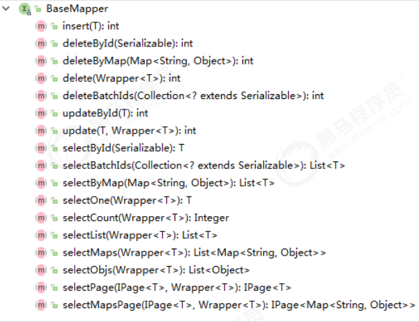
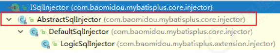
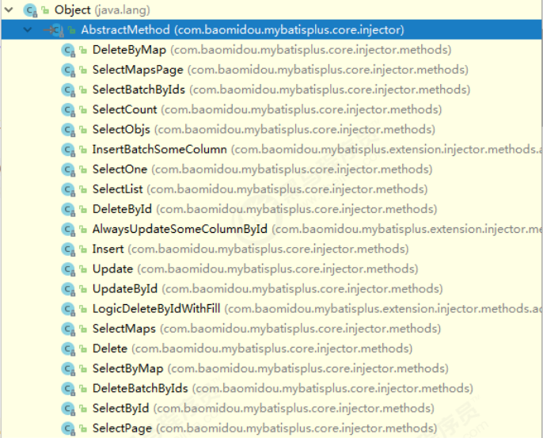

# 插入操作

- 方法定义

```java
/**
* 插入一条记录
*
* @param entity 实体对象
*/
int insert(T entity);
```

## 设置 id 的生成策略

- 指定 id 类型为自增长
  - `IdType`是 MyBatisPlus 的**生成ID类型枚举类**

```java
@Data
@NoArgsConstructor
@AllArgsConstructor
@TableName("tb_user")
public class User {
    @TableId(type = IdType.AUTO) //指定id类型为自增长
    private Long id;
    //...
}
```

## @TableField

- 在 MP 中通过`@TableField`注解可以指定字段的一些属性，例如：
  1. 对象中的属性名和字段名不一致的问题（非驼峰）
  2. 对象中的属性字段在表中不存在的问题
  3. 指定某字段为不加入查询字段

```java
@TableField(value = "email") //指定数据表中字段名
private String mail;
```

```java
@TableField(exist = false)
private String address; //在数据库表中是不存在的
```

```java
@TableField(select = false) //查询时不返回该字段的值
private String password;
```

# 更新操作

## 根据 id 更新

- 方法定义

```java
/**
* 根据 ID 修改
*
* @param entity 实体对象
*/
int updateById(@Param(Constants.ENTITY) T entity);
```

- 测试用例

```java
@RunWith(SpringRunner.class)
@SpringBootTest
public class UserMapperTest {
    @Autowired
    private UserMapper userMapper;
    @Test
    public void testUpdateById() {
        User user = new User();
        user.setId(6L); //主键
        user.setAge(21); //更新的字段
        //根据id更新，更新不为null的字段
        this.userMapper.updateById(user);
    }
}
```

## 根据条件更新

- 方法定义

```java
/**
* 根据 whereEntity 条件，更新记录
*
* @param entity        实体对象 (set 条件值,可以为 null)
* @param updateWrapper 实体对象封装操作类（可以为 null,里面的 entity 用于生成 where 语句）
*/
int update(@Param(Constants.ENTITY) T entity, @Param(Constants.WRAPPER) Wrapper<T> updateWrapper)
```

- 测试用例：`QueryWrapper`

```java
@RunWith(SpringRunner.class)
@SpringBootTest
public class UserMapperTest {
    @Autowired
    private UserMapper userMapper;
    @Test
    public void testUpdate() {
        User user = new User();
        user.setAge(22); //更新的字段
        //更新的条件
        QueryWrapper<User> wrapper = new QueryWrapper<>();
        wrapper.eq("id", 6);
        //执行更新操作
        int result = this.userMapper.update(user, wrapper);
        System.out.println("result = " + result);
    }
}
```

- 测试用例：`UpdateWrapper`

```java
@Test
public void testUpdate() {
    //更新的条件以及字段
    UpdateWrapper<User> wrapper = new UpdateWrapper<>();
    wrapper.eq("id", 6).set("age", 23);
    //执行更新操作
    int result = this.userMapper.update(null, wrapper);
    System.out.println("result = " + result);
}
```

# 删除操作

## deleteById

- 方法定义

```java
/**
 * 根据 ID 删除
 *
 * @param id 主键ID
 */
int deleteById(Serializable id);
```

- 测试用例

```java
@Test
public void testDeleteById() {
    //执行删除操作
    int result = this.userMapper.deleteById(6L);
    System.out.println("result = " + result);
}
```

## deleteByMap

- 方法定义

```java
/**
* 根据 columnMap 条件，删除记录
*
* @param columnMap 表字段 map 对象
*/
int deleteByMap(@Param(Constants.COLUMN_MAP) Map<String, Object> columnMap);
```

- 测试用例

```java
@Test
public void testDeleteByMap() {
    Map<String, Object> columnMap = new HashMap<>();
    columnMap.put("age",20);
    columnMap.put("name","张三");
    //将columnMap中的元素设置为删除的条件，多个之间为and关系
    int result = this.userMapper.deleteByMap(columnMap);
    System.out.println("result = " + result);
}
```

## delete

- 方法定义

```java
/**
 * 根据 entity 条件，删除记录
 *
 * @param wrapper 实体对象封装操作类（可以为 null）
 */
int delete(@Param(Constants.WRAPPER) Wrapper<T> wrapper);
```

- 测试用例

```java
@Test
public void testDeleteByMap() {
    User user = new User();
    user.setAge(20);
    user.setName("张三");
    //将实体对象进行包装，包装为操作条件
    QueryWrapper<User> wrapper = new QueryWrapper<>(user);
    int result = this.userMapper.delete(wrapper);
    System.out.println("result = " + result);
}
```

## deleteBatchIds

- 方法定义

```java
/**
* 删除（根据ID 批量删除）
*
* @param idList 主键ID列表(不能为 null 以及 empty)
*/
int deleteBatchIds(@Param(Constants.COLLECTION) Collection<? extends Serializable> idList);
```

- 测试用例

```java
@Test
public void testDeleteByMap() {
    //根据id集合批量删除
    int result = this.userMapper.deleteBatchIds(Arrays.asList(1L,10L,20L));
    System.out.println("result = " + result);
}
```

# 查询操作

- MP 提供了多种查询操作，包括根据 id 查询、批量查询、查询单条数据、查询列表、分页查询等操作

## selectById

- 方法定义

```java
/**
* 根据 ID 查询
*
* @param id 主键ID
*/
T selectById(Serializable id);
```

- 测试用例

```java
@Test
public void testSelectById() {
    //根据id查询数据
    User user = this.userMapper.selectById(2L);
    System.out.println("result = " + user);
}
```

## selectBatchIds

- 方法定义

```java
/**
 * 查询（根据ID 批量查询）
 *
 * @param idList 主键ID列表(不能为 null 以及 empty)
 */
List<T> selectBatchIds(@Param(Constants.COLLECTION) Collection<? extends Serializable> idList);
```

- 测试用例

```java
@Test
public void testSelectBatchIds() {
    //根据id集合批量查询
    List<User> users = this.userMapper.selectBatchIds(Arrays.asList(2L, 3L, 10L));
    for (User user : users) {
        System.out.println(user);
    }
}
```

## selectOne

- 方法定义

```java
/**
 * 根据 entity 条件，查询一条记录
 *
 * @param queryWrapper 实体对象封装操作类（可以为 null）
 */
T selectOne(@Param(Constants.WRAPPER) Wrapper<T> queryWrapper);
```

- 测试用例

```java
@Test
public void testSelectOne() {
    QueryWrapper<User> wrapper = new QueryWrapper<User>();
    wrapper.eq("name", "李四");
    //根据条件查询一条数据，如果结果超过一条会报错
    User user = this.userMapper.selectOne(wrapper);
    System.out.println(user);
}
```

## selectCount

- 方法定义

```java
/**
 * 根据 Wrapper 条件，查询总记录数
 *
 * @param queryWrapper 实体对象封装操作类（可以为 null）
 */
Integer selectCount(@Param(Constants.WRAPPER) Wrapper<T> queryWrapper);
```

- 测试用例

```java
@Test
public void testSelectCount() {
    QueryWrapper<User> wrapper = new QueryWrapper<User>();
    wrapper.gt("age", 23); //年龄大于23岁
    //根据条件查询数据条数
    Integer count = this.userMapper.selectCount(wrapper);
    System.out.println("count = " + count);
}
```

## selectList

- 方法定义

```java
/**
 * 根据 entity 条件，查询全部记录
 *
 * @param queryWrapper 实体对象封装操作类（可以为 null）
 */
List<T> selectList(@Param(Constants.WRAPPER) Wrapper<T> queryWrapper);
```

- 测试用例

```java
@Test
public void testSelectList() {
    QueryWrapper<User> wrapper = new QueryWrapper<User>();
    wrapper.gt("age", 23); //年龄大于23岁
    //根据条件查询数据
    List<User> users = this.userMapper.selectList(wrapper);
    for (User user : users) {
        System.out.println("user = " + user);
    }
}
```

## selectPage

- 方法定义

```java
/**
 * 根据 entity 条件，查询全部记录（并翻页）
 *
 * @param page         分页查询条件（可以为 RowBounds.DEFAULT）
 * @param queryWrapper 实体对象封装操作类（可以为 null）
 */
IPage<T> selectPage(IPage<T> page, @Param(Constants.WRAPPER) Wrapper<T> queryWrapper);
```

- 配置分页插件

```java
@Configuration
@MapperScan("com.njk.mp.mapper") //设置mapper接口的扫描包
public class MybatisPlusConfig {
    /**
     * 分页插件
     */
    @Bean
    public PaginationInterceptor paginationInterceptor() {
        return new PaginationInterceptor();
    }
}
```

- 测试用例

```java
@Test
    public void testSelectPage() {
        QueryWrapper<User> wrapper = new QueryWrapper<User>();
        wrapper.gt("age", 20); //年龄大于20岁
        Page<User> page = new Page<>(1,1); // 查询第一页数据，查询一条数据
        //根据条件查询数据
        IPage<User> iPage = this.userMapper.selectPage(page, wrapper);
        System.out.println("数据总条数：" + iPage.getTotal());
        System.out.println("总页数：" + iPage.getPages());
        List<User> users = iPage.getRecords();
        for (User user : users) {
            System.out.println("user = " + user);
        }
    }
```

# SQL 注入的原理

1. MP 在启动后会将`BaseMapper`中的一系列的方法注册到`mappedStatements`中
2. 在MP中，`ISqlInjector`负责SQL的注入工作，它是一个接口，`AbstractSqlInjector`是它的实现类



3. 在`AbstractSqlInjector`中，主要是由`inspectInject()`方法进行注入的
   - 在实现方法中，`methodList.forEach(m -> m.inject(builderAssistant, mapperClass, modelClass, tableInfo));`是关键，循环遍历方法，进行注入
4. 最终调用抽象方法`injectMappedStatement`进行真正的注入

```java
/**
 * 注入自定义 MappedStatement
 *
 * @param mapperClass mapper 接口
 * @param modelClass  mapper 泛型
 * @param tableInfo   数据库表反射信息
 * @return MappedStatement
 */
public abstract MappedStatement injectMappedStatement(Class<?> mapperClass, Class<?> modelClass, TableInfo tableInfo);
```

- 该方法的实现`AbstractMethod`

