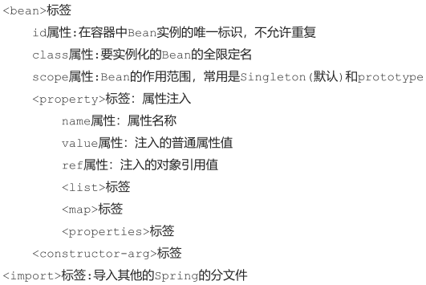
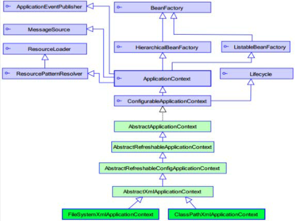
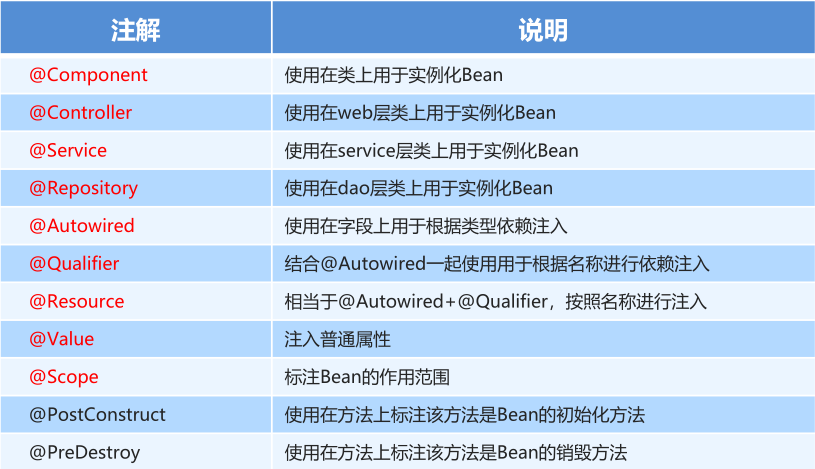
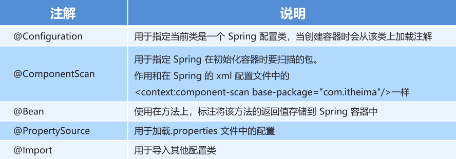

# Spring 要点
# Spring 程序开发基本步骤

## 导入 Spring 开发的基本包坐标

```xml
<properties>
	<spring.version>5.0.5.RELEASE</spring.version>
</properties>

<dependencies>
    <!--导入spring的context坐标, context依赖core、beans、expression-->
	<dependency>
        <groupId>org.springframework</groupId>
        <artifactId>spring-context</artifactId>
        <version>${spring.version}</version>
    </dependency>
</dependencies>
```

## 编写 Dao 接口和实现类

```java
public interface UserDao {
    public void method();
}
```

```java
public class UserDaoImpl implements UserDao {
    @Override
    public void method() {...}
}
```

## 创建 Spring 核心配置文件

- 在类路径下（**resources**）创建`applicationContext.xml`配置文件

```xml
<?xml version="1.0" encoding="UTF-8" ?>
<beans xmlns="http://www.springframework.org/schema/beans"
       xmlns:xsi="http://www.w3.org/2001/XMLSchema-instance"
       xsi:schemaLocation="
			http://www.springframework.org/schema/beans 
			http://www.springframework.org/schema/beans/spring-beans.xsd">
</beans>
```

## 在 Spring 配置文件中配置 UserDaoImpl

```xml
<?xml version="1.0" encoding="UTF-8" ?>
<beans xmlns="http://www.springframework.org/schema/beans"
       xmlns:xsi="http://www.w3.org/2001/XMLSchema-instance"
       xsi:schemaLocation="
			http://www.springframework.org/schema/beans 
			http://www.springframework.org/schema/beans/spring-beans.xsd">
    <bean id="userDao" class="xxx.xxx.dao.impl.UserDaoImpl(即全类名)"></bean>
</beans>
```

## 使用 Spring 的 API 获得 Bean 实例

```java
@Test
public void test() {
    ApplicationContext applicationContext = new ClassPathXmlApplicationContext("applicationContext.xml");
    UserDao userDao = (UserDao) applicationContext.getBean("userDao"); 
    // getBean方法的返回类型W为Object, 故需要强制转换; 
    // getBean方法的参数为Spring配置文件中的bean id
}
```

# Spring 配置文件



## Bean 标签基本配置

- 用于配置对象交由 Spring 来创建
- 默认情况下它调用的是**类中的无参构造器**，如果没有无参构造器则不能创建成功
- `id`：Bean 实例在 Spring 容器中的唯一标识
- `class`：Bean 的全限定名称/全类名

## Bean 标签范围配置

- `scope`：指对象的作用范围，取值如下：
  - `singleton`：默认值，单例的
  - `prototype`：多例的
- 当`scope`的取值为`singleton`时
  - Bean 的实例化个数：1个
  - Bean 的实例化时机：当 Spring 核心文件被加载时，实例化 Bean
  - Bean 的生命周期
    - **对象创建：当应用加载，创建容器时，对象就被创建了**
    - **对象运行：只要容器在，对象一直活着**
    - **对象销毁：当应用卸载，销毁容器时，对象就被销毁了**
- 当`scope`的取值为`prototype`时
  - Bean 的实例化个数：多个
  - Bean 的实例化时机：当调用`getBean()`方法时实例化 Bean
  - Bean 的生命周期
    - **对象创建：当使用对象时，创建新的对象实例**
    - **对象运行：只要对象在使用中，就一直活着**
    - **对象销毁：当对象长时间不用时，被 Java 的垃圾回收器GC回收了**

## Bean 生命周期配置

- `init-method`：指定类中的初始化方法名称，实例化 Bean 之后调用该方法
- `destroy-method`：指定类中销毁方法名称，销毁 Bean 之前调用该方法

## 引入其他配置文件

- Spring 主配置文件通过`<import>`标签进行加载其他配置文件，分模块开发

  ```xml
  <import resource="applicationContext-xxx.xml"/>
  ```

# Bean 实例化的三种方式

## 无参构造方法实例化

- 根据**默认无参构造方法**来创建类对象，如果 bean 中没有默认无参构造函数，将会创建失败

```xml
<bean id="userDao" class="com.itheima.dao.impl.UserDaoImpl"/>
```

## 工厂静态方法实例化

- 工厂的静态方法返回 Bean 实例

```java
public class StaticFactoryBean {
    public static UserDao createUserDao() {
        return new UserDaoImpl();
    }
}
```

```xml
<bean id="userDao" class="xxx.xxx.factory.StaticFactoryBean" 
factory-method="createUserDao" />
```

## 工厂实例方法实例化

- 工厂的非静态方法返回 Bean 实例

```java
public class DynamicFatoryBean {
    public UserDao createUserDao() {
        return new UserDaoImpl();
    }
}
```

```xml
<bean id="factoryBean" class="xxx.xxx.factory.DynamicFatoryBean"/>
<bean id="userDao" factory-bean="factoryBean" factory-method="createUserDao"/>
```

# Bean 的依赖注入

- 依赖注入（Dependency Injection），Spring 框架核心 IOC（Inverse Of Control，控制反转） 的具体实现
- 在编写程序时，通过控制反转，把对象的创建交给了 Spring，IOC 解耦只是降低他们（业务层和持久层）的依赖关系
- 业务层和持久层的依赖关系让 Spring 来维护，坐等框架把持久层对象传入业务层，而不用自己去获取

## Bean 的依赖注入方式

### set 方法注入

- 在`UserServiceImpl`中添加`setUserDao`方法

  ```java
  public class UserServiceImpl implements UserService {
      // 定义userDao对象
      private UserDao userDao;
      public void setUserDao(UserDao userDao) {
          this.userDao = userDao;
      }
      @Override
      public void method() {
          userDao.method();
      }
  }
  ```

- 配置 Spring 容器调用`set`方法进行注入

  ```xml
  <bean id="userDao" class="xxx.xxx.dao.impl.UserDaoImpl"/>
  
  <!-- name 指的是UserServiceImpl定义的userDao对象 -->
  <!-- ref 指的是配置文件定义的bean id -->
  <bean id="userService" class="xxx.xxx.service.impl.UserServiceImpl">
      <property name="userDao" ref="userDao"/>
  </bean>
  ```

- **P 命名空间注入**本质也是`set`方法注入，具体做法如下：先引入 P 命名空间，再修改注入方式

  ```xml
  xmlns:p="http://www.springframework.org/schema/p"
  ```

  ```xml
  <bean id="userService" class="xxx.xxx.service.impl.UserServiceImpl" p:userDao-
  ref="userDao"/>
  ```

### 构造方法注入

- 创建有参构造

  ```java
  public class UserServiceImpl implements UserService {
      @Override
      public void method() {
          ApplicationContext applicationContext = new ClassPathXmlApplicationContext("applicationContext.xml");
          UserDao userDao = (UserDao) applicationContext.getBean("userDao");
          userDao.method();
      }
  }
  ```

- 配置 Spring 容器调用有参构造时进行注入

  ```xml
  <bean id="userDao" class="xxx.xxx.dao.impl.UserDaoImpl"/>
  <bean id="userService" class="xxx.xxx.service.impl.UserServiceImpl">
      <constructor-arg name="userDao" ref="userDao"></constructor-arg>
  </bean>
  ```

## Bean 的依赖注入的数据类型

以`set`方法注入为例，在`<bean>`标签下添加`<property>`标签，进行注入

- 普通数据类型
- 引用数据类型
- 集合数据类型：`List`、`Map`、`Properties`等

# Spring 相关 API

## ApplicationContext 的继承体系

- 接口类型，代表应用上下文，可以通过其实例获得 Spring 容器中的 Bean 对象



## ApplicationContext 的实现类

- `ClassPathXmlApplicationContext`：从类的根路径下加载配置文件**（推荐使用）**
- `FileSystemXmlApplicationContext`：从磁盘路径上加载配置文件，配置文件可以在磁盘的任意位置
- `AnnotationConfigApplicationContext`：当使用注解配置容器对象时，需要使用此类来创建 spring 容器，它用来读取注解

## getBean() 方法使用

- `getBean(String name)`：参数的数据类型是字符串，根据 Bean 的`id`从容器中获得 Bean 实例，返回是`Object`，需要强转
- `getBean(Class<T> requiredType)`：参数的数据类型是Class类型，根据类型从容器中匹配 Bean 实例，**当容器中相同类型的 Bean 有多个时，此方法会报错**
  - `UserService userService = applicationContext.getBean(UserService.class);`

# Spring 配置数据源

- DataSource 的创建由 Spring 容器完成
- DataSource 有无参构造方法，而 Spring 默认就是通过无参构造方法实例化对象的

## 抽取 jdbc 配置文件

- `applicationContext.xml`加载`jdbc.properties`配置文件获得连接信息
- 首先需要引入`context`命名空间和约束路径

```xml
<!-- 命名空间 -->
xmlns:context="http://www.springframework.org/schema/context"
<!-- 约束路径 -->
http://www.springframework.org/schema/context
http://www.springframework.org/schema/context/spring-context.xsd

<context:property-placeholder location="classpath:jdbc.properties"/>

<!-- c3p0数据库 -->
<bean id="dataSource" class="com.mchange.v2.c3p0.ComboPooledDataSource">
    <!-- property 与 所用数据库的set方法一一对应 -->
    <property name="driverClass" value="${jdbc.driver}"/>
    <property name="jdbcUrl" value="${jdbc.url}"/>
    <property name="user" value="${jdbc.username}"/>
    <property name="password" value="${jdbc.password}"/>
</bean>
```

# Spring 注解开发

- 注解代替`xml`配置，简化配置，提高开发效率

## Spring 原始注解



- Spring 原始注解主要是替代`<bean>`的配置

- 进行注解开发时，需要在`applicationContext.xml`中配置组件扫描，作用是指定哪个包及其子包下的 Bean 需要进行扫描注解配置

  ```xml
  <!--注解的组件扫描-->
  <context:component-scan base-package="xxx.xxx"></context:component-scan>
  ```

- 使用`@Component`或`@Repository`标识`UserDaoImpl`需要 Spring 进行实例化

  ```java
  //@Component("userDao")
  @Repository("userDao")
  public class UserDaoImpl implements UserDao {
      @Override
      public void method() {...}
  }
  ```

- 使用`@Compont`或`@Service`标识`UserServiceImpl`需要 Spring 进行实例化

- 使用`@Autowired`或者`@Autowired`+`@Qulifier`或者`@Resource`进行`userDao`的注入

  - 注解配置，可以不写`set`方法，因为注解配置通过反射

  ```java
  //@Component("userService")
  @Service("userService")
  public class UserServiceImpl implements UserService {
      /*@Autowired
      @Qualifier("userDao")*/
      @Resource(name="userDao")
      private UserDao userDao;
      @Override
      public void method() {
          userDao.method();
      }
  }
  ```

-  使用`@Value`进行字符串的注入

  ```java
  @Repository("userDao")
  public class UserDaoImpl implements UserDao {
      @Value(" 注入普通数据")
      private String str;
      @Value("${jdbc.driver}")
      private String driver;
      @Override
      public void method() {
          System.out.println(str);
          System.out.println(driver);
      }
  }
  ```

- 使用`@Scope`标注 Bean 的范围

  ```java
  //@Scope("prototype")
  @Scope("singleton")
  public class UserDaoImpl implements UserDao {
      ...
  }
  ```

- 使用`@PostConstruct`标注初始化方法，使用`@PreDestroy`标注销毁方法

  ```java
  @PostConstruct
  public void init() {...}
  @PreDestroy
  public void destroy() {...}
  ```

## Spring 新注解



- 原始注解还不能全部替代`xml`配置文件，还需要使用注解替代的配置如下

  - 非自定义的Bean的配置：`<bean>`
  - 加载`properties`文件的配置：`<context:property-placeholder>`
  - 组件扫描的配置：`<context:component-scan>`
  - 引入其他文件：`<import>`

- `@Configuration`、`@ComponentScan`、`@Import`

  ```java
  @Configuration
  @ComponentScan("xxx.xxx")
  @Import({DataSourceConfiguration.class}) // 数据源的配置文件, 分模块配置
  public class SpringConfiguration {
      ...
  }
  ```

- `@PropertySource`、`@Value`

  ```java
  @PropertySource("classpath:jdbc.properties")
  public class DataSourceConfiguration {
      @Value("${jdbc.driver}")
      private String driver;
      @Value("${jdbc.url}")
      private String url;
      @Value("${jdbc.username}")
      private String username;
      @Value("${jdbc.password}")
      private String password;
  	...
  }
  ```

- `@Bean`，自定义方法，并返回想要实例化的 Bean 类型

  ```java
  @Bean(name="dataSource")
  public DataSource getDataSource() throws PropertyVetoException {
      ComboPooledDataSource dataSource = new ComboPooledDataSource();
      dataSource.setDriverClass(driver);
      dataSource.setJdbcUrl(url);
      dataSource.setUser(username);
      dataSource.setPassword(password);
      return dataSource;
  }
  ```

## 加载核心配置类创建 Spring 容器

- `AnnotationConfigApplicationContext`：当使用注解配置容器对象时，需要使用此类来创建 spring 容器，它用来读取注解

```java

ApplicationContext applicationContext = new AnnotationConfigApplicationContext(SpringConfiguration.class);
```

# Spring 集成 Junit

- 简化`Junit`测试代码
- 让`SpringJunit`负责创建 Spring 容器，但需要将配置文件的名称告诉它
- 将需要进行测试的 Bean 直接在测试类中进行注入

1. 导入 Spring 集成 Junit 的坐标

```xml
<!--此处需要注意的是，spring5 及以上版本要求 junit 的版本必须是 4.12 及以上-->
<dependency>
    <groupId>org.springframework</groupId>
    <artifactId>spring-test</artifactId>
    <version>5.0.2.RELEASE</version>
</dependency>
<dependency>
    <groupId>junit</groupId>
    <artifactId>junit</artifactId>
    <version>4.12</version>
    <scope>test</scope>
</dependency>
```

2. 使用`@Runwith`注解替换原来的运行期
3. 使用`@ContextConfiguration`指定配置文件或配置类
4. 使用`@Autowired`注入需要测试的对象

```java
@RunWith(SpringJUnit4ClassRunner.class)
//加载spring核心配置文件
//@ContextConfiguration({"classpath:applicationContext.xml"})
// 加载spring核心配置类
@ContextConfiguration(classes = {SpringConfiguration.class})
public class SpringJunitTest {
    @Autowired
    private UserService userService;
    @Test
    public void testUserService() {...}
}
```


