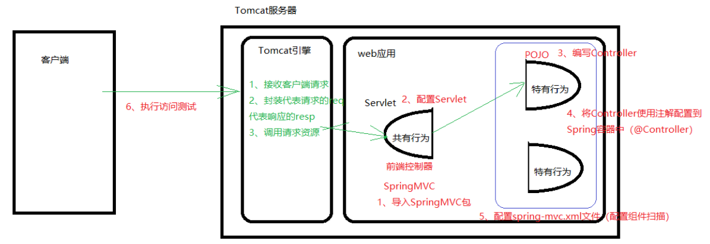
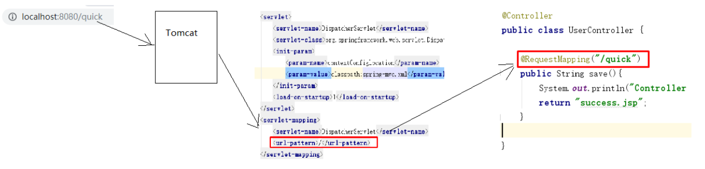
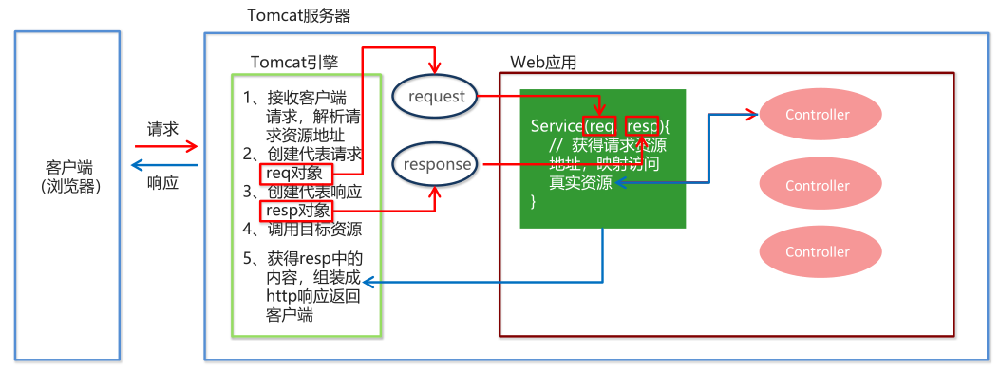
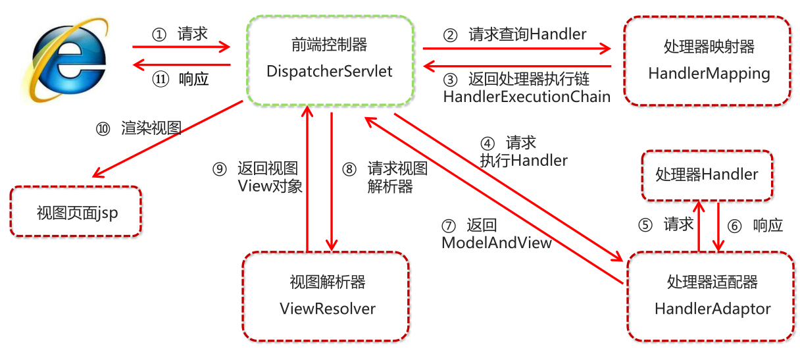
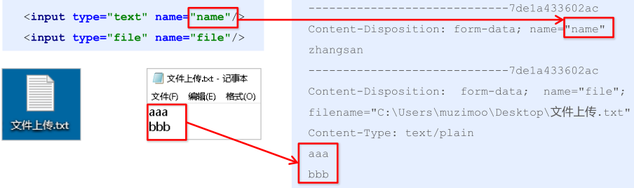

# 基本介绍

- SpringMVC 是一种基于 Java 的实现 MVC 设计模型的请求驱动类型的轻量级 Web 框架，属于SpringFrameWork 的后续产品，已经融合在 Spring Web Flow 中

# 开发基本步骤



## 导入 SpringMVC 相关坐标

- 导入 Spring 和 SpringMVC 的坐标

  ```xml
  <!--Spring坐标-->
  <dependency>
      <groupId>org.springframework</groupId>
      <artifactId>spring-context</artifactId>
      <version>5.0.5.RELEASE</version>
  </dependency>
  <!--SpringMVC坐标-->
  <dependency>
      <groupId>org.springframework</groupId>
      <artifactId>spring-webmvc</artifactId>
      <version>5.0.5.RELEASE</version>
  </dependency>
  ```

- 导入 Servlet 和 Jsp 的坐标

  ```xml
  <!--Servlet坐标-->
  <dependency>
      <groupId>javax.servlet</groupId>
      <artifactId>servlet-api</artifactId>
      <version>2.5</version>
  </dependency>
  <!--Jsp坐标-->
  <dependency>
      <groupId>javax.servlet.jsp</groupId>
      <artifactId>jsp-api</artifactId>
      <version>2.0</version>
  </dependency>
  ```

## 配置 SpringMVC 核心控制器 DispatcherServlet

```xml
<servlet>
	<servlet-name>DispatcherServlet</servlet-name>
    <servlet-class>org.springframework.web.servlet.DispatcherServlet</servlet-class>
    <init-param>
    	<param-name>contextConfigLocation</param-name>
        <param-value>classpath:spring-mvc.xml</param-value>
    </init-param>
    <load-on-startup>1</load-on-startup>
</servlet>
<servlet-mapping>
	<servlet-name>DispatcherServlet</servlet-name>
    <url-pattern>/</url-pattern>
</servlet-mapping>
```

## 创建 Controller 和视图页面

- 创建`Controller`和业务方法

  ```java
  public class UserController {
      public String quickMethod() {
          ...
          return "index.jsp"; // 跳转的视图页面
      }
  }
  ```

- 创建视图页面`index.jsp`

  ```jsp
  <!-- index.jsp -->
  <html>
      <body>
          ...
      </body>
  </html>
  ```

## 使用注解配置 Controller 类中业务方法的映射地址

```java
@Controller
//@RequestMapping("user") // 映射地址: http://localhost:8080/user/... , 相当于加了一个映射地址的父目录
public class UserController {
    // 映射地址: http://localhost:8080/quick
    // 如果添加了映射地址的父目录, 映射地址: http://localhost:8080/user/quick
    @RequestMapping("/quick")
    public String quickMethod() {
        ...
        return "index.jsp"; // 跳转的视图页面
        // 如果添加了映射地址的父目录, 跳转页面的资源路径要加 / -> return "/index.jsp"
    }
}
```

## 配置 SpringMVC 核心文件 spring-mvc.xml

```xml
<beans xmlns="http://www.springframework.org/schema/beans"
       xmlns:mvc="http://www.springframework.org/schema/mvc"
       xmlns:context="http://www.springframework.org/schema/context"
       xmlns:xsi="http://www.w3.org/2001/XMLSchema-instance"
       xsi:schemaLocation="http://www.springframework.org/schema/beans
                           http://www.springframework.org/schema/beans/spring-beans.xsd
                           http://www.springframework.org/schema/mvc
                           http://www.springframework.org/schema/mvc/spring-mvc.xsd
                           http://www.springframework.org/schema/context
                           http://www.springframework.org/schema/context/spring-context.xsd">
	<!--配置注解扫描-->
	<context:component-scan base-package="xxx.xxx.controller"/>
</beans>
```

# SpringMVC 流程图示





# SpringMVC 组件解析

## SpringMVC 的执行流程



1. 用户发送请求至前端控制器`DispatcherServlet`
2. `DispatcherServlet`收到请求调用`HandlerMapping`处理器映射器
3. 处理器映射器找到具体的处理器（可以根据 xml 配置、注解进行查找），生成处理器对象及处理器拦截器（如果有则生成）一并返回给`DispatcherServlet`
4. `DispatcherServlet`调用`HandlerAdapter`处理器适配器
5. `HandlerAdapter`经过适配调用具体的处理器（`Controller`，也叫后端控制器）
6. `Controller`执行完成返回`ModelAndView`
7. `HandlerAdapter`将`Controller`执行结果`ModelAndView`返回`DispatcherServlet`
8. `DispatcherServlet`将`ModelAndView`传给`ViewReslover`视图解析器
9. `ViewReslover`解析后返回具体`View`
10. `DispatcherServlet`根据`View`进行渲染视图（即将模型数据填充至视图中）
11. `DispatcherServlet`响应用户

## SpringMVC 组件解析

1. 前端控制器：`DispatcherServlet`
   - 用户请求到达前端控制器，它就相当于 MVC 模式中的 C
   - `DispatcherServlet`是整个流程控制的中心，由它调用其它组件处理用户的请求
   - `DispatcherServlet`的存在降低了组件之间的耦合性
2. 处理器映射器：`HandlerMapping`
   - `HandlerMapping`负责根据用户请求找到`Handler`即处理器
   - SpringMVC 提供了不同的映射器实现不同的映射方式，例如：配置文件方式，实现接口方式，注解方式等
3. 处理器适配器：`HandlerAdapter`
   - 通过`HandlerAdapter`对处理器进行执行，这是适配器模式的应用
   - 通过扩展适配器可以对更多类型的处理器进行执行
4. 处理器：`Handler`
   - 开发中要编写的具体业务控制器
   - 由`DispatcherServlet`把用户请求转发到`Handler`；由`Handler`对具体的用户请求进行处理
5. 视图解析器：`View Resolver`
   - `View Resolver`负责将处理结果生成`View`视图
   - `View Resolver`首先根据逻辑视图名解析成物理视图名，即具体的页面地址
   - 再生成`View`视图对象，最后对`View`进行渲染将处理结果通过页面展示给用户
6. 视图：`View`
   - SpringMVC 框架提供了很多的`View`视图类型的支持，包括：`jstlView`、`freemarkerView`、`pdfView`等
   - 最常用的视图就是`jsp`

## SpringMVC 注解解析

### @RequestMapping

- 作用：用于建立请求 URL 和处理请求方法之间的对应关系
- 位置：
  - **类上**，请求URL 的第一级访问目录。此处不写的话，就相当于应用的根目录
  - **方法上**，请求 URL 的第二级访问目录，与类上的使用`@ReqquestMapping`标注的一级目录一起组成访问虚拟路径
- 属性：
  - `value`：用于指定请求的 URL，它和`path`属性的作用是一样的
  -  `method`：用于指定请求的方式
  - `params`：用于指定限制请求参数的条件，要求请求参数的`key`和`value`必须和配置的一模一样，例如：
    - `params = {"accountName"}`，表示请求参数必须有`accountName`
    - `params = {"money!=100"}`，表示请求参数中`money`不能是`100`

### mvc命名空间引入

```xml
<!-- 命名空间 -->
xmlns:context="http://www.springframework.org/schema/context"
xmlns:mvc="http://www.springframework.org/schema/mvc"
<!-- 约束空间 -->
http://www.springframework.org/schema/context
http://www.springframework.org/schema/context/spring-context.xsd
http://www.springframework.org/schema/mvc 
http://www.springframework.org/schema/mvc/spring-mvc.xsd
```

### 组件扫描

- SpringMVC 基于 Spring 容器，因此在进行 SpringMVC 操作时，需要将`Controller`存储到 Spring 容器中
- 如果使用`@Controller`注解标注的话，就需要使用`<context:component-scan base-package=“xxx.xxx.controller"/>`进行组件扫描
- `<context:component>`还可以添加参数`<include-filter>`和`<exclude-filter>`，来指定组件扫描的范围

## SpringMVC 的 XML 配置解析

- SpringMVC 有默认组件配置，默认组件都是`DispatcherServlet.properties`配置文件中配置的，该配置文件地址`org/springframework/web/servlet/DispatcherServlet.properties`
- 实际开发中可以重写默认组件的配置

### 视图解析器

`org.springframework.web.servlet.ViewResolver=org.springframework.web.servlet.view.InternalResourceViewResolver`

- 源码：视图解析器的默认配置为

  ```xml
  REDIRECT_URL_PREFIX = "redirect:"  <!-- 重定向前缀 -->
  FORWARD_URL_PREFIX = "forward:"    <!-- 转发前缀（默认值）-->
  prefix = "";     <!-- 视图名称 前缀-->
  suffix = "";     <!-- 视图名称 后缀-->
  ```

- 可以通过属性注入的方式修改视图的前后缀，之后在业务代码中填写资源地址就可以缺省填写*（但感觉会降低代码的可读性）*

  ```xml
  <!--配置内部资源视图解析器-->
  <bean class="org.springframework.web.servlet.view.InternalResourceViewResolver">
      <!--资源地址前缀为/WEB-INF/views/-->
      <property name="prefix" value="/WEB-INF/views/"></property>
      <!--资源地址后缀为.jsp-->
      <property name="suffix" value=".jsp"></property>
  </bean>
  ```


# SpringMVC 的数据响应

## SpringMVC 数据响应方式

1. **页面跳转**
   - 直接返回字符串
   - 通过`ModelAndView`对象返回
2. **回写数据**
   - 直接返回字符串
   - 返回对象或集合

## 页面跳转

### 返回字符串形式

- 直接返回字符串：将返回的字符串与视图解析器的前后缀拼接后跳转

```java
@RequestMapping("/quick")
public String quickMethod() {
    return "index.jsp";
}
```

### 返回 ModelAndView 对象

```java
@RequestMapping("/quick")
public ModelAndView quickMethod() {
    ModelAndView modelAndView = new ModelAndView();
    modelAndView.setViewName("redirect:index.jsp");
    return modelAndView;
}
```

```java
@RequestMapping("/quick")
public ModelAndView quickMethod() {
    ModelAndView modelAndView = new ModelAndView();
    modelAndView.setViewName("forward:/WEB-INF/index.jsp");
    return modelAndView;
}
```

### 向 request 域存储数据

- 通过 SpringMVC 框架注入的`request`对象`setAttribute()`方法设置（不常用，不利于解耦）

```java
@RequestMapping("/quick")
public String quickMethod(HttpServletRequest request){
    request.setAttribute("name","zhangsan"); // 结合页面里的 EL 表达式或 ajax
    return "index.jsp";
}
```

- 通过`ModelAndView`的`addObject()`方法设置

```java
@RequestMapping("/quick")
public ModelAndView quickMethod(){
    ModelAndView modelAndView = new ModelAndView();
    modelAndView.setViewName("forward:/WEB-INF/views/index.jsp");
    modelAndView.addObject("name","lisi"); // 结合页面里的 EL 表达式或 ajax
    return modelAndView;
}
```

## 回写数据

### 直接返回字符串

- 将需要回写的字符串直接返回，但此时**需要通过`@ResponseBody`注解告知 SpringMVC 框架**，方法返回的字符串不是跳转是直接在  http 响应体中返回

```java
@RequestMapping("/quick")
@ResponseBody
public String quickMethod() throws IOException {
    return "xxxxxxx";
}
```

- 返回`json`格式的字符串，使用`json`转换工具`jackson`将 Java 对象转换成`json`格式的字符串
  1. 导入`jackson`坐标（`jackson-core`，`jackson-databind`，`jackson-annotations`）
```xml
<!--jackson-->
<dependency>
    <groupId>com.fasterxml.jackson.core</groupId>
    <artifactId>jackson-core</artifactId>
    <version>2.9.0</version>
</dependency>
<dependency>
    <groupId>com.fasterxml.jackson.core</groupId>
    <artifactId>jackson-databind</artifactId>
    <version>2.9.0</version>
</dependency>
<dependency>
    <groupId>com.fasterxml.jackson.core</groupId>
    <artifactId>jackson-annotations</artifactId>
    <version>2.9.0</version>
</dependency>
```
  2. 创建`ObjectMapper`对象，调用`writeValueAsString`方法将 Java 对象转换`json`格式字符串

```java
@RequestMapping("/quick")
@ResponseBody
public String quickMethod() throws IOException {
    User user = new User();
    user.setUsername("zhangsan");
    user.setAge(18);
    ObjectMapper objectMapper = new ObjectMapper();
    String s = objectMapper.writerValueAsString(user);
    return s;
}
```

### 返回对象或集合

- 通过 SpringMVC 对对象或集合进行json字符串的转换并回写，**为处理器适配器配置消息转换参数，指定使用`jackson`进行对象或集合的转换**
- 两种实现方法：
  1. 在`spring-mvc.xml`中进行配置`RequestMappingHandlerAdapter`，**配置麻烦，不推荐**
  2. 在`spring-mvc.xml`中，**使用 mvc 的注解驱动**代替上述配置，**推荐使用**

#### mvc 注解驱动

- 在 SpringMVC 的各个组件中，**处理器映射器`HandlerMapper`、处理器适配器`HandlerAdapter`、视图解析器`ViewSolver`称为 SpringMVC 的三大组件**
- 使用`<mvc:annotation-driven>`自动加载`RequestMappingHandlerMapping`（处理映射器）和`RequestMappingHandlerAdapter`（ 处 理 适 配 器 ），可用在`spring-xml.xml`配置文件中使用`<mvc:annotation-driven>`替代注解处理器和适配器的配置
- 使用`<mvc:annotation-driven>`默认底层就会集成`jackson`进行对象或集合的 json 格式字符串的转换
- **建议在`spring-xml.xml`的前部就使用 mvc 的注解驱动**

1. 在`spring-mvc.xml`中，引入 mvc 的命名空间

   ```xml
   xmlns:mvc="http://www.springframework.org/schema/mvc"
   ```

   ```xml
   http://www.springframework.org/schema/mvc                      
   http://www.springframework.org/schema/mvc/spring-mvc.xsd
   ```

2. 在`spring-mvc.xml`中，使用 mvc 的注解驱动

   ```xml
   <mvc:annotation-driven>
   ```

3. 返回对象或集合，进行 json 格式字符串的转换

   ```java
   @RequestMapping("/quick")
   @ResponseBody
   public User quickMethod() throws IOException {
       User user = new User();
       user.setUsername("zhangsan");
       user.setAge(18);
       return user;
   }
   ```

# SpringMVC 获得请求数据

SpringMVC 可以接收如下类型的参数：

- **基本类型参数**
- **POJO 类型参数**
- **数组类型参数**
- **集合类型参数**

## 获得基本类型参数

- `Controller`中的业务方法的参数名称要与请求参数的`name`一致，参数值会自动映射匹配

## 获得 POJO 类型参数

- `Controller`中的业务方法的 POJO 参数名称要与请求参数的`name`一致，参数值会自动映射匹配

## 获得数组类型参数

- `Controller`中的业务方法数组名称要与请求参数的`name`一致，参数值会自动映射匹配

## 获得集合类型参数

- **当使用 ajax 提交时，可以指定`contentType`为 json 形式**，在方法参数位置**使用`@RequestBody`可以直接接收集合数据**而无需使用 POJO 进行包装

```html
<script>
	//模拟数据
	var userList = new Array();
	userList.push({username: "zhangsan",age: "20"});
	userList.push({username: "lisi",age: "20"});
	$.ajax({
		type: "POST",
		url: "/xxx/quick",
		data: JSON.stringify(userList),
		contentType : 'application/json;charset=utf-8'
	});
</script>
```

```java
@RequestMapping("/quick")
@ResponseBody
public void quickMethod(@RequestBody List<User> userList) throws IOException {
    System.out.println(userList);
}
```

## 放行静态资源的方法

- SpringMVC 的前端控制器`DispatcherServlet`对资源进行过滤操作，可以通过以下两种方式指定放行静态资源

1. 在`spring-mvc.xml`配置文件中指定放行的资源

  ```xml
  <!-- mapping 指定的是访问地址, location 指定的是资源实际保存的地址 -->
  <mvc:resources mapping="/js/**" location="/js/"/>
  ```

2. **使用`<mvc:default-servlet-handler/>`标签，在 SpringMVC 框架中找不到资源，就去默认的 servlet 框架中找（tomcat）**

## 请求数据乱码问题

- 当`post`请求时，数据会出现乱码，可以设置一个过滤器来进行编码过滤

```xml
<filter>
    <filter-name>CharacterEncodingFilter</filter-name>
	<filter-class>org.springframework.web.filter.CharacterEncodingFilter</filter-class>
	<init-param>
		<param-name>encoding</param-name>
		<param-value>UTF-8</param-value>
	</init-param>
</filter>
<filter-mapping>
	<filter-name>CharacterEncodingFilter</filter-name>
    <!-- 配置全局乱码filter -->
	<url-pattern>/*</url-pattern>
</filter-mapping>
```

## 参数绑定注解 @RequestParam

- **当请求的参数名称与`Controller`的业务方法参数名称不一致时，需要通过`@RequestParam`注解显式绑定**（强制绑定）

```html
<form action="${pageContext.request.contextPath}/quick" method="post">
	<input type="text" name="name"><br>
	<input type="submit" value=" 提交"><br>
</form>
```

```java
@RequestMapping("/quick")
@ResponseBody
public void quickMethod(@RequestParam("name") String username) throws IOException {
    System.out.println(username);
}
```

- 注解`@RequestParam`还有如下参数可以使用
  - `value`：请求参数名称
  - `required`：指定的请求参数是否必须包括，默认是`true`，提交时如果没有此参数则报错
  - `defaultValue`：当没有指定请求参数时，则使用指定的默认值赋值

## 获得 Restful 风格的参数

- `Restful`是一种软件架构风格、设计风格，而不是标准

- `Restful`风格的请求是**使用“url+请求方式”表示一次请求目的**

  > HTTP 协议里面四个表示操作方式的关键字如下：
  >
  > - `GET`：用于获取资源
  > - `POST`：用于新建资源
  > - `PUT`：用于更新资源
  > - `DELETE`：用于删除资源
  >
  > `Restful`风格的请求：
  >
  > - `/user/1    GET `： 得到`id = 1 `的`user`
  > - `/user/1    DELETE`： 删除`id = 1`的`user`
  > - `/user/1    PUT`： 更新`id = 1`的`user`
  > - `/user     POST`： 新增`user`

1. 上述 url 地址`/user/1`中的`1`就是要获得的请求参数，**在 SpringMVC 中可以使用占位符进行参数绑定**，即地址`/user/1`可以写成`/user/{id}`，占位符`{id}`对应的就是`1`的值
2. 在业务方法中使用`@PathVariable`注解进行占位符的匹配获取

```html
<!-- 浏览器访问地址 -->
http://localhost:8080/xxx/quick/zhangsan
```

```java
@RequestMapping("/quick/{name}")
@ResponseBody
public void quickMethod(@PathVariable(value = "name", required = true) String name) {
    System.out.println(name);
}
```

## 自定义类型转换器

- SpringMVC 不是为所有的数据类型都提供了转换器，例如：日期类型的数据就需要自定义转换器

- 自定义类型转换器的开发步骤：

  1. 定义转换器类实现`Converter`接口

     ```java
     public class DateConverter implements Converter<String,Date>{
         @Override
         public Date convert(String source) {
             SimpleDateFormat format = new SimpleDateFormat("yyyy-MM-dd");
             try {
                 Date date = format.parse(source);
                 return date;
             } catch (ParseException e) {
                 e.printStackTrace();
             }
             return null;
         }
     }
     ```

  2. 在配置文件中声明转换器

     ```xml
     <bean id="converterService" class="org.springframework.context.support.ConversionServiceFactoryBean">
         <property name="converters">
             <list>
                 <bean class="com.njk.converter.DateConverter"/>
             </list>
         </property>
     </bean>
     ```

  3. 在`<annotation-driven>`中引用转换器

     ```xml
     <mvc:annotation-driven conversion-service="converterService"/>
     ```

## 获得 Servlet 相关API

- SpringMVC 支持使用原始 ServletAPI 对象作为控制器`Controller`方法的参数进行注入，常用的对象如下：
  - `HttpServletRequest`
  - `HttpServletResponse`
  - ` HttpSession`

## 获得请求头

### @RequestHeader

- 使用`@RequestHeader`可以获得请求头信息，相当于 JavaWeb 阶段的`request.getHeader(name)`
- `@RequestHeader`注解的属性如下：
  - `value`：请求头的名称
  - `required`：是否必须携带此请求头

```java
@RequestMapping("/quick")
@ResponseBody
public void quickMethod17(
    @RequestHeader(value = "User-Agent",required = false) String headerValue){
    System.out.println(headerValue);
}
```

### @CookieValue

- 使用`@CookieValue`可以获得指定 Cookie 的值
- `@CookieValue`注解的属性如下：
  - `value`：指定 Cookie 的名称
  - `required`：是否必须携带此 Cookie 

# SpringMVC 获得上传的文件

## 文件上传

- **文件上传客户端三要素**

  1. 表单的提交方式是`post`
  2. 表单的`enctype`属性是多部分表单形式，即`enctype="multipart/form-data"`
  3. 表单项`type="file"`

  ```html
  <form action="${pageContext.request.contextPath}/quick" method="post" enctype="multipart/form-data">
      名称：<input type="text" name="name"><br>
      文件：<input type="file" name="file"><br>
      <input type="submit" value="提交"><br>
  </form>
  ```

- **文件上传原理**

  - 当`form`表单修改为多部分表单时，`request.getParameter()`将失效
  - `enctype="application/x-www-form-urlencoded"`时，`form`表单的正文内容格式是：`key=value&key=value&key=value`
  - `enctype=""multipart/form-data""`时，`form`表单的正文内容格式是多部分形式

  

## 单文件上传步骤

1. 导入`fileupload`和`io`坐标

   ```xml
   <dependency>
       <groupId>commons-fileupload</groupId>
       <artifactId>commons-fileupload</artifactId>
       <version>1.2.2</version>
   </dependency>
   <dependency>
       <groupId>commons-io</groupId>
       <artifactId>commons-io</artifactId>
       <version>2.4</version>
   </dependency>
   ```

2. 配置文件上传解析器

   ```xml
   <bean id="multipartResolver" class="org.springframework.web.multipart.commons.CommonsMultipartResolver">
   	<!--上传文件总大小-->
   	<property name="maxUploadSize" value="5242800"/>
   	<!--上传单个文件的大小-->
   	<property name="maxUploadSizePerFile" value="5242800"/>
   	<!--上传文件的编码类型-->
   	<property name="defaultEncoding" value="UTF-8"/>
   </bean>
   ```

3. 编写文件上传代码

   ```java
   @RequestMapping("/quick")
   @ResponseBody
   public void quickMethod(String name, MultipartFile uploadFile) throws IOException {
       //获得文件名称
       String originalFilename = uploadFile.getOriginalFilename();
       //保存文件, 保存文件的地址
       uploadFile.transferTo(new File("C:\\upload\\"+originalFilename));
   }
   ```

## 多文件上传实现

- 多文件上传，只需要将页面修改为多个文件上传项，将方法参数`MultipartFile`类型修改为`MultipartFile[]`即可

```html
<h1>多文件上传测试</h1>
<form action="${pageContext.request.contextPath}/quick" method="post" enctype="multipart/form-data">
    名称：<input type="text" name="name"><br>
    文件1：<input type="file" name="uploadFiles"><br>
    文件2：<input type="file" name="uploadFiles"><br>
    文件3：<input type="file" name="uploadFiles"><br>
    <input type="submit" value="提交"><br>
</form>
```

```java
@RequestMapping("/quick")
@ResponseBody
public void quickMethod(String name, MultipartFile[] uploadFiles) throws IOException {
    for(MultipartFile uploadFile : uploadFiles){
        String originalFilename = uploadFile.getOriginalFilename();
        uploadFile.transferTo(new File("C:\\upload\\"+originalFilename));
    }
}
```

# Spring JdbcTemplate 基本使用

## 基本介绍

- Spring 框架中提供的一个对象，是对原始繁琐的 Jdbc API 对象的简单封装
- 如：操作关系型数据的 JdbcTemplate 和 HibernateTemplate，操作 nosql 数据库的RedisTemplate，操作消息队列的JmsTemplate

## JdbcTemplate 开发步骤

1. 导入`spring-jdbc`和`spring-tx`坐标

   ```xml
   <!--导入spring的jdbc坐标-->
   <dependency>
       <groupId>org.springframework</groupId>
       <artifactId>spring-jdbc</artifactId>
       <version>5.0.5.RELEASE</version>
   </dependency>
   <!--导入spring的tx坐标-->
   <dependency>
       <groupId>org.springframework</groupId>
       <artifactId>spring-tx</artifactId>
       <version>5.0.5.RELEASE</version>
   </dependency>
   ```

2. 创建数据库表和实体

3. 创建 JdbcTemplate 对象

   ```java
   JdbcTemplate jdbcTemplate = new JdbcTemplate();
   jdbcTemplate.setDataSource(dataSource);
   ```

4. 执行数据库操作

   - **更新操作**

     ```java
     jdbcTemplate.update(sql, params);
     ```

   - **查询操作**

     ```java'
     jdbcTemplate.query(sql, Mapper, params);
     jdbcTemplate.queryForObject(sql, Mapper, params);
     ```

## Spring 产生 JdbcTemplate 对象

- 将数据源`DataSource`和`JdbcTemplate`的创建权交给 Spring，在 Spring 容器内部将
  数据源`DataSource`注入到`JdbcTemplate`模版对象中

- 配置如下（**采用`jdbc.properties`文件配置数据库信息**）

  - `jdbc.properties`文件

  ```xml
  jdbc.driver=com.mysql.jdbc.Driver
  jdbc.url=jdbc:mysql://localhost:3306/test
  jdbc.user=root
  jdbc.password=root
  ```

  - `applicationContext.xml`文件

  ```xml
  <beans xmlns="http://www.springframework.org/schema/beans"
         xmlns:context="http://www.springframework.org/schema/context"
         xsi:schemaLocation="http://www.springframework.org/schema/beans
         http://www.springframework.org/schema/beans/spring-beans.xsd
         http://www.springframework.org/schema/context
         http://www.springframework.org/schema/context/spring-context.xsd">
  	
      <context:property-placeholder location="classpath:jdbc.properties"/>
      
      <!--数据源DataSource-->
      <bean id="dataSource" class="com.mchange.v2.c3p0.ComboPooledDataSource">
          <property name="driverClass" value="${jdbc.driver}"></property>
          <property name="jdbcUrl" value="${jdbc.url}"></property>
          <property name="user" value="${jdbc.user}"></property>
          <property name="password" value="${jdbc.password}"></property>
      </bean>
      <!--JdbcTemplate-->
      <bean id="jdbcTemplate" class="org.springframework.jdbc.core.JdbcTemplate">
          <property name="dataSource" ref="dataSource"></property>
      </bean>
  
  </beans>
  ```

  - 从容器中获得`JdbcTemplate`进行添加操作

  ```java
  @Test
  public void testSpringJdbcTemplate() throws PropertyVetoException {
      ApplicationContext applicationContext = new ClassPathXmlApplicationContext("applicationContext.xml");
      JdbcTemplate jdbcTemplate = applicationContext.getBean(JdbcTemplate.class);
      jdbcTemplate.update("insert into account values(?,?)","zhangsan",5000);
  }
  ```

## JdbcTemplate 常用操作

- **添加操作**

  ```java
  jdbcTemplate.update("insert into account values(?,?)","zhangsan",5000);
  ```

- **修改操作**

  ```java
  jdbcTemplate.update("update account set money=? where name=?", 1000, "tom");
  ```

- **删除操作**

  ```java
  jdbcTemplate.update("delete from account where name=?", "tom");
  ```

- **查询全部操作**

  ```java
  List<Account> accounts = jdbcTemplate.query("select * from account", new BeanPropertyRowMapper<Account>(Account.class));
  ```

- **查询单个对象操作**

  ```java
  Account account = jdbcTemplate.queryForObject("select * from account where name=?", new BeanPropertyRowMapper<Account>(Account.class), "tom");
  ```

- **查询单个简单数据**（聚合查询）

  ```java
  Long aLong = jdbcTemplate.queryForObject("select count(*) from accout", Long.class);
  ```


