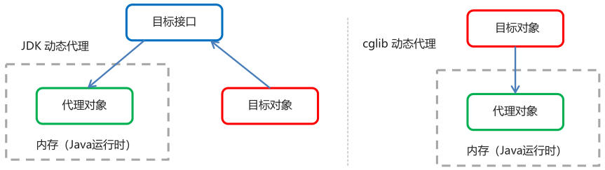

# Spring 的 AOP 简介

## AOP 介绍

- **AOP（Aspect Oriented Programming）**：**面向切面编程**，是通过预编译方式和运行期动态代理实现程序功能的统一维护的一种技术
- AOP 是 OOP 的延续，利用 AOP 可以对业务逻辑的各个部分进行隔离，从而使得业务逻辑各部分之间的耦合度降低
- 作用：在程序运行期间，在不修改源码的情况下对方法进行功能增强
- 优势：减少重复代码，提高开发效率，并且便于维护

## AOP 的底层实现

> Spring 的 AOP 底层实现是对以下的动态代理的代码进行了封装，封装后只需对关注的部分进行代码编写，并通过配置的方法完成指定目标的方法增强

- AOP 的底层是通过 Spring 提供的动态代理技术实现的
- **在运行期间，Spring 通过动态代理技术动态的生成代理对象**，代理对象方法执行时进行增强功能的介入，再去调用目标对象的方法，从而完成功能的增强

## AOP 的动态代理技术

- **JDK 代理**：**基于接口**的动态代理技术
- **Cglib 代理**：**基于父类**的动态代理技术



## JDK 的动态代理

- 目标类接口

```java
public interface TargetInterface {
    public void method();
}
```

- 目标类

```java
public class Target implements TargetInterface {
    @Override
    public void method() {
        ... // 目标方法的具体实现
    }
}
```

- 动态代理代码

```java
// 创建目标对象
Target target = new Target();
// 创建代理对象
TargetInterface proxy = (TargetInterface) Proxy.newProxyInstance(
    target.getClass().getClassLoader(),
    target.getClass().getInterfaces(),
    new InvocationHandler() {
        @Override
        public Object invoke(Object proxy, Method method, Object[] args) throws Throwable {
            ... // 前置增强代码
            Object invoke = method.invoke(target, args);
            ... // 后置增强代码
            return invoke;    
        }
    }
)
```

- 调用代理对象的方法测试

```java
// 测试，当调用接口的任何方法时，代理对象的代码都无需修改
proxy.method();
```

## Cglib 的动态代理

> Spring 框架吸收了 Cglib 包，因此无需额外代入 Cglib 包

- 目标类

```java
public class Target implements TargetInterface {
    @Override
    public void method() {
        ... // 目标方法的具体实现
    }
}
```

- 动态代理代码

```java
Target target = new Target(); // 创建目标对象
Enhancer enhancer = new Enhancer(); // 创建增强器
enhancer.setSuperclass(Target.class); // 设置父类
enhancer.setCallback(new MethodInterceptor() { // 设置回调函数
    @Override
    public Object interceptor(Object o, Method method, Object[] objects, MethodProxy methProxy) throws Throwable {
        ... // 前置代码增强
        Object invoke = method.invoke(target, objects);
        ... // 后置代码增强
        return invoke;
    }
});
Target proxy = (Target) enhancer.create(); // 创建代理对象
```

- 调用代理对象的方法测试

```java
// 测试，当调用接口的任何方法时，代理对象的代码都无需修改
proxy.method();
```

## AOP 相关概念

- Target（目标对象）：代理的目标对象
- Proxy（代理）：一个类被 AOP 织入增强后，就产生一个结果代理类
- Joinpoint（连接点）：连接点是指那些被拦截到的点，在 Spring 中，这些点指的是**可以被增强的方法**（Spring 只支持方法类型的连接点）
- **Pointcut（切入点 / 切点）**：**切点是指实际被增强的方法（目标方法）**，要对哪些 Joinpoint 进行拦截
- **Advice（通知 / 增强）**：**执行增强业务的方法叫做通知 / 增强**，拦截到 Joinpoint 之后所要做的事情
- **Aspect（切面）**：**切面 = 切点（目标方法） + 通知（增强方法）**
- **Weaving（织入）**：**将切点（目标方法）和通知（增强方法）结合在一起的过程叫做织入**，Spring 采用动态代理织入，而 AspectJ 采用编译期织入和类装载期织入

## AOP 开发事项

1. 需要编写的内容
   - 编写核心业务代码（目标类的目标方法）**（切点表达式配置）**
   - 编写切面类，切面类中有通知**（增强功能方法）**
   - 在配置文件中，**配置织入关系**，即把哪些通知与切点进行结合
2. AOP 技术实现的内容
   - **Spring 框架监控切入点方法的执行**
   - 一旦监控到切入点方法被运行，**使用代理机制**，**动态创建目标对象的代理对象**
   - **根据通知类别，在代理对象的对应位置，将通知对应的功能织入，完成完整的代码逻辑运行**
3. AOP 底层使用何种代理方式
   - Spring 框架会根据**目标类是否实现了接口**来决定采用何种动态代理的方式

# 基于 XML 的 AOP 开发

## 开发步骤

- 导入 AOP 相关坐标

```xml
<!--导入spring的context坐标，context依赖aop-->
<dependency>
    <groupId>org.springframework</groupId>
    <artifactId>spring-context</artifactId>
    <version>5.0.5.RELEASE</version>
</dependency>
<!-- aspectj的织入 -->
<dependency>
    <groupId>org.aspectj</groupId>
    <artifactId>aspectjweaver</artifactId>
    <version>1.8.13</version>
</dependency>
```

- 创建目标接口和目标类（内部有切点）

```java
public interface TargetInterface {
    public void method();
}
```

```java
public class Target implements TargetInterface {
    @Override
    public void method() {
        ... // 具体业务逻辑
    }
}
```

- 创建切面类（内部有增强方法）

```java
public class MyAspect {
    // 前置增强方法
    public void before() {
        ... // 前置增强具体业务
    }
}
```

- 将目标类和切面类的对象创建权交给 Spring

```xml
<!--配置目标类-->
<bean id="target" class="com.njk.aop.Target"></bean>
<!--配置切面类-->
<bean id="mtAspect" class="com.njk.aop.MyAspect"></bean>
```

- 在`applicationContext.xml`中配置织入关系

```xml
<!--aop命名空间-->
<beans xmlns="http://www.springframework.org/schema/beans"
       ...
       xmlns:aop="http://www.springframework.org/schema/aop"
       xsi:schemaLocation="...
                           http://www.springframework.org/schema/aop
                           http://www.springframework.org/schema/aop/spring-aop.xsd
                           ...">
```

```xml
<!--配置切点表达式和前置增强的织入关系-->
<aop:config>
    <!--引用myAspect的Bean为切面对象-->
    <aop:aspect ref="myAspect">
        <!--配置Target的method方法执行时要进行myAspect的before方法前置增强-->
        <aop:before method="before" pointcut="execution(public void com.njk.aop.Target.method())"></aop:before>
    </aop:aspect>
</aop:config>
```

- 测试代码

```java
@RunWith(SpringJUnit4ClassRunner.class)
@ContextConfiguration("classpath:applicationContext.xml")
public class AopTest {
    @Autowired
    private TargetInterface target;
    @Test
    public void test1() {
        target.method();
    }
}
```

## 切点表达式的写法

```xml
execution([修饰符] 返回值类型 包名.类名.方法名(参数))
```

- **访问修饰符可以省略**
- **返回值类型、包名、类名、方法名可以使用星号`*`代表任意**
- **包名与类名之间一个点`.`表示当前包下的类，两个点`..`表示当前包及其子包下的类**
- **参数列表可以使用两个点`..`表示任意个数、任意类型的参数列表**

```xml
<!--举例-->
execution(void com.itheima.aop.Target.*(..))
execution(* com.itheima.aop.*.*(..))
execution(* com.itheima.aop..*.*(..))
```

## 通知的类型

```xml
<aop:通知类型 method="切面类中方法名" pointcut="切点表达式"></aop:通知类型>
```

- **前置通知**`<aop:before>`：指定增强的方法在切入点方法之前执行
- **后置通知**`<aop:after-returning>`：指定增强的方法在切入点方法之后执行
- **环绕通知**`<aop:around>`：指定增强的方法在切入点方法之前和之后执行

```java
public Object around(ProceedingJoinPoint pjp) throws Throwsable {
    ... // 环绕前增强代码
    Object proceed = pjp.proceed(); // 切点方法
    ... // 环绕后增强代码
    return proceed;
}
```

- **异常抛出通知**`<aop:throwing>`：指定增强的方法在出现异常时执行
- **最终通知**`<aop:after>`：无论增强方法是否有异常都会执行

## 切点表达式的抽取

- 当多个增强的切点表达式相同时，可抽取切点表达式，在增强中使用`pointcut-ref`属性代替`pointcut`属性来引用抽取后的表达式

```xml
<aop:config>
    <!--引用myAspect的Bean为切面对象-->
    <aop:aspect ref="myAspect">
        <!--抽取切点表达式-->
        <aop:pointcut id="myPointcut" expression="execution(* com.njk.aop.*.*(..))"/>
        <aop:before method="before" pointcut-ref="myPointcut"></aop:before>
    </aop:aspect>
</aop:config>
```

# 基于注解的 AOP 开发

## 开发步骤

- 创建目标接口和目标类（内部有切点）
- 创建切面类（内部有增强方法）
- 将目标类和切面类的对象创建权交给 Spring

```java
@Component("target")
public class Target implements TargetInterface {
    @Override
    public void method() {
        ... // 具体业务逻辑
    }
}
```

```java
@Component("myAspect")
public class MyAspect {
    // 前置增强方法
    public void before() {
        ... // 前置增强具体业务
    }
}
```

- 在切面类中使用**注解配置织入关系：`@Aspect`标注切面类，`@通知注解`标注通知方法**

```java
@Component("myAspect")
@Aspect
public class MyAspect {
    // 前置增强方法
    @Before("execution(* com.njk.aop.*.(..))")
    public void before() {
        ... // 前置增强具体业务
    }
}
```

- **在配置文件中开启组件扫描和 AOP 的自动代理**

```xml
<!--组件扫描-->
<context:component-scan base-package="com.njk.aop"/>

<!--aop的自动代理-->
<aop:aspectj-autoproxy></aop:aspectj-autoproxy>
```

- 测试代码

## 注解通知的类型

```java
@通知注解("切点表达式")
```

- **前置通知**`@Before`：指定增强的方法在切入点方法之前执行
- **后置通知**`@AfterReturning`：指定增强的方法在切入点方法之后执行
- **环绕通知**`@Around`：指定增强的方法在切入点方法之前和之后都执行

```java
public Object around(ProceedingJoinPoint pjp) throws Throwsable {
    ... // 环绕前增强代码
    Object proceed = pjp.proceed(); // 切点方法
    ... // 环绕后增强代码
    return proceed;
}
```

- **异常抛出通知**`@AfterThrowing`：指定增强的方法在出现异常时执行
- **最终通知**`@After`：无论增强方式执行是否有异常都会执行

## 切点表达式的抽取

- 抽取方法：在切面类内定义方法，在该方法上使用`@Pointcut`注解定义切点表达式，然后在增强注解中进行引用

```java
@Componet("myAspect")
@Aspect
public class MyAspect {
    // 前置增强方法
    @Before("MyAspect.myPointcut()")
    //@Before("myPointcut()")
    public void before() {
        ... // 前置增强具体业务
    }
    
    @Pointcut("execution(* com.njk.aop.*.*(..))")
    public void myPointcut() {}
}
```


