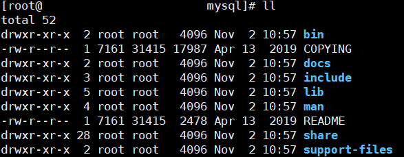
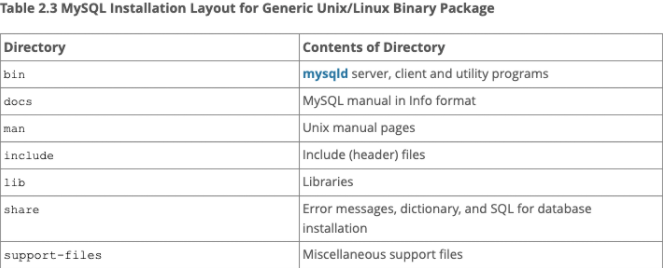

# Xshell 与 Xftp 的安装与使用

- 免费版下载地址：https://www.netsarang.com/en/free-for-home-school/
- 填写姓名与邮箱，勾选`Both`，点击`Download`，NetSarang 会把下载链接发送到邮箱里

## Xshell

1. 新建会话：协议选择`SSH`，主机填写服务器公有 IP，端口号一般默认为`22`，点击连接
   - Linux 命令：`ssh root@服务器公有IP`
2. 输入用户名`root`和密码
   - 若 password 选项不可选，则在后台重置服务器密码，重启服务器
3. 完成后显示连接到主机的 Shell 界面，并提示登陆成功

## Xftp

- 新建会话：在 XShell 界面点击新建文件传输，开启 Xftp 会话

# 安装 yum 工具

- 安装`yum-utils`

```bash
yum install -y yum-utils \
           device-mapper-persistent-data \
           lvm2 --skip-broken
```

- 更新本地镜像源

```bash
yum-config-manager \
    --add-repo \
    https://mirrors.aliyun.com/docker-ce/linux/centos/docker-ce.repo
    
sed -i 's/download.docker.com/mirrors.aliyun.com\/docker-ce/g' /etc/yum.repos.d/docker-ce.repo

yum makecache fast
```


# 安装 JDK

## 下载 JDK

- 版本：Linux x64，对应服务器系统 CentOS 7.9
- 下载链接：https://www.oracle.com/technetwork/java/javase/downloads/jdk8-downloads-2133151.html

## 上传并解压源码包

1. 新建文件夹`java`

```bash
mkdir /usr/local/java
```

2. 在 Xftp 中将源码压缩包上传
3. 解压源码压缩包

```bash
tar -zxvf jdk-8u311-linux-x64.tar.gz -C /usr/local/java
```

4. 顺手删除源码压缩包

```bash
rm -f jdk-8u311-linux-x64.tar.gz
```

## 配置 JDK 环境变量

1. 打开`profile`文件

```bash
vim /etc/profile
```

2. 将输入切换到英文小写，输入`i`，将光标移至文末

```bash
export JAVA_HOME=/usr/java/jdk1.8.0_311
export JRE_HOME=${JAVA_HOME}/jre
export CLASSPATH=.:${JAVA_HOME}/lib:${JRE_HOME}/lib:$CLASSPATH
export JAVA_PATH=${JAVA_HOME}/bin:${JRE_HOME}/bin
export PATH=$PATH:${JAVA_PATH}
```

3. 添加完毕后，直接按`esc`或`ctrl+c`退出编辑状态，再直接输入`:wq`来保存并退出（不保存退出是`:q!`)

4. 重新执行`profile`文件，使配置文件生效

```bash
source /etc/profile
```

5. 检测 JDK 是否安装成功
   - 输入`javac`：不会出现`command not found`错误
   - 输入`java -version`：正确显示 java 版本
   - `echo $PATH`：查看设置的环境变量是否正确

# 安装 MySQL

## 卸载 MariaDB

- 在安装 MySQL 之前，先卸载 CentOS 自带的 MariaDB

1. 查询 CentOS 安装的 MariaDB

```bash
rpm -qa | grep -i mariadb
```

2. 卸载 MariaDB

```bash
rpm -e --nodeps mariadb-libs-5.5.52-1.el7.x86_64
```

## 下载 MySQL

- 版本：MySQL 5.7.26，Linux - Generic，Linux x64
- 下载链接：https://downloads.mysql.com/archives/community/

## 上传并解压 MySQL

1. 新建文件夹`mysqld`

```bash
mkdir /usr/local/mysqld
```

2. 在 Xftp 中将 MySQL 安装介质上传
3. 解压 MySQL 安装介质

```bash
tar -zxvf mysql-5.7.26-linux-glibc2.12-x86_64.tar.gz -C /usr/local/mysqld
```

4. 更改解压出来的文件夹名称

```bash
mv mysql-5.7.26-linux-glibc2.12-x86_64 mysql
```

5. 顺手删除 MySQL 安装介质

```bash
rm -f mysql-5.7.26-linux-glibc2.12-x86_64.tar.gz
```





## 用户和组

- 创建 mysql 的组和用户

```bash
groupadd mysql
useradd -r -g mysql
```

- 更改所属的组和用户

```bash
chown -R mysql mysql/
chgrp -R mysql mysql/
```

## 创建 data 目录

```bash
cd /usr/local/mysqld/mysql
mkdir data
```

## 初始化 Mysql

- 初始化创建 MySQL 数据库

```
yum install -y libaio
```

```bash
./bin/mysqld --user=mqsql --basedir=/usr/local/mysqld/mysql --datadir=/usr/local/mysqld/mysql/data --initialize
```

- **记得存储临时密码**！！！

- 配置`my.cnf`文件

```bash
cat <<EOF>/etc/my.cnf
[mysqld]
user=mysql
basedir=/usr/local/mysqld/mysql
datadir=/usr/local/mysqld/mysql/data
server_id=6
port=3306
socket=/tmp/mysql.sock
##客户端
[mysql]
socket=/tmp/mysql.sock
EOF
```

### 忘记临时密码后再次生成临时密码

- 找到`datadir`目录，删除里面的文件，再重新初始化

```bash
cd /usr/local/mysqld/mysql/data
rm -rf *
cd /usr/local/mysqld/mysql
./bin/mysqld --user=mqsql --basedir=/usr/local/mysqld/mysql --datadir=/usr/local/mysqld/mysql/data --initialize
```

## 开启 MySQL

```bash
./support-files/mysql.server start
```

- 将 MySQL 放入系统进程，配置开机自启动

```bash
cp ./support-files/mysql.server /etc/init.d/mysqld
```

- 重启 MySQL

```bash
service mysqld restart
```

- 设置 MySQL 软连接，使得`mysql`命令生效（其他相关指令同理）

```bash
ln -fs /usr/local/mysqld/mysql/bin/mysql /usr/bin
```

## 更改新密码

- 使用上述的临时密码登录 MySQL

```bash
mysql -uroot -p临时密码
```

- 进入 MySQL 命令行，设置新密码

```sql
alter user 'root'@'localhost' identified by 'root';
```

- 使用新密码登录

```bash
mysql -uroot -proot
```

## 配置数据库远程连接

- 使用 mysql 数据库，设置任何 IP 地址作为`root`用户来远程登录

```sql
use mysql;
update user set user.Host='%' where user.User='root';
```

- 更改权限，赋给用户对于所有库的所有表的远程权限

```sql
grant all privileges on *.* to 'root'@'%' identified by 'root' with grant option;
```

```sql
# 库名:要远程访问的数据库名称,所有的数据库使用"*"
# 表名:要远程访问的数据库下的表的名称，所有的表使用"*"
# 用户名:要赋给远程访问权限的用户名称
# IP地址:可以远程访问的电脑的IP地址，所有的地址使用"%"
# 密码:要赋给远程访问权限的用户对应使用的密码
grant all privileges on 库名.表名 to '用户名'@'IP地址' identified by '密码' with grant option;
```

- 刷新权限

```sql
flush privileges;
```

## 配置 SQLyog 远程连接服务器数据库 

### 开放服务器数据库端口

- 开放阿里云服务器安全组的`3306`端口

1. 阿里云服务器控制台 - 实例 - 更多 - 网络和安全组 - 安全组配置
2. 添加安全组规则
3. 添加`3306`端口，描述改为`MySQL port`

### 使用 SQLyog 远程连接 MySQL

1. 新建连接
2. 填写服务器公用 IP 地址、MySQL 端口、MySQL 用户名、MySQL 密码
3. 连接，即可使用 SQLyog 操作服务器数据库

## 安装过程中的报错

- `xxx/support-files/mysql.server: line 256: my_print_defaults: command not found`
  - 系统找不到文件`my_print_defaults`，先用`find`找到文件，再复制到`/usr/bin`

```bash
find / -name my_print_defaults
```

```bash
cp xxx/my_print_defaults /usr/bin
```

- `xxx/support-files/mysql.server: line 276: cd: /usr/local/mysql: No such file or directory`
  - 在路径`/usr/local/mysql`下，没有`mysql`这个目录文件，是因为安装目录不是`mysql.server`配置文件的路径，将安装目录链接到配置文件下的目录

```bash
ln -s /usr/local/mysqld/mysql /usr/local/mysql
```

- `Starting MySQL..The server quit without updating PID file ([FAILED]/mysql/data/xxxxxx.pid)`
  - MySQL 启动失败，报错为没有更新 pid 文件，可能原因很多，偷懒的方法是直接将 mysql 相关进程`kill`掉再重启

```bash
# 查看mysql程序对应的进程号
ps
ps -e|grep mysql

# 杀死mysql进程
sudo kill -9 mysql进程号

# 杀死mysqld进程
sudo kill mysqld

# 检查是否还有mysql进程存在
ps
ps -e|grep mysql
```

# 安装 tomcat

## 下载 tomcat

- 版本：tomcat 8.5.7，Core - tar.gz
- 下载链接：https://tomcat.apache.org/download-80.cgi

## 上传并解压 tomcat

1. 新建文件夹`tomcat`

```bash
mkdir /usr/local/tomcat
```

2. 在 Xftp 中将 tomcat 安装介质上传
3. 解压 tomcat 安装介质

```bash
tar -zxvf apache-tomcat-8.5.72.tar.gz -C /usr/local/tomcat
```

4. 顺手删除 MySQL 安装介质

```bash
rm -f apache-tomcat-8.5.72.tar.gz
```

5. 将 tomcat 放入系统进程，为了更方便的启动 tomcat，使用`service tomcat start`即可启动

```bash
cp -p /usr/local/tomcat/apache-tomcat-8.5.72/bin/catalina.sh /etc/init.d/tomcat
```

## 配置 tomcat

1. 用 vim 打开 `/etc/init.d/tomcat`

```bash
vim /etc/init.d/tomcat
```

2. 按`i`进入编辑模式，在合适的地方加入

```bash
# chkconfig: 112 63 37
# chkconfig: 112 63 37
# description: tomcat server init script
# Source Function Library
./etc/init.d/functions

JAVA_HOME=/usr/local/java/jkd1.8.0_311
CATALINA_HOME=/usr/local/tomcat/apache-tomcat-8.5.72
```

3. 按`etc`退出编辑模式，输入`:wq`保存并退出
4. 设置 tomcat 优先级，并将 tomcat 加入系统服务

```bash
chmod 755 /etc/init.d/tomcat
chkconfig --add tomcat
chkconfig tomcat on
```

5. 用 vim 添加 `.sh`文件

```bash
vim setclasspath.sh
```

6. 添加如下内容

```bash
export JAVA_HOME=/usr/local/java/jkd1.8.0_311
export JRE_HOME=/usr/local/java/jkd1.8.0_311/jre
```

7. 按`etc`退出编辑模式，输入`:wq`保存并退出

## 启动 tomcat

1. 方式一：回到`./apache-tomcat-8.5.72/bin`目录，执行`./startup.sh`，出现`Tomcat started`表示安装且启动成功

```bash
./startup.sh
# 或
/usr/local/tomcat/apache-tomcat-8.5.72/bin/startup.sh
```

2. 方式二：或者通过执行`service tomcat start`命令来启动 tomcat，出现`Tomcat started`表示安装且启动成功
3. 开放阿里云服务器安全组的`8080/8089`端口
4. 浏览器访问`http://服务器公有IP:8080`，出现 tomcat 的主界面表示启动成功

# 安装 Maven

[在阿里云服务器上配置jenkins部署spring boot jar项目 - 代码天地 (codetd.com)](http://codetd.com/article/10751043)

# 安装 Git

# 安装 publish over SSH


# 项目部署

## jar 包部署

1. 将项目导出成`jar`包，通过 Xftp 上传到服务器（需要与项目外部配置文件在同一级目录下）
2. 进入上传项目的目录，执行`java -jar xxx.jar`
3. 浏览器访问`http://服务器公有IP:8080/项目名`

## war 包部署

1. 将项目导出成`war`包，通过 Xftp 上传到`./tomcat/apache-tomcat-8.5.72/webapps`文件夹下
2. 启动 tomcat，即可自动解压部署
   - 方式一：在`./tomcat/apache-tomcat-8.5.72/bin`目录下，执行`./startup.sh`
   - 方式二：先`service tomcat stop`，再`service tomcat start`重启 tomcat
3. 浏览器访问`http://服务器公有IP:8080/项目名`

## IDEA 插件部署

[一键把jar包发布到阿里云服务器 - 简书 (jianshu.com)](https://www.jianshu.com/p/fad012d56e75)

# 补充

## 查看指定端口

- 查看指定端口是否打开（如：查看8080端口）

```bash
netstat -an | grep 8080
```

- 打开指定端口的命令（如：打开8080端口）

```bash
nc -lp 8080
```
