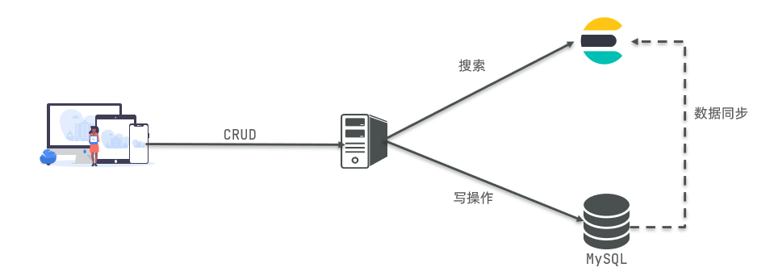
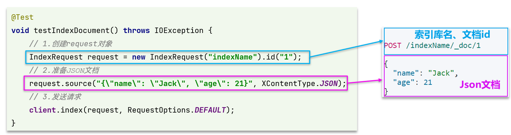
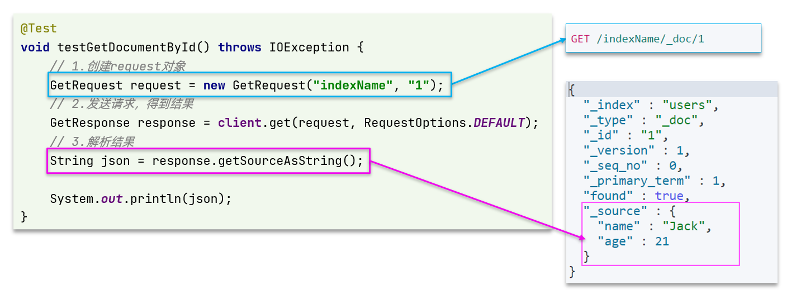

# 基础概念

## ElasticSearch

- ElasticSearch 是一款非常强大的开源搜索引擎，可以用来实现搜索、日志统计、分析、系统监控等功能
- ELK 技术栈：以 ElasticSearch 为核心的技术栈，包括 beats、Logstash、kibana、elasticsearch，被广泛应用在日志数据分析、实时监控等领域
  - ElasticSearch 是 Elastic Stack 的核心，负责存储、搜索、分析数据


- ElasticSearch 底层是基于 **lucene** 来实现的
  - [**Lucene**](https://lucene.apache.org/) 是 Apache 基于 Java 语言的开源搜索引擎类库，提供了搜索引擎的核心 API

## 倒排索引

- 倒排索引的概念是基于 MySQL 这样的正向索引而言
- 倒排索引中有两个非常重要的概念：
  - 文档（`Document`）：用来搜索的数据，其中的每一条数据就是一个文档
    - 例如：一个网页、一个商品信息
  - 词条（`Term`）：对文档数据或用户搜索数据，利用某种算法分词，得到的具备含义的词语就是词条
    - 例如：`我是中国人`，就可以分为：`我`、`是`、`中国人`、`中国`、`国人`等的几个词条
- **创建倒排索引**是对正向索引的一种特殊处理，流程如下：
  - 将每一个文档的数据利用算法分词，得到一个个词条
  - 创建表，每行数据包括词条、词条所在文档id、位置等信息
  - 因为词条唯一性，可以给词条创建索引，例如hash表结构索引

### 正向和倒排

- **正向索引**是最传统的，根据 id 索引的方式，是**根据文档找词条的过程**
  - 优点
    - 可以给多个字段创建索引
    - 根据索引字段搜索、排序速度非常快
  - 缺点
    - 根据非索引字段，或者索引字段中的部分词条查找时，只能全表扫描
- **倒排索引**先找到用户要搜索的词条，根据词条得到相关文档的 id，然后根据 id 获取文档，是**根据词条找文档的过程**
  - 优点
    - 根据词条搜索、模糊搜索时，速度非常快
  - 缺点
    - 只能给词条创建索引，而不是字段
    - 无法根据字段做排序

## ES的一些概念

### 文档和字段

- ElasticSearch 是面向**文档（Document）**存储的，文档数据会被序列化为 Json 格式后存储在 ElasticSearch 中


- Json 文档中往往包含很多的**字段（Field）**，类似于数据库中的列

### 索引和映射

- **索引（Index）**，就是相同类型的文档的集合，类似于数据库中的表
  - 所有用户文档，称为用户的索引
  - 所有商品的文档，称为商品的索引
  - 所有订单的文档，称为订单的索引


- 索引库中有**映射（mapping）**，是索引中文档的字段约束信息，类似表的结构约束
  - 数据库的表会有约束信息**（Schema）**，用来定义表的结构、字段的名称、类型等信息

### MySQL 与 ElasticSearch

| **MySQL** | **Elasticsearch** | **说明**                                                     |
| --------- | ----------------- | ------------------------------------------------------------ |
| Table     | Index             | 索引（index），就是文档的集合，类似数据库的表(table)           |
| Row       | Document          | 文档（Document），就是一条条的数据，类似数据库中的行（Row），文档都是 JSON 格式 |
| Column    | Field             | 字段（Field），就是JSON文档中的字段，类似数据库中的列（Column） |
| Schema    | Mapping           | Mapping（映射）是索引中文档的约束，例如字段类型约束。类似数据库的表结构（Schema） |
| SQL       | DSL               | DSL 是 ElasticSearch 提供的 JSON 风格的请求语句，用来操作 ElasticSearch，实现 CRUD |

- **Mysql：擅长事务类型操作，可以确保数据的安全和一致性**
- **Elasticsearch：擅长海量数据的搜索、分析、计算**
- 在企业中，往往是两者结合使用：
  - 对**安全性要求较高**的写操作，使用mysql实现
  - 对**查询性能要求较高**的搜索需求，使用elasticsearch实现
  - 两者再基于某种方式，实现数据的同步，保证一致性



## 安装 ES、kibana

- ElasticSearch 安装方式参考：[ElasticSearch安装 - 部署单点ES](/微服务/ElasticSearch/ElasticSearch安装?id=部署单点-es)
- kibana 安装方式参考：[ElasticSearch安装 - 部署kibana](/微服务/ElasticSearch/ElasticSearch安装?id=部署-kibana)

### 分词器

- 作用
  - **创建倒排索引**时对文档分词
  - **用户搜索**时，对输入的内容分词
- IK 分词器的模式
  - ik_smart：智能切分，粗粒度
  - ik_max_word：最细切分，细粒度
- IK 分词器**拓展词条**与**停用词条**
  - 利用`config`目录的`IkAnalyzer.cfg.xml`文件**添加拓展词典和停用词典**
  - 在词典中添加拓展词条或者停用词条


# 索引库操作

> 索引库就类似数据库表，mapping 映射就类似表的结构
> 要向 ES 中存储数据，必须先创建“库”和“表”

## mapping 映射属性

mapping 是对索引库中文档的约束，常见的 mapping 属性包括

- type：字段数据类型，常见的简单类型有：
  - 字符串：text（可分词的文本）、keyword（精确值，不可分词，例如：品牌、国家、ip 地址等）
  - 数值：long、integer、short、byte、double、float
  - 布尔：boolean
  - 日期：date
  - 对象：object
- **index：是否创建索引，默认为 true（即是否参与搜索）**
- analyzer：使用哪种分词器
- properties：该字段的子字段

```json
{
    "age": 21,
    "weight": 52.1,
    "isMarried": false,
    "info": "jack",
    "email": "123@123.cn",
    "score": [99.1, 99.5, 98.9],
    "name": {
        "firstName": "si",
        "lastName": "li"
    }
}
```

> ES 中没有“数组”类型，允许某一类型的属性具有多个值


## 索引库的 CRUD

- 创建索引库：`PUT /索引库名`
- 查询索引库：`GET /索引库名`
- 删除索引库：`DELETE /索引库名`
- 添加字段：`PUT /索引库名/_mapping`

### 创建索引库和映射

- 请求方式：`PUT`
- 请求路径：`/索引库名`，可自定义
- 请求参数：mapping 映射

```json
PUT /索引库名称
{
  "mappings": {
    "properties": {
      "字段名":{
        "type": "text",
        "analyzer": "ik_smart"
      },
      "字段名2":{
        "type": "keyword",
        "index": "false"
      },
      "字段名3":{
        "properties": {
          "子字段": {
            "type": "keyword"
          }
        }
      },
      // ...略
    }
  }
}
```

### 查询索引库

- 请求方式：`GET`
- 请求路径：`/索引库名`
- 请求参数：无

```json
GET /索引库名
```

### 修改索引库

- 倒排索引的数据结构改变（比如改变了分词器），就需要重新创建倒排索引，因此索引库**一旦创建，无法修改 mapping **
- 虽然无法修改 mapping 中已有的字段，但是却允许添加新的字段到 mapping 中，因为不会对倒排索引产生影响

```json
PUT /索引库名/_mapping
{
  "properties": {
    "新字段名":{
      "type": "integer"
    }
  }
}
```

### 删除索引库

- 请求方式：`DELETE`
- 请求路径：`/索引库名`
- 请求参数：无

```
DELETE /索引库名
```


# 文档操作

- 创建文档：`POST /{索引库名}/_doc/文档id   { json文档 }`
- 查询文档：`GET /{索引库名}/_doc/文档id`
- 删除文档：`DELETE /{索引库名}/_doc/文档id`
- 修改文档：
  - 全量修改：`PUT /{索引库名}/_doc/文档id { json文档 }`
  - 增量修改：`POST /{索引库名}/_update/文档id { "doc": {字段}}`

## 新增文档

```json
POST /索引库名/_doc/文档id
{
    "字段1": "值1",
    "字段2": "值2",
    "字段3": {
        "子属性1": "值3",
        "子属性2": "值4"
    },
    // ...
}
```

## 查询文档

```json
GET /{索引库名称}/_doc/{id}
```

## 删除文档

```js
DELETE /{索引库名}/_doc/id值
```

## 修改文档

- 修改有两种方式
  - 全量修改：直接覆盖原来的文档
  - 增量修改：修改文档中的部分字段

### 全量修改

- 全量修改是覆盖原来的文档，其本质是：
  - 根据指定的 id 删除文档
  - 新增一个相同 id 的文档
- **注意**：如果根据 id 删除时，id 不存在，第二步的新增也会执行，也就**从修改变成了新增操作**


```json
PUT /{索引库名}/_doc/文档id
{ 
  "字段1": "值1",
  "字段2": "值2",
  //...
}
```

### 增量修改

- 增量修改是只修改指定 id 匹配的文档中的部分字段

```json
POST /{索引库名}/_update/文档id
{
  "doc": {
    "字段名": "新的值",
  }
}
```

## 默认 mapping 设置

- 向 ES 中插入文档时，如果文档中字段没有对应的 mapping，ES 会默认设置 mapping，规则如下：

| JSON 类型 | Elasticsearch 类型                                           |
| --------- | ------------------------------------------------------------ |
| 字符串    | 日期格式字符串：mapping 为 date 类型；普通字符串：mapping为 text 类型，并添加 keyword 类型子字段 |
| 布尔值    | boolean                                                      |
| 浮点数    | float                                                        |
| 整数      | long                                                         |
| 对象嵌套  | object，并添加properties                                     |
| 数组      | 由数组中的第一个非空类型决定                                 |
| 空值      | 忽略                                                         |

## 补充

### 地理坐标数据

- **ES 中支持两种地理坐标数据类型**
  - `geo_point`：由纬度（latitude）和经度（longitude）确定的一个点（例如："32.8752345, 120.2981576"）
  - `geo_shape`：由多个`geo_point`组成的复杂几何图形（例如一条直线，"LINESTRING (-77.03653 38.897676, -77.009051 38.889939)"）

### copy_to

- **字段拷贝可以使用`copy_to`属性将当前字段拷贝到指定字段**

```json
"all": {
  "type": "text",
  "analyzer": "ik_max_word"
},
"brand": {
  "type": "keyword",
  "copy_to": "all"
}
```
- all：一个组合字段，其目的是将多字段的值利用`copy_to`合并，提供给用户搜索


# RestClient 操作索引库

- ES 官方提供了[各种不同语言的客户端](https://www.elastic.co/guide/en/elasticsearch/client/index.html)，用来操作 ES
- **这些客户端的本质就是组装 DSL 语句，通过 http 请求发送给 ES**
- Java Rest Client 包括两种
  - Java Low Level Rest Client
  - **Java High Level Rest Client** :heavy_check_mark:
- JavaRestClient 操作索引库的核心是`client.indices()`方法来获取索引库的操作对象
  1. 初始化`RestHighLevelClient`
  2. 创建`XxxIndexRequest`；`XXX`是`Create`、`Get`、`Delete`
  3. 准备 DSL（ `Create`时需要参数，其它是无参）
  4. 发送请求。调用`indices().xxx()`方法，`xxx`是`create`、`exists`、`delete`

## 初始化 RestClient

> 在 ElasticSearch 提供的API中，与 ElasticSearch 一切交互都封装 RestHighLevelClient 类中，必须先完成 RestHighLevelClient 初始化，建立与 ElasticSearch 的连接

1. 引入 ES 的 RestHighLevelClient 依赖

```xml
<dependency>
    <groupId>org.elasticsearch.client</groupId>  
    <artifactId>elasticsearch-rest-high-level-client</artifactId>
</dependency>
```

2. 因为 SpringBoot 默认的 ES 版本是 7.6.2，因此需要覆盖默认的 ES 版本：

```xml
<properties>
    <java.version>1.8</java.version>   
    <elasticsearch.version>7.12.1</elasticsearch.version>
</properties>
```

3. 初始化 RestHighLevelClient

```java
// 可以指定多个 HttpHost.create
RestHighLevelClient client = new RestHighLevelClient(RestClient.builder(HttpHost.create("http://8.142.98.103:9200")));
```

4. 将初始化的代码编写在`@BeforeEach`方法中

```java
private RestHighLevelClient client;
@BeforeEach
void setUp() {
    this.client = new RestHighLevelClient(RestClient.builder(HttpHost.create("http://8.142.98.103:9200")));
}
@AfterEach
void tearDown() throws IOException {
    this.client.close();
}
```

## 创建索引库


1. 创建`Request`对象，因为是创建索引库的操作，因此`Request`是`CreateIndexRequest`
2. 添加请求参数，其实就是 DSL 的 JSON 参数部分
   - 因为创建索引库的 JSON 字符串很长，这里是定义了静态字符串常量`MAPPING_TEMPLATE`，简化代码
3. 发送请求，`client.indices()`方法的返回值是`IndicesClient`类型，封装了所有与索引库操作有关的方法

```java
@Test
void createHotelIndex() throws IOException {
    // 1.创建 Request 对象
    CreateIndexRequest request = new CreateIndexRequest("hotel");    // 2.准备请求的参数：DSL语句
    request.source(MAPPING_TEMPLATE, XContentType.JSON);
    // 3.发送请求
    client.indices().create(request, RequestOptions.DEFAULT);
}
```

## 删除索引库

```json
DELETE /hotel
```

1. 创建`Request`对象，`DeleteIndexRequest`对象
2. 准备参数，这里是无参
3. 发送请求，`delete`方法

```java
@Test
void testDeleteHotelIndex() throws IOException {
    // 1.创建Request对象
    DeleteIndexRequest request = new DeleteIndexRequest("hotel");    // 2.发送请求
    client.indices().delete(request, RequestOptions.DEFAULT);
}
```

## 判断索引库是否存在

- 判断索引库是否存在，本质就是查询

```json
GET /hotel
```

1. 创建`Request`对象，`GetIndexRequest`对象
2. 准备参数，这里是无参
3. 发送请求，改用`exists`方法

```java
@Test
void testExistsHotelIndex() throws IOException {
    // 1.创建Request对象
    GetIndexRequest request = new GetIndexRequest("hotel");
    // 2.发送请求
    boolean exists = client.indices().exists(request, RequestOptions.DEFAULT);
    // 3.输出
    System.err.println(exists ? "索引库已经存在！" : "索引库不存在！");
}
```

# RestClient 操作文档

> 下文省略了 JavaRestClient 的初始化部分

1. 初始化 RestHighLevelClient
2. 创建`XxxRequest`；`XXX`是`Index`、`Get`、`Update`、`Delete`、`Bulk`
3. 准备参数（`Index`、`Update`、`Bulk`时需要）
4. 发送请求。调用`RestHighLevelClient#.xxx()`方法，`xxx`是`index`、`get`、`update`、`delete`、`bulk`
5. 解析结果（`Get`时需要）

## 新增文档

```json
POST /{索引库名}/_doc/1
{
    "name": "Jack",
    "age": 21
}
```



1. 创建`Request`对象，`IndexRequest`对象
2. 准备请求参数，也就是 DSL 中的 JSON 文档
3. 发送请求，`client.index()`方法

```java
@Testvoid testAddDocument() throws IOException {
    // 1.根据id查询酒店数据
    Hotel hotel = hotelService.getById(61083L);
    // 2.转换为文档类型
    HotelDoc hotelDoc = new HotelDoc(hotel);
    // 3.将HotelDoc转json
    String json = JSON.toJSONString(hotelDoc);
    // 1.准备Request对象
    IndexRequest request = new IndexRequest("hotel").id(hotelDoc.getId().toString());
    // 2.准备Json文档
    request.source(json, XContentType.JSON);
    // 3.发送请求
    client.index(request, RequestOptions.DEFAULT);
}
```

## 查询文档

```json
GET /hotel/_doc/{id}
```

1. 准备`Request`对象，`GetRequest`对象
2. 发送请求，`client.get()`方法
3. 解析结果，就是对JSON做反序列化
  - 结果是一个 JSON，其中文档放在一个`_source`属性中，因此解析就是拿到`_source`，反序列化为 Java 对象即可



```java
@Test
void testGetDocumentById() throws IOException {
    // 1.准备Request
    GetRequest request = new GetRequest("hotel", "61082");    
    // 2.发送请求，得到响应    
    GetResponse response = client.get(request, RequestOptions.DEFAULT);   
    // 3.解析响应结果    
    String json = response.getSourceAsString();    
    HotelDoc hotelDoc = JSON.parseObject(json, HotelDoc.class);  
    System.out.println(hotelDoc);
}
```

## 删除文档

```json
DELETE /hotel/_doc/{id}
```

1. 准备`Request`对象，`DeleteRequest`对象，要指定索引库名和 id
2. 准备参数，无参
3. 发送请求，`client.delete()`方法


```java
@Test
void testDeleteDocument() throws IOException {    
    // 1.准备Request    
    DeleteRequest request = new DeleteRequest("hotel", "61083");
    // 2.发送请求    
    client.delete(request, RequestOptions.DEFAULT);
}
```

## 修改文档

- 全量修改：本质是先根据id删除，再新增
  - 在RestClient的API中，全量修改与新增的API完全一致，判断依据是ID：
    - 如果新增时，ID已经存在，则修改
    - 如果新增时，ID不存在，则新增
- 增量修改：修改文档中的指定字段值


1. 准备`Request`对象，`UpdateRequest`对象
2. 准备参数，JSON 文档，里面包含要修改的字段
3. 更新文档，`client.update()`方法

```java
@Test
void testUpdateDocument() throws IOException {    
    // 1.准备Request    
    UpdateRequest request = new UpdateRequest("hotel", "61083");
    // 2.准备请求参数, 每2个参数为一对 key-value  
    request.doc("price", "952",
                "starName", "四钻"
    ); 
    // 3.发送请求    
    client.update(request, RequestOptions.DEFAULT);
}
```

## 批量导入文档

- 利用`BulkRequest`批量将数据库数据导入到索引库中
- 批量处理`BulkRequest`，其本质就是将多个普通的 CRUD 请求组合在一起发送
- 其中提供了一个`add`方法，用来添加其他请求


- 能添加的请求包括：
  - `IndexRequest`，新增
  - `UpdateRequest`，修改
  - `DeleteRequest`，删除
- `Bulk`中添加了多个`IndexRequest`，就是批量新增功能

1. 创建Request对象，`BulkRequest`对象
2. 准备参数。批处理的参数，就是其它`Request`对象，这里就是多个`IndexRequest`
3. 发起请求，`client.bulk()`方法

```java
@Test
void testBulkRequest() throws IOException {    
    // 批量查询酒店数据    
    List<Hotel> hotels = hotelService.list();    
    // 1.创建Request    
    BulkRequest request = new BulkRequest();    
    // 2.准备参数，添加多个新增的Request    
    for (Hotel hotel : hotels) {        
        // 2.1.转换为文档类型HotelDoc        
        HotelDoc hotelDoc = new HotelDoc(hotel);
        // 2.2.创建新增文档的Request对象        
        request.add(new IndexRequest("hotel")
                    .id(hotelDoc.getId().toString())
                    .source(JSON.toJSONString(hotelDoc), XContentType.JSON)
        );
    }    
    // 3.发送请求    
    client.bulk(request, RequestOptions.DEFAULT);
}
```