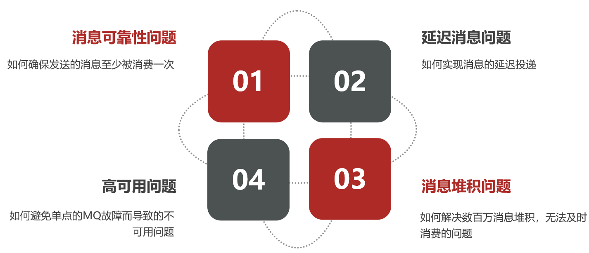
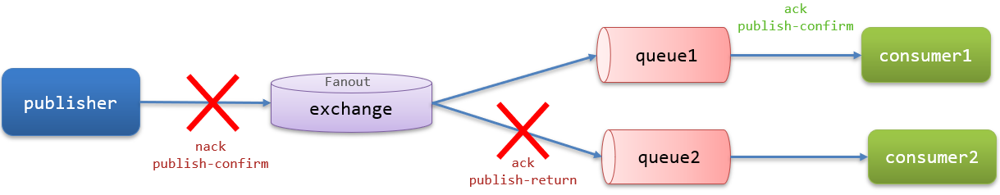
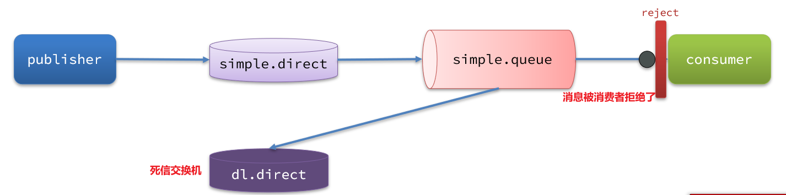

消息队列在使用过程中，面临着很多实际问题需要思考：



# 1.消息可靠性

- 消息从发送，到消费者接收，会经过多个过程，其中的每一步都可能导致消息丢失，常见的丢失原因包括：
  1. 发送时丢失：
    - 生产者发送的消息未送达 Exchange
    - 消息到达 Exchange 后未到达 Queue
  2. MQ 宕机，Queue将消息丢失
  3. Consumer 接收到消息后未消费就宕机
- 针对这些问题，RabbitMQ 分别给出了解决方案：
  - 生产者确认机制 :arrow_right: 问题1
  - mq持久化 :arrow_right: 问题2
  - 消费者确认机制 :arrow_right: 问题3
  - 失败重试机制 :arrow_right: 问题3

## 1.1.生产者消息确认

- RabbitMQ 提供了 **Publisher Confirm 机制** 来避免消息发送到 MQ 过程中丢失
- 注意：确认机制必须给每个消息指定全局唯一 ID，以区分不同消息，避免`ack`冲突
- 消息发送到 MQ 以后，会返回一个结果给发送者，表示消息是否处理成功
- **返回结果有两种方式**：
  
  - `publisher-confirm`，发送者确认
    - 消息成功投递到交换机，返回`ack`
    - 消息未投递到交换机，返回`nack`
  - `publisher-return`，发送者回执
    - 消息投递到交换机了，但是没有路由到队列，返回`ack`，以及路由失败原因
  
  

### 1.1.1.修改配置

- 首先，修改 Publisher 服务中的`application.yml`文件，添加下面的内容

```yaml
spring:
  rabbitmq:
    publisher-confirm-type: correlated
    publisher-returns: true
    template:
      mandatory: true
```

- `publish-confirm-type`：开启`publisher-confirm`，这里支持两种类型：
  - `simple`：同步等待 confirm 结果，直到超时（可能会导致阻塞，不推荐使用）
  - `correlated`：异步回调，定义`ConfirmCallback`，MQ 返回结果时会回调这个`ConfirmCallback`
- `publish-returns`：开启`publish-return`功能，同样是基于 callback 机制，不过是定义`ReturnCallback`
- `template.mandatory`：定义消息路由失败时的策略。true，则调用`ReturnCallback`；false：则直接丢弃消息

### 1.1.2.定义ReturnCallback

- **每个 RabbitTemplate 只能配置一个`ReturnCallback`，因此需要在项目加载时配置**
- 修改 Publisher 服务，添加一个：

```java
@Slf4j
@Configuration
public class CommonConfig implements ApplicationContextAware {
    @Override
    public void setApplicationContext(ApplicationContext applicationContext) throws BeansException {
        // 获取RabbitTemplate
        RabbitTemplate rabbitTemplate = applicationContext.getBean(RabbitTemplate.class);
        // 设置ReturnCallback
        rabbitTemplate.setReturnCallback((message, replyCode, replyText, exchange, routingKey) -> {
            // 投递失败，记录日志
            log.info("消息发送失败，应答码{}，原因{}，交换机{}，路由键{},消息{}",
                     replyCode, replyText, exchange, routingKey, message.toString());
            // 如果有业务需要，可以重发消息
        });
    }
}
```

### 1.1.3.定义ConfirmCallback

- `ConfirmCallback`可以在发送消息时指定，因为每个业务处理 confirm 成功或失败的逻辑不一定相同
- 可以在 Publisher 服务的定义一个单元测试方法：

```java
public void testSendMessage2SimpleQueue() throws InterruptedException {
    // 1.消息体
    String message = "hello, spring amqp!";
    // 2.全局唯一的消息ID，需要封装到CorrelationData中
    CorrelationData correlationData = new CorrelationData(UUID.randomUUID().toString());
    // 3.添加callback
    correlationData.getFuture().addCallback(
        result -> {
            if(result.isAck()){
                // 3.1.ack，消息成功
                log.debug("消息发送成功, ID:{}", correlationData.getId());
            }else{
                // 3.2.nack，消息失败
                log.error("消息发送失败, ID:{}, 原因{}",correlationData.getId(), result.getReason());
            }
        },
        ex -> log.error("消息发送异常, ID:{}, 原因{}",correlationData.getId(),ex.getMessage())
    );
    // 4.发送消息
    rabbitTemplate.convertAndSend("task.direct", "task", message, correlationData);
}
```

## 1.2.消息持久化

- 生产者确认可以确保消息投递到 RabbitMQ 的队列中，但是消息发送到 RabbitMQ 以后，如果突然宕机，也可能导致消息丢失
- **要想确保消息在RabbitMQ中安全保存，必须开启消息持久化机制**
  - 交换机持久化
  - 队列持久化
  - 消息持久化

### 1.2.1.交换机持久化

- RabbitMQ 中交换机默认是非持久化的，mq 重启后就丢失
- SpringAMQP 中可以通过代码指定交换机持久化：

```java
@Bean
public DirectExchange simpleExchange(){
    // 三个参数：交换机名称、是否持久化、当没有queue与其绑定时是否自动删除
    return new DirectExchange("simple.direct", true, false);
}
```

- **事实上，默认情况下，由 SpringAMQP 声明的交换机都是持久化的**
- 可以在 RabbitMQ 控制台看到持久化的交换机都会带上`D`的标示：


### 1.2.2.队列持久化

- RabbitMQ 中队列默认是非持久化的，mq 重启后就丢失
- SpringAMQP 中可以通过代码指定交换机持久化：

```java
@Bean
public Queue simpleQueue(){
    // 使用QueueBuilder构建队列，durable就是持久化的
    return QueueBuilder.durable("simple.queue").build();
}
```

- **事实上，默认情况下，由 SpringAMQP 声明的队列都是持久化的**
- 可以在 RabbitMQ 控制台看到持久化的队列都会带上`D`的标示：


### 1.2.3.消息持久化

- 利用 SpringAMQP 发送消息时，可以设置消息的属性（`MessageProperties`），指定`delivery-mode`：
  1. 非持久化
  2. 持久化

```java
public void testDurableMessage() {
    Message msg = MessageBuilder
        .withBody(message.getBytes(StandardCharsets.UTF_8)) // 消息体
        .setDeliveryMode(MessageDeliveryMode.PERSISTENT) // 持久化
        .build();
}
```


- **默认情况下，SpringAMQP 发出的任何消息都是持久化的**

## 1.3.消费者消息确认

- RabbitMQ 是**阅后即焚**机制，RabbitMQ 确认消息被消费者消费后会立刻删除
- RabbitMQ 是通过消费者回执来确认消费者是否成功处理消息的：消费者获取消息后，应该向RabbitMQ发送`ACK`回执，表明自己已经处理消息
- **消费者返回`ACK`的时机非常重要**，可能存在以下场景，使得消息丢失：
  - 1）RabbitMQ 投递消息给消费者
  - 2）消费者获取消息后，返回 ACK 给 RabbitMQ
  - 3）RabbitMQ 删除消息
  - 4）消费者宕机，消息尚未处理
- **SpringAMQP则允许配置三种确认模式**：
  - `manual`：手动`ack`，需要在业务代码结束后，调用 api 发送`ack`
  - `auto`：自动`ack`，由 spring 监测 listener 代码是否出现异常，没有异常则返回`ack`；抛出异常则返回`nack`
  - `none`：关闭`ack`，MQ 假定消费者获取消息后会成功处理，因此消息投递后立即被删除
- 由此可知：
  - `none`模式：消息投递是不可靠的，可能丢失
  - `auto`模式：类似事务机制，出现异常时返回`nack`，消息回滚到 MQ（消息会不断 requeue（重入队）到队列，再重新发送给消费者，然后再次异常，再次 requeue，无限循环）；没有异常，返回`ack`
  - `manual`模式：自己根据业务情况，判断什么时候该`ack`
  - 一般使用默认的`auto`即可

### 1.3.1.none模式

- 修改 Consumer 服务的`application.yml`文件，添加下面内容：

```yaml
spring:
  rabbitmq:
    listener:
      simple:
        acknowledge-mode: none # 关闭ack
```

### 1.3.2.auto模式

- 把确认机制修改为`auto`:

```yaml
spring:
  rabbitmq:
    listener:
      simple:
        acknowledge-mode: auto # 关闭ack
```

## 1.4.消费失败重试机制

- 消费者确认模式为`auto`时，当消费者出现异常后，消息会不断 requeue（重入队）到队列，再重新发送给消费者，然后再次异常，再次 requeue，无限循环，导致 MQ 的消息处理飙升，带来不必要的压力

### 1.4.1.本地重试

- 可以利用 Spring 的 retry 机制，在消费者出现异常时利用本地重试，而不是无限制的 requeue 到 MQ
  - 开启本地重试时，消息处理过程中抛出异常，不会 requeue 到队列，而是在消费者本地重试
  - 重试达到最大次数后，Spring 会返回`ack`，**消息会被丢弃**
- 修改 Consumer 服务的`application.yml`文件，添加内容：

```yaml
spring:
  rabbitmq:
    listener:
      simple:
        retry:
          enabled: true # 开启消费者失败重试
          initial-interval: 1000 # 初识的失败等待时长为1秒
          multiplier: 1 # 失败的等待时长倍数，下次等待时长 = multiplier * last-interval
          max-attempts: 3 # 最大重试次数
          stateless: true # 默认为true无状态；false有状态。如果业务中包含事务，这里改为false
```

### 1.4.2.失败策略

- 在本地重试中，达到最大重试次数后，消息会被丢弃，这是由 Spring 内部机制决定的
- **在开启重试模式后，重试次数耗尽，如果消息依然失败，则需要有`MessageRecovery`接口来处理，它包含三种不同的实现：**
  - `RejectAndDontRequeueRecoverer`：重试耗尽后，直接 reject，丢弃消息。默认方式
  - `ImmediateRequeueMessageRecoverer`：重试耗尽后，返回`nack`，消息重新入队
  - `RepublishMessageRecoverer`：重试耗尽后，将失败消息投递到指定的交换机。**推荐使用该方式，失败后将消息投递到一个指定的，专门存放异常消息的队列，后续由人工集中处理**
1. 在 Consumer 服务中定义处理失败消息的交换机和队列

```java
@Bean
public DirectExchange errorMessageExchange(){
    return new DirectExchange("error.direct");
}
@Bean
public Queue errorQueue(){
    return new Queue("error.queue", true);
}
@Bean
public Binding errorBinding(Queue errorQueue, DirectExchange errorMessageExchange){
    return BindingBuilder.bind(errorQueue).to(errorMessageExchange).with("error");
}
```

2. 定义一个`RepublishMessageRecoverer`，关联队列和交换机

```java
@Bean
public MessageRecoverer republishMessageRecoverer(RabbitTemplate rabbitTemplate){
    return new RepublishMessageRecoverer(rabbitTemplate, "error.direct", "error");
}
```
3. 完整代码：

```java
@Configuration
public class ErrorMessageConfig {
    @Bean
    public DirectExchange errorMessageExchange(){
        return new DirectExchange("error.direct");
    }
    @Bean
    public Queue errorQueue(){
        return new Queue("error.queue", true);
    }
    @Bean
    public Binding errorBinding(Queue errorQueue, DirectExchange errorMessageExchange){
        return BindingBuilder.bind(errorQueue).to(errorMessageExchange).with("error");
    }

    @Bean
    public MessageRecoverer republishMessageRecoverer(RabbitTemplate rabbitTemplate){
        return new RepublishMessageRecoverer(rabbitTemplate, "error.direct", "error");
    }
}
```

## 1.5.总结

- 如何确保RabbitMQ消息的可靠性？
  - 开启生产者确认机制，确保生产者的消息能到达队列
  - 开启持久化功能，确保消息未消费前在队列中不会丢失
  - 开启消费者确认机制为`auto`，由 spring 确认消息处理成功后完成`ack`
  - 开启消费者失败重试机制，并设置`MessageRecoverer`，多次重试失败后将消息投递到异常交换机，交由人工处理

# 2.死信交换机

## 2.1.初识死信交换机

### 2.1.1.什么是死信交换机

- **死信（dead letter）**：当一个队列中的消息满足下列情况之一时，可以成为**死信（dead letter）**：
  - 消费者使用`basic.reject`或`basic.nack`声明消费失败，并且消息的`requeue`参数设置为false
  - 消息是一个过期消息，超时无人消费
  - 要投递的队列消息满了，无法投递
- **死信交换机**（Dead Letter Exchange，DLX）：如果这个包含死信的队列配置了`dead-letter-exchange`属性，指定了一个交换机，那么队列中的死信就会投递到这个交换机中，而这个交换机称为**死信交换机**（Dead Letter Exchange，DLX）
- 举例：一个消息被消费者拒绝了，变成了死信，因为`simple.queue`绑定了死信交换机`dl.direct`，因此死信会投递给这个交换机：



- 如果这个死信交换机也绑定了一个队列，则消息最终会进入这个存放死信的队列：


- 另外，队列将死信投递给死信交换机时，必须知道两个信息，确保投递的消息能到达死信交换机，并且正确的路由到死信队列：
  - 死信交换机名称
  - 死信交换机与死信队列绑定的 RoutingKey


### 2.1.2.利用死信交换机接收死信（拓展）

- 在失败重试策略中，默认的`RejectAndDontRequeueRecoverer`会在本地重试次数耗尽后，发送 reject 给 RabbitMQ，消息变成死信，被丢弃
- 可以给`simple.queue`添加一个**死信交换机**，给死信交换机绑定一个队列，使得**消息变成死信后也不会丢弃**，而是最终投递到死信交换机，路由到与死信交换机绑定的队列


- 在 Consumer 服务中，定义一组死信交换机、死信队列：

```java
// 声明普通的 simple.queue队列，并且为其指定死信交换机：dl.direct
@Bean
public Queue simpleQueue2(){
    return QueueBuilder.durable("simple.queue") // 指定队列名称，并持久化
        .deadLetterExchange("dl.direct") // 指定死信交换机
        .build();
}
// 声明死信交换机 dl.direct
@Bean
public DirectExchange dlExchange(){
    return new DirectExchange("dl.direct", true, false);
}
// 声明存储死信的队列 dl.queue
@Bean
public Queue dlQueue(){
    return new Queue("dl.queue", true);
}
// 将死信队列 与 死信交换机绑定
@Bean
public Binding dlBinding(){
    return BindingBuilder.bind(dlQueue()).to(dlExchange()).with("simple");
}
```

### 2.1.3.总结

- 什么样的消息会成为死信？
  - 消息被消费者reject或者返回nack
  - 消息超时未消费
  - 队列满了
- 死信交换机的使用场景是什么？
  - 如果队列绑定了死信交换机，死信会投递到死信交换机
  - 可以利用死信交换机收集所有消费者处理失败的消息（死信），交由人工处理，进一步提高消息队列的**可靠性**

## 2.2.TTL

- TTL（Time-To-Live）：一个队列中的消息如果超时未消费，则会变为死信，超时分为两种情况：
  - 消息所在的队列设置了超时时间
  - 消息本身设置了超时时间


### 2.2.1.接收超时死信的死信交换机

- 在 Consumer 服务的`SpringRabbitListener`中，定义一个新的消费者，并且声明 死信交换机、死信队列：

```java
@RabbitListener(bindings = @QueueBinding(
    value = @Queue(name = "dl.ttl.queue", durable = "true"),
    exchange = @Exchange(name = "dl.ttl.direct"),
    key = "ttl"
))
public void listenDlQueue(String msg){
    log.info("接收到 dl.ttl.queue的延迟消息：{}", msg);
}
```

### 2.2.2.声明一个队列，并且指定TTL

- 要给队列设置超时时间，需要在声明队列时配置`x-message-ttl`属性（注意，这个队列设定了死信交换机为`dl.ttl.direct`）：

```java
@Bean
public Queue ttlQueue(){
    return QueueBuilder.durable("ttl.queue") // 指定队列名称，并持久化
        .ttl(10000) // 设置队列的超时时间，10秒
        .deadLetterExchange("dl.ttl.direct") // 指定死信交换机
        .build();
}
```

- 声明交换机，将 ttl 与交换机绑定：

```java
@Bean
public DirectExchange ttlExchange(){
    return new DirectExchange("ttl.direct");
}
@Bean
public Binding ttlBinding(){
    return BindingBuilder.bind(ttlQueue()).to(ttlExchange()).with("ttl");
}
```

- 发送消息，但是不要指定 TTL：

```java
@Test
public void testTTLQueue() {
    // 创建消息
    String message = "hello, ttl queue";
    // 消息ID，需要封装到CorrelationData中
    CorrelationData correlationData = new CorrelationData(UUID.randomUUID().toString());
    // 发送消息
    rabbitTemplate.convertAndSend("ttl.direct", "ttl", message, correlationData);
    // 记录日志
    log.debug("发送消息成功");
}
```

### 2.2.3.发送消息时，设定TTL

- 在发送消息时，也可以指定 TTL
- **当队列、消息都设置了 TTL 时，任意一个到期就会成为死信**

```java
@Test
public void testTTLMsg() {
    // 创建消息
    Message message = MessageBuilder
        .withBody("hello, ttl message".getBytes(StandardCharsets.UTF_8))
        .setExpiration("5000")
        .build();
    // 消息ID，需要封装到CorrelationData中
    CorrelationData correlationData = new CorrelationData(UUID.randomUUID().toString());
    // 发送消息
    rabbitTemplate.convertAndSend("ttl.direct", "ttl", message, correlationData);
    log.debug("发送消息成功");
}
```

### 2.2.4.总结

- 消息超时的两种方式是？
  - 给队列设置ttl属性，进入队列后超过ttl时间的消息变为死信
  - 给消息设置ttl属性，队列接收到消息超过ttl时间后变为死信
- 如何实现发送一个消息20秒后消费者才收到消息？
  - 给消息的目标队列指定死信交换机
  - 将消费者监听的队列绑定到死信交换机
  - 发送消息时给消息设置超时时间为20秒

## 2.3.延迟队列

- **延迟队列（Delay Queue）模式**：利用 TTL 结合死信交换机，可以实现消息发出后，消费者延迟收到消息的效果
- 延迟队列的使用场景包括：
  - 延迟发送短信
  - 用户下单，如果用户在15 分钟内未支付，则自动取消
  - 预约工作会议，20分钟后自动通知所有参会人员
- `DelayExchange`插件：因为延迟队列的需求非常多，所以 RabbitMQ 官方推出了一个插件，原生支持延迟队列效果。参考 [RabbitMQ的插件列表页面](https://www.rabbitmq.com/community-plugins.html)和[使用方式](https://blog.rabbitmq.com/posts/2015/04/scheduling-messages-with-rabbitmq)


### 2.3.1.安装DelayExchange插件

- 安装流程参考[RabbitMQ部署 - 安装delayexchange插件](/微服务/RabbitMQ/RabbitMQ部署?id=_2安装delayexchange插件)：

### 2.3.2.DelayExchange原理

- `DelayExchange`需要将一个交换机声明为`delayed`类型；送消息到`delayExchange`时，流程如下：
  1. 接收消息
  2. 判断消息是否具备`x-delay`属性
  3. 如果有`x-delay`属性，说明是延迟消息，持久化到硬盘，读取`x-delay`值，作为延迟时间
  4. 返回`routing not found`结果给消息发送者
  5. `x-delay`时间到期后，重新投递消息到指定队列

### 2.3.3.使用DelayExchange

- 插件使用：声明一个交换机，交换机的类型可以是任意类型，只需要设定`delayed`属性为`true`即可，然后声明队列与其绑定即可

#### 1）声明DelayExchange交换机

- **基于注解方式（推荐）**：

```java
@RabbitListener(bindings = @QueueBinding(
    value = @Queue(name = "delay.queue", durable = "true"),
    exchange = @Exchange(name = "delay.direct", delayed = "true"),
    key = "delay"
))
public void listenDelayQueue(String msg){
    log.info("接收到 delay.queue 的延迟消息：{}", msg);
}
```

- 基于`@Bean`的方式：

```java
@Bean
public DirectExchange delayExchange() {
    return ExchangeBuilder
            .directExchange("delay.direct") // 指定交换机类型和名称
        	.delayed() // 设置delay属性为 true
        	.durable(true) // 持久化
        	.build();
}
@Bean
public Queue delayQueue() {
    return new Queue("delay.queue");
}
@Bean
public Binding delayedBinding() {
    return BindingBuilder.bind(delayQueue()).to(delayExchange()).with("delay");
}
```

#### 2）发送消息

- 发送消息时，一定要携带`x-delay`属性，指定延迟的时间：

```java
@Test
public void testDelayedMsg() {
    // 创建消息
    Message message = MessageBuilder
        	.withBody("hello, delayed message".getBytes(StandardCharsets.UTF_8))
        	.setHeader("x-delay", 10000) // 延迟10000ms=10ms
        	.build();
    // 消息ID，需要封装到CorrelationData中
    CorrelationData correlationData = new CorrelationData(UUID.randomUUID().toString());
    // 发送消息
    rabbitTemplate.convertAndSend("delay.direct", "delay", message, correlationData);
    log.debug("发送消息成功");
}

```

### 2.3.4.总结

- 延迟队列插件的使用步骤包括哪些？
  - 声明一个交换机，添加`delayed`属性为`true`
  - 发送消息时，添加`x-delay`头，值为超时时间

# 3.惰性队列

## 3.1.消息堆积问题

- **消息堆积问题**：当生产者发送消息的速度超过了消费者处理消息的速度，就会导致队列中的消息堆积，直到队列存储消息达到上限；**最早接收到的消息就会成为死信，可能会被丢弃**


- 解决消息堆积有两种思路：
  - 增加更多消费者，提高消费速度，即 work queue 模式
  - 在消费者内开启线程池加快消息处理速度（适用于消息处理时间较长的业务，而不适用于消息数量很多的情况）
  - 扩大队列容积，提高堆积上限（利用惰性队列 Lazy Queues）

## 3.2.惰性队列

- 从 RabbitMQ 的3.6.0版本开始，就增加了**Lazy Queues（惰性队列）**的概念
- 惰性队列的特征如下：
  - 接收到消息后**直接存入磁盘而非内存**
  - 消费者要消费消息时才会**从磁盘中读取并加载到内存**
  - 支持数百万条的消息存储

### 3.2.1.基于命令行设置 lazy-queue

- 要设置一个队列为惰性队列，只需要在声明队列时，指定`x-queue-mode`属性为`lazy`即可
- 可以通过命令行将一个运行中的队列修改为惰性队列：

```bash
rabbitmqctl set_policy Lazy "^lazy-queue$" '{"queue-mode":"lazy"}' --apply-to queues  
```

- 命令解读：
  - `rabbitmqctl` ：RabbitMQ 的命令行工具
  - `set_policy` ：添加一个策略
  - `Lazy` ：策略名称，可以自定义
  - `"^lazy-queue$"` ：用正则表达式匹配队列的名字
  - `'{"queue-mode":"lazy"}'` ：设置队列模式为 lazy 模式
  - `--apply-to queues  `：策略的作用对象，是所有的队列

### 3.2.2.基于@Bean声明LazyQueue

```java
@Bean
public Queue lazyQueue() {
    return QueueBuilder
        	.durable("lazy.queue")
        	.lazy() // 开启x-queue-mode为lazy
        	.build();
}
```

### 3.2.3.基于@RabbitListener声明LazyQueue

```java
@RabbitListener(queuesToDeclare = @Queue(
    	name = "lazy.queue",
    	durable = "true",
    	arguments = @Argument(name = "x-queue-mode", value = "lazy")
))
public void listenLazyQueue(String msg) {
    log.info("接收到 lazy.queue 的消息：{}", msg);
}
```

### 3.3.总结

- 消息堆积问题的**解决方案**？
  - 队列上绑定多个消费者，提高消费速度
  - 给消费者开启线程池，提高消费速度
  - 使用惰性队列，可以在 MQ 中保存更多消息
- **惰性队列的优点**有哪些？
  - 基于磁盘存储，消息上限高
  - 没有间歇性的 page-out，性能比较稳定
    - page-out：当存储在内存里的消息达到数量上限（一般为内存的40%），RabbitMQ 会处于暂停状态，阻止生产者发送消息，并向磁盘写入消息，清空内存里堆积的消息，从内存向磁盘写入消息的过程称为 page-out
    - page-out 的缺点：使得 MQ 的并发能力出现忽高忽低、间歇性的变化，导致 MQ 性能不够稳定
- **惰性队列的缺点**有哪些？
  - 基于磁盘存储，消息时效性会降低
  - 性能受限于磁盘的IO

# 4.MQ集群

## 4.1.集群分类

- RabbitMQ 是基于 Erlang 语言编写，而Erlang又是一个面向并发的语言，天然支持集群模式
- RabbitMQ 的集群有两种模式：
  - **普通集群**：是一种分布式集群，将队列分散到集群的各个节点，从而提高整个集群的并发能力
  - **镜像集群**：是一种主从集群，普通集群的基础上，添加了主从备份功能，提高集群的数据可用性
    - **镜像集群的主从同步并不是强一致的，某些情况下可能有数据丢失的风险**
    - 因此在 RabbitMQ 的3.8版本以后，推出了新的功能 - **仲裁队列**来代替镜像集群，底层采用 [Raft 协议](https://zhuanlan.zhihu.com/p/27207160)确保主从的数据一致性

## 4.2.普通集群

### 4.2.1.集群结构和特征

- 普通集群，或者叫标准集群（classic cluster），具备下列特征：
  - 会在集群的各个节点间共享部分数据，包括：交换机、队列元信息（队列的描述信息，如队列名称、队列位于哪个集群等）。不包含队列中的消息
  - 当访问集群某节点时，如果队列不在该节点，会从数据所在节点传递到当前节点并返回
  - 队列所在节点宕机，队列中的消息就会丢失


### 4.2.2.部署

- 普通集群的部署方式参考[RabbitMQ部署指南 - 集群部署](/微服务/RabbitMQ/RabbitMQ部署?id=_3集群部署)

## 4.3.镜像集群

### 4.3.1.集群结构和特征

- 镜像集群：本质是主从模式，具备下面的特征：
  - 交换机、队列、队列中的消息会在各个 MQ 的镜像节点之间同步备份
  - 创建队列的节点被称为该队列的**主节点，**备份到的其它节点叫做该队列的**镜像**节点
  - 一个队列的主节点可能是另一个队列的镜像节点
  - 所有操作都是主节点完成，然后同步给镜像节点
  - 主宕机后，镜像节点会替代成新的主节点


### 4.3.2.部署

- 镜像集群的部署方式参考[RabbitMQ部署指南 - 镜像模式](/微服务/RabbitMQ/RabbitMQ部署?id=_4镜像模式)

## 4.4.仲裁队列

### 4.4.1.集群特征

- 仲裁队列：3.8版本以后才有的新功能，用来替代镜像队列，具备下列特征：
  - 与镜像队列一样，都是主从模式，支持主从数据同步
  - 使用非常简单，没有复杂的配置
  - 主从同步基于 Raft 协议，强一致

> [Raft协议详解 - 知乎 (zhihu.com)](https://zhuanlan.zhihu.com/p/27207160)


### 4.4.2.部署

- 仲裁队列的部署方式参考[RabbitMQ部署指南 - 仲裁队列](/微服务/RabbitMQ/RabbitMQ部署?id=_5仲裁队列)

### 4.4.3.Java代码创建仲裁队列

```java
@Bean
public Queue quorumQueue() {
    return QueueBuilder
        .durable("quorum.queue") // 持久化
        .quorum() // 仲裁队列
        .build();
}
```

### 4.4.4.SpringAMQP连接MQ集群

- 注意，这里用`address`来代替`host`、`port`方式

```java
spring:
  rabbitmq:
    addresses: 192.168.150.105:8071, 192.168.150.105:8072, 192.168.150.105:8073
    username: itcast
    password: 123321
    virtual-host: /
```