- 单点 Redis 的问题
  - 数据丢失问题 :arrow_right: 实现 Redis 数据持久化
  - 并发能力问题 :arrow_right: 搭建主从集群，实现读写分离
  - 存储能力问题 :arrow_right: 搭建分片集群，利用插槽机制实现动态扩容
  - 故障恢复问题 :arrow_right: 利用 Redis 哨兵，实现健康检测和自动恢复
- [Redis 的基础内容](/JavaWeb/Redis?id=redis)
- 在 Linux 系统中安装 Redis，参考[Redis集群-单机安装Redis](/微服务/Redis/Redis集群?id=_1单机安装redis)

# Redis 持久化

## RDB 持久化

### 基本介绍

- **RDB，Redis Database Backup file（Redis数据备份文件），也称为 Redis 数据快照**
- 简单来说就是**把内存中的所有数据都记录到磁盘中**。当 Redis 实例故障重启后，从磁盘读取快照文件，恢复数据
  - 快照文件称为 RDB 文件，默认是保存在当前运行目录
  - 默认情况：Redis 停机时会执行一次 RDB
- RDB 有**两种执行方式**
  1. `save`：由 Redis 主进程来执行 RDB，会阻塞所有命令
  2. `bgsave`：开启子进程执行 RDB，避免主进程受到影响
- **缺点**
  - **RDB 执行间隔时间长，两次 RDB 之间写入数据有丢失的风险**
  - **fork 子进程、压缩、写出 RDB 文件都比较耗时**

### 相关配置

- Redis 内部有触发RDB的机制，可在`redis.conf`文件中修改配置

```
# 900秒内，如果至少有1个key被修改，则执行bgsave ， 如果是save "" 则表示禁用RDB
save 900 1  
save 300 10
# 60秒内至少执行1000次修改则触发RDB
save 60 10000 
```

- RDB 的其它配置也可在`redis.conf`文件中设置

```
# 是否压缩 ,建议不开启，压缩也会消耗cpu，磁盘的话不值钱
rdbcompression yes

# RDB文件名称
dbfilename dump.rdb  

# 文件保存的路径目录
dir ./ 
```

### bgsave 的基本流程

1. fork 主进程得到一个子进程，共享内存空间
2. 子进程读取内存数据并写入新的 RDB 文件
3. 用新 RDB 文件替换旧的 RDB 文件

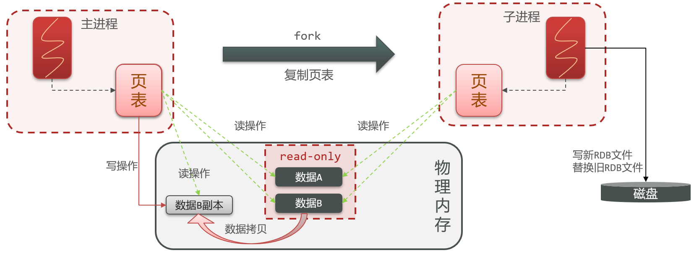

- fork 采用的是 **copy-on-write** 技术：
  - 当主进程执行**读操作**时，访问共享内存
  - 当主进程执行**写操作**时，则会**拷贝一份数据**，执行写操作

## AOF 持久化

### 基本介绍

- AOF，Append Only File（追加文件）
- Redis 处理的每一个写命令都会记录在 AOF 文件，可看做是命令日志文件

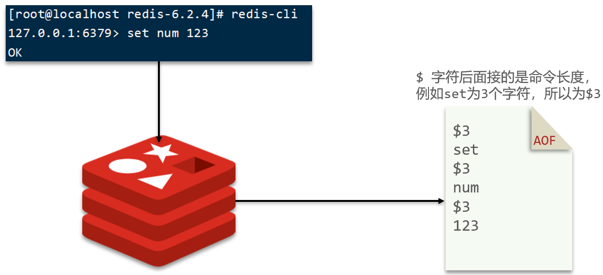

- 因为是**记录命令**，**AOF 文件会比 RDB 文件大的多**；而 **AOF 会记录对同一个 key 的多次写操作**，但只有最后一次写操作才有意义；通过**执行`bgrewriteaof`命令**，可以让 AOF 文件执行重写功能，用**最少的命令达到相同效果**

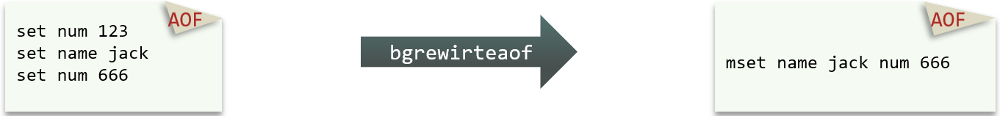

### 相关配置

- AOF 默认是关闭的，需要修改`redis.conf`配置文件来开启 AOF

```
# 是否开启AOF功能，默认是no
appendonly yes
# AOF文件的名称
appendfilename "appendonly.aof"
```

- AOF 的命令记录的频率也可通过`redis.conf`文件来配置

```
# 表示每执行一次写命令，立即记录到AOF文件
appendfsync always 
# 写命令执行完先放入AOF缓冲区，然后表示每隔1秒将缓冲区数据写到AOF文件，是默认方案
appendfsync everysec 
# 写命令执行完先放入AOF缓冲区，由操作系统决定何时将缓冲区内容写回磁盘
appendfsync no
```

| **配置项** | **刷盘时机** | **优点**             | **缺点**                     |
| :--------- | ------------ | -------------------- | ---------------------------- |
| always     | 同步刷盘     | 可靠性高，几乎不丢数 | 性能影响大                   |
| everysec   | 每秒刷盘     | 性能适中             | 最多丢失1秒数据              |
| no         | 操作系统控制 | 性能最好             | 可靠性较差，可能丢失大量数据 |

- Redis 也会在触发阈值时自动去重AO文件，阈值也可在`redis.conf`中配置

```
# AOF文件比上次文件 增长超过多少百分比则触发重写
auto-aof-rewrite-percentage 100
# AOF文件体积最小多大以上才触发重写
auto-aof-rewrite-min-size 64mb
```

## RDB 与 AOF

- 如果对数据安全性要求较高，在实际开发中往往会**结合**两者来使用

|                | **RDB**                                      | **AOF**                                                      |
| -------------- | -------------------------------------------- | ------------------------------------------------------------ |
| 持久化方式     | 定时对整个内存做快照                         | 记录每一次执行的命令                                         |
| 数据完整性     | 不完整，两次备份之间会丢失                   | 相对完整，取决于刷盘策略                                     |
| 文件大小       | 会有压缩，文件体积小                         | 记录命令，文件体积很大                                       |
| 宕机恢复速度   | 很快                                         | 慢                                                           |
| 数据恢复优先级 | 低，因为数据完整性不如 AOF                   | 高，因为数据完整性更高                                       |
| 系统资源占用   | 高，大量 CPU 和内存消耗                      | 低，主要是磁盘 IO 资源，但 AOF 重写时会占用大量 CPU 和内存资源 |
| 使用场景       | 可以容忍数分钟的数据丢失，追求更快的启动速度 | 对数据安全性要求较高常见                                     |

# Redis 主从

## 主从架构

- 单节点 Redis 的并发能力是有上限的，要进一步提高 Redis 的**并发能力**，需要**搭建主从集群，实现读写分离**

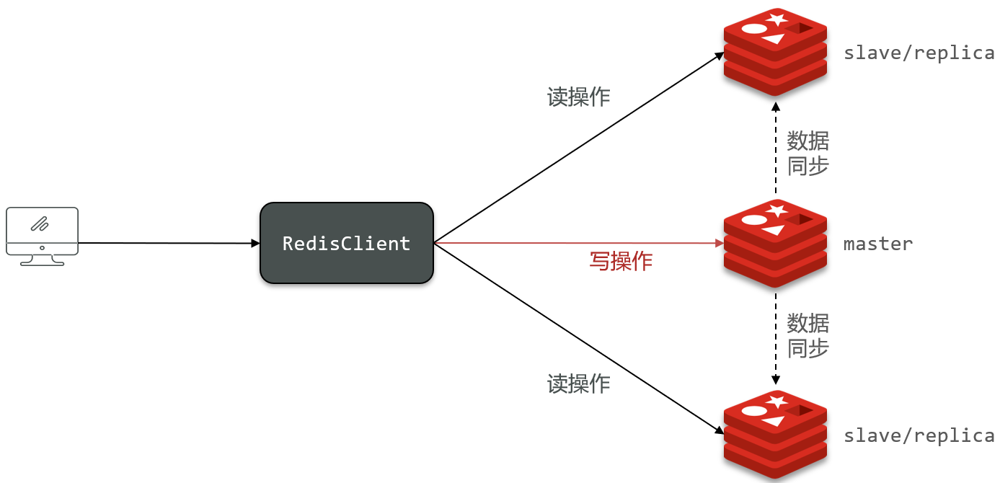

- 具体搭建 Redis 主从集群流程，参考[Redis集群-Redis主从集群](/微服务/Redis/Redis集群?id=_2redis主从集群)
- 假设有 A、B 两个 Redis 实例，如何让 B 作为 A 的 slave 节点？
  - 在 B 节点执行命令：`slaveof A节点IP A节点端口port`

## 数据同步原理

- slave 节点宕机恢复后可以找 master 节点同步数据
- 何时执行全量同步？
  - slave 节点第一次连接 master 节点时
  - slave 节点断开时间太久，`repl_baklog`中的 offset 已经被覆盖时
- 何时执行增量同步
  - slave 节点断开又恢复，并且在`repl_baklog`中能找到 offset 时

### 全量同步

- 主从第一次同步是**全量同步**：master 将完整内存数据生成 RDB，发送 RDB 到 slave；后续命令则记录在`repl_baklog`，逐个发送给 slave

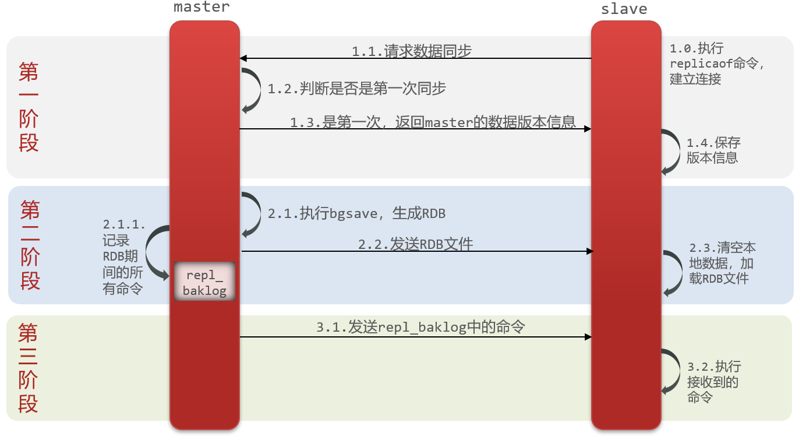

- master 如何判断 slave **是否第一次来同步数据**
  - **判断 Replication Id 是否一致，如果不一致，则是第一次来做数据同步**
  - slave 做数据同步，必须**向 master 声明自己的 replication id 和 offset**，master才可以判断到底需要同步哪些数据
    - Replication Id：简称 replid，是数据集的标记，**id 一致则说明是同一数据集**。每一个 master 都有唯一的 replid，slave 则会继承 master 节点的 replid
    - offset：偏移量，随着记录在`repl_baklog`中的数据增多而逐渐增大。slave 完成同步时也会记录当前同步的 offset；如果 slave 的 offset 小于 master 的 offset，说明 slave 数据落后于 master ，需要更新

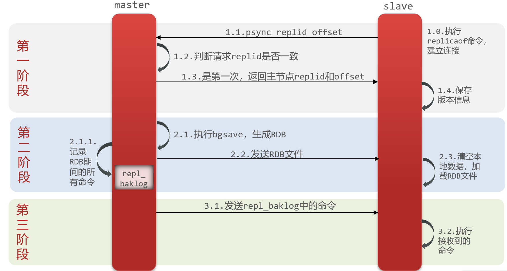

- **全量同步的流程**
  1. slave 节点请求增量同步
  2. master 节点判断 replid，发现不一致，拒绝增量同步
  3. master 将完整内存数据生成 RDB，发送 RDB 到 slave
  4. slave 清空本地数据，加载 master 的 RDB
  5. master 将 RDB 期间的命令记录在`repl_baklog`，并持续将 log 中的命令发送给 slave
  6. slave 执行接收到的命令，保持与 master 之间的同步

### 增量同步

- 如果 slave 重启后同步，则执行**增量同步**：slave 提交自己的 offset 到 master，master 获取`repl_baklog`中从 offset 之后的命令给 slave
  - **`repl_baklog`大小有上限，写满后会覆盖最早的数据**
  - 如果 slave 断开时间过久，导致**尚未备份的数据被覆盖**，则无法基于 log 做增量同步，**只能再次全量同步**

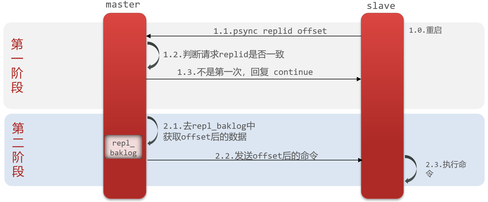

### 优化

- 在 master 中配置`repl-diskless-sync yes`启用无磁盘复制，避免全量同步时的磁盘 IO，将备份文件直接通过网络发送给 salve 节点，无需先将备份文件写入磁盘（适用场景：磁盘空间小、网络带宽大的情况）
- Redis 单节点上的内存占用不要太大，减少 RDB 导致的过多磁盘 IO
- 适当提高`repl_baklog`的大小，发现 slave 宕机时尽快实现故障恢复，尽可能避免全量同步
- 限制一个 master 上的 slave 节点数量，如果实在是太多 slave，则可以采用**主-从-从链式**结构，减少 master 压力

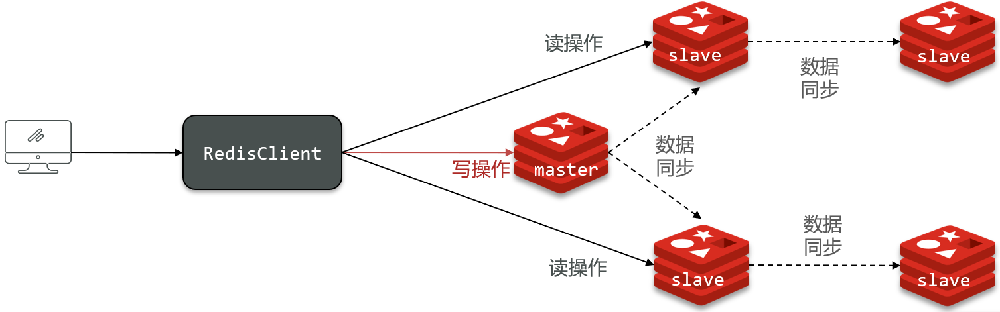

# Redis 哨兵

## 哨兵的作用

- Redis 提供了**哨兵（Sentinel）机制**来实现主从集群的自动故障恢复
  - **监控**：Sentinel 会不断检查 master 和 slave 是否按预期工作
  - **自动故障恢复**：如果 master 故障，Sentinel 会**将一个 slave 提升为 master**，当故障实例恢复后也以新的 master 为主
  - **通知**：Sentinel 充当 Redis 客户端的**服务发现来源**，当集群发生故障转移时，会将最新信息推送给 Redis 的客户端

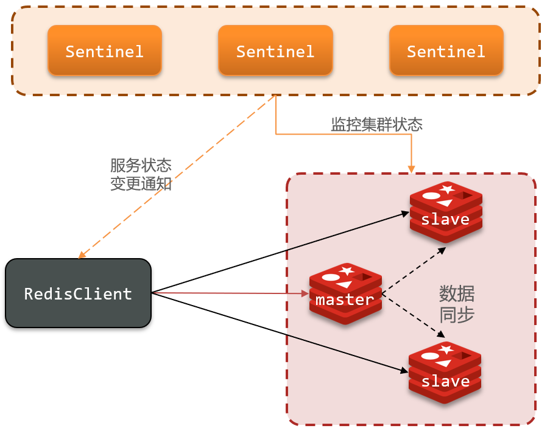

### 服务状态监控

- Sentinel 基于**心跳机制**监测服务状态，每隔1秒向集群的每个实例发送`ping`命令
  - 主观下线：如果某 Sentinel 节点发现某实例未在规定时间响应，则认为该实例主观下线
  - 客观下线：若超过指定数量（quorum）的 Sentinel 都认为该实例主观下线，则该实例客观下线。**quorum 值最好超过 Sentinel 实例数量的一半**

### 选举新 master

- 发现 master 故障，Sentinel 需要在 salve 中选择一个作为新的 master，选择依据如下：
  1. 首先会判断 slave 节点与 master 节点断开时间长短，如果超过指定值（down-after-milliseconds * 10）则会排除该 slave 节点
  2. 然后判断 slave 节点的 slave-priority 值，越小优先级越高，如果是0则永不参与选举
  3. 如果 slave-prority 一样，则判断 slave 节点的 offset 值，越大说明数据越新，优先级越高
  4. 最后是判断 slave 节点的运行 id 大小，越小优先级越高

### 实现故障转移

- 当选中了其中一个 slave 为新的 master 后（例如 slave1），故障转移步骤如下：
  1. Sentinel 给备选的 slave1 节点发送`slaveof no one`命令，让该节点成为 master
  2. Sentinel 给所有其它 slave 发送`slaveof salve的IP salve的端口`命令，让这些 slave 成为新 master 的从节点，开始从新 master 上同步数据
  3. 最后，Sentinel 将故障节点标记为 slave，当故障节点恢复后会自动成为新master 的 slave 节点

## 搭建哨兵架构

- 具体搭建 Redis 哨兵架构，参考[Redis集群-搭建哨兵集群](/微服务/Redis/Redis集群?id=_3搭建哨兵集群)

## RedisTemplate 的哨兵模式

- 在 Sentinel 集群监管下的 Redis 主从集群，其节点会因为自动故障转移而发生变化，**Redis 的客户端必须感知这种变化，及时更新连接信息**
- Spring 的 RedisTemplate 底层利用 lettuce 实现了节点的感知和自动切换

### 步骤

1. 在 pom 文件中引入 Redis 的 starter 依赖

```xml
<dependency>
    <groupId>org.springframework.boot</groupId>
    <artifactId>spring-boot-starter-data-redis</artifactId>
</dependency>
```

2. 配置文件`application.yml`中指定 Sentinel 相关信息

```yaml
spring:
  redis:
    sentinel:
      master: mymaster  # 指定master名称
      nodes:  # 指定redis-sentinel集群信息
        - 8.142.98.103:27001
        - 8.142.98.103:27002
        - 8.142.98.103:27003
```

3. **配置主从读写分离**

```java
// 配置主从读写分离
@Bean
public LettuceClientConfigurationBuilderCustomizer configurationBuilderCustomizer() {
    return clientConfigurationBuilder -> clientConfigurationBuilder.readFrom(ReadFrom.REPLICA_PREFERRED);
}
```

- `ReadFrom`是配置 Redis 的读取策略，是一个枚举，包括以下选择：
  - `MASTER`：从 master 节点读取
  - `MASTER_PREFERRED`：优先从 master 节点读取，master 不可用才读取 replica
  - `REPLICA`：从 slave（replica）节点读取
  - **`REPLICA _PREFERRED`（推荐使用）：优先从 slave（replica）节点读取，所有的 slave 都不可用才读取 master**


# Redis 分片集群

## 分片集群结构

- **主从**和**哨兵**可以解决**高并发读**、**高可用**的问题；**分片集群**解决**海量数据存储**、**高并发写**的问题
- 分片集群的特征
  - 集群中有多个 master，**每个 master 保存不同数据**
  - 每个 master 都可以**有多个 slave 节点**
  - **master 之间通过`ping`监测彼此健康状态**（master 之间相当于哨兵）
  - 客户端请求可以访问集群任意节点，最终都会**被转发到正确节点**

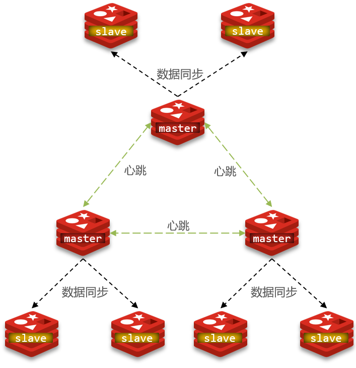

## 搭建分片集群

- 具体搭建 Redis 分片集群，参考[Redis集群-搭建分片集群](/微服务/Redis/Redis集群?id=_4搭建分片集群)

## 散列插槽

- Redis 会把每一个 master 节点映射到`0~16383`共`16384`个**插槽（hash slot）**上

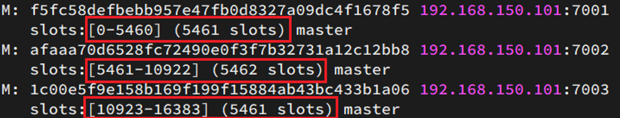

- **数据 key** 不是与节点绑定，而是**与插槽绑定**。Redis 会根据 key 的有效部分计算插槽值，分两种情况：
  - **key 中包含"{}"**，且“{}”中至少包含1个字符，“{}”中的部分是有效部分
  - key 中不包含“{}”，整个 key 都是有效部分

> 例如：key 是 num，那么就根据 num 计算，如果是{order}num，则根据 order 计算
>
> 计算方式是利用 CRC16 算法得到一个 hash 值，然后对16384取余，得到的结果就是 slot 值

- **数据 key 与插槽绑定的好处**：当节点宕机或进行节点扩容时，依然可以通过插槽找到相应的数据 key
- **Redis 如何判断某个 key 应该在哪个实例？**
  1. 将16384个插槽分配到不同的实例
  2. 根据 key 的有效部分计算哈希值，对16384取余
  3. 余数作为插槽，寻找插槽所在实例即可
- **如何将同一类数据固定的保存在同一个 Redis 实例？**
  - 这一类数据使用相同的有效部分，例如 key 都以`{typeId}`为前缀

## 集群伸缩

> `redis-cli --cluster`提供了很多操作集群的命令，可以通过`redis-cli --cluster help`查看
>
> 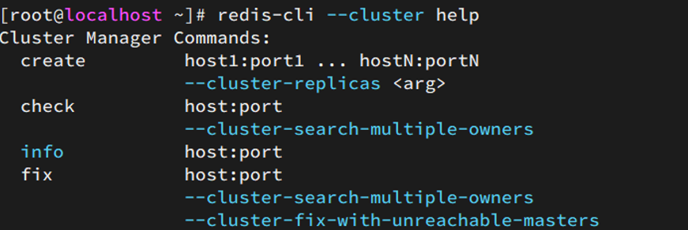

- 添加一个节点到集群：`add-node`

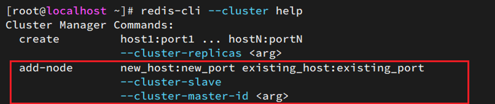

- 分配插槽：`reshard`

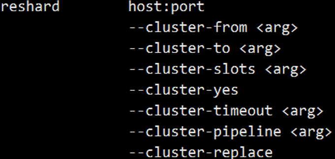

## 故障转移

- 某个 master 宕机 :arrow_right: 该实例与其它实例失去连接 :arrow_right: 疑似宕机（主观下线） :arrow_right: 确定下线（客观下线），自动提升一个 slave 为新 master

## 数据迁移

- 利用`cluster failover`命令可以手动让集群中的某个 master 宕机，切换到执行`cluster failover`命令的这个 slave 节点，实现无感知的数据迁移。其流程如下：

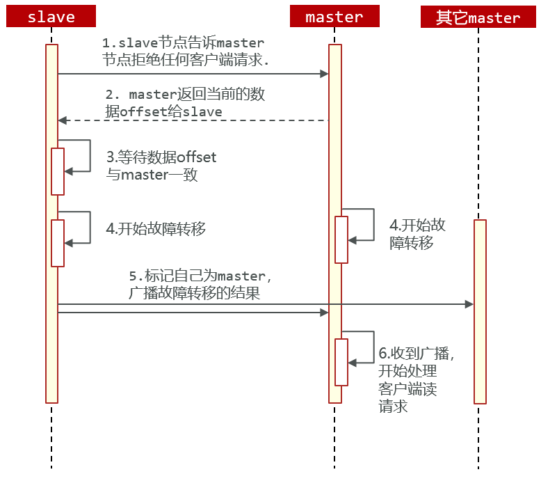

- 手动的`cluster failover`支持三种不同模式：
  - 缺省：默认流程，上图1~6歩
  - force：省略了对 offset 的一致性校验
  - takeover：直接执行第5步，忽略数据一致性、忽略 master 状态和其它 master 的意见

## RedisTemplate 访问分片集群

- RedisTemplate 底层同样基于 lettuce 实现了分片集群的支持，使用的步骤与哨兵模式基本一致
1. 引入 Redis 的 starter 依赖

```xml
<dependency>
    <groupId>org.springframework.boot</groupId>
    <artifactId>spring-boot-starter-data-redis</artifactId>
</dependency>
```

2. 配置分片集群地址（略有差异）

```yaml
spring:
  redis:
    cluster:
      nodes: # 指定分片集群的每一个节点信息
        - 8.142.98.103:7001
        - 8.142.98.103:7002
        - 8.142.98.103:7003
        - 8.142.98.103:8001
        - 8.142.98.103:8002
        - 8.142.98.103:8003
```

3. 配置读写分离

```java
// 配置主从读写分离
@Bean
public LettuceClientConfigurationBuilderCustomizer configurationBuilderCustomizer() {
    return clientConfigurationBuilder -> clientConfigurationBuilder.readFrom(ReadFrom.REPLICA_PREFERRED);
}
```

