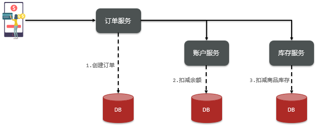
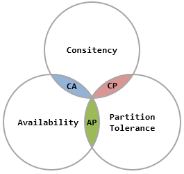
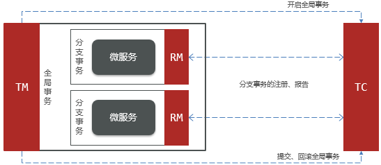
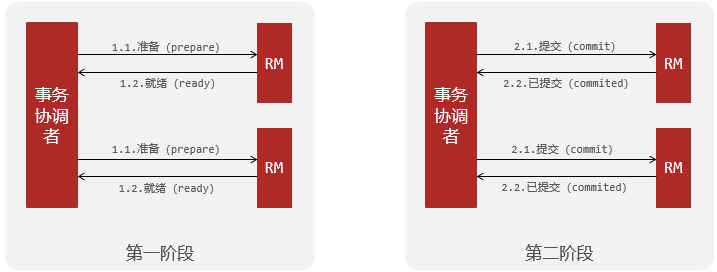
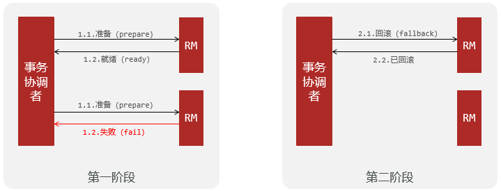
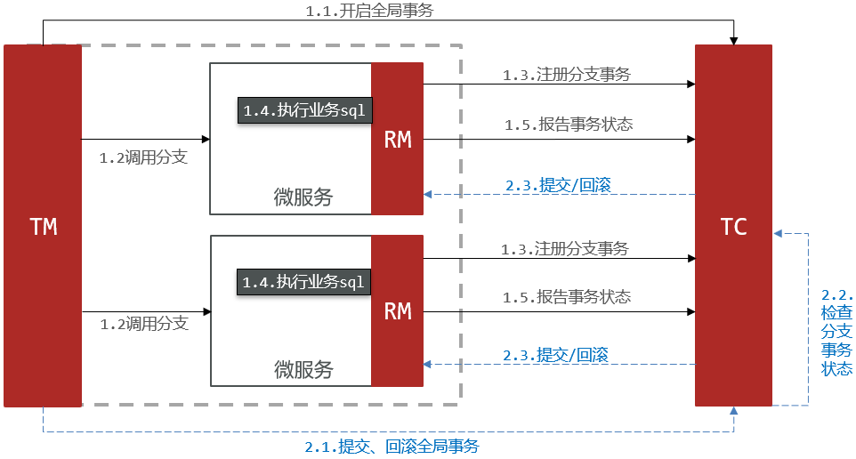
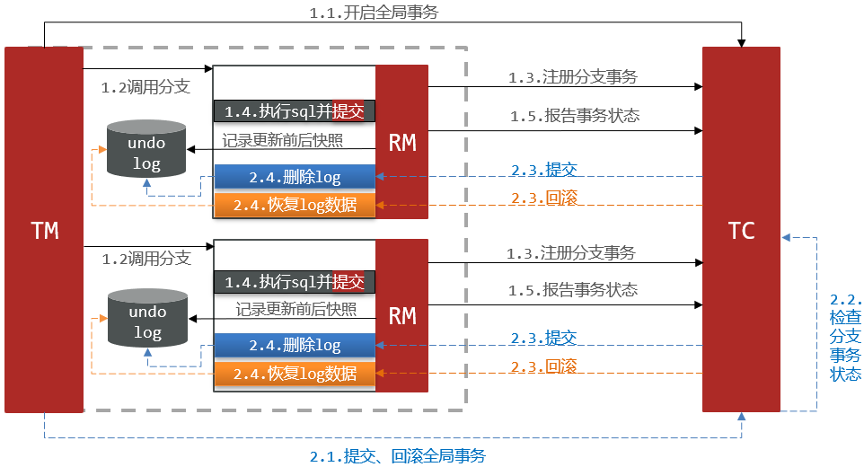
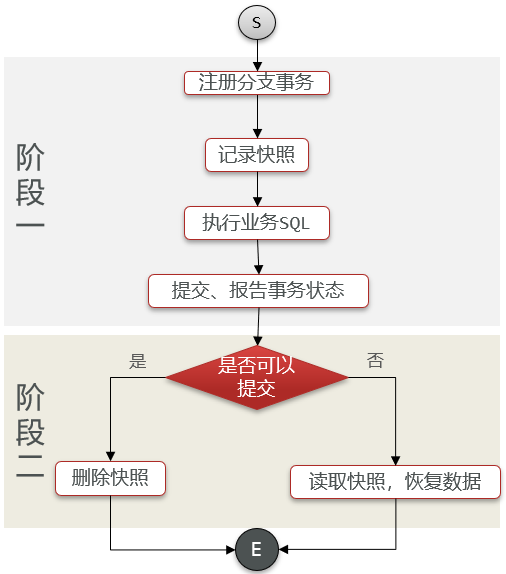
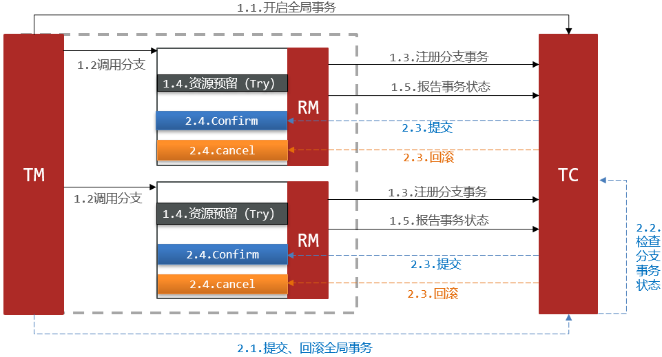
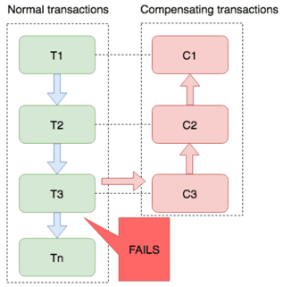

# 分布式服务的事务问题

- **分布式事务**：在分布式系统下，一个业务跨越多个服务或数据源，每个服务都是一个分支事务，要保证所有分支事务最终状态一致，这样的事务就是分布式事务



# CAP 定理

- CAP 定理：分布式系统无法同时满足以下三个指标
  - Consistency（一致性）：用户访问分布式系统中的任意节点，得到的数据必须一致
  - Availability（可用性）：用户访问集群中的任意健康节点，必须能得到响应，而不是超时或拒绝
  - Partition tolerance （分区容错性）
    - Partition（分区）：因为网络故障或其它原因导致分布式系统中的部分节点与其它节点失去连接，形成独立分区
    - Tolerance（容错）：在集群出现分区时，整个系统也要持续对外提供服务



- CAP 定理的本质：分布式系统节点通过网络连接，一定会出现分区问题（P）；当分区出现时，系统的一致性（C）和可用性（A）就无法同时满足

> 举例：ElasticSearch 集群是 CP
>
> - ES 集群出现分区时，故障节点会被剔除集群，数据分片会重新分配到其它节点，保证数据一致。因此是低可用性，高一致性，属于 CP

# BASE 理论

BASE 理论是对 CAP 的一种解决思路，包含三个思想：

- **Basically Available（基本可用）**：分布式系统在出现故障时，允许损失部分可用性，即保证核心可用
- **Soft State（软状态）**：在一定时间内，允许出现中间状态，比如临时的不一致状态
- **Eventually Consistent（最终一致性）**：虽然无法保证强一致性，但是在软状态结束后，最终达到数据一致

分布式事务最大的问题是各个子事务的一致性问题，因此可以借鉴 CAP 定理和 BASE 理论：
- **AP 模式**：各子事务分别执行和提交，允许出现结果不一致，然后采用弥补措施恢复数据即可，实现**最终一致**
- **CP 模式**：各个子事务执行后互相等待，同时提交，同时回滚，达成**强一致**；但事务等待过程中，处于弱可用状态

# 分布式事务模型

- 解决分布式事务，各个子系统之间必须能**感知到彼此的事务状态**，才能保证状态一致，因此需要一个事务协调者来协调每一个事务的参与者（子系统事务）
  - **分支事务**：子系统事务
  - **全局事务**：有关联的各个分支事务的集合
- **最终一致思想**：各分支事务分别执行并提交，如果有不一致的情况，再想办法恢复数据
- **强一致思想**：各分支事务执行完业务不要提交，等待彼此结果，而后统一提交或回滚

# Seata

- [Seata](http://seata.io/) 是 2019 年 1 月份蚂蚁金服和阿里巴巴共同开源的分布式事务解决方案，官网中的文档、博客中提供了大量的使用说明、源码分析

## Seata 架构

Seata 事务管理中有三个重要的角色：

- **TC（Transaction Coordinator），事务协调者**：维护全局和分支事务的状态，协调全局事务提交或回滚
- **TM（Transaction Manager），事务管理器**：定义全局事务的范围、开始全局事务、提交或回滚全局事务
- **RM（Resource Manager），资源管理器**：管理分支事务处理的资源，**与 TC 交谈**以注册分支事务和报告分支事务的状态，并驱动分支事务提交或回滚



## Seata 解决方案

- XA 模式：强一致性分阶段事务模式，牺牲了一定的可用性，无业务侵入
- AT 模式：最终一致的分阶段事务模式，无业务侵入，也是 Seata 的默认模式
- TCC 模式：最终一致的分阶段事务模式，有业务侵入
- SAGA 模式：长事务模式，有业务侵入

## 部署 TC 服务

- 详细步骤可以参考[Seata部署和集成](/微服务/Seata/Seata部署和集成?id=一、部署seata的tc-server)

## 微服务集成 Seata

- 详细步骤可以参考[Seata部署和集成](/微服务/Seata/Seata部署和集成?id=二、微服务集成seata)
- Nacos 服务名称组成包括：namespace + group + serviceName + cluster
- Seata 客户端获取 tc 的 cluster 名称方式：以`tx-group-service`的值为`key`到`vgroupMapping`中查找

# XA 模式

## XA 模式原理

- XA 规范 是 X/Open 组织定义的分布式事务处理（DTP，Distributed Transaction Processing）标准，XA 规范 描述了全局的 TM 与局部的 RM 之间的接口，**几乎所有主流的数据库都对 XA 规范 提供了支持**





## Seata 的 XA 模式

- RM 一阶段的工作：
  1. 注册分支事务到 TC
  2. 执行分支业务 sql 但不提交
  3. 报告执行状态到 TC
- TC 二阶段的工作：
  - TC 检测各分支事务执行状态
    - 如果都成功，通知所有RM提交事务
    - 如果有失败，通知所有RM回滚事务
- RM 二阶段的工作：
  - 接收 TC 指令，提交或回滚事务



## 优缺点

- XA 模式的优点
  - 事务的**强一致性**，满足 [ACID 原则](/JavaWeb/数据库?id=事务的四大特征-acid)
  - **常用数据库都支持**，实现简单，并且没有代码侵入
- XA 模式的缺点
  - 因为一阶段需要**锁定数据库资源**，等待二阶段结束才释放，**性能较差**
  - **依赖关系型数据库实现事务**

## 实现 XA 模式

Seata 的 starter 已经完成了 XA 模式的自动装配，实现非常简单，步骤如下：

1. 修改`application.yml`文件（每个参与事务的微服务），开启 XA 模式

```yaml
seata:
  data-source-proxy-mode: XA # 开启数据源代理的XA模式
```

2. 给发起全局事务的入口方法添加`@GlobalTransactional`注解，比如`OrderServiceImpl`中的`create`方法

```java
@Override
@GlobalTransactional
public Long create(Order order) {
    // 创建订单
    orderMapper.insert(order);
    // 扣余额 ...略 
    // 扣减库存 ...略
    return order.getId();
}
```

3. 重启服务并测试

# AT 模式

## AT 模式原理

- 阶段一 RM 的工作：
  - 注册分支事务
  - **记录`undo-log`（数据快照）**
  - 执行业务 sql 并**提交**
  - 报告事务状态
- 阶段二提交时 RM 的工作：
  - 删除`undo-log`即可
- 阶段二回滚时 RM 的工作：
  - 根据`undo-log`恢复数据到更新前





## AT 模式与 XA 模式最大的区别

- XA 模式一阶段不提交事务，锁定资源；AT 模式一阶段直接提交，不锁定资源
- XA 模式依赖数据库机制实现回滚；AT 模式利用数据快照实现数据回滚
- XA 模式强一致；AT 模式最终一致

## AT 模式的写隔离

- AT 模式下，写数据除了需要获取数据库锁（DB锁），还需要获取**全局锁**（由 TC 记录当前正在操作某行数据的事务，该事务持有全局锁，具备执行权）
- 快照记录分两个部分
  - 原来的记录（**before-image**）
  - 修改后的记录（**after-image**）

## 优缺点

- AT 模式的优点
  - 一阶段完成直接提交事务，释放数据库资源，**性能比较好**
  - 利用**全局锁实现读写隔离**（避免脏写）
  - 没有代码侵入，框架自动完成回滚和提交
- AT 模式的缺点
  - 两阶段之间属于**软状态**，属于最终一致
  - 框架的快照功能会影响性能，但比 XA 模式要好很多

## 实现 AT 模式

AT 模式中的快照生成、回滚等动作都是由框架自动完成，没有任何代码侵入

1. `lock_table`导入到 TC 服务关联的数据库，`undo_log`表导入到微服务关联的数据库
- `lock_table`

```sql
-- ----------------------------
-- Table structure for lock_table
-- ----------------------------
DROP TABLE IF EXISTS `lock_table`;
CREATE TABLE `lock_table`  (
  `row_key` varchar(128) CHARACTER SET utf8 COLLATE utf8_general_ci NOT NULL,
  `xid` varchar(96) CHARACTER SET utf8 COLLATE utf8_general_ci NULL DEFAULT NULL,
  `transaction_id` bigint(20) NULL DEFAULT NULL,
  `branch_id` bigint(20) NOT NULL,
  `resource_id` varchar(256) CHARACTER SET utf8 COLLATE utf8_general_ci NULL DEFAULT NULL,
  `table_name` varchar(32) CHARACTER SET utf8 COLLATE utf8_general_ci NULL DEFAULT NULL,
  `pk` varchar(36) CHARACTER SET utf8 COLLATE utf8_general_ci NULL DEFAULT NULL,
  `gmt_create` datetime NULL DEFAULT NULL,
  `gmt_modified` datetime NULL DEFAULT NULL,
  PRIMARY KEY (`row_key`) USING BTREE,
  INDEX `idx_branch_id`(`branch_id`) USING BTREE
) ENGINE = InnoDB CHARACTER SET = utf8 COLLATE = utf8_general_ci ROW_FORMAT = Compact;
```

- `undo_log`

```sql
-- ----------------------------
-- Table structure for undo_log
-- ----------------------------
DROP TABLE IF EXISTS `undo_log`;
CREATE TABLE `undo_log`  (
  `branch_id` bigint(20) NOT NULL COMMENT 'branch transaction id',
  `xid` varchar(100) CHARACTER SET utf8 COLLATE utf8_general_ci NOT NULL COMMENT 'global transaction id',
  `context` varchar(128) CHARACTER SET utf8 COLLATE utf8_general_ci NOT NULL COMMENT 'undo_log context,such as serialization',
  `rollback_info` longblob NOT NULL COMMENT 'rollback info',
  `log_status` int(11) NOT NULL COMMENT '0:normal status,1:defense status',
  `log_created` datetime NOT NULL COMMENT 'create datetime',
  `log_modified` datetime NOT NULL COMMENT 'modify datetime',
  UNIQUE INDEX `ux_undo_log`(`xid`, `branch_id`) USING BTREE
) ENGINE = InnoDB CHARACTER SET = utf8 COLLATE = utf8_general_ci COMMENT = 'AT transaction mode undo table' ROW_FORMAT = Compact;
```

2. 修改`application.yml`文件，将事务模式修改为 AT 模式

```yaml
seata:
  data-source-proxy-mode: AT # 开启数据源代理的AT模式
```

3. 重启服务并测试

# TCC 模式

## TCC 模式原理

- TCC 模式与 AT 模式非常相似，每阶段都是独立事务，不同的是 TCC 通过人工编码来实现数据恢复。需要实现三个方法：
  - **Try：资源的检测和预留**
  - **Confirm：业务执行和提交**；要求 Try 成功 Confirm 一定要能成功
  - **Cancel：预留资源释放**，可以理解为 Try 的反向操作



## 优缺点

- TCC 的优点
  - **一阶段完成直接提交事务**，释放数据库资源，**性能好**
  - 相比AT模型，无需生成快照，无需使用全局锁，**性能最强**
  - **不依赖数据库事务**，而是依赖补偿操作，**可以用于非事务型数据库**
- TCC 的缺点
  - 有**代码侵入**，需要人为编写 Try、Confirm 和 Cancel 接口，太麻烦
  - **软状态**，事务是最终一致
  - 需要考虑 Confirm 和 Cancel 的失败情况，**做好幂等处理**

## TCC 的空回滚和业务悬挂

- **空回滚**：当某分支事务的 Try 阶段阻塞时，可能导致全局事务超时而触发二阶段的 Cancel 操作；在未执行 Try 操作时先执行了 Cancel 操作，这时 Cancel 不能做回滚
- **业务悬挂**：对于已经空回滚的业务，如果以后继续执行 Try ，就永远不可能 Confirm 或 Cancel
  - 应当阻止执行空回滚后的 Try 操作，避免悬挂

## 实现 TCC 模式

> 假设：
>
> - 修改account-service，编写try、confirm、cancel逻辑
>- try 业务：添加冻结金额，扣减可用金额
> - confirm 业务：删除冻结金额
>- cancel 业务：删除冻结金额，恢复可用金额
> - 保证 confirm、cancel 接口的幂等性
>- 允许空回滚
> - 拒绝业务悬挂
>

### 业务分析

- 为了实现空回滚、防止业务悬挂，以及幂等性要求，必须在**数据库记录冻结金额的同时，记录当前事务 id 和执行状态，为此设计一张表**

```sql
CREATE TABLE `account_freeze_tbl` (
  `xid` varchar(128) NOT NULL,
  `user_id` varchar(255) DEFAULT NULL COMMENT '用户id',
  `freeze_money` int(11) unsigned DEFAULT '0' COMMENT '冻结金额',
  `state` int(1) DEFAULT NULL COMMENT '事务状态，0:try，1:confirm，2:cancel',
  PRIMARY KEY (`xid`) USING BTREE
) ENGINE=InnoDB DEFAULT CHARSET=utf8 ROW_FORMAT=COMPACT;

```

### 声明 TCC 接口

- TCC的 Try、Confirm、Cancel 方法都需要在接口中基于注解来声明

```java
@LocalTCC
public interface TCCService {
    /**
    * Try逻辑，@TwoPhaseBusinessAction中的name属性要与当前方法名一致，用于指定Try逻辑对应的方法
    */
    @TwoPhaseBusinessAction(name = "prepare", commitMethod = "confirm", rollbackMethod = "cancel")
    void prepare(@BusinessActionContextParameter(paramName = "param") String param);
    /**
    * 二阶段confirm确认方法、可以另命名，但要保证与commitMethod一致 
    *
    * @param context 上下文,可以传递try方法的参数
    * @return boolean 执行是否成功
    */
    boolean confirm (BusinessActionContext context);
    /**
    * 二阶段回滚方法，要保证与rollbackMethod一致
    */
    boolean cancel (BusinessActionContext context);
```

### 实现 TCC 接口

```java
@Slf4j
@Service
public class AccountTCCServiceImpl implements TCCService {

    @Autowired
    private AccountMapper accountMapper;
    @Autowired
    private AccountFreezeMapper freezeMapper;

    @Override
    public void deduct(String userId, int money) {
        // 0.获取事务id
        String xid = RootContext.getXID();
        // 判断freeze中是否有冻结记录，如果有，一定是CANCEL执行过，需要拒绝业务，避免业务悬挂
        AccountFreeze oldFreeze = freezeMapper.selectById(xid);
        if(oldFreeze != null) {
            // CANCEL执行过，需要拒绝业务，避免业务悬挂
            return;
        }
        // 1.扣减可用余额（因为money在数据库中定义为unsigned，所以无需判断余额是否为零，可以直接执行扣减）
        accountMapper.deduct(userId, money);
        // 2.记录冻结金额，事务状态
        AccountFreeze freeze = new AccountFreeze();
        freeze.setUserId(userId);
        freeze.setFreezeMoney(money);
        freeze.setState(AccountFreeze.State.TRY);
        freeze.setXid(xid);
        freezeMapper.insert(freeze);
    }

    @Override
    public boolean confirm(BusinessActionContext ctx) {
        // 1.获取事务id
        String xid = ctx.getXid();
        // 2.根据id删除冻结记录
        int count = freezeMapper.deleteById(xid);
        return count == 1;
    }

    @Override
    public boolean cancel(BusinessActionContext ctx) {
        // 0.查询冻结记录
        String xid = ctx.getXid();
        String userId = ctx.getActionContext("userId").toString();
        AccountFreeze freeze = freezeMapper.selectById(xid);
        // 空回滚的判断，判断freeze是否为null，为null证明try没执行，需要空回滚
        if(freeze == null) {
            freeze = new AccountFreeze();
            freeze.setUserId(userId);
            freeze.setFreezeMoney(0);
            freeze.setState(AccountFreeze.State.CANCEL);
            freeze.setXid(xid);
            freezeMapper.insert(freeze);
            return true;
        }
        // 幂等判断
        if(freeze.getState() == AccountFreeze.State.CANCEL) {
            // 已经处理过一次CANCEL，无需重复处理
            return true;
        }

        // 1.恢复可用余额
        accountMapper.refund(freeze.getUserId(), freeze.getFreezeMoney());
        // 2.将冻结金额清零，状态改为CANCEL
        freeze.setFreezeMoney(0);
        freeze.setState(AccountFreeze.State.CANCEL);
        int count = freezeMapper.updateById(freeze);
        return count == 1;
    }
}
```

# Saga 模式

## Saga 模式原理

Saga 模式是 Seata 提供的长事务解决方案，分为两个阶段：
- 一阶段：直接提交本地事务
- 二阶段：成功则什么都不做；失败则通过编写补偿业务来回滚



## 优缺点

- Saga 模式优点
  - 事务参与者可以基于事件驱动实现异步调用，吞吐高
  - 一阶段直接提交事务，无锁，性能好
  - 不用编写 TCC 中的三个阶段，实现简单
- Saga 模式缺点
  - 软状态持续时间不确定，时效性差
  - 没有锁，没有事务隔离，会有脏写

# 四种模式对比

|              | **XA**                         | **AT**                                       | **TCC**                                                   | **SAGA**                                                     |
| ------------ | ------------------------------ | -------------------------------------------- | --------------------------------------------------------- | ------------------------------------------------------------ |
| **一致性**   | 强一致                         | 弱一致                                       | 弱一致                                                    | 最终一致                                                     |
| **隔离性**   | 完全隔离                       | 基于全局锁隔离                               | 基于资源预留隔离                                          | 无隔离                                                       |
| **代码侵入** | 无                             | 无                                           | 有，要编写三个接口                                        | 有，要编写状态机和补偿业务                                   |
| **性能**     | 差                             | 好                                           | 非常好                                                    | 非常好                                                       |
| **场景**     | 对一致性、隔离性有高要求的业务 | 基于关系型数据库的大多数分布式事务场景都可以 | 1. 对性能要求较高的事务；2.有非关系型数据库要参与的事务。 | 1. 业务流程长、业务流程多；2. 参与者包含其它公司或遗留系统服务，无法提供 TCC 模式要求的三个接口 |

- 弱一致，其实也是最终一致，只是其软状态的持续时间比较短；而 SAGA 的软状态的持续时间会相对更久一点
- AT 模式使用场景最多
- TCC 模式性能最好

# 高可用

- TC 的异地多机房容灾架构
  - TC 服务作为 Seata 的核心服务，一定要保证高可用和异地容灾
- 详细步骤可以参考[Seata部署和集成](/微服务/Seata/Seata部署和集成?id=三、tc服务的高可用和异地容灾)
