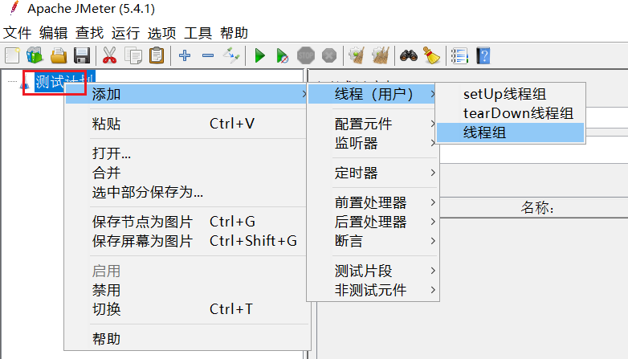
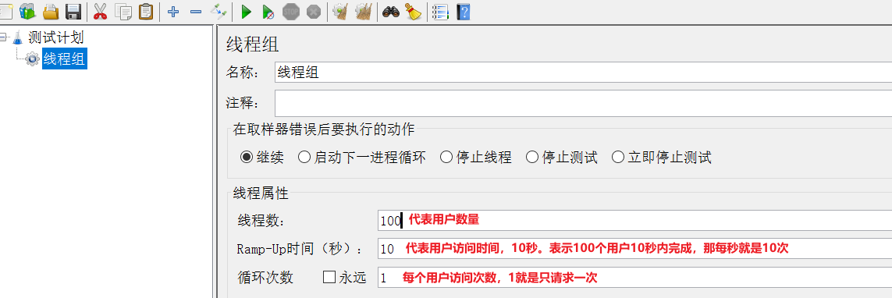

# 1.安装 Jmeter

- Jmeter 依赖于 JDK，所以必须确保当前计算机上已经安装了 JDK，并且配置了环境变量

## 1.1.下载

- [Apache Jmeter官网下载](http://jmeter.apache.org/download_jmeter.cgi)

## 1.2.解压

- 因为下载的是 zip 包，解压缩即可使用，其中的 bin 目录是执行的脚本，其中包含启动脚本

### 1.3.运行

- 双击`jmeter.bat`即可运行，有两点注意
  - 启动速度比较慢
  - 启动后明命令窗口不能关闭，否则 Jmeter 也会关闭

# 2.快速入门

## 2.1.设置中文语言

- 默认 Jmeter 的语言是英文，需要设置


- **注意**：上面的配置只能保证本次运行是中文，如果要永久中文，需要修改 Jmeter 的配置文件
  - 打开 Jmeter 文件夹，在 bin 目录中找到**jmeter.properties**，添加下面配置

```properties
language=zh_CN
```


## 2.2.基本用法

1. 在测试计划上点鼠标右键，选择添加 > 线程（用户） > 线程组：



2. 在新增的线程组中，填写线程信息：



3. 给线程组点鼠标右键，添加 http 取样器：


4. 编写取样器内容：


5. 添加监听报告：


6. 添加监听结果树：


7. 汇总报告结果：


8. 结果树：


# 3.JMeter命令行

## 3.1.在windows上录好jmx

## 3.2.命令行

```bash
/usr/local/jmeter/apache-jmeter-5.4.2/bin/jmeter.sh -n -t XXX.jmx -l result.jtl
```

## 3.3.把result.jtl导入Jmeter

