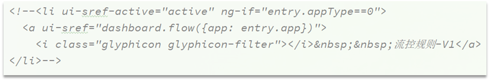

# 一、修改order-service服务

- 修改`OrderService`，让其监听 Nacos 中的 Sentinel 规则配置

## 1.引入依赖

- 在`order-service`中引入 Sentinel 监听 Nacos 的依赖

```xml
<dependency>
    <groupId>com.alibaba.csp</groupId>
    <artifactId>sentinel-datasource-nacos</artifactId>
</dependency>
```

## 2.配置 Nacos 地址

- 在`order-service`中的`application.yml`文件配置 Nacos 地址及监听的配置信息

```yaml
spring:
  cloud:
    sentinel:
      datasource:
        flow: # 限流
          nacos:
            server-addr: localhost:8848 # nacos地址
            dataId: orderservice-flow-rules
            groupId: SENTINEL_GROUP
            rule-type: flow # 还可以是：degrade降级、authority授权、param-flow热点限流
```

# 二、修改 sentinel-dashboard 源码

- SentinelDashboard 默认不支持 Nacos 的持久化，需要修改源码

## 1. 解压

- 解压 Sentinel 源码包


- 用 IDEA 打开这个项目，结构如下


## 2. 修改nacos依赖

- 在 Sentinel-dashboard 源码的 pom 文件中，nacos的依赖默认的scope是test，只能在测试时使用，这里要去除：


- 将sentinel-datasource-nacos依赖的scope去掉：

```xml
<dependency>
    <groupId>com.alibaba.csp</groupId>
    <artifactId>sentinel-datasource-nacos</artifactId>
</dependency>
```

## 3. 添加nacos支持

在sentinel-dashboard的test包下，已经编写了对nacos的支持，我们需要将其拷贝到main下。


## 4. 修改nacos地址

- 需要修改测试代码中的NacosConfig类：


- 修改其中的nacos地址，让其读取application.properties中的配置：


- 在sentinel-dashboard的application.properties中添加nacos地址配置：

```properties
nacos.addr=localhost:8848
```

## 5. 配置nacos数据源

- 还需要修改com.alibaba.csp.sentinel.dashboard.controller.v2包下的FlowControllerV2类：


- 让添加的Nacos数据源生效：


## 6. 修改前端页面

- 修改前端页面，添加一个支持nacos的菜单
- 修改src/main/webapp/resources/app/scripts/directives/sidebar/目录下的sidebar.html文件：


- 将其中的这部分注释打开：



- 修改其中的文本：


## 7. 重新编译、打包项目

- 运行IDEA中的maven插件，编译和打包修改好的Sentinel-Dashboard：


## 8.启动

- 启动方式跟官方一样

```bash
java -jar sentinel-dashboard.jar
```

- 如果要修改nacos地址，需要添加参数

```bash
java -jar -Dnacos.addr=localhost:8848 sentinel-dashboard.jar
```
