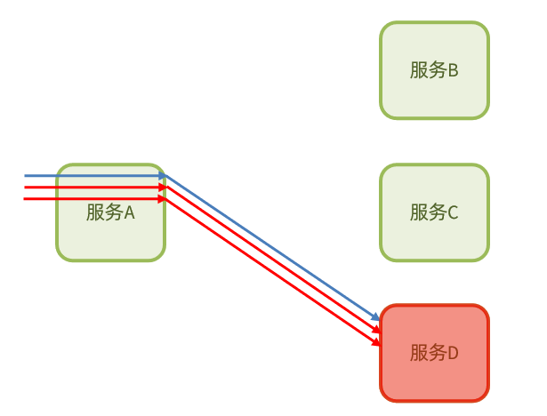
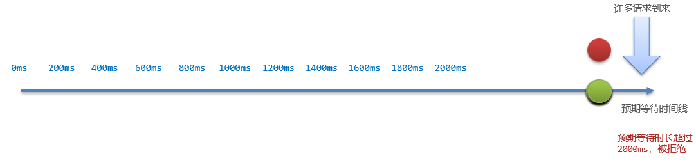
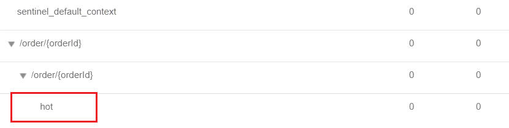
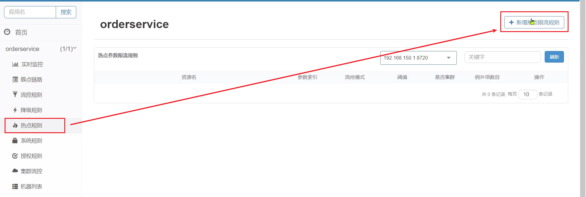
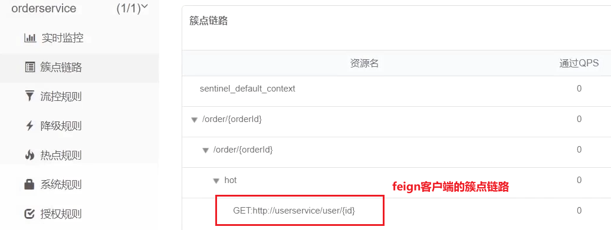
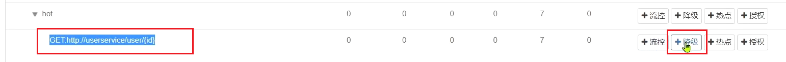

# 1.Sentinel 概述

## 1.1.雪崩问题及解决方案

### 1.1.1.雪崩问题

- 雪崩问题：微服务之间相互调用，因为调用链中的一个服务故障，引起整个链路都无法访问的情况
  - 服务器支持的线程和并发数有限，请求一直阻塞，会导致服务器资源耗尽，从而导致所有其它服务都不可用，那么当前服务也就不可用了
  - **依赖于当前服务的其它服务随着时间的推移，最终也会变为不可用，形成级联失败，造成雪崩问题**


> 解决雪崩问题的常见方式有以下四种：
>
> 1. 超时处理
> 2. 线程隔离
> 3. 熔断降级
> 4. 限流

### 1.1.2.超时处理

- 超时处理：设定超时时间，请求超过一定时间没有响应就返回错误信息，不会无休止等待
- **缺点**：超时处理只能缓解雪崩问题，不能根本解决雪崩问题，当请求速度超过释放速度，也会造成雪崩


### 1.1.3.舱壁模式

- 舱壁模式：限定每个业务能使用的线程数，避免耗尽整个 tomcat 的资源，也叫**线程隔离**
- 缺点：不能避免该服务重复访问故障的服务，依然会造成 tomcat 资源的浪费


### 1.1.4.断路器

- **熔断降级**（断路器模式）：由**断路器**统计业务执行的**异常比例**，如果超出阈值则会**熔断**该业务，拦截访问该业务的一切请求
- 断路器会统计访问某个服务的请求数量和**异常比例**



- 当发现访问服务 D 的请求异常比例过高时，认为服务D有导致雪崩的风险，会拦截访问服务 D 的一切请求，形成熔断：


### 1.1.5.限流

- **流量控制**：限制业务访问的QPS（reQuest Per Second），避免服务因流量的突增而故障
- Sentinel 根据受保护的服务能承受的请求流量来限制业务访问的 QPS


> **限流**是对服务的保护，避免因瞬间高并发流量而导致服务故障，进而避免雪崩。是一种**预防**措施
>
> **超时处理、线程隔离、降级熔断**是在部分服务故障时，将故障控制在一定范围，避免雪崩。是一种**补救**措施

## 1.2.服务保护技术对比

- 在 SpringCloud 当中支持多种服务保护技术：
  - [Netfix Hystrix](https://github.com/Netflix/Hystrix)
  - [Sentinel](https://github.com/alibaba/Sentinel)：阿里巴巴开源的一款微服务流量控制组件，官方文档：https://sentinelguard.io/zh-cn/index.html
  - [Resilience4J](https://github.com/resilience4j/resilience4j)
- 早期比较流行的是 Hystrix 框架，目前国内使用最广泛的是阿里巴巴的 Sentinel 框架

|                  | **Sentinel**                                   | **Hystrix**                   |
| ---------------- | ---------------------------------------------- | ----------------------------- |
| **隔离策略**     | 信号量隔离                                     | 线程池隔离/信号量隔离         |
| **熔断降级策略** | 基于慢调用比例或异常比例                       | 基于失败比率                  |
| 实时指标实现     | 滑动窗口                                       | 滑动窗口（基于 RxJava）       |
| 规则配置         | 支持多种数据源                                 | 支持多种数据源                |
| 扩展性           | 多个扩展点                                     | 插件的形式                    |
| 基于注解的支持   | 支持                                           | 支持                          |
| **限流**         | 基于 QPS，支持基于调用关系的限流               | 有限的支持                    |
| **流量整形**     | 支持慢启动、匀速排队模式                       | 不支持                        |
| 系统自适应保护   | 支持                                           | 不支持                        |
| **控制台**       | 开箱即用，可配置规则、查看秒级监控、机器发现等 | 不完善                        |
| 常见框架的适配   | Servlet、Spring Cloud、Dubbo、gRPC 等          | Servlet、Spring Cloud Netflix |

## 1.3.Sentinel 安装

1. 下载：Sentinel 官方提供了 UI 控制台，方便使用者对系统做限流设置，可在[GitHub](https://github.com/alibaba/Sentinel/releases)下载
2. 运行：将 jar 包放到任意非中文目录，执行命令

```shell
java -jar sentinel-dashboard-1.8.1.jar
```

- 如果要修改 Sentinel 的默认端口、账户、密码，可以通过下列配置：

| **配置项**                       | **默认值** | **说明**   |
| -------------------------------- | ---------- | ---------- |
| server.port                      | 8080       | 服务端口   |
| sentinel.dashboard.auth.username | sentinel   | 默认用户名 |
| sentinel.dashboard.auth.password | sentinel   | 默认密码   |

- 例如：修改端口为`8090`

```sh
java -Dserver.port=8090 -jar sentinel-dashboard-1.8.1.jar
```

3. 访问：浏览器访问http://localhost:8080，查看 Sentinel 控制台，账号和密码的默认值都是：`sentinel`

## 1.4.微服务整合 Sentinel

> 案例：在 order-service 中整合 Sentinel，并连接 Sentinel 控制台

1. 引入 Sentinel 依赖

```xml
<!--sentinel-->
<dependency>
    <groupId>com.alibaba.cloud</groupId> 
    <artifactId>spring-cloud-starter-alibaba-sentinel</artifactId>
</dependency>
```

2. 配置控制台：修改`application.yaml`文件

```yaml
server:
  port: 8080
spring:
  cloud: 
    sentinel:
      transport:
        dashboard: localhost:8088
```

3. 访问`order-service`的任意端点，这样才能触发 Sentinel 的监控

# 2.流量控制

- 限流是避免服务因突发的流量而发生故障，是对微服务雪崩问题的预防

## 2.1.簇点链路

### 簇点链路

- **簇点链路**：当请求进入微服务时，首先会访问`DispatcherServlet`，然后进入`Controller`、`Service`、`Mapper`，这样的一个调用链就叫做簇点链路
- 簇点链路中被监控的每一个接口就是一个**资源**
- 默认情况下，Sentinel 会监控 SpringMVC 的每一个端点（Endpoint，即 `Controller`中的方法），因此 **SpringMVC 的每一个端点（Endpoint）就是调用链路中的一个资源**

### Sentinel 的可设置规则

- 流控、熔断等都是针对簇点链路中的资源来设置的，因此可以点击对应资源后面的按钮来设置规则
  - 流控：流量控制
  - 降级：降级熔断
  - 热点：热点参数限流，是限流的一种
  - 授权：请求的权限控制

### 利用 Jmeter 测试

- Jmeter 是由 Apache 公司开发的一个纯 Java 的开源项目，既可用于接口测试，也可用于性能测试
- Jmeter 的安装及入门参考[Jmeter快速入门](/微服务/Sentinel/Jmeter快速入门)

> 注意：不要点击菜单中的执行按钮来运行，应针对单个测试进行运行（右键 - 启动）

## 2.2.流控模式

> 总结：
>
> - 直接：对当前资源限流
>
> - 关联：高优先级资源触发阈值，对低优先级资源限流
>
> - 链路：阈值统计时，只统计从指定资源进入当前资源的请求，是对请求来源的限流

- 在添加限流规则时，点击高级选项，可以选择三种**流控模式**
  - **直接**：统计**当前资源**的请求，触发阈值时，**对当前资源直接限流**，默认模式
  - **关联**：统计**与当前资源相关的另一个资源**，触发阈值时，**对当前资源限流**
  - **链路**：统计**从指定链路访问到本资源的请求**，触发阈值时，**对指定链路限流**

### 2.2.1.关联模式

- **关联模式**：统计与当前资源相关的另一个资源，触发阈值时，对当前资源限流
- **配置规则**：


- **语法说明**：当`/write`资源访问量触发阈值时，就会对`/read`资源限流，避免影响`/write`资源
- **使用场景**：
  - 用户支付时需要修改订单状态，同时也要查询订单
  - 查询和修改操作会争抢数据库锁，产生竞争
  - 业务需求是**优先支付和更新订单的业务**，因此当修改订单业务触发阈值时，需要对查询订单业务限流
- **满足下面条件可以使用关联模式**
  - 两个有竞争关系的资源
  - 一个优先级较高，一个优先级较低

### 2.2.2.链路模式

- **链路模式**：只针对从指定链路访问到本资源的请求做统计，判断是否超过阈值
- **配置示例**：例如有两条请求链路，如果只希望统计从`/test2`进入到`/common`的请求，则做如下配置：
  - /test1 --> /common
  - /test2 --> /common


- **使用场景**：有查询订单和创建订单业务，两者都需要查询商品。针对从查询订单进入到查询商品的请求统计，并设置限流

#### 1）添加查询商品方法

- 在`order-service`服务中，给`OrderService`类添加一个`queryGoods`方法

```java
public void queryGoods(){
    System.err.println("查询商品");
}
```

#### 2）查询订单时，查询商品

- 在`order-service`的`OrderController`中，修改`/order/query`端点的业务逻辑

```java
@GetMapping("/query")
public String queryOrder() {
    // 查询商品
    orderService.queryGoods();
    // 查询订单
    System.out.println("查询订单");
    return "查询订单成功";
}
```

#### 3）新增订单，查询商品

- 在`order-service`的`OrderController`中，修改`/order/save`端点，模拟新增订单

```java
@GetMapping("/save")
public String saveOrder() {
    // 查询商品
    orderService.queryGoods();
    // 查询订单
    System.err.println("新增订单");
    return "新增订单成功";
}
```

#### 4）给查询商品添加资源标记

- 默认情况下，`OrderService`中的方法是不被 Sentinel 监控的，需要通过注解来标记要监控的方法
- 给`OrderService`的`queryGoods`方法添加`@SentinelResource`注解

```java
@SentinelResource("goods")
public void queryGoods(){
    System.err.println("查询商品");
}
```

- 链路模式中，是对不同来源的两个链路做监控；但是 Sentinel 默认会给进入 SpringMVC 的所有请求设置同一个 root 资源，导致链路模式失效
  - 需要关闭这种对 SpringMVC 的资源聚合，修改`order-service`服务的`application.yml`文件

```yaml
spring:
  cloud:
    sentinel:
      web-context-unify: false # 关闭context整合
```

- 重启服务，访问`/order/query`和`/order/save`，查看到 Sentinel 的簇点链路规则中，出现了新的资源

#### 5）添加流控规则

- 点击`goods`资源后面的流控按钮，在弹出的表单中填写下面信息


#### 6）Jmeter测试

## 2.3.流控效果

>  在流控的高级选项中，还有一个流控效果选项

- 流控效果：指请求达到流控阈值时应该采取的措施，包括三种：
  - 快速失败：QPS 达到阈值后，新的请求会被立即拒绝并抛出`FlowException`异常，是**默认的处理方式**
  - warm up：预热模式，QPS 达到阈值后，新的请求会被立即拒绝并抛出异常。但这种模式**阈值会动态变化**，从一个较小值逐渐增加到最大阈值，可以避免冷启动时高并发导致服务宕机
  - 排队等待：让所有的请求按照**先后次序排队执行**，两个请求的间隔不能小于指定时长，如果请求预期的等待时间超出最大时长，则会被拒绝

### 2.3.1.warm up

- **服务冷启动**：阈值一般是一个微服务能承担的最大 QPS，但是服务刚刚启动时，一切资源尚未初始化（**冷启动**），如果直接将 QPS 跑到最大值，可能导致服务瞬间宕机
- **warm up**：也称**预热模式**，是应对服务冷启动的一种方案
  - 请求阈值初始值是`maxThreshold / coldFactor`，持续指定时长后，逐渐提高到`maxThreshold`值
  - `coldFactor`的默认值是3


### 2.3.2.排队等待

- 当请求超过 QPS 阈值时，快速失败和 warm up会拒绝新的请求并抛出异常
- **排队等待**：让所有请求进入一个队列中，然后按照阈值允许的时间间隔依次执行；后来的请求必须等待前面执行完成，如果请求预期的等待时间超出最大时长，则会被拒绝
  - 例如：QPS = 5，意味着每200ms处理一个队列中的请求；timeout = 2000，意味着**预期等待时长**超过2000ms的请求会被拒绝并抛出异常



- **优点**：**流量整形**
  - 使用队列模式做流控，所有进入的请求都要排队，以固定间隔执行，QPS 会变的很平滑
  - 平滑的 QPS 曲线，对于服务器来说是更友好的


## 2.4.热点参数限流

- 限流是统计访问某个资源的所有请求，判断是否超过 QPS 阈值
- 热点参数限流是**分别统计参数值相同的请求**，判断是否超过 QPS 阈值

### 2.4.1.全局参数限流

- **案例**：一个根据`id`查询商品的接口
  - 访问`/goods/{id}`的请求中，`id`参数值会有变化，热点参数限流会根据参数值分别统计 QPS，统计结果


- **配置示例**：当`id=1`的请求触发阈值被限流时，`id`值不为1的请求不受影响
  - 代表的含义是：对`hot`这个资源的0号参数（第一个参数）做统计，每1秒**相同参数值**的请求数不能超过5


### 2.4.2.热点参数限流

- **案例**：在实际开发中，可能部分商品是热点商品，例如秒杀商品，这部分商品的 QPS 限制与其它商品不一样，高一些。需要配置热点参数限流的高级选项：
  - 结合上一个配置，这里的含义是对0号的long类型参数限流，每1秒相同参数的QPS不能超过5，有两个例外：
  - 如果参数值是100，则每1秒允许的 QPS 为10
  - 如果参数值是101，则每1秒允许的 QPS 为15


### 2.4.3.案例

- **案例需求**：给`/order/{orderId}`资源添加热点参数限流，规则如下：
  - 默认的热点参数规则是每1秒请求量不超过2
  - 给102这个参数设置例外：每1秒请求量不超过4
  - 给103这个参数设置例外：每1秒请求量不超过10
- **注意事项**：热点参数限流对默认的 SpringMVC 资源无效，需要利用`@SentinelResource`注解标记资源

#### 1）标记资源

- 给`order-service`中的`OrderController`中的`/order/{orderId}`资源添加`@SentinelResource`注解

```java
@RestController
@RequestMapping("/order")
public class OrderController {
    @Autowired
    private OrderService orderService;
    // 热点参数限流对默认的SpringMVC资源无效，需要利用@SentinelResource注解标记资源
    @SentinelResource("hot") 
    @GetMapping("/{orderId}")
    public Order queryOrderByUserId(@PathVariable("orderId") Long orderId) {
        // 根据id查询订单并返回
        return orderService.queryOrderById(orderId);
    }
```

#### 2）热点参数限流规则

- **这里不要点击`hot`后面的按钮，页面有 BUG**



- 点击左侧菜单中**热点规则**菜单



- 点击新增，填写表单：


#### 3）Jmeter测试

# 3.隔离和降级

- **限流**是一种**预防**措施，虽然限流可以尽量避免因高并发而引起的服务故障，但**服务还会因为其它原因而故障**
- 要将这些故障控制在一定范围，避免雪崩，需要靠**线程隔离**（舱壁模式）和**熔断降级**手段
- **线程隔离**：调用者在调用服务提供者时，给每个调用的请求分配独立线程池，出现故障时，最多消耗这个线程池内资源，避免把调用者的所有资源耗尽


- **熔断降级**：在调用方加入断路器，统计对服务提供者的调用，如果调用的失败比例过高，则熔断该业务，不允许访问该服务的提供者


- 不管是线程隔离还是熔断降级，都是对**客户端**（**调用方**）的保护；需要在**调用方**发起**远程调用**时做线程隔离、或者服务熔断
- 微服务远程调用都是基于 Feign 来完成的，因此需要将 Feign 与 Sentinel 整合，在 Feign 里面实现线程隔离和服务熔断

## 3.1.FeignClient 整合 Sentinel

- SpringCloud 中，微服务调用都是通过 Feign 来实现的，因此做客户端保护必须整合 Feign 和 Sentinel
- Feign 整合 Sentinel 的步骤
  - 在`application.yml`中配置`feign.sentienl.enable=true`
  - 给 FeignClient 编写`FallbackFactory`并注册为 Bean
  - 将`FallbackFactory`配置到 FeignClient

### 3.1.1.修改配置，开启 Sentinel 功能

- 修改`OrderService`的`application.yml`文件，开启 Feign 的 Sentinel 功能

```yaml
feign:
  sentinel:
    enabled: true # 开启feign对sentinel的支持
```

### 3.1.2.编写失败降级逻辑

- **失败降级逻辑**：业务失败后，不能直接报错，而应该返回用户一个友好提示或者默认结果，需要给 FeignClient 编写失败后的降级逻辑
  - 方式一：`FallbackClass`，无法对远程调用的异常做处理
  - 方式二：`FallbackFactory`，可以对远程调用的异常做处理（**推荐使用**）

1. **步骤一**：在`feing-api`项目中定义类，实现`FallbackFactory`

```java
@Slf4j
public class UserClientFallbackFactory implements FallbackFactory<UserClient> {
    @Override
    public UserClient create(Throwable throwable) {
        return new UserClient() {
            @Override
            public User findById(Long id) {
                log.error("查询用户异常", throwable);
                return new User();
            }
        };
    }
}
```

2. **步骤二**：在`feing-api`项目中的`DefaultFeignConfiguration`类中将`UserClientFallbackFactory`注册为一个 Bean

```java
@Bean
public UserClientFallbackFactory userClientFallbackFactory(){
    return new UserClientFallbackFactory();
}
```

3. **步骤三**：在`feing-api`项目中的`UserClient`接口中使用`UserClientFallbackFactory`

```java
@FeignClient(value = "userservice", fallbackFactory = UserClientFallbackFactory.class)
public interface UserClient {
    @GetMapping("/user/{id}")
    User findById(@PathVariable("id") Long id);
}
```

4. 重启后，访问一次订单查询业务，查看 Sentinel 控制台，可以看到新的簇点链路



## 3.2.线程隔离（舱壁模式）

### 3.2.1.线程隔离的实现方式

- 线程隔离有两种方式实现：
  - **线程池隔离**：给每个服务调用业务分配一个线程池，利用线程池本身实现隔离效果
    - 优点：支持主动超时，支持异步调用，隔离控制更强
    - 缺点：线程的额外开销比较大
    - 场景：低扇出
  - **信号量隔离**（Sentinel 默认采用）：不创建线程池，而是计数器模式，记录业务使用的线程数量，达到信号量上限时，禁止新的请求
    - 优点：轻量级，无额外开销
    - 缺点：不支持主动超时，不支持异步调用
    - 场景：高频调用，高扇出


### 3.2.2.Sentinel 的线程隔离

- 在添加限流规则时，可以选择两种阈值类型
  - QPS：每秒的请求数，即直接限流
  - 线程数：该资源能使用用的 tomcat 线程数的最大值，即通过限制线程数量，实现**线程隔离**（舱壁模式）


## 3.3.熔断降级

- 熔断降级的思路是由**断路器**统计服务调用的异常比例、慢请求（耗时较长的请求）比例，如果超出阈值则会**熔断**该服务，即拦截访问该服务的一切请求；而当服务恢复时，断路器会放行访问该服务的请求
- 断路器控制熔断和放行是通过状态机来完成的：


- 状态机包括**三个状态**
  - closed：关闭状态，断路器放行所有请求，并开始统计异常比例、慢请求比例；超过阈值则切换到 open 状态
  - open：打开状态，服务调用被**熔断**，访问被熔断服务的请求会被拒绝，快速失败，直接走降级逻辑；open 状态5秒（默认熔断时长）后会进入 half-open 状态
  - half-open：半开状态，放行一次请求，根据执行结果来判断接下来的操作
    - 请求成功：切换到 closed 状态
    - 请求失败：切换到 open 状态
- 断路器**熔断策略**有三种
  - 慢调用
  - 异常比例
  - 异常数

### 3.3.1.慢调用

- **慢调用**：业务的响应时长（RT）大于指定时长的请求认定为慢调用请求。在指定时间内，如果请求数量超过设定的最小数量，慢调用比例大于设定的阈值，则触发熔断。
- 例如：给 feign 接口设置降级规则



- RT 超过500ms的调用是慢调用，统计最近10000ms内的请求，如果请求量超过10次，并且慢调用比例不低于0.5，则触发熔断，熔断时长为5秒。然后进入half-open状态，放行一次请求做测试


### 3.3.2.异常比例、异常数

- **异常比例或异常数**：统计指定时间内的调用，如果调用次数**超过指定请求数**，并且出现**异常的比例达到设定的比例阈值（或超过指定异常数）**，则触发熔断
- 例如：给 feign 接口设置降级规则


- **异常比例设置**：统计最近1000ms内的请求，如果请求量超过10次，并且异常比例不低于0.4，则触发熔断


- **异常数设置**：统计最近1000ms内的请求，如果请求量超过10次，并且异常比例不低于2次，则触发熔断


> **Sentinel 的系统规则只对 Linux 系统生效**
> 
> **Sentinel 的集群规则还处于开发阶段，不建议使用**

# 4.授权规则

- 授权规则可以对请求方来源做判断和控制

## 4.1.授权规则

### 4.1.1.基本规则

- 授权规则可以对调用方的来源做控制，有**白名单**和**黑名单**两种方式
  - 白名单：来源（origin）在白名单内的调用者允许访问
  - 黑名单：来源（origin）在黑名单内的调用者不允许访问


- 资源名：受保护的资源，例如`/order/{orderId}`
- 流控应用：来源者的名单
  - 如果是勾选白名单，则名单中的来源被许可访问
  - 如果是勾选黑名单，则名单中的来源被禁止访问


- 允许请求从`gateway`到`order-service`，不允许浏览器访问`order-service`，则白名单中填写**网关的来源名称（origin）**

### 4.1.2.获取 origin

- Sentinel 是通过`RequestOriginParser`接口的`parseOrigin`方法来获取请求的来源
  - `parseOrigin`方法的作用是从`request`对象中，获取请求者的`origin`值并返回

```java
public interface RequestOriginParser {
    /**
     * 从请求request对象中获取origin，获取方式自定义
     */
    String parseOrigin(HttpServletRequest request);
}
```

- 默认情况下，Sentinel 不管请求者从哪里来，返回值永远是`default`，即一切请求的来源都被认为是相同的值`default`
- 因此需要自定义这个接口的实现，让**不同的请求，返回不同的origin**
  - 例如：`order-service`服务中，定义一个`RequestOriginParser`的实现类

```java
@Component
public class HeaderOriginParser implements RequestOriginParser {
    @Override
    public String parseOrigin(HttpServletRequest request) {
        // 1.获取请求头
        String origin = request.getHeader("origin"); // "origin"这个字符串是自定义的，只要与网关gateway约定一致即可
        // 2.非空判断
        if (StringUtils.isEmpty(origin)) {
            origin = "blank";
        }
        return origin;
    }
}
```

### 4.1.3.给网关添加请求头

- 获取请求`origin`的方式是从`reques-header`中获取`origin`值，必须让**所有从 gateway 路由到微服务的请求都带上`origin`头**
- 修改`gateway`服务中的`application.yml`，添加一个`defaultFilter`：`AddRequestHeaderGatewayFilter`
  - 从`gateway`路由的所有请求都会带上`origin`头，值为`gateway`
  - 而从其它地方到达微服务的请求则没有`origin`头

```yaml
spring:
  cloud:
    gateway:
      default-filters:
        - AddRequestHeader=origin,gateway
      routes:
       # ...略
```

### 4.1.4.配置授权规则

- 添加一个授权规则，放行`origin`值为`gateway`的请求


- 配置如下：


## 4.2.自定义异常结果

- **默认情况下**，发生限流、降级、授权拦截时，都会抛出异常到调用方；**异常结果都是`flow limmiting`（限流）**，这样不够友好，**无法明确异常类型**

### 4.2.1.异常类型

- 自定义异常时的返回结果，需要实现`BlockExceptionHandler`接口

```java
public interface BlockExceptionHandler {
    /**
     * 处理请求被限流、降级、授权拦截时抛出的异常：BlockException
     */
    void handle(HttpServletRequest request, HttpServletResponse response, BlockException e) throws Exception;
}
```

- 这个方法有三个参数
  - `HttpServletRequest request`：request 对象
  - `HttpServletResponse response`：response 对象
  - `BlockException e`：被 Sentinel 拦截时抛出的异常
    - `BlockException`包含多个不同的子类

| **异常**               | **说明**           |
| ---------------------- | ------------------ |
| `FlowException`        | 限流异常           |
| `ParamFlowException`   | 热点参数限流的异常 |
| `DegradeException`     | 降级异常           |
| `AuthorityException`   | 授权规则异常       |
| `SystemBlockException` | 系统规则异常       |

### 4.2.2.自定义异常处理

- 在`order-service`定义一个自定义异常处理类；重启测试，在不同场景下，会返回不同的异常消息

```java
@Component
public class SentinelExceptionHandler implements BlockExceptionHandler {
    @Override
    public void handle(HttpServletRequest request, HttpServletResponse response, BlockException e) throws Exception {
        String msg = "未知异常";
        int status = 429;

        if (e instanceof FlowException) {
            msg = "请求被限流了";
        } else if (e instanceof ParamFlowException) {
            msg = "请求被热点参数限流";
        } else if (e instanceof DegradeException) {
            msg = "请求被降级了";
        } else if (e instanceof AuthorityException) {
            msg = "没有权限访问";
            status = 401;
        }

        response.setContentType("application/json;charset=utf-8");
        response.setStatus(status);
        response.getWriter().println("{\"msg\": " + msg + ", \"status\": " + status + "}");
    }
}
```

# 5.规则持久化

- Sentinel 的所有规则都是内存存储，重启后所有规则都会丢失
- 在生产环境下，必须确保这些规则的持久化，避免丢失

## 5.1.规则管理模式

- 规则是否能持久化，取决于规则管理模式，sentinel 支持三种规则管理模式
  - 原始模式：Sentinel 的默认模式，将规则保存在内存，重启服务会丢失
  - pull 模式
  - push 模式**（推荐使用）**

### 5.1.1.pull 模式

- pull 模式：控制台将配置的规则推送到 Sentinel 客户端，而客户端会将配置规则保存在本地文件或数据库中，以后会定时去本地文件或数据库中查询，更新本地规则
- 缺点：会存在时效性问题和数据一致性问题


### 5.1.2.push 模式

- push 模式：控制台将配置规则推送到远程配置中心（例如Nacos），Sentinel 客户端监听 Nacos，获取配置变更的推送消息，完成本地配置更新


## 5.2.实现 push 模式

- 详细步骤可以参考[Jmeter快速入门](/微服务/Sentinel/Sentinel规则持久化)
