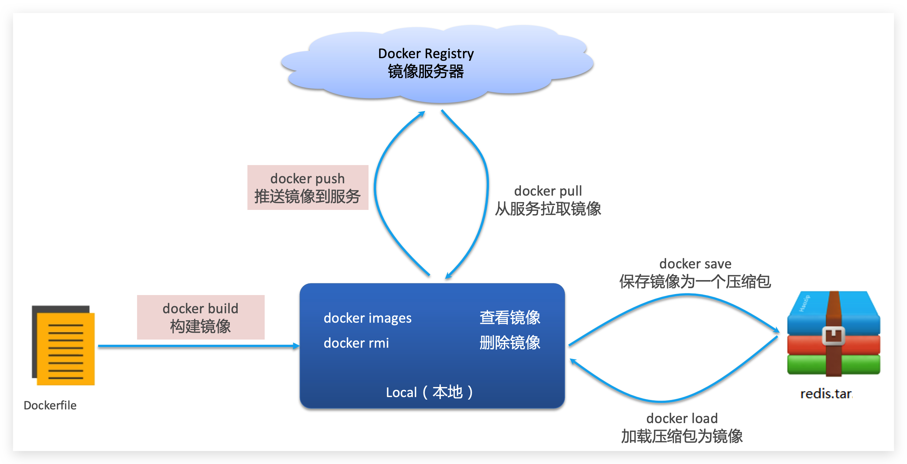
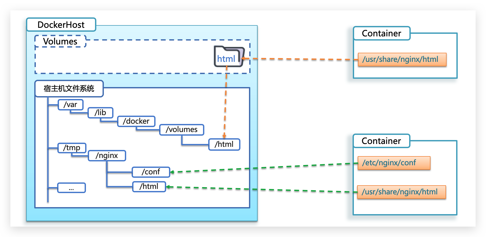

# 基本概念

## Docker 的作用

- Docker 解决依赖兼容问题
  - 将应用的 Libs（函数库）、Deps（依赖）、配置与应用一起打包，形成可移植镜像
  - 将每个应用放到一个隔离**容器**去运行，使用沙箱机制，避免互相干扰


- Docker 解决操作系统环境差异
  - Docker 将用户程序与所需要调用的系统（比如 Ubuntu）函数库一起打包
  - Docker 运行到不同操作系统时，直接基于打包的函数库，借助于操作系统的 Linux 内核来运行


## Docker 和虚拟机的差异

- Docker 是一个系统进程，仅仅是封装函数库，并没有模拟完整的操作系统；虚拟机是在操作系统中的操作系统
- Docker 体积小、启动速度快、性能好；虚拟机体积大、启动速度慢、性能一般

## 镜像和容器

- **镜像（Image）**：Docker 将应用程序及其所需的依赖、函数库、环境、配置等文件打包在一起，称为镜像
- **容器（Container）**：镜像中的应用程序运行后形成的进程就是**容器**，只是Docker会给容器进程做隔离，对外不可见


## DockerHub

- DockerHub：一个官方的 Docker 镜像的托管平台，这样的托管平台统称为 Docker Registry
- 国内也有类似于 DockerHub 的公开服务，比如 [网易云镜像服务](https://c.163yun.com/hub)、[阿里云镜像库](https://cr.console.aliyun.com/)等

## Docker 架构

- Docker 是一个 CS 架构的程序，由两部分组成：
  - 服务端（server）：Docker 守护进程，负责处理 Docker 指令，管理镜像、容器等
  - 客户端（client）：通过命令或 RestAPI 向 Docker 服务端发送指令；可以在本地或远程向服务端发送指令


## 安装 Docker

- 安装方式参考：[Docker安装 - CentOS安装Docker](/微服务/SpringCloud/Docker安装?id=centos-安装-docker)

# Docker 基本操作

## 镜像操作



- 镜像名称一般分两部分组成：`[repository]:[tag]`；在没有指定`tag`时，默认是`latest`，代表最新版本的镜像
- docker images
- docker rmi
- docker pull
- docker push
- docker save 
- docker load
- docker xx --help：查看相关命令语法

## 容器操作


- 容器保护三个状态：
  - 运行：进程正常运行
  - 暂停：进程暂停，CPU 不再运行，并不释放内存
  - 停止：进程终止，回收进程占用的内存、CPU 等资源
- docker run：创建并运行一个容器，处于运行状态
  - --name : 给容器起一个名字
  - -p ：将宿主机端口与容器端口映射，冒号左侧是宿主机端口，右侧是容器端口
  - -d：后台运行容器
- docker pause：让一个运行的容器暂停
- docker unpause：让一个容器从暂停状态恢复运行
- docker stop：停止一个运行的容器
- docker start：让一个停止的容器再次运行
- docker rm：删除容器，不能删除运行中的容器，除非添加 -f 参数
- docker logs：查看容器日志，添加 -f 参数可以持续查看日志
- docker ps：查看容器状态，添加 -a 参数查看所有状态的容器
- docker exec -it [容器名] [要执行的命令]：进入容器，exec 命令可以进入容器修改文件，**但是在容器内修改文件是不推荐的**

## 数据卷（容器数据管理）

### 基本概念

- **数据卷（volume）**：一个虚拟目录，指向宿主机文件系统中的某个目录，可以**解决容器与数据（容器内文件）耦合的问题**


- 一旦完成数据卷挂载，对容器的一切操作都会作用在数据卷对应的宿主机目录

### 数据集操作指令

- 数据卷操作的基本语法

```bash
docker volume [COMMAND]
```

- docker volume create：创建数据卷
- docker volume ls：查看所有数据卷
- docker volume inspect：查看数据卷详细信息，包括关联的宿主机目录位置
- docker volume rm：删除指定数据卷
- docker volume prune：删除所有未使用的数据卷

### 挂载数据卷

- 在创建容器时，可以通过 -v 参数来挂载一个数据卷到某个容器内目录

```bash
docker run \
  --name mn \
  -v html:/root/html \
  -p 8080:80
  nginx \
```

- -v [volume名称]:[容器内目录]

### 挂载本地目录

- 带数据卷模式：宿主机目录 --> 数据卷 --> 容器内目录
- 直接挂载模式：宿主机目录 --> 容器内目录



- **目录挂载与数据卷挂载的语法是类似的**
  - -v [宿主机目录]:[容器内目录]
  - -v [宿主机文件]:[容器内文件]
- 数据卷挂载耦合度低，由 Docker 来管理目录，但是目录较深，不好找
- 目录挂载耦合度高，需要自己管理目录，不过目录容易寻找查看

# Dockerfile 自定义镜像

## 镜像结构


- 基础镜像 - 层 - 入口
- 简单来说，镜像就是在系统函数库、运行环境基础上，添加应用程序文件、配置文件、依赖文件等组合，然后编写好启动脚本打包在一起形成的文件
- 构建镜像就是实现上述的打包过程

## Dockerfile 语法

- Dockerfile 文件包含镜像构建信息，其中包含一个个的**指令（Instruction）**，通过指令描述镜像的构建过程，每一个指令都会形成一层 Layer


- Dockerfile 的第一行必须是`FROM`，从一个基础镜像来构建
  - 基础镜像可以是基本操作系统，如：Ubuntu、CentOS；也可以是其他人制作好的镜像，如：java:8-alpine
  - 在一些安装了部分软件的基础镜像上构建镜像，可以节省步骤
- 详细语法说明，请参考官网文档： https://docs.docker.com/engine/reference/builder

## 构建镜像步骤

1. 进入到包含新镜像所需文件的文件夹目录下
2. 运行镜像构建命令

```bash
docker build -t [镜像名称]:[tag] .
```

- **注意：命令最后的`.`表示依赖当前目录下的文件来构建镜像**

# Docker Compose

- Docker Compose 可基于 Compose 文件快速部署分布式应用，而无需手动一个个创建和运行容器

## Compose 文件

- **Compose 文件是一个文本文件，通过指令定义集群中的每个容器如何运行，可以看做是将多个 docker run 命令写到一个文件，只是语法稍有差异**
- 以下 Compose 文件描述一个项目，其中包含两个容器：
  - mysql：一个基于`mysql:5.7.25`镜像构建的容器，并且挂载了两个目录
  - web：一个基于`docker build`临时构建的镜像容器，映射端口为8090

```yaml
version: "3.8"
 services:
  mysql:
    image: mysql:5.7.25
    environment:
     MYSQL_ROOT_PASSWORD: root 
    volumes:
     - "/tmp/mysql/data:/var/lib/mysql"
     - "/tmp/mysql/conf/hmy.cnf:/etc/mysql/conf.d/hmy.cnf"
  web:
    build: .
    ports:
     - "8090:8090"
```

- Docker Compose 的详细语法参考官网：https://docs.docker.com/compose/compose-file/

## 安装 DockerCompose

- 安装方式参考：[Docker安装 - CentOS7安装DockerCompose](/微服务/SpringCloud/Docker安装?id=centos-7-安装-dockercompose)

## 部署微服务集群

> 将之前学习的 cloud-demo 微服务集群利用 DockerCompose 部署

1. 修改 cloud-demo 项目，将数据库、nacos 地址都命名为 docker-compose 中的服务名
   - 因为微服务将来要部署为 docker 容器，**容器之间互联不是通过 IP 地址，而是通过容器名**
   - 将 order-service、user-service、gateway 服务的 mysql、nacos 地址都修改为基于容器名的访问

```yaml
spring:
  datasource:
    url: jdbc:mysql://mysql:3306/cloud_order?useSSL=false # mysql地址
    username: root
    password: 123
    driver-class-name: com.mysql.jdbc.Driver
  application:
    name: orderservice # 服务名称
  cloud:
    nacos:
      server-addr: nacos:8848 # nacos服务地址
```

2. 使用 maven 打包工具，将项目中的每个微服务都打包为`app.jar`
3. 将打包好的`app.jar`拷贝到 cloud-demo 中的每个微服务对应的子目录中（每个子目录都有各自的 Dockerfile）
4. 将 cloud-demo 上传至服务器，进入 cloud-demo 目录，利用`docker-compose up -d`来部署（cloud-demo 目录下有`docker-compose.yml`）

### Dockerfile 文件

```dockerfile
FROM java:8-alpine
COPY ./app.jar /tmp/app.jar
ENTRYPOINT java -jar /tmp/app.jar
```

### Compose 文件

```yaml
version: "3.2"

services:
  nacos:
    image: nacos/nacos-server
    environment:
      MODE: standalone
    ports:
      - "8848:8848"
  mysql:
    image: mysql:5.7.25
    environment:
      MYSQL_ROOT_PASSWORD: root
    volumes:
      - "$PWD/mysql/data:/var/lib/mysql"
      - "$PWD/mysql/conf:/etc/mysql/conf.d/"
  userservice:
    build: ./user-service
  orderservice:
    build: ./order-service
  gateway:
    build: ./gateway
    ports:
      - "10010:10010"
```

- 其中包含5个 service 服务：

  - `nacos`：作为注册中心和配置中心
    - `image: nacos/nacos-server`： 基于 nacos/nacos-server 镜像构建
    - `environment`：环境变量
      - `MODE: standalone`：单点模式启动
    - `ports`：端口映射，这里暴露了 8848 端口
  - `mysql`：数据库
    - `image: mysql:5.7.25`：镜像版本是 mysql:5.7.25
    - `environment`：环境变量
      - `MYSQL_ROOT_PASSWORD: root`：设置数据库root账户的密码为 root
    - `volumes`：数据卷挂载，这里挂载了 mysql 的`data`、`conf`目录
  - `userservice`、`orderservice`、`gateway`：基于 Dockerfile 临时构建的

# Docker 镜像仓库

## 搭建私有镜像仓库

- 安装方式参考：[Docker安装 - CentOS安装Docker](/微服务/SpringCloud/Docker安装?id=docker-镜像仓库)

## 推送、拉取镜像

- 推送镜像到私有镜像仓库必须先 tag，步骤如下：
1. 重新 tag 本地镜像，名称前缀为私有仓库的地址：8.142.98.103:8080/
 ```bash
docker tag nginx:latest 8.142.98.103:8080/nginx:1.0 
 ```
2. 推送镜像
```bash
docker push 8.142.98.103:8080/nginx:1.0
```
3. 拉取镜像
```bash
docker pull 8.142.98.103:8080/nginx:1.0
```