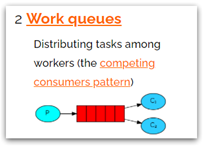

# 消息队列 MQ

## 同步和异步通讯

- 微服务间通讯有**同步**和**异步**两种方式
  - 同步通讯：需要实时响应（Feign 调用就属于同步方式）
  - 异步通讯：不需要马上回复

## 同步通讯

- 优点
  - 时效性较强，可以立即得到结果
- 缺点
  - 耦合度高
  - 性能和吞吐能力下降
  - 有额外的资源消耗
  - 有级联失败问题

## 异步通讯

- 以**事件驱动架构**为例：在事件模式中，事件发布者（Publisher）在完成自己的业务后发布事件（Event），事件订阅者（Consumer）监听到事件（Event）后完成自己业务即可
- 为了解除事件发布者与订阅者之间的耦合，两者并不是直接通信，而是有一个**中间人（Broker）**
- **发布者发布事件到 Broker**，不关心谁来订阅事件；**订阅者从 Broker 订阅事件**，不关心谁发来的消息
- **Broker 像数据总线，所有的服务要接收数据和发送数据都发到该总线上**，该总线就像协议，让服务间的通讯变得标准和可控


- 好处
  - 吞吐量提升：无需等待订阅者处理完成，响应更快速
  - 故障隔离：服务没有直接调用，不存在级联失败问题
  - 调用间没有阻塞，不会造成无效的资源占用
  - 耦合度极低，每个服务都可以灵活插拔，可替换
  - 流量削峰：不管发布事件的流量波动多大，都由 Broker 接收，订阅者可以按照自己的速度去处理事件
- 缺点
  - 架构复杂，业务没有明显的流程线，不好管理
  - 需要依赖于 Broker 的可靠、安全、性能

## MQ 技术对比

- **MQ：消息队列（MessageQueue），存放消息的队列，相当于事件驱动架构中的Broker（消息相当于事件）**
- 常见的 MQ 实现
  - RabbitMQ
  - RocketMQ
  - Kafka
  - ActiveMQ
- 常见 MQ 的对比

|            | **RabbitMQ**            | **RocketMQ** | **Kafka**  | **ActiveMQ**                      |
| ---------- | ----------------------- | ------------ | ---------- | --------------------------------- |
| 公司/社区  | Rabbit                  | 阿里         | Apache     | Apache                            |
| 开发语言   | Erlang                  | Java         | Scala&Java | Java                              |
| 协议支持   | AMQP，XMPP，SMTP，STOMP | 自定义协议   | 自定义协议 | OpenWire，STOMP，REST，XMPP，AMQP |
| 可用性     | 高                      | 高           | 高         | 一般                              |
| 单机吞吐量 | 一般                    | 高           | 非常高     | 差                                |
| 消息延迟   | 微秒级                  | 毫秒级       | 毫秒以内   | 毫秒级                            |
| 消息可靠性 | 高                      | 高           | 一般       | 一般                              |

- **追求可用性：Kafka、 RocketMQ 、RabbitMQ**
- **追求可靠性：RabbitMQ、RocketMQ**
- **追求吞吐能力：RocketMQ、Kafka**
- **追求消息低延迟：RabbitMQ、Kafka**

# RabbitMQ 使用步骤

- [RabbitMQ](https://www.rabbitmq.com/) 是基于 Erlang 语言开发的开源消息通信中间件

## 安装 RabbitMQ

- 安装方式参考：[RabbitMQ安装 - 单机部署](/微服务/SpringCloud/RabbitMQ安装?id=单机部署)

## RabbitMQ 基本结构


- Publisher：生产者
- Consumer：消费者
- Exchange：交换机，负责消息路由
- Queue：队列，存储消息
- VirtualHost：虚拟主机，隔离不同租户的 Exchange、Queue、消息

## RabbitMQ 消息模型

> RabbitMQ 官方提供了[5个不同的 Demo 示例](https://www.rabbitmq.com/getstarted.html)，对应了不同的消息模型

- 基本消息队列（BasicQueue）

  

- 工作消息队列（WorkQueue）

  

- 发布订阅（Publish、Subscribe），又根据交换机类型不同分为三种
  - Fanout Exchange：广播

    

  - Direct Exchange：路由

    

  - Topic Exchange：话题

    

## 基本消息队列

- 基本消息队列的消息发送流程：
  1. 建立 connection
  2. 创建 channel
  3. 利用 channel 声明队列
  4. 利用 channel 向队列发送消息
- 基本消息队列的消息接收流程：
  1. 建立 connection
  2. 创建 channel
  3. 利用 channel 声明队列
  4. 定义 consumer 的消费行为`handleDelivery()`
  5. 利用 channel 将消费者与队列绑定

# Spring AMQP

- **AMQP**： **A**dvanced **M**essage **Q**ueuing **P**rotocol，是用于在应用程序之间传递业务消息的开放标准。该协议与语言和平台无关，更符合微服务中独立性的要求
- [**Spring AMQP**](https://spring.io/projects/spring-amqp)： Spring AMQP 是基于 AMQP 协议定义的一套 API 规范，提供了模板来发送和接收消息。包含两部分，其中 spring-amqp 是基础抽象，spring-rabbit 是底层的默认实现
- Spring AMQP 提供了三个功能：
  - 自动声明队列、交换机及其绑定关系
  - 基于注解的监听器模式，异步接收消息
  - 封装了`RabbitTemplate`工具，用于发送消息 

## BasicQueue


### 引入依赖

- 引入依赖`spring-boot-starter-amqp`

```xml
<!--AMQP依赖，包含RabbitMQ-->
<dependency>
    <groupId>org.springframework.boot</groupId>
    <artifactId>spring-boot-starter-amqp</artifactId>
</dependency>
```

### 消息发送

- 配置 MQ 地址，在 Publisher 服务的`application.yml`中添加配置

```yaml
spring:
  rabbitmq:
    host: 8.142.98.103 # 主机名
    port: 5672 # 端口
    virtual-host: / # 虚拟主机
    username: root # 用户名
    password: root # 密码
```

- 在 Publisher 服务中编写测试类`SpringAmqpTest`，并利用`RabbitTemplate`的`convertAndSend`实现消息发送

```java
@RunWith(SpringRunner.class)
@SpringBootTest
public class SpringAmqpTest {
    @Autowired
    private RabbitTemplate rabbitTemplate;
    @Test
    public void testSimpleQueue() {
        // 队列名称
        String queueName = "simple.queue";
        // 消息
        String message = "hello, spring amqp!";
        // 发送消息
        rabbitTemplate.convertAndSend(queueName, message);
    }
}
```

### 消息接收

- 配置 MQ 地址，在 Consumer 服务的`application.yml`中添加配置

```yaml
spring:
  rabbitmq:
    host: 8.142.98.103 # 主机名
    port: 5672 # 端口
    virtual-host: / # 虚拟主机
    username: root # 用户名
    password: root # 密码
```

- 在 Consumer 服务的`com.njk.mq.listener`包中新建一个类`SpringRabbitListener`，添加`@Component`注解；类中声明方法，添加`@RabbitListener`注解，方法参数就是消息

```java
@Component
public class SpringRabbitListener {
    
    @RabbitListener(queues = "simple.queue")
    public void listenSimpleQueueMessage(String msg) throws InterruptedException {
        System.out.println("spring 消费者接收到消息：【" + msg + "】");
    }
}
```

> 注意：消息一旦消费就会从队列删除，RabbitMQ 没有消息回溯功能

## WorkQueue

- Work queues，也被称为任务模型（Task queues）
- 简单来说就是**让多个消费者绑定到一个队列，共同消费队列中的消息**，可以提高消息处理速度，避免队列消息堆积


### 消息发送

- 在 Publisher 服务中的`SpringAmqpTest`类中添加测试方法，循环发送，模拟大量消息堆积现象

```java
/**
* workQueue
* 向队列中不停发送消息，模拟消息堆积
*/
@Test
public void testWorkQueue() throws InterruptedException {
    // 队列名称
    String queueName = "simple.queue";
    // 消息
    String message = "hello, message_";
    for (int i = 0; i < 50; i++) {
        // 发送消息
        rabbitTemplate.convertAndSend(queueName, message + i);
        Thread.sleep(20);
    }
}
```

### 消息接收

- 在 Consumer 服务的`SpringRabbitListener`中，模拟多个消费者绑定同一个队列

```java
@RabbitListener(queues = "simple.queue")
public void listenWorkQueue1(String msg) throws InterruptedException {
    System.out.println("消费者1接收到消息：【" + msg + "】" + LocalTime.now());
    Thread.sleep(20);
}

@RabbitListener(queues = "simple.queue")
public void listenWorkQueue2(String msg) throws InterruptedException {
    System.err.println("消费者2接收到消息：【" + msg + "】" + LocalTime.now());
    Thread.sleep(200);
}
```

### 消费预取限制

- 消息是平均分配给每个消费者，并没有考虑到消费者的处理能力
- 修改`application.yml`文件，设置`preFetch`值，可以控制消费者预取消息数量的上限

```yaml
spring:
  rabbitmq:
    host: 8.142.98.103 # rabbitMQ的ip地址
    port: 5672 # 端口
    virtual-host: /
    username: root
    password: root
    listener:
      simple:
        prefetch: 1 # 每次只能获取一条消息，处理完成才能获取下一个消息
```

## 发布/订阅


- **发布/订阅模式（Publish / Subscribe）**允许将同一消息发送给多个消费者，实现方式是加入了 **Exchange（交换机）**
- **Publisher**：生产者，发送消息的程序，**不再发送到队列中，而是发给 Exchange（交换机）**
- **Exchange**：交换机。**一方面，接收 Publisher 发送的消息；另一方面，按照规则处理消息，例如递交给某个特别队列、递交给所有队列、或是将消息丢弃**，取决于 Exchange 的类型（主要有以下三种）：
  - **Fanout**：广播，将消息交给所有绑定到交换机的队列
  - **Direct**：定向，把消息交给符合指定`routing key`的队列
  - **Topic**：通配符，把消息交给符合`routing pattern`（路由模式） 的队列
- Spring 提供了一个接口`Exchange`，来表示所有不同类型的交换机


- Consumer：消费者，订阅队列
- Queue：消息队列，接收消息、缓存消息

> Exchange 负责消息路由，而不是存储，路由失败则消息丢失

## Fanout


### 消息发送流程

1. 可以有多个队列
2. 每个队列都要绑定到 Exchange（交换机）
3. Publisher 发送的消息，只能发送到 Exchange，Exchange 来决定要发给哪个队列，Publisher 无法决定
4. Exchange 把消息发送给绑定过的所有队列
5. 订阅队列的 Consumer 都能拿到消息

### 声明队列和交换机

- 在 Consumer 服务中创建一个类，**利用代码**声明队列、交换机，并将两者绑定（*也可用注解方式声明，更加简洁*）
- 声明队列、交换机、绑定关系的 Bean 是：`Queue`、`FanoutExchange`、`Binding`

```java
@Configuration
public class FanoutConfig {
    /**
     * 声明交换机
     * @return Fanout类型交换机
     */
    @Bean
    public FanoutExchange fanoutExchange(){
        return new FanoutExchange("njk.fanout");
    }
    // 第1个队列
    @Bean
    public Queue fanoutQueue1(){
        return new Queue("fanout.queue1");
    }
    // 绑定队列1和交换机
    @Bean
    public Binding bindingQueue1(Queue fanoutQueue1, FanoutExchange fanoutExchange){
        return BindingBuilder.bind(fanoutQueue1).to(fanoutExchange);
    }
    // 第2个队列
    @Bean
    public Queue fanoutQueue2(){
        return new Queue("fanout.queue2");
    }
    // 绑定队列2和交换机
    @Bean
    public Binding bindingQueue2(Queue fanoutQueue2, FanoutExchange fanoutExchange){
        return BindingBuilder.bind(fanoutQueue2).to(fanoutExchange);
    }
}
```

### 消息发送

- 在 Publisher 服务的`SpringAmqpTest`类中添加测试方法

```java
@Test
public void testFanoutExchange() {
    // 队列名称
    String exchangeName = "njk.fanout";
    // 消息
    String message = "hello, Fanout Queues!";
    // 发送消息，参数分别是：交换机名称、RoutingKey（暂时为空）、消息 
    rabbitTemplate.convertAndSend(exchangeName, "", message);
}
```

### 消息接收

- 在 Consumer 服务的`SpringRabbitListener`中添加方法，作为消费者

```java
@RabbitListener(queues = "fanout.queue1")
public void listenFanoutQueue1(String msg) {
    System.out.println("消费者1接收到Fanout消息：【" + msg + "】");
}

@RabbitListener(queues = "fanout.queue2")
public void listenFanoutQueue2(String msg) {
    System.out.println("消费者2接收到Fanout消息：【" + msg + "】");
}
```

## Direct


- Direct Exchange 会将接收到的消息根据规则路由到指定的 Queue，因此称为路由模式（routes）
- 每一个 Queue 都与 Exchange 设置一个 **BindingKey**
- Publisher 发送消息时，指定消息的 **RoutingKey**
- **Exchange 将消息路由到 BindingKey 与消息 RoutingKey 一致的队列**

### 消息接收、基于注解声明队列和交换机

- 在 Consumer 的`SpringRabbitListener`中添加消费者，同时基于注解来声明队列和交换机（*基于注解方式更加简洁*）
- 常见注解：`QueueBinding`、`@Queue`、`@Exchange`

```java
@RabbitListener(bindings = @QueueBinding(
    value = @Queue(name = "direct.queue1"),
    exchange = @Exchange(name = "njk.direct", type = ExchangeTypes.DIRECT),
    key = {"red", "blue"}
))
public void listenDirectQueue1(String msg){
    System.out.println("消费者接收到direct.queue1的消息：【" + msg + "】");
}

@RabbitListener(bindings = @QueueBinding(
    value = @Queue(name = "direct.queue2"),
    exchange = @Exchange(name = "njk.direct", type = ExchangeTypes.DIRECT),
    key = {"red", "yellow"}
))
public void listenDirectQueue2(String msg){
    System.out.println("消费者接收到direct.queue2的消息：【" + msg + "】");
}
```

### 消息发送

- 在 Publisher 服务的`SpringAmqpTest`类中添加测试方法

```java
@Test
public void testDirectExchange() {
    // 交换机名称
    String exchangeName = "njk.direct";
    // 消息
    String message = "hello, Direct Exchange!";
    // 发送消息，参数依次为：交换机名称，RoutingKey，消息
    rabbitTemplate.convertAndSend(exchangeName, "red", message);
}
```

## Topic


- TopicExchange 与 DirectExchange 类似，区别在于 routingKey 必须是多个单词的列表，并且以 `.`分割
- Queue 与 Exchange 指定 BindingKey 时可以使用通配符
  - `#`：匹配0个或多个词
  - `*`：匹配一个词

### 消息接收

```java
@RabbitListener(bindings = @QueueBinding(
    value = @Queue(name = "topic.queue1"),
    exchange = @Exchange(name = "njk.topic", type = ExchangeTypes.TOPIC),
    key = "china.#"
))
public void listenTopicQueue1(String msg){
    System.out.println("消费者接收到topic.queue1的消息：【" + msg + "】");
}

@RabbitListener(bindings = @QueueBinding(
    value = @Queue(name = "topic.queue2"),
    exchange = @Exchange(name = "njk.topic", type = ExchangeTypes.TOPIC),
    key = "#.news"
))
public void listenTopicQueue2(String msg){
    System.out.println("消费者接收到topic.queue2的消息：【" + msg + "】");
}
```

### 消息发送

- 在 Publisher 服务的`SpringAmqpTest`类中添加测试方法

```java
@Test
public void testTopicExchange() {
    // 交换机名称
    String exchangeName = "njk.topic";
    // 消息
    String message = "hello, Topic Exchange!";
    // 发送消息
    rabbitTemplate.convertAndSend(exchangeName, "china.news", message);
}
```

## Headers


- HeadersExchange 与 TopicExchange 类似，区别在于：
  - TopicExchange 的路由值基于 routingKey， HeadersExchange 的路由值基于消息的 header 键值对`key-value`
  - TopicExchange 的 routingKey 只能是字符串`String`，HeadersExchange 还可以是整型和哈希值
- 消息 header 键值对里有一个特殊的键`x-match`，它有两个值：
  - `all`：默认值。Publisher 的 header 键值对与 目标 Queue 的 header 键值对**全部匹配**，才能路由到对应队列
  - `any`：Publisher 的 header 键值对与 目标 Queue 的 header 键值对**任意一个匹配**，就能路由到对应队列

### MQ 配置

```java
	/**
	 * Header模式 交换机Exchange
	 * */
	@Bean
	public HeadersExchange headersExchage(){
		return new HeadersExchange(HEADERS_EXCHANGE);
	}
	@Bean
	public Queue headerQueue1() {
		return new Queue(HEADER_QUEUE, true);
	}
	@Bean
	public Binding headerBinding() {
		Map<String, Object> map = new HashMap<String, Object>();
		map.put("header1", "value1");
		map.put("header2", "value2");
		return BindingBuilder.bind(headerQueue1()).to(headersExchage()).whereAll(map).match();
	}
```

### 消息发送

```java
	public void sendHeader(Object message) {
		String msg = RedisService.beanToString(message);
		log.info("send fanout message:"+msg);
		MessageProperties properties = new MessageProperties();
		properties.setHeader("header1", "value1");
		properties.setHeader("header2", "value2");
		Message obj = new Message(msg.getBytes(), properties);
		amqpTemplate.convertAndSend(MQConfig.HEADERS_EXCHANGE, "", obj);
	}
```

### 消息接收

```java
		@RabbitListener(queues=MQConfig.HEADER_QUEUE)
		public void receiveHeaderQueue(byte[] message) {
			log.info(" header  queue message:"+new String(message));
		}
```

## 消息转换器

- 在 Spring AMQP 的发送方法中，接收消息的类型是`Object`，即**可以发送任意对象类型的消息**，Spring AMQP 将**消息序列化为字节后发送给 MQ**，**接收消息时把字节反序列化为 Java 对象**
- Spring 对消息对象的处理是由`MessageConverter`来处理的，默认实现是`SimpleMessageConverter`，基于JDK的`ObjectOutputStream`完成序列化，即 **JDK 序列化（数据体积过大、有安全漏洞、可读性差）**
- 为了使消息的体积更小、可读性更高，因此使用 JSON 方式来做序列化和反序列化**（配置 JSON 转换器，自定义一个`MessageConverter`类型的 Bean 即可）**

### 配置 JSON 转换器

- 在 Publisher 和 Consumer 两个服务中都引入依赖

```xml
<dependency>
    <groupId>com.fasterxml.jackson.dataformat</groupId>
    <artifactId>jackson-dataformat-xml</artifactId>
    <version>2.9.10</version>
</dependency>
```

- 在 Publisher 和 Consumer 两个服务中都声明`MessageConverter`

```java
@Bean
public MessageConverter jsonMessageConverter(){
    return new Jackson2JsonMessageConverter();
}
```

> 注意：发送方与接收方必须使用相同的`MessageConverter`
