# 微服务概述

## 单体架构

- 定义：将业务的所有功能集中在一个项目中开发，打成一个包部署
- 优点：
  - 架构简单
  - 部署成本低
- 缺点：
  - 耦合度高（维护困难、升级困难）

## 分布式架构

- 定义：根据业务功能对系统做拆分，每个业务功能模块作为独立项目开发，称为一个**服务**
- 优点：
  - 降低服务耦合
  - 有利于服务升级和拓展
- 缺点：
  - 服务调用关系错综复杂

## 微服务

- 微服务是一种经过良好架构设计的**分布式架构方案**
- **微服务的架构特征：**
  - **单一职责**：微服务拆分粒度更小，每一个服务都对应唯一的业务能力，做到单一职责
  - **自治**：团队独立、技术独立、数据独立，独立部署和交付
  - **面向服务：服务提供统一标准的接口，与语言和技术无关**
  - **隔离性强**：服务调用做好隔离、容错、降级，避免出现级联问题

## 微服务技术对比

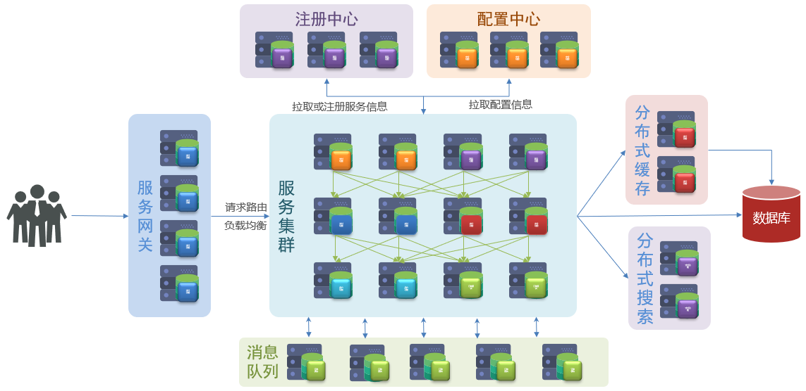

- **SpringCloud** 和 阿里巴巴的 **Dubbo**
- 微服务技术对比

|                | Dubbo               | SpringCloud              | SpringCloudAlibaba       |
| -------------- | ------------------- | ------------------------ | ------------------------ |
| 注册中心       | Zookeeper、Redis    | Eureka、Consul           | Nacos、Eureka            |
| 服务远程调用   | Dubbo 协议          | Feign（HTTP 协议）       | Dubbo、Feign             |
| 配置中心       | 无                  | SpringCloudConfig        | SpringCloudConfig、Nacos |
| 服务网关       | 无                  | SpringCloudGateway、Zuul | SpringCloudGateway、Zuul |
| 服务监控和保护 | dubbo-admin，功能弱 | Hystix                   | Sentinel                 |

- 企业需求

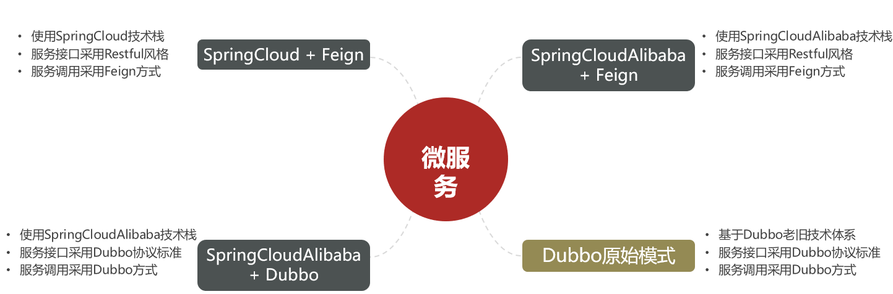

## SpringCloud

- 官网地址：https://spring.io/projects/spring-cloud
- SpringCloud 集成了**各种微服务功能组件**，并**基于 SpringBoot 实现了组件的自动装配**，从而提供了良好的开箱即用体验
- SpringCloud 的常见组件

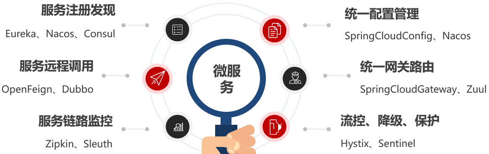

- **注意：**SpringCloud 底层是依赖于 SpringBoot 的，并且有**版本的兼容关系**
  - **SpringCloud 版本是 Hoxton.SR10，对应的 SpringBoot 版本是 2.3.x 版本**

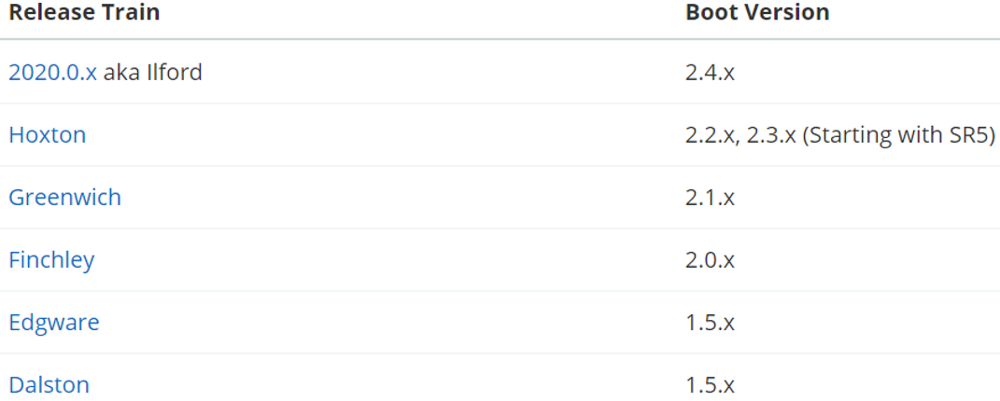

# 服务拆分及远程调用

## 服务拆分原则

- **单一职责**：不同微服务，不要重复开发相同业务
- **数据独立**：微服务数据独立，不要访问其它微服务的数据库
- **面向服务**：微服务将自己的业务暴露为接口，供其它微服务调用

## 微服务远程调用

> 案例：order-service（根据 id 查询订单），user-service（根据 id 查询用户）

- **基于`RestTemplate`发起的 HTTP 请求实现远程调用**
- **HTTP 请求做远程调用是与语言无关的调用，只要知道对方的 IP、端口、接口路径、请求参数即可**

### 注册 RestTemplate

- 在 order-service 的`OrderApplication`中注册`RestTemplate`

```java
@MapperScan("cn.njk.order.mapper")
@SpringBootApplication
public class OrderApplication {
    public static void main(String[] args) {
        SpringApplication.run(OrderApplication.class, args);
    }
    @Bean
    public RestTemplate restTemplate() {
        return new RestTemplate();
    }
}
```

### 服务远程调用 RestTemplate

- 修改 order-service 中的`OrderService`的`queryOrderById`方法

```java
@Service
public class OrderService {

    @Autowired
    private OrderMapper orderMapper;
    @Autowired
    private RestTemplate restTemplate;

    public Order queryOrderById(Long orderId) {
        // 1.查询订单
        Order order = orderMapper.findById(orderId);
        // 2. 查询用户
        String url = "http://localhost:8081/user/" + order.getUserId();
        User user = restTemplate.getForObject(url, User.class);
        // 3. 封装 user 信息
        order.setUser(user);
        // 4.返回
        return order;
    }
}
```

## 提供者与消费者

- 服务提供者 Provider：暴露接口给其它微服务调用
- 服务消费者 Consumer：调用其它微服务提供的接口
- 服务提供者与服务消费者的角色是相对的

# Eureka 注册中心

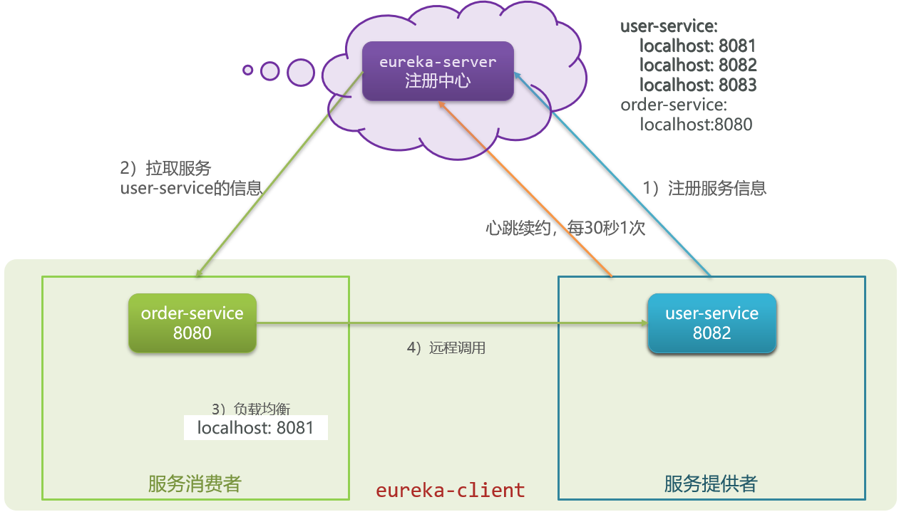

## Eureka 作用

- 消费者该如何获取服务提供者具体信息？
  1. **服务注册：服务提供者启动时向 eureka-server（Eureka 服务端）注册自己的信息**
  2. **eureka-server 保存服务名称到服务实例地址列表的映射关系**
  3. **服务发现 / 服务拉取：消费者根据服务名称向 eureka-server 拉取（`pull`）提供者信息**
- 如果存在多个服务提供者，消费者应该如何选择？
  1. **服务消费者利用负载均衡算法，从服务实例列表中挑选一个**
  2. 向该实例地址发起远程调用
- 消费者如何感知服务提供者的健康状态？
  - **服务提供者会每隔一段时间（默认30秒）向 eureka-server 发送心跳请求，报告健康状态**
  - eureka-server 会**更新**记录服务列表信息，心跳不正常会被剔除
  - **消费者就可以拉取（`pull`）到最新的信息**

## Eureka 的两类角色

- EurekaServer：服务端，注册中心
  - 记录服务信息
  - 心跳监控
- EurekaClient：客户端
  - Provider：服务提供者
    - 注册自己的信息到 EurekaServer
    - 每隔30秒向 EurekaServer 发送心跳
  - Consumer：服务消费者
    - 根据服务名称从 EurekaServer 拉取服务列表
    - 基于服务列表做负载均衡，选中一个微服务发起远程调用

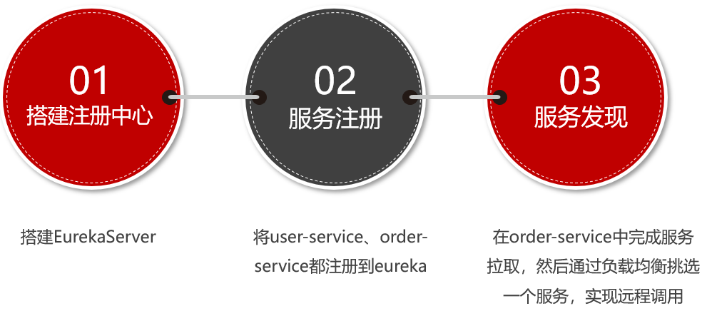

## 搭建 eureka-server

### 创建 eureka-server 服务

- 在父工程下，创建`eureka-server`子模块

### 引入依赖

- 引入 SpringCloud 为 eureka 提供的`starter`依赖

```xml
<!--eureka服务端依赖-->
<dependency>
    <groupId>org.springframework.cloud</groupId>
    <artifactId>spring-cloud-starter-netflix-eureka-server</artifactId>
</dependency>
```

### 编写启动类

- 给`eureka-server`服务编写一个启动类，添加一个`@EnableEurekaServer`注解，开启 eureka 的注册中心功能

```java
@SpringBootApplication
@EnableEurekaServer // 开启 eureka 的注册中心功能
public class EurekaApplication {
    public static void main(Sring[] args) {
        SpringApplication.run(EurekaApplication.class, args);
    }
}
```

### 编写配置文件

- 编写`application.yml`文件，添加服务名称、eureka 地址

```yaml
server:
  port: 10086
spring:
  application:
    name: eurekaserver # eureka-server服务名字
eureka:
  client:
    service-url: 
      defaultZone: http://127.0.0.1:10086/eureka # eureka服务端地址
```

### 启动服务

- 浏览器访问http://127.0.0.1:10086

## 服务注册

> 将 user-service 注册到 eureka-server 中

### 引入依赖

- 在`user-service`中引入`eureka-client`依赖

```xml
<dependency>
    <groupId>org.springframework.cloud</groupId>
    <artifactId>spring-cloud-starter-netflix-eureka-client</artifactId>
</dependency>
```

### 配置文件

- 在`user-service`中，修改`application.yml`文件，添加服务名称、eureka地址

```yaml
spring:
  application:
    name: userservice # eureka-client服务名字: userservice
eureka:
  client:
    service-url:
      defaultZone: http://127.0.0.1:10086/eureka # eureka服务端地址
```

### IDEA 启动多个实例

- 复制原来的`user-service`启动配置

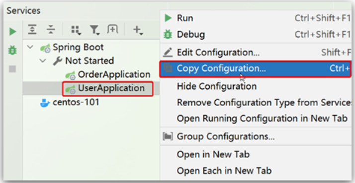

- 在弹窗中填写信息：实例名称、端口号（避免端口冲突）

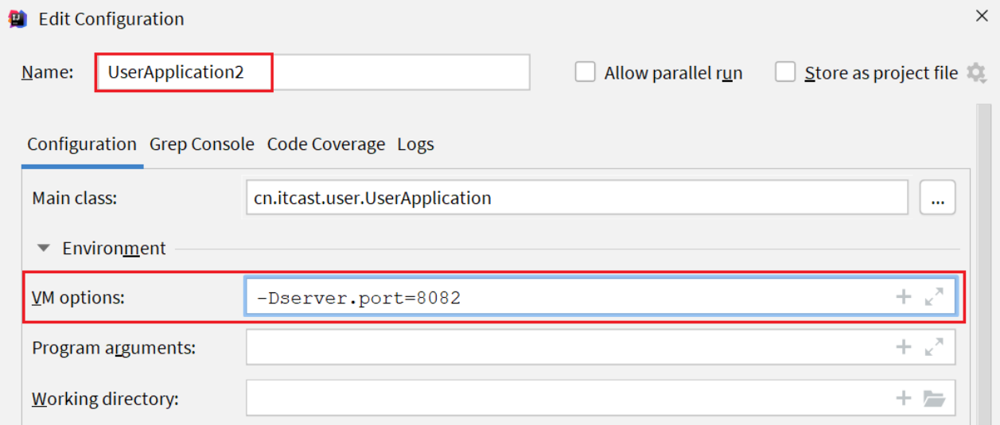

- SpringBoot 窗口会出现两个`user-service`启动配置

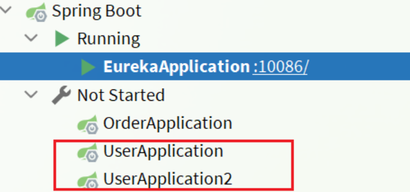

## 服务发现

> 修改 order-service 的逻辑：向 eureka-server 拉取 user-service 的信息，实现服务发现

### 引入依赖

- 在`order-service`中引入`eureka-client`依赖

```xml
<dependency>
    <groupId>org.springframework.cloud</groupId>
    <artifactId>spring-cloud-starter-netflix-eureka-client</artifactId>
</dependency>
```

### 配置文件

- 在`order-service`中，修改`application.yml`文件，添加服务名称、eureka地址

```yaml
spring:
  application:
    name: orderservice # eureka-client服务名字: orderservice
eureka:
  client:
    service-url:
      defaultZone: http://127.0.0.1:10086/eureka # eureka服务端地址
```

### 服务拉取和负载均衡

- 去`eureka-server`中拉取`user-service`服务的实例列表，并且实现负载均衡
- 在`order-service`的启动类`OrderAppliaction`中，**给`RestTemplate`这个 Bean 添加`@LoadBalanced`注解**

```java
@MapperScan("cn.njk.order.mapper")
@SpringBootApplication
public class OrderApplication {
    public static void main(String[] args) {
        SpringApplication.run(OrderApplication.class, args);
    }
    @Bean
    @LoadBalanced
    public RestTemplate restTemplate() {
        return new RestTemplate();
    }
}
```

- 修改`order-service`服务中的`OrderService`类中的`queryOrderById`方法，用服务名代替 IP 地址和端口，即**利用服务名称远程调用**

```java
@Service
public class OrderService {

    @Autowired
    private OrderMapper orderMapper;
    @Autowired
    private RestTemplate restTemplate;

    public Order queryOrderById(Long orderId) {
        // 1.查询订单
        Order order = orderMapper.findById(orderId);
        // 2. 查询用户
        String url = "http://userservice/user/" + order.getUserId();
        User user = restTemplate.getForObject(url, User.class);
        // 3. 封装 user 信息
        order.setUser(user);
        // 4.返回
        return order;
    }
}
```

# Ribbon 负载均衡

> [负载均衡详解](https://www.jianshu.com/p/215b5575107c)

## 负载均衡原理

- SpringCloud 底层利用了一个名为`Ribbon`的组件，来实现负载均衡功能的

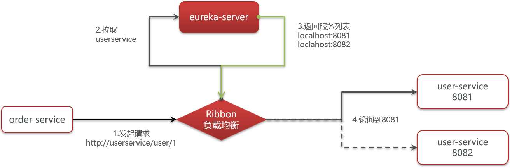

## 源码分析

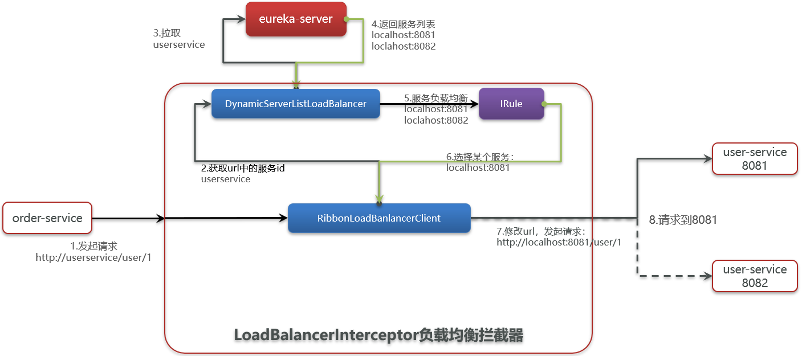

### LoadBalancerInterceptor

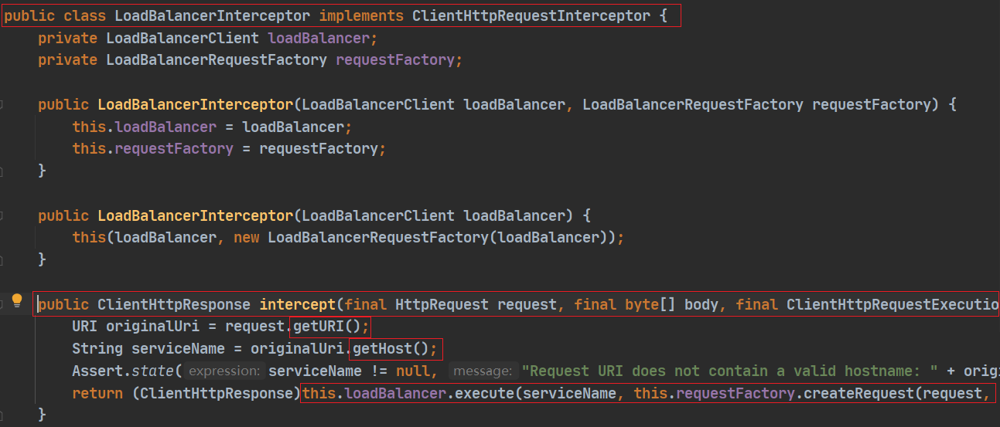

- 此处的`intercept`方法拦截了用户的 HttpRequest 请求，并执行以下操作：
  - `request.getURI()`：获取请求 URI
  - `originalUri.getHost()`：获取 URI 路径的主机名，实际上是**服务 ID**
  - `this.loadBalancer.execute()`：处理服务 ID 和用户请求
    - 此处的`this.loadBalancer`是`LoadBalancerClient`接口类型，该接口的其中一个实现类是`RibbonLoadBalancerClient`

### RibbonLoadBalancerClient

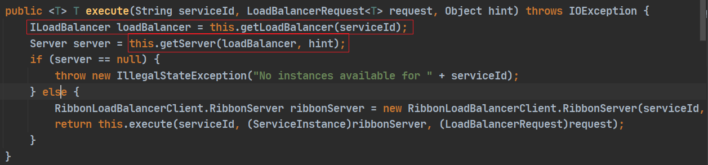

- `getLoadBalancer(serviceId)`：根据服务 ID 获取`ILoadBalancer`负载均衡器，而`ILoadBalancer`会拿着服务 ID 去 eureka 中获取服务列表并保存起来
- `getServer(loadBalancer)`：利用内置的负载均衡算法，从服务列表中选择一个服务

### IRule 负载均衡策略

- `getServer(loadBalancer)`做负载均衡，实际由`chooseServer`方法实现

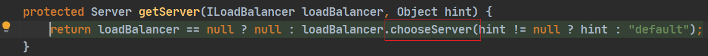

- `BaseLoadBalancer`中的`chooseServer`方法进行服务选择的是`rule`

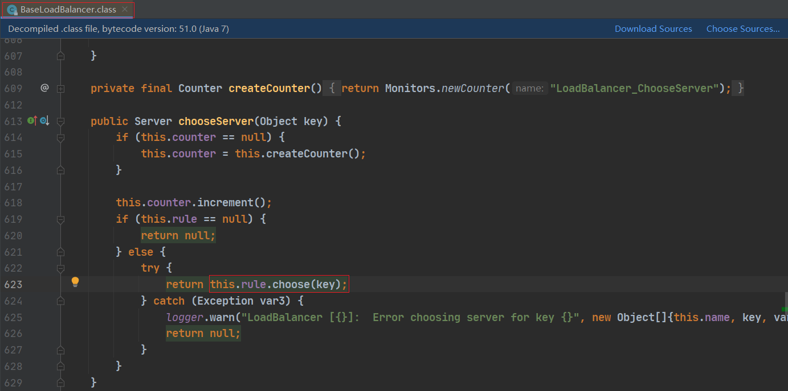

- `rule`的默认值是一个`RoundRobinRule`，即为**轮询策略**

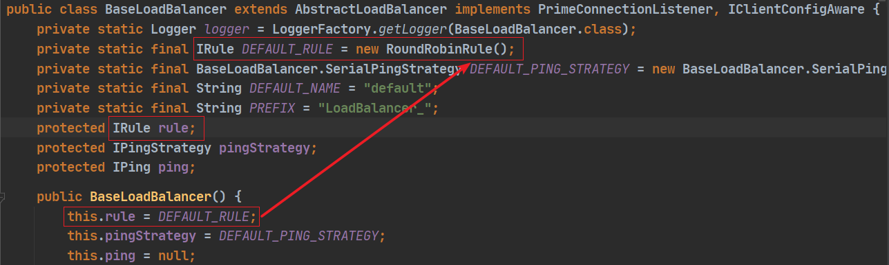

### 总结

1. 拦截`RestTemplate`请求
2. `RibbonLoadBalancerClient`会从请求 URL 中获取服务名称
3. `DynamicServerListLoadBalancer`根据服务名称到 eureka 拉取服务列表
4. eureka 返回列表
5. `IRule`利用内置负载均衡规则，从列表中选择一个
6. `RibbonLoadBalancerClient`修改请求地址，用真实 IP 地址替代服务名称，发起真实请求

## 负载均衡策略

### 负载均衡规则类

- Ribbon 的负载均衡规则是`IRule`接口来定义的，每一个子接口都是一种规则
- **默认实现是`ZoneAvoidanceRule`，根据 zone 选择服务列表，然后轮询**

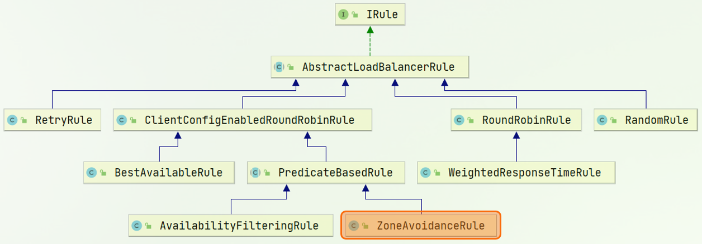

| **内置负载均衡规则类**    | **规则描述**                                                 |
| ------------------------- | ------------------------------------------------------------ |
| RoundRobinRule            | 简单轮询服务列表来选择服务器。它是 Ribbon 默认的负载均衡规则 |
| AvailabilityFilteringRule | 对以下两种服务器进行忽略：（1）在默认情况下，这台服务器如果3次连接失败，这台服务器就会被设置为“短路”状态。短路状态将持续30秒，如果再次连接失败，短路的持续时间就会几何级地增加。（2）并发数过高的服务器。如果一个服务器的并发连接数过高，配置了AvailabilityFilteringRule规则的客户端也会将其忽略。并发连接数的上限，可以由客户端的{clientName}.{clientConfigNameSpace}.ActiveConnectionsLimit属性进行配置 |
| WeightedResponseTimeRule  | 为每一个服务器赋予一个权重值。服务器响应时间越长，这个服务器的权重就越小。这个规则会随机选择服务器，这个权重值会影响服务器的选择 |
| **ZoneAvoidanceRule**     | 以区域可用的服务器为基础进行服务器的选择。使用 Zone 对服务器进行分类，这个 Zone 可以理解为一个机房、一个机架等。而后再对 Zone 内的多个服务做轮询 |
| BestAvailableRule         | 忽略那些短路的服务器，并选择并发数较低的服务器               |
| RandomRule                | 随机选择一个可用的服务器                                     |
| RetryRule                 | 重试机制的选择逻辑                                           |

### 自定义负载均衡策略

> 注意：一般用默认的负载均衡规则，不做修改

- 方式一（代码方式）：在`order-service`中的`OrderApplication`类中，定义一个新的`IRule`
  - 特点：全局配置，访问所有服务都会被修改负载均衡规则

```java
@Bean
public IRule randomRule(){
    return new RandomRule(); // 负载均衡：随机
}
```

- 方式二（配置文件方式）：在`order-service`的`application.yml`文件中，添加新的配置来修改规则
  - 特点：针对某个服务进行配置，访问特定的服务才会被修改负载均衡规则

```yaml
userservice: # 给某个微服务配置负载均衡规则，这里是userservice服务
  ribbon:
    NFLoadBalancerRuleClassName: com.netflix.loadbalancer.RandomRule # 负载均衡规则 
```

## 饥饿加载

- **Ribbon 默认是采用懒加载**，即第一次访问时才会去创建`LoadBalanceClient`，请求时间会很长
- **饥饿加载则会在项目启动时创建，降低第一次访问的耗时**
- 配置文件开启饥饿加载

```yaml
ribbon:
  eager-load:
    enabled: true # 开启饥饿加载
    clients: # 指定对userservice这个服务饥饿加载
      - userservice # 集合
```

# Nacos 注册中心

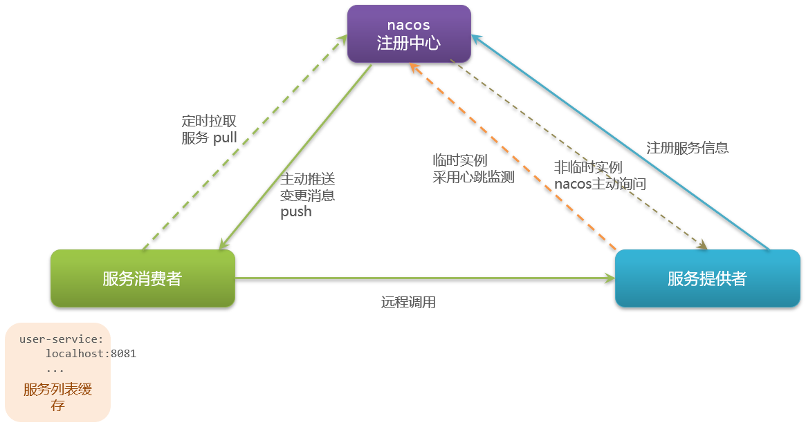

## 基本概念

- [Nacos](https://nacos.io/) 是阿里巴巴的产品，现在是 [SpringCloud](https://spring.io/projects/spring-cloud) 中的一个组件；相比 [Eureka](https://github.com/Netflix/eureka) 功能更加丰富，在国内受欢迎程度较高
- Nacos 是 SpringCloudAlibaba 的组件，而 SpringCloudAlibaba 也遵循 SpringCloud 中定义的服务注册、服务发现规范。因此使用 Nacos 和使用 Eureka 对于微服务来说，并没有太大区别
- 两者的主要使用差异：
  1. 依赖不同
  2. 服务地址不同

## Nacos 启动与访问

1. 进入 Nacos 安装目录下的`bin`目录，执行命令即可（单机版启动）

```bat
startup.cmd -m standalone
```

2. 浏览器访问http://127.0.0.1:8848/nacos，默认账号和密码都是`nacos`

## 服务注册到 Nacos

### 引入依赖

- 在父工程中引入 SpringCloudAlibaba 的管理依赖

```xml
<dependency>
    <groupId>com.alibaba.cloud</groupId>
    <artifactId>spring-cloud-alibaba-dependencies</artifactId>
    <version>2.2.6.RELEASE</version>
    <type>pom</type>
    <scope>import</scope>
</dependency>
```

- 在`user-service`和`order-service`中引入 nacos 的客户端依赖

```xml
<!--nacos客户端依赖-->
<dependency>
    <groupId>com.alibaba.cloud</groupId>
    <artifactId>spring-cloud-starter-alibaba-nacos-discovery</artifactId>
</dependency>
```

### 配置 Nacos 地址

- 在`user-service`和`order-service`的`application.yml`中添加 nacos 地址

```yaml
spring:
  cloud:
    nacos:
      discovery:
        server-addr: localhost:8848 # nacos服务地址
```

### 登录 Nacos 管理界面

- 浏览器访问http://localhost:8848

## 服务分级存储模型

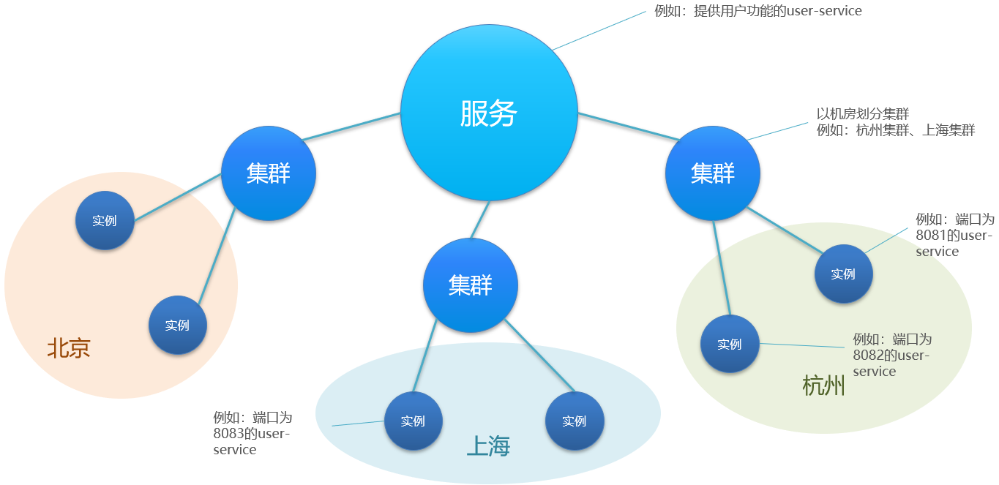

### 概念

- **含义：服务 - 集群 - 实例**
- **一个服务可以有多个实例**，假设这些实例分布在不同区域的机房，Nacos 将同一机房 / 区域内的实例，划分为一个**集群**，即一个服务可以包含多个集群，每个集群下可以有多个实例，**形成分级模型**
- 微服务互相访问时，应该**尽可能访问同集群实例**，因为本地访问速度更快；当本集群内不可用时，才访问其它集群

### 给服务配置集群

- 修改`user-service`的`application.yml`，添加集群配置（`spring.cloud.nacos.discovery.cluster-name`属性）

```yaml
spring:
  cloud:
    nacos:
      discovery:
        server-addr: localhost:8848
        cluster-name: HZ # 集群名称:HZ
```

- 在 Nacos 控制台查看集群变化

### 同集群优先的负载均衡

- 默认的`ZoneAvoidanceRule`不能实现根据同集群优先来实现负载均衡
- Nacos 中提供了一个`NacosRule`的实现
  - **优先从同集群中挑选实例**
  - 本地集群找不到提供者，**才去其它集群寻找**，并且会**报警告**
  - 确定了可用实例列表后，再采用**随机负载均衡**挑选实例

1. 给`order-service`配置集群信息

```yaml
spring:
  cloud:
    nacos:
      discovery:
        server-addr: localhost:8848
        cluster-name: HZ # 集群名称:HZ
```

2. 修改`order-service`负载均衡规则

```yaml
userservice:
  ribbon:
    NFLoadBalancerRuleClassName: com.alibaba.cloud.nacos.ribbon.NacosRule # NacosRule 负载均衡规则
```

## 权重配置

- Nacos 提供了权重配置来控制访问频率，权重越大则访问频率越高

1. 在 Nacos 控制台可以设置实例的权重值（0~1之间），选中实例后面的编辑按钮
2. 在弹出的编辑窗口，修改权重
   - **如果权重修改为0，则该实例永远不会被访问**

## 环境隔离

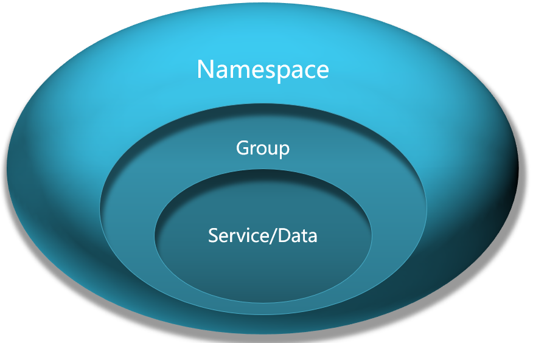

### 概念

- **Nacos 提供了 namespace 来实现环境隔离功能，基于环境的隔离，如开发环境、测试环境、生产环境等**
- Nacos 中可以有多个 namespace
- namespace 下可以有 group、service 等
- **不同 namespace 之间相互隔离，不同 namespace 的服务互相不可见**

### 创建 namespace

- 默认情况下，所有 service、data、group 都在同一个 namespace，名为`public`

1. 在 Nacos 控制台创建 namespace
2. 填写一个新的命名空间信息，每个 namespace 都有唯一 ID

### 给微服务配置 namespace

- **给微服务配置 namespace 只能通过修改配置来实现**
- **服务设置 namespace 时要写 ID** 而不是名称

```yaml
spring:
  cloud:
    nacos:
      discovery:
        server-addr: localhost:8848 # nacos服务地址
        cluster-name: HZ # HZ集群
        namespace: cf0f37ef-3733-46d7-a6a1-29317d6cf4d1 # 命名空间，填ID
```

## Nacos 与 Eureka 的对比


### Nacos 的服务实例类型

- **临时实例**：如果实例宕机超过一定时间，会从服务列表剔除，**默认的类型**
- **非临时实例 / 永久实例**：如果实例宕机，不会从服务列表剔除
- **配置一个服务实例为永久实例：**

```yaml
spring:
  cloud:
    nacos:
      discovery:
        ephemeral: false # 设置为非临时实例
```

### 共同点

- 都支持**服务注册**和**服务拉取**
- 都支持**服务提供者心跳方式做健康检测**

### 区别

- Nacos 支持服务端主动检测提供者状态：临时实例采用心跳模式，非临时实例采用主动检测模式
- 临时实例心跳不正常会被剔除，非临时实例则不会被剔除
- Nacos 支持服务列表变更的消息推送模式，服务列表更新更加及时
- Nacos 集群默认采用 AP 方式，当集群中存在非临时实例时，采用 CP 方式；Eureka 采用 AP 方式（[CAP(AP模式/CP模式)](https://www.pianshen.com/article/2293991131/)）

# Nacos 配置管理

## 统一配置管理

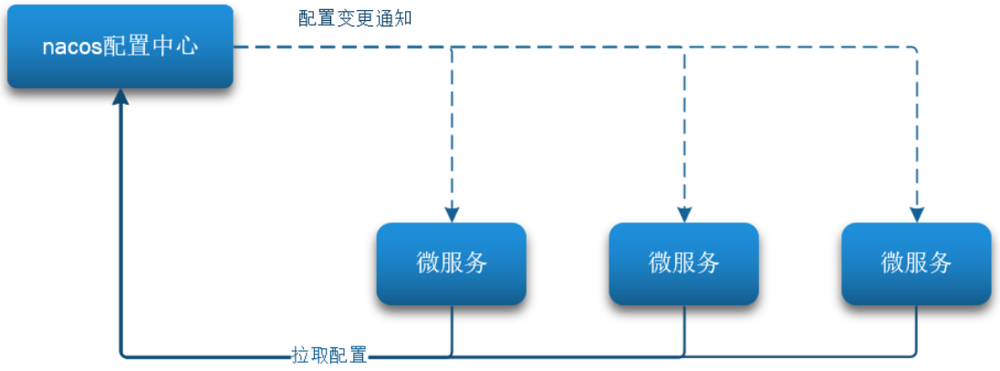

- 当微服务部署的实例越来越多，逐个修改微服务配置变得效率低下，因此需要一种统一配置管理方案，可以集中管理所有实例的配置
- **Nacos 一方面可以将配置集中管理，另一方可以在配置变更时，及时通知微服务，实现配置的热更新**
- **注意：项目的核心配置、需要热更新的配置才有放到 Nacos 管理的必要；基本不会变更的一些配置还是保存在微服务本地比较好**

### 在 Nacos 中添加配置文件

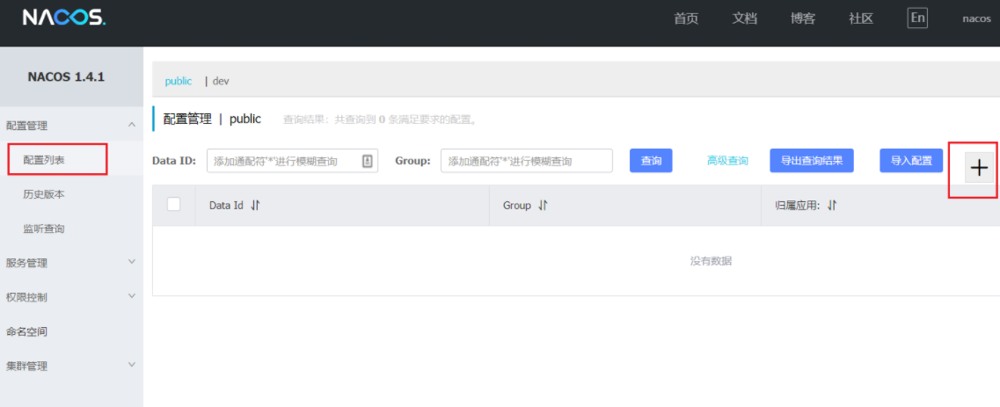

- 弹出表单中填写配置信息
  - Data ID：配置文件的 ID，`[服务名称]-[profile].[后缀名]`
  - Group：分组，默认接口
  - 配置格式：`yaml`或`properties`

### 从微服务拉取配置

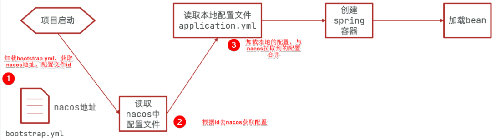

1. 引入`nacos-config`依赖

```xml
<!--nacos配置管理依赖-->
<dependency>
    <groupId>com.alibaba.cloud</groupId>
    <artifactId>spring-cloud-starter-alibaba-nacos-config</artifactId>
</dependency>
```

2. 在`resources`目录下添加`bootstrap.yml`文件，该文件是引导文件，优先级高于`application.yml`

```yaml
spring:
  application:
    name: userservice # 服务名称
  profiles:
    active: dev # 开发环境，这里是dev
  cloud:
    nacos:
      discovery:
        server-addr: localhost:8848 # nacos地址
      config:
        file-extension: yaml # 文件后缀名
```

- SpringCloud 会根据`spring.cloud.nacos.server-addr`获取 nacos 地址，再根据
`${spring.application.name}-${spring.profiles.active}.${spring.cloud.nacos.config.file-extension}`作为文件 ID 来读取配置

3. 在`user-service`中的`UserController`添加相应的业务逻辑，读取 nacos 配置（**利用`@Value("${xxx.xxx}")`注解来注入 nacos 中的配置属性**）

## 配置热更新

### 方式一

- 在`@Value`注入的变量所在类上添加注解`@RefreshScope`

```java
@Slf4j
@RestController
@RequestMapping("/user")
@RefreshScope
public class UserController {

    @Autowired
    private UserService userService;

    // 注入nacos中的配置属性
    @Value("${pattern.dateformat}")
    private String dateformat;
    ...
}
```

### 方式二：推荐使用

- 使用`@ConfigurationProperties`注解
- 在`user-service`服务中，添加一个类，读取指定属性

```java
@Component
@Data
@ConfigurationProperties(prefix = "pattern")
public class PatternProperties {
    private String dateFormat;
}
```

- 在`UserController`中使用这个类代替`@Value`

```java
@Slf4j
@RestController
@RequestMapping("/user")
@RefreshScope
public class UserController {

    @Autowired
    private UserService userService;

    // 注入nacos中的配置属性的类
    @Autowired
    private PatternProperties patternProperties;
    
    @GetMapping("now")
    public String now(){
        return LocalDateTime.now().format(DateTimeFormatter.ofPattern(patternProperties.getDateformat()));
    }
}
```

## 配置共享

### 多环境配置共享

- 微服务启动时，会去 Nacos 读取多个配置文件
  - `[spring.application.name]-[spring.profiles.active].yaml`：环境配置，例如：`userservice-dev.yaml`
  - `[spring.application.name].yaml`：不包含环境，因此可以被多个环境共享，例如：`userservice.yaml`

- 优先级：`服务名-profile.yaml` > `服务名称.yaml` > 本地配置

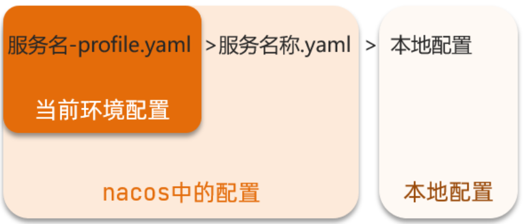

### 多服务共享配置

- 方式一：`shared-configs`

```yaml
spring:
  application:
    name: userservice # 服务名称
  profiles:
    active: dev # 环境
  cloud:
    nacos:
      server-addr: localhost:8848 # Nacos地址
      config:
        file-extension: yaml # 文件后缀名
        shared-configs: # 多个微服务间共享的配置列表
          - dataId: common.yaml # 要共享的配置文件id
```

- 方式二：`extension-configs`

```yaml
spring:
  application:
    name: userservice # 服务名称
  profiles:
    active: dev # 环境
  cloud:
    nacos:
      server-addr: localhost:8848 # Nacos地址
      config:
        file-extension: yaml # 文件后缀名
        extension-configs: # 多个微服务间共享的配置列表
          - dataId: common.yaml # 要共享的配置文件id
```

- 优先级：`服务名-profile.yaml` > `服务名称.yaml` > `extension-config` > `shared-config` > 本地配置

## Nacos 集群搭建

- **Nacos 生产环境下一定要部署为集群状态**，部署方式参考：[Nacos集群搭建](微服务/SpringCloud/Nacos集群搭建.md)

# Feign 远程调用

## 基本概念

> Feign makes writing java http clients easier.
>
> Feign is a Java to HTTP client binder inspired by [Retrofit](https://github.com/square/retrofit), [JAXRS-2.0](https://jax-rs-spec.java.net/nonav/2.0/apidocs/index.html), and [WebSocket](http://www.oracle.com/technetwork/articles/java/jsr356-1937161.html). Feign's first goal was reducing the complexity of binding [Denominator](https://github.com/Netflix/Denominator) uniformly to HTTP APIs regardless of [ReSTfulness](http://www.slideshare.net/adrianfcole/99problems).

- Feign 是一个声明式的 http 客户端，官方地址：https://github.com/OpenFeign/feign
- 作用：优雅地实现 http 请求的发送，方便维护参数复杂的 URL，代码可读性好

## Feign 替代 RestTemplate

### 引入依赖

- 在`order-service`服务引入`feign`依赖

```xml
<!--feign依赖-->
<dependency>
    <groupId>org.springframework.cloud</groupId>
    <artifactId>spring-cloud-starter-openfeign</artifactId>
</dependency>
```

### 添加注解

- 在`order-service`的启动类添加注解开启 Feign 的功能

```java
@EnableFeignClients
@MapperScan("cn.itcast.order.mapper")
@SpringBootApplication
public class OrderApplication {
    public static void main(String[] args) {
        SpringApplication.run(OrderApplication.class, args);
    }
}
```

### 编写 Feign 的客户端

- 在`order-service`中新建一个接口

```java
@FeignClient("userservice")
public interface UserClient {
    @GetMapping("/user/{id}")
    User findById(@PathVariable("id") Long id);
}
```

- 客户端主要是基于 SpringMVC 的注解来声明远程调用的信息，比如：
  - 服务名称：`userservice`
  - 请求方式：`GET`
  - 请求路径：`/user/{id}`
  - 请求参数：`Long id`
  - 返回值类型：`User`

### 用 Feign 客户端替代 RestTemplate

```java
@Service
public class OrderService {

    @Autowired
    private OrderMapper orderMapper;
    @Autowired
    private UserClient userClient;
    /*@Autowired
    private RestTemplate restTemplate;*/

    public Order queryOrderById(Long orderId) {
        // 1.查询订单
        Order order = orderMapper.findById(orderId);
        // 2. 查询用户
        User user = userClient.findById(orderId);
        /*String url = "http://userservice/user/" + order.getUserId();
        User user = restTemplate.getForObject(url, User.class);*/
        // 3. 封装 user 信息
        order.setUser(user);
        // 4.返回
        return order;
    }
}
```

## 自定义 Feign 配置

- Feign 运行自定义配置来覆盖默认配置
- 一般情况下，默认值就能满足使用；如果要自定义时，只需要创建自定义的`@Bean`覆盖默认 Bean 即可

| 类型                   | 作用             | 说明                                                        |
| ---------------------- | ---------------- | ----------------------------------------------------------- |
| **feign.Logger.Level** | 修改日志级别     | 包含四种不同的级别：`NONE`、`BASIC`、`HEADERS`、`FULL`      |
| feign.codec.Decoder    | 响应结果的解析器 | http 远程调用的结果做解析，例如解析 json 字符串为 java 对象 |
| feign.codec.Encoder    | 请求参数编码     | 将请求参数编码，便于通过 http 请求发送                      |
| feign.Contract         | 支持的注解格式   | 默认是 SpringMVC 的注解                                     |
| feign.Retryer          | 失败重试机制     | 请求失败的重试机制，默认是没有，不过会使用 Ribbon 的重试    |

- 日志的级别分为四种：

  - NONE：不记录任何日志信息，这是默认值
  - BASIC：仅记录请求的方法，URL 以及响应状态码和执行时间
  - HEADERS：在 BASIC 的基础上，额外记录了请求和响应的头信息
  - FULL：记录所有请求和响应的明细，包括头信息、请求体、元数据

  

### 配置文件方式

- 全局生效

```yaml
feign:  
  client:
    config: 
      default: # 这里用default就是全局配置，如果是写服务名称，则是针对某个微服务的配置
        loggerLevel: FULL #  日志级别 
```

- 局部生效

```yaml
feign:  
  client:
    config: 
      userservice: # 针对某个微服务的配置
        loggerLevel: FULL #  日志级别 
```

### Java 代码方式

- 先声明一个类，然后声明一个`Logger.Level`的对象

```java
public class DefaultFeignConfiguration  {
    @Bean
    public Logger.Level feignLogLevel(){
        return Logger.Level.BASIC; // 日志级别为BASIC
    }
}
```

- 如果要**全局生效**，将其放到启动类的`@EnableFeignClients`注解中

```java
@EnableFeignClients(defaultConfiguration = DefaultFeignConfiguration .class) 
```

- 如果要**局部生效**，将其放到对应的`@FeignClient`注解中

```java
@FeignClient(value = "userservice", configuration = DefaultFeignConfiguration .class) 
```

## 使用优化

1. 日志级别，最好用 basic 或 none，如果是测试场景，使用 full（因为记录日志会消耗一定的性能）
2. 连接池配置：使用`HttpClient`或`OKHttp`代替`URLConnection`

### Feign 底层的客户端实现

- `URLConnection`：默认实现，不支持连接池
- `Apache HttpClient`：支持连接池
- `OKHttp`：支持连接池

### Feign 添加 HttpClient

- 引入依赖

```xml
<!--httpClient的依赖 -->
<dependency>
    <groupId>io.github.openfeign</groupId>
    <artifactId>feign-httpclient</artifactId>
</dependency>
```

- 配置连接池

```yaml
feign:
  client:
    config:
      default: # default全局的配置
        loggerLevel: BASIC # 日志级别，BASIC就是基本的请求和响应信息
  httpclient:
    enabled: true # 开启feign对HttpClient的支持
    max-connections: 200 # 最大的连接数
    max-connections-per-route: 50 # 每个路径的最大连接数
```

## 最佳实践

- 目的：简化 Feign 的客户端与服务提供者的`controller`中的重复代码编写

### 继承方式

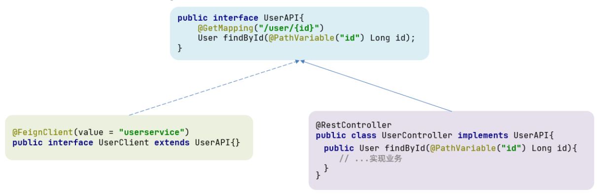

- 重复的代码可以通过继承来共享
  - 定义一个 API 接口，利用定义方法，并基于 SpringMVC 注解做声明
  - Feign 客户端和 Controller 都集成该接口
- 优点：简单，实现了代码共享
- 缺点
  - 服务提供方、服务消费方紧耦合
  - 参数列表中的注解映射并不会继承，因此 Controller 中必须再次声明方法、参数列表、注解

### 抽取方式

- 将 Feign 的 Client 抽取为独立模块，并且把接口有关的 POJO、默认的 Feign 配置都放到这个模块中，提供给所有消费者使用

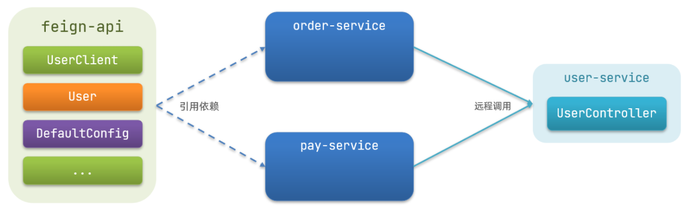

1. 创建一个module，命名为`feign-api`，引入`feign`的`starter`依赖

```xml
<dependency>
    <groupId>org.springframework.cloud</groupId>
    <artifactId>spring-cloud-starter-openfeign</artifactId>
</dependency>
```

2. `order-service`中编写的`UserClient`、`User`、`DefaultFeignConfiguration`都复制到`feign-api`项目中
3. 在`order-service`中引入`feign-api`的依赖
4. 修改`order-service`中的所有与上述三个组件有关的导包部分，改成导入`feign-api`中的包
- **解决扫描包问题**：当定义的`FeignClient`不在`SpringBootApplication`的扫描包范围时，这些`FeignClient`无法使用
  - 方式一：指定`FeignClient`
    ```java
    @EnableFeignClients(basePackages = "com.njk.feign.clients")
    ```
  - 方式二（推荐使用）：指定`FeignClient`字节码
    ```java
    @EnableFeignClients(clients = {UserClient.class})
    ```

# Gateway 统一网关

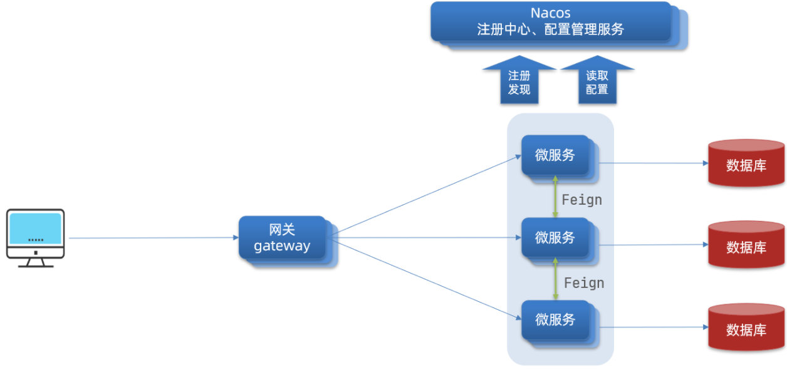

## 基本概念

- 基于 Spring 5.0，Spring Boot 2.0 和 Project Reactor 等响应式编程和事件流技术开发的网关，它旨在为微服务架构提供一种简单有效的统一的 API 路由管理方式
- Gateway 网关是所有微服务的统一入口，网关的**核心功能特性**：
  - 服务路由、负载均衡
  - 身份认证和权限校验
  - 请求限流
- SpringCloud 中网关的实现有两种：Gateway 和 Zuul
  - Zuul 是基于 Servlet 的实现，属于阻塞式编程
  - SpringCloudGateway 则是基于 Spring5 中提供的 WebFlux，属于响应式编程的实现，具备更好的性能

## Gateway 快速入门

1. 创建 SpringBoot 工程 gateway，引入网关依赖
2. 编写启动类
3. 编写基础配置和路由规则
4. 启动网关服务进行测试

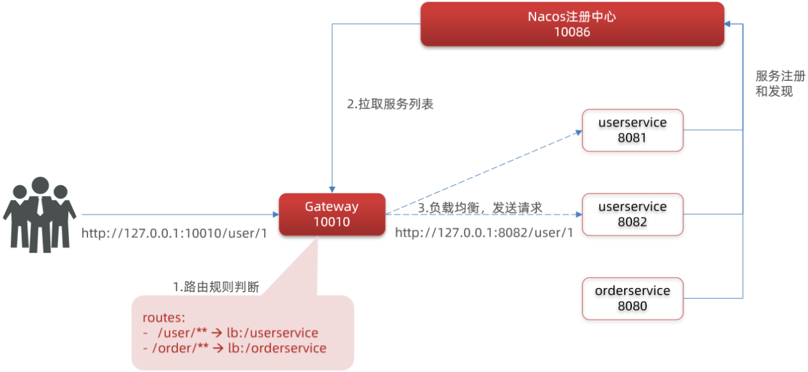

### 创建 gateway 服务

- 创建服务，引入依赖

```xml
<!--网关-->
<dependency>
    <groupId>org.springframework.cloud</groupId>
    <artifactId>spring-cloud-starter-gateway</artifactId>
</dependency>
<!--nacos服务发现依赖-->
<dependency>
    <groupId>com.alibaba.cloud</groupId>
    <artifactId>spring-cloud-starter-alibaba-nacos-discovery</artifactId>
</dependency>
```

### 编写启动类

```java
@SpringBootApplication
public class GatewayApplication {
	public static void main(String[] args) {
		SpringApplication.run(GatewayApplication.class, args);
	}
}
```

### 编写基础配置和路由规则

- 创建`application.yml`文件

```yaml
server:
  port: 10010 # 网关端口
spring:
  application:
    name: gateway # 服务名称
  cloud:
    nacos:
      server-addr: localhost:8848 # nacos地址
    gateway:
      routes: # 网关路由配置
        - id: user-service # 路由id，自定义，只要唯一即可
          # uri: http://127.0.0.1:8081 # 路由的目标地址 http就是固定地址
          uri: lb://userservice # 路由的目标地址 lb就是负载均衡，后面跟服务名称
          predicates: # 路由断言，也就是判断请求是否符合路由规则的条件
            - Path=/user/** # 这个是按照路径匹配，只要以/user/开头就符合要求
```

- 路由配置包括：
  1. 路由id：路由的唯一标示
  2. 路由目标（uri）：路由的目标地址，http 代表固定地址，lb 代表根据服务名负载均衡
  3. 路由断言（predicates）：判断路由的规则，
  4. 路由过滤器（filters）：对请求或响应做处理

### 重启测试

- 重启网关，访问http://localhost:10010/user/1；符合`/user/**`规则，请求转发到uri：http://userservice/user/1

## 断言工厂

- 在配置文件中写的断言规则只是字符串，这些字符串会被 Predicate Factory 读取并处理，转变为路由判断的条件
  - 例如`Path=/user/**`是按照路径匹配，这个规则是由

    `org.springframework.cloud.gateway.handler.predicate.PathRoutePredicateFactory`类来处理

- Spring 提供了11种基本的 [Predicate 工厂](https://docs.spring.io/spring-cloud-gateway/docs/current/reference/html/#gateway-request-predicates-factories)

| **名称**   | **说明**                       | **示例**                                                     |
| ---------- | ------------------------------ | ------------------------------------------------------------ |
| After      | 是某个时间点后的请求           | -  After=2037-01-20T17:42:47.789-07:00[America/Denver]       |
| Before     | 是某个时间点之前的请求         | -  Before=2031-04-13T15:14:47.433+08:00[Asia/Shanghai]       |
| Between    | 是某两个时间点之前的请求       | -  Between=2037-01-20T17:42:47.789-07:00[America/Denver],  2037-01-21T17:42:47.789-07:00[America/Denver] |
| Cookie     | 请求必须包含某些cookie         | - Cookie=chocolate, ch.p                                     |
| Header     | 请求必须包含某些header         | - Header=X-Request-Id, \d+                                   |
| Host       | 请求必须是访问某个host（域名） | -  Host=**.somehost.org,**.anotherhost.org                   |
| Method     | 请求方式必须是指定方式         | - Method=GET,POST                                            |
| Path       | 请求路径必须符合指定规则       | - Path=/red/{segment},/blue/**                               |
| Query      | 请求参数必须包含指定参数       | - Query=name, Jack或者-  Query=name                          |
| RemoteAddr | 请求者的 ip必须是指定范围      | - RemoteAddr=192.168.1.1/24                                  |
| Weight     | 权重处理                       |                                                              |

## 过滤器工厂

- GatewayFilter 是网关中提供的一种过滤器，可以对进入网关的请求和微服务返回的响应做处理，比如添加请求头

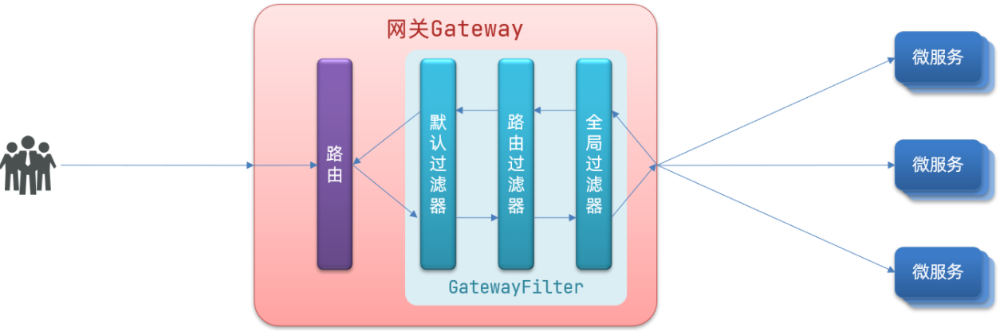

### 路由过滤器种类

- Spring 提供了31种不同的[路由过滤器工厂](https://docs.spring.io/spring-cloud-gateway/docs/current/reference/html/#gatewayfilter-factories)，如：

| **名称**             | **说明**                     |
| -------------------- | ---------------------------- |
| AddRequestHeader     | 给当前请求添加一个请求头     |
| RemoveRequestHeader  | 移除请求中的一个请求头       |
| AddResponseHeader    | 给响应结果中添加一个响应头   |
| RemoveResponseHeader | 从响应结果中移除有一个响应头 |
| RequestRateLimiter   | 限制请求的流量               |

### 请求头过滤器

> 以 AddRequestHeader 为例，给所有进入userservice的请求添加一个请求头：Truth=AresNing

- 只需要修改 gateway 服务的`application.yml`文件，添加路由过滤即可

```yaml
spring:
  cloud:
    gateway:
      routes:
      - id: user-service 
        uri: lb://userservice 
        predicates: 
        - Path=/user/** 
        filters: # 过滤器
        - AddRequestHeader=Truth, AresNing # 添加请求头
        # 当前过滤器写在userservice路由下，因此仅仅对访问userservice的请求有效
```

### 默认路由过滤器

- 要对所有的路由都生效，则可以将过滤器工厂写到`default`下

```yaml
spring:
  cloud:
    gateway:
      routes:
      - id: user-service 
        uri: lb://userservice 
        predicates: 
        - Path=/user/**
      default-filters: # 默认过滤项
      - AddRequestHeader=Truth, AresNing # 添加请求头 
```

> 补充：注解@RequestHeader：自动获取指定的请求头的值

## 全局过滤器

### 全局过滤器作用

- 全局过滤器（GlobalFilter）的作用也是处理一切进入网关的请求和微服务响应，与 GatewayFilter 的作用一样
- 区别在于 GatewayFilter 通过配置定义，处理逻辑是固定的；而 **GlobalFilter 的逻辑需要自己写代码实现**
- GlobalFilter 定义方式是**实现 GlobalFilter** 接口

```java
public interface GlobalFilter {
    /**
     *  处理当前请求，有必要的话通过{@link GatewayFilterChain}将请求交给下一个过滤器处理
     *
     * @param exchange 请求上下文，里面可以获取Request、Response等信息
     * @param chain 用来把请求委托给下一个过滤器 
     * @return {@code Mono<Void>} 返回标示当前过滤器业务结束
     */
    Mono<Void> filter(ServerWebExchange exchange, GatewayFilterChain chain);
}
```

### 自定义全局过滤器

> 定义全局过滤器，拦截请求，判断请求的参数是否满足下面条件：
>
> - 参数中是否有 authorization
>
> - authorization 参数值是否为 admin
>
> 如果同时满足则放行，否则拦截

- 在 gateway 中自定义一个过滤器类，实现`GlobalFilter`接口，添加`@Order`注解
  - **添加`@Order`注解或实现`Ordered`接口（定义顺序，数字越小，优先级越高）**

```java
@Component
//@Order(-1)
public class AuthorizeFilter implements GlobalFilter, Ordered {
    @Override
    public Mono<Void> filter(ServerWebExchange exchange, GatewayFilterChain chain) {
        // 获取请求参数
        MultiValueMap<String, String> params = exchange.getRequest().getQueryParams();
        // 获取 authorization 参数
        String auth = params.getFirst("authorization");
        // 校验
        if ("admin".equals(auth)) {
            // 放行
            return chain.filter(exchange);
        }
        // 拦截
        exchange.getResponse().setStatusCode(HttpStatus.UNAUTHORIZED);
        // 结束处理
        return exchange.getResponse().setComplete();
    }

    @Override
    public int getOrder() {
        return -1;
    }
}
```

### 过滤器执行顺序

- 请求进入网关会碰到三类过滤器：当前路由的过滤器、DefaultFilter、GlobalFilter
- 请求路由后，会将当前路由过滤器和 DefaultFilter、GlobalFilter，合并到一个过滤器链（集合）中，排序后依次执行每个过滤器

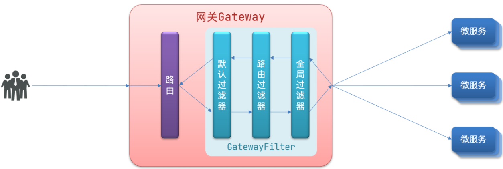

- **排序规则**
  - 每一个过滤器都必须指定一个`int`类型的 order 值，**order 值越小，优先级越高，执行顺序越靠前**。
  - GlobalFilter 通过实现`Ordered`接口，或者添加`@Order`注解来指定 order 值
  - 路由过滤器和 DefaultFilter 的 order 由 Spring 指定，**默认是按照声明顺序从1递增**
  - **当过滤器的 order 值一样时，会按照 DefaultFilter > 路由过滤器 > GlobalFilter 的顺序执行**

> 可以参考下面几个类的源码来查看：
>
> `org.springframework.cloud.gateway.route.RouteDefinitionRouteLocator#getFilters()`方法是先加载 DefaultFilter，然后再加载某个 route 的filters，然后合并
>
> `org.springframework.cloud.gateway.handler.FilteringWebHandler#handle()`方法会加载全局过滤器，与前面的过滤器合并后根据 order 排序，组织过滤器链

## 跨域问题

- 跨域：域名不一致就是跨域，主要包括：
  - 域名不同： www.taobao.com 和 www.taobao.org 和 www.jd.com 和 miaosha.jd.com
  - 域名相同，端口不同：localhost:8080 和 localhost8081
- **跨域问题：浏览器禁止请求的发起者与服务端发生跨域 ajax 请求，请求被浏览器拦截的问题**
- 解决方案：CORS，[跨域资源共享 CORS 详解 - 阮一峰的网络日志](https://www.ruanyifeng.com/blog/2016/04/cors.html)

### CORS 方案

- 在 gateway 服务的`application.yml`文件中，添加下面的配置

```yaml
spring:
  cloud:
    gateway:
      # ...
      globalcors: # 全局的跨域处理
        add-to-simple-url-handler-mapping: true # 解决options请求被拦截问题
        corsConfigurations:
          '[/**]':
            allowedOrigins: # 允许哪些网站的跨域请求 
              - "http://localhost:8090"
            allowedMethods: # 允许的跨域ajax的请求方式
              - "GET"
              - "POST"
              - "DELETE"
              - "PUT"
              - "OPTIONS"
            allowedHeaders: "*" # 允许在请求中携带的头信息
            allowCredentials: true # 是否允许携带cookie
            maxAge: 360000 # 这次跨域检测的有效期
```

- CORS 跨域要配置的参数包括哪几个？
  - 允许哪些域名跨域？
  - 允许哪些请求头？
  - 允许哪些请求方式？
  - 是否允许使用cookie？
  - 有效期是多久？

## 限流过滤器

- 限流作用：限流是保护服务器，避免因过多请求而导致服务器过载甚至宕机

- 限流算法

  - 计数器算法（又称为窗口计数器算法、滑动窗口计数器算法）
    1. 将时间划分为多个窗口；
    2. 在每个窗口内每有一次请求就将计数器加一，当时间到达下一个窗口时，计数器重置；
    3. 如果计数器超过了限制数量，则本窗口内所有的请求都被丢弃

  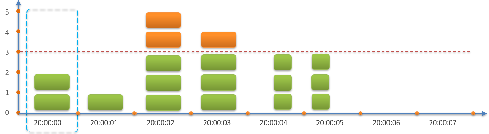

  - 漏桶算法（Leaky Bucket）
    1. 将每个请求视作“水滴”放入“漏桶”进行存储
    2. “漏桶”以固定速率向外“漏出”请求来执行，如果“漏桶”空了就停止“漏水”
    3. 如果“漏桶”满了则多余的“水滴”会被直接丢弃（多余请求等待抛弃）

  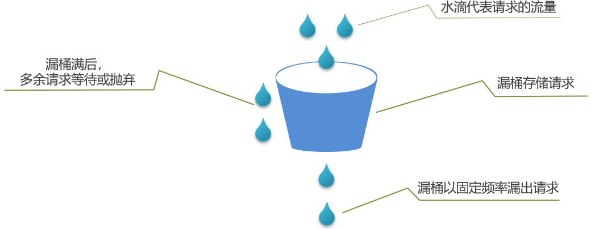

  - 令牌桶算法（Token Bucket）
    1. 以固定的速率生成令牌，存入令牌桶中，如果令牌桶满了以后，多余令牌丢弃
    2. 请求进入后，必须先尝试从桶中获取令牌，获取到令牌后才可以被处理
    3. 如果令牌桶中没有令牌，则请求等待或丢弃
  
  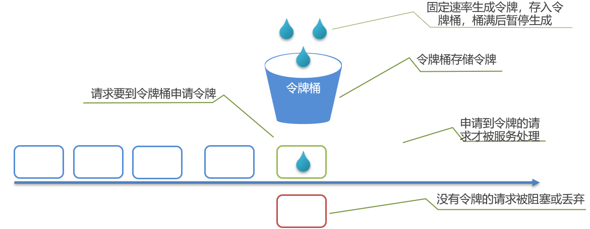
  
    
