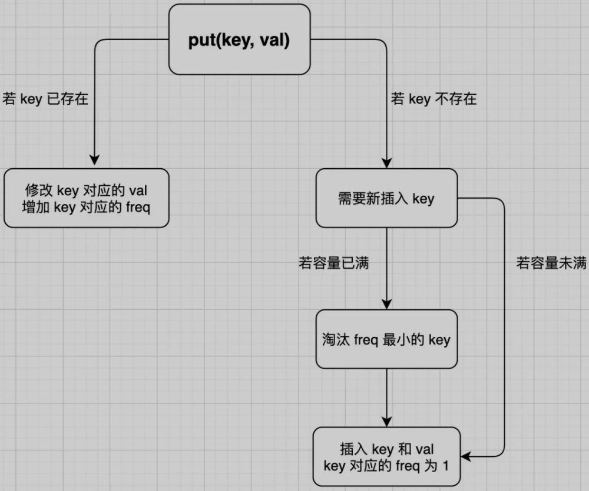

# 基本概念

- LFU（Least Frequently Used）：一种缓存淘汰算法，即淘汰访问频次最低的数据，如果访问频次最低的数据有多条，需要淘汰最旧的数据
- 其他缓存淘汰策略，按未使用时间（[LRU 策略](/数据结构与算法/LRU算法)）来淘汰

# 算法描述

> [460. LFU 缓存 - LeetCode](https://leetcode-cn.com/problems/lfu-cache/)

- 实现 `LFUCache` 类，接受一个`capacity`参数，实现`get`和`put`方法
- `get(key)`方法会去缓存中查询键`key`，如果`key`存在，则返回`key`对应的`val`，否则返回 -1
- `put(key, value)`方法插入或修改缓存，如果`key`已存在，则将它对应的值改为`val`；如果`key`不存在，则插入键值对`(key, val)`
- 当缓存达到容量`capacity`时，则应该在插入新的键值对之前，删除使用频次`freq`最低的键值对。如果`freq`最低的键值对有多个，则删除其中最旧的那个
- `get` 和 `put` 方法必须都是$O(1)$的时间复杂度

# 算法设计

- 使用一个`HashMap`存储`key`到`val`的映射，快速计算`get(key)`

```java
HashMap<Integer, Integer> keyToVal;
```

- 使用一个`HashMap`存储`key`到`freq`的映射，快速操作`key`对应的`freq`

```java
HashMap<Integer, Integer> keyToFreq;
```

- 使用一个`HashMap`存储`freq`到`keys`的映射，使用`LinkedHashSet`（哈希集合链表）存储`key`列表，用一个变量`minFreq`来记录当前最小的`freq`

```java
HashMap<Integer, LinkedHashSet<Integer>> freqToKeys;
int minFreq = 0;
```

- **`LinkedHashSet`是链表和哈希集合的结合体，兼具了哈希集合和链表的特性，既可以在 $O(1)$时间内访问或删除其中的元素，又可以保持插入的时序**
  - $O(1)$时间：能够快速删除`key`列表中的任何一个`key`，因为如果频次为`freq`的某个`key`被访问，那么它的频次就会变成`freq+1`，就应该从`freq`对应的`key`列表中删除，加到`freq+1`对应的`key`的列表中
  - 保持插入的时序：`freq`对应的`key`的列表是**存在时序**的，便于快速查找并删除最旧的`key`
- **LFU 算法的基本数据结构**

```java
class LFUCache {
    // key 到 val 的映射，称为 KV 表
    HashMap<Integer, Integer> keyToVal;
    // key 到 freq 的映射，称为 KF 表
    HashMap<Integer, Integer> keyToFreq;
    // freq 到 key 列表的映射，称为 FK 表
    HashMap<Integer, LinkedHashSet<Integer>> freqToKeys;
    // 记录最小的频次
    int minFreq;
    // 记录 LFU 缓存的最大容量
    int cap;
    
    public LFUCache(int capacity) {
        keyToVal = new HashMap<>();
        keyToFreq = new HashMap<>();
        freqToKeys = new HashMap<>();
        this.cap = capacity;
        this.minFreq = 0;
    }
    
    public int get(int key) {}
    
    public void put(int key, int val) {}
    
    // 淘汰freq最小的key
    private void removeMinFreqKey() {}
    // 增加key对应的freq
    private void increaseFreq(int key) {}
}
```

# 代码实现

- `get(key)`方法：返回`key`对应的`val`，然后增加`key`对应的`freq`

```java
public int get(int key) {
    if(!keyToVal.containsKey(key))
        return -1;
    // 增加 key 对应的 freq
    increaseFreq(key);
    return keyToVal.get(key);
}
```

- `put(key, val)`方法



```java
public void put(int key, int val) {
    if(this.cap <= 0)
        return;
    
    /* 若 key 已存在，修改对应的 val 即可 */
    if(keyToVal.containsKey(key)) {
        keyToVal.put(key, val);
        // key 对应的 freq 加一
        increaseFreq(key);
        return;
    }
    
    /* key 不存在，需要插入 */
    /* 容量已满的话需要淘汰一个 freq 最小的 key */
    if(this.cap <= keyToVal.s)
        removeMinFreqKey();
    
    /* 插入 key 和 val，对应的 freq 为 1 */
    // 插入 KV 表
    keyToVal.put(key, val);
    // 插入 KF 表
    keyToFreq.put(key, 1);
    // 插入 FK 表
    freqToKeys.putIfAbsent(1, new LinkedHashSet<>());
    freqTokeys.get(1).add(key);
    // 插入新 key 后最小的 freq 肯定是 1
    this.minFreq = 1;
}
```

# LFU 核心逻辑

- `removeMinFreqKey`函数

```java
private void removeMinFreqKey() {
    // freq 最小的 key 列表
    LinkedHashSet<Integer> keyList = freqToKeys.get(this.minFreq);
    // 其中最先被插入的那个 key 就是该被淘汰的 key
    int deletedKey = keyList.iterator().next();
    /* 更新 FK 表 */
    keyList.remove(deletedKey);
    if(keyList.isEmpty())
        freqTokeys.remove(this.minFreq);
    /* 更新 KV 表 */
    keyToVal.remove(deletedKey);
    /* 更新 KF 表 */
    keyToFreq.remove(deletedKey);
}
```

> **此处没必要更新`minFreq`变量**，`removeMinFreqKey`函数是在`put`方法中插入新`key`时可能调用，而`put`方法在插入新`key`时一定会把`minFreq`更新成 1

- `increaseFreq`函数

```java
private void increaseFreq(int key) {
    int freq = keyToFreq.get(key);
    /* 更新 KF 表 */
    keyToFreq.put(key, freq + 1);
    /* 更新 FK 表 */
    // 将 key 从 freq 对应的列表中删除
    freqToKeys.get(freq).remove(key);
    // 将 key 加入 freq + 1 对应的列表中
    freqToKeys.putIfAbsent(freq + 1, new LinkedHashSet<>());
    freqToKeys.get(freq + 1).add(key);
    // 如果 freq 对应的列表空了，移除这个 freq
    if(freqToKeys.get(freq).isEmpty()) {
        freqToKeys.remove(freq);
        // 如果这个 freq 恰好是 minFreq，更新 minFreq
        if(freq == this.minFreq)
            this.minFreq++;
    }
}
```
