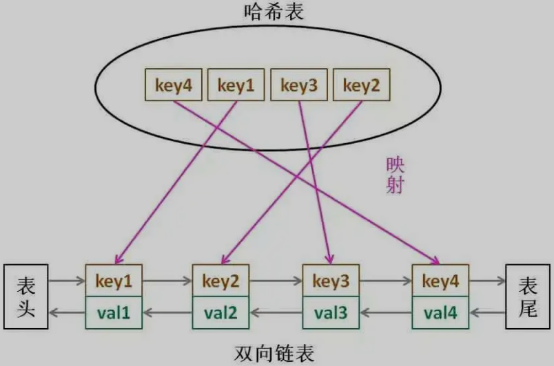

# 基本概念

- **LRU（Least Recently Used）**：一种缓存淘汰策略，即认为最近使用过的数据应该是有用的，未使用时间最长的数据应该是无用的，内存满了就优先删除未使用时间最长的数据
- 其他缓存淘汰策略，按访问频率（[LFU 策略](/数据结构与算法/LFU算法)）来淘汰

# 算法描述

> [146. LRU 缓存机制 - LeetCode](https://leetcode-cn.com/problems/lru-cache/)

- 设计一种数据结构`LRUCache cache`
- 接收一个 `capacity` 参数作为缓存的最大容量
- `put(key, val)` 方法存入键值对
-  `get(key)` 方法获取 `key` 对应的 `val`，如果 `key` 不存在则返回 -1
- `get` 和 `put` 方法必须都是$O(1)$的时间复杂度

# 算法设计

- `get` 和 `put` 方法必须都是$O(1)$的时间复杂度，则需要满足：
  1. 在 `cache` 中快速找某个 `key` 是否已存在并得到对应的 `val`
  2. 每次访问 `cache` 中的某个 `key`，需要将这个元素变为最近使用的，也就是说 `cache` 要支持在任意位置快速插入和删除元素
- **LRU 缓存算法的核心数据结构就是哈希链表`LinkedHashMap`：双向链表和哈希表的结合体**



- `get`方法：`get(key)`方法会去缓存中查询键`key`，如果`key`存在，则返回`key`对应的`val`，否则返回 -1
- `put`方法


# 代码实现

```java
class LRUCache {
    int cap;
    LinkedHashMap<Integer, Integer> cache = new LinkedHashMap<>();
    public LRUCache(int capacity) {
        this.cap = capacity;
    }
    
    public int get(int key) {
        if(!cache.containsKey(key))
            return -1;
        // 将 key 变为最近使用
        makeRecently(key);
        return cache.gey(key);
    }
    
    public void put(int key, int value) {
        if(cache.containsKey(key)) {
            // 修改 key 的值
            cache.put(key, value);
            // 将 key 变为最近使用
            makeRecently(key);
            return;
        }
        if(cache.size() >= this.cap) {
            // 链表头部就是未使用时间最长的 key
            int eldestKey = cache.keySet().iterator().next();
            cache.remove(eldestKey);
        }
        // 将新的 key 添加链表尾部
        cache.put(key, value);
    }
    
    private void makeRecently(int key) {
        int val = cache.get(key);
        // 删除 key，重新插入到队尾
        cache.remove(key);
        cache.put(key, val);
    }
}
```
