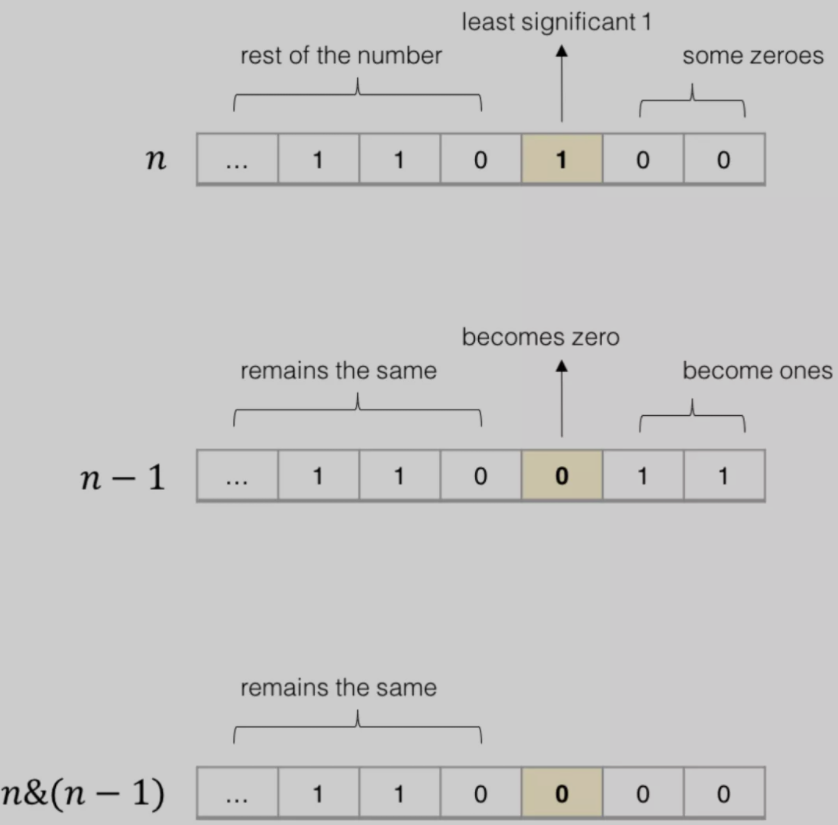

# 实用的位操作

1. **判断两个数是否异号**

```java
int x = -1, y = 2;
boolean f = ((x ^ y) < 0); // true
```

```java
int x = 3, y = 2;
boolean f = ((x ^ y) < 0); // false
```

- 位运算来判断是否异号，利用的是补码编码的符号位
  - 若需要使用`if-else`分支，麻烦
  - 利用乘积或者商来判断两个数是否异号，可能造成溢出，从而出现错误

2. **不用临时变量交换两个数**

```java
int a = 1, b = 2;
a ^= b;
b ^= a;
a ^= b;
// 现在 a = 2, b = 1
```

# 算法常用

## n&(n-1)

- `n&(n-1)` ：作用是消除数字 `n` 的二进制表示中的最后一个 1
- 核心逻辑：`n - 1` 一定可以消除最后一个 1，同时把其后的 0 都变成 1，这样再和 `n` 做一次 `&` 运算，就可以仅仅把最后一个 1 变成 0 了



1. **计算汉明权重（Hamming Weight）**

> [191. 位1的个数 - LeetCode](https://leetcode-cn.com/problems/number-of-1-bits/)

```java
int hammingWeight(uint32_t n) {
    int res = 0;
    while (n != 0) {
        n = n & (n - 1);
        res++;
    }
    return res;
}
```

2. **判断一个数是不是 2 的指数**

> [231. 2 的幂 - LeetCode](https://leetcode-cn.com/problems/power-of-two/)

- 一个数如果是 2 的指数，那么它的二进制表示一定只含有一个 1

```java
boolean isPowerOfTwo(int n) {
    if (n <= 0) return false;
    return (n & (n - 1)) == 0;
}
```

## n&(-n)

- `n&(-n)`：作用是得到最低位的 1

## 异或^

- 异或运算的性质
  1. 交换律
  2. 结合律
  3. 对于任何数`n`，都有`n ^ n = 0`，`n ^ 0 = n`，`n ^ 1 = ~n`

1. **查找只出现一次的元素**

> [136. 只出现一次的数字 - LeetCode](https://leetcode-cn.com/problems/single-number/)

- 只要把所有数字进行异或，成对的数字就会变成 0，落单的数字和 0 做异或还是它本身，所以最后异或的结果就是只出现一次的元素

```java
int singleNumber(int[] nums) {
    int res = 0;
    for (int n : nums) {
        res ^= n;
    }
    return res;
}
```

