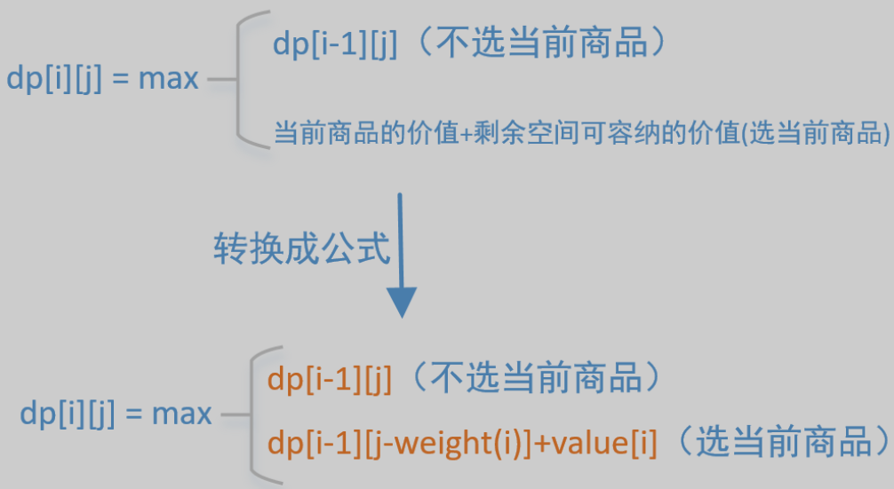

# 动态规划问题框架

## 特点

- 动态规划问题的核心问题是**穷举**
- 动态规划问题的一般形式是**求最值**
- **自底向上**、**循环迭代**完成计算

## 三要素

### 重叠子问题

- 存在重复求解的问题 / 计算
- 使用`dp table`或`memo`备忘录消除重叠子问题，即记录子问题的解，需要时直接取用该解，而不是重新计算

### 最优子结构

- 要符合最佳子结构，**子问题之间必须互相独立**
- 可以通过子问题的最优解，得到最终问题的最优解

### 状态转移方程

- 状态转移方程直接代表着暴力解法
- 辅助思路：
  1. 明确状态：原问题和子问题中的变量
  
     ```python
     for 状态1 in 状态1的所有取值：
         for 状态2 in 状态2的所有取值：
             for ...
                 dp[状态1][状态2][...] = 择优(选择1，选择2...)
     ```
  
  2. 定义 `dp`数组/函数的含义：`dp[n]`代表什么
  
  3. 明确选择并择优：对于每个状态，可以做出什么选择改变当前状态
  
  4. 明确`base case`：`dp[0]`

## dp 函数与 dp 数组的区别

### dp 函数

- **自顶向下**，**递归**
- **优化：备忘录 memo 消除重叠子问题**

### dp 数组

- **自底向上**，**迭代**
- **优化：状态压缩（数组降维）降低空间复杂度**

# 0-1 背包问题

> 有N件物品和一个容量为V的包，第i件物品的重量是w[i]，价值是v[i]，求将哪些物品装入背包可使这些物品的重量总和不能超过背包重量，且价值总和最大



## 代码实现

```java
public static int packageProblem() {
    int packageContainWeight = 4; // 假设背包最大可装重量
    int[] weight = {1, 4, 3}; // 假设3个物品的重量
    int[] value = {150, 300, 200}; // 假设3个物品的价格
    int[][] dp = new int[weight.length + 1][packageContainWeight + 1]; // dp[][] 全填入 0, base case 已初始化
    for(int i = 1; i <= value.length; i++) {
        for(int j = 1; j <= packageContainWeight; j++) {
            if(j >= weight[i-1]) { // 如果剩余空间大于所放物品
                dp[i][j] = Math.max(dp[i-1][j], dp[i-1][j - weight[i-1] + value[i-1]);
            } else {
                dp[i][j] = dp[i-1][j];
            }
        }
    }
    return dp[weight.length][packageContainWeight];
}
```

## 空间优化

- 二维数组在每次计算中只需要上一行的数字，改用一维数组（一维数组需要逆序，否则会导致重复计算）
- 计算`dp[j]`的值的时候，数组后面的值会依赖前面的值，而前面的值不会依赖后面的值，如果不采用逆序的方式，数组前面的值更新了会对后面产生影响

```java
public static int packageProblem() {
    int packageContainWeight = 4; // 假设背包最大可装重量
    int[] weight = {1, 4, 3}; // 假设3个物品的重量
    int[] value = {150, 300, 200}; // 假设3个物品的价格
    int[] dp = new int[packageContainWeight + 1];
    for(int i = 1; i <= value.length; i++) {
        for(int j = packageContainWeight; j >= 1; j--) {
            if(j >= weight[i-1]) { // 如果剩余空间大于所放物品
                dp[j] = Math.max(dp[j], dp[j - weight[i-1]] + value[i-1]);
            }
        }
    }
    return dp[packageContainWeight];
}
```

## 递归实现

```java
int[] weight = {1, 4, 3}; // 假设3个物品的重量
int[] value = {150, 300, 200}; // 假设3个物品的价格

// i: 处理到第i件物品, j: 可容纳的重量
public int packageProblem(int i, int j) {
    if(i == -1) { // 递归结束条件
        return 0;
    }
    int v1 = 0；
    if(j >= weight[i]) { // 如果剩余空间大于所放物品
        v1 = packageProblem(i-1, j - weight[i]) + value[i]; // 选择第i件
    }
    int v2 = packageProblem(i-1, j); // 不选择第i件
    return Math.max(v1, v2);
}
```

# 子集背包问题

*0-1 背包问题的变体*

> [416. 分割等和子集 - LeetCode](https://leetcode-cn.com/problems/partition-equal-subset-sum/)
>
> 只包含正整数的非空数组，判断是否可以将这个数组分割成两个子集，使得两个子集的元素和相等

## 转化为背包问题

1. 先对集合求和，得出`sum`
2. **给一个可装载重量为`sum/2`的背包和`N`个物品，每个物品的重量为`nums[i]`。判断是否存在一种装法，能够恰好将背包装满**

## 算法

1. 明确**状态**和**选择**
   - 状态：**背包的容量**和**可选择的物品**
   - 选择：**装进背包**或者**不装进背包**
2. 明确`dp`数组的定义
   - `dp[i][j] = x`表示，对于前`i`个物品，当前背包的容量为`j`时，若`x`为`true`，则说明可以恰好将背包装满，若`x`为`false`，则说明不能恰好将背包装满
3. 根据**选择**，思考状态转移的逻辑
   - **不把这第`i`个物品装入背包**，那么是否能够恰好装满背包，取决于上一个状态`dp[i-1][j]`
   - **把这第`i`个物品装入了背包**，那么是否能够恰好装满背包，取决于状态上一个`dp[i - 1][j-nums[i-1]]`
4. 边界情况和 base case
   - `dp[...][0] = true`：背包没有空间的时候，就相当于装满了
   - `dp[0][...] = false`：当没有物品可选择的时候，肯定没办法装满背包

## 代码实现

```java
public boolean canPartition(int[] nums) {
	int sum = 0;
	for(int num : nums)
		sum += num;
	if(sum % 2 != 0)
	return false;
	int n = nums.length;
	boolean[][] dp = new boolean[n + 1][sum / 2 + 1];
	for(int i = 0; i <= n; i++)
		dp[i][0] = true;
	for(int i = 1; i <= n; i++) {
		for(int j = 0; j <= sum / 2; j++) {
			if(j >= nums[i-1])
				dp[i][j] = dp[i-1][j] || dp[i-1][j-nums[i-1]];
			else
				dp[i][j] = dp[i-1][j];
		}
	}
	return dp[n][sum/2];
}
```

## 优化：状态压缩

- 将二维`dp`数组压缩为一维，节约空间复杂度
- **唯一需要注意的是`j`应该从后往前反向遍历，因为每个物品（或者说数字）只能用一次，以免之前的结果影响其他的结果**

```java
public boolean canPartition(int[] nums) {
	int sum = 0;
	for(int num : nums)
		sum += num;
	if(sum % 2 != 0)
		return false;
	int n = nums.length;
	boolean[] dp = new boolean[sum / 2 + 1];
	dp[0] = true;
	for(int i = 1; i <= n; i++) {
		for(int j = sum / 2; j >= 0; j--) {
			if(j >= nums[i-1])
				dp[j] = dp[j] || dp[j-nums[i-1]];
			else
				dp[j] = dp[j];
		}
	}
	return dp[sum/2];
}
```

# 完全背包问题

*0-1 背包问题的变体*

> [518. 零钱兑换 II - LeetCode](https://leetcode-cn.com/problems/coin-change-2/)
>
> 一个整数数组 coins 表示不同面额的硬币，另给一个整数 amount 表示总金额。计算并返回可以凑成总金额的硬币组合数。如果任何硬币组合都无法凑出总金额，返回 0 。假设每一种面额的硬币有无限个。

## 转化为背包问题

- 有一个背包，最大容量为`amount`，有一系列物品`coins`，每个物品的重量为`coins[i]`，**每个物品的数量无限**。请问有多少种方法，能够把背包恰好装满？

## 算法

1. 明确**状态**和**选择**
   - 状态：**背包的容量**和**可选择的物品**
   - 选择：**装进背包**或者**不装进背包**
2. 明确`dp`数组的定义
   - `dp[i][j]`表示，对于前`i`个物品，当前背包的容量为`j`时，有`dp[i][j]`种方法可以装满背包
3. 根据**选择**，思考状态转移的逻辑
   - **不把这第`i`个物品装入背包**，那么是否能够恰好装满背包，取决于上一个状态`dp[i-1][j]`
   - **把这第`i`个物品装入了背包**，那么是否能够恰好装满背包，取决于状态上一个`dp[i][j-nums[i-1]]`，**因为每个物品的数量无限**
4. 边界情况和 base case
   - `dp[...][0] = 1`：如果凑出的目标金额为 0，那么"不作为"就是唯一的一种凑法
   - `dp[0][...] = 0`：如果不使用任何硬币面值，就无法凑出任何金额

## 代码实现

```java
int change(int amount, int[] coins) {
    int n = coins.length;
    int[][] dp = amount int[n + 1][amount + 1];
    // base case
    for (int i = 0; i <= n; i++) 
        dp[i][0] = 1;

    for (int i = 1; i <= n; i++) {
        for (int j = 1; j <= amount; j++)
            if (j - coins[i-1] >= 0)
                dp[i][j] = dp[i - 1][j] 
                         + dp[i][j - coins[i-1]];
            else 
                dp[i][j] = dp[i - 1][j];
    }
    return dp[n][amount];
}
```

## 优化：状态压缩

- 将二维`dp`数组压缩为一维，节约空间复杂度
- **唯一需要注意的是`j`应该从前往后正向遍历，因为每个物品（或者说数字）的数量无限**

```java
int change(int amount, int[] coins) {
    int n = coins.length;
    int[] dp = new int[amount + 1];
    dp[0] = 1; // base case
    for (int i = 1; i <= n; i++)
        for (int j = 1; j <= amount; j++)
            if (j - coins[i] >= 0)
                dp[j] = dp[j] + dp[j-coins[i-1]];

    return dp[amount];
}
```

# 子序列类型问题

# 编辑距离

