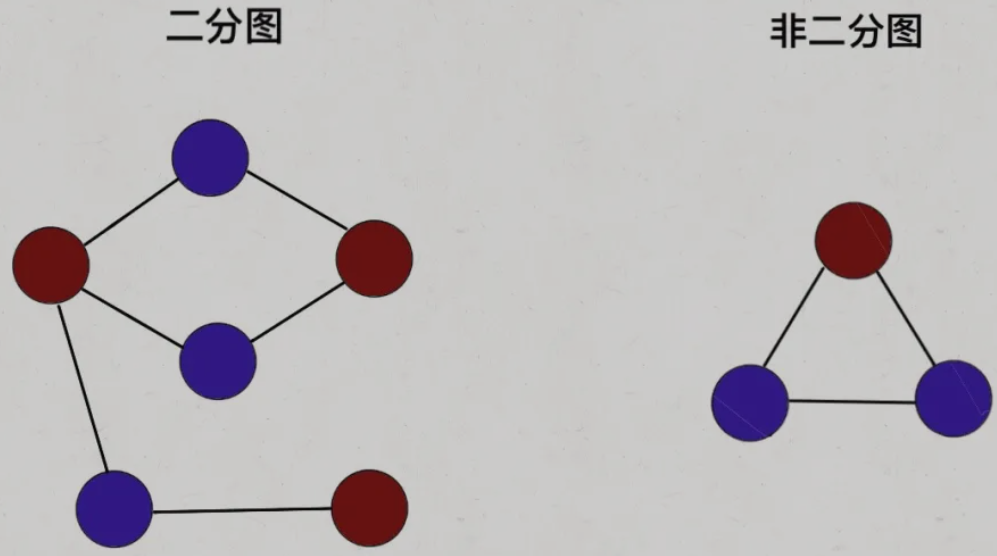

# 基本概念

- 完全图：每个顶点到其他顶点都有一条边
  - 无向完全图：$n$个顶点且有$n*(n-1)/2$
  - 有向完全图：$n$个顶点且有$n*(n-1)$
- 度：与每个顶点相连的边的数量
- 入度：对有向图中某结点的孤头数（边的终点），即有多少条边指向该结点
- 出度：对有向图中某结点的孤尾数（边的起点），即该结点指向多少条边
- 连通：在无向图中，两个顶点之间有路径，则称两个顶点是连通的
- 连通图：无向图中任意一对顶点之间都是连通的
- 强连通：在有向图中，顶点$V_i$到顶点$V_j$到顶点$V_i$之间都有路径，则称两个顶点是强连通的
- 强连通图：有向图中任意一对顶点之间都是强连通的
- 权：图的每条边有一相应的数值
- 网：带权的图，分为有向网和无向网

# 图的存储结构


## 邻接矩阵

- 用$n*n$的方针表示具有$n$个顶点的图，矩阵元素$a_{ij}$表示是否存在$(i,j)$边或$(i,j)$边的权值
- 优点：可以快速判断两个顶点是否相邻，适合稠密图
- 缺点：占用空间大，空间利用率较低

## 邻接表

- 数组+单向链表：`List<Integer>[] graph = new LinkedList[];`
  - 数组存储图中各顶点的数据
  - 在每个顶点建立一个单向链表，存储该顶点的所有相邻顶点
- 优点：占用空间少，适合非稠密图
- 缺点：无法快速判断两个顶点是否相邻

# 判断有向图是否存在环

## 分析

- 依赖问题，首先想到的就是把问题转化成**有向图**这种数据结构，只要**图中存在环**，那就说明存在**循环依赖**
- 通过遍历判断图中是否存在环

> 基于 [LeetCode 207. 课程表](https://leetcode-cn.com/problems/course-schedule/)，`numCources`表示课程数量；`prerequisites[i]=[a,b]`表示如果要学习课程 a，必须先学习课程 b

```java
// 记录一次 track 递归经过的结点, 用于判断是否存在环
boolean[] onPath;
// 记录遍历过的结点, 避免走回头路
boolean[] visited;
// 记录图中是否存在环
boolean hasCycle = false;

boolean canFinish(int numCources, int[][] prerequisites) {
    List<Integer>[] graph = buildGraph(numCourses, prerequisites);
    
    visited = new boolean[numCourses];
    onPath = new boolean[numCourses];
    
    for(int i = 0; i < numCourses; i++) {
        // 遍历图中的所有结点
        traverse(graph, i);
    }
    // 只要没有循环依赖就可以完成所有课程
    return !hasCycle;
}
```

```java
void traverse(List<Integer>[] graph, int s) {
    if(onPath[s])
        // 存在环
        hasCycle = true;
    
    if(visited[s] || hasCycle)
        // 如果遇到遍历过的结点, 或者已经找到环, 结束遍历
        return;
    
    visited[s] = true;
    // 在进入节点s的时候将 onPath[s] 标记为 true, 离开时标记回 false, 如果发现onPath[s]已经被标记, 说明出现了环
    onPath[s] = true;
    
    for(int t : graph[s])
        // N叉树遍历
        traverse(graph, t);
    
    onPath[s] = false;
}
```

```java
List<Integer>[] buildGraph(int numcourses, int[][] prerequisites) {
    // 图中共有 numCourses 个结点
    List<Integer>[] graph = new LinkedList[numsCourses];
    for(int i = 0; i < numCourses; i++) 
        graph[i] = new LinkedList<>();
    for(int[] edge : prerequisites) {
        int from = edge[1];
        int to = edge[0];
        // 修完课程 from 才能修课程 to
        // 在图中添加一条从 from 指向 to 的有向边
        graph[from].add(to);
    }
    return graph;
}
```

# 图的遍历

- 图遍历框架可以从二叉树 / 多叉树遍历拓展而来
- 二叉树遍历框架

```java
// 二叉树遍历框架
void traverse(TreeNode root) {
    if(root == null) return;
    traverse(root.left);
    traverse(root.right);
}
```

- 多叉树遍历框架

```java
// 多叉树遍历框架
void traverse (Node root) {
    if(root == null) return;
    for(Node child : root.children)
        traverse(child);
}
```

## DFS 遍历

```java
// 图遍历框架
boolean[] visited;
void traverse(Graph graph, int v) {
    // 防止走回头路进入死循环
    if(visited[v]) return;
    // 前序遍历位置，标记节点v已访问
    visited[v] = true;
    for(Node neighbor : graph.neighbors(v))
        traverse(graph, neighbor);
}
```

## BFS 遍历

```java
// 图遍历框架
boolean[] visited;
void bfs(Graph graph, int start) {
    // 防止走回头路进入死循环
    if(visited[start]) return;
    Queue<Integer> queue = new LinkedList<>();
    queue.offer(start);
    visited[start] = true;
    while(!queue.isEmpty()) {
        int v = queue.poll();
        for(Node neighbor : graph.neighbors(v)) {
            if(!visited[neighbor]) {
                visited[neighbor] = true;
                queue.offer(neighbor);
            }
        }
    }
}
```

# 二分图

## 基本概念

- 二分图的顶点集可分割为两个互不相交的子集，图中每条边依附的两个顶点都分属于这两个子集，且两个子集内的顶点不相邻
- **双色问题：给定一幅图，请用两种颜色将图中的所有顶点着色，且使得任意一条边的两个端点的颜色都不相同**



- 二分图作为一种特殊的图模型，会被很多高级图算法（比如最大流算法）用到

## 二分图的判定

> [785. 判断二分图 - LeetCode](https://leetcode-cn.com/problems/is-graph-bipartite/)
>
> 输入一个邻接表表示一幅**无向图**，请判断这幅图是否是二分图

### 算法

- 让`traverse`函数一边遍历节点，一边给节点染色，尝试让每对相邻节点的颜色都不一样
- 若相邻节点`neighbor`没有被访问过，给节点`neighbor`涂上和节点`v`不同的颜色
- 若相邻节点`neighbor`已经被访问过，应该比较节点`neighbor`和节点`v`的颜色，若相同，则此图不是二分图

### DFS 实现

```java
// 记录图是否符合二分图性质
private boolean[] ok = true;
// 记录图中节点的颜色，false 和 true 代表两种不同颜色
private boolean[] color;
// 记录图中节点是否被访问过
private boolean[] visited;

// 主函数，输入邻接表，判断是否是二分图
public boolean isBipartite(int[][] graph) {
    int n = graph.length;
    color = new boolean[n];
    visited = new boolean[n];
    // 因为图不一定是联通的，可能存在多个子图
    // 所以要把每个节点都作为起点进行一次遍历
    // 如果发现任何一个子图不是二分图，整幅图都不算二分图
    for(int v = 0; v < n; v++) {
        if(!visited[v])
            traverse(graph, v);
    }
    return ok;
}

// DFS 遍历框架
private void traverse(int[][] graph, int v) {
    // 如果已经确定不是二分图了，就不用浪费时间再递归遍历了
    if(!ok) return;
    
    visited[v] = true;
   	for(int w : graph[v]) {
        if(!visited[w]) {
            // 相邻节点 w 没有被访问过
            // 那么应该给节点 w 涂上和节点 v 不同的颜色
            color[w] = !color[v];
            // 继续遍历 w
            traverse(graph, w);
        } else {
            // 相邻节点 w 已经被访问过
            // 根据 v 和 w 的颜色判断是否是二分图
            if(color[w] == color[v])
                // 若相同，则此图不是二分图
                ok = false;
        }
    }
}
```

### BFS 实现

```java
// 记录图是否符合二分图性质
private boolean[] ok = true;
// 记录图中节点的颜色，false 和 true 代表两种不同颜色
private boolean[] color;
// 记录图中节点是否被访问过
private boolean[] visited;

// 主函数，输入邻接表，判断是否是二分图
public boolean isBipartite(int[][] graph) {
    int n = graph.length;
    color = new boolean[n];
    visited = new boolean[n];
    // 因为图不一定是联通的，可能存在多个子图
    // 所以要把每个节点都作为起点进行一次遍历
    // 如果发现任何一个子图不是二分图，整幅图都不算二分图
    for(int v = 0; v < n; v++) {
        if(!visited[v])
            bfs(graph, v);
    }
    return ok;
}

// 从 start 节点开始进行 BFS 遍历
private void bfs(int[][] graph, int start) {
    Queue<Integer> queue = new LinkedList<>();
    visited[start] = true;
    queue.offer(start);
    
    while(!queue.isEmpty() && ok) {
        int v = queue.poll();
        // 从节点 v 向所有相邻节点扩散
        for(int w : graph[v]) {
            if(!visited[w]) {
                // 相邻节点 w 没有被访问过
                // 那么应该给节点 w 涂上和节点 v 不同的颜色
                color[w] = !color[v];
                // 标记 w 节点，并放入队列
                visited[w] = true;
                queue.offer(w);
            } else {
                // 相邻节点 w 已经被访问过
                // 根据 v 和 w 的颜色判断是否是二分图
                if(color[w] == color[v])
                    // 若相同，则此图不是二分图
                    ok = false;
            }
        }
    }
}
```

### 复杂度

- 两种实现方法的复杂度相同
- **时间复杂度**：$O(N+M)$，其中$N$和$M$分别是无向图中的点数和边数
- **空间复杂度**：$O(N)$，记录节点颜色的数组需要$O(N)$的空间
  - 在深度优先搜索的过程中，栈的深度最大为$N$，需要$O(N)$的空间
  - 在广度优先搜索的过程中，队列中最多有$N-1$个节点，需要$O(N)$的空间

# 最小生成树

*无向网的应用*

- 图论中，通常**将树定义为一个无回路连通图**；对于无回路连通图，只要选定某个顶点作为根，以此顶点为树根对每条边定向，就能得到通常的树

## 生成树

- 生成树：若从图的某个顶点出发，可以系统地遍历图中的所有顶点，遍历时经过的边和顶点所构成的子图
- 由遍历连通图$G$时所经过的边和顶点构成的子图是$G$的生成树
- DFS 生成树：由深度优先搜索得到的生成树
- BFS 生成树：由广度优先搜索得到的生成树

## 最小生成树

- 最小生成树：权最小的生成树
- MST 性质：$G=(V,E)$是一个连通网络，$U$是顶点集$V$的一个真子集，若**$(u,v)$的一个端点在$U$里**，**另一个端点不在$U$里**，且为**具有最小权值**的一条边，则一定存在$G$的一棵**最小生成树包括此边$(u,v)$**
- 构成最小生成树的方法
  1. Prim 算法：创建并扩展一棵树，为其添加新树枝
  2. Kruskal 算法：扩展一个树的集构成一棵生成树

## 普里姆算法 Prim

### 基本思想

1. 任选$V$中一顶点$v_1$，构成入选顶点集$U={v_1}$，$V$中剩余顶点构成待选顶点集$V-U$
2. 找到连接$U$和$V-U$的最短（最小权值）边来扩充生成树$T$，直至遍历所有顶点


### Prim 伪代码

```java
PrimAlgorithm(graph) // 开始时所有的边都是排序的
    tree = null;
	edges = 按照权值大小排序的graph的全部边;
	for i=1 to |V|-1
        for j=1 to |edges|
            if edges中的边e[j]和tree中的边不产生回路且与tree中的一个顶点关联
                将e[j]添加进tree;
                break;
```

## 克鲁斯卡尔算法 Kruskal

### 基本思想

1. 令最小生成树的初始状态为只有$n$个顶点而无边的非连通图$T$
2. **按长度递增的顺序**依次选择$E$中的边$(u,v)$，该边分别连接$T$的两个不同顶点，则将该边加入$T$中，直至遍历所有顶点


### Kruskal 伪代码

```java
KurskalAlgorithm(graph) // 开始时所有的边都是排序的
    tree = null;
	edges = 按照权值大小排序的graph的全部边;
	for(i=1; i <= |E| and |tree| < |V|+1; i++)
        if edges中的边e[j]和tree中的边不产生回路
            将e[i]添加进tree;
```

## Prim 和 Kruskal 的比较

- Prim 算法和 Kruskal 算法产生的生成树是相同的，边加入树的顺序不同
- Prim 算法总是保持一棵树
- Kruskal 算法不能保持是一棵树
- 时间复杂度
  - Prim： $O(N^2)$
  - Kruskal： $O(N)$

# 最短路径

*有向网和有向图的应用*

## 基本概念

- 最短路径：两个顶点间权值总和最小的路径
- 源点：路径的开始顶点
- 单源最短路径：对于给定的有向网络$G=(V,E)$和单个源点$v$，$v$到$G$的其余顶点的最短路径

## Dijkstra 算法

- Dijkstra 算法，一般音译成迪杰斯特拉算法

### 基本思想

1. 设置两个顶点集$S$和$T$，$S$存放已确定最短路径的顶点，$T$中存放待确定最短路径的顶点
2. 初始时，$S$仅有一个源点，选取$T$中当前最短路径长度最小的一个顶点$v$加入$S$，修改剩余顶点的当前最短路径长度，直至遍历所有顶点
   - 修改原则：当源点 -> $v$ -> 该顶点的最短路径小于该顶点的当前最短路径，则更新值
3. **Dijkstra 算法要求不能存在负权重边**

### Dijkstra 伪代码

```java
S={v};
T中各顶点的距离值;
while S中顶点数 < n {
    在T中选择距离值最小的顶点u;
    S = S + {u};
    调整T中剩余顶点的距离值;
}
```

- 返回从起点`start`到所有其他节点的最短路径

```java
Class State {
    // 图节点的 id
    int id;
    // 从 start 节点到当前节点的距离
    int distFromStart;
    
    State(int id, int distFromStart) {
        this.id = id;
        this.distFromStart;
    }
}
// 返回节点 from 到节点 to 之间的边的权重
int weight(int from, int to);
// 输入节点 s 返回 s 的相邻节点
List<Integer> adj(int s);

// 输入一幅图和一个起点 start，计算 start 到其他节点的最短距离
int[] dijkstra(int start, List<Integer>[] graph) {
    // 图中节点的个数
    int V = graph.length;
    // 记录最短路径的权重，可理解为 dp table
    // 定义：distTo[i] 的值就是节点 start 到达节点 i 的最短路径权重
    int[] distTo = new int[V];
    // 求最小值，所以 dp table 初始化为正无穷
    Arrays.fill(distTo, Integer.MAX_VALUE);
    // base case，start 到 start 的最短距离是 0
    distTo[start] = 0;
    
    // 优先级队列，distFromStart 较小的排在前面
    Queue<State> pq = new PriorityQueue<>((a, b) -> {
        return a.distFromStart - b.distFromStart;
    });
    // 从起点 start 开始进行 BFS
    pq.offer(new State(start, 0));
    
    while(!pq.isEmpty()) {
        State curState = pq.poll();
        int curNodeId = curState.id;
        int curDistFromStart = curState.distFromStart;
        
        if(curDistFromStart > distTo[curNodeId])
            // 已经有一条更短的路径到达 curNode 节点了
            continue;
        
        // 将 curNode 的相邻节点装入队列
        for(int nextNodeId : adj(curNodeId)) {
            // 将 curNode 的相邻节点装入队列 
            int distToNextNode = distTo[curNodeId] + weight(curNodeId, nextNodeId);
            if(distToNextNode < distTo[nextNodeId]) {
                // 更新 dp table
                distTo[nextNodeId] = distToNextNode;
                // 将这个节点以及距离放入队列
                pq.offer(new State(nextNodeId, distToNextNode));
            }
        }
    }
    return distTo;
}
```

- 返回起点`start`到某一个终点`end`的最短路径

```java
// 输入起点 start 和终点 end，计算起点到终点的最短距离
int dijkstra(int start, int end, List<Integer>[] graph) {
    // ...
    while(!pq.isEmpty()) {
        State curState = pq.poll();
        int curNodeId = curState.id;
        int curDistFromStart = curState.distFromStart;
        
        // 在这里加一个判断就行了，其他代码不用改
        if(curNodeId == end)
            return curDistFromStart;
        
        if(curDistFromStart > distTo[curNodeId])
            continue;
        
        // ...
    }
    
    // 如果运行到这里，说明从 start 无法走到 end
    return Integer.MAX_VALUE;
}
```

### 复杂度分析

- 邻接表 + 优先队列
- 理想情况下优先级队列中最多装`V`个节点，对优先级队列的操作次数和`E`成正比，时间复杂度是$O(ElogV)$，其中`E`代表图中边的条数，`V`代表图中节点的个数
- 不同编程语言或者不同数据结构 API 都会导致算法的时间复杂度发生改变
- 使用了 Java 的`PriorityQueue`数据结构，这个容器类底层使用二叉堆实现，但没有提供通过索引操作队列中元素的 API，所以队列中会有重复的节点，最多可能有`E`个节点存在队列中，时间复杂度是$O(ElogE)$
- 空间复杂度为$O(E+V)$

## Bellman-Ford 算法

# 拓扑排序

*有向网和有向图的应用*

## 基本介绍

- AOV 网：Activity On Vertex Network，顶点活动图，用顶点表示活动，用边表示活动之间的先后次序关系的有向图
- 拓扑序列：AOV 网从顶点$v_i$到顶点$v_j$有一条路径，则在线性序列中顶点$v_i$必在顶点$v_j$之前**（有向无环图）**
- 拓扑排序：对 AOV 网构造拓扑序列的操作
  - **拓扑排序就是后序遍历反转之后的结果**
    
    
  - **拓扑排序只能针对有向无环图，进行拓扑排序之前要进行环检测**

## 基本思想

1. 从网中选择一个入度为0的顶点并输出
2. 从网中删除此顶点及其所有出边

```java
topologicSort(digraph) {
    for i = 1 to |V|
        寻找一个最小顶点v;
    	num(v) = I;
    	从digraph中删除顶点v以及与v相关联的所有边;
}
```

## 代码实现

> 基于 [LeetCode 210. 课程表II](https://leetcode-cn.com/problems/course-schedule-ii/)，`numCources`表示课程数量；`prerequisites[i]=[a,b]`表示如果要学习课程 a，必须先学习课程 b；
>
> 给定课程总量以及它们的先决条件，返回你为了学完所有课程所安排的学习顺序

```java
boolean[] visited;
// 记录后序遍历结果
List<Integer> postorder = new ArrayList<>();

int[] findOrder(int numCourses, int[][] prerequesites) {
    // 先保证图中无环
    if(!canFinish(numCourses, prerequesites))
        return new int[][];
    // 建图
    List<Integer>[] graph = buildGraph(numCourses, prerequesites);
    // 进行 DFS 遍历
    visited = new boolean[numCourses];
    for(int i = 0; i < numCourses; i++) {
        traverse(graph, i);
    }
    // 将后序遍历结果反转, 转化为int[]类型
    Collections.reverse(postorder);
    int[] res = new int[numCourses];
    for(int i = 0; i < numCourses; i++)
        res[i] = postorder.get(i);
    return res;
}
```

```java
void traverse(List<Integer>[] graph, int s) {
    if(visited[s])
        return;
    
    visited[s] = true;
    for(int t : graph[s])
        traverse(graph, t);
    // 后序遍历
    postorder.add(s);
}
```

```java
// 参考: 判断图中是否存在环
boolean canFinish(int numCourses, int[][] prerequisites){...};
List<Integer>[] buildGraph(int numCourses, int[][] prerequisites){...};
```