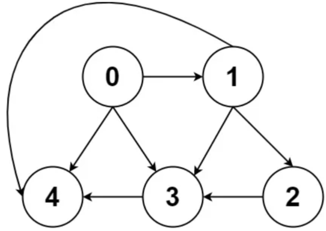
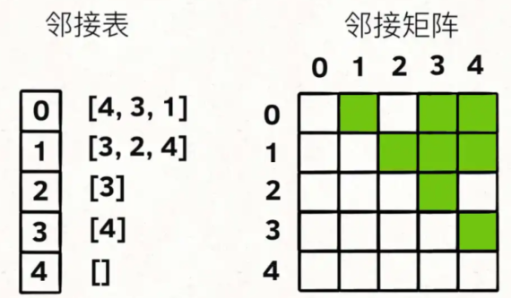
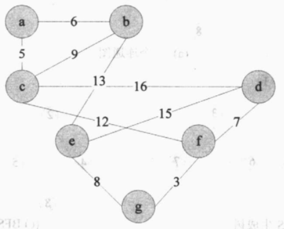
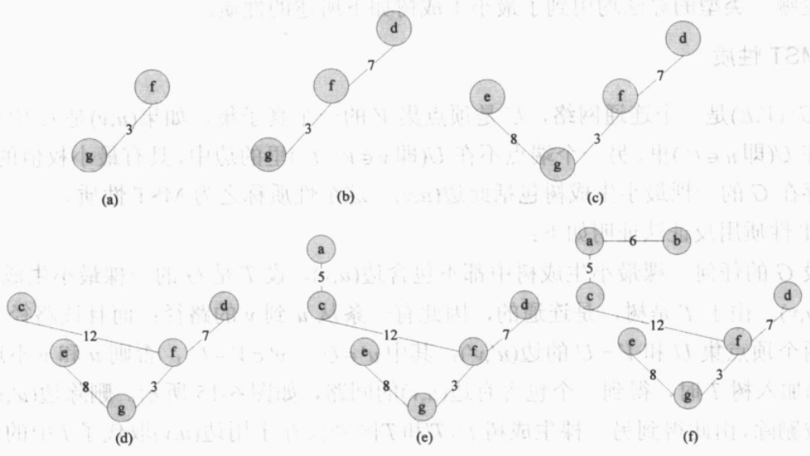
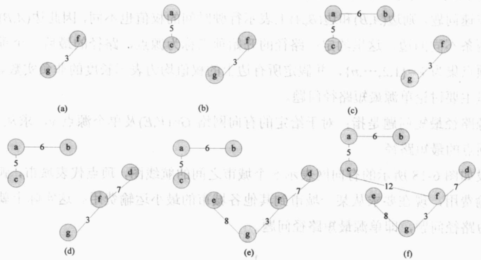
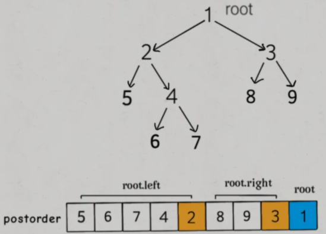
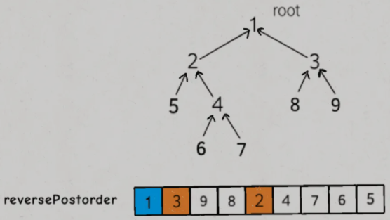

# 基本概念

- 完全图：每个顶点到其他顶点都有一条边
  - 无向完全图：$n$个顶点且有$n*(n-1)/2$
  - 有向完全图：$n$个顶点且有$n*(n-1)$
- 度：与每个顶点相连的边的数量
- 入度：对有向图中某结点的孤头数（边的终点），即有多少条边指向该结点
- 出度：对有向图中某结点的孤尾数（边的起点），即该结点指向多少条边
- 连通：在无向图中，两个顶点之间有路径，则称两个顶点是连通的
- 连通图：无向图中任意一对顶点之间都是连通的
- 强连通：在有向图中，顶点$V_i$到顶点$V_j$到顶点$V_i$之间都有路径，则称两个顶点是强连通的
- 强连通图：有向图中任意一对顶点之间都是强连通的
- 权：图的每条边有一相应的数值
- 网：带权的图，分为有向网和无向网

# 图的存储结构





## 邻接矩阵

- 用$n*n$的方针表示具有$n$个顶点的图，矩阵元素$a_{ij}$表示是否存在$(i,j)$边或$(i,j)$边的权值
- 优点：可以快速判断两个顶点是否相邻，适合稠密图
- 缺点：占用空间大，空间利用率较低

## 邻接表

- 数组+单向链表：`List<Integer>[] graph = new LinkedList<>();`
  - 数组存储图中各顶点的数据
  - 在每个顶点建立一个单向链表，存储该顶点的所有相邻顶点
- 优点：占用空间少，适合非稠密图
- 缺点：无法快速判断两个顶点是否相邻

# 判断有向图是否存在环

## 分析

- 依赖问题，首先想到的就是把问题转化成**有向图**这种数据结构，只要**图中存在环**，那就说明存在**循环依赖**
- 通过遍历判断图中是否存在环

> 基于 [LeetCode 207. 课程表](https://leetcode-cn.com/problems/course-schedule/)，`numCources`表示课程数量；`prerequisites[i]=[a,b]`表示如果要学习课程 a，必须先学习课程 b

```java
// 记录一次 track 递归经过的结点, 用于判断是否存在环
boolean[] onPath;
// 记录遍历过的结点, 避免走回头路
boolean[] visited;
// 记录图中是否存在环
boolean hasCycle = false;

boolean canFinish(int numCources, int[][] prerequisites) {
    List<Integer>[] graph = buildGraph(numCourses, prerequisites);
    
    visited = new boolean[numCourses];
    onPath = new boolean[numCourses];
    
    for(int i = 0; i < numCourses; i++) {
        // 遍历图中的所有结点
        traverse(graph, i);
    }
    // 只要没有循环依赖就可以完成所有课程
    return !hasCycle;
}
```

```java
void traverse(List<Integer>[] graph, int s) {
    if(onPath[s])
        // 存在环
        hasCycle = true;
    
    if(visited[s] || hasCycle)
        // 如果遇到遍历过的结点, 或者已经找到环, 结束遍历
        return;
    
    visited[s] = true;
    // 在进入节点s的时候将 onPath[s] 标记为 true, 离开时标记回 false, 如果发现onPath[s]已经被标记, 说明出现了环
    onPath[s] = true;
    
    for(int t : graph[s])
        // N叉树遍历
        traverse(graph, t);
    
    onPath[s] = false;
}
```

```java
List<Integer>[] buildGraph(int numcourses, int[][] prerequisites) {
    // 图中共有 numCourses 个结点
    List<Integer>[] graph = new LinkedList[numsCourses];
    for(int i = 0; i < numCourses; i++) 
        graph[i] = new LinkedList<>();
    for(int[] edge : prerequisites) {
        int from = edge[1];
        int to = edge[0];
        // 修完课程 from 才能修课程 to
        // 在图中添加一条从 from 指向 to 的有向边
        graph[from].add(to);
    }
    return graph;
}
```

# 图的遍历

## DFS 遍历

## BFS 遍历

# 最小生成树

*无向网的应用*

- 图论中，通常**将树定义为一个无回路连通图**；对于无回路连通图，只要选定某个顶点作为根，以此顶点为树根对每条边定向，就能得到通常的树

## 生成树

- 生成树：若从图的某个顶点出发，可以系统地遍历图中的所有顶点，遍历时经过的边和顶点所构成的子图

- 由遍历连通图$G$时所经过的边和顶点构成的子图是$G$的生成树

- DFS 生成树：由深度优先搜索得到的生成树

- BFS 生成树：由广度优先搜索得到的生成树

## 最小生成树

- 最小生成树：权最小的生成树
- MST 性质：$G=(V,E)$是一个连通网络，$U$是顶点集$V$的一个真子集，若**$(u,v)$的一个端点在$U$里**，**另一个端点不在$U$里**，且为**具有最小权值**的一条边，则一定存在$G$的一棵**最小生成树包括此边$(u,v)$**
- 构成最小生成树的方法
  1. Prim 算法：创建并扩展一棵树，为其添加新树枝
  2. Kruskal 算法：扩展一个树的集构成一棵生成树

## 普里姆算法 Prim

### 基本思想

1. 任选$V$中一顶点$v_1$，构成入选顶点集$U={v_1}$，$V$中剩余顶点构成待选顶点集$V-U$
2. 找到连接$U$和$V-U$的最短（最小权值）边来扩充生成树$T$，直至遍历所有顶点





### Prim 伪代码

```java
PrimAlgorithm(graph) // 开始时所有的边都是排序的
    tree = null;
	edges = 按照权值大小排序的graph的全部边;
	for i=1 to |V|-1
        for j=1 to |edges|
            if edges中的边e[j]和tree中的边不产生回路且与tree中的一个顶点关联
                将e[j]添加进tree;
                break;
```

## 克鲁斯卡尔算法 Kruskal

### 基本思想

1. 令最小生成树的初始状态为只有$n$个顶点而无边的非连通图$T$
2. 按长度递增的顺序依次选择$E$中的边$(u,v)$，该边分别连接$T$的两个不同顶点，则将该边加入$T$中，直至遍历所有顶点




### Kruskal 伪代码

```java
KurskalAlgorithm(graph) // 开始时所有的边都是排序的
    tree = null;
	edges = 按照权值大小排序的graph的全部边;
	for(i=1; i <= |E| and |tree| < |V|+1; i++)
        if edges中的边e[j]和tree中的边不产生回路
            将e[i]添加进tree;
```

## Prim 和 Kruskal 的比较

- Prim 算法和 Kruskal 算法产生的生成树是相同的，边加入树的顺序不同
- Prim 算法总是保持一棵树
- Kruskal 算法不能保持是一棵树
- 时间复杂度
  - Prim：$O(N^2)$
  - Kruskal：$O(N)$

# 最短路径

*有向网和有向图的应用*

## 基本概念

- 最短路径：两个顶点间权值总和最小的路径
- 源点：路径的开始顶点
- 单源最短路径：对于给定的有向网络$G=(V,E)$和单个源点$v$，$v$到$G$的其余顶点的最短路径

## 迪卡斯特拉算法 Dijkstra

### 基本思想

1. 设置两个顶点集$S$和$T$，$S$存放已确定最短路径的顶点，$T$中存放待确定最短路径的顶点
2. 初始时，$S$仅有一个源点，选取$T$中当前最短路径长度最小的一个顶点$v$加入$S$，修改剩余顶点的当前最短路径长度，直至遍历所有顶点
   - 修改原则：当源点 -> $v$ -> 该顶点的最短路径小于该顶点的当前最短路径，则更新值

### Dijkstra 伪代码

```java
S={v};
T中各顶点的距离值;
while S中顶点数 < n {
    在T中选择距离值最小的顶点u;
    S = S + {u};
    调整T中剩余顶点的距离值;
}
```

# 拓扑排序

*有向网和有向图的应用*

## 基本介绍

- AOV 网：Activity On Vertex Network，顶点活动图，用顶点表示活动，用边表示活动之间的先后次序关系的有向图

- 拓扑序列：AOV 网从顶点$v_i$到顶点$v_j$有一条路径，则在线性序列中顶点$v_i$必在顶点$v_j$之前**（有向无环图）**

- 拓扑排序：对 AOV 网构造拓扑序列的操作

  - **拓扑排序就是后序遍历反转之后的结果**

    

    

  - **拓扑排序只能针对有向无环图，进行拓扑排序之前要进行环检测**

## 基本思想

1. 从网中选择一个入度为0的顶点并输出
2. 从网中删除此顶点及其所有出边

```java
topologicSort(digraph) {
    for i = 1 to |V|
        寻找一个最小顶点v;
    	num(v) = I;
    	从digraph中删除顶点v以及与v相关联的所有边;
}
```

## 代码实现

> 基于 [LeetCode 210. 课程表II](https://leetcode-cn.com/problems/course-schedule-ii/)，`numCources`表示课程数量；`prerequisites[i]=[a,b]`表示如果要学习课程 a，必须先学习课程 b；
>
> 给定课程总量以及它们的先决条件，返回你为了学完所有课程所安排的学习顺序

```java
boolean[] visited;
// 记录后序遍历结果
List<Integer> postorder = new ArrayList<>();

int[] findOrder(int numCourses, int[][] prerequesites) {
    // 先保证图中无环
    if(!canFinish(numCourses, prerequesites))
        return new int[][];
    // 建图
    List<Integer>[] graph = buildGraph(numCourses, prerequesites);
    // 进行 DFS 遍历
    visited = new boolean[numCourses];
    for(int i = 0; i < numCourses; i++) {
        traverse(graph, i);
    }
    // 将后序遍历结果反转, 转化为int[]类型
    Collections.reverse(postorder);
    int[] res = new int[numCourses];
    for(int i = 0; i < numCourses; i++)
        res[i] = postorder.get(i);
    return res;
}
```

```java
void traverse(List<Integer>[] graph, int s) {
    if(visited[s])
        return;
    
    visited[s] = true;
    for(int t : graph[s])
        traverse(graph, t);
    // 后序遍历
    postorder.add(s);
}
```

```java
// 参考: 判断图中是否存在环
boolean canFinish(int numCourses, int[][] prerequisites){...};
List<Integer>[] buildGraph(int numCourses, int[][] prerequisites){...};
```