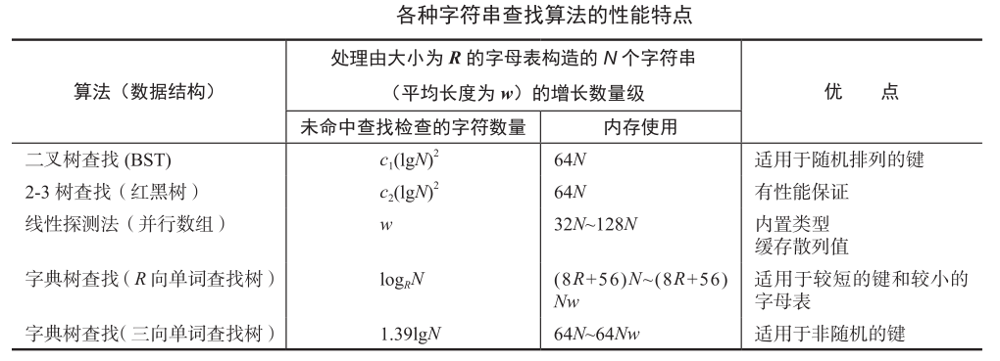

# 基本介绍

- 字典树 / 前缀树 / 单词查找树（trie，发音为 try）是一种数据结构，由字符串键中的所有字符构造而成，允许使用被查找键中的字符进行查找

# 基本性质

- 字典树的每个结点都含有`R`条链接，其中`R`为字母表的大小，对应着每个可能出现的字符
- 这些链接可能为空，也可能指向其他结点
- 将每个键所关联的值保存在该键的最后一个字母所对应的结点中
- 值为空的结点在符号表中没有对应的键，它们的存在是为了简化单词查找树中的查找操作


# 特殊性质

- **字典树的链表结构（形状）和键的插入或删除顺序无关**：对于任意给定的一组键，其单词查找树都是唯一的
- 在字典树中**查找**一个键或是**插入**一个键时，**访问数组的次数最多为键的长度加1**
- **未命中的查找一般都只需要检查很少的几个结点，查找未命中的成本与键的长度无关**：字母表的大小为`R`，在一棵由`N`个随机键构造的字典树中，未命中查找平均所需检查的结点数量为$~log_RN$
- 一棵字典树中的链接总数在`RN`到`RNw`之间，其中`w`为键的平均长度
  1. 当所有键均较短时，链接的总数接近于`RN`
  2. 当所有键均较长时，链接的总数接近于`RNw`
  3. 缩小`R`能够节省大量的空间
- **使用字典树 / 前缀树（Trie）的数据结构使得插入、查询全词、查询前缀的时间复杂度与已插入的单词数目无关**

# 查找操作

- 以被查找的键中的字符为导向，从根结点开始
- 字典树中的每个结点都包含了下一个可能出现的所有字符的链接
- 查找的结果
  1. 键的尾字符所对应的结点中的值非空：命中的查找，键所对应的值就是键的尾字符所对应的结点中保存的值
  2. 键的尾字符所对应的结点中的值为空：未命中的查找，符号表中不存在被查找的键
  3. 查找结束于一条空链接：未命中的查找

# 插入操作

- 插入之前要进行一次查找：在单词查找树中意味着沿着被查找的键的所有字符到达树中表示尾字符的结点或者一个空链接
- **在到达键的尾字符之前就遇到了一个空链接**：需要为键中还未被检查的每个字符创建一个对应的结点并将键的值保存到最后一个字符的结点中
- **在遇到空链接之前就到达了键的尾字符**：将该结点的值设为键所对应的值（无论该值是否为空）

# 结点的表示

- 每个结点都含有`R`个链接，对应着每个可能出现的字符
-  **R 向字典树**：基于含有`R`个字符的字母表的字典树
- **键是由从根结点到含有非空值的结点的路径所隐式表示的**（事实上，数据结构不会存储任何字符串或字符，它保存了链接数组和值）

# 删除操作

1. 找到键所对应的结点并将它的值设为空（null）
2. 如果该结点含有一个非空的链接指向某个子结点，那么就不需要再进行其他操作
3. 如果它的所有链接均为空，那就需要从数据结构中删去这个结点
4. 如果删去它使得它的父结点的所有链接也均为空，就需要继续删除它的父结点，依此类推

# Trie 的实现

> [208. 实现 Trie (前缀树) - LeetCode](https://leetcode-cn.com/problems/implement-trie-prefix-tree/)

## 结点信息

- Trie / 前缀树 / 字典树，是一棵有根树，其每个结点包含以下字段
  - 指向子结点的指针数组`children`，数组长度为 2626，即小写英文字母的数量。此时`children[0]`对应小写字母 a，`children[1]`对应小写字母 b，...，`children[25]`对应小写字母 z
- 布尔字段`isEnd`，表示该结点是否为字符串的结尾

## 插入字符串

- 从字典树的根开始，插入字符串。对于当前字符对应的子结点，有两种情况：
  - 子结点存在：沿着指针移动到子结点，继续处理下一个字符
  - 子结点不存在：创建一个新的子结点，记录在`children`数组的对应位置上，然后沿着指针移动到子结点，继续搜索下一个字符
- 重复以上步骤，直到处理字符串的最后一个字符，然后将当前结点标记为字符串的结尾

## 查找前缀

- 从字典树的根开始，查找前缀。对于当前字符对应的子结点，有两种情况：
  - 子结点存在：沿着指针移动到子结点，继续处理下一个字符
  - 子结点不存在：说明字典树中不包含该前缀，返回空指针
- 重复以上步骤，直到返回空指针或搜索完前缀的最后一个字符
- **若搜索到了前缀的末尾，就说明字典树中存在该前缀；此外，若前缀末尾对应结点的`isEnd`为`true`，则说明字典树中存在该字符串**

## 代码实现

```java
class Trie {

    private Trie[] children;
    private boolean isEnd;

    /** Initialize your data structure here. */
    public Trie() {
        children = new Trie[26];
        isEnd = false;
    }
    
    /** Inserts a word into the trie. */
    public void insert(String word) {
        Trie node = this;
        for(int i = 0; i < word.length(); i++) {
            char ch = word.charAt(i);
            int index = ch - 'a';
            if(node.children[index] == null)
                node.children[index] = new Trie();
            node = node.children[index];
        }
        node.isEnd = true;
    }
    
    /** Returns if the word is in the trie. */
    public boolean search(String word) {
        Trie node = searchPrefix(word);
        return node != null && node.isEnd;
    }
    
    /** Returns if there is any word in the trie that starts with the given prefix. */
    public boolean startsWith(String prefix) {
        return searchPrefix(prefix) != null;
    }

    private Trie searchPrefix(String prefix) {
        Trie node = this;
        for(int i = 0; i < prefix.length(); i++) {
            char ch = prefix.charAt(i);
            int index = ch - 'a';
            if(node.children[index] == null)
                return null;
            node = node.children[index];
        }
        return node;
    }
}
```

## 复杂度分析

- 时间复杂度：初始化为$O(1)$，其余操作为$O(|S|)$，其中$|S|$是每次插入或查询的字符串的长度
- 空间复杂度：$O(|T|\cdot\Sigma)$，其中$|T|$为所有插入字符串的长度之和，$\Sigma$为字符集的大小，此处$\Sigma=26$


# 三向字典树

## 基本概念

- 在三向字典树中，每个结点都含有一个字符、三条链接和一个值
- 这三条链接分别对应着当前字母**小于**、**等于**和**大于**结点字母的所有键

## 性质

- 空间：由于每个结点只含有三个链接，因此三向字典树所需空间远小于对应的字典树
- 查找成本：计算三向字典树中查找（和插入）操作的成本，需要将它所对应的字典树中的查找成本乘以遍历每个结点的二叉查找树所需的成本



