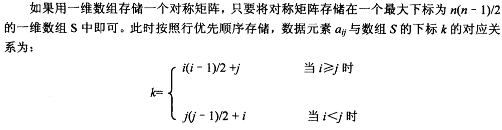
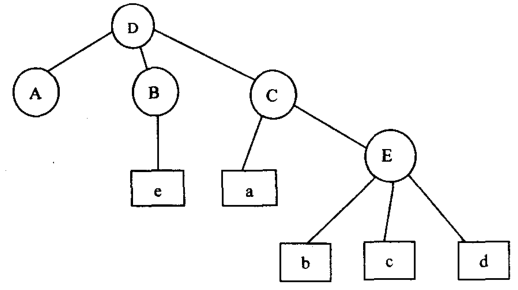
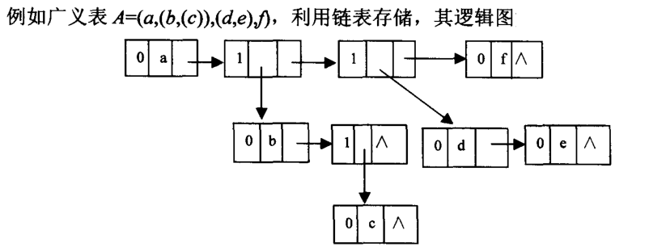
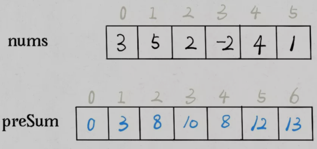
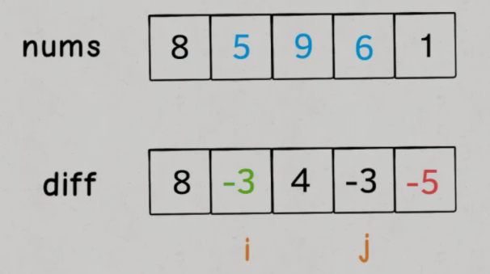

# 多维数组

## 行优先顺序存储

- 以`m*n`的二维数组为例，第`i`行第`j`列的数据元素的地址为：

  ```java
  loc(a[i][j]) = loc(a[0][0]) + (i*n + j) * c
  // 每个元素占有c个存储单元
  ```

- 以`m*n*k*l`的四维数组为例，数据元素的地址为：

  ```java
  loc(a[i][j][p][q]) = loc(a[0][0][0][0]) + (i*n*k*l + j*k*l + p*l + q) * c
  // 每个元素占有c个存储单元
  ```

## 列优先顺序存储

- 以`m*n`的二维数组为例，第`i`行第`j`列的数据元素的地址为：

  ```java
  loc(a[i][j]) = loc(a[0][0]) + (j*m + i) * c
  // 每个元素占有c个存储单元
  ```

# 矩阵的压缩存储

- 在矩阵存储中，根据规律只要存储其中一部分，另一部分的存储地址可以通过相应的算法计算出来，占用较少的存储空间
- 矩阵的压缩存储仅针对特殊矩阵
- 二维数组的压缩存储一般有3种：**对称矩阵**、**稀疏矩阵**、**三角矩阵**

## 对称矩阵

- 只要存储对角的数据元素和一半的数据元素（下三角的元素），占用的存储单元为$n(n-1)/2$，而不是$n^2$

  

- 对角矩阵：除了主对角线上和直接在主对角线上、下方若干条对角线上的元素之外，其余元素皆为零

## 稀疏矩阵

- 稀疏矩阵一般是矩阵中的大部分元素为零，仅有少量元素非0的矩阵
- 稀疏矩阵的压缩存储采用三元组的方法实现
  - 每一个非零元素占有一行，每行中包括非零元素所在的行号、列号、非零元素的数值：`(row col value)`
  - 一般在第一行描述矩阵的行数、列数和非零元素的个数
- 一般对`m*n`的矩阵来说，只要满足`(t+1)*3 <= m*n`这个条件，使用三元组存储可以节省空间（`t`为非零元素的个数）

## 稀疏矩阵转换为三元组存储

### 代码实现

```java
public static int[][] Transfer(int[][] data) {
    int compressData[][] = new int[10][3]; // 假设一个10*3的行优先存储三元组空间, 按需求更改
    int row = data.length;
    int col = data.length.length;
    int index = 0; // 三元组的行号
    for(int i = 0; i < row; i++) {
        for(int j = 0; j < col; j++) {
            if(data[i][j] != 0) {
                index++;
                compressData[index][0] = i; // 非零元素的行号
                compressData[index][1] = j; // 非零元素的列号
                compressData[index][2] = data[i][j]; // 非零元素的值
            }
        }
    }
    // 给三元组的第0行赋值
    compressData[0][0] = row;
    compressData[0][1] = col;
    compressData[0][2] = index;
    return compressData;
}
```

# 广义表

## 广义表定义

- 广义表是线性表的扩展，为`n(n>=0)`个元素的有限集合
- 元素可以是一个原子元素（不可再分元素），也可以是一个可以再分的元素（一个子表）
- 广义表的表头为广义表中的第一个元素，表尾为去掉表头之后的所有元素



## 广义表存储

- 一般采用链表存储，节点逻辑结构为：`flag - info - link`
  - `flag`：标志位，`flag==0`表示原子元素，`flag==1`表示子表
  - `info`：当`flag==0`时，表示原子元素的值；当`flag==1`时，表示指向子表第一个节点的指针
  - `link`：表示指针，指向广义表的下一个元素



# 前缀和

- **快速得到某个子数组的和**，即给定一个数组`nums`，在$O(1)$时间内返回`nums[i..j]`的和，需要构造**前缀和数组**
- **主要用于处理数组区间的问题，原始数组不会被修改的情况下，频繁查询某个区间的累加和**
- 前缀和数组`preSum`：`preSum[i]`是`nums[0..i-1]`的和
- `nums[i..j]`的和：`preSum[j+1] - preSum[i]`



```java
int n = nums.length;
// 构造前缀和数组
int[] preSum = new int[n + 1];
preSum[0] = 0;
for (int i = 0; i < n; i++)
    preSum[i + 1] = preSum[i] + nums[i];

// 查询闭区间 nums[i, j] 的累加和
int sum = preSum[j + 1] - preSum[i];
```

# 差分数组

- **主要用于频繁对原始数组的某个区间的元素进行增减**

- 差分数组`diff`：`diff[i] = nums[i] - nums[i - 1]`

- `diff`差分数组反推出原始数组`nums`：`nums[i] = nums[i - 1] + diff[i]`

- **差分数组`diff`可以快速进行区间增减的操作**，想对区间`nums[i..j]`的元素全部加 3，那么只需要让`diff[i] += 3`，然后再让`diff[j+1] -= 3`即可

  

```java
class Difference {
    // 差分数组
    private int[] diff;
    
    public Difference(int[] nums) {
        assert nums.length > 0;
        diff = new int[nums.length];
        // 构造差分数组
        diff[0] = nums[0];
        for(int i = 1; i < nums.length; i++)
            diff[i] = nums[i] - nums[i - 1];
    }
    
    // 给闭区间 [i,j] 增加 val（可以是负数）
    public void increment(int i, int j, int val) {
        diff[i] += val;
        //当j+1 >= diff.length时，说明是对nums[i]及以后的整个数组都进行修改
        那么就不需要再给diff数组减val
        if(j + 1 < diff.length)
            diff[j + 1] -= val;
    }
    
    public int[] result() {
        int[] res = new int[diff.length];
        res[0] = diff[0];
        for(int i = 1; i < diff.length; i++)
            res[i] = res[i - 1] + diff[i];
        return res;
    }
}
```


# 树状数组

- 树状数组，即 Binary Indexed Tree (B.I.T)， 通常用于解决**区间查询**，**单点修改**，**查询和修改**的时间复杂度为$log N$
- 例题：[307. 区域和检索 - 数组可修改 - LeetCode](https://leetcode.cn/problems/range-sum-query-mutable/)

```java
// 先将这三个方法写出来，关于树状数组的
{
    int[] tree;  // 树状数组，长度为 n + 1
    int lowbit(int x) {
        return x & -x;
    }
    // 查询前缀和（树状数组 x 位置）的方法
    int query(int x) {
        int ans = 0;
        for(int i = x; i > 0; i -= lowbit(i))
            ans += tree[i];
        return ans;
    }
    // 在树状数组 x 位置中增加值 u
    void add(int x, int u) {
        for(int i = x; i <= n; i += lowbit(i))
            tree[i] += u;
    }
}

// 初始化【树状数组】，要默认数组是从 1 开始
{
    for(int i = 0; i < n; i++)
        add(i + 1, nums[i]);
}

// 使用【树状数组】
{
    void update(int i, int val) {
        // 原有的值是 nums[i]，要使得修改为 val，需要增加 val - nums[i]
        add(i + 1, val - nums[i]);
        nums[i] = val;
    }
    
    // 区间和的查询
    int sumRange(int l, int r) {
        return query(r + 1) - query(l);
    }
}
```

