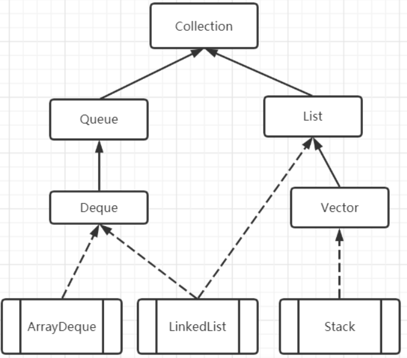
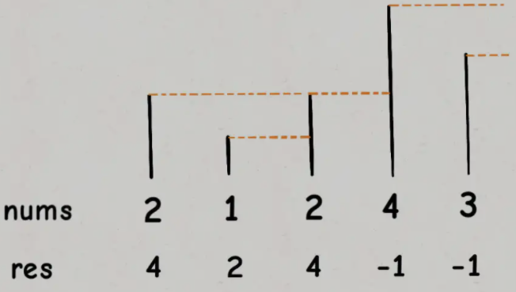
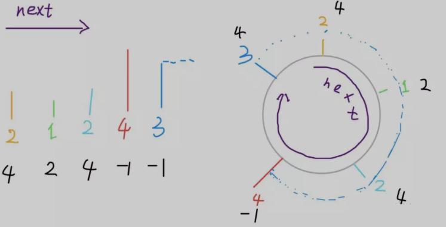

# 栈 Stack

- 栈是特殊的线性表
- 栈的操作只在栈的一端操作，运算实现比线性表方便
- 栈顶指针指向栈顶元素的下一个位置

## 栈的基本运算

- `initStack(S)`：构造一个空栈`S`，即`new`
- `clearStack(S)`：清空堆栈，栈顶指针置0
- `stackEmpty(S)`：判栈空，若`S`为空栈返回`true`，否则返回`false`
- `stackFull(S)`：判栈满，若`S`为满栈返回`true`，否则返回`false`
- `push(S, x)`：进栈。若栈`S`不满，则将元素`x`压入`S`的栈顶
- `pop(S)`：退栈。若栈`S`非空，则将`S`的栈顶元素弹出，并返回该元素
- `stackTop(S)`：取栈的栈顶元素，不修改栈顶指针

## 顺序栈 array-based stack

- 顺序栈需要考虑栈的上溢
- 避免浪费空间，可以用一个数组来存储两个栈，每个栈从各自的端点向中间延伸，同时增加了栈溢出的风险

## 链式栈 linked stack

- 链式栈需要考虑栈的下溢
- 链式栈的元素只能在表头进行插入和删除，栈顶指针指向链式栈的头节点

## 顺序栈和链式栈的对比

- 两者操作的时间复杂度都是$O(1)$
- 顺序栈需要固定长度，容易造成空间浪费；链式栈长度可变，比较节省空间，但每个节点设置了一个指针域，产生了结构开销

# Stack、Deque、LinkedList

## 三者关系

- ArrayDeque、LinkedList、Stack 的关系



- Stack 实现了 Vector 接口，LinkedList 实现了 Deque 和 List 接口，ArrayDeque 实现了 Deque 接口

## Java 栈 不推荐使用 Stack 和 Vector

-  Stack 是 JDK 1.0 的产物，其继承自 Vector，Vector 因其效率较低而不被推荐使用（很多方法都用了`synchronized`修饰）
- 基于 Vector 实现的栈 Stack，底层实际上还是数组，使得 Stack 在基于数组实现上效率受影响
- Java 提供了 Deuqe，其继承自 Queue，是 Java 中的双端队列集合类型；Deque 具备普通队列 FIFO 的功能，同时也具备了 Stack 的 LIFO 功能
- ArrayDeque 是 Deque 接口的一种具体实现，是依赖于可变数组来实现的；ArrayDeque 没有容量限制，可根据需求自动进行扩容
  - ArrayDeque 可以作为栈来使用，效率要高于 Stack
  - ArrayDeque 也可以作为队列来使用，效率相较于基于双向链表的 LinkedList 也要更好一些
  - 注意，ArrayDeque 不支持为`null`的元素

## 底层数据存储方式

|            | 存储方式       |
| ---------- | -------------- |
| Stack      | 长度为10的数组 |
| ArrayDeque | 长度为16的数组 |
| LinkedList | 链表           |

## ArrayDeque 与 LinkedList

- ArrayDeque
  - 数组结构
  - 插入元素不能为`null`
  - 无法确定数据量时，后期扩容会影响效率
- LinkedList
  - 链表结构
  - 插入元素能为`null`
  - 无法确定数据量时，有更好表现

## Deque 中常用方法

- Deque 作为栈
  - 入栈：`push(E e)`
  - 出栈：`pop()`
  - 查看栈顶：`peek()`
- Deque 作为 队列
  - 入队：`offer(E e)`
  - 出队：`poll()`
  - 查看队首：`peek()`

# 单调栈

> [496. 下一个更大元素 I - LeetCode](https://leetcode-cn.com/problems/next-greater-element-i/)
>
> [503. 下一个更大元素 II - LeetCode](https://leetcode-cn.com/problems/next-greater-element-ii/)

- 单调栈：实际上就是栈，只是利用了一些巧妙的逻辑，**使得每次新元素入栈后，栈内的元素都保持有序（单调递增或单调递减）**
- 单调栈用途不太广泛，只处理一种典型的问题，叫做 **Next Greater Element**

> Next Greater Number 问题：给定一个数组，返回一个等长的数组，对应索引存储着下一个更大元素，如果没有更大的元素，就存 -1
>
> 如：给定数组 [2,1,2,4,3]，返回数组 [4,2,4,-1,-1]



## 基本实现

- `for`循环从后往前扫描元素，因为借助的是栈的结构
- `while`循环是把两个“高个”元素之间的元素排除，它们不可能被作为后续进来的元素的 Next Great Number

```java
int[] nextGreaterElement(int[] nums) {
    int[] ans = new int[nums.length]; // 存放答案的数组
    Deque<Integer> s = new ArrayDeque<>();
    for (int i = nums.length - 1; i >= 0; i--) { // 倒着往栈里放
        while (!s.empty() && s.peek() <= nums[i]) // 判定大小
            s.pop(); // 小于当前值的数字出栈
        ans[i] = s.isEmpty() ? -1 : s.peek(); // 这个元素的next greater number
        s.push(nums[i]); // 进队
    }
    return ans;
}
```

- 时间复杂度：$O(N)$
- 空间复杂度：$O(N)$

## 变形问题

- 给定数组，返回一个等长的数组，对应索引存储当前元素与 Next Greater Number 的距离
- 单调栈中放入元素索引，而不是元素

```java
int[] nextGreaterElement(int[] nums) {
    int[] ans = new int[nums.length]; // 存放答案的数组
    Deque<Integer> s = new ArrayDeque<>(); // 放入元素索引，而不是元素
    for (int i = nums.length - 1; i >= 0; i--) {
        while (!s.empty() && nums[s.peek()] <= nums[i])
            s.pop();
        ans[i] = s.isEmpty() ? -1 : (s.peek() - i); // 得到元素间距
        s.push(i); // 放入元素索引，而不是元素
    }
    return ans;
}
```

## 处理循环数组



- 同样是 Next Greater Number，假设给定的数组是环形数组
- 给定的数组 [2,1,2,4,3]，返回数组 [4,2,4,-1,4]，拥有了环形属性，最后一个元素 3 绕了一圈后找到了比自己大的元素 4
- 计算机的内存都是线性的，没有真正意义上的环形数组，但可以模拟出环形数组的效果，一般是通过`%`运算符求模（余数），获得环形效果

```java
int[] arr = {1,2,3,4,5};
int n = arr.length, index = 0;
while (true) {
    print(arr[index % n]);
    index++;
}
```

### 算法

- 利用循环数组的技巧来模拟双倍长度的数组：将原始数组“翻倍”，相当于在后面再接一个原始数组

```java
int[] nextGreaterElements(int[] nums) {
    int n = nums.length;
    int[] res = new int[n]; // 存放结果
    Deque<Integer> s = new ArrayDeque<>();
    // 利用循环数组的技巧使得这个数组长度“翻倍”
    for (int i = 2 * n - 1; i >= 0; i--) {
        while (!s.empty() && s.peek() <= nums[i % n])
            s.pop();
        res[i % n] = s.empty() ? -1 : s.peek();
        s.push(nums[i % n]);
    }
    return res;
}
```

# 队列

- 队列是特殊的线性表
- 队列的操作只在队列的两端操作，运算实现比线性表方便
- 非空队列中，头指针指向队首元素，尾指针指向队尾元素的下一个位置
- 假溢出：入队和出队操作中，头尾指针不断增加而不减小或只减小而不增加，使得被删除元素的无法被重新利用，最后造成队列中有空闲空间，但不能够插入元素，也不能够删除元素的现象

## 队列的基本运算

- 置空队：构造一个空队列，即`front == null`
- 判队空：队空返回`true`，否则返回`false`
- 判队满：队满返回`true`，否则返回`false`
- 入队：队列非满时，从队尾插入元素
- 出队：队列非空时，从队首删除元素
- 取队首元素：返回队首元素，不修改队首指针

## 顺序队列

- 使用**循环队列**解决"假溢出"

### 循环队列

- 假设空间为`m`，入出列时将队首和队尾的指针对`m`做求模运算即可实现队首和队尾指针的循环，即队首和队尾指针的取值范围是`0~(m-1)`之间

  ```java
  // 入队时
  rear = (rear + 1) % maxsize;
  // 出队时
  front = (front + 1) % maxsize;
  ```

- 队空和队满的条件相同：`front == rear`

- 可设定一个变量来表示队列中的元素个数，以区分队空和队满

## 链式队列

- 队首和队尾的数据类型不再是整型而是指针类型
- 以单向链表存储**队列/循环队列**为例，只要**保留末尾节点指针（假设是队尾指针）**即可，入出队的时间复杂度均为$O(1)$

# 优先队列

- 支持两种操作：**删除最大元素**和**插入元素**
- 基于堆实现的优先队列
  - 时间复杂度：$NlogM$
  - 空间复杂度：$M$

## 插入元素

1. 将新元素加到数组末尾，增加堆的大小
2. 让新元素**上浮**到合适的位置

```java
public insert(Key v) {
	pq[++N] = v;
    swim(N);
}
```

## 删除最大元素

1. 从数组顶端删去最大的元素，并将数组的最后一个元素放到顶端
2. 减小堆的大小
3. 让该元素**下沉**到合适的位置

```java
public Key delMax() {
    Key max = pq[1]; // 从根结点得到最大元素
    交换pq[1]和pq[N--]; // 将其和最后一个结点交换
    pq[N+1] = null; // 防止对象游离
    sink(1); // 堆有序化
    return max;
}
```

## 索引优先队列
