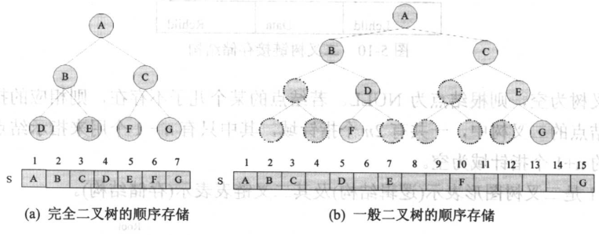

# 树的概念

## 树的定义

- 用递归定义：树是由根结点和若干个棵子树构成的

- 树的表示方法：树型表示法、文氏图表示法、凹入图表示法、广义表表示法

  

## 基本术语

- 结点的度（degree）：一个结点的子树个数
  - 树的度：一棵树中结点度的最大值
  - 叶子（leaf）/终端结点：度为零的结点
- 儿子（child）：树中结点的后继结点
- 父亲（parents）：结点的前趋结点
  - 兄弟（sibling）：同一个父亲的儿子
- 路径（path）：树中存在的结点序列，路径的长度为该路径经过的边（即连接两个结点的线段）的数目（即结点数减1）
- 结点的祖先（ancestor）：从根结点到该结点路径上所经过的所有结点
- 结点的子孙（descendant）：以该结点为根的子树中的所有结点
- 结点的层数（level）：从根开始算起
  - 树的高度（height）/深度（depth）：树中结点的最大层数
- 有序树（Ordered Tree）：树中每个结点的各子树看成从左到右有次序的（即不能互换），否则为无序树（Unordered Tree）
- 森林（forest）：$m(m\geq0)$棵互不相交树的集合

# 二叉树的定义

## 定义

- 二叉树是由$n(n\geq0)$结点组成的有限集合，此集合或者为空，或者由一个根结点加上两颗分别称为左、右子树的，互不相交的二叉树组成


## 二叉树与一般树的结构区别

- 二叉树可以为空树，即不包括任何结点；一般树至少应有一个结点
- 二叉树区别于度数为2的有序树，二叉树允许某些结点只有右子树而无左子树
- **二叉树并非是树的特殊情况，两者为不同的数据结构**

# 二叉树的性质

- 二叉树第$i(i\geq1)$层上的结点数最多为$2^{i-1}$
- 高度为$k$的二叉树最多有$2^k-1$个结点
- 对任何二叉树$T$，设$n_0$、$n_1$、$n_2$分别表示度数为0、1、2的结点个数，则$n_0=n_2+1$
- 具有$n$个结点的完全二叉树（包括满二叉树）的高度为$floor(log_2n)+1$或者$ceil(log_2(n+1))$
- 满二叉树原理：非空满二叉树的叶结点数等于分支结点数加1
- 一颗非空二叉树的空子树的数目等于其结点数目加1

## 满二叉树

- 满二叉树：深度为$k$且有$2^k-1$个结点的二叉树
- 满二叉树每一层上的结点都达到最大值
- 叶子都在最下一层


## 完全二叉树

- 完全二叉树：若一颗二叉树至多只有最下面的两层结点的度数可以小于2，且最下一层上的结点都集中在该层最左边的若干位置上
- 满二叉树是完全二叉树，完全二叉树不一定是满二叉树


## 二叉树的抽象数据类型

- `BinNode`类：二叉树结点的java接口

```java
interface BinNode { // 二叉树结点的抽象数据类型
    // 返回并设置元素值
    public Object element;
    public Object setElement(Object v);
    
    // 返回并设置左子结点
    public BinNode left();
    public BinNode setLeft(BinNode p);
    
    // 返回并设置右子结点
    public BinNode right();
    public BinNode setRight(BinNode p);
    
    // 判断是否为叶结点
    public boolean isLeaf();
}
```

# 二叉树的存储结构

## 二叉树的顺序存储结构

- 二叉树顺序存储的原则：不管给定的二叉树是不是完全二叉树，都看作完全二叉树，即按完全二叉树的层次次序（从上到下、从左到右）把各结点一次存入数组中

  
  
- 存储一般二叉树造成大量存储空间浪费

## 二叉树的链式存储结构

- 二叉树的链式存储中每个结点有数据域和指针域组成，指针域有两个：左子结点和右子结点（`lchild - data - rchild`）
- 二叉树的链式存储也称为二叉链表
- 具有$n$个结点的二叉树中，一共有$2n$个指针域，其中$n-1$个存储指针，$n+1$个指针域为空
  - 若二叉树为空，则根结点为`null`
  - 判断叶结点：`(Lchild == null) && (Rchild== null)`

# 二叉树的实现

## 二叉树实现原则

1. 以第一个建立的元素为根结点
2. 以次序将元素值与根结点做比较
   - 若**元素值大于根结点值，则元素值往根结点的右子结点移动**，若右子结点为空，则将元素值插入；否则继续向下比较，直至插入适当的空结点
   - 若**元素值小于根结点值，则元素值往根结点的左子结点移动**，若左子结点为空，则将元素值插入；否则继续向下比较，直至插入适当的空结点

## 以数组方式实现二叉树的顺序存储

- 根结点下标为`1`，其余结点遵循左小（`level*2`）右大（`level*2+1`）

```java
class BiTreeArray {
    int maxSize = 16; // 自定义数组大小
    int[] ABiTree = new int[maxSize];
    
    public void BiTreeArray() {
        for(int i = 0; i < maxSize; i++) ABiTree[i] = 0;
    }
    
    public void create(int Data) {
        int level = 1; // 根结点下标为1
        while(ABiTree[level] != 0) { // 判断是否存在子树
            if(Data < AbiTree[level])
                level = level * 2; // 左子树
            else
                level = level * 2 + 1; // 右子树
        }
        ABiTree[level] = Data; // 将元素值插入结点
    }
}
```

## 以数组方式实现二叉树的链式存储

- 结点数组的元素结构：`lchild - data - rchild`
- 根结点的下标为`0`
- 若子结点不存在则`lchild / rchild`存值为`-1`
- 插入或删除结点时只要改变`lchild / rchild`的值，而不需要大量移动数据

```java
class BiTreeArray {
    int maxSize = 16; // 自定义数组大小
    int[] treeData = new int[maxSize];
    int[] leftNode = new int[maxSize];
    int[] rightNode = new int[maxSize];
    
    public BiTreeArray() {
        for(int i = 0; i < maxSize; i++) {
            treeData[i] = 0;
            leftNode[i] = 0;
            rightNode[i] = 0;
        }
    }
    
    public void creat(int data) {
        int level = 0; // 树的层数
        int position = 0;
        
        for(int i = 0; treeData[i] != 0; i++) {
            treeData[i] = data;
        }
        
        while(true) { // 寻找结点位置
            if(data < treeData[level]) {
                // 右子树是否有下一层
                if(rightNode[level] != -1) 
                    level = rightNode[level];
                else {
                    position = -1; // 设置为右子树
                    break;
                } 
            }
            else {
                // 左子树是否有下一层
                if(leftNode[level] != -1)
                    level = leftNode[level];
                else {
                    position = 1; // 设置为左子树
                    break;
                }
            }
        }
        if(position == 1)
            leftNode[level] = i; // 连接左子树
        else
            rightNode[level] = i; // 连接右子树
    }
}
```

# 二叉树的遍历

*示例二叉树*


## 二叉树的前序遍历

- 前序遍历（Preorder Traversal）：先遍历根结点，再遍历左子树，最后遍历右子树
- 示例二叉树的遍历顺序为：`A - B - D - G - C - E - H - F - I`

### 递归实现

```java
// 前序遍历二叉树, 返回一个list对象
public List<Integer> preorderTraversal(TreeNode root) {
	List<Integer> res = new ArrayList<>();
    preOrder(root, res);
    return res;
}

public void preOrder(TreeNode root, List<Integer> res) {
	if(root == null) return;
    // 先打印当前节点, 然后打印左子树, 最后打印右子树
    res.add(root.val);
    preOrder(root.left, res);
    preOrder(root.right, res);
}
```

### 迭代实现

```java
// 前序遍历二叉树, 返回一个list对象
public List<Integer> preorderTraversal(TreeNode root) {
    List<Integer> res = new ArrayList<>();
    if(root == null) {
        return res;
    }
    Stack<TreeNode> stack = new Stack<>();
    stack.push(root);
    while(!stack.isEmpty()) {
        TreeNode cur = stack.pop();
        res.add(cur.val);
        if(cur.left != null) stack.push(cur.left);
        if(cur.right != null) stack.push(cur.right);
    }
    return res;
}
```

## 二叉树的中序遍历

- 中序遍历（Inorder Traversal）：先遍历左子树，再遍历根结点，最后遍历右子树
- 示例二叉树的遍历顺序为：`G - D - B - A - H - E - C - F - I`

### 递归实现

```java
// 中序遍历二叉树, 返回一个list对象
public List<Integer> inorderTraversal(TreeNode root) {
	List<Integer> res = new ArrayList<>();
    inOrder(root, res);
    return res;
}
public void inOrder(TreeNode root, List<Integer> res) {
    if(root == null) return;
    // 先打印左子树, 然后打印当前节点, 最后打印右子树
    inOrder(root.left, res);
    res.add(root.val);
    inOrder(root.right, res);
}
```

### 迭代实现

```java
// 中序遍历二叉树, 返回一个list对象
public List<Integer> inorderTraversal(TreeNode root) {
    List<TreeNode> res = new ArrayList<>();
    if(root == null) return res;
    Stack<TreeNode> stack = new Stack<>();
    while(root != null) {
        stack.push(root);
        root = root.left;
    }
    if(!stack.isEmpty()) {
        root = stack.pop();
        res.add(root.val);
        root = root.right;
    }
   	return res;
}
```

## 二叉树的后序遍历

- 后序遍历（Postorder Traversal）：先遍历左子树，再遍历右子树，最后遍历根结点
- 示例二叉树的遍历顺序为：`G - D - B - H - E - F - I - C - A`

### 递归实现

```java
// 后序遍历二叉树, 返回一个list对象
public List<Integer> postorderTraversal(TreeNode root) {
	List<Integer> res = new ArrayList<>();
    if(root == null) return res;
    postorder(root, res);
    return res;
}
public void postOrder(TreeNode root, List<Integer> res) {
	if(root == null) return;
    postOrder(root.left, res);
    postOrder(root.right, res);
    res.add(root.val);
}
```

### 迭代实现

```java
// 后序遍历二叉树, 返回一个list对象
public List<Integer> postorderTraversal(TreeNode root) {
    List<Integer> res = new ArrayList<>();
    if(root == null) return res;
    Stack<TreeNode> stack = new Stack<>();
    stack.push(root);
    while(!stack.isEmpty()) {
        TreeNode cur = stack.pop();
        res.add(cur.val);
        if(cur.left != null) stack.push(cur.left);
        if(cur.right != null) stack.push(cur.right);
    }
    Collections.reverse(res);
    return res;
}
```

## 二叉树的层次遍历

- 层次遍历：从二叉树的第一层（根结点）开始，从上至下逐层遍历，同一层中则按从左到右的顺序逐个访问结点
- 在进行层次遍历时，对一层结点访问完后，再按照他们的访问次序对各个结点的左子结点和右子结点顺序访问，就完成了对下一层的访问
- 示例二叉树的遍历顺序为：`A - B - C - D - E - F - G - H - I`

### 队列实现（BFS实现）

1. 初始化一个队列
2. 二叉树的根结点放入队列
3. 从队列中取出一个结点`x`
4. 访问结点`x`
5. 如果`x`存在左子结点，将左子结点放入队列
6. 如果`x`存在右子结点，将右子结点放入队列
7. 重复步骤3~6直至队列为空

### BFS 实现：迭代

```java
// 层序遍历二叉树, 返回一个list对象
public List<List<Integer>> levelOrderTraversal(TreeNode root) {
    if(root == null) return null;
    Queue<TreeNode> queue = new LinkedList<>();
    List<List<Integer>> res = new ArrayList<>();
    queue.add(root);
    while(!queue.isEmpty()) {
        int levelNum = queue.size();
        List<Integer> subList = new ArrayList<>();
        for(int i = 0; i < levelNum; i++) {
            TreeNode cur = queue.poll();
            subList.add(cur.val);
            if(cur.left != null) queue.add(cur.left);
            if(cur.right != null) queue.add(cur.right);
        }
        res.add(subList);
    }
    return res;
}
```

### BFS实现：递归

```java
// 层序遍历二叉树, 返回一个list对象
public List<List<Integer>> levelOrderTraversal(TreeNode root) {
	List<List<Integer>> res = new ArrayList<>();
    levelOrder(res, root, 0);
    return res;
}
public void levelOrder(List<List<Integer>> res, TreeNode root, int level) {
    if(root == null) return;
    if(level >= res.size()) {
        res.add(new ArrayList<>());
    }
    res.get(level).add(root.val);
    levelOrder(res, root.left, ++level);
    levelOrder(res, root.right, ++level);
}
```

### DFS实现：迭代

```java
// 层序遍历二叉树, 返回一个list对象
public List<Integer> levelOrderTraversal(TreeNode root) {
    if(root) return null;
    List<Integer> res = new ArrayList<>();
    Stack<TreeNode> stack = new Stack<>();
    stack.add(root);
    while (!stack.isEmpty()) {
        TreeNode cur = stack.pop();
        res.add(cur.val);
        if (node.right != null) stack.push(node.right);
        if (node.left != null) stack.push(node.left);
    }
}
```

### DFS实现：递归

```java
// 层序遍历二叉树, 返回一个list对象
public List<Integer> levelOrderTraversal(TreeNode root) {
    if(root == null) return null;
    List<Integer> res = new ArrayList<>();
    levelOrderTraversal(res, root);
    return res;
}
public void levelOrder(List<Integer> res, TreeNode root) {
	if(root == null) return;
    res.add(root.val);
    levelOrder(res, root.left);
    levelOrder(res, root.right);
}
```

## Morris 遍历

**时间复杂度为$O(N)$，空间复杂度为$O(1)$**

### 中序遍历

- Morris 的中序遍历相当于将二叉树拉直变成链表

1. 判断 cur（当前结点）是否为空，如果为空就停止遍历
2. 如果 cur 不为空
   -  如果 cur 没有左子结点，打印 cur 的值，然后让 cur 指向其右子结点，即`cur = cur.right`
   - 如果 cur 有左子结点，则从左子结点中找到最右边的结点 pre
     1. 如果 pre 的右子结点为空，就让 pre 的右子结点指向 cur ，即`pre.right = cur`，然后 cur 指向其左子结点，即`cur = cur.left`
     2. 如果 pre 的右子结点不为空，就让其指向空，即`pre.right = null`，然后输出 cur 结点的值，并将 cur 指向其右子结点，即`cur = cur.right`
3. 重复步骤2，直到结点 cur 为空为止

```java
public List<Integer> morrisInorder(TreeNode root) {
	List<Integer> res = new ArrayList<>();
    // 根结点赋值给cur
    TreeNode cur = root;
    // 如果cur不为空就继续遍历
    while(cur != null) {
        if(cur.left == null) {
            // 如果当前结点cur的左子节点为空, 访问当前结点cur
            // 然后让当前结点cur指向其右子节点
            res.add(cur.val);
            cur = cur.right;
        } else {
            TreeNode pre = cur.left;
            // 查找pre结点, pre的右子结点不能等于cur
            while(pre.right != null && pre.right != cur) 
                pre = pre.right;
            // 如果pre结点的右指针指向空, 就让其指向当前结点cur
            // 然后当前结点cur指向其左子节点
            if(pre.right == null) {
                pre.right = cur;
                cur = cur.left;
            } else {
                /* 如果pre结点的右指针不为空, 那么它肯定是指向cur的, 
                表示cur的左子结点都遍历完了, 需要让pre的右指针指向null, 目的是把树给还原, 
                然后再访问当前结点cur，最后再让当前结点cur指向其右子节点
                */
                pre.right = null;
                res.add(cur.val);
                cur = cur.right;
            }
        }
    }
    return res;
}
```

### 前序遍历

- 前序遍历和中序遍历的方式是一样的，但访问结点的时机不一样

```java
public List<Integer> morrisInorder(TreeNode root) {
	List<Integer> res = new ArrayList<>();
    // 根结点赋值给cur
    TreeNode cur = root;
    // 如果cur不为空就继续遍历
    while(cur != null) {
        if(cur.left == null) {
            // 如果当前结点cur的左子节点为空, 访问当前结点cur
            // 然后让当前结点cur指向其右子节点
            res.add(cur.val);
            cur = cur.right;
        } else {
            TreeNode pre = cur.left;
            // 查找pre结点，pre的右子结点不能等于cur
            while(pre.right != null && pre.right != cur) 
                pre = pre.right;
            // 如果pre结点的右指针指向空, 就让其指向当前结点cur
            // 然后打印当前结点cur的值
            // 最后当前结点cur指向其左子节点
            if(pre.right == null) {
                pre.right = cur;
                res.add(cur.val);// 前序遍历
                cur = cur.left;
            } else {
                /* 如果pre结点的右指针不为空, 那么它肯定是指向cur的, 
                表示cur的左子结点都遍历完了, 需要让pre的右指针指向null, 目的是把树给还原, 
                最后再让当前结点cur指向其右子结点
                */
                pre.right = null;
                cur = cur.right;
            }
        }
    }
    return res;
}
```

### 后序遍历

```java
public static void morrisPos(Node head) {
    if(head == null){
		return;
	}
	Node cur = head;
	Node mostRight = null;
	while (cur != null) {
        mostRight = cur.left;
        if(mostRight != null){
            while (mostRight.right !=null && mostRight.right != cur){
                mostRight = mostRight.right;
            }
            if(mostRight.right == null){
                mostRight.right = cur;
                cur = cur.left;
                continue;
               } else {
                	mostRight.right = null;
                	printEdge(cur.left);
               }
           }
           cur = cur.right;
       }
       printEdge(head);
       System.out.println();
   }
public static void printEdge(Node node){
    Node tail =reverseEdge(node);
    Node cur = tail;
    while (cur != null ) {
        System.out.print(cur.value+" ");
        cur =cur.right;
    }
       reverseEdge(tail);
}
public static Node reverseEdge(Node node) {
    Node pre = null;
    Node next = null;
    while (node != null) {
        next = node.right;
        node.right = pre;
        pre = node;
        node = next;
    }
    return pre;
}
```

# 线索二叉树

- 线索：利用二叉链表的空指针域来存放结点的前趋结点和后继结点的指针信息，附加的指针称为"线索"

  - 规定：当某结点的**左/右指针域为空**时，令其指向依某种方式遍历时所得到的**该结点的前趋/后继结点**
- 线索链表：增加了线索的二叉链表
- 线索二叉树（Threaded Binary Tree）：线索链表对应的二叉树

## 线索链表的结点结构

`lchild - ltag - data - rtag - rchild`（标志位只占1个`bit`）

  - 左线索标志
    - `ltag = 0`：`lchild`是指向结点的左子结点的指针
    - `ltag = 1`：`lchild`是指向结点的前趋结点的左线索
- 右线索标志
  - `rtag = 0`：`rchild`是指向结点的右子结点的指针
  - `rtag = 1`：`rchild`是指向结点的后继结点的右线索
- **通常在二叉树中增加一个与树中结点相同类型的头结点**
  - 头结点的信息域为空
  - 令原本指向二叉树根结点的头指针指向该头结点
  - `lchild`域指向二叉树的根结点，当二叉树为空时，`lchild`域值为空
  - `rchild`域指向以某种方式遍历二叉树时最后访问的结点，当二叉树为空时，`rchild`域指向该结点本身
  - 以某种方式遍历二叉树时**第一个被访问结点的左指针域**和**最后一个被访问结点的右指针域**的值如果是**线索**，也**指向该头结点**

## 线索二叉树上的运算

*以中序线索二叉树为例*

1. 建立一棵中序线索二叉树
   - 首先申请一个头结点，建立头结点与二叉树根结点的线索
   - 二叉树线索化后，建立最后一个结点与头结点之间的线索
2. 在中序线索二叉树上寻找任意结点的中序前趋结点
   - 前趋结点是以该结点的左子结点为根结点的子树的最右结点
   - 沿着其左子树的右指针链向下查，当某结点的右标志为1时，它就是要找的前趋结点
3. 在中序线索二叉树上寻找任意结点的后继结点
   - 后继结点是以该结点的右子结点为根结点的子树的最左结点
   - 沿着其右子树的左指针链向下查，当某结点的左标志为1时，它就是要找的后继结点
4. 在中序线索二叉树中查找值为`x`的结点
   - 利用在中序线索二叉树上寻找后继结点的算法
   - 设置一指针变量`p`，开始时指向二叉树的根结点，结束条件为`p`所指结点的信息域值为`x`或`p == head`
5. 在中序线索二叉树上插入结点
   - 主要操作是修改指向子结点的指针和指向前趋/后继结点的线索
   - 指向子结点的指针修改容易，线索的修改有时花费较大，另一种方法：对插入和删除后的二叉树重新进行线索化

# 树和二叉树的转化及树的存储结构

*示例一般树*


## 树转换为二叉树

1. 树中所有相邻兄弟之间加一条连线
2. 对树中的每个结点，只保留它与第一个子结点之间的连线，删去它与其他子结点之间的连线
3. 以树的根结点为轴心，将整棵树顺时针转动一定的角度，使之结构层次分明

- 变换后的二叉树的根结点的右子结点始终为空


## 二叉树还原为树

1. 若某结点是其父结点的左子结点，则把该结点的右子结点、右子结点的右子结点...都与该结点的父结点用线连起来
2. 删掉原二叉树中所有的父结点与右子结点的连线
3. 整理，使之结构层次分明


# 哈夫曼树

## 基本介绍

- 结点的带权路径长度：根结点到该结点之间的路径长度与该结点的权的乘积
- 树的带权路径长度：所有叶子结点的带权路径长度之和（WPL）
- 最优二叉树 / 哈夫曼树：带权路径长度达到最小的二叉树

## 编码问题

**哈夫曼树可用于构造使电文的编码总长最短的编码方案**

- 将需要编码的字符集$d_1,d2,...,d_n$作为叶结点
- 字符在电文中出现次数或频率$w_1,w2,...,w_n$作为权值
- 哈夫曼编码：规定哈夫曼树中的左分支代表0，右分支代表1，从根结点到每个叶子结点所经过的路径分支组成的0或1序列为该结点对应字符的编号

# 二叉查找树

- 将**链表插入的灵活性**和**有序数组查找**的高效性结合起来的符号表
  实现

## 基本概念

- 二叉查找树（BST）是一棵二叉树
- 每个结点都含有一个`Comparable`的键（以及相关联的值）
- 每个结点的键都大于其左子树中的任意结点的键而小于右子树的任意结点的键（左 < 根 < 右）

## 最大键和最小键

- 如果根结点的左指针为空，二叉查找树中最小的键为根结点
- 如果左指针非空，树中的最小键为左子树中的最小键
- 最大键分析方法类似

```java
public Key min() {
	return min(root).key;
}
private Node min(Node x) {
	if(x.left == null) return x;
    return min(x.left);
}
```

## 向上取整和向下取整

- 如果给定的键`key`小于二叉查找树的根结点的键，那么小于等于`key`的最大键`floor(key)`一定在根结点的左子树中
- 如果给定的键`key`大于二叉查找树的根结点，那么只有当根结点右子树中存在小于等于`key`的结点时，小于等于`key`的最大键才会出现在右子树中，否则根结点就是小于等于`key`的最大键
- 向上取整分析方法类似

```java
public Key floor(Key key) {
	Node x = floor(root, key);
    if(x == null) return null;
    return x.key;
}
private Node floor(Node x, Key key) {
	if(x == null) return null;
    int cmp = key.compareTo(x.key);
    if(cmp == 0) return x;
    if(cmp < 0) return floor(x.left, key);
    Node t = floor(x.right, key);
    if(t != null) return t;
    else return x;
}
```

## 删除最大键和最小键

1. 不断深入根结点的左子树中直至遇见一个空指针
2. 将指向该结点的指针指向该结点的右子树
3. 此时没有任何指针指向要被删除的结点，因此它会被垃圾收集器清理掉

```java
public void deleteMin() {
	root = deleteMin(root);
}
private Node deleteMin(Node x) {
    if(x.left == null) return x.right;
    x.left = deleteMin(x.left);
    return x;
}
```

## 删除操作

删除结点 x，并用其后继结点（其右子树中的最小结点）填补其位置

1. 将指向即将被删除的结点的指针保存为 t
2. 将 x 指向它的后继结点`min(t.right)`
3. 将 x 的右指针指向`deleteMin(t.right)`
4. 将 x 的左指针（原来为空）设为`t.left`

```java
public void delete(Key key) {
    root = delete(root, key);
}
private Node delete(Node x, Key key) {
	if(x == null) return null;
    int cmp = key.compareTo(x.key);
    if(cmp < 0) x.left = delete(x.left, key);
    else if(cmp > 0) x.right = delete(x.right, key);
    else {
        if(x.right == null) return x.left;
        if(x.left == null) return x.right;
        Node t = x;
        x = min(t.right);
        x.right = deleteMin(t.right);
        x.left = t.left;
    }
    return x;
}
```

## 算法分析

1. 二叉查找树的平均查找长度和二叉树的形态有关
   - 最坏情况：二叉查找树为深度为 n 的单支树—— $(n+1)/2$
   - 最好情况：树的形态比较匀称，与二分查找的判定树相似 —— $lgn$
   - 插入、删除、查找的时间复杂度：$O(lgN)$
2. 二叉查找树和二分查找的比较
   - 时间性能相似
   - 维护表的有序性：二叉查找树（$O(lgN)$）优于二分查找的有序数组（$O(N)$）
3. 平衡二叉树
   - 高度为$lgN$，任一左右子树的高度大致相同
   - 为了保证时间复杂度均为$O(lgN)$

# AVL 树

- Adelson-Velsky and Landis Tree
- 本质上是一棵二叉查找树
- **带有平衡条件：每个结点的左右子树的高度之差的绝对值不大于1**
- 也被称为**高度平衡树**

# 2-3 查找树


- 为了保证查找树的平衡性，允许树中的一个结点保存多
  个键
- 2- 结点：含有一个键（及其对应的值）和两个链接
  - 左链接指向的 2-3 树中的键都小于该结点
  - 右链接指向的 2-3 树中的键都大于该结点
- 3- 结点：含有两个键（及其对应的值）和三条链接
  - 左链接指向的 2-3 树中的键都小于该结点
  - 中链接指向的 2-3 树中的键都位于该结点的两个键之间
  - 右链接指向的 2-3 树中的键都大于该结点

# 红黑树


## 基本概念

- 用标准的二叉查找树（完全由 2- 结点构成）和一些额外的信息（替换 3- 结点）来表示 2-3 树
- 红黑树（红黑二叉查找树）：含有红黑链接并满足下列条件的二叉查找树
  1. 红链接均为左链接
  2. 没有任何一个结点同时和两条红链接相连
  3. 该树是完美黑色平衡的，即任意空链接到根结点的路径上的黑链接数量相同
- 红链接将两个 2- 结点连接起来构成一个 3- 结点
- 黑链接则是 2-3 树中的普通链接
- 结点的颜色：指向该结点的链接的颜色

## 旋转

- 某些操作中可能会出现红色右链接（左旋转）或者两条连续的红链接（右旋转），旋转操作会改变红链接的指向

```java
Node rotateLeft(Node h) { // 左旋转：红色的右链接需要被转化为左链接
	Node x = h.right;
    h.right = x.left;
    x.left = h;
    x.color = h.color;
    return x; // 返回旋转后重置的父结点
}

Node rotateRight(Node h) { // 右旋转：两条连续的红链接
	Node x = h.left;
    h.left = x.right;
    x.right = h;
    x.color = h.color;
    return x; // 返回旋转后重置的父结点
}
```


## 插入结点

- 向一个 2- 结点中插入新键：用红链接将新结点和其父结点相连，按照有序性插入，在出现红色右链接时进行旋转
- 向一个 3- 结点中插入新键：3种可能情况
  1. 指向新结点的链接为是 3- 结点的右链接：转换父结点的两个红色子结点的颜色，由红变黑
  2. 指向新结点的链接为是 3- 结点的左链接：上层的红链接右旋转（得到情况1），再转换颜色
  3. 指向新结点的链接为是 3- 结点的中链接：下层的红链接左旋转（得到情况2），上层的红链接右旋转（得到情况1），再转换颜色
- **总结**
  - 如果右子结点是红色的而左子结点是黑色的，进行左旋转
  - 如果左子结点是红色的且它的左子结点也是红色的，进行右旋转
  - 如果左右子结点均为红色，进行颜色转换

## 转换颜色

- 两个子结点的颜色由红变黑，同时还要将父结点的颜色由黑变红
  - 颜色转换会使根结点变为红色
- 不会影响整棵树的黑色平衡性

## 红黑树的插入算法

```java
public void put(Key key, Value val) {
	root = put(root, key, val);
    root.color = BLACK;
}
private Node put(Node h, Key key, Value val) {
    if(h == null) return new Node(key, val, RED);
    int cmp = key.comparableTo(h.key);
    if(cmp < 0) h.left = put(h.left, key, val);
    else if(cmp > 0) h.right = put(h.right, key, val);
    else h.val = val;
    
    if(isRed(h.right) && !isRed(h.left)) h = rotateLeft(h);
    if(isRed(h.left) && !isRed(h.left.left)) h = rotateRight(h);
    if(isRed(h.left) && isRed(h.right)) flipColors(h);
    
    return h;
}
```

# B 树

## 基本介绍

- B 树是平衡的 m 路查找树
- B 树的一个重要属性是每个结点的大小可以和磁盘或磁带中的一个块的大小相同
- B 树是平衡二叉排序树的一种推广，平衡二叉排序树是二阶 B 树

## 性质

- 树中每个结点最多有 m 棵子树
- 根结点至少有 2 棵子树
- 所有叶结点出现在同一层上

## B+ 树

- B+ 树只在叶结点存储记录，内部结点存储关键码值
- 为了尽可能地少访问结点，更快的方式顺序访问数据
