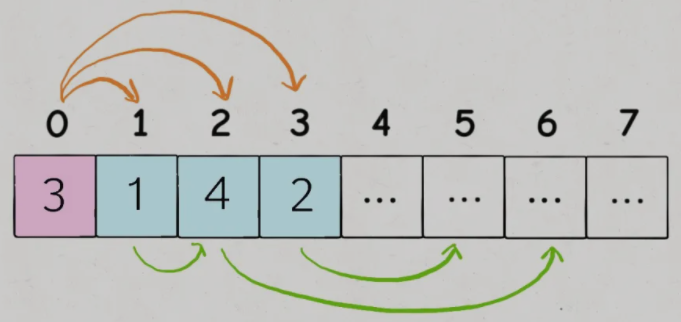

# 贪心算法基本介绍

- **贪心算法可以认为是动态规划算法的一个特例**，相比动态规划，使用贪心算法需要满足更多的条件（**贪心选择性质**），但是效率比动态规划要高
- **贪心选择性质：每一步都做出一个局部最优的选择，最终的结果就是全局最优**

# 区间问题

## 区间调度问题

- **Interval Scheduling（区间调度问题）**：形如`[start,end]`的闭区间，**算出这些区间中最多有几个互不相交的区间**
- 如：[435. 无重叠区间 - LeetCode](https://leetcode-cn.com/problems/non-overlapping-intervals/)，[452. 用最少数量的箭引爆气球 - LeetCode](https://leetcode-cn.com/problems/minimum-number-of-arrows-to-burst-balloons/)

### 算法

1. 从区间集合`intvs`中选择一个区间`x`，这个`x`是在当前所有区间中**结束最早的**（`end`最小）（**可以按每个区间的`end`数值升序排序**）
2. 把所有**与`x`区间相交的区间**从区间集合`intvs`中**删除**
3. 重复步骤1和2，直到`intvs`为空为止；之前选出的那些`x`就是**最大不相交子集**

```java
public int intervalSchedule(int[][] intvs) {
    if(intvs.length == 0)
        return 0;
    // 按 end 升序排序
    Arrays.sort(intvs, (int[] a, int[] b) -> (a[1] - b[1])); // Lambda表达式
    /*
    Arrays.sort(intvs, new Comparator<int[]>() {
    	public int compare(int[] a, int[] b) {
    		return a[1] - b[1];
    	}
    });
    */
    
    // 至少有一个区间不相交
    int count = 1;
    int x_end = intvs[0][1];
    for(int[] interval : intvs) {
        int start = interval[0];
        if(start >= end) {
            // 找到下一个选择的区间
            count++;
            x_end = interval[1];
        }
    }
    return count;
}
```

## 区间覆盖问题

> [1288. 删除被覆盖区间 - LeetCode](https://leetcode-cn.com/problems/remove-covered-intervals/)
>
> 删除列表中被其他区间所覆盖的区间，返回列表中剩余区间的数目

### 算法

1. **排序**：按照区间的起点进行升序排序，如果起点相同，则终点降序排序

2. **画图，分情况讨论**：

   - 对于情况一，找到了覆盖区间

   - 对于情况二，两个区间可以合并，成一个大区间

   - 对于情况三，两个区间完全不相交

```java
public int removeCoveredIntervals(int[][] intervals) {
    // 按照起点升序排列，起点相同时降序排列
    Arrays.sort(intervals, (int[] a, int[] b) -> {
        if(a[0] == b[0])
            return b[1] - a[1];
        return a[0] - b[0];
    });
	
    // 记录合并区间的起点和终点
	int left = intervals[0][0];
	int right = intervals[0][1];
	int res = 0;

	for(int i = 1; i < intervals.length; i++) {
        int[] intv = intervals[i];
        // 情况一，找到覆盖区间
        if(left <= intv[0] && right >= intv[1])
            res++;
        // 情况二，找到相交区间，合并
		if(right >= intv[0] && right <= intv[1])
            right = intv[1];
        // 情况三，完全不相交，更新起点和终点
        if(right < intv[0]) {
            left = intv[0];
            right = intv[1];
        }
    }
    return intervals.length - res;
}
```

## 区间合并问题

> [56. 合并区间 - LeetCode](https://leetcode-cn.com/problems/merge-intervals/)
>
> 返回一个不重叠的区间数组，该数组需恰好覆盖输入中的所有区间

### 算法

1. **排序**：按`start`排序
2. **画图，分情况讨论**

```java
public int[][] merge(int[][] intervals) {
    // 按区间的 start 升序排列
    Arrays.sort(intervals, (int[] a, int[] b) -> (a[0] - b[0]));
    List<int[]> res = new ArrayList<>();
    res.add(intervals[0]);
    
    for(int[] intv : intervals) {
        // res 中最后一个元素的引用
        int[] last = res.get(res.size() - 1);
        if(intv[0] <= last[1])
            // 找到最大的 end
            last[1] = Math.max(last[1], intv[1]);
        else
            // 处理下一个待合并区间
            res.add(intv);
    }
    return res.toArray(new int[res.size()][]);
}
```

## 区间交集问题

> [986. 区间列表的交集 - LeetCode](https://leetcode-cn.com/problems/interval-list-intersections/)
>
> 给定两个由一些**闭区间**组成的列表，每个区间列表都是成对**不相交**的，并且**已经排序**，返回这**两个区间列表的交集**

### 算法

1. **排序**：题目已排序
2. **双指针**：用两个索引指针在两个列表中游走
3. **规律**：如果`[a1,a2]`和`[b1,b2]`存在交集区间是`[c1,c2]`，那么`c1=max(a1,b1)`，`c2=min(a2,b2)`

```java
public int[][] intervalIntersection(int[][] firstList, int[][] secondList) {
    // 双指针
    int i = 0, j = 0;
    List<int[]> res = new ArrayList<>();
    
    while(i < firstList.length && j < secondList.length) {
        int start0 = firstList[i][0], end0 = firstList[i][1];
        int start1 = secondList[j][0], end1 = secondList[j][1];
        // 两个区间存在交集
        if(end0 >= start1 && start0 <= end1) {
            // 计算出交集，加入 res
            int[] intv = {Math.max(start0, start1), Math.min(end0, end1)};
            res.add(intv);
        }
        // 指针前进
        if(end0 < end1)
            i++;
        else
            j++;
    }
    return res.toArray(new int[res.size()][]);
}
```

# 跳跃游戏

## 是否能到达终点

> [55. 跳跃游戏 - LeetCode](https://leetcode-cn.com/problems/jump-game/)

### 算法

- 每一步都计算从当前位置最远能够跳到哪里，然后和全局最优的最远位置`farthest`做对比
- 通过每一步的最优解，更新全局最优解

```java
public boolean canJump(int[] nums) {
    int n = nums.length;
    int farthest = 0;
    for(int i = 0; i < n - 1; i++) {
        // 不断计算能跳到的最远距离
        farthest = Math.max(farthest, i + nums[i]);
        // 可能碰到了0，卡住跳不动了
        if(farthest <= i)
            return false;
    }
    return pos >= n - 1;
}
```

## 使用最少跳跃次数到达终点

> [45. 跳跃游戏 II - LeetCode](https://leetcode-cn.com/problems/jump-game-ii/)

### 算法

- 每次选择能够跳得最远的数组元素，并将其能跳到的最远距离作为下一次跳跃的终点

  

```java
public int jump(int[] nums) {
    int n = nums.length;
    int jumps = 0;
    int end = 0, farthest = 0;
    for(int i = 0; i < n - 1; i++){
        farthest = Math.max(farthest, nums[i] + i);
        if(end == i) {
            jump++;
            end = farthest;
        }
    }
    
}
```

