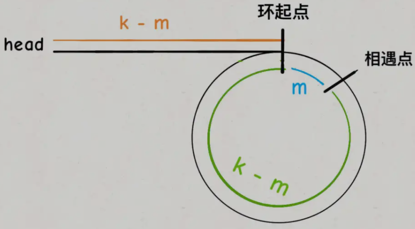
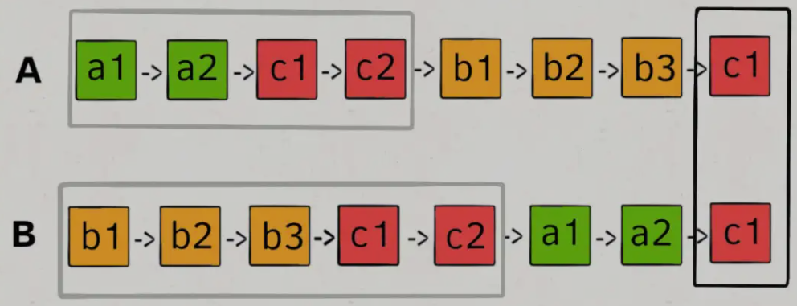
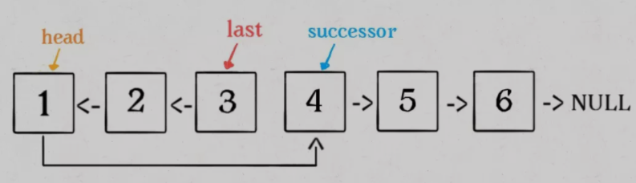
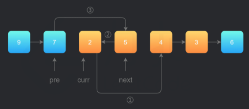
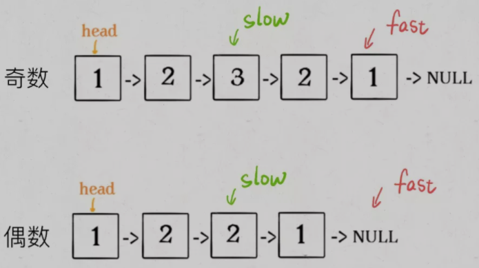
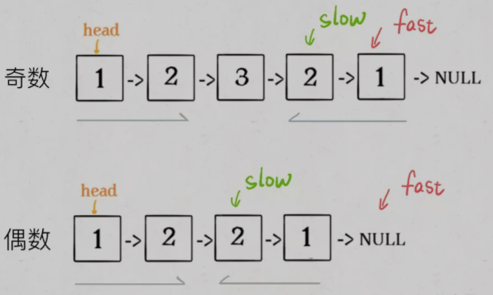
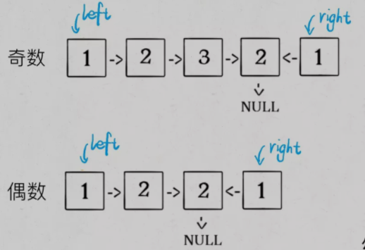

# 单向链表

## 节点类的定义

```java
class Link {
    private Link next;
    private Object item;
    Link(Object item, Link next) {
        this.item = item;
        this.next = next;
    }
    Link(Link next) { this.next = next;}
    Link next() { return this.next;}
    link setNext(Link next) {return this.next = next;}
    Object item() { return this.item;}
    Object setItem(Object item) { return this.item = item;}
}
```

## 建立链表

### 尾插入法

- 优点：固定头指针`head`，不会因为不断修改头指针，而造成头指针的丢失
- 缺点：将新节点插到当前链表的表尾，必须增加一个尾指针`tail`的开销，使其指向当前链表的尾节点

```java
public void insert(Object item) { // 插入一个元素
    curr.setNext(new Link(item, curr.next()));
    if(tail == curr) tail = curr.next();
}
public void append(Object ietm) { // 末尾添加一个元素
    tail.setNext(new Link(item, null));
    tail = tail.next();
}
```

### 头插入法

- 优点：链表的第一个位置上的操作和表的其他位置上的操作一致，无须进行特殊处理；空表和非空表的处理统一；不需要增加`tail`的开销
- 缺点：需要不断修改头指针

```java
public void insert(Object item) { // 插入一个元素
    curr.setNext(new Link(item, head));
    if(head != curr) head = curr;
}
```

## 查找运算

### 按序号查找

```java
public int nexti() {
    int j = 0;
    curr = head;
    while((j != i) && (curr != null)) {
        j++;
        curr = curr.next;
    }
    if(curr = null) return 0;
    else return j;
}
```

### 按数值查找

```java
public Link nextval() {
    curr = head;
    while((curr.val != key) && (curr != null)) {
        curr = curr.next;
    }
    if(curr = null) return null;
    else return curr;
}
```

## 删除节点

```java
public Object remove() {
    if(!((curr != null) && (curr.next()!=null)) return null;
    Object item = curr.next().item();
    if(tail = curr.next()) tail = curr;
    curr.setNext(curr.next().next()); // 删除节点
    return item;
}
```

# 循环链表

- 通常在循环链表**以末尾节点指针为已知条件**，而不是头节点，方便**删除末尾节点**、**在第一个节点前插入新节点**

- 循环链表末尾节点的判定条件是其指针域指向头节点

  ```java
  curr.next() == head;
  ```

# 双向链表

- 每个节点里增加一个指向其直接前趋的指针域`prev`

## 节点类定义

```java
class DLink {
    private Object item;
    private DLink next;
    private DLink prev;
    DLink(Object item, DLink next; DLink prev) {
        this.item = item;
        this.next = next;
        this.prev = prev;
    }
    ...
}
```

## 插入节点

```java
public void insert(Object item) {
    curr.setNext(new DLink(item, curr.next(), curr));
    if(curr.next().next() != null) {
        curr.next().next().setPrev(curr.next());
    }
    if(tail == curr) tail = tail.next();
}

public void append(Object item) {
    tail.setNext(new DLink(item, null, tail));
    tail = tail.next;
}
```

## 删除节点

```java
public Object remove() {
    Object item = curr.next().item;
    if(curr.next().next() != null) {
        curr.next().next().setPrev(curr);
    }
    else tail = curr;
    curr.setNext(curr.next().next());
    return item;
}
```

## 查询节点

```java
public DLink dlinkSearch() {
    curr = head;
    while((curr != null) && (curr.item() != key)) {
        curr = curr.next;
    }
    if(curr == null) return null;
    else return curr;
}
```


---

**对于单链表相关的题目，双指针的运用是非常广泛**

---

# 合并两个有序链表

> [21. 合并两个有序链表 - LeetCode](https://leetcode-cn.com/problems/merge-two-sorted-lists/)
>
> 将两个升序链表合并为一个新的 **升序** 链表并返回

```java
ListNode mergeTwoLists(ListNode l1, ListNode l2) {
    // 虚拟头节点
   	ListNode dummy = new ListNode(-1), p = dummy;
    ListNode p1 = l1, p2 = l2;
    
    while(p1 != null && p2 != null) {
        // 比较 p1 和 p2 两个指针
        // 将值较小的的节点接到 p 指针
        if(p1.val > p2.val) {
            p.next = p2;
            p2 = p2.next;
        } else {
            p.next = p1;
            p1 = p1.next;
        }
        // p 指针不断前进
        p = p.next;
    }
    
    if(p1 != null)
        p.next = p1;
    
    if(p2 != null)
        p.next = p2;
   	
    return dummy.next;
}
```

# 合并 k 个有序链表

> [23. 合并K个升序链表 - LeetCode](https://leetcode-cn.com/problems/merge-k-sorted-lists/)
>
> 一个链表数组，每个链表都已经按升序排列，请将所有链表合并到一个升序链表中，返回合并后的链表

## 算法分析

- 利用**优先队列（二叉堆）**，将链表节点放入小顶堆，每次获得`k`个节点中的最小节点
- 优先队列`pq`中的元素个数最多是`k`，所以一次`poll`或者`offer`方法的时间复杂度是$O(logK)$；所有的链表节点都会被加入和弹出`pq`
- 时间复杂度为$O(NlogK)$，空间复杂度为$O(K)$，$N$为链表的节点总数，$K$是链表的条数

```java
ListNode mergeKLists(ListNode[] lists) {
    if(lists.length == 0) return null;
    // 虚拟头节点
    ListNode dummy = new ListNode(-1), p = dummy;
    // 优先队列, 最小堆
    PriorityQueue<ListNode> pq = new PriorityQueue<>(lists.length, (a, b) -> (a.val - b.val)); // Lambda 表达式
    // 将 k 个链表的头节点加入最小堆
    for(ListNode head : lists) {
        if(head != null)
            pq.offer(head);
    }
    
    while(!pq.isEmpty()) {
        // 获取最小节点, 接到结果链表中
        ListNode node = pq.poll();
        p.next = node;
        if(node.next != null)
            pq.offer(node.next);
        // p 指针不断前进
        p = p.next;
    }
    return dummy.next;
}
```

# 单链表的倒数第 k 个节点

## 算法分析

- **双指针（快慢指针）**，快指针`fast`比慢指针`slow`先走`k`步，然后`fast`和`slow`同时向前走
- 当`fast`走到链表末尾的空指针时走了`n-k`步，`slow`恰好到达链表的倒数第`k`个节点

```java
// 返回链表的倒数第 k 个节点
ListNode findFromEnd(ListNode head, int k) {
    ListNode fast = head;
    // fast 先走 k 步
    for (int i = 0; i < k; i++) {
        fast = fast.next;
    }
    ListNode slow = head;
    // fast 和 slow 同时走 n - k 步
    while (fast != null) {
        slow = slow.next;
        fast = fast.next;
    }
    // slow 现在指向第 n - k 个节点
    return slow;
}
```

# 单链表的中点

> [876. 链表的中间结点 - LeetCode](https://leetcode-cn.com/problems/middle-of-the-linked-list/)

## 算法分析

- **双指针（快慢指针）**，每当慢指针`slow`前进一步，快指针`fast`就前进两步
- **当`fast`走到链表末尾时，`slow`就指向了链表中点**
- 如果链表长度为偶数，即链表中点有两个，该解法返回的节点是靠后的那个节点

```java
ListNode middleNode(ListNode head) {
    // 快慢指针初始化指向 head
    ListNode slow = head, fast = head;
    // 快指针走到末尾时停止
    while(fast != null && fast.next != null) {
        // 慢指针走一步, 快指针走两步
        slow = slow.next;
        fast = fast.next.next;
    }
    // 慢指针指向中点
    return slow;
}
```

# 判断链表是否包含环

## 算法分析

- **双指针（快慢指针）**，每当慢指针`slow`前进一步，快指针`fast`就前进两步
- 如果`fast`最终遇到空指针，说明链表中没有环；如果`fast`最终和`slow`相遇，那肯定是`fast`超过了`slow`一圈，说明链表中含有环
- 把寻找链表中点的代码稍加修改即可

```java
boolean hasCycle(ListNode head) {
    // 快慢指针初始化指向 head
    ListNode slow = head, fast = head;
    // 快指针走到末尾时停止
    while (fast != null && fast.next != null) {
        // 慢指针走一步, 快指针走两步
        slow = slow.next;
        fast = fast.next.next;
        // 快慢指针相遇, 说明含有环
        if (slow == fast)
            return true;
    }
    // 不包含环
    return false;
}
```

# 链表中含有环，计算这个环的起点

## 算法分析

- **当快慢指针相遇时，让其中任一个指针指向头节点，然后让它俩以相同速度前进，再次相遇时所在的节点位置就是环开始的位置**



```java
ListNode detectCycle(ListNode head) {
    ListNode slow = head, fast = head;
    while(fast != null && fast.next != null) {
        fast = fast.next.next;
        slow = slow.next;
        if(fast == slow)
            break;
    }
    slow = head;
    while(slow != fast) {
        fast = fast.next;
        slow = slow.next;
    }
    return slow;
}
```

# 两个链表是否相交

> [160. 相交链表 - LeetCode](https://leetcode-cn.com/problems/intersection-of-two-linked-lists/)
>
> 两个单链表的头节点 `headA` 和 `headB` ，请找出并返回两个单链表相交的起始节点。如果两个链表没有交点，返回 `null` 

## 算法分析

- `p1`遍历完链表`A`之后开始遍历链表`B`，`p2`遍历完链表`B`之后开始遍历链表`A`，**两条链表在逻辑上接在了一起**
- `p1`和`p2`同时进入公共部分，即同时到达相交节点`c1`
- 若两个链表没有相交点，相当于`c1`节点是`null`空指针
- 时间复杂度为$O(N)$，空间复杂度为$O(1)$



```java
ListNode getIntersectionNode(ListNode headA, ListNode headB) {
    // p1 指向 A 链表头结点, p2 指向 B 链表头结点
    ListNode p1 = headA, p2 = headB;
    while(p1 != p2) {
        // p1 走一步, 如果走到 A 链表末尾, 转到 B 链表
        if(p1 == null)
            p1 = headB;
        else
            p1 = p1.next;
        // p2 走一步, 如果走到 B 链表末尾, 转到 A 链表
        if(p2 == null)
            p2 = headA;
        else
            p2 = p2.next;
    }
    return p1;
}
```

# 反转链表

- **递归操作链表并不高效**
- 和迭代解法相比，虽然时间复杂度都是$O(N)$，但是迭代解法的空间复杂度是$O(1)$，而递归解法需要堆栈，空间复杂度是 $O(N)$
- **考虑效率的话还是使用迭代算法更好**

## 反转整个链表

> [206. 反转链表 - LeetCode](https://leetcode-cn.com/problems/reverse-linked-list/)
>
> 迭代或递归方式完成反转

### 迭代实现

```java
public ListNode reverseList(ListNode head) {
    ListNode prev = null, cur = head;
    ListNode next;
    while(cur != null) {
        next = cur.next;
        cur.next = prev;
        prev = cur;
        cur = next;
    }
    return prev;
}
```

### 递归实现

```java
public ListNode reverseList(ListNode head) {
    if(head == null || head.next == null)
        return head;
    ListNode last = reverList(head.next);
    head.next.next = head;
    head.next = null;
    return last;
}
```

## 反转链表前 N 个节点

### 迭代实现

```java
ListNode reverseN(ListNode head, int n) {
    ListNode prev = null, cur = head;
    ListNode next;
    while(n-- > 0) {
        next = cur.next;
        cur.next = prev;
        prev = cur;
        cur = next;
    }
    return prev;
}
```

```java
/** 反转区间 [a, b) 的元素，注意是左闭右开 */
ListNode reverse(ListNode a, ListNode b) {
   ListNode prev = null, cur = a;
   ListNode next;
   while(cur != b) {
       next = cur.next;
       cur.next = pre;
       pre = cur;
       cur = next;
   }
    // 返回反转后的头节点
    return pre;
}
```

### 递归实现



```java
ListNode successor = null; // 后驱节点

// 反转以 head 为起点的 n 个节点, 返回新的头节点
ListNode reverseN(ListNode head, int n) {
    if(n == 1) {
         // 记录第 n + 1 个节点
        succssor = head.next;
        return head;
    }
    // 以 head.next 为起点，需要反转前 n - 1 个节点
    ListNode last = reverseN(head.next, n - 1);
    
    head.next.next = head;
    // 让反转之后的 head 节点和后面的节点连起来
    head.next = successor;
    return last;
}
```

## 反转链表的一部分

> [92. 反转链表 II - LeetCode](https://leetcode-cn.com/problems/reverse-linked-list-ii/)
>
> 反转链表的一部分

### 迭代实现

- 在需要反转的区间里，每遍历到一个节点，让这个新节点来到反转部分的起始位置
- 只需一次遍历，反转链表（头插法）



```java
ListNode reverseBetween(ListNode head, int left, int right) {
        ListNode dummy  = new ListNode(-1, head), prev = dummy;
    	// pre: 永远指向待反转区域的第一个节点 left 的前一个节点, 在循环过程中不变

        for(int i = 0; i < left - 1; i++)
            prev = prev.next;
    
        // curr: 指向待反转区域的第一个节点 left
        ListNode cur = prev.next;
    	// next: 永远指向 curr 的下一个节点, 循环过程中, curr 变化以后 next 会变化
        ListNode next;
        for(int i = 0; i < right - left; i++) {
            next = cur.next;
            cur.next = next.next;
            next.next = prev.next;
            prev.next = next;
        }
        return dummy.next;
    }
```

### 递归实现

```java
ListNode reverseBetween(ListNode head, int left, int right) {
    // base case
    if (left == 1) {
        return reverseN(head, right);
    }
    // 前进到反转的起点触发 base case
    head.next = reverseBetween(head.next, left - 1, right - 1);
    return head;
}

ListNode successor = null; // 后驱节点

// 反转以 head 为起点的 n 个节点, 返回新的头节点
ListNode reverseN(ListNode head, int n) {
    if(n == 1) {
         // 记录第 n + 1 个节点
        succssor = head.next;
        return head;
    }
    // 以 head.next 为起点，需要反转前 n - 1 个节点
    ListNode last = reverseN(head.next, n - 1);
    
    head.next.next = head;
    // 让反转之后的 head 节点和后面的节点连起来
    head.next = successor;
    return last;
}
```

## K 个一组反转链表

> [25. K 个一组翻转链表 - LeetCode](https://leetcode-cn.com/problems/reverse-nodes-in-k-group/)
>
> 每 *k* 个节点一组进行翻转，返回翻转后的链表

### 迭代实现

1. **链表分区为已反转部分 + 待反转部分 + 为反转部分**
2. **需记录反转链表的前驱`prev`和后继`end`，方便把已反转部分和未反转部分连接起来**
3. 时间复杂度为$O(N*K)$，最好为$O(N)$，最坏为$O(N^2)$；空间复杂度为$O(1)$，除了几个必须的节点指针外，并没有占用其他空间

```java
ListNode reverseKGroup(ListNode head, int k) {
    ListNode dummy = new ListNode(-1);
    dummy.next = head;
    ListNode prev = dummy, end = dummy;
    while(end.next != null) {
        for(int i = 0; i < k; i++)
            end = end.next;
        if(end == null)
        	break;
        ListNode start = prev.next;
        ListNode next = end.next;
        end.next = null;
        prev.next = reverse(start);
        start.next = next;
        prev = start;
        end = prev;
    }
    
    return dummy.next;
}
```

```java
// 反转以 head 为头节点的链表, 迭代实现
ListNode reverse(ListNode head) {
    ListNode prev = null, cur = head;
    ListNode next;
    while(cur != null) {
        next = cur.next;
        cur.next = prev;
        prev = cur;
        cur = next;
    }
    return prev;
}
```


### 递归实现

1. **该问题具有递归性质，先反转以 `head` 开头的 `k` 个元素**
2. **将第 `k + 1` 个元素作为 `head` 递归调用 `reverseKGroup` 函数**
3. **将上述两个过程的结果连接起来**
4. **base case 为如果最后的元素不足 `k` 个，就保持不变**
5. 时间复杂度为$O(N*K)$，最好为$O(N)$，最坏为$O(N^2)$；空间复杂度为$O(N)$，递归调用栈的高度

```java
ListNode reverseKGroup(ListNode head, int k) {
    if(head == null)
        return null;
    // 区间 [a, b) 包含 k 个待反转元素
    ListNode a = head, b = head;
    for(int i = 0; i < k; i++) {
        if(b == null)
            return head;
        b = b.next;
    }
    // 反转前 k 个元素
    ListNode newHead = reverse(a, b);
    // 递归反转后续链表并连接起来
    a.next = reverseKGroup(b, k);
    return newHead;
}
```

```java
/** 反转区间 [a, b) 的元素，注意是左闭右开 */
ListNode reverse(ListNode a, ListNode b) {
    ListNode prev = null, cur = a;
    ListNode next;
    // while 终止的条件改一下就行了
    while (cur != b) {
        nxt = cur.next;
        cur.next = pre;
        pre = cur;
        cur = nxt;
    }
    // 返回反转后的头结点
    return pre;
}
```

# 判断回文链表

> [234. 回文链表 - LeetCode](https://leetcode-cn.com/problems/palindrome-linked-list/)
>
> 给定一个单链表的头节点 `head` ，判断该链表是否为回文链表

## 递归实现

- **后序遍历链表，在后序遍历位置判断是否为回文**
- **实际上就是把链表节点放入递归函数的堆栈，然后再拿出来，这时候元素顺序就是反的**
- 时间复杂度为$O(N)$；空间复杂度为$O(N)$，递归调用栈的高度

```java
// 左侧指针
ListNode left;

boolean isPalindrome(ListNode head) {
    left = head;
    return traverse(head);
}

boolean traverse(ListNode right) {
    if (right == null) return true;
    boolean res = traverse(right.next);
    // 后序遍历代码
    res = res && (right.val == left.val);
    left = left.next;
    return res;
}
```

## 双指针（快慢指针）实现

- **先通过双指针（快慢指针）来找到链表的中点**

  

- **如果`fast`指针没有指向`null`，说明链表长度为奇数，`slow`还要再前进一步**

  

- **从`slow`开始反转后面的链表，开始比较回文串**

  

- 时间复杂度为$O(N)$；空间复杂度为$O(1)$

```java
boolean isPalindrome(ListNode head) {
    ListNode slow = head, fast = head;
    while (fast != null && fast.next != null) {
    	slow = slow.next;
    	fast = fast.next.next;
    }
    // slow 指针现在指向链表中点
    
    if (fast != null)
        slow = slow.next;
    
    ListNode left = head;
    ListNode right = reverse(slow);
    // ListNode end = right;

	while (right != null) {
        if (left.val != right.val)
            return false;
        left = left.next;
        right = right.next;
    }
    // left.next = reverse(end); // 恢复链表的原本结构
    return true;
}

private ListNode reverse(ListNode head) {
    ListNode prev = null, cur = head;
    while (cur != null) {
        ListNode next = cur.next;
        cur.next = prev;
        prev = cur;
        cur = next;
    }
    return prev;
}
```
