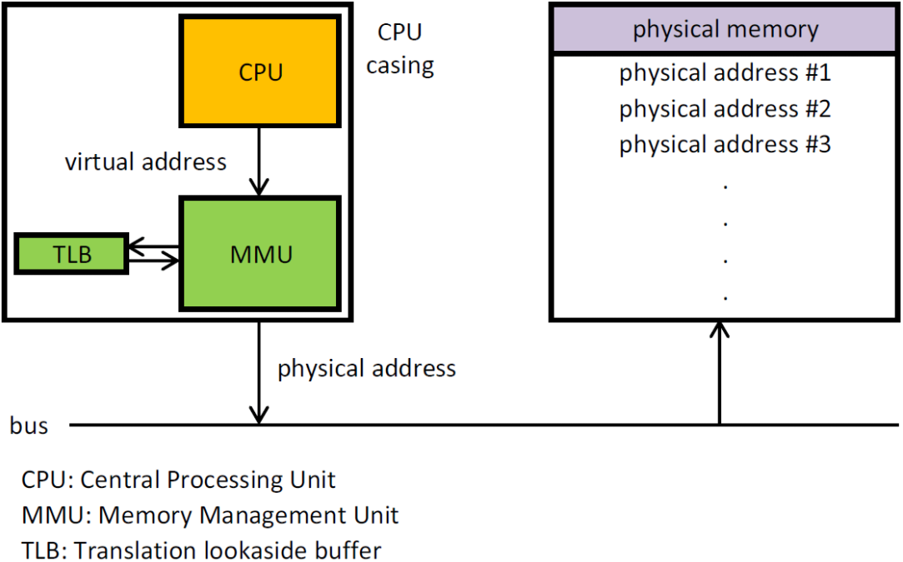

# 内存管理的职责

1. 主要负责**内存的分配和回收**（**malloc 函数：申请内存**，**free 函数：释放内存**）
2. **地址转换：将逻辑地址转换成相应的物理地址**

# 常见的内存管理机制

- 分为**连续分配管理方式**和**非连续分配管理方式**
  - **连续分配管理方式**：为一个用户程序分配一个连续的内存空间，如**分块管理**
  - **非连续分配管理方式**：允许一个程序使用的内存分布在离散或者说不相邻的内存中，如**分页管理**、**分段管理**、**段页管理**

1. **分块管理**：
   - 最早的操作系统的内存管理方式。分块管理将内存分为**几个固定大小的块**，每个块只包含一个进程
   - 操作系统根据程序运行需要分配内存，如果程序运行只占用很小的空间，分配的内存中的很多部分就被浪费。**每个块中未被利用的空间，称为碎片**
2. **分页管理**：
   - 分页管理把内存分为**大小相等且固定的一页一页**，页的大小相对于分块管理更小，提高了内存利用率，减小了碎片
   - **分页管理通过页表将逻辑地址转换为物理地址**
3. **分段管理**：
   - 分页管理虽然提高了内存利用率，但是分页管理中的页并无任何实际意义
   - 分段管理将了**内存分为一段一段**，每一段的空间比一页的空间小得多；段是有实际意义的，每个段定义了一组逻辑信息，如主程序段、子程序段、数据段、堆栈段等
   - **分段管理通过段表将逻辑地址转换为物理地址**
4. **段页管理**：
   - **段页管理结合了分段管理**（易于编程、模块化、保护和共享）**和分页管理**（统一的页面大小、在只使用段的一部分时不用把它全部调入内存）**的优点**
   - 段页管理**把内存先分成若干段，每个段又分成若干页**，也就是说段页管理中段与段之间以及段的内部都是离散的

# 快表、多级页表和倒排页表

- 在分页内存管理中，需要考虑两个主要问题：
  1. **虚拟地址到物理地址的转换要快**（解决方案：**快表**）
  2. **解决虚拟地址空间大，页表也会很大的问题**（解决方案：**多级页表**、**倒排页表**）
- **快表（TLB）提升时间性能，多级页表和倒排页表提升空间性能**
- 上述方法都利用了程序的[**局部性原理**](/计算机基础/操作系统/内存管理?id=局部性原理)

## 快表

- 为了解决虚拟地址到物理地址的转换速度，操作系统在页表方案的基础之上引入快表（也称为转换检测缓冲区，Translation Lookaside Buffer，TLB）来加速虚拟地址到物理地址的转换
- 可以把快表理解为一种特殊的高速缓冲存储器（Cache），其中的内容是页表的一部分或者全部内容
- 作为页表的 Cache，快表的作用与页表相似，但提高了访问速率
  - 由于采用页表做地址转换，读写内存数据时 CPU 要两次主存；有了快表，有时只要访问一次高速缓冲存储器和一次主存，可以加速查找并提高指令执行速度
- **使用快表之后的地址转换流程**：
  1. 根据虚拟地址中的页号查快表（TLB）
  2. 如果该页在快表中，直接从快表中读取相应的物理地址
  3. 如果该页不在快表中，就访问内存中的页表，再从页表中得到物理地址，同时页表中的该映射表项添加到快表中
  4. 当快表填满后，又要登记新页时，就按照一定的淘汰策略淘汰掉快表中的一个页

## 多级页表

- 引入多级页表是为了避免把全部页表一致放在内存中占用过多空间，特别是根本不需要的页表就不需要保留在内存中
- 多级页表是用时间性能换取空间性能

> [多级页表如何节约内存 - polarxiong.com](https://www.polarxiong.com/archives/多级页表如何节约内存.html)

## 倒排页表

- 对于32位虚拟地址空间，多级页表可以很好地发挥作用；对于64位虚拟地址空间，可使用倒排页表（Inverted Page Table）
- 倒排页表中，每一个页框有一个表项，而不是每一个虚拟页面有一个表项，即把页框作为页表的索引，而不是把虚拟页面作为页表的索引来查找物理页框
- 倒排页表使用快表（TLB）提高访问速度，使用散列表来应对快表（TLB）失效的情况（对虚拟页面进行散列计算，并作为索引）

# 分页机制与分段机制

## 共同点

- 分页机制和分段机制都是为了提高内存利用率，减少内存碎片
- 页和段都是离散存储的，所以两者都是离散分配内存的方式。但是，每个页和段中的内存是连续的

## 区别

- 页的大小是固定的，由操作系统决定；段的大小不固定，取决于当前运行的程序
- 分页仅仅是为了满足操作系统内存管理的需求；段是逻辑实体，在程序中可以体现为代码段、数据段、堆栈段等，有助于共享和保护

# 逻辑(虚拟)地址与物理地址

- 逻辑地址：CPU 所生成的地址。逻辑地址是内部和编程使用的、并不唯一。例如，C 语言指针编程中，可以读取指针变量本身值，这个值就是逻辑地址
- 物理地址：加载到内存地址寄存器中的地址，内存单元的真正地址

# CPU 寻址与虚拟地址空间

> [虚拟地址空间 - Windows drivers | Microsoft Docs](https://docs.microsoft.com/zh-cn/windows-hardware/drivers/gettingstarted/virtual-address-spaces?redirectedfrom=MSDN)

## CPU 寻址

-  现代处理器使用的是**虚拟寻址（Virtual Addressing）**的寻址方式
- 使用虚拟寻址，CPU 需要将虚拟地址转化为物理地址，这样才能访问真实的物理内存
- 实际上完成虚拟地址转换为物理地址的硬件是**内存管理单元（Memory Manager Unit，MMU）**

## 为什么需要虚拟地址空间

- 假设没有虚拟地址空间，程序直接访问和操作物理内存，会有以下问题：
  1. 用户程序可以访问任意内存，**容易破坏操作系统，造成操作系统崩溃**
  2. **给同时运行多个程序造成困难**
- 通过虚拟地址访问内存有以下优势：
  1. 程序可以使用一系列**连续的虚拟地址**来访问物理内存中**不连续的大内存缓冲区**
  2. 程序可以使用一系列虚拟地址来**访问大于可用物理内存的内存缓冲区**。当物理内存的供应量变小时，内存管理器会将物理内存页（通常大小为 4 KB）保存到磁盘文件。数据或代码页会根据需要在物理内存与磁盘之间移动
  3. **不同进程使用的虚拟地址彼此隔离**。一个进程中的代码无法更改正在由另一进程或操作系统使用的物理内存

# 虚拟内存

## 虚拟内存的概念

> [虚拟内存的那点事儿](https://juejin.cn/post/6844903507594575886)

- **虚拟内存（Virtual Memory）**可以让程序可以拥有超过系统物理内存大小的可用内存空间
- **虚拟内存为每个进程提供了一个一致的、私有的地址空间，使得应用程序认为它拥有连续的可用的内存（一个连续完整的地址空间）**，而实际上，它通常是被分隔成多个物理内存碎片，还有部分暂时存储在外部磁盘存储器上，在需要时进行数据交换，更加有效地管理内存并减少出错
- **虚拟内存的重要意义是它定义了一个连续的虚拟地址空间**，并且 **把内存扩展到硬盘空间**

## 局部性原理

- 局部性原理是虚拟内存技术的基础，正是因为程序运行具有局部性原理，才可以只装入部分程序到内存就开始运行
- 局部性原理表现在以下两个方面：
  1. **时间局部性** ：如果程序中的某条指令一旦执行，不久以后该指令可能再次执行；如果某数据被访问过，不久以后该数据可能再次被访问。产生时间局部性的典型原因，是由于在程序中存在着大量的循环操作
  2. **空间局部性** ：一旦程序访问了某个存储单元，在不久之后，其附近的存储单元也将被访问，即程序在一段时间内所访问的地址，可能集中在一定的范围之内，这是因为指令通常是顺序存放、顺序执行的，数据也一般是以向量、数组、表等形式簇聚存储的
- **时间局部性是通过将近来使用的指令和数据保存到高速缓存存储器中，并使用高速缓存的层次结构实现**
- **空间局部性通常是使用较大的高速缓存，并将预取机制集成到高速缓存控制逻辑中实现**
- 虚拟内存技术实际上就是建立了**“内存一外存”**的两级存储器的结构，利用局部性原理实现高速缓存
  - 在程序执行过程中，当所访问的信息不在内存时，由操作系统将所需要的部分调入内存，然后继续执行程序
  - 另一方面，操作系统将内存中暂时不使用的内容换到外存上，从而腾出空间存放将要调入内存的信息
  - **时间换空间的策略**：页的调入调出花费的时间，换来了一个虚拟的更大的空间来支持程序的运行

## 虚拟内存的技术实现

**虚拟内存的实现需要建立在离散分配的内存管理方式的基础上。** 虚拟内存的实现有以下三种方式：

1. **请求分页存储管理** ：建立在分页管理之上，为了支持虚拟存储器功能而增加了请求调页功能和页面置换功能
   - 请求分页是目前最常用的一种实现虚拟存储器的方法
   - 在作业开始运行之前，仅装入当前要执行的部分段即可运行
   - 假如在作业运行的过程中发现要访问的页面不在内存，则由处理器通知操作系统按照对应的页面置换算法将相应的页面调入到主存，同时操作系统也可以将暂时不用的页面置换到外存中
2. **请求分段存储管理** ：建立在分段存储管理之上，增加了请求调段功能、分段置换功能
   - 在作业开始运行之前，仅装入当前要执行的部分段即可运行
   - 在执行过程中，可使用请求调入中断动态装入要访问但又不在内存的程序段；当内存空间已满，而又需要装入新的段时，根据置换功能适当调出某个段，以便腾出空间而装入新的段
3. **请求段页式存储管理**：结合了请求分页和请求分段存储管理

### 请求分页与分页存储管理

> [基本分页、请求分页储存管理方式](https://www.cnblogs.com/Allen-rg/p/7181857.html)

- **请求分页存储管理建立在分页管理之上**
- 它们之间的根本区别在于**是否将一作业的全部地址空间同时装入主存**
  - 请求分页存储管理**不要求**将作业全部地址空间同时装入主存。因此，请求分页存储管理**可以提供虚存**
  - 分页存储管理**要求**将作业全部地址空间装入内存后才能运行。因此，分页存储管理**不能提供虚存**

### 总结

无论是虚拟内存的哪种实现方式，一般都需要：

1. 一定容量的内存和外存：在载入程序的时候，**只需要将程序的一部分装入内存**，而将其他部分留在外存，然后程序就可以执行了
2. **缺页中断**：如果**需执行的指令或访问的数据尚未在内存**（称为**缺页**或**缺段**），则由处理器通知操作系统将相应的页面或段**调入到内存**，然后继续执行程序
3. **虚拟地址空间** ：虚拟地址到物理地址的转换

## 页面置换算法

> [页面置换算法](https://www.cnblogs.com/lustar/p/7875705.html)

- 当发生缺页中断时，如果当前内存中并没有空闲的页面，操作系统就必须在内存选择一个页面将其移出内存，以便为即将调入的页面让出空间。**用来选择淘汰哪一页的规则叫做页面置换算法**
1. **OPT（Optimal，最佳） 页面置换算法**：所选择的被淘汰页面将是以后永不使用的，或者是在最长时间内不再被访问的页面，这样可以保证获得最低的缺页率。但由于人们目前无法预知进程在内存下的若干页面中哪个是未来最长时间内不再被访问的，因而该算法无法实现。**一般作为衡量其他置换算法的方法**
2. **FIFO（First In First Out，先进先出） 页面置换算法**：总是淘汰最先进入内存的页面，即选择在内存中驻留时间最久的页面进行淘汰
3. **LRU （Least Recently Used，最近最久未使用）页面置换算法**：LRU 算法赋予每个页面一个访问字段，用来记录一个页面自上次被访问以来所经历的时间 T，当须淘汰一个页面时，选择现有页面中其 T 值最大的，即最近最久未使用的页面予以淘汰
4. **LFU （Least Frequently Used，最少使用）页面置换算法**：选择在之前时期使用最少的页面作为淘汰页
5. **第二次机会（second chance）页面置换算法**：FIFO 算法可能会把经常使用的页面置换出去，因此对算法做一个简单的修改：给每个页面增加一个 R 位，每次先从链表头开始查找，如果 R 置位，清除 R 位并且把该页面节点放到链表结尾；如果 R 是0，那么就是又老又没使用，替换掉
6. **时钟（clock）页面置换算法**：第二次机会算法经常要在链表中移动页面，降低了效率，因此把所有的页面都保存在一个类似钟面的环形链表中，一个表针指向最老的页面
7. **老化（aging）算法**：将每一个页面与一个计数器关联，将计数器在每次时钟滴答时，右移一位，并把 R 位加在最高位上
8. **工作集算法**：工作集是在过去 N ms 的内存访问中所用到的页面的集合，给每个页面一个计时器，需要置换页面时，同实际时间进行对比，R 为1，更新到现在时间；R 为0，在规定阈值之外的页面可以被置换
