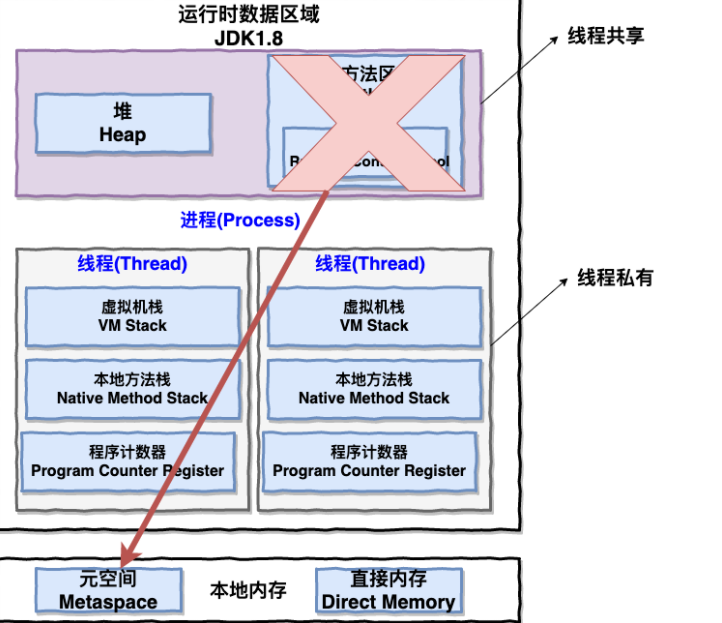
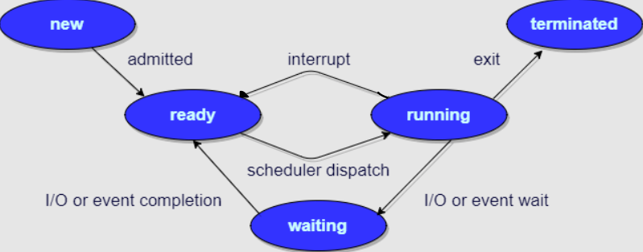

> [进程间通信和线程间通信的几种方式](https://www.cnblogs.com/fanguangdexiaoyuer/p/10834737.html#_label6)

# 协程与进程的区别

## 协程

- 协程是微线程，在子程序内部执行，可在子程序内部中断，转而执行别的子程序，在适当的时候再返回来接着执行

## 区别

- 协程执行效率极高。协程直接操作栈基本没有内核切换的开销，所以上下文的切换非常快，切换开销比线程更小
- 协程不需要多线程的锁机制，因为多个协程从属于一个线程，不存在同时写变量冲突，效率比线程高
- 一个线程可以有多个协程

## 协程的优势

- **协程调用跟切换比线程效率高**：协程执行效率极高。协程不需要多线程的锁机制，可以不加锁的访问全局变量，所以上下文的切换非常快
- **协程占用内存少**：执行协程只需要极少的栈内存（大概是4～5KB），而默认情况下，线程栈的大小为1MB。
- **切换开销更少**：协程直接操作栈基本没有内核切换的开销，所以切换开销比线程少；协程不需要多线程的锁机制，因为多个协程从属于一个线程，不存在同时写变量冲突，效率比线程高，**避免了加锁解锁的开销**

# 进程与线程的区别

- 从 JVM 的角度来说线程和进程之间的关系

> Java 内存区域（运行时数据区）：[《Java 内存区域》](https://snailclimb.gitee.io/javaguide/#/docs/java/jvm/Java内存区域)

- 一个进程中可以有多个线程，多个线程共享进程的**堆**和**方法区（JDK 1.8 之后的元空间）资源**，但是**每个线程有自己的程序计数器、虚拟机栈和本地方法栈**
- **线程是进程划分成的更小运行单元，一个进程在其执行的过程可以产生多个线程**
- 线程和进程最大的不同在于基本上**各进程是独立**的，而各线程则不一定，因为**同一进程中的线程极有可能会相互影响**
- **线程执行开销小，但不利于资源的管理和保护；而进程则相反**
  - 线程可运行在用户空间，线程切换的开销小
  - 进程的切换需要通过内核，开销大（切换上下文等）

# 进程的状态

- 进程大致分为5种状态，与线程类似
1. **创建状态（new）**：进程正在被创建，尚未到就绪状态
2. **就绪状态（ready）**：进程正处于准备运行状态，即进程获得了除了处理器之外的一切所需资源，一旦得到处理器资源（处理器分配的时间片）即可运行
3. **运行状态（running）**：进程正在处理器上运行（单核 CPU 下任意时刻只有一个进程处于运行状态）
4. **阻塞状态（waiting）**：又称为等待状态，进程正在等待某一时间而暂停运行如等待某资源为可用或等待 I/O 操作完成。即使处理器空闲，该进程也不能运行
5. **结束状态（terminated）**：进程正在从系统中消失。可能是进程正常结束或其他原因中断退出运行

# 进程间的通信方式

> [《进程间通信 IPC (InterProcess Communication)》](https://www.jianshu.com/p/c1015f5ffa74)

- 大概有7种常见的进程间的通信方式

1. **管道/匿名管道（Pipes）**：用于具有亲缘关系的**父子进程间或者兄弟进程之间**的通信。**管道只存在于内存中的文件**（内核缓冲区）
2. **有名管道（Names Pipes）**：匿名管道由于没有名字，只能用于亲缘关系的进程间通信。为了克服这个缺点，提出了有名管道。有名管道严格遵循**先进先出（first in first out）**。**有名管道存在于实际的磁盘介质或者文件系统**，可以实现本机**任意两个进程通信**
3. **信号（Signal）**：用于通知接收进程某个事件已经发生。信号可以在任何时候发给某一进程，而无需知道该进程的状态；信号可以在用户空间进程和内核之间直接交互，内核可以利用信号来通知用户空间的进程
4. **消息队列（Message Queuing）**：
   - 消息队列是消息的链表，具有特定的格式，存放在内存中并由消息队列标识符标识
   - 管道和消息队列的通信数据都是先进先出的原则
   - 与管道（无名管道：只存在于内存中的文件；命名管道：存在于实际的磁盘介质或者文件系统）不同的是消息队列存放在内核中，只有在内核重启（即，操作系统重启）或者显示地删除一个消息队列时，该消息队列才会被真正的删除
   - 消息队列可以实现消息的随机查询，消息不一定要以先进先出的次序读取，也可以按消息的类型读取，比 FIFO 更有优势
   - **消息队列克服了信号承载信息量少，管道只能承载无格式字节流以及缓冲区大小受限等缺点**
5. **信号量（Semaphore）**：信号量是一个计数器，用于多进程对共享数据的访问，信号量的意图在于进程间同步。主要用于解决与同步相关的问题并避免竞争条件
6. **共享内存（Shared Memory）**：使得多个进程可以访问同一块内存空间，不同进程可以及时看到对方进程中对共享内存中数据的更新。这种方式需要依靠某种同步操作，如互斥锁和信号量等。可以说这是最有用的进程间通信方式
7. **套接字（Sockets）**：此方法主要用于在客户端和服务器之间通过网络进行通信。套接字是支持 TCP/IP 的网络通信的基本操作单元，可以看做是不同主机之间的进程进行双向通信的端点，简单的说就是通信的两方的一种约定，用套接字中的相关函数来完成通信过程

# 线程间的同步方式

- 线程同步是两个或多个共享关键资源的线程的并发执行，应该同步线程以避免关键的资源使用冲突。
- 操作系统一般有以下三种线程同步的方式：
1. **信号量（Semaphore）**：它允许同一时刻多个线程访问同一资源，但是需要控制同一时刻访问此资源的最大线程数量
2. **互斥量（Mutex）**：采用互斥对象机制，只有拥有互斥对象的线程才有访问公共资源的权限。因为互斥对象只有一个，所以可以保证公共资源不会被多个线程同时访问。比如 Java 中的`synchronized`关键字和各种 Lock 都是这种机制
3. **事件（Event）**：Wait / Notify，通过通知操作的方式保持多线程同步，还可以方便的实现多线程优先级的比较操作

## 信号量与互斥量的区别

1. **互斥量用于线程的互斥，信号量用于线程的同步**。只是互斥量和信号量的根本区别，也就是互斥和同步的区别
   - 互斥：指某一资源同时只允许一个访问者对其进行访问，具有唯一性和排它性。但互斥无法限制访问者对资源的访问顺序，即访问是无序的
   - 同步：指在互斥的基础上（大多数情况），通过其它机制实现访问者对资源的有序访问
2. **互斥量值只能为0/1，信号量值可以为非负整数**
   - 一个互斥量只能用于一个资源的互斥访问，它不能实现多个资源的多线程互斥问题
   - 信号量可以实现多个同类资源的多线程互斥和同步；当信号量为单值信号量是，也可以完成一个资源的互斥访问
3. **互斥量的加锁和解锁必须有同一个线程分别对应使用，信号量可以由一个线程释放，另一个线程得到**

# 进程的调度算法

- 调度算法是为了确定首先执行哪个进程以及最后执行哪个进程以实现最大 CPU 利用率
- **先到先服务（FCFS）调度算法**：从就绪队列中选择一个最先进入该队列的进程为之分配资源，使它立即执行并一直执行到完成或发生某事件而被阻塞放弃占用 CPU 时再重新调度
- **短作业优先（SJF）的调度算法** : 从就绪队列中选出一个估计运行时间最短的进程为之分配资源，使它立即执行并一直执行到完成或发生某事件而被阻塞放弃占用 CPU 时再重新调度
- **时间片轮转调度算法** : 时间片轮转调度是一种最古老、最简单、最公平且使用最广的算法，又称 RR（Round Robin）调度。每个进程被分配一个时间段，称作它的时间片，即该进程允许运行的时间
- **优先级调度** ： 为每个流程分配优先级，首先执行具有最高优先级的进程，依此类推。具有相同优先级的进程以 FCFS 方式执行。可以根据内存要求、时间要求或任何其他资源要求来确定优先级
- **多级反馈队列调度算法** ：
  - 前面介绍的几种进程调度的算法都有一定的局限性。如**短进程优先的调度算法，仅照顾了短进程而忽略了长进程**
  - 对于优先级最低的队列来说，里面是遵循时间片轮转调度算法，对于其他队列，遵循的是先来先服务算法
  - 各个队列的时间片是随着优先级的增加而减少的
  - 多级反馈队列调度算法既能使高优先级的作业得到响应又能使短作业（进程）迅速完成。，因而它是目前**被公认的一种较好的进程调度算法**，UNIX 操作系统采取的便是这种调度算法

# 死锁

## 死锁的定义

- 多个进程可以竞争有限数量的资源。当一个进程申请资源时，如果这时没有可用资源，那么这个进程进入等待状态。有时，如果所申请的资源被其他等待进程占有，那么该等待进程有可能再也无法改变状态，处于无限等待的状态。这种情况成为**死锁**（资源死锁）
- 死锁的另外一种可能的情况（通信死锁）是一组通信进程都在等待一个消息，而通信信道却是空的，并且也没有采用超时机制

## 死锁的四个条件

- 注意：只有四个条件同时成立时，死锁才能出现

1. **互斥**：资源必须处于非共享模式，即一次只有一个进程可以使用。如果另一进程申请该资源，那么必须等到该资源被释放为止
2. **占有并等待**：一个进程至少占有一个资源，并等待另一资源，而该资源被其他进程所占有
3. **非抢占**：资源不能被抢占。只有在持有资源的进程完成任务后，该资源才会被释放
4. **循环等待**：系统中一定有由两个或两个以上的进程组成的一条环路，该环路中的每个进程都在等待着下一个进程所占有的资源

## 死锁检测

- 每种类型一个资源的死锁检测：利用资源分配图，检测是否存在有向图环路；若整个图不存在环，则系统不存在死锁
- 每种类型多个资源的死锁检测：基于资源矩阵的比较

## 死锁恢复

- 利用抢占恢复：临时将某个资源从它的当前所有者那里转移到另一个进程。这种方法通常比较困难或者说不太可能
- 利用回滚恢复：将进程复位到一个更早的状态，那时它还没有取得所需的资源，接着就把这个资源分配给一个死锁进程
- 通过杀死进程恢复：一种方法是杀掉环中的一个进程；另一个方法是杀掉环外的一个进程，该进程正好持有环中某些进程所需的资源

## 死锁避免

- 死锁避免从本质上来说是不可能的，因为它需要获知未来的请求，而这些请
  求是不可知的
- 安全状态：存在一个事件序列，保证所有的进程都能完成
- 不安全状态：不存在这样的保证（不安全状态不是死锁）

## 死锁预防

- 破坏互斥条件：避免分配那些不是绝对必需的资源，尽量做到尽可能少
  的进程可以真正请求资源
- 破坏占有和等待条件：只要禁止已持有资源的进程再等待其他资源便可以消除死锁
  - 一种方法：规定所有进程在开始执行前请求所需的全部资源
  - 另一种方法：要求当一个进程请求资源时，先暂时释放其当前占用的所有资源，然后再尝试一次获得所需的全部资源
- 破坏不可抢占条件
- 破坏环路等待条件：将所有资源统一编号，进程可以在任何时刻提出资源请求，但是所有请求必须按照资源编号的顺序（升序）提出

## 活锁与饥饿

- 活锁：两个进程总是一再消耗完分配给它们的 CPU 配额，但是没有进展也没有阻塞。忙等待可能导致活锁

> - 忙等待（busy waiting）：连续测试一个变量直到某个值出现为止
>   - 这种方式浪费 CPU 时间，因此通常应该避免
>   - 只有在等待时间非常短的情形下（互斥的时间很短而挂起等待的时间开销很大），才使用忙等待
> - 自旋锁（spin lock）：用于忙等待的锁

- 饥饿：进程所需的资源被无限制地推后（例如在短作业优先（SJF）的调度算法下），尽管它没有被阻塞
  - 饥饿可以通过先来先服务的调度算法来避免

