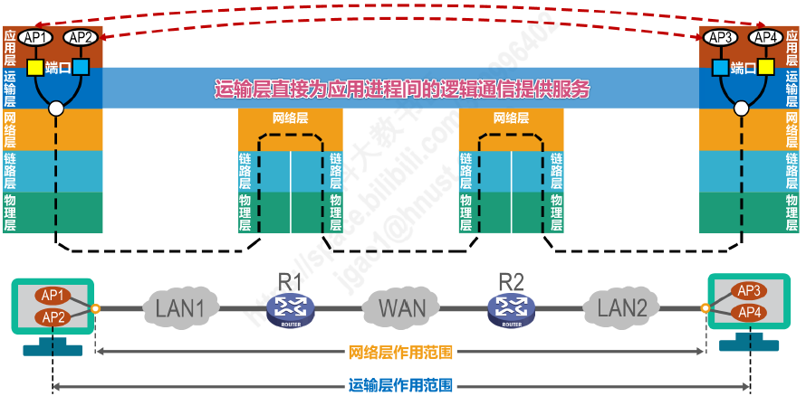
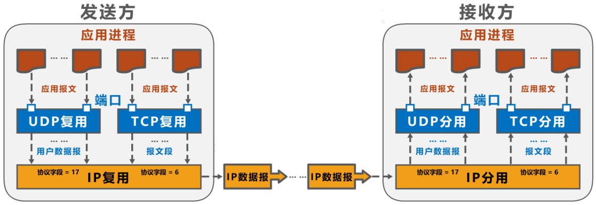
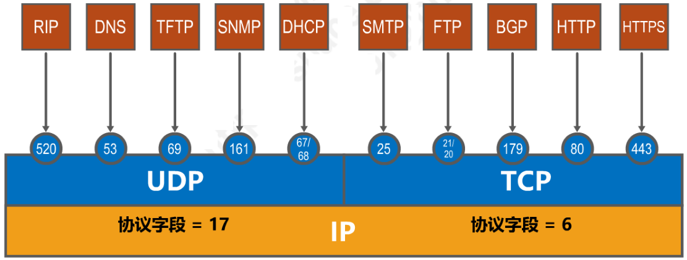
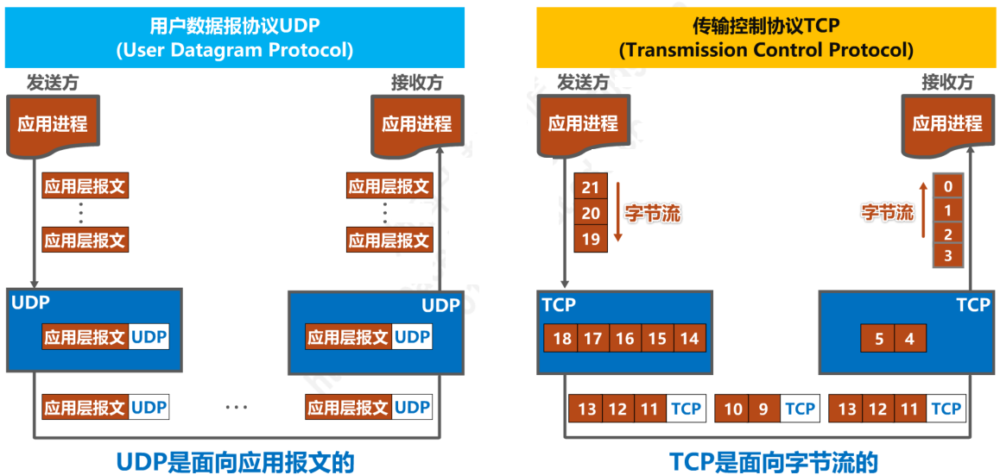
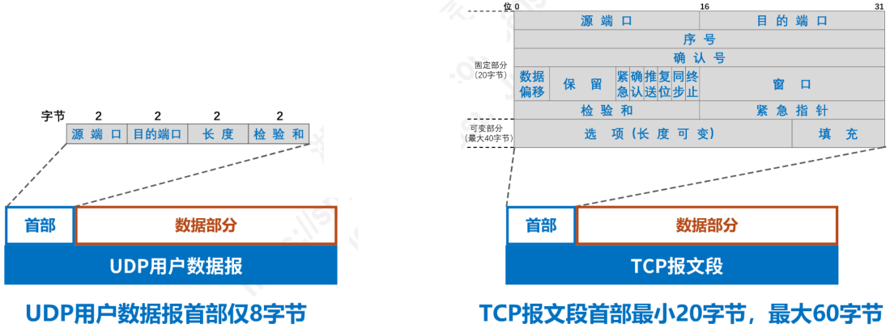
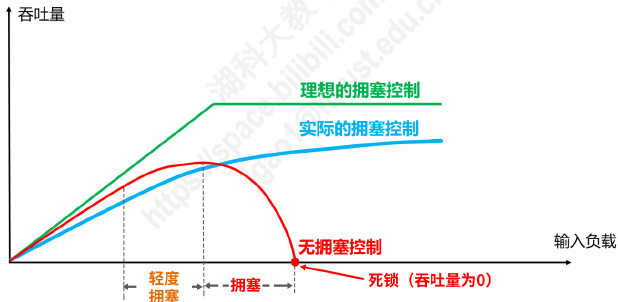
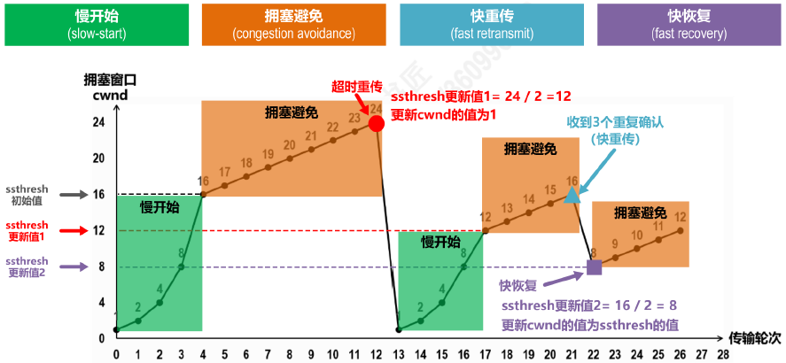
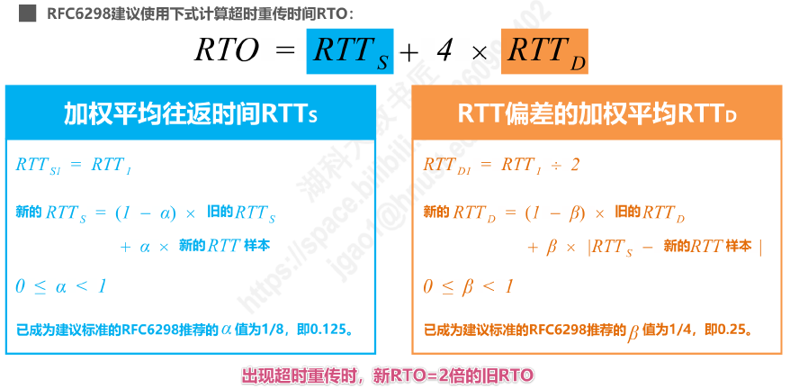
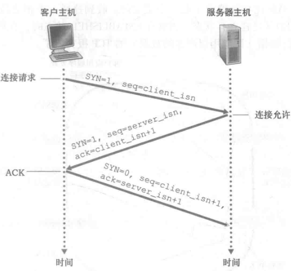
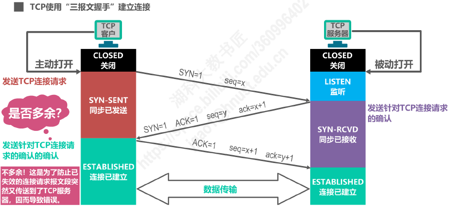

# 概述

- **物理层**、**数据链路层**以及**网络层**共同解决了将主机通过异构网络互联起来所面临的问题， **实现了主机到主机的通信**
- 实际上在计算机网络中进行**通信的真正实体是位于通信两端主机中的进程**
- **运输层的任务：为运行在不同主机上的应用进程提供直接的通信服务**，运输层协议又称为端到端协议
- 运输层向高层用户屏蔽了下面网络核心的细节（如网络拓扑、所采用的路由选择协议等），它使应用进程看见的就**好像是在两个运输层实体之间有一条端到端的逻辑通信信道**

- 根据应用需求的不同，因特网的运输层为应用层提供了两种不同的运输协议
  - **面向连接的 TCP**
  - **无连接的 UDP**

# 运输层端口号、复用与分用

## 端口号

- 运行在计算机上的进程使用**进程标识符 PID** 来标志
- TCP/IP 体系的运输层使用**端口号**来区分应用层的不同应用进程
  - 端口号使用**16比特表示**，取值范围：**0 - 65535**
    - **熟知端口号**： 0-1023，IANA 把这些端口号指派给了 TCP/IP 体系中最重要的一些应用协议，例如 ： FTP 使用 21/20，HTTP 使用80，DNS 使用53
    - **登记端口号**： 1024-49151，为没有熟知端口号的应用程序使用。使用这类端口号必须在 IANA 按照规定的手续登记，以防止重复，例如： Microsoft RDP 微软远程桌面使用的端口是3389
    - **短暂端口号**： 49152-65535，留给客户进程选择暂时使用。当服务器进程收到客户进程的报文时，就知道了客户进程所使用的动态端口号。通信结束后，这个端口号可供其他客户进程以后使用
  - **端口号只具有本地意义**，即端口号只是为了标识本计算机应用层中的各进程，在因特网中，**不同计算机中的相同端口号是没有联系的**

## 发送方的复用和接收方的分用

## TCP/IP 体系的应用层常用协议所使用的运输层熟知端口号

# UDP vs TCP

| 用户数据报协议 UDP（User Datagram Protocol） | 传输控制协议 TCP（Transmission Control Protocol） |
| -------------------------------------------- | ------------------------------------------------- |
| 无连接                                       | 面向连接                                          |
| 支持单播、多播、广播通信                     | 仅支持单播                                        |
| 面向应用报文                                 | 面向字节流                                        |
| 不可靠传输，不使用流量控制和拥塞控制         | 可靠控制，使用流量控制和拥塞控制                  |
| 首部开销小，仅8字节                          | 首部最小20字节，最大60字节                        |

- UDP 是面向应用报文的，TCP 是面向字节流的

- UDP 向上层提供无连接不可靠传输服务，适用于 IP 电话、视频会议等实时应用
- TCP 向上层提供面向连接的可靠传输服务，适用于要求可靠传输的应用，例如文件传输
- UDP 用户数据报首部仅8字节，TCP 报文段首部最小20字节，最大60字节

# TCP 的流量控制

- **流量控制（flow control）：让发送方的发送速率不要太快，要让接收方来得及接收**
- 利用**滑动窗口**机制可以很方便地在 TCP 连接上实现对发送方的流量控制
  - TCP 接收方利用自己的**接收窗口**的大小来限制发送方**发送窗口**的大小
  - TCP 发送方收到接收方的**零窗口通知**后，应启动**持续计时器**；持续计时器**超时**后，向接收方发送**零窗口探测报文**

# TCP 的拥塞控制

## 拥塞

- 拥塞（congestion）：若对网络中某一资源的需求超过了该资源所能提供的可用部分，网络性能就要变坏

## 四种拥塞控制算法

- 慢开始（slow-start）
- 拥塞避免（congestion avoidance）
- 快重传（fast retransmit）
- 快恢复（fast recovery）

## 慢开始

- “慢开始”是指一开始向网络注入的报文段少，并不是指拥塞窗口 cwnd 增长速度慢
- 发送方维护拥塞窗口（cwnd）状态变量，其值取决于网络的拥塞程度，并且动态变化
  - 拥塞窗口（cwnd）的维护原则：只要没有出现拥塞 ，拥塞窗口就再增大一些；但只要出现拥塞， 拥塞窗口就减少一些
  - 判断出现网络拥塞的依据：没有按时收到应当到达的确认报文（即发生超时重传）
- 发送方将拥塞窗口作为发送窗口（swnd），即swnd = cwnd
- 维护一个慢开始门限 ssthresh 状态变量
  - 当 cwnd < ssthresh时，使用慢开始算法
  - 当 cwnd > ssthresh时，停止使用慢开始算法而改用拥塞避免算
  - 当 cwnd = ssthresh时，既可使用慢开始算法 ，也可使用拥塞避免 算法

## 拥塞避免

- “拥塞避免”并非指完全能够避免拥塞，而是指在拥塞避免阶段将**拥塞窗口控制为按线性规律增长**，使网络比较不容易出现拥塞
- 当发送报文部分丢失导致**重传计时器超时**，**判断网络很可能出现了拥塞**，进行以下工作：
  - 将 ssthresh 值更新为发生拥塞时 cwnd 值的一半
  - 将 cwnd 值减少为1，并重新开始执行慢开始算法

## 快重传

- 快重传：使发送方**尽快进行重传**， 而**不是等超时重传计时器超时**再重传
  - 要求接收方不要等待自已发送数据时才进行捎带确认，而是要**立即发送确认**
  - 即使收到了失序的报文段也要立即发出对已收到的报文段的**重复确认**
  - 发送方一旦**收到3个连续的重复确认**，就将相应的报文段**立即重传**， 而不是等该报文段的超时重传计时器超时再重传

## 快恢复

- 发送方一旦**收到3个重复确认**，就知道现在只是丢失了个别的报文段。于是不启动慢开始算法，而**执行快恢复算法**
  - **发送方将慢开始门限 ssthresh 值和拥塞窗口 cwnd 值调整为当前窗口的一半**
  - **开始执行拥塞避免算法**
- 也有的快恢复实现是把快恢复开始时的拥塞窗口 cwnd 值再增大一些，即等于新的 ssthresh + 3
  - 既然发送方收到3个重复的确认，就表明有3个数据报文段已经离开了网络
  - 这3个报文段不再消耗网络资源而是停留在接收方的接收缓存中
  - 可见现在网络中不是堆积了报文段而是减少了3个报文段，因此可以适当把拥塞窗口扩大些

# TCP 超时重传时间的选择

- 出现超时重传时，$新RTO = 2\times旧RTO$

# TCP 可靠传输的实现

- TCP 基于以**字节为单位的滑动窗口**来实现可靠传输
  - 发送方在未收到接收方的确认时，可将发送窗口内还未发送的数据全部发送出去
  - 接收方只接收序号落入发送窗口内的数据
- 虽然发送方的发送窗口是根据接收方的接收窗口设置的，但在同一时 刻，**发送方的发送窗口并不总是和接收方的接收窗口一样大**
  - 网络传送窗口值需要经历一定的时间滞后，且这个时间是不确定的
  - 发送方可能根据网络当时的拥塞情况适当减小发送窗口尺寸
- 对于**不按序到达的数据应如何处理**，TCP 并无明确规定
  - 如果接收方把不按序到达的数据一律丢弃，接收窗口的管理将会比较简单，但对网络资源的利用不利，因为发送方会重复传送较多的数据
  - **TCP 通常对不按序到达的数据是先临时存放在接收窗口中，等到字节流中所缺少的字节收到后，再按序交付上层的应用进程**
- TCP 要求接收方必须有**累积确认和捎带确认机制**，这样可以减小传输开销；接收方可以在合适的时候发送确认，也可在自己有数据要发送时把确认信息顺便捎带上
  - **接收方不应过分推迟发送确认**，否则会导致发送方不必要的超时重传，反而浪费网络的资源
  - TCP 标准规定，确认推迟的时间不应超过0.5秒。若收到一连串具有最大长度报的文段， 则必须每隔一个报文段就发送一个确认 [RFC 11 22]
  - 捎带确认实际上并不经常发生，因为大多数应用程序很少同时在两个方向上发送数据
- **TCP 的通信是全双工通信**：通信中的每一方都在发送和接收报文段，每一方都有自己的发送窗口和接收窗口

# 三次握手：TCP 连接建立

- TCP 的连接建立要解决以下三个问题：
  1. 使 TCP 双方能够确知对方的存在
  2. 使 TCP 双方能够协商一些参数（如最大窗口值、是否使用窗口扩大选项和时间戳选项以及服务质量等）
  3. 使 TCP 双方能够对运输实体资源（如缓存大小、连接表中的项目等）进行分配
- TCP 建立连接之前
  - TCP 服务器准备好传输控制块（包含 TCP 连接表），由连接关闭状态变为监听状态，称为“被动打开”
  - TCP 客户端准备好传输控制块（包含 TCP 连接表），由连接关闭状态变为发送 TCP 连接请求，称为“主动打开”

## 三次握手

### 第一次握手

- TCP 客户端向 TCP 服务器发送 **SYN 报文段**，，该报文段不包含应用层数据
- 该报文段首部的`SYN`比特置为1
- 客户端随机选择初始序号`client_isn`，并将其放置于 SYN 报文段首部的序号字段中
- `SYN=1, seq=client_isn`

### 第二次握手

- 若 SYN 报文段的 IP 数据包到达 TCP 服务器，服务器为该 TCP 连接分配 TCP 缓存和变量，并向该 TCP 客户端发送允许连接的报文 **SYNACK 报文段（SYNACK segment）**，该报文段不包含应用层数据
- 该报文段首部的`SYN`比特置为1
- 该报文段首部的确认号字段置为 `client_isn + 1`
- 服务器随机选择初始序号`server_isn`，并将其放置于报文段首部的序号字段中
- `SYN=1, ACK=1, seq=server_isn, ack=client_isn + 1`

### 第三次握手

- 客户端收到 SYNACK 报文段后，给该连接分配缓存和变量，并向服务器发送报文段（该阶段可以在报文段中携带应用层数据）
- 该报文段首部的`SYN`比特置为0
- 该报文段首部的确认号字段置为 `server_isn + 1`
- 将序号`client_isn + 1`放置于报文段首部的序号字段中
- `SYN=0, ACK=1, seq=client_isn + 1, ack=server_isn + 1`

> 注意：
> 1. TCP 的标准规定，SYN=1 的报文段不能携带数据，但要消耗一个序号
> 2. TCP 的标准规定，普通的确认报文段如果不携带数据，则不消耗序号

## 两次握手是否可行

- **第三次握手是发送针对 TCP 连接请求的确认的确认**
- 第三次握手是为了**防止已失效的连接请求报文段突然又传送到 TCP 服务器**，因而导致错误

# 四次挥手：TCP 连接释放

- TCP 连接释放之前
  - TCP 服务器由连接建立状态变为关闭等待状态，称为“被动关闭”
  - TCP 客户端由连接建立状态变为终止等待状态，称为“主动关闭”

## 四次挥手

### 第一次挥手

- TCP 客户端发出 TCP 连接释放报文段，进入终止等待1状态
- 连接释放报文段的`FIN`比特置为1
- 客户端选择初始序号`client_isn`，并将其放置于 SYN 报文段首部的序号字段中
- `FIN=1, ACK=1, seq=u, ack=v`

### 第二次挥手

- TCP 服务器接收到连接释放报文段后，就向客户端发送普通的确认报文段，进入关闭等待状态
- `ACK=1, seq=v, ack=u+1`

### 第三次挥手

- TCP 服务器在自己的数据传输完毕后，发送 TCP 连接释放报文段，进入最后确认状态
- 连接释放报文段的`FIN`比特置为1
- `FIN=1, ACK=1, seq=w, ack=u+1`

### 第四次挥手

- TCP 客户端接收到 TCP 服务器的连接释放报文段，就向服务器发送普通的确认报文段，进入时间等待状态
- `ACK=1, seq=u+1, ack=w+1`
- TCP 服务器接收到 TCP 客户端的确认报文段后，进入连接关闭状态
- TCP 客户端在等待了 2MSL 的时间后，进入连接关闭状态

> MSL（Maximum Segment Lifetime）：最长报文段寿命，RFC793建议为2分钟
>
> TCP 协议允许根据需求来自定义 MSL

## 第四次挥手后进入时间等待状态有必要吗

## 保活计时器

- **保活计时器（Keep-Live Timer）可以应对 TCP 连接中出现主机故障的问题**
- TCP 服务器进程每收到一次 TCP 客户进程的数据，就重新设置并启动保活计时器（2小时定时）
- 若保活计时器定时周期内未收到 TCP 客户进程发来的数据，则**当保活计时器到时后，TCP 服务器进程就向 TCP 客户进程发送一个探测报文段**，以后则每隔75秒钟发送一次
- **若连续发送10个探测报文段后仍无 TCP 客户进程的响应**，TCP 服务器进程就认为 TCP 客户进程所在**主机出了故障**，接着就**关闭该 TCP 连接**

