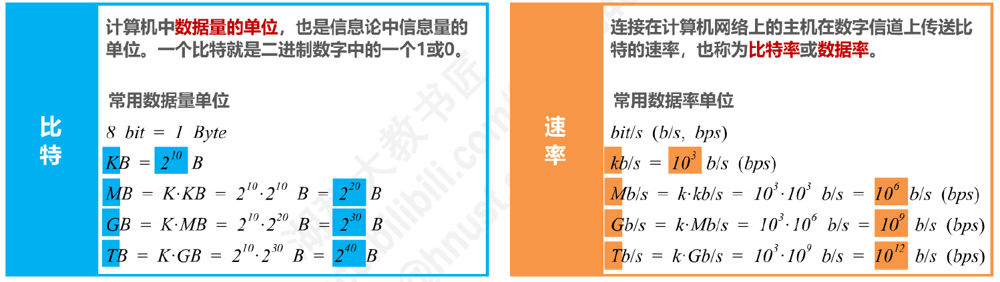
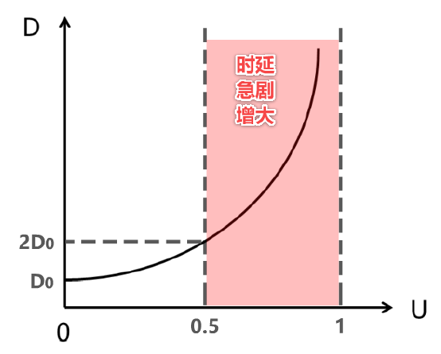
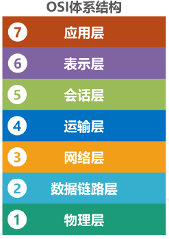
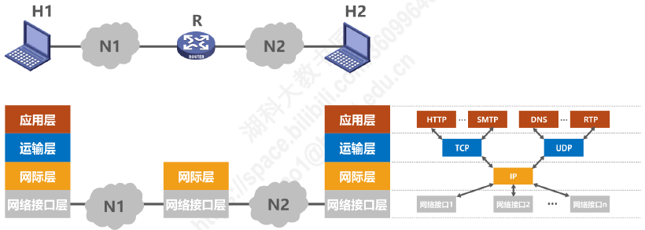
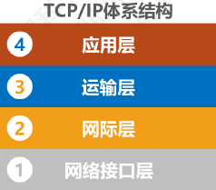
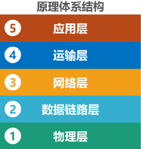
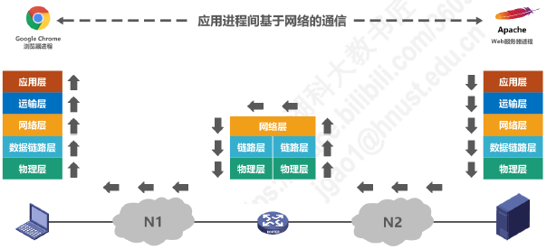
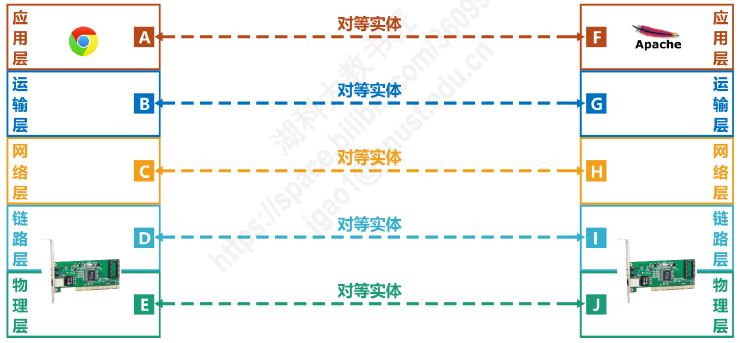
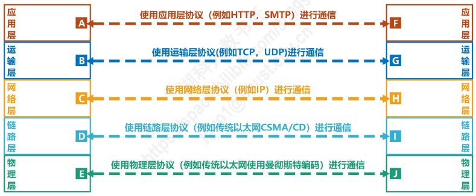
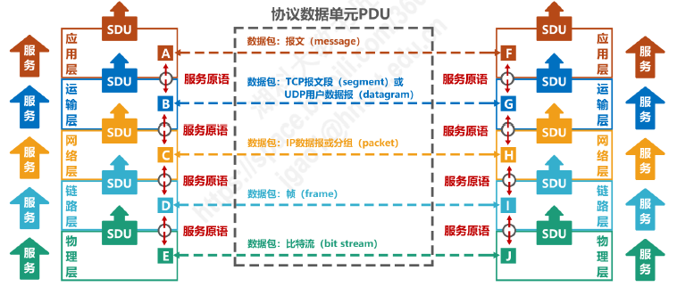

# 网络、互联网和因特网

- 网络（Network）：由若干**结点（Node）**和连接这些结点的**链路（Link）**组成
- 互联网（internet）：多个网络通过路由器互联起来，构成一个覆盖范围更大的网络，即 Network of Networks
- 因特网（Internet）：世界上最大的互联网络

# 三种交换方式

## 电路交换 Circuit Switching

- 电路交换：电话交换机接通电话线
- 电话交换的三个步骤：建立连接（分配通信资源）、通话（占用通信资源）、释放连接（归还通信资源）
- **优点**
  - 通信时延小
  - 有序传输
  - 没有冲突
  - 适用范围广
  - 实时性强
  - 控制简单
- **缺点**
  - 建立连接时间长
  - 线路独占，使用效率低
  - 灵活性差
  - 难以规格化

## 报文交换

- 不分组的交换方式
- **优点**
  - 无需建立连接
  - 动态分配线路
  - 提高线路可靠性
  - 提高线路利用率
  - 提供多目标服务
- **缺点**
  - 引起了转发时延
  - 需要较大存储缓存空间
  - 需要传输额外的信息量

## 分组交换 Packet Switching

- 发送方：构造分组，发送分组
- 路由器：缓存分组，转发分组
- 接收方：接收分组、还原报文
- **优点**
  - 无需建立连接
  - 线路利用率高
  - 简化了存储管理
  - 加速传输
  - 减少出错概率和重发数据量
- **缺点**
  - 引起了转发时延
  - 需要传输额外的信息量
  - 对于数据报服务，存在失序、丢失或重复分组的问题
  - 对于虚电路服务，存在呼叫建立、数据传输和虚电路释放三个过程

# 计算机网络的定义和分类

## 定义

- 简单定义：一些**互连**的、**自治**的计算机的**集合**
- 复杂定义：由一些通用的、可编程的硬件互连而成的，而这些硬件并非专门用来实现某一特定目的

## 分类

- 按**交换技术**分类
  - 电路交换网络
  - 报文交换网络
  - 分组交换网络
- 按**使用者**分类
  - 公用网
  - 专用网
- 按**传输介质**分类
  - 有线网络
  - 无线网络
- 按**覆盖范围**分类
  - 广域网 WAN
  - 城域网 MAN
  - 局域网 LAN
  - 个域网 PAN
- 按**拓扑结构**分类
  - 总线型网络
  - 星型网络
  - 环型网络
  - 网状型网络

# 计算机网络的性能指标

## 速率

- 连接在计算机网络上的主机在数字信道上传输比特的速率，也称为比特率或数据率
- 单位：bit/s（b/s，bps），kb/s，Mb/s，Gb/s，Tb/s

## 带宽

- 单位时间内从网络中的某一点到另一点所能通过的**“最高数据率”**
- 单位与速率单位相同

## 吞吐量

- 单位时间内通过某个网络（或信道、接口）的数据量
- 吞吐量受网络的带宽或额定速率的限制

## 时延

- $发送时延=\dfrac{分组长度(b)}{发送速率(b/s)}$
- $传播时延=\dfrac{信道长度(m)}{电磁波传播速率(m/s)}$
  - 自由空间：$3\times 10^8 m/s$
  - 铜线：$2.3\times 10^8 m/s$
  - 光纤：$2\times 10^8 m/s$
- $处理时延，一般不便于计算$

## 时延带宽积

- $时延带宽积=传播时延\times 带宽$
- 若发送端连续发送数据，则在所发送的第一个比特即将到达终点时，发送端就已经发送了时延带宽积个比特
- 链路的时延带宽积又称为**以比特为单位的链路长度**

## 往返时间 RTT

- 往返时间（Round-Trip Time，RTT）：双向交互一次所需的时间
- 广域以太网为例：一般而言，卫星链路耗时较多

## 利用率

- **信道利用率**：某信道有百分之几的时间是被利用的（有数据通过）
- **网络利用率**：全网络的信道利用率的加权平均
- **信道利用率并非越高越好**
  - 根据排队论，当某信道的利用增大时，该信道引起的时延也会迅速增加
- $D_0$表示网络空闲时的时延，$D$表示网络当前的时延，$U$表示利用率：
  - $D=\dfrac{D_0}{1-U}$

## 丢包率

- 丢包率即分组丢包率，是指在一定的时间范围内，传输过程中**丢失的分组数量与总分组数量的比率**
- 分组丢失的两个主要原因
  - **分组误码**
  - **网络堵塞**：结点交换机缓存队列已满

# 常见的计算机网络体系结构

## OSI体系结构

- OSI体系结构（Open System Interconnection Reference Model，OSI）：**开放式系统互联通信参考模型**，七层结构
- 法律上的国际标准

## TCP/IP 体系结构

- 四层结构
- 事实上的国际结构
- 路由器部分只包含网络接口层和网际层

## 原理体系结构

- 五层体系结构

## 各层次面临的问题

- **物理层**
  - **解决使用何种信号传输比特流的问题**
  - 采用何种物理接口
- **数据链路层**
  - **解决分组在一个网络（或一段链路）上传输的问题**
  - 如何标识网络中的各主机（**主机编址问题**，例如 MAC 地址）
  - 如何从比特流中区分出地址和数据
- **网络层**
  - **解决分组在多个网络上传输（路由）的问题**
  - 如何标识各网络以及网络中的各主机（**网络和主机共同编址问题**，例如 IP 地址）
  - 路由器如何转发分组，如何进行路由选择
- **传输层**
  - **解决进程之间基于网络的通信问题**
  - 如何处理传输错误
- **应用层**
  - **解决通过应用进程间的交互来实现特定的网络应用的问题**

## 应用进程间基于网络的通信

## 专用术语

### 实体

- 实体：任何可发送或接收信息的**硬件**或**软件进程**
- **对等实体**：收发双方处于**相同层次的实体**

### 协议

- 协议：控制两个对等实体进行**逻辑通信的规则的集合**

- 协议的三要素：
  - **语法**：定义所交换信息的格式
  - **语义**：定义收发双方所要完成的操作
  - **同步**：定义收发双方的时序关系

### 服务

- 在协议的控制下，两个对等实体间的逻辑通信使得本层能够向上一层提供服务，即要实现本层协议，需要使用下一层所提供的的服务

### 服务访问点

- 在同一系统中**相邻两层的实体交换信息的逻辑接口**，用于区分不同的服务类型
- **数据链路层**的服务访问点：**帧的“类型”字段**
- **网络层**的服务访问点：**IP 数据报首部的“协议字段”**
- **运输层**的服务访问点：**端口号**

### 服务原语

- 上层使用下层所提供的服务必须通过与下层交换一些命令，这些命令称为服务原语

### 协议数据单元 PDU

- 对等层次之间传送的数据包

### 服务数据单元 SDU

- 同一系统内，层与层之间交换的数据包
- 多个 SDU 可以合成为一个 PDU，一个 SDU 也可划分为几个 PDU

